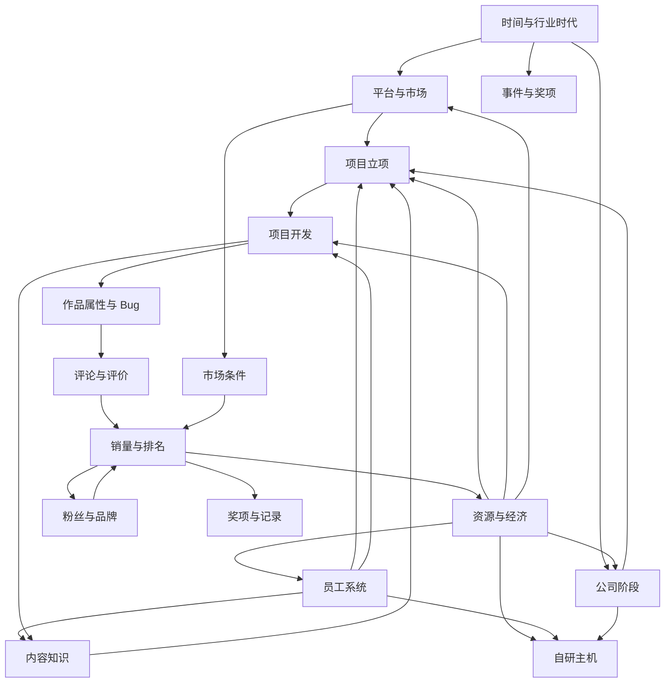

# 《游戏发展国》系统地图

> English Title: Game Dev Story  
> Japanese Title: ゲーム発展国++  
> Document Type: System Map  
> Status: V1  
> Path: `design/case-studies/game-dev-story/05-system-map.md`  
> Analysis Version: 1.0  
> Last Updated: 2026-07-11  
> Analysis Method: Observable Design Analysis  
> Source Code Required: No

---

## 1. 文档目的

本文件将《游戏发展国》的设计拆成统一系统地图，重点回答：

```text
有哪些核心系统；
每个系统拥有和改变什么状态；
系统之间交换哪些资源与结果；
哪些系统是枢纽；
正反馈和限制机制如何传播；
为什么早中期系统张力强，而后期逐渐转向数值优化。
```

这是一份设计层系统地图，不代表真实源码目录。

---

## 2. 系统域

```text
Game Dev Story
├─ Company
│  ├─ Cash
│  ├─ Office
│  ├─ Salary
│  ├─ Fans
│  └─ Company Stage
├─ Staff
│  ├─ Hiring
│  ├─ Stats
│  ├─ Stamina
│  ├─ Career
│  ├─ Level
│  ├─ Training
│  └─ Salary Cost
├─ Project
│  ├─ Planning
│  ├─ Platform
│  ├─ Genre
│  ├─ Type
│  ├─ Direction
│  ├─ Internal / External Staff
│  ├─ Development Attributes
│  ├─ Random Events
│  ├─ Bugs
│  └─ Debug
├─ Content Knowledge
│  ├─ Genre Unlock
│  ├─ Type Unlock
│  ├─ Combination Knowledge
│  ├─ Genre Level
│  ├─ Type Level
│  └─ Sequel / Series
├─ Platform and Market
│  ├─ Availability
│  ├─ License
│  ├─ User Base
│  ├─ Lifecycle
│  ├─ Advertising
│  └─ Own Console
├─ Review and Sales
│  ├─ Review Score
│  ├─ Weekly Sales
│  ├─ Ranking
│  ├─ Revenue
│  ├─ Fans
│  └─ Awards
├─ Progression
│  ├─ Staff Growth
│  ├─ Office Expansion
│  ├─ Content Unlock
│  ├─ Platform Access
│  └─ Endgame Access
└─ Feedback
   ├─ Character Animation
   ├─ Number Popups
   ├─ Sound
   ├─ News
   ├─ Review Ceremony
   ├─ Sales Milestones
   └─ Awards
```

---

## 3. 高层关系图



---

## 4. 五个核心枢纽

### 4.1 Project：系统交易中心

项目把以下输入汇合：

```text
公司资源
+
员工能力
+
内容知识
+
平台市场
+
玩家方向选择
```

再输出：

```text
作品属性
评论
销量
现金
粉丝
经验
奖项
解锁
```

因此项目是全部主要系统交换价值的中心对象。

### 4.2 Staff：生产与成长中心

员工同时连接：

- 项目质量；
- 项目速度；
- 体力；
- Bug；
- 内容解锁；
- 职业成长；
- 工资；
- 自研主机。

员工既是生产单位，也是长期成长容器。

### 4.3 Cash：战略自由度中心

现金用于：

- 工资；
- 招聘；
- 培训；
- 平台授权；
- 项目；
- 外部专家；
- 宣传；
- 办公室；
- 主机开发。

现金本身不是胜利，它决定玩家能承担多少选择。

### 4.4 Platform：外部环境中心

平台连接：

- 授权成本；
- 用户规模；
- 项目市场；
- 销量上限；
- 行业时代；
- 自研主机。

平台是玩家无法完全控制的外部变化来源。

### 4.5 Fans：品牌复利中心

```text
成功作品
→ 粉丝增加
→ 下一作品市场基础提高
→ 更高销量
→ 更多粉丝
```

粉丝把一次成功变成长期优势。

---

## 5. 公司系统

### 5.1 职责

管理：

- 现金；
- 办公室；
- 员工容量；
- 固定工资；
- 粉丝；
- 公司阶段；
- 历史记录。

### 5.2 状态

- Cash；
- Office Tier；
- Staff Capacity；
- Salary Liability；
- Fan Count；
- Company Stage；
- Expansion Eligibility；
- Company Records。

### 5.3 输入

- 游戏销售；
- 外包收入；
- 奖项或事件；
- 工资；
- 招聘；
- 培训；
- 授权；
- 宣传；
- 扩张；
- 主机开发。

### 5.4 输出

- 项目预算；
- 招聘能力；
- 平台进入能力；
- 办公室扩张；
- 终局资格。

### 5.5 设计作用

公司系统把项目结果转化为长期经营能力。

---

## 6. 员工系统

### 6.1 状态

每名员工拥有：

- Staff ID；
- Career；
- Career Level；
- Stats；
- Stamina；
- Salary；
- Training History；
- Completed Careers；
- Availability。

### 6.2 输入

- 招聘；
- 项目工作；
- 训练；
- 升级；
- 转职；
- 研究点；
- 时间恢复；
- 特殊事件。

### 6.3 输出

- 开发属性；
- Bug 风险；
- 项目效率；
- 内容解锁；
- 工资压力；
- 高阶职业；
- 主机开发资格。

### 6.4 核心张力

```text
即时生产力
-
长期工资成本
+
成长潜力
```

---

## 7. 招聘、培训与职业

### 7.1 招聘

输入：

- 招聘渠道；
- 预算；
- 公司阶段；
- 工位容量。

输出：

- 候选员工；
- 招聘成本；
- 工资变化；
- 团队能力变化。

### 7.2 培训

输入：

- 员工；
- 培训项目；
- 现金；
- 研究点；
- 当前职业。

输出：

- 属性成长；
- 内容解锁；
- 资源消耗；
- 员工状态变化。

### 7.3 职业与转职

```text
职业
→ 职业等级
→ 职业完成
→ 转职
→ 跨职业积累
→ 高阶职业
```

职业系统连接员工成长、内容解锁和终局条件。

---

## 8. 项目立项系统

### 8.1 项目定义

- Project ID；
- Title；
- Platform；
- Genre；
- Type；
- Direction；
- Budget；
- Assigned Staff；
- Outsource Choice；
- Start Time。

### 8.2 输入

- 公司现金；
- 平台授权；
- 内容解锁；
- 员工可用性；
- 已知组合；
- 市场状态。

### 8.3 输出

- 项目身份；
- 初始成本；
- 风险水平；
- 开发阶段；
- 市场潜力。

### 8.4 项目身份公式

```text
Platform
+
Genre
+
Type
+
Direction
+
Team
=
具体作品
```

---

## 9. 项目开发系统

### 9.1 状态

- Project Phase；
- Development Progress；
- Fun；
- Creativity；
- Graphics；
- Sound；
- Bugs；
- Staff Assignment；
- Outsource Result；
- Special Events；
- Debug State。

### 9.2 输入

- 员工属性；
- 员工体力；
- 项目方向；
- 外部专家；
- 研究投入；
- 随机事件。

### 9.3 输出

- 最终作品属性；
- Bug；
- 项目时间；
- 研究点；
- 员工成长；
- 可发行状态。

### 9.4 设计作用

开发系统把高层立项决策转化为可见的生产过程。

---

## 10. 开发属性

复杂作品质量被压缩为少量维度，例如：

- Fun；
- Creativity；
- Graphics；
- Sound。

### 10.1 输入来源

- 阶段负责人；
- 全体员工；
- 项目方向；
- 外部专家；
- 特殊事件。

### 10.2 输出用途

- 评论；
- 销量；
- 奖项；
- 记录。

### 10.3 取舍

优点：

- 易理解；
- 易反馈；
- 易比较。

风险：

- 后期高总属性可能压过组合和市场判断。

---

## 11. Bug 与 Debug

### 11.1 输入

- 普通开发；
- 随机失败；
- 项目规模；
- 员工能力。

### 11.2 输出

- 项目延迟；
- 体力消耗；
- 研究点；
- 可发行状态。

### 11.3 设计模式

```text
负面状态
→ 处理成本
→ 次级成长资源
```

Bug 既是风险，也是开发主题表达。

---

## 12. 外包系统

游戏中存在两种方向相反的外包关系。

### 12.1 承接外包工作

```text
卖出公司能力
→ 获得稳定现金和研究
```

职责：

- 早期生存；
- 失败恢复；
- 工资保障；
- 过渡。

### 12.2 使用外部专家

```text
支付现金
→ 购买临时高能力
```

职责：

- 弥补团队短板；
- 提高当前项目质量；
- 避免培养尚未完成造成的限制。

---

## 13. 内容知识系统

### 13.1 状态

- Unlocked Genres；
- Unlocked Types；
- Genre Level；
- Type Level；
- Known Combination Ratings；
- Series History。

### 13.2 输入

- 员工职业；
- 培训；
- 项目完成；
- 重复开发；
- 公司进度；
- 特殊条件。

### 13.3 输出

- 新项目选项；
- 组合评价；
- 专精收益；
- 探索目标；
- 系列机会。

### 13.4 双重知识

```text
玩家记住规律
+
公司等级记录熟练度
```

---

## 14. Genre × Type 组合系统

### 14.1 输入

```text
一个 Genre
+
一个 Type
```

### 14.2 输出

- 相性；
- 市场潜力；
- 作品表现修正；
- 玩家预期；
- 长期经验。

### 14.3 知识阶段

```text
未知
→ 已尝试
→ 已理解
→ 固定最优解
```

### 14.4 长期风险

当组合完全查表化后，探索系统退化为配方执行。

---

## 15. 平台系统

### 15.1 状态

- Platform ID；
- Availability；
- License Status；
- User Base；
- Lifecycle State；
- Development Cost；
- Market Potential。

### 15.2 输入

- 时间；
- 行业事件；
- 玩家授权；
- 公司资金；
- 自研主机。

### 15.3 输出

- 可开发平台；
- 项目成本；
- 销量上限；
- 市场机会；
- 长期战略变化。

### 15.4 生命周期

```text
Announced
→ Launched
→ Growing
→ Mature
→ Declining
→ Retired
```

平台生命周期负责制造外部时代变化。

---

## 16. 市场与宣传系统

### 16.1 市场输入

- 平台用户量；
- 作品属性；
- 评论；
- 粉丝；
- 宣传；
- 组合；
- 公司品牌。

### 16.2 市场输出

- 首周销量；
- 周销量；
- 排名；
- 销售寿命；
- 收入；
- 粉丝增长。

### 16.3 宣传

宣传把：

```text
现金
```

转化为：

```text
市场触达和销量潜力。
```

宣传使商业结果不只由作品质量决定。

---

## 17. 评论系统

### 17.1 输入

- 作品属性；
- 组合；
- 类型与题材等级；
- 项目质量；
- 其他修正。

### 17.2 输出

- 评论分数；
- 综合质量判断；
- 市场预期；
- 玩家情绪。

### 17.3 系统职责

评论是：

```text
质量结算
+
项目仪式。
```

它回答“作品做得好不好”。

---

## 18. 销量系统

### 18.1 状态

- Weekly Sales；
- Total Sales；
- Ranking；
- Revenue；
- Sales Lifecycle；
- Milestones。

### 18.2 输入

- 评论；
- 平台用户；
- 粉丝；
- 宣传；
- 组合；
- 市场状态。

### 18.3 输出

- 现金；
- 粉丝；
- 公司记录；
- 奖项资格；
- 下一轮投资能力。

### 18.4 系统职责

销量是商业结算，回答“市场是否接受作品”。

---

## 19. 奖项、记录与系列

### 19.1 奖项输入

- 高评价；
- 高销量；
- 项目质量；
- 时间节点；
- 公司表现。

### 19.2 奖项输出

- 行业认可；
- 声望；
- 高阶目标；
- 记录；
- 续作价值。

### 19.3 系列

系列把过去作品的成功延续到新项目，增加品牌连续性。

---

## 20. 粉丝与品牌

### 20.1 输入

- 作品销量；
- 高评价；
- 宣传；
- 奖项；
- 系列。

### 20.2 输出

- 新作市场基础；
- 销量潜力；
- 公司阶段；
- 行业地位。

### 20.3 系统职责

粉丝是历史成功的永久资本。

---

## 21. 公司扩张

### 21.1 输入

- 现金；
- 公司进度；
- 项目成功；
- 扩张条件。

### 21.2 输出

- 更大办公室；
- 更多工位；
- 更高员工容量；
- 更高固定工资；
- 更强总生产能力。

### 21.3 核心张力

```text
更高能力
+
更高固定成本
```

办公室将抽象成长转化为空间和组织变化。

---

## 22. 自研主机

### 22.1 输入

- 大量现金；
- 高阶员工；
- 特定职业；
- 公司规模；
- 行业经验。

### 22.2 输出

- 自有平台；
- 新市场；
- 身份升级；
- 终局目标；
- 后续作品平台。

### 22.3 系统职责

```text
Endgame Sink
+
System Convergence
+
Identity Escalation
```

自研主机汇合此前的经济、人才、职业与组织成长。

---

## 23. 时间与事件

### 23.1 时间推动

- 员工行动；
- 项目开发；
- 体力恢复；
- 工资；
- 销量；
- 平台生命周期；
- 奖项；
- 行业时代。

### 23.2 事件类型

- 员工挑战；
- 灵感；
- 推销员；
- 平台新闻；
- 解锁；
- 奖项；
- 公司事件。

### 23.3 系统作用

时间让多个状态机同时推进，事件负责打断机械重复。

---

## 24. 状态归属表

| State | Authority | Main Readers | Main Writers |
|---|---|---|---|
| Cash | Company | Project, Hiring, Training, Platform | Sales, Outsource, Expenses |
| Staff Stats | Staff | Development, Endgame | Training, Career, Projects |
| Stamina | Staff | Development | Work, Rest |
| Project Definition | Project | Development, Review, Sales | Player Choice |
| Project Attributes | Development | Review, Awards | Staff, Outsource, Events |
| Bugs | Development | Debug | Development, Events |
| Genre Unlock | Content Knowledge | Project | Career, Training |
| Type Unlock | Content Knowledge | Project | Career, Training |
| Combination Knowledge | Knowledge / Player | Project | Project Results |
| Platform Users | Platform | Project, Sales | Time and Lifecycle |
| Reviews | Review | Sales, Awards | Project Results |
| Sales | Sales | Company, Fans, Awards | Market |
| Fans | Brand | Sales, Company | Sales, Advertising |
| Office Tier | Company | Hiring, Development | Expansion |
| Awards | Awards | Company, Endgame | Review and Sales |
| Own Console | Endgame / Platform | Project, Market | Console Development |

---

## 25. 主要事件流

### 25.1 创建项目

```text
玩家选择项目
→ 创建 Project Definition
→ 扣除成本
→ 分配员工
→ 进入开发
```

### 25.2 员工贡献

```text
员工行动
→ 增加作品属性
→ 消耗体力
→ 可能增加 Bug
→ 播放反馈
```

### 25.3 项目完成

```text
开发完成
→ Debug
→ 项目定稿
→ 触发评论
```

### 25.4 评论与销售

```text
生成评论
→ 更新质量判断
→ 进入销售
→ 周期计算销量
→ 增加收入和粉丝
```

### 25.5 员工成长

```text
获得研究与经验
→ 训练 / 升级 / 转职
→ 属性提高
→ 检查内容解锁
```

### 25.6 平台变化

```text
时间推进
→ 平台状态变化
→ 用户量变化
→ 项目战略变化
```

---

## 26. 正反馈循环

### 26.1 资金复利

```text
高销量
→ 高收入
→ 更强投入
→ 更高质量
→ 更高销量
```

### 26.2 人才复利

```text
项目经验
→ 员工成长
→ 更高贡献
→ 更高项目质量
→ 更多成长资源
```

### 26.3 品牌复利

```text
成功作品
→ 粉丝
→ 新作销量基础提高
→ 更多成功作品
```

### 26.4 知识复利

```text
尝试组合
→ 获得知识
→ 更优立项
→ 更少失败
→ 更多探索资源
```

### 26.5 组织复利

```text
收入
→ 办公室扩张
→ 更多员工
→ 更高总产出
→ 更高收入
```

---

## 27. 限制循环

### 27.1 工资

```text
员工增强
→ 工资增加
→ 固定成本上升
→ 需要更稳定销售
```

### 27.2 授权

```text
进入平台
→ 支付授权
→ 现金下降
→ 需要项目回收
```

### 27.3 体力

```text
持续工作
→ 体力下降
→ 休息或轮换
```

### 27.4 Bug

```text
生产
→ Bug
→ Debug
→ 项目延迟
```

### 27.5 平台衰退

```text
用户下降
→ 销量潜力下降
→ 迫使平台迁移
```

---

## 28. 恢复循环

### 28.1 现金恢复

```text
现金不足
→ 做外包
→ 稳定收入
→ 支付工资
→ 返回自研
```

### 28.2 项目失败恢复

```text
低销量
→ 保留经验与知识
→ 选择成熟组合
→ 降低成本
→ 再次尝试
```

### 28.3 员工恢复

```text
体力不足
→ 休息 / 轮换 / 使用外部专家
→ 恢复
→ 再投入
```

恢复循环使失败主要造成减速，而不是清零。

---

## 29. 系统耦合强度

### 29.1 强耦合

- Staff ↔ Development；
- Development ↔ Review；
- Review ↔ Sales；
- Sales ↔ Company；
- Company ↔ Staff；
- Platform ↔ Sales；
- Content Knowledge ↔ Project；
- Company / Staff ↔ Endgame。

### 29.2 中等耦合

- Awards ↔ Progression；
- Advertising ↔ Sales；
- Events ↔ Development；
- Fans ↔ Sales；
- Office ↔ Staff。

### 29.3 设计结果

系统深度主要不是来自单个系统，而是来自共享资源和跨系统后果。

---

## 30. 单点关键系统

### 30.1 Development

若开发过程没有可见反馈，核心体验会变成等待。

### 30.2 Review and Sales

若结算没有情绪与经济意义，项目失去高潮。

### 30.3 Staff Progression

若员工不成长，长期生产能力不会改变。

### 30.4 Cash Economy

若现金无限，经营取舍消失。

### 30.5 Platform Lifecycle

若平台不变化，成熟策略会长期固定。

---

## 31. 早中后期系统健康

### 31.1 早期

- 现金有限；
- 人员有限；
- 内容有限；
- 平台有限；
- 失败有压力。

系统互相制约明显。

### 31.2 中期

- 新系统持续开放；
- 多种资源都重要；
- 复利开始形成；
- 项目仍有风险；
- 平台不断变化。

这是系统张力最丰富的阶段。

### 31.3 后期

- 现金约束下降；
- 顶级员工稳定产出；
- 组合答案固定；
- 外部平台压力下降；
- 评论结果趋于可预测。

系统从互相制约转向共同放大。

---

## 32. 中后期失衡

### 32.1 Cash 失去约束

工资、授权、宣传和外包成本不再重要。

### 32.2 Staff 数值碾压

高属性员工削弱岗位差异和项目风险。

### 32.3 Knowledge 查表化

组合探索变成固定答案。

### 32.4 Platform 压力下降

玩家熟悉平台周期，或自研主机降低外部依赖。

### 32.5 Review 悬念下降

项目属性稳定过高后，评价更容易预测。

### 32.6 核心原因

```text
成长系统持续增强，
限制系统却没有同步升级。
```

---

## 33. 可复用架构模式

### 33.1 Central Project Object

使用一个项目对象连接员工、资源、内容、市场和结算。

### 33.2 Multi-Capital Progression

同时积累：

- 财务资本；
- 人才资本；
- 知识资本；
- 品牌资本；
- 组织资本。

### 33.3 Safe Loop + Growth Loop

低风险循环负责恢复，高风险循环负责真正成长。

### 33.4 External Lifecycle

外部时代变化迫使成熟策略迁移。

### 33.5 Dual Settlement

分别结算作品质量和市场结果。

### 33.6 Negative State Conversion

负面状态经过处理后产生次级成长。

### 33.7 Endgame Convergence

多个成长系统在终局汇合为身份升级。

---

## 34. 现代化扩展方向

### 34.1 Audience System

增加受众，让市场不只由平台用户量决定。

### 34.2 Team Synergy

增加：

- 特质；
- 协同；
- 冲突；
- 项目适配；
- 工作方式。

### 34.3 IP System

让作品形成：

- IP；
- 系列；
- 授权；
- 长尾；
- 品牌组合。

### 34.4 Post-Launch Lifecycle

作品发行后继续拥有：

- 更新；
- DLC；
- 维护；
- 社区；
- 口碑变化。

### 34.5 Competitor System

竞争者影响平台、人才、市场与奖项。

### 34.6 Multi-Team Organization

后期从单项目工作室升级为多团队公司。

---

## 35. 系统地图检查表

### 核心系统

- [x] Company；
- [x] Staff；
- [x] Project；
- [x] Content Knowledge；
- [x] Platform；
- [x] Market；
- [x] Review；
- [x] Sales；
- [x] Progression；
- [x] Endgame。

### 状态归属

- [x] Cash 归 Company；
- [x] 属性与职业归 Staff；
- [x] 作品属性和 Bug 归 Project；
- [x] 用户量归 Platform；
- [x] 销量归 Sales；
- [x] 粉丝归 Brand；
- [x] 奖项归公司历史。

### 事件流

- [x] 项目创建；
- [x] 员工贡献；
- [x] Debug；
- [x] 评论；
- [x] 销售；
- [x] 员工成长；
- [x] 平台变化。

### 循环

- [x] 资金复利；
- [x] 人才复利；
- [x] 品牌复利；
- [x] 知识复利；
- [x] 组织复利；
- [x] 外包恢复。

### 长期风险

- [x] 资金约束失效；
- [x] 员工数值碾压；
- [x] 组合查表化；
- [x] 平台压力下降；
- [x] 评论悬念下降。

---

## 36. 核心结论

### 36.1 项目是中心对象

全部主要系统都通过项目交换价值。

### 36.2 员工是最重要的长期资产

员工同时决定生产、成长、解锁、成本和终局。

### 36.3 多资本结构支撑复利

现金、员工、知识、粉丝和组织共同形成成长。

### 36.4 平台负责外部变化

它防止公司只优化内部系统。

### 36.5 评论和销量是核心结算

评论负责质量，销量负责商业，奖项负责行业地位。

### 36.6 限制系统集中在早中期

工资、体力、授权和平台衰退有效限制早中期，但不足以对抗后期复利。

### 36.7 自研主机是系统汇合点

它完成身份升级，但没有建立完全不同的新核心循环。

---

## 37. 与后续文档的关系

本文件定义：

```text
游戏由哪些系统组成，以及系统之间如何连接。
```

后续文档将继续深入：

- `06-company-and-economy.md`：现金、工资、外包、授权和扩张；
- `07-staff-and-careers.md`：员工、职业、训练和长期人才资本；
- `08-game-development.md`：项目阶段、属性、Bug 和随机事件；
- `09-genres-types-and-discovery.md`：组合、知识、专精和探索；
- `10-platforms-and-market.md`：平台生命周期、宣传和市场；
- `11-reviews-sales-and-awards.md`：评论、销量、奖项和品牌回流。

---

## 38. 总结

《游戏发展国》的系统结构可以概括为：

```text
公司提供资源，
员工提供能力，
内容知识定义项目可能性，
平台提供外部市场，
项目把所有输入转化为作品，
评论和销量完成结算，
结果再回到公司、员工、知识和品牌，
最终汇合到自研主机。
```

它最值得借鉴的地方是：

```text
没有单个系统特别复杂，
但每个系统都连接多个循环。
```

其主要长期问题也来源于同一结构：

```text
成长系统不断增强，
限制系统没有同步升级。
```

因此早中期形成丰富的系统张力，后期逐渐转向数值优化和记录挑战。
