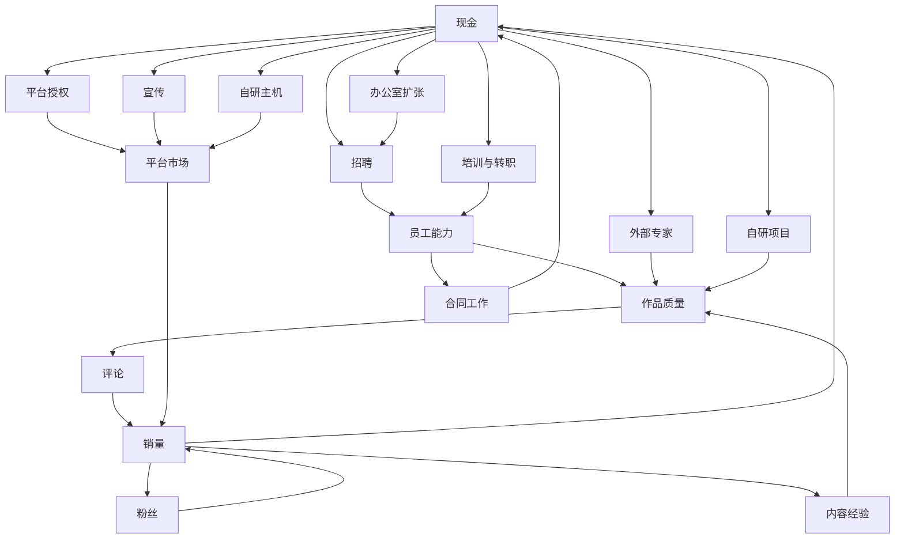

# 《游戏发展国》公司与经济系统分析

> English Title: Game Dev Story  
> Japanese Title: ゲーム発展国++  
> Document Type: Company and Economy Analysis  
> Status: V1  
> Path: `design/case-studies/game-dev-story/06-company-and-economy.md`  
> Analysis Version: 1.0  
> Last Updated: 2026-07-12  
> Analysis Method: Observable Design Analysis  
> Source Code Required: No

---

## 1. 文档目的

本文件分析《游戏发展国》的公司经营与经济结构，重点回答：

```text
现金如何进入和离开公司；
外包与自研项目分别承担什么职责；
工资、招聘、培训、授权、宣传和扩张如何形成机会成本；
为什么早期经济压力强、中期选择最丰富、后期现金逐渐失去约束；
作品成功如何形成多轨复利；
项目失败后为什么仍有恢复路径；
办公室和自研主机如何承担大型资本投入与身份成长。
```

本文件不以最优赚钱攻略为目标，也不列出所有项目、平台和员工的精确数值。

---

## 2. 事实基础与分析边界

可稳定确认的基础结构包括：

- 玩家经营游戏公司；
- 可以招聘和训练员工；
- 员工会形成持续成本；
- 公司可以承接合同工作；
- 自研游戏能够产生销量和收入；
- 开发游戏需要选择 Genre、Type 和平台；
- 新平台提供新的市场机会；
- 公司可以扩大办公室；
- 后期可以开发自有主机。

本文把“系统为何如此设计”视为分析推断，而不是官方公开意图。

---

## 3. 一句话经济定义

```text
《游戏发展国》的经济系统，
是一个以项目为投资单位、
以销量为主要现金回报、
以员工、知识、粉丝和办公室为长期资本、
以合同工作为失败恢复路径的轻量复利经济。
```

---

## 4. 经济系统的核心问题

玩家反复回答：

```text
当前这笔钱应该用于生存、能力建设，还是高风险增长？
```

具体包括：

- 保留现金还是开始新项目；
- 做合同还是制作自己的游戏；
- 培养旧员工还是招聘新员工；
- 使用内部人员还是外部专家；
- 留在旧平台还是购买新平台授权；
- 节省宣传还是放大作品市场；
- 保持小团队还是扩大办公室；
- 保留储备还是投入自研主机。

经济深度来自这些用途之间的机会成本，而不是复杂财务报表。

---

## 5. 经济对象总览

```text
Company Economy
├─ Cash
├─ Revenue
│  ├─ Contract Income
│  ├─ Game Sales
│  ├─ Awards / Events
│  └─ Console-related Income
├─ Fixed Costs
│  └─ Staff Salary
├─ Variable Costs
│  ├─ Project Cost
│  ├─ Hiring
│  ├─ Training
│  ├─ Career Change
│  ├─ External Specialists
│  ├─ Platform License
│  ├─ Advertising
│  ├─ Office Expansion
│  └─ Console Development
├─ Long-Term Capital
│  ├─ Staff Capability
│  ├─ Genre / Type Mastery
│  ├─ Fans
│  ├─ Office Capacity
│  ├─ Platform Access
│  └─ Company Reputation
└─ Risk Controls
   ├─ Cash Reserve
   ├─ Contract Work
   ├─ Low-cost Projects
   ├─ Mature Combinations
   └─ Delayed Expansion
```

---

## 6. 现金的四种职责

### 6.1 生存资源

用于支付：

- 工资；
- 基础项目成本；
- 必要经营行为。

现金不足首先威胁公司持续行动能力。

### 6.2 投资资源

用于：

- 招聘；
- 培训；
- 转职；
- 平台授权；
- 办公室；
- 自研主机。

这些投入不会立即产生现金，而是改善未来生产能力。

### 6.3 风险预算

用于承担：

- 新组合；
- 新平台；
- 高成本项目；
- 高宣传；
- 外部专家；
- 大型扩张。

### 6.4 选择权资源

现金真正决定的是：

```text
当前有哪些行为对玩家开放。
```

现金越充足，公司越能提前进入平台、补齐员工短板、承担失败和抓住机会。

---

## 7. 收入结构

### 7.1 合同收入

特点：

- 收益较明确；
- 风险较低；
- 周期较短；
- 长期复利弱；
- 可提供研究和员工实践。

系统职责：

```text
保证公司不会因一次失败永久失去行动能力。
```

### 7.2 游戏销售收入

特点：

- 需要前期投入；
- 结果不确定；
- 收益上限高；
- 与评论、平台、粉丝和宣传相关；
- 随销售周期衰减。

系统职责：

```text
提供真正的公司成长动力。
```

### 7.3 奖项与事件收入

属于非稳定额外奖励，通常不承担基础现金流职责。

### 7.4 自研主机相关回报

属于终局级经济行为，同时具有平台、身份和长期市场意义。

---

## 8. 合同工作：安全循环

### 8.1 基础流程

```text
选择合同
→ 使用员工时间与体力
→ 在期限内完成
→ 获得较确定报酬
→ 支付日常成本
→ 重新准备自研项目
```

### 8.2 投入

- 员工时间；
- 员工体力；
- 自研项目的机会成本。

### 8.3 产出

- 稳定现金；
- 研究；
- 早期练习；
- 失败恢复能力。

### 8.4 不提供的主要价值

合同通常不会提供同等程度的：

- 粉丝；
- 品牌；
- 奖项；
- 系列；
- 高销量记录；
- 平台影响力。

### 8.5 为什么必须“够用但不最优”

若收益太低，失败后无法恢复。

若收益太高，玩家会回避自研风险。

因此其理想定位是：

```text
能够维持生存，
但不能替代成长。
```

---

## 9. 自研项目：成长循环

### 9.1 基础流程

```text
支付成本
→ 选择平台、Genre、Type 与团队
→ 完成开发
→ 获得评论
→ 进入销售
→ 回收现金
→ 获得粉丝、经验与品牌
```

### 9.2 主要投入

- 基础开发费；
- 平台成本；
- 外部专家；
- 宣传；
- 员工体力；
- 研究资源；
- 时间。

### 9.3 主要回报

- 现金；
- 粉丝；
- Genre / Type 经验；
- 员工成长；
- 研究；
- 奖项；
- 系列；
- 公司记录。

### 9.4 亏损作品仍可能保留价值

即使销量不佳，项目仍可能：

- 培养员工；
- 提供研究；
- 增加内容熟练度；
- 验证组合；
- 提高玩家知识。

因此项目失败通常不是零收益。

---

## 10. 固定成本：员工工资

### 10.1 系统职责

工资让员工不再是免费永久战力。

```text
拥有这支团队
=
持续承担责任。
```

### 10.2 对招聘的影响

强员工意味着：

- 更高能力；
- 更高招聘成本；
- 更高长期工资。

招聘不能只看面板数值。

### 10.3 对扩张的影响

```text
办公室扩大
→ 工位增加
→ 招聘增加
→ 总能力提高
→ 总工资提高
```

### 10.4 早期作用

早期收入有限，工资会明显影响：

- 项目失败承受力；
- 招聘时机；
- 现金储备；
- 是否需要做合同。

### 10.5 后期衰减

当单款成功游戏收入远高于工资后：

- 固定成本不再形成有效压力；
- 员工选择逐渐变成纯能力优化；
- 经营张力下降。

---

## 11. 项目开发费

### 11.1 作用

每个项目都需要投入，使“再做一款”不是零成本行为。

### 11.2 设计价值

- 限制无风险试验；
- 让项目失败有经济后果；
- 让公司阶段和项目规模相关；
- 保留合同工作的恢复价值。

### 11.3 阶段变化

早期：

```text
每款游戏都是明显赌注。
```

后期：

```text
开发费逐渐变成流程费用。
```

---

## 12. 招聘成本与工位约束

### 12.1 一次性与持续成本

招聘同时带来：

- 招聘费；
- 新工资；
- 工位占用。

### 12.2 主要收益

- 立即提高能力；
- 补齐岗位；
- 缩短培养时间；
- 解锁高阶路线；
- 准备终局条件。

### 12.3 核心判断

```text
新员工带来的未来额外收益，
是否值得当前费用、工资和工位。
```

### 12.4 替换决策

工位有限时，玩家必须判断：

- 保留旧员工；
- 继续培养；
- 招聘更强员工；
- 淘汰低价值员工。

因此员工容量是一种隐性的经济资源。

---

## 13. 培训与转职投资

### 13.1 培训公式

```text
现金 / 研究
→ 员工属性
→ 未来作品质量
→ 未来收入
```

### 13.2 延迟回报

培训价值取决于员工未来还能参与多少项目。

### 13.3 转职价值

转职可能带来：

- 新成长空间；
- 新内容解锁；
- 高阶职业；
- 主机开发条件。

### 13.4 机会成本

同一笔资源可以用于：

- 当前核心员工；
- 高潜员工；
- 补短板员工；
- 终局前置员工；
- 当前项目。

培训系统把经济决策与人才规划直接耦合。

---

## 14. 外部专家：购买临时能力

### 14.1 基础转换

```text
现金
→ 当前项目的专项贡献
```

### 14.2 适用场景

- 内部能力不足；
- 核心员工疲劳；
- 某项作品属性薄弱；
- 当前项目价值高；
- 希望降低项目风险。

### 14.3 与员工培养的区别

```text
外部专家：即时、一次性、无长期工资
内部培养：缓慢、永久、持续产生价值
```

### 14.4 核心张力

```text
购买当前项目质量
vs
建设长期生产能力
```

### 14.5 后期问题

现金充足后，外部专家成本可能被忽略，选择退化为默认最高配置。

---

## 15. 平台授权经济

### 15.1 授权职责

支付成本进入新的平台市场。

### 15.2 潜在回报

- 更大用户量；
- 更高销量上限；
- 新时代机会；
- 更长的未来项目窗口。

### 15.3 时机风险

过早：

- 用户量尚低；
- 现金被占用；
- 团队能力可能不足。

过晚：

- 错过增长期；
- 剩余生命周期缩短；
- 旧平台已经衰退。

### 15.4 决策公式

```text
授权成本
+
未来项目成本
+
公司当前能力
vs
平台当前与未来市场
```

### 15.5 软门槛

玩家可能“买得起”，但未必“应该买”。

这比单纯的硬锁更有经营意义。

---

## 16. 宣传经济

### 16.1 基础转换

```text
现金
→ 市场触达
→ 销量和粉丝潜力
```

### 16.2 宣传不是质量替代品

更合理的关系是：

```text
作品质量
×
平台市场
×
宣传触达
=
商业表现
```

### 16.3 宣传时机

玩家需要判断：

- 作品是否值得放大；
- 现金储备是否足够；
- 是否需要快速积累粉丝；
- 是否在冲击销量记录。

### 16.4 后期问题

当现金无压力时，最高宣传可能成为固定按钮。

此时宣传不再是决策，只是流程步骤。

---

## 17. 办公室扩张

### 17.1 投入

- 大额现金；
- 更高未来工资；
- 更高管理成本。

### 17.2 产出

- 更多工位；
- 更多员工；
- 更高总生产能力；
- 新团队结构；
- 更大合同和项目机会；
- 可见的空间成长。

### 17.3 双重身份

办公室既是：

```text
成长奖励
```

也是：

```text
下一阶段投资。
```

### 17.4 时机

过早：

- 容量无法利用；
- 工资和招聘压力增加；
- 储备下降。

过晚：

- 团队上限受限；
- 人才机会浪费；
- 发展速度下降。

---

## 18. 自研主机：终局资本投入

### 18.1 主要投入

- 大量现金；
- 高阶人才；
- 特定职业；
- 公司规模；
- 较长开发时间。

### 18.2 经济职责

自研主机在后期重新提供大额 Sink。

### 18.3 体验职责

它还承担：

- 身份升级；
- 系统汇合；
- 平台控制；
- 终局仪式。

### 18.4 机会成本

研发期间可能：

- 占用关键员工；
- 减少普通项目；
- 消耗储备；
- 影响收入与粉丝节奏。

### 18.5 终局局限

主机完成后，如果没有新的持续 Sink，现金会再次失去约束。

---

## 19. 研究点：第二经济资源

### 19.1 来源

- 开发；
- Debug；
- 合同；
- 其他事件。

### 19.2 用途

- 员工升级；
- 项目挑战；
- 人才成长；
- 特定培养行为。

### 19.3 与现金的区别

```text
现金：外部商业资本
研究点：内部知识资本
```

### 19.4 系统价值

若所有成长只消耗现金：

- 销量会统治全部系统；
- 开发过程的独立价值下降；
- Debug 缺乏正向回报。

研究点使“做过项目”本身留下成长资源。

### 19.5 失败补偿

商业失败的项目仍可能产生研究，因此不会是完全空白。

---

## 20. 粉丝：非货币品牌资本

### 20.1 来源

- 成功作品；
- 高销量；
- 宣传；
- 奖项；
- 系列。

### 20.2 作用

- 提高新作市场基础；
- 增强品牌；
- 提供长期复利；
- 记录公司历史。

### 20.3 经济属性

粉丝不能直接消费，但能提高未来收益。

```text
销量
→ 粉丝
→ 新作销量基础
→ 更高销量
```

### 20.4 设计意义

如果成功只提供现金，钱被花完后历史影响会消失。

粉丝让成功留下永久痕迹。

---

## 21. Genre 与 Type 等级：知识资本

### 21.1 形成

通过重复制作相关内容积累熟练度。

### 21.2 作用

- 提高未来作品潜力；
- 降低熟悉项目风险；
- 支持系列；
- 奖励专精。

### 21.3 张力

```text
继续专精成熟内容
vs
探索新内容
```

### 21.4 风险

若等级收益和组合答案过强，玩家会长期重复少数成熟配方。

---

## 22. 五类公司资本

### 22.1 财务资本

- 现金；
- 收入能力；
- 风险储备。

### 22.2 人才资本

- 员工；
- 属性；
- 职业；
- 高阶能力。

### 22.3 知识资本

- Genre / Type；
- 组合经验；
- 平台判断。

### 22.4 品牌资本

- 粉丝；
- 系列；
- 奖项；
- 销量记录。

### 22.5 组织资本

- 办公室；
- 工位；
- 团队规模；
- 自研平台能力。

### 22.6 多资本意义

一款成功作品可能同时推动五类资本，因此成功具有强烈复利感。

---

## 23. 主要经济循环

### 23.1 生存循环

```text
合同
→ 稳定现金
→ 支付工资
→ 公司继续运行
```

### 23.2 项目投资循环

```text
支付成本
→ 制作作品
→ 销售
→ 回收现金
```

### 23.3 人才投资循环

```text
现金和研究
→ 招聘与培训
→ 员工增强
→ 作品增强
→ 收入增加
```

### 23.4 品牌循环

```text
作品成功
→ 粉丝
→ 新作销量提高
→ 更多粉丝
```

### 23.5 组织循环

```text
收入
→ 办公室
→ 更多员工
→ 更高产出
→ 更多收入
```

### 23.6 平台循环

```text
授权投入
→ 进入更大市场
→ 更高销量
→ 有能力进入下一平台
```

---

## 24. 经济关系图



---

## 25. 现金流节奏

### 25.1 先出后入

```text
先支付
→ 等待开发
→ 发行
→ 分期回收
```

### 25.2 销量分期

作品收入随销售周期产生，而不是立刻全部到账。

### 25.3 工资周期

工资使玩家必须考虑收入时序，而不只是项目总利润。

### 25.4 流动性风险

即使项目长期可能盈利，当前现金不足仍会阻止：

- 新项目；
- 招聘；
- 平台授权；
- 扩张。

### 25.5 简化的财务体验

游戏没有复杂现金流报表，但让玩家感受到：

```text
利润预期不等于当前支付能力。
```

---

## 26. 风险储备

### 26.1 用途

- 支付工资；
- 承受项目失败；
- 等待新平台；
- 抓住人才机会；
- 准备扩张；
- 应对高成本事件。

### 26.2 安全与增长

保留储备：

- 更安全；
- 增长较慢。

积极投入：

- 增长更快；
- 失败风险更高。

### 26.3 风险偏好

游戏不要求玩家选择风险风格，而是通过真实资金分配表达风险偏好。

---

## 27. 完整项目风险预算

一个项目的实际风险不仅是基础开发费，而是：

```text
开发成本
+
授权成本的机会价值
+
外部专家
+
宣传
+
员工体力
+
占用时间
+
失败后的现金缺口
```

### 27.1 低风险项目

- 熟悉组合；
- 成熟平台；
- 内部员工；
- 低宣传；
- 低成本。

### 27.2 高风险项目

- 新组合；
- 新平台；
- 高成本；
- 高宣传；
- 高价外包；
- 低现金储备。

---

## 28. 失败经济与恢复

### 28.1 直接损失

- 成本无法充分回收；
- 储备下降；
- 招聘、授权和扩张推迟。

### 28.2 保留资产

- 员工；
- 办公室；
- 已购平台；
- 内容解锁；
- 粉丝；
- 研究；
- 玩家知识。

### 28.3 失败形态

```text
能力没有被清除，
但成长速度下降。
```

### 28.4 恢复路径

```text
降低成本
→ 做合同
→ 使用成熟组合
→ 暂停训练和扩张
→ 恢复储备
→ 返回自研循环
```

### 28.5 设计意义

失败有经济后果，但不会轻易形成不可逆锁死。

---

## 29. 正反馈与滚雪球

### 29.1 资金滚雪球

```text
高销量
→ 高现金
→ 更强投入
→ 更高质量
→ 更高销量
```

### 29.2 人才滚雪球

```text
收入
→ 培训与招聘
→ 员工增强
→ 项目增强
→ 收入增加
```

### 29.3 品牌滚雪球

```text
成功
→ 粉丝
→ 下一项目起点更高
→ 更大成功
```

### 29.4 组织滚雪球

```text
现金
→ 办公室
→ 更多员工
→ 更高总产出
→ 更多现金
```

### 29.5 多轨叠加

同一个成功项目可能同时提高现金、粉丝、员工、知识和组织机会，因此复利速度很快。

---

## 30. 限制机制

- 工资限制团队规模；
- 项目成本限制试验频率；
- 授权限制市场迁移；
- 体力限制员工使用；
- Bug 和时间限制项目速度；
- 平台衰退削弱成熟市场；
- 工位限制员工数量；
- 主机开发回收后期资本。

---

## 31. 为什么后期约束失效

### 31.1 收入增长快于固定成本

成功作品收入上限远高于工资。

### 31.2 多数 Sink 是阶段性的

- 办公室只扩张有限次数；
- 平台授权是一次性门槛；
- 主机开发是阶段性大额投入。

### 31.3 成长资本是持续性的

- 员工永久成长；
- 粉丝持续积累；
- 内容熟练度永久提高；
- 玩家知识持续增加。

### 31.4 核心不对称

```text
成长系统持续增强，
大多数限制系统只在特定阶段生效。
```

---

## 32. 后期经济通胀

这里的“通胀”指：

```text
每单位现金的决策意义下降。
```

表现为：

- 开发费用无需考虑；
- 宣传固定选择最高；
- 外部专家费用可忽略；
- 工资只是自动扣款；
- 授权无需权衡。

经济系统从：

```text
决策系统
```

退化为：

```text
流程支付系统。
```

---

## 33. 阶段经济变化

| 阶段 | 主要收入 | 主要支出 | 主要压力 | 主要判断 |
|---|---|---|---|---|
| 创业 | 合同、小型游戏 | 工资、项目 | 生存 | 能不能承担 |
| 建立方法 | 游戏销售、合同 | 培训、授权 | 投资方向 | 投哪里最有效 |
| 稳定增长 | 稳定销售 | 招聘、宣传 | 人才和平台 | 如何形成复利 |
| 规模扩张 | 高销量作品 | 办公室、高工资 | 组织效率 | 何时扩大 |
| 行业领先 | 爆款与品牌 | 顶级人才、主机 | 资源用途减少 | 如何冲纪录 |
| 终局 | 高规模收入 | 少量大型 Sink | 现金意义下降 | 自我挑战 |

---

## 34. 经济决策矩阵

| 决策 | 立即成本 | 短期收益 | 长期收益 | 主要风险 |
|---|---:|---|---|---|
| 做合同 | 时间、体力 | 稳定现金 | 弱 | 错过自研 |
| 自研游戏 | 开发成本 | 不确定销售 | 粉丝、知识、品牌 | 失败 |
| 招聘 | 招聘费、工资 | 能力提高 | 长期生产力 | 固定成本 |
| 培训 | 现金、研究 | 属性提高 | 永久能力 | 回报慢 |
| 外部专家 | 现金 | 当前质量 | 弱 | 一次性 |
| 平台授权 | 大额现金 | 新市场 | 长期访问 | 时机错误 |
| 宣传 | 现金 | 市场触达 | 粉丝 | 项目不值得 |
| 扩办公室 | 大额现金 | 更多工位 | 组织能力 | 过早扩张 |
| 自研主机 | 极高成本 | 新平台 | 身份和终局 | 长周期占用 |

---

## 35. 信息可见性

### 35.1 高可见

- 当前现金；
- 项目费用；
- 招聘成本；
- 工资；
- 授权费；
- 培训费；
- 宣传费；
- 销售收入。

### 35.2 半透明

- 宣传边际收益；
- 员工投资回收期；
- 平台长期回报；
- 粉丝的具体销售贡献；
- 组合对利润的精确影响。

### 35.3 隐藏

- 精确销售公式；
- 市场权重；
- 属性边际收益；
- 随机概率。

### 35.4 设计效果

玩家可以作出方向判断，但难以进行完全精确的财务计算。

---

## 36. 经济反馈

### 36.1 即时

- 现金扣除；
- 费用显示；
- 工资结算；
- 购买确认。

### 36.2 项目

- 评论；
- 首周销量；
- 周收入；
- 排名；
- 总销量。

### 36.3 长期

- 粉丝；
- 员工；
- 办公室；
- 新平台；
- 自研主机。

### 36.4 为什么使用销量

销量比抽象利润表更符合玩家幻想：

```text
玩家想看到自己的游戏卖了多少份。
```

销量再转化为现金，同时提供主题和经营反馈。

---

## 37. 与核心体验的关系

### 创造感

投入让项目选择具有重量。

### 经营感

工资、授权和储备形成取舍。

### 悬念感

先投入、后回收形成风险。

### 成长感

项目收益可以转化为永久能力。

### 身份感

办公室和主机把财富转化为公司空间与行业地位。

---

## 38. 与其他系统的耦合

### 与员工

招聘和培训消耗现金，员工生产作品，工资形成固定成本。

### 与项目

项目消耗现金并通过销售产生现金。

### 与平台

授权消耗现金，用户量决定回报上限。

### 与内容知识

成熟组合降低风险，新组合提高探索风险。

### 与品牌

销量产生粉丝，粉丝提高未来销量。

### 与终局

经济、人才和组织资本共同决定主机开发。

---

## 39. 主要优点

1. **资源少但用途多**  
   一个主要货币承担多种机会成本。

2. **安全循环明确**  
   合同工作让失败可恢复。

3. **高风险循环有长期价值**  
   自研项目提供现金之外的资本。

4. **投资会永久改变能力**  
   招聘、培训和扩张改变未来生产函数。

5. **现金流存在时序**  
   先投入、后销售，建立项目风险。

6. **经济与主题统一**  
   所有重要花费都能被“经营游戏公司”解释。

7. **成功反馈强**  
   销量、现金、粉丝和扩张同时增长。

---

## 40. 主要取舍

### 强复利换取成长爽感

后期风险下降。

### 简化财务换取可读性

缺少融资、债务和复杂多项目现金流。

### 固定工资换取团队压力

收入规模上升后工资很快失效。

### 一次性授权换取平台门槛

购买后长期压力有限。

### 外包保底换取低惩罚

真正破产压力较弱。

---

## 41. 可复用经济模式

### 41.1 Safe Work vs Original Work

低风险委托保证恢复，高风险原创项目推动成长。

### 41.2 Cash as Choice Capacity

现金表示可以承担的选择范围。

### 41.3 Multiple Capital Types

项目同时产生财务、人才、知识、品牌和组织资本。

### 41.4 Failure Retains Capital

失败损失现金，但不清除全部长期资产。

### 41.5 Fixed Cost Creates Commitment

扩大团队意味着持续责任。

### 41.6 Market Access as Investment

支付门槛进入更大市场。

### 41.7 Visible Organizational Upgrade

用空间和人数表达经济成长。

### 41.8 Endgame Capital Sink

让长期积累汇合到大型终局项目。

---

## 42. 现代化扩展方向

以下属于设计延伸。

### 42.1 项目规模

加入 Small、Medium、Large 等规模，使时间、人员、风险与市场发生结构变化。

### 42.2 现金流工具

加入贷款、投资、发行合同、预售、平台分成和里程碑付款。

### 42.3 持续支出

加入服务器、办公设施、市场部门、项目维护和技术许可。

### 42.4 发行后生命周期

加入更新、DLC、维护、社区、口碑和退款。

### 42.5 分层市场

不同受众拥有不同 Genre、平台和价格偏好。

### 42.6 长期 Sink

加入多工作室、全球分部、收购、自研引擎和平台生态。

### 42.7 保留原则

扩展仍应确保：

```text
经济决策清楚，
而不是让玩家维护会计表格。
```

---

## 43. 应避免的误用

- 安全循环收益过高，导致玩家回避核心玩法；
- 成功同时放大所有资本，却没有新限制；
- 大多数成本都是一次性，后期无法持续约束；
- 最高宣传成为无脑默认；
- 强员工工资完全无意义；
- 失败只损失时间，缺乏经营后果；
- 失败清除全部资本，导致玩家不敢探索。

---

## 44. 经济健康检查表

### 收入

- [x] 合同提供稳定收入；
- [x] 自研游戏提供高上限收入；
- [x] 销售具有时间过程；
- [x] 成功作品产生非现金资本。

### 支出

- [x] 工资形成固定成本；
- [x] 项目形成变动成本；
- [x] 招聘和培训形成投资；
- [x] 授权形成市场门槛；
- [x] 宣传形成放大投入；
- [x] 办公室和主机构成大额 Sink。

### 风险与恢复

- [x] 项目先投入后回收；
- [x] 储备影响失败承受力；
- [x] 合同可恢复现金；
- [x] 长期资本在失败后保留；
- [x] 失败主要造成减速。

### 长期问题

- [x] 收入增长快于工资；
- [x] 一次性成本后期失效；
- [x] 品牌和人才持续复利；
- [x] 现金单位意义下降；
- [x] 主机后缺少持续 Sink。

---

## 45. 核心结论

### 45.1 现金代表选择权

玩家追求现金，是为了打开更多项目、人才、平台和扩张行为。

### 45.2 合同与自研构成经济双循环

合同保证生存，自研提供真正成长。

### 45.3 成功作品产生多类资本

```text
现金
+
人才
+
知识
+
粉丝
+
组织
```

共同增长。

### 45.4 工资和授权负责早中期压力

它们让团队扩张和市场迁移具有机会成本。

### 45.5 失败主要造成减速

公司保留长期资本，因此仍能通过安全循环恢复。

### 45.6 中期是经济最丰富的阶段

此时现金、员工、平台、宣传和办公室都具有明显机会成本。

### 45.7 后期失衡来自持续成长与阶段性 Sink 的不对称

人才、粉丝和知识持续复利，而办公室、授权和主机多为有限次数投入。

### 45.8 经济系统服务于公司成长幻想

办公室、团队、销量和自研主机将抽象财富转化为可见公司历史。

---

## 46. 与后续文档的关系

本文件定义：

```text
公司如何获得、消耗和转换资源。
```

后续文档继续分析：

- `07-staff-and-careers.md`：人才资本、工资、训练和职业；
- `08-game-development.md`：项目成本如何转化为作品属性；
- `10-platforms-and-market.md`：授权、用户量、宣传和市场回报；
- `11-reviews-sales-and-awards.md`：结果如何转化为收入、粉丝和品牌；
- `12-progression-and-endgame.md`：经济与其他成长轨道如何汇合。

---

## 47. 总结

《游戏发展国》的经济系统可以概括为：

```text
合同维持公司，
自研项目推动成长，
工资限制团队，
授权限制市场，
宣传放大结果，
扩张提高组织能力，
粉丝和知识保存历史成功，
自研主机回收终局资本。
```

它最值得借鉴的地方是：

```text
只使用少量资源，
却让同一笔钱在生存、投资、风险和身份成长之间持续竞争。
```

早期，玩家问：

```text
我还能不能继续经营？
```

中期，玩家问：

```text
我应该把钱投到哪里？
```

后期，玩家逐渐变成：

```text
还有什么值得我花钱？
```

这条问题变化曲线，解释了经济系统在早中期为何有效，也解释了它在后期为何逐渐失去经营张力。
