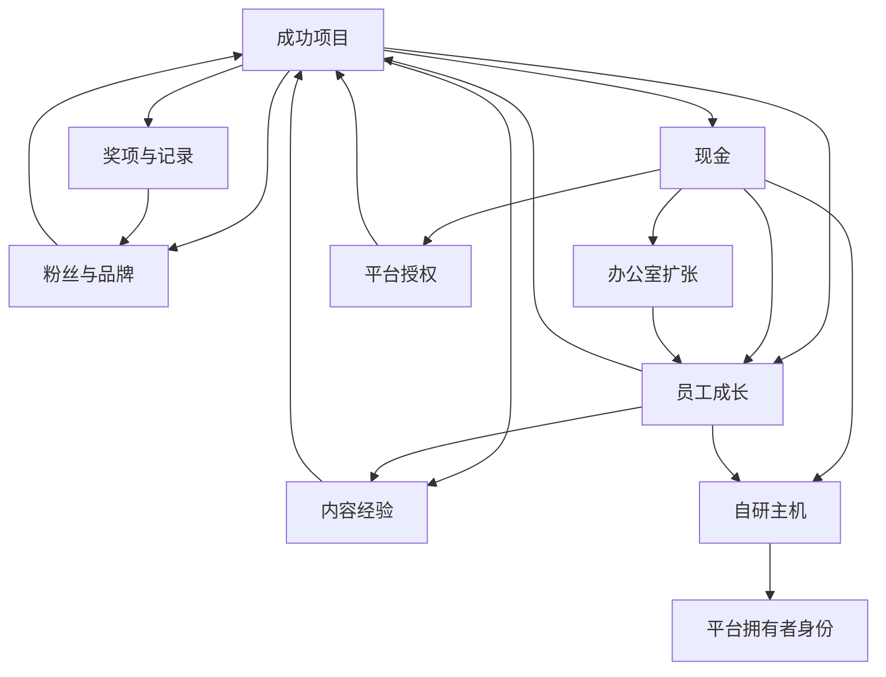

# 《游戏发展国》成长与终局系统分析

> English Title: Game Dev Story  
> Japanese Title: ゲーム発展国++  
> Document Type: Progression and Endgame Analysis  
> Status: V1  
> Path: `design/case-studies/game-dev-story/12-progression-and-endgame.md`  
> Analysis Version: 1.0  
> Last Updated: 2026-07-12  
> Analysis Method: Observable Design Analysis  
> Source Code Required: No

---

## 1. 文档目的

本文件集中分析《游戏发展国》的成长线、阶段目标、长期资本、自研主机、软终局和终局后循环，重点回答：

```text
玩家到底在成长什么；
员工、内容、平台、粉丝、办公室和奖项如何形成多条成长线；
这些成长线如何互相促进；
为什么成长不是单一等级条；
哪些目标负责推动早期、中期和后期；
自研主机为什么是最强终局节点；
Hall of Fame、续作、奖项和百万销量如何构成长线里程碑；
为什么终局后游戏会转向全解锁、极限优化和自我设定目标；
怎样设计一个既有身份跃迁、又能避免终局后迅速失去张力的成长结构。
```

本文件不提供最短通关路线，也不列出全部解锁条件和精确数值表。

---

## 2. 一句话成长定义

```text
《游戏发展国》的成长系统，
不是让一个等级不断上升，
而是让公司同时积累财务、人才、知识、品牌、组织和行业地位，
并最终把这些资本汇合到自研主机这一身份终局。
```

---

## 3. 成长系统总览

```text
Progression
├─ Financial Progression
│  ├─ Cash
│  ├─ Revenue Capacity
│  └─ Risk Reserve
├─ Staff Progression
│  ├─ Stats
│  ├─ Career Levels
│  ├─ Career History
│  └─ Advanced Careers
├─ Content Progression
│  ├─ Genre Unlocks
│  ├─ Type Unlocks
│  ├─ Genre Levels
│  ├─ Type Levels
│  └─ Combination Knowledge
├─ Brand Progression
│  ├─ Fans
│  ├─ Hall of Fame
│  ├─ Sequels
│  ├─ Awards
│  └─ Sales Records
├─ Organizational Progression
│  ├─ Office Expansion
│  ├─ Staff Capacity
│  ├─ Recruitment Access
│  └─ Production Scale
├─ Platform Progression
│  ├─ External Licenses
│  ├─ Platform Timing Knowledge
│  └─ Own Console
└─ Player Knowledge Progression
   ├─ Best Combinations
   ├─ Staff Routes
   ├─ Platform Timing
   └─ Investment Strategy
```

---

## 4. 为什么成长不是单线

如果成长只表现为：

```text
Company Level 1
→ Company Level 2
→ Company Level 3
```

玩家只会感受到抽象数值上升。

《游戏发展国》使用多条成长线，让成长分别表现为：

- 钱更多；
- 员工更强；
- 可制作内容更多；
- 粉丝更多；
- 办公室更大；
- 平台更高级；
- 评论更高；
- 销量更大；
- 奖项更多；
- 公司身份更高。

### 4.1 多线成长的价值

不同玩家可以从不同结果中获得满足：

- 经营型玩家关注现金和办公室；
- 养成型玩家关注员工；
- 收集型玩家关注 Genre 与 Type；
- 优化型玩家关注高分和销量；
- 成就型玩家关注奖项和主机。

---

## 5. 六类长期资本

### 5.1 财务资本

包括：

- 现金；
- 稳定销售能力；
- 风险储备；
- 高成本投资能力。

作用：

```text
扩大当前和未来选择空间。
```

### 5.2 人才资本

包括：

- 员工数量；
- 四项能力；
- 职业等级；
- 跨职业履历；
- 高阶职业。

作用：

```text
提高作品生产上限。
```

### 5.3 知识资本

包括：

- Genre / Type 解锁；
- 内容等级；
- 组合知识；
- 玩家对平台和市场的理解。

作用：

```text
降低决策不确定性。
```

### 5.4 品牌资本

包括：

- 粉丝；
- Hall of Fame；
- 续作；
- 奖项；
- 销量记录。

作用：

```text
把历史成功转化为未来市场优势。
```

### 5.5 组织资本

包括：

- 办公室；
- 工位；
- 招聘层级；
- 团队规模；
- 生产能力。

作用：

```text
让公司从个人能力升级为组织能力。
```

### 5.6 平台资本

包括：

- 外部平台授权；
- 平台时代经验；
- 自研主机。

作用：

```text
从进入市场升级为拥有市场。
```

---

## 6. 成长线之间的关系



### 6.1 核心结构

一条成长线的输出，会成为另一条成长线的输入。

例如：

```text
高销量
→ 高现金
→ 更强员工
→ 更高质量作品
→ 更高销量
```

---

## 7. 早期成长目标

### 7.1 主要问题

```text
公司能否持续经营。
```

### 7.2 主要成长对象

- 基础现金；
- 基础员工；
- 第一批 Genre / Type；
- 第一批组合知识；
- 第一批粉丝；
- 第一款盈利作品。

### 7.3 主要里程碑

- 完成第一个合同；
- 完成第一款自研游戏；
- 第一次盈利；
- 第一次高于预期的评论；
- 第一次明显销量增长。

### 7.4 体验特点

早期成长幅度小，但边际意义大。

一名新员工、一个新内容或一笔现金，都可能明显改变公司能力。

---

## 8. 中期成长目标

### 8.1 主要问题

```text
如何把偶然成功变成稳定成功。
```

### 8.2 主要成长对象

- 核心员工；
- 职业路线；
- Genre / Type 等级；
- 平台授权；
- 粉丝；
- 办公室；
- Hall of Fame；
- 续作；
- 奖项。

### 8.3 主要里程碑

- 第一批稳定高分组合；
- 第一名高阶职业员工；
- 第一次办公室扩张；
- 第一款 Hall of Fame 作品；
- 第一次续作；
- 第一个年度奖项；
- 第一次百万销量。

### 8.4 体验特点

中期是成长系统最丰富的阶段：

- 多种资源同时重要；
- 多条成长线互相影响；
- 玩家仍然需要取舍；
- 新内容持续开放；
- 项目结果仍有悬念。

---

## 9. 后期成长目标

### 9.1 主要问题

```text
公司如何从成功工作室升级为行业顶级公司。
```

### 9.2 主要成长对象

- 顶级员工；
- 高阶职业；
- 高评论纪录；
- 高销量纪录；
- Grand Prize；
- 全内容解锁；
- 自研主机；
- 极限作品。

### 9.3 主要里程碑

- 多名高阶员工；
- 稳定 Hall of Fame；
- 多次年度获奖；
- Grand Prize；
- 自研主机；
- 全 Genre / Type；
- 顶级销量和评论记录。

### 9.4 体验特点

后期从“解决问题”转向：

```text
完成体系
+
追求极限
+
改变身份
```

---

## 10. 员工成长线

### 10.1 纵向成长

```text
当前职业 Lv1
→ Lv2
→ Lv3
→ Lv4
→ Lv5
```

### 10.2 横向成长

```text
职业 A
→ 职业 B
→ 职业 C
→ 综合职业
→ 高阶职业
```

### 10.3 终局成长

- Hardware Engineer；
- Hacker；
- 顶级四项属性；
- 主机研发资格。

### 10.4 成长意义

员工成长同时带来：

- 当前项目能力；
- 内容解锁；
- 职业身份；
- 终局前置。

### 10.5 风险

若所有员工最终都趋向同一终极职业，职业选择会从分支变成固定流程。

---

## 11. 内容成长线

### 11.1 解锁

员工成长打开新的 Genre 与 Type。

### 11.2 等级

重复制作提高内容熟练度。

### 11.3 组合知识

玩家逐步知道哪些组合表现好。

### 11.4 系列

成功作品可以形成续作和品牌连续性。

### 11.5 成长意义

内容成长让公司从：

```text
只能做少量基础作品
```

变为：

```text
能够选择大量成熟产品方向。
```

### 11.6 风险

全解锁和最佳组合已知后，发现成长线会失去动力。

---

## 12. 财务成长线

### 12.1 早期

现金用于生存。

### 12.2 中期

现金用于投资。

### 12.3 后期

现金用于大型 Sink 与极限配置。

### 12.4 成长表现

```text
支付工资困难
→ 可以稳定开发
→ 可以扩张
→ 可以覆盖所有平台
→ 可以开发主机
```

### 12.5 风险

后期收入增长快于成本，导致现金失去决策意义。

---

## 13. 品牌成长线

### 13.1 粉丝

保存市场成功。

### 13.2 Hall of Fame

认证高质量作品。

### 13.3 续作

延续成功品牌。

### 13.4 奖项

保存行业认可。

### 13.5 销量纪录

保存商业影响。

### 13.6 成长意义

品牌线让公司拥有历史。

玩家不再只是：

```text
当前有多少钱。
```

还会关注：

```text
过去做出过什么作品。
```

---

## 14. 组织成长线

### 14.1 办公室扩张

提高：

- 工位；
- 员工容量；
- 总产出；
- 招聘价值；
- 视觉规模。

### 14.2 团队结构

早期：

```text
少数人完成所有任务。
```

中后期：

```text
多个核心员工和高阶职业共同生产。
```

### 14.3 成长意义

组织成长将：

```text
个体能力
```

升级为：

```text
公司能力。
```

### 14.4 风险

办公室扩张次数有限，完成后这条成长线不再提供新结构。

---

## 15. 平台成长线

### 15.1 外部平台

玩家从基础平台逐步进入更大市场。

### 15.2 平台知识

玩家学会：

- 何时购买授权；
- 何时进入；
- 何时退出；
- 哪个平台值得长期投入。

### 15.3 自研平台

最终从使用平台升级为拥有平台。

### 15.4 成长意义

平台线提供最明确的行业身份变化。

---

## 16. 玩家知识成长线

### 16.1 内容知识

- 优秀组合；
- 解锁路线；
- 内容成本；
- 专精价值。

### 16.2 人才知识

- 哪些员工值得培养；
- 职业如何转；
- 训练何时最有效。

### 16.3 市场知识

- 哪个平台值得进入；
- 何时宣传；
- 粉丝如何复利。

### 16.4 经济知识

- 需要保留多少储备；
- 何时扩张；
- 何时做合同。

### 16.5 重玩影响

公司状态会重置，但玩家知识不会真正消失。

因此重玩本身是一条局外成长线。

---

## 17. 成长里程碑结构

### 17.1 产品里程碑

- 第一款游戏；
- 第一款盈利作品；
- 第一款高分作品；
- 第一款 Hall of Fame；
- 第一款百万销量；
- 第一款续作。

### 17.2 人才里程碑

- 第一位 Lv5 员工；
- 第一位综合职业；
- 第一位 Hardware Engineer；
- 第一位 Hacker。

### 17.3 公司里程碑

- 第一次扩张；
- 满员团队；
- 稳定高收入；
- 顶级招聘。

### 17.4 行业里程碑

- 第一次排名第一；
- 第一个奖项；
- Grand Prize；
- 自研主机。

### 17.5 收集里程碑

- 全 Genre；
- 全 Type；
- 全职业；
- 全高阶目标；
- 全成就。

---

## 18. 为什么里程碑很重要

持续增长数字容易失去感觉。

里程碑将连续成长切分成：

```text
我第一次做到了什么。
```

### 18.1 可记忆

玩家容易记住：

- 第一款爆款；
- 第一位核心员工；
- 第一个奖项；
- 第一次办公室扩张；
- 第一台自研主机。

### 18.2 身份变化

里程碑不仅提高数值，还改变玩家对公司的认知。

---

## 19. Hall of Fame 的成长作用

### 19.1 质量门槛

高评论分作品进入 Hall of Fame。

### 19.2 能力门槛

它开启续作。

### 19.3 目标门槛

玩家开始追求稳定高分。

### 19.4 品牌门槛

作品从单次项目变成系列资产。

### 19.5 成长意义

```text
高质量
→ 获得新项目类型
```

它把结算结果转化为未来选择。

---

## 20. 续作的成长作用

### 20.1 延续历史

续作使过去作品继续存在。

### 20.2 降低概念风险

使用已验证的品牌与组合。

### 20.3 提高公司身份

公司开始拥有系列，而不是只做孤立产品。

### 20.4 形成长期叙事

玩家可以观察同一系列跨越平台和公司阶段。

### 20.5 风险

续作收益过强会压制新组合和原创探索。

---

## 21. 奖项的成长作用

### 21.1 年度目标

奖项把多个短项目汇总到年度时间尺度。

### 21.2 行业认证

高销量说明商业成功，奖项说明行业认可。

### 21.3 长期记录

奖项保留在公司历史中。

### 21.4 Grand Prize

Grand Prize 是后期最清楚的荣誉目标之一。

### 21.5 风险

当高分作品稳定产生后，奖项会逐渐从突破变成收集。

---

## 22. 百万销量的成长作用

### 22.1 易理解

百万销量是非常直观的商业里程碑。

### 22.2 系统汇合

通常需要：

- 好作品；
- 大平台；
- 粉丝；
- 宣传；
- 强员工；
- 合理组合。

### 22.3 身份意义

玩家从小型工作室升级为拥有大众影响力的公司。

### 22.4 重复目标

第一次百万销量是突破，后续则成为纪录优化。

---

## 23. 自研主机作为终局

### 23.1 为什么它适合作为终局

它需要此前多条成长线共同成熟：

```text
大量现金
+
高阶员工
+
特定职业
+
公司规模
+
平台经验
```

### 23.2 身份升级

```text
内容开发商
→
平台拥有者
```

### 23.3 权力升级

此前玩家适应平台。

之后玩家建立平台。

### 23.4 视觉与概念高潮

自研主机比单纯“Company Level Max”更具有主题意义。

---

## 24. 自研主机的系统汇合

### 24.1 财务

支付大额成本。

### 24.2 人才

需要硬件相关高阶人才。

### 24.3 职业

需要长期职业路线。

### 24.4 组织

需要足够公司规模。

### 24.5 平台

打开自有市场。

### 24.6 身份

完成公司角色变化。

### 24.7 设计原则

```text
优秀终局目标应要求多条成长线共同成熟，
而不是只检查一个数值。
```

---

## 25. 终局前的准备阶段

```text
稳定高收入
→ 培养 Hardware Engineer
→ 保留现金
→ 完成员工职业前置
→ 维持普通作品收入
→ 开始主机研发
```

### 25.1 资源储备

玩家需要停止部分短期消费，为终局保留资金。

### 25.2 人才规划

需要提前培养，而不是临时购买。

### 25.3 机会成本

终局项目会与普通作品、培训和平台投资竞争资源。

---

## 26. 软终局

《游戏发展国》没有必须立即停止的硬结局。

完成高阶目标后，玩家仍可继续经营。

### 26.1 软终局组成

- 自研主机；
- Grand Prize；
- 百万销量；
- 高评论记录；
- 全解锁；
- 顶级员工；
- 全成就；
- 自我设定纪录。

### 26.2 优点

- 不强制中断公司；
- 允许继续优化；
- 支持收集和重玩；
- 尊重玩家自定目标。

### 26.3 缺点

- 结局仪式较弱；
- 何时停止不明确；
- 终局后容易重复。

---

## 27. 终局后的主要目标

### 27.1 全解锁

- Genre；
- Type；
- 职业；
- 员工；
- 平台；
- 成就。

### 27.2 全培养

- 职业满级；
- 高属性；
- Hacker；
- Hardware Engineer。

### 27.3 纪录挑战

- 最高评论；
- 最高销量；
- 最高粉丝；
- 最高现金；
- 最快主机；
- 最多奖项。

### 27.4 自我限制

玩家可能自行设定：

- 不使用外部专家；
- 只做某类作品；
- 低成本路线；
- 不查攻略；
- 特定平台路线。

---

## 28. 终局后动力变化

终局前：

```text
系统仍在打开新的能力与身份。
```

终局后：

```text
系统主要提供更大数字与完成度。
```

### 28.1 结构成长结束

办公室、职业、平台和主机等核心结构大多完成。

### 28.2 数值成长继续

员工、现金、粉丝和纪录还能增加。

### 28.3 体验转化

```text
发现
→ 掌握
→ 优化
→ 收集
```

---

## 29. 为什么终局后张力下降

### 29.1 资源约束消失

现金和工资不再重要。

### 29.2 生产结果稳定

顶级员工与成熟组合使高分更可预测。

### 29.3 内容全部开放

新发现减少。

### 29.4 平台压力下降

自研主机降低外部依赖。

### 29.5 身份层级结束

平台拥有者之后缺少更高角色。

### 29.6 结果

```text
成长仍在继续，
但成长不再改变玩法结构。
```

---

## 30. 成长速度曲线

### 30.1 早期

成长慢，但每次提升影响巨大。

### 30.2 中期

成长速度快，多条系统同时开放。

### 30.3 后期

数值增长很快，但体验变化较少。

### 30.4 典型问题

```text
数字增长速度上升，
新决策产生速度下降。
```

---

## 31. 正反馈结构

### 31.1 项目复利

```text
成功作品
→ 现金、粉丝、员工和内容成长
→ 下一作品更强
```

### 31.2 人才复利

```text
员工成长
→ 更高质量
→ 更多资源
→ 更快成长
```

### 31.3 品牌复利

```text
粉丝
→ 更高销量
→ 更多粉丝
```

### 31.4 知识复利

```text
试验
→ 了解系统
→ 更少失败
→ 更多资源
```

### 31.5 组织复利

```text
办公室
→ 更多员工
→ 更高产出
→ 更多收入
```

---

## 32. 成长限制

### 32.1 现金

限制早期投资。

### 32.2 工资

限制团队规模。

### 32.3 工位

限制员工数量。

### 32.4 体力

限制员工使用。

### 32.5 职业前置

限制高阶职业。

### 32.6 内容解锁

限制项目选择。

### 32.7 平台时间

限制市场进入。

### 32.8 限制问题

这些限制大多会被永久成长逐步消解，却没有足够的新限制替代。

---

## 33. 门槛结构

### 33.1 硬门槛

- 未解锁 Genre / Type；
- 未出现平台；
- 工位不足；
- 职业前置；
- 自研主机条件。

### 33.2 软门槛

- 买得起但不值得的 License；
- 能做但风险过高的项目；
- 可扩张但现金储备不足；
- 可训练但体力和资源不合适。

### 33.3 门槛设计价值

硬门槛控制顺序。

软门槛制造经营判断。

---

## 34. 成长反馈

### 34.1 即时

- 属性增加；
- Level Up；
- 新解锁；
- 现金变化。

### 34.2 项目

- 评论；
- Hall of Fame；
- 销量；
- 粉丝。

### 34.3 公司

- 办公室；
- 新员工；
- 新平台；
- 新职业。

### 34.4 行业

- 排名；
- 奖项；
- 主机；
- 百万销量。

### 34.5 反馈原则

成长应同时拥有：

```text
数字变化
+
行为变化
+
身份变化
```

---

## 35. 成长与核心体验

### 35.1 创造感

内容解锁扩大作品概念空间。

### 35.2 经营感

现金和组织成长扩大投资能力。

### 35.3 掌控感

员工和知识成长降低随机性。

### 35.4 身份感

办公室、奖项和主机改变公司地位。

### 35.5 复利满足

当前成功明显改善下一项目起点。

---

## 36. 成长系统的主要优点

### 36.1 多线成长

不同玩家都能找到目标。

### 36.2 系统互相促进

没有完全孤立的成长条。

### 36.3 里程碑清楚

高分、百万销量、奖项和主机都容易理解。

### 36.4 成长可见

办公室、员工和平台把数值成长具象化。

### 36.5 终局主题强

自研主机符合游戏公司幻想。

### 36.6 失败不清除长期资本

鼓励试验和继续经营。

### 36.7 软终局开放

允许继续收集和优化。

---

## 37. 成长系统的主要取舍

### 37.1 强复利换取爽感

优点：

- 成功很有力量；
- 公司成长明显。

代价：

- 后期约束失效。

### 37.2 永久成长换取长期意义

优点：

- 投资不会轻易浪费。

代价：

- 缺少重置和再选择。

### 37.3 多线成长换取丰富目标

优点：

- 目标密集。

代价：

- 多条线完成后同时失去动力。

### 37.4 软终局换取自由

优点：

- 可以继续玩。

代价：

- 完成感和结束感较弱。

### 37.5 终局汇合换取身份高潮

优点：

- 主机非常有意义。

代价：

- 完成后缺少下一层结构。

---

## 38. 可复用成长模式

### 38.1 Multi-Capital Progression

同时积累财务、人才、知识、品牌和组织资本。

### 38.2 Milestone-Based Progression

用首次高分、首次爆款和首次获奖切分成长旅程。

### 38.3 Result Unlocks New Action

高评价不只给奖励，还打开续作。

### 38.4 Staff-Gated Endgame

终局需要长期人才培养，而非只需货币。

### 38.5 Identity Escalation

成长改变玩家角色：

```text
创业者
→ 成功制作人
→ 行业领导者
→ 平台拥有者
```

### 38.6 Soft Endgame

完成主目标后仍允许继续优化。

### 38.7 Player Knowledge as Meta-Progression

玩家理解系统本身就是局外成长。

---

## 39. 现代化终局扩展方向

以下属于设计延伸。

### 39.1 多团队

主机之后开放：

- 多项目并行；
- 团队负责人；
- 资源争夺；
- 管理层。

### 39.2 发行体系

玩家可以为其他工作室发行游戏。

### 39.3 平台生态

自研主机之后管理：

- 第三方开发者；
- 平台抽成；
- 独占作品；
- 用户留存；
- 硬件迭代。

### 39.4 IP 组合

公司管理多个长期系列和受众。

### 39.5 全球市场

增加地区、文化和本地化。

### 39.6 收购与分部

公司从单一工作室升级为集团。

### 39.7 技术世代

自研引擎、硬件与研发形成持续 Sink。

### 39.8 保留原则

新终局必须改变决策结构，而不只是增加更大的数字。

---

## 40. 应避免的误用

- 所有成长线只提供属性加成；
- 终局只检查现金；
- 终局完成后没有任何身份变化；
- 高阶职业只是更高总战力；
- 全解锁后没有新的系统层；
- 粉丝、员工和知识永久增长，却没有新限制；
- 每个里程碑只给货币；
- 软终局完全没有完成仪式；
- 重玩只是在执行固定攻略；
- 所有玩家最终必须走完全相同的成长路线。

---

## 41. 成长系统检查表

### 多线成长

- [x] 财务资本；
- [x] 人才资本；
- [x] 知识资本；
- [x] 品牌资本；
- [x] 组织资本；
- [x] 平台资本。

### 里程碑

- [x] 第一款盈利作品；
- [x] Hall of Fame；
- [x] 续作；
- [x] 百万销量；
- [x] 年度奖项；
- [x] Grand Prize；
- [x] 办公室扩张；
- [x] 自研主机。

### 终局汇合

- [x] 需要现金；
- [x] 需要人才；
- [x] 需要职业；
- [x] 需要组织规模；
- [x] 完成身份升级。

### 软终局

- [x] 可以继续经营；
- [x] 支持全解锁；
- [x] 支持纪录；
- [x] 支持自我挑战。

### 长期风险

- [x] 资源约束消失；
- [x] 内容发现完成；
- [x] 项目结果可预测；
- [x] 平台压力下降；
- [x] 身份层级结束；
- [x] 数值成长继续但结构成长停止。

---

## 42. 核心结论

### 42.1 成长不是一条等级线

公司同时成长为更富、更强、更专业、更知名和更有行业影响力的组织。

### 42.2 多种资本共同推动项目复利

现金、员工、知识、粉丝和办公室都会改善下一款作品。

### 42.3 中期是成长最丰富的阶段

多条成长线同时开放，且资源和机会仍有明显取舍。

### 42.4 Hall of Fame 是高质量到新能力的转换器

它将评论结果转化为续作和系列路线。

### 42.5 奖项和百万销量分别表达行业认可与大众影响

两者共同构成“叫好又叫座”的长期目标。

### 42.6 自研主机是优秀的系统汇合终局

它要求多条成长线成熟，并完成玩家身份跃迁。

### 42.7 软终局支持继续游玩，但削弱明确结束感

玩家需要自行决定何时完成。

### 42.8 终局后问题不是没有成长，而是成长不再改变结构

数字仍然上升，但新决策、约束和身份层级减少。

### 42.9 更强的后期需要新的组织与平台问题

终局扩展应引入新层级，而不是只提高项目数值上限。

---

## 43. 与后续文档的关系

本文件定义：

```text
各条成长线如何汇合到终局，以及终局后动力如何变化。
```

后续文档继续分析：

- `13-feedback-and-presentation.md`：成长、解锁和终局如何被表现；
- `14-balance-and-randomness.md`：复利、门槛和随机性如何影响难度；
- `15-strengths-and-tradeoffs.md`：成长结构最成功与最薄弱的部分；
- `16-reusable-patterns.md`：如何迁移多资本成长和身份终局；
- `12-progression-and-endgame.md` 与 `05-system-map.md` 共同构成完整长线结构。

---

## 44. 参考资料

- Steam：《Game Dev Story》官方产品说明  
  官方说明包括招聘与训练员工、职业转换、开发新平台作品、制作百万销量作品以及开发自有主机。  
  `https://store.steampowered.com/app/1847240/Game_Dev_Story/`

- Kairosoft 官方《ゲーム発展国++》产品页面  
  官方说明员工成长会增加可制作内容，并将自研主机作为后期目标。  
  `https://kairosoft.net/game/appli/gamedev.html`

- The Kairosoft Wiki：Careers  
  整理员工职业等级、转职与高阶职业结构。  
  `https://kairosoft.wiki.gg/wiki/Careers_(Game_Dev_Story)`

- The Kairosoft Wiki：Consoles  
  整理外部平台 License、自研主机与 Hardware Engineer 前置。  
  `https://kairosoft.wiki.gg/wiki/Consoles_(Game_Dev_Story)`

- The Kairosoft Wiki：Game Dev Story  
  整理 Hall of Fame、Global Game Awards 和主要长线目标。  
  `https://kairosoft.wiki.gg/wiki/Game_Dev_Story`

社区资料用于确认稳定机制，不代表官方公开的完整成长或终局计算公式。

---

## 45. 总结

《游戏发展国》的成长与终局结构可以概括为：

```text
项目带来现金、员工经验、内容知识和粉丝，
这些资本推动办公室、平台和作品能力增长，
高质量作品进入 Hall of Fame 并形成续作，
高销量与奖项建立品牌和行业地位，
最终所有成长线汇合到自研主机，
完成从小型开发商到平台拥有者的身份跃迁。
```

它最值得借鉴的地方是：

```text
终局不是一个孤立任务，
而是此前所有经营、人才、内容和市场成长的集中验证。
```

早期，玩家问：

```text
公司能不能活下来？
```

中期，玩家问：

```text
怎样让公司稳定做出成功作品？
```

后期，玩家问：

```text
怎样成为行业顶端并拥有自己的平台？
```

终局之后，问题则变成：

```text
在所有结构成长完成后，我还想追求什么纪录和自我目标？
```

这条问题变化曲线，既构成《游戏发展国》完整的长期旅程，也揭示了其终局后从结构成长转向数值优化的根本原因。
