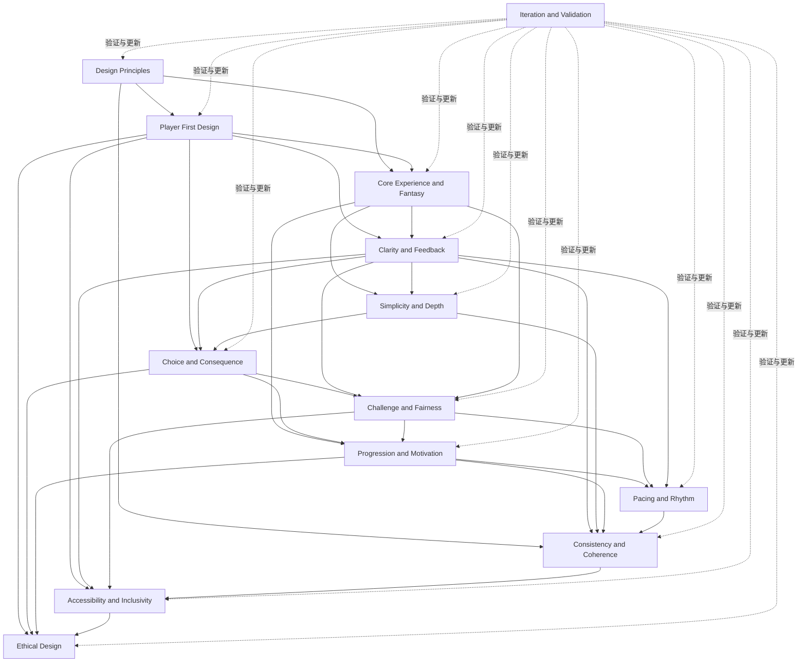

# Principle Map（设计原则关系图）

> Status: V1  
> Scope: `design/philosophy/`  
> Purpose: 展示各设计理念文档之间的层级、依赖、交叉主题与下游系统关系，帮助读者按问题而不是按文件名使用理念体系。

---

## 1. Philosophy 体系总览

设计理念体系按五个职责组组织：

```text
Foundation
确定方向与优先级
        ↓
Experience
定义玩家实际体验质量
        ↓
Long-Term
保证体验长期稳定
        ↓
Responsibility
保护玩家与建立边界
        ↓
Validation
用证据验证并更新全部原则
```

五组之间不是严格线性流程。

它们更接近：

```text
Foundation 提供方向；
Experience 设计直接体验；
Long-Term 检查持续性；
Responsibility 设定不可突破边界；
Validation 持续校正所有判断。
```

---

## 2. 目录结构

```text
philosophy/
├─ README.md
├─ glossary.md
├─ principle-map.md
├─ conflict-resolution.md
│
├─ foundation/
│  ├─ design-principles.md
│  ├─ player-first-design.md
│  └─ core-experience-and-fantasy.md
│
├─ experience/
│  ├─ clarity-and-feedback.md
│  ├─ simplicity-and-depth.md
│  ├─ choice-and-consequence.md
│  ├─ challenge-and-fairness.md
│  └─ pacing-and-rhythm.md
│
├─ long-term/
│  ├─ progression-and-motivation.md
│  └─ consistency-and-coherence.md
│
├─ responsibility/
│  ├─ accessibility-and-inclusivity.md
│  └─ ethical-design.md
│
└─ validation/
   └─ iteration-and-validation.md
```

---

## 3. 推荐阅读顺序

```text
1. Design Principles
2. Player First Design
3. Core Experience and Fantasy
4. Clarity and Feedback
5. Simplicity and Depth
6. Choice and Consequence
7. Challenge and Fairness
8. Progression and Motivation
9. Pacing and Rhythm
10. Consistency and Coherence
11. Accessibility and Inclusivity
12. Ethical Design
13. Iteration and Validation
```

该顺序对应：

```text
先确定为什么设计
→ 再确定玩家获得什么
→ 再设计理解、选择和挑战
→ 再处理长期成长与节奏
→ 再检查一致性和玩家保护
→ 最后用证据验证与更新
```

---

## 4. 总体依赖图



说明：

- 实线表示主要理念依赖；
- 虚线表示验证层会持续更新全部理念；
- 依赖不等于内容包含；
- 每篇文档仍保持独立职责。

---

## 5. Foundation

### 5.1 [Design Principles](./foundation/design-principles.md)

**核心问题**

```text
我们相信什么？
原则如何分级？
冲突时优先保护什么？
什么时候允许例外？
```

**Upstream**

- 无，属于理念体系最高层。

**Primary Responsibilities**

- 原则定义；
- 原则等级；
- 默认优先级；
- 冲突处理；
- 例外；
- 设计评审框架。

**Related**

- [Conflict Resolution](./conflict-resolution.md)
- [Iteration and Validation](./validation/iteration-and-validation.md)

**Downstream Systems**

- 所有系统；
- 所有功能规格；
- 所有设计评审。

---

### 5.2 [Player First Design](./foundation/player-first-design.md)

**核心问题**

```text
玩家真正想完成什么？
设计如何保护玩家时间、控制、理解和恢复？
```

**Upstream**

- [Design Principles](./foundation/design-principles.md)

**Primary Responsibilities**

- 玩家目标与需求；
- 玩家成本；
- 控制感；
- 时间与注意力；
- 错误恢复；
- 不同玩家与情境。

**Related**

- [Accessibility and Inclusivity](./responsibility/accessibility-and-inclusivity.md)
- [Ethical Design](./responsibility/ethical-design.md)
- [Clarity and Feedback](./experience/clarity-and-feedback.md)

**Downstream Systems**

- 输入与交互；
- 新手引导；
- 设置；
- 保存与恢复；
- 通知；
- 客服与错误处理。

---

### 5.3 [Core Experience and Fantasy](./foundation/core-experience-and-fantasy.md)

**核心问题**

```text
玩家希望成为谁？
项目希望反复提供什么核心体验？
```

**Upstream**

- [Design Principles](./foundation/design-principles.md)
- [Player First Design](./foundation/player-first-design.md)

**Primary Responsibilities**

- 玩家幻想；
- 核心体验；
- 情绪目标；
- 体验支柱；
- 核心循环；
- 体验承诺。

**Related**

- [Progression and Motivation](./long-term/progression-and-motivation.md)
- [Pacing and Rhythm](./experience/pacing-and-rhythm.md)

**Downstream Systems**

- 核心循环；
- 战斗；
- 任务；
- 内容；
- 角色；
- 叙事；
- 成长。

---

## 6. Experience

### 6.1 [Clarity and Feedback](./experience/clarity-and-feedback.md)

**核心问题**

```text
玩家是否知道当前发生了什么、可以做什么、为什么产生结果？
```

**Upstream**

- [Player First Design](./foundation/player-first-design.md)
- [Core Experience and Fantasy](./foundation/core-experience-and-fantasy.md)

**Primary Responsibilities**

- 状态可见性；
- 输入确认；
- 因果关系；
- 风险预警；
- 信息优先级；
- 多通道反馈。

**Related**

- [Choice and Consequence](./experience/choice-and-consequence.md)
- [Challenge and Fairness](./experience/challenge-and-fairness.md)
- [Accessibility and Inclusivity](./responsibility/accessibility-and-inclusivity.md)

**Downstream Systems**

- UI；
- 战斗反馈；
- 状态系统；
- 结算；
- 错误提示；
- 日志；
- 教学。

---

### 6.2 [Simplicity and Depth](./experience/simplicity-and-depth.md)

**核心问题**

```text
如何降低学习与管理负担，同时保留长期判断和组合空间？
```

**Upstream**

- [Core Experience and Fantasy](./foundation/core-experience-and-fantasy.md)
- [Clarity and Feedback](./experience/clarity-and-feedback.md)

**Primary Responsibilities**

- 复杂度来源；
- 深度来源；
- 规则复用；
- 渐进式披露；
- 正交设计；
- 系统表面积；
- 复杂度债务。

**Related**

- [Choice and Consequence](./experience/choice-and-consequence.md)
- [Consistency and Coherence](./long-term/consistency-and-coherence.md)

**Downstream Systems**

- 系统架构；
- 资源；
- 构筑；
- 内容模板；
- 功能入口；
- 自动化；
- 设置。

---

### 6.3 [Choice and Consequence](./experience/choice-and-consequence.md)

**核心问题**

```text
什么样的选择真正有意义？
玩家需要什么信息？
选择应产生什么后果？
```

**Upstream**

- [Player First Design](./foundation/player-first-design.md)
- [Clarity and Feedback](./experience/clarity-and-feedback.md)
- [Simplicity and Depth](./experience/simplicity-and-depth.md)

**Primary Responsibilities**

- 选项差异；
- 信息条件；
- 风险收益；
- 机会成本；
- 可逆性；
- 有效选择空间；
- 支配策略；
- 后果反馈。

**Related**

- [Challenge and Fairness](./experience/challenge-and-fairness.md)
- [Progression and Motivation](./long-term/progression-and-motivation.md)
- [Ethical Design](./responsibility/ethical-design.md)

**Downstream Systems**

- 战斗决策；
- 构筑；
- 经济；
- 任务分支；
- 对话；
- 成长路线；
- 奖励选择。

---

### 6.4 [Challenge and Fairness](./experience/challenge-and-fairness.md)

**核心问题**

```text
挑战要求玩家提升什么能力？
失败为什么会被认为公平或不公平？
```

**Upstream**

- [Core Experience and Fantasy](./foundation/core-experience-and-fantasy.md)
- [Clarity and Feedback](./experience/clarity-and-feedback.md)
- [Choice and Consequence](./experience/choice-and-consequence.md)

**Primary Responsibilities**

- 挑战来源；
- 规则与信息公平；
- 输入公平；
- 反制空间；
- 难度曲线；
- 失败学习；
- 惩罚；
- 随机性；
- 辅助难度。

**Related**

- [Accessibility and Inclusivity](./responsibility/accessibility-and-inclusivity.md)
- [Pacing and Rhythm](./experience/pacing-and-rhythm.md)

**Downstream Systems**

- 战斗；
- 敌人；
- 关卡；
- 难度模式；
- 失败；
- 匹配；
- 随机奖励。

---

### 6.5 [Pacing and Rhythm](./experience/pacing-and-rhythm.md)

**核心问题**

```text
行动、信息、决策、等待、反馈和情绪应如何随时间组织？
```

**Upstream**

- [Core Experience and Fantasy](./foundation/core-experience-and-fantasy.md)
- [Challenge and Fairness](./experience/challenge-and-fairness.md)
- [Progression and Motivation](./long-term/progression-and-motivation.md)

**Primary Responsibilities**

- 行动节奏；
- 决策密度；
- 信息密度；
- 张力与释放；
- 等待；
- 会话长度；
- 停止点；
- 恢复空间；
- 节奏疲劳。

**Related**

- [Clarity and Feedback](./experience/clarity-and-feedback.md)
- [Ethical Design](./responsibility/ethical-design.md)

**Downstream Systems**

- 核心循环；
- 战斗流程；
- 任务结构；
- 奖励结算；
- 会话；
- 活动；
- 多人同步。

---

## 7. Long-Term

### 7.1 [Progression and Motivation](./long-term/progression-and-motivation.md)

**核心问题**

```text
玩家为什么愿意继续？
投入如何形成真实成长？
```

**Upstream**

- [Core Experience and Fantasy](./foundation/core-experience-and-fantasy.md)
- [Choice and Consequence](./experience/choice-and-consequence.md)
- [Challenge and Fairness](./experience/challenge-and-fairness.md)

**Primary Responsibilities**

- 内外在动机；
- 玩家与角色成长；
- 目标结构；
- 奖励；
- 解锁；
- 重复；
- 自动化；
- 留存；
- 回归。

**Related**

- [Pacing and Rhythm](./experience/pacing-and-rhythm.md)
- [Ethical Design](./responsibility/ethical-design.md)

**Downstream Systems**

- 成长；
- 等级；
- 技能；
- 奖励；
- 任务；
- 活动；
- 每日与每周；
- 回归；
- 成就。

---

### 7.2 [Consistency and Coherence](./long-term/consistency-and-coherence.md)

**核心问题**

```text
不同系统、内容和平台是否共同形成稳定认知和完整体验？
```

**Upstream**

- [Design Principles](./foundation/design-principles.md)
- [Clarity and Feedback](./experience/clarity-and-feedback.md)
- [Simplicity and Depth](./experience/simplicity-and-depth.md)

**Primary Responsibilities**

- 术语；
- 操作；
- 规则；
- 反馈；
- 视觉；
- 世界观；
- 跨系统协调；
- 例外；
- 平台差异；
- 一致性债务。

**Related**

- [Glossary](./glossary.md)
- [Accessibility and Inclusivity](./responsibility/accessibility-and-inclusivity.md)

**Downstream Systems**

- 设计系统；
- 状态系统；
- 数据；
- 平台适配；
- 本地化；
- 内容模板；
- 系统集成。

---

## 8. Responsibility

### 8.1 [Accessibility and Inclusivity](./responsibility/accessibility-and-inclusivity.md)

**核心问题**

```text
哪些非核心障碍会阻止不同能力、设备、语言和情境下的玩家参与？
```

**Upstream**

- [Player First Design](./foundation/player-first-design.md)
- [Clarity and Feedback](./experience/clarity-and-feedback.md)
- [Challenge and Fairness](./experience/challenge-and-fairness.md)
- [Consistency and Coherence](./long-term/consistency-and-coherence.md)

**Primary Responsibilities**

- 视觉；
- 色觉；
- 听觉；
- 动画；
- 输入；
- 认知；
- 多维辅助；
- 本地化；
- 社交安全；
- 设备差异。

**Related**

- [Ethical Design](./responsibility/ethical-design.md)

**Downstream Systems**

- 输入；
- UI；
- 字幕；
- 设置；
- 难度；
- 本地化；
- 社交；
- 平台适配。

---

### 8.2 [Ethical Design](./responsibility/ethical-design.md)

**核心问题**

```text
设计是否通过真实价值影响玩家，还是通过误导、压力和脆弱性利用获得结果？
```

**Upstream**

- [Player First Design](./foundation/player-first-design.md)
- [Choice and Consequence](./experience/choice-and-consequence.md)
- [Progression and Motivation](./long-term/progression-and-motivation.md)
- [Accessibility and Inclusivity](./responsibility/accessibility-and-inclusivity.md)

**Primary Responsibilities**

- 玩家时间；
- 通知；
- 稀缺；
- FOMO；
- 付费；
- 概率；
- 订阅；
- 儿童保护；
- 社交压力；
- 隐私；
- 算法；
- 广告。

**Related**

- [Conflict Resolution](./conflict-resolution.md)
- [Iteration and Validation](./validation/iteration-and-validation.md)

**Downstream Systems**

- 商业化；
- 随机奖励；
- 订阅；
- 活动；
- 通知；
- 数据；
- 社交；
- 广告；
- 账户。

---

## 9. Validation

### 9.1 [Iteration and Validation](./validation/iteration-and-validation.md)

**核心问题**

```text
我们如何知道问题真实存在、方案有效，并且证据足以继续投入？
```

**Upstream**

- 所有理念都为验证提供判断标准。

**Primary Responsibilities**

- 问题定义；
- 假设；
- 原型；
- 成功与失败标准；
- 定性与定量；
- 样本；
- 偏差；
- 发布前后验证；
- 决策记录；
- 复盘。

**Related**

- 全部理念文档。

**Downstream Systems**

- 分析与埋点；
- 用户研究；
- 实验；
- 发布流程；
- 运营监控；
- 设计复盘。

---

## 10. 交叉主题归属

同一主题可能出现在多个原则中，但每个文档承担不同职责。

### 10.1 Randomness

| 文档 | 职责 |
|---|---|
| Choice and Consequence | 随机性是否支持有意义决策 |
| Challenge and Fairness | 随机性是否公平、可管理 |
| Progression and Motivation | 随机奖励是否阻断成长 |
| Ethical Design | 付费随机是否透明且保护脆弱用户 |
| Iteration and Validation | 如何验证概率理解与长期影响 |

### 10.2 Recoverability

| 文档 | 职责 |
|---|---|
| Player First Design | 恢复是基本玩家价值 |
| Choice and Consequence | 选择是否可逆 |
| Challenge and Fairness | 失败后是否能够合理重试 |
| Pacing and Rhythm | 中断后是否可恢复会话 |
| Ethical Design | 是否用不可恢复损失制造压力 |

### 10.3 Automation

| 文档 | 职责 |
|---|---|
| Simplicity and Depth | 自动化是否删除核心决策 |
| Progression and Motivation | 玩家掌握后何时开放自动化 |
| Pacing and Rhythm | 自动化是否减少节奏阻塞 |
| Accessibility and Inclusivity | 自动化是否降低非核心输入障碍 |
| Ethical Design | 是否故意制造摩擦后出售自动化 |

### 10.4 Time

| 文档 | 职责 |
|---|---|
| Player First Design | 时间属于玩家成本 |
| Pacing and Rhythm | 时间如何组织为体验 |
| Progression and Motivation | 时间如何形成目标、留存和回归 |
| Ethical Design | 是否尊重停止权和现实生活 |
| Iteration and Validation | 如何测量真实时间与主观时间 |

### 10.5 Trust

| 文档 | 职责 |
|---|---|
| Clarity and Feedback | 结果是否可理解和可追踪 |
| Challenge and Fairness | 规则是否稳定、公平 |
| Consistency and Coherence | 同类规则是否持续一致 |
| Ethical Design | 是否存在误导和操纵 |
| Iteration and Validation | 是否监控信任、退款与后悔 |

---

## 11. 按问题选择文档

### 玩家看不懂系统

优先阅读：

1. [Clarity and Feedback](./experience/clarity-and-feedback.md)
2. [Simplicity and Depth](./experience/simplicity-and-depth.md)
3. [Consistency and Coherence](./long-term/consistency-and-coherence.md)
4. [Accessibility and Inclusivity](./responsibility/accessibility-and-inclusivity.md)

### 玩家认为选择没有意义

优先阅读：

1. [Choice and Consequence](./experience/choice-and-consequence.md)
2. [Simplicity and Depth](./experience/simplicity-and-depth.md)
3. [Challenge and Fairness](./experience/challenge-and-fairness.md)

### 玩家觉得失败不公平

优先阅读：

1. [Challenge and Fairness](./experience/challenge-and-fairness.md)
2. [Clarity and Feedback](./experience/clarity-and-feedback.md)
3. [Choice and Consequence](./experience/choice-and-consequence.md)
4. [Accessibility and Inclusivity](./responsibility/accessibility-and-inclusivity.md)

### 玩家很快感到无聊或疲劳

优先阅读：

1. [Core Experience and Fantasy](./foundation/core-experience-and-fantasy.md)
2. [Progression and Motivation](./long-term/progression-and-motivation.md)
3. [Pacing and Rhythm](./experience/pacing-and-rhythm.md)
4. [Simplicity and Depth](./experience/simplicity-and-depth.md)

### 系统越来越复杂

优先阅读：

1. [Simplicity and Depth](./experience/simplicity-and-depth.md)
2. [Consistency and Coherence](./long-term/consistency-and-coherence.md)
3. [Design Principles](./foundation/design-principles.md)

### 留存提高但玩家压力增加

优先阅读：

1. [Ethical Design](./responsibility/ethical-design.md)
2. [Progression and Motivation](./long-term/progression-and-motivation.md)
3. [Pacing and Rhythm](./experience/pacing-and-rhythm.md)
4. [Player First Design](./foundation/player-first-design.md)

### 团队无法判断哪个方案正确

优先阅读：

1. [Design Principles](./foundation/design-principles.md)
2. [Conflict Resolution](./conflict-resolution.md)
3. [Iteration and Validation](./validation/iteration-and-validation.md)

---

## 12. 下游系统映射

| System | 主要上游原则 |
|---|---|
| Core Loop | Core Experience, Pacing, Progression |
| Input and Interaction | Player First, Clarity, Accessibility, Consistency |
| Combat | Choice, Challenge, Clarity, Pacing |
| Rules and Resolution | Clarity, Fairness, Consistency |
| Resources and Economy | Choice, Progression, Simplicity, Ethical Design |
| Progression | Progression, Choice, Core Experience |
| Rewards | Progression, Pacing, Ethical Design |
| Difficulty | Challenge, Accessibility, Player First |
| Content and Unlocks | Progression, Simplicity, Pacing |
| Save and Persistence | Player First, Recoverability, Ethical Design |
| Tutorial and Onboarding | Clarity, Simplicity, Accessibility |
| Notifications | Player First, Pacing, Ethical Design |
| Social and Multiplayer | Fairness, Accessibility, Ethical Design |
| Monetization | Ethical Design, Player First, Progression |
| Analytics and Telemetry | Iteration, Ethical Design, Privacy |
| System Integration | Consistency, Simplicity, Core Experience |

---

## 13. 原则使用方式

在系统文档中建议增加：

```markdown
## Governing Principles

- [Player First Design](../philosophy/foundation/player-first-design.md)
  - 保护玩家时间；
  - 高影响错误可恢复。

- [Clarity and Feedback](../philosophy/experience/clarity-and-feedback.md)
  - 状态来源可追踪；
  - 不可用操作说明原因。

- [Ethical Design](../philosophy/responsibility/ethical-design.md)
  - 不使用人为摩擦出售基础修复。
```

不要只链接文档名称。

应写出当前系统具体遵循的原则。

---

## 14. 维护规则

### 新增理念前

必须确认：

- 是否已经存在主文档；
- 是否只是现有原则的系统应用；
- 是否可以进入 Glossary；
- 是否会增加重复职责；
- 是否需要更新依赖图。

### 修改主定义后

必须同步：

- [Glossary](./glossary.md)；
- 当前 Principle Map；
- 相关交叉主题；
- 下游 Systems；
- Conflict Resolution 中的优先级或案例。

### 删除或合并文档前

必须检查：

- 主定义是否有新归属；
- 现有链接；
- 下游引用；
- 历史决策记录；
- 术语映射。

---

## 15. Principle Map 检查清单

- [ ] 每份理念文档有唯一主要职责；
- [ ] 每份文档有明确上游和相关文档；
- [ ] 交叉主题的职责得到区分；
- [ ] 下游系统可以找到对应原则；
- [ ] 没有循环定义；
- [ ] 验证层能够覆盖全部理念；
- [ ] Responsibility 层被视为边界而非可选优化；
- [ ] 所有相对链接有效；
- [ ] 目录结构与 README 一致；
- [ ] 新增文档后依赖图同步更新。

---

## 16. Related Documents

- [Philosophy README](./README.md)
- [Glossary](./glossary.md)
- [Conflict Resolution](./conflict-resolution.md)
- [Design Principles](./foundation/design-principles.md)
- [Iteration and Validation](./validation/iteration-and-validation.md)
