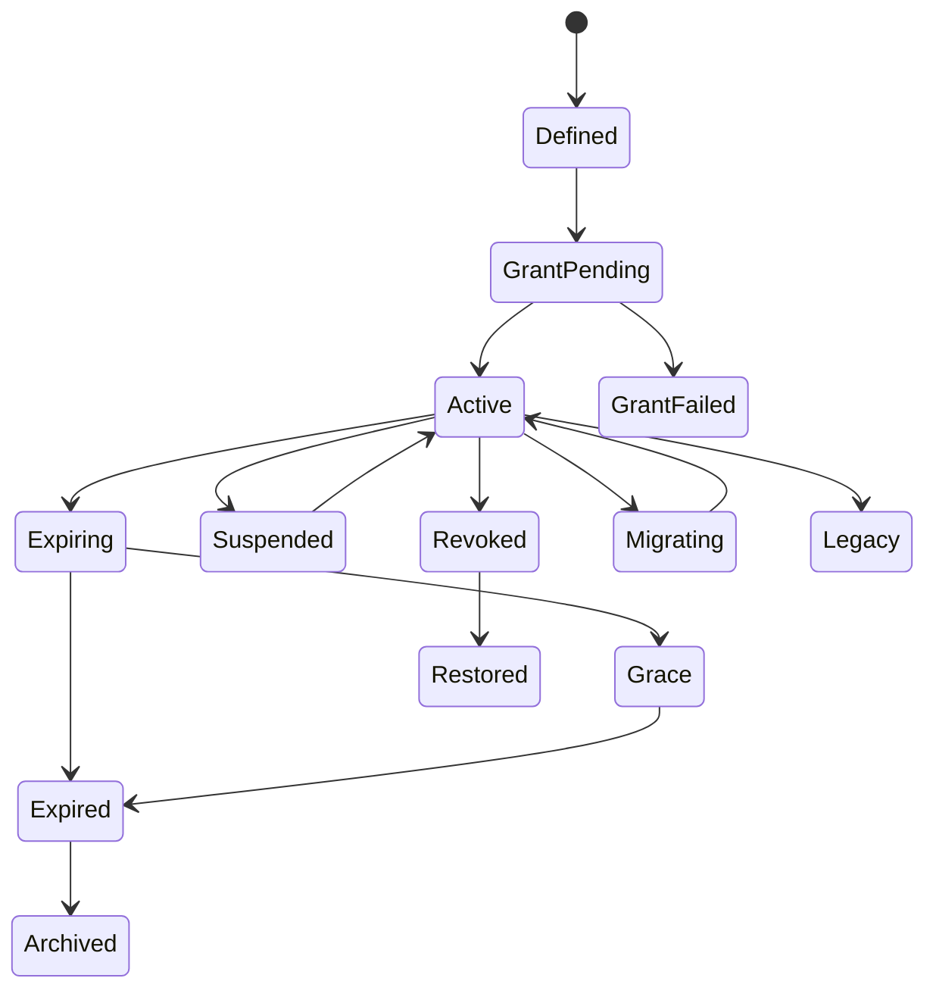

# Entitlement and Ownership（权益与所有权系统）

> Status: V1  
> Category: Commercial  
> Path: `design/systems/commercial/entitlement-and-ownership.md`  
> Owner: TBD  
> Reviewers: Product / Engineering / Commerce / Legal / Finance / Security / Privacy / Platform / Support / Live Operations / Data / QA  
> Last Updated: 2026-07-11  
> Version: 1.0  
> Risk Level: Critical  
> Dependencies: Monetization System, Offers and Pricing, Content and Unlocks, Content Lifecycle, Save and Persistence, Account and Identity, Resources and Economy, Reward System  
> Affected Systems: Characters and Loadouts, Social and Multiplayer, Matchmaking and Competition, Subscription, DLC, Gift, Trials, Rentals, Live Operations, Analytics and Telemetry, Support

---

## 1. System Summary

Entitlement and Ownership 系统负责定义：

```text
玩家拥有什么；
玩家当前能访问什么；
拥有、解锁、租赁、订阅、试用和临时授权之间有什么区别；
权益来自哪里；
权益何时开始、结束、暂停、撤销、恢复和迁移；
跨平台、跨设备、跨地区和跨账户如何处理；
退款、Chargeback、内容退役、许可到期和服务关闭时如何保护或调整权益；
离线时如何验证；
共享、赠礼、家庭、Host Sharing 和 Guest Access 如何治理；
权益如何成为其他系统判断可用性的权威来源。
```

该系统通常覆盖：

- Ownership；
- Access；
- Entitlement；
- License；
- Product Grant；
- Content Grant；
- Permanent Ownership；
- Subscription Access；
- Trial Access；
- Rental；
- Guest Pass；
- Family Sharing；
- Platform Sharing；
- Host Sharing；
- Gift；
- Promotional Grant；
- Reward Grant；
- Manual Grant；
- Support Grant；
- Creator Grant；
- Preorder Grant；
- Legacy Entitlement；
- Cross-Platform Mapping；
- Restore Purchase；
- Revocation；
- Suspension；
- Refund；
- Chargeback；
- Region Restriction；
- Platform Restriction；
- Offline License；
- Grace Period；
- Content Retirement；
- Entitlement Migration；
- Entitlement Audit。

健康的权益系统应让玩家感受到：

```text
我清楚知道自己拥有什么；
已购买内容不会神秘消失；
订阅到期后哪些保留、哪些失效很明确；
换设备或重装后可以恢复；
跨平台差异有清楚说明；
退款和撤销不会造成无法理解的状态；
临时试用不会伪装成永久拥有；
系统故障不会让我重复购买；
内容下架时已购价值会被合理保护。
```

---

## 2. Purpose

### 2.1 Player Value

该系统帮助玩家：

- 查看自己的拥有权；
- 判断当前能否访问内容；
- 在重装和换设备后恢复购买；
- 理解订阅、试用和租赁到期；
- 使用跨平台或家庭共享；
- 接收 Gift；
- 继续使用 Legacy Content；
- 了解内容为何不可用；
- 在退款和 Chargeback 后理解影响；
- 在服务故障后恢复缺失权益；
- 避免重复购买；
- 在内容退役时获得替代、保留或补偿。

### 2.2 Experience Contribution

权益系统直接影响：

- 信任；
- 购买体验；
- 内容访问；
- 存档连续性；
- 跨设备；
- 多人；
- DLC；
- 订阅；
- 支持成本；
- 法律风险；
- 长期保留。

不健康的系统会造成：

- 已购内容丢失；
- 订阅失效过早；
- Trial 被误认为永久；
- 跨平台重复购买；
- Gift 无法领取；
- 退款后存档损坏；
- DLC 成员无法加入队伍；
- 内容下架后完全失去价值；
- 离线无法进入已购单人内容；
- 多设备状态不同；
- Support 手工补发导致重复权益；
- 临时授权永久残留；
- 旧权益迁移失败；
- Platform Receipt 与产品状态冲突。

### 2.3 Product Value

统一权益系统可以：

- 建立单一所有权来源；
- 支持多平台；
- 支持订阅和 DLC；
- 支持 Restore Purchase；
- 支持 Gift 和 Family Sharing；
- 支持退款和撤销；
- 支持内容退役；
- 支持离线；
- 支持 Support 恢复；
- 支持财务对账；
- 支持多人资格；
- 支持迁移和历史版本；
- 降低重复购买和丢失权益事故；
- 统一所有下游系统的 Access 判断。

### 2.4 Why This System Exists

如果各领域自行判断拥有权，常见问题包括：

```text
Store 认为已拥有，内容页认为未拥有；
平台购买成功，但角色系统没有解锁；
订阅取消后立即失去剩余周期；
退款后 DLC 仍可进入，但多人队友无法；
家庭共享在客户端有效，服务端不认；
重装后永久商品无法恢复；
Gift 发货成功但接收者不可用；
Trial 到期后角色仍留在 Loadout；
已购内容下架后被当作未拥有；
同一订单被 Support 重复补发；
跨平台权益映射错误；
离线许可证过期后无法进入本地内容；
旧 SKU 迁移到新 Product 时历史丢失。
```

---

## 3. Non-Goals

该系统不负责：

- 代替 Monetization System 处理支付；
- 代替 Offers and Pricing 计算价格；
- 代替 Content and Unlocks 定义游戏内解锁；
- 代替 Save and Persistence 保存全部游戏状态；
- 代替 Account and Identity 完成认证；
- 将付款记录直接等同当前可访问状态；
- 将 Entitlement 当作 Inventory Item；
- 让客户端成为所有权权威；
- 让 Support 无审计地手工加永久权益；
- 用模糊条款随意撤销已购内容；
- 让订阅、Trial、Rental 和永久拥有共享同一状态；
- 用购买权益绕过 Moderation、年龄、地区和安全限制；
- 通过权益隐藏 Matchmaking 或竞争优势；
- 自动保证所有平台都支持跨平台权益；
- 用“已解锁”代替“已拥有”。

---

## 4. Governing Principles

### 4.1 Player First Design

参考：

- `../../philosophy/foundation/player-first-design.md`

应用原则：

- 玩家能查看所有重要权益；
- 不可用原因清楚；
- Restore Purchase 可发现；
- 故障不会要求重复购买；
- 内容退役优先保护已购价值。

### 4.2 Clarity and Feedback

参考：

- `../../philosophy/experience/clarity-and-feedback.md`

应用原则：

- Owned、Accessible、Expired、Suspended、Revoked 清楚；
- 开始和结束时间明确；
- 退款和撤销影响可解释；
- 跨平台限制清楚；
- 权益恢复状态可见。

### 4.3 Consistency and Coherence

参考：

- `../../philosophy/long-term/consistency-and-coherence.md`

应用原则：

- 所有系统使用同一 Entitlement ID 和状态；
- Product、SKU、Content 和 Entitlement 映射稳定；
- 同一来源的 Grant 行为一致；
- 订阅、Trial、Gift 和 Purchase 使用统一生命周期框架。

### 4.4 Ethical Design

参考：

- `../../philosophy/responsibility/ethical-design.md`

应用原则：

- 不把临时访问伪装成永久拥有；
- 不在内容退役时静默剥夺已购价值；
- 不将退款流程设计成权益陷阱；
- 不让高消费成为安全或处罚豁免；
- 儿童和家庭共享遵守权限边界；
- 手工 Grant 可审计。

### 4.5 Security and Privacy

应用原则：

- 所有权由服务端或平台权威确认；
- Receipt、Order 和 Entitlement 分离；
- 最小化公开购买信息；
- 跨平台映射不泄露平台账号；
- 离线 Token 有时限、签名和撤销策略。

---

## 5. Player Experience

### 5.1 Player Goal

玩家通常为了：

- 查看已拥有内容；
- 恢复购买；
- 使用 DLC；
- 进入订阅内容；
- 领取 Gift；
- 管理 Trial；
- 查看到期时间；
- 理解不可用原因；
- 在新设备继续；
- 与家庭成员共享；
- 查看跨平台可用性；
- 申请恢复；
- 了解退款后的影响；
- 管理离线访问。

### 5.2 Entry

入口包括：

- Library；
- Store；
- Product Page；
- Account；
- Subscription；
- DLC；
- Character；
- Loadout；
- Content Entry；
- Party；
- Restore Purchase；
- Purchase History；
- Gift Inbox；
- Family Settings；
- Platform Store；
- Support；
- Error Recovery。

### 5.3 Main Actions

玩家可以：

- View Owned；
- View Accessible；
- Restore；
- Activate；
- Accept Gift；
- Decline Gift；
- Download；
- Renew；
- Cancel；
- Upgrade；
- Reauthorize；
- Refresh License；
- View Expiry；
- Manage Sharing；
- Remove Device；
- Report Missing Entitlement；
- View Source；
- View Platform Restriction。

### 5.4 Core Decisions

关键决策包括：

- 是否激活 Trial；
- 是否接受 Gift；
- 是否续订；
- 是否允许家庭共享；
- 是否下载已购内容；
- 是否重新授权设备；
- 是否迁移地区；
- 是否保留本地内容；
- 是否购买跨平台版本；
- 是否申请恢复或退款。

### 5.5 Success

健康体验意味着：

- 所有权和可访问性可理解；
- 恢复购买成功；
- 订阅周期正确；
- Trial 到期后状态一致；
- DLC 与存档兼容；
- 跨平台规则可预测；
- Gift 不重复；
- 离线访问在合理范围内可用；
- 内容退役后已购价值被保护；
- Support 可以恢复但不会重复 Grant。

### 5.6 Failure

失败包括：

- Missing Entitlement；
- Duplicate Entitlement；
- Wrong Scope；
- Wrong Platform；
- Expired Too Early；
- Revocation Not Applied；
- Restore Failed；
- Gift Lost；
- Family Share Bypass；
- Offline License Invalid；
- Refund Desync；
- Content Retirement Misapplied；
- Product Mapping Error；
- Subscription Grace Error；
- Legacy Migration Failure。

---

## 6. System Boundary

### 6.1 Inputs

系统接收：

- Order；
- Payment Result；
- Product；
- SKU；
- Offer；
- Reward Grant；
- Promotion；
- Subscription State；
- Trial State；
- Gift；
- Account；
- Platform Identity；
- Region；
- Device；
- Family Relationship；
- Content Lifecycle；
- Refund；
- Chargeback；
- Moderation Restriction；
- Legal Restriction；
- Support Action；
- Migration；
- Time；
- Offline License Request。

### 6.2 Outputs

系统产生：

- Entitlement Grant；
- Ownership State；
- Access Decision；
- Access Reason；
- Entitlement Snapshot；
- Restore Result；
- Revocation；
- Expiry；
- Grace State；
- Sharing State；
- Offline License；
- Migration Result；
- Missing Entitlement Case；
- Entitlement Event；
- Player-Facing Explanation。

### 6.3 Owned State

系统拥有：

- Entitlement Definition；
- Entitlement Instance；
- Entitlement Source；
- Ownership Type；
- Access Scope；
- Start / End；
- Status；
- Grant State；
- Revocation State；
- Suspension State；
- Grace State；
- Sharing State；
- Platform Mapping；
- Region Mapping；
- Offline License Reference；
- Restore State；
- Entitlement History；
- Entitlement Version。

### 6.4 Read-Only Dependencies

系统读取：

- Order；
- Payment Provider；
- Product Catalog；
- Content；
- Account；
- Platform；
- Family；
- Subscription；
- Refund；
- Chargeback；
- Moderation；
- Time；
- Region；
- Device；
- Save；
- Legal；
- Live Operations。

### 6.5 Write Dependencies

系统通过正式契约请求：

- Content 开放或关闭入口；
- Character / Loadout 验证可用性；
- Social / Multiplayer 验证 DLC 和 Party 资格；
- Save 持久化；
- Notification 发送 Grant、Expiry 和 Restore 消息；
- Support 恢复缺失状态；
- Analytics 记录非敏感权益事件；
- Store 标记已拥有。

### 6.6 Out of Scope

系统不直接：

- 扣款；
- 退款资金；
- 修改 Paid Currency；
- 发放一般资源；
- 计算价格；
- 修改 Match Result；
- 处罚玩家；
- 创建 Platform Receipt；
- 把本地缓存当作永久权威。

---

## 7. Core Entities and Concepts

| Entity / Concept | Definition | Owner | Lifetime | Notes |
|---|---|---|---|---|
| Entitlement Definition | 某类权益的稳定定义 | Entitlement | 版本级 | 唯一 ID |
| Entitlement Instance | 某账户具体拥有的权益实例 | Entitlement | 长期或期限级 | 唯一 Instance ID |
| Entitlement Source | 权益来源 | Entitlement | 实例级 | Order / Reward / Support 等 |
| Ownership Type | 永久、订阅、试用等类型 | Entitlement | 定义级 | 影响生命周期 |
| Access Scope | 权益允许访问的对象和范围 | Entitlement | 定义级 | Product / Content / Feature |
| Ownership State | 是否拥有 | Entitlement | 动态 | 与 Access 分离 |
| Access Decision | 当前是否可使用 | Entitlement | 请求级 | 有 Reason Code |
| Grant | 创建或恢复 Entitlement 的事务 | Entitlement | 事件级 | 幂等 |
| Revocation | 撤销权益 | Entitlement | 事件级 | 有原因和范围 |
| Suspension | 暂时停止访问 | Entitlement / Policy | 期限级 | 不一定取消拥有权 |
| Grace | 到期后短期继续访问 | Entitlement | 期限级 | 常用于订阅 |
| Sharing Grant | 通过家庭、Host 或平台共享产生的访问 | Entitlement | 短期或关系期 | 非原始所有权 |
| Offline License | 离线访问凭据 | Entitlement | 短期 | 可刷新和撤销 |
| Legacy Entitlement | 旧产品、旧 SKU 或旧服务继承权益 | Entitlement | 长期 | 迁移关键 |
| Restore Record | 恢复购买或权益的记录 | Entitlement | 审计期 | 防重复 |
| Entitlement History | Grant、Expire、Revoke、Migrate 历史 | Entitlement | 长期 | 审计 |

---

## 8. Ownership vs Access

### 8.1 Ownership

表示：

```text
账户拥有某种长期或限定权利。
```

### 8.2 Access

表示：

```text
在当前时间、平台、地区、设备、版本和政策下，
玩家现在是否可以使用该内容。
```

### 8.3 Ownership Does Not Always Mean Access

可能因：

- 地区；
- 平台；
- 版本；
- 内容维护；
- Age Gate；
- Moderation；
- Subscription Grace；
- Offline Requirement；
- Device Limit；
- Service Shutdown；

暂时不可访问。

### 8.4 Access Does Not Always Mean Ownership

可能来自：

- Trial；
- Rental；
- Family Sharing；
- Host Sharing；
- Guest Pass；
- Event；
- Promotion；
- Free Weekend；
- Subscription；
- Temporary Grant。

### 8.5 UI Requirement

玩家界面应区分：

- Owned；
- Accessible；
- Temporarily Accessible；
- Expiring；
- Suspended；
- Unavailable；
- Revoked；
- Legacy。

---

## 9. Entitlement Taxonomy

### 9.1 Permanent Entitlement

长期拥有。

### 9.2 Subscription Entitlement

订阅有效期间可用。

### 9.3 Trial Entitlement

有限时间或次数试用。

### 9.4 Rental Entitlement

有明确租赁周期。

### 9.5 Consumable Entitlement

表示一次性使用权或次数。

### 9.6 Promotional Entitlement

活动赠送或优惠产生。

### 9.7 Reward Entitlement

由 Reward System 发放。

### 9.8 Gift Entitlement

由他人购买并转移。

### 9.9 Family Sharing Entitlement

通过家庭关系共享。

### 9.10 Platform Sharing Entitlement

平台级共享。

### 9.11 Host Sharing Entitlement

由房主或队长临时提供访问。

### 9.12 Guest Pass

临时访客权限。

### 9.13 Preorder Entitlement

预购奖励或未来内容权利。

### 9.14 Creator / Partner Entitlement

创作者、合作方或员工授权。

### 9.15 Manual Support Entitlement

Support 或运营在受控流程下发放。

### 9.16 Legacy Entitlement

旧产品继承。

---

## 10. Entitlement Definition Template

```markdown
## Entitlement Definition

- Entitlement ID:
- Display Name:
- Ownership Type:
- Product:
- Content Scope:
- Feature Scope:
- Start Policy:
- End Policy:
- Grace:
- Platform Scope:
- Region Scope:
- Device Scope:
- Offline Policy:
- Sharing Policy:
- Gift Policy:
- Refund Policy:
- Revocation Policy:
- Migration Policy:
- Content Retirement Policy:
- Version:
- Owner:
- Risk Level:
```

### 10.1 必须回答

- 权益是什么；
- 能访问什么；
- 持续多久；
- 从何时开始；
- 何时结束；
- 是否跨平台；
- 是否可共享；
- 是否可赠送；
- 是否可离线；
- 退款如何处理；
- 内容退役如何处理；
- 如何迁移。

---

## 11. Entitlement Instance

应包含：

- Instance ID；
- Entitlement Definition；
- Account；
- Source；
- Product；
- Order / Reward / Gift / Support Reference；
- Ownership Type；
- Status；
- Start；
- End；
- Grace End；
- Platform Scope；
- Region Scope；
- Device Scope；
- Content Version；
- Grant Version；
- Parent Entitlement；
- Sharing Source；
- Revocation；
- Created At；
- Updated At；
- Correlation ID。

### 11.1 Stable Identity

Instance ID 永不复用。

### 11.2 Source Traceability

每个 Instance 必须能追溯来源。

### 11.3 No Orphan Entitlement

没有来源的永久权益必须进入审计。

---

## 12. Entitlement Lifecycle

```text
Defined
→ Grant Pending
→ Active
→ Expiring
→ Grace
→ Expired
→ Archived
```

异常和管理状态：

```text
Grant Failed
Suspended
Revoked
Restored
Migrating
Legacy
Disputed
```



---

## 13. State Definitions

### 13.1 Grant Pending

等待来源和下游确认。

### 13.2 Active

权益有效。

### 13.3 Expiring

接近结束。

### 13.4 Grace

正式周期结束，但在有限宽限期内仍可使用。

### 13.5 Expired

正常到期。

### 13.6 Suspended

暂时不可访问，但拥有记录仍存在。

### 13.7 Revoked

权益被撤销。

### 13.8 Restored

撤销或缺失后恢复。

### 13.9 Migrating

正在从旧定义、旧 SKU 或旧平台映射迁移。

### 13.10 Legacy

来源已退役，但玩家仍保留继承权益。

### 13.11 Disputed

退款、Chargeback 或所有权争议处理中。

### 13.12 Archived

不再活跃，但历史保留。

---

## 14. Entitlement Invariants

1. Entitlement Instance ID 永不复用。
2. 同一来源和同一权益的 Grant 必须幂等。
3. Order、Entitlement 和 Access Decision 必须分离。
4. 过期不等于撤销。
5. 暂停不等于删除所有权。
6. Restore Purchase 不重复发放永久权益。
7. Refund 和 Chargeback 必须引用原来源。
8. Entitlement 不能绕过地区、年龄、Moderation 和安全限制。
9. Support Grant 必须有审批、原因和审计。
10. Active 状态使用权威时间。
11. 多设备和跨平台状态最终一致。
12. Offline License 不能创造新的永久拥有权。
13. Content Retirement 不应静默删除已购历史。
14. Analytics 失败不影响 Grant、Revoke 和 Restore。
15. 下游缓存不得覆盖权威 Entitlement。
16. 共享访问不应被误标为原始所有权。
17. Legacy Entitlement 必须可追踪到旧来源。
18. Entitlement 删除不能破坏财务和法律审计。

---

## 15. Entitlement Sources

### 15.1 Purchase

来自 Order。

### 15.2 Subscription

来自有效订阅周期。

### 15.3 Reward

来自 Reward Instance。

### 15.4 Promotion

来自活动或 Campaign。

### 15.5 Gift

来自 Gift Order。

### 15.6 Trial

来自 Trial Activation。

### 15.7 Rental

来自 Rental Contract。

### 15.8 Family Sharing

来自家庭关系和原始拥有者。

### 15.9 Host Sharing

来自当前 Session 或 Host。

### 15.10 Platform Grant

平台订阅、Bundle 或权益。

### 15.11 Support Grant

人工恢复或补偿。

### 15.12 Migration

从旧权益继承。

---

## 16. Grant Contract

每次 Grant 应包含：

- Grant ID；
- Entitlement Definition；
- Target Account；
- Source Type；
- Source ID；
- Start；
- End；
- Scope；
- Platform；
- Region；
- Idempotency Key；
- Requested By；
- Approved By；
- Version；
- Correlation ID。

### 16.1 Grant Flow

```text
Grant Requested
→ Validate Source
→ Validate Target
→ Validate Definition
→ Check Duplicate
→ Create Instance
→ Persist
→ Verify
→ Publish Event
```

### 16.2 Grant Failure

不得在来源无效时静默创建权益。

### 16.3 High-Value Grant

永久或高价值 Manual Grant 需要更高审批。

---

## 17. Permanent Ownership

### 17.1 Meaning

表示玩家获得长期使用权。

### 17.2 Boundaries

仍可能受：

- 服务存在；
- 平台支持；
- 许可；
- 法律；
- 账户政策；
- 技术兼容；

影响。

### 17.3 Communication

不能用“永久”掩盖：

- 需要持续订阅；
- 仅限平台；
- 仅限租赁期；
- 许可可能短期失效。

### 17.4 Restoration

永久权益应支持：

- 重装；
- 换设备；
- 账户重新登录；
- 平台恢复；
- Server Rebuild。

---

## 18. Subscription Entitlement

### 18.1 Source

由 Subscription State 驱动。

### 18.2 States

- Trial；
- Active；
- Grace；
- Cancelled but Active；
- Expired；
- Suspended；
- Refunded。

### 18.3 Cancelled but Active

取消自动续费后，当前已付周期仍保持。

### 18.4 Grace

支付失败后短期继续访问。

### 18.5 Benefit Retention

到期后需定义：

- 已领取奖励；
- 下载内容；
- 存档；
- 角色；
- 构筑；
- 已创建内容；
- 社交；
- 多人；
- Offline Access。

### 18.6 Re-Subscribe

重新订阅后恢复先前可保留状态。

---

## 19. Trial Entitlement

### 19.1 Trial Types

- Time；
- Usage；
- Session Count；
- Content；
- Character；
- Subscription；
- Feature。

### 19.2 Activation

可以：

- 首次访问；
- 玩家主动开始；
- 活动自动开始；
- Gift Code；
- Platform Trial。

### 19.3 Preferred Principle

高价值 Trial 最好由玩家主动开始，避免无意消耗时间。

### 19.4 Trial Expiry

到期后：

- 阻止新进入；
- 当前 Session 是否完成；
- 存档保留；
- Loadout 处理；
- 奖励处理；
- 购买转正；
- 再试资格；

需明确。

### 19.5 No Trial Reset Abuse

重装、换设备或改时钟不能重置 Trial。

---

## 20. Rental Entitlement

### 20.1 Rental Contract

- Start；
- End；
- Usage Limit；
- Renewal；
- Grace；
- Offline；
- Refund；
- Conversion to Purchase；
- Content Update。

### 20.2 Active Session

租赁结束时玩家正在内容中：

- 完成本次；
- 立即退出；
- Grace；
- 只读；
- 保存后退出。

必须提前定义。

### 20.3 Purchase Conversion

租赁后购买可以：

- 抵扣；
- 不抵扣；
- 提供升级价。

---

## 21. Consumable Entitlement

适用于：

- 次数；
- Ticket；
- Token；
- Entry；
- Single Use；
- Service Credit。

### 21.1 Count

由 Ledger 或 Inventory 权威维护。

### 21.2 Reservation

使用前可预留。

### 21.3 Consume

在明确业务节点扣除。

### 21.4 Refund

未使用与已使用规则不同。

### 21.5 No Duplication

Entitlement 记录不能与资源余额重复作为权威。

---

## 22. Promotional and Reward Entitlements

### 22.1 Promotion

有：

- Campaign；
- Start；
- End；
- Region；
- Eligibility；
- Usage；
- Revocation；
- Expiry。

### 22.2 Reward

通过 Reward Instance 发放。

### 22.3 Retroactive Grant

活动或故障后可以补发，但需：

- 资格快照；
- 幂等；
- 版本；
- 审计；
- 通知。

### 22.4 Promotional Expiry

不能伪装为永久拥有。

---

## 23. Gift Entitlement

### 23.1 Gift States

- Purchased；
- Pending；
- Delivered；
- Accepted；
- Declined；
- Expired；
- Refunded；
- Revoked。

### 23.2 Recipient Validation

检查：

- Account；
- Region；
- Platform；
- Age；
- Block；
- Ownership；
- Family；
- Fraud；
- Content Availability。

### 23.3 Acceptance

某些 Gift 可自动 Grant。

高风险 Gift 建议明确接受。

### 23.4 Decline

拒绝后：

- 退款；
- 退回；
- Credit；
- 重新选择；

按政策处理。

### 23.5 Gift Ownership

接受后形成接收者自己的 Entitlement，不应依赖赠送者持续在线。

---

## 24. Family Sharing

### 24.1 Family Relationship

由 Account / Platform 权威定义。

### 24.2 Shareable Products

每个 Product 明确：

- 可共享；
- 不可共享；
- 同时使用限制；
- 地区；
- 平台；
- 儿童；
- Subscription；
- DLC；
- Paid Currency。

### 24.3 Original Owner

原始购买者保持 Ownership。

家庭成员获得 Sharing Access。

### 24.4 Simultaneous Use

定义：

- 可同时；
- 不可同时；
- 限设备；
- 限 Session；
- Host 优先；
- 原所有者优先。

### 24.5 Family Change

关系变化后：

- Sharing Access 到期；
- 本地内容；
- 存档；
- DLC；
- 构筑；
- 购买转正；

需明确。

---

## 25. Platform Sharing

平台可能提供：

- Home Console；
- Family Library；
- Subscription Sharing；
- Device Primary；
- Household Sharing。

### 25.1 Platform Authority

产品读取平台状态，但不能假设不同平台语义相同。

### 25.2 Restore

平台分享状态变化后重新验证。

### 25.3 Privacy

不暴露原始拥有者不必要身份。

---

## 26. Host Sharing

Host Sharing 表示：

```text
当前房主或队长拥有某内容时，
其他成员在指定 Session 中获得临时访问。
```

### 26.1 Scope

通常限于：

- 当前 Party；
- 当前 Lobby；
- 当前 Session；
- 指定 Content。

### 26.2 Limits

不应自动授予：

- 永久奖励；
- 购买权益；
- Paid Currency；
- 跨 Session 使用；
- Ranked 优势。

### 26.3 End

离开 Session 后立即或按 Grace 结束。

### 26.4 Save Compatibility

未拥有者使用共享内容产生的存档要能安全降级。

---

## 27. Guest Pass

### 27.1 Guest Pass Types

- Time-Limited；
- Session-Limited；
- Friend-Limited；
- Content-Limited；
- Referral；
- Event。

### 27.2 Eligibility

防止：

- 无限重复；
- 多账号滥用；
- 地区规避；
- Gift Fraud；
- 未成年人绕过。

### 27.3 Conversion

Guest Pass 到期后购买可保留：

- 存档；
- 进度；
- 角色；
- 好友；
- 设置。

---

## 28. Preorder Entitlement

### 28.1 Types

- Future Product；
- Bonus；
- Early Access；
- Founder Status；
- Beta Access。

### 28.2 Timing

明确：

- 立即 Grant；
- 发布时 Grant；
- 分阶段 Grant；
- 取消时 Revoke。

### 28.3 Delay or Cancellation

产品延期或取消时处理：

- Entitlement；
- Refund；
- Bonus；
- Early Access；
- Save；
- Communication。

---

## 29. Manual and Support Grant

### 29.1 Use Cases

- Missing Entitlement Recovery；
- Service Incident；
- Compensation；
- Migration；
- Legal Settlement；
- Partner；
- QA / Internal。

### 29.2 Requirements

- Reason Code；
- Evidence；
- Source；
- Approver；
- Scope；
- Expiry；
- Idempotency；
- Audit；
- Revocation；
- Player Notice。

### 29.3 No Direct Database Edit

Support 不应直接修改生产数据绕过 Grant Contract。

### 29.4 Bulk Grant

需要：

- Cohort；
- Dry Run；
- Count；
- Rollback；
- Duplicate Check；
- Approval；
- Monitoring。

---

## 30. Access Decision

Access Decision 应返回：

- Allowed；
- Denied；
- Temporarily Allowed；
- Grace；
- Read-Only；
- Requires Online；
- Requires Download；
- Requires Update；
- Requires Purchase；
- Requires Renewal；
- Requires Parent；
- Requires Region；
- Requires Platform。

### 30.1 Decision Inputs

- Account；
- Entitlement；
- Time；
- Platform；
- Region；
- Device；
- Product；
- Content；
- Version；
- Age；
- Moderation；
- Subscription；
- Offline License；
- Sharing；
- Session。

### 30.2 Decision Output

- Result；
- Reason Code；
- Source Entitlement；
- Expiry；
- Recoverable；
- Player Action；
- Fallback；
- Version。

### 30.3 No Boolean-Only API

仅返回 true / false 不足以支持玩家反馈和恢复。

---

## 31. Access Reason Codes

示例：

- No Entitlement；
- Expired；
- Subscription Inactive；
- Trial Ended；
- Rental Ended；
- Platform Mismatch；
- Region Restricted；
- Device Limit；
- Offline License Expired；
- Content Retired；
- Version Incompatible；
- Age Restricted；
- Parent Approval Required；
- Suspended；
- Revoked；
- Refund Pending；
- Chargeback Hold；
- Sharing Ended；
- Download Required；
- Maintenance；
- Legal Restriction。

---

## 32. Scope Model

### 32.1 Account Scope

账户范围。

### 32.2 Platform Scope

平台范围。

### 32.3 Region Scope

地区范围。

### 32.4 Device Scope

设备范围。

### 32.5 Product Scope

商品范围。

### 32.6 Content Scope

内容范围。

### 32.7 Feature Scope

功能范围。

### 32.8 Character Scope

角色范围。

### 32.9 Session Scope

会话范围。

### 32.10 Time Scope

时间范围。

### 32.11 Scope Invariants

1. Scope 不能由客户端扩大。
2. 共享权益不能升级为原始 Ownership。
3. Platform Scope 与 Cross-Platform Policy 一致。
4. Session Scope 离开后清理。
5. Time Scope 使用权威时间。
6. Region Scope 不能通过设备语言绕过。
7. Device Scope 变更要有解绑和恢复。

---

## 33. Cross-Platform Entitlements

### 33.1 Cross-Buy

在一个平台购买后，其他平台获得权益。

### 33.2 Cross-Access

拥有权不共享，但可以在其他平台访问。

### 33.3 Cross-Progression

进度共享，与 Entitlement 不同。

### 33.4 Cross-Save

存档共享，与 Entitlement 不同。

### 33.5 Mapping

```text
Product
↔ Platform SKU
↔ Platform Receipt
↔ Account
↔ Entitlement
```

### 33.6 Platform Restrictions

明确：

- DLC；
- Subscription；
- Paid Currency；
- Cosmetic；
- Base Product；
- Gift；
- Refund；
- Family Sharing。

---

## 34. Cross-Platform Rules

### 34.1 Same Product, Different SKU

使用稳定 Product ID 映射。

### 34.2 Platform Exclusive

不能在其他平台使用。

### 34.3 Platform-Linked Entitlement

只在平台账号绑定有效时使用。

### 34.4 Account Unlink

解绑后：

- Ownership；
- Access；
- Save；
- Currency；
- Subscription；
- Gift；

如何处理必须明确。

### 34.5 Merge

账户合并时避免：

- 重复 Entitlement；
- 丢失；
- 错误升级；
- 跨地区违规。

---

## 35. Region

### 35.1 Region Sources

- Purchase Region；
- Account Region；
- Platform Region；
- Legal Residence；
- Billing Region；
- Content License Region。

### 35.2 Region-Locked Entitlement

明确：

- 购买地；
- 使用地；
- 旅行；
- 搬迁；
- Gift；
- Family；
- Cross-Platform。

### 35.3 Travel

短期旅行不应无理由失去已购单人内容。

### 35.4 Permanent Move

可能需要：

- Region Migration；
- Tax；
- Subscription；
- Currency；
- License；
- Legal Review。

---

## 36. Device Scope

### 36.1 Device Limits

可以限制：

- 最大授权设备数；
- 同时使用；
- 离线设备；
- 家庭设备；
- 平台主机。

### 36.2 Device Registration

需要：

- Device ID Reference；
- Account；
- Registered At；
- Last Seen；
- Offline License；
- Revoked At。

### 36.3 Remove Device

玩家可以管理设备。

### 36.4 Lost Device

支持远程撤销。

### 36.5 Device Privacy

不在普通 UI 暴露过度设备指纹。

---

## 37. Offline Access

### 37.1 Offline Policy

每个 Entitlement 定义：

- 是否允许；
- 最大离线时间；
- 需要多久刷新；
- 哪些内容允许；
- 哪些内容必须在线；
- 订阅如何处理；
- Trial 如何处理；
- 共享如何处理。

### 37.2 Offline License

应包含：

- Account Reference；
- Device Reference；
- Entitlement Snapshot；
- Scope；
- Issued At；
- Expires At；
- Signature；
- Version；
- Revocation Epoch。

### 37.3 Offline Grace

网络不可用时可提供合理 Grace。

### 37.4 Clock Tampering

不能仅依赖本地时钟。

### 37.5 No Offline Creation of Ownership

离线 Token 只能证明已有授权。

---

## 38. Offline Validation Flow

```text
Read Offline License
→ Verify Signature
→ Verify Device
→ Verify Expiry
→ Verify Revocation Epoch
→ Verify Scope
→ Allow or Deny
```

### 38.1 Reconnect

恢复在线后：

- 刷新；
- 对账；
- 撤销过期；
- 更新 Subscription；
- 更新 Sharing；
- 处理 Refund / Chargeback。

### 38.2 Failure

应提供：

- Retry Online；
- Refresh License；
- Limited Mode；
- Read-Only；
- Support。

---

## 39. Subscription Grace

### 39.1 Grace Purpose

支付失败、平台延迟或短期服务异常时继续访问。

### 39.2 Grace Fields

- Start；
- End；
- Reason；
- Benefits；
- Restrictions；
- Renewal Attempts；
- Notification。

### 39.3 Grace Limits

不应无限延长。

### 39.4 Grace End

结束后清楚处理：

- Access；
- Save；
- Content；
- Character；
- Loadout；
- Offline；
- Multiplayer。

---

## 40. Suspension

### 40.1 Causes

- Payment Review；
- Chargeback；
- Legal；
- Region；
- Moderation；
- Security；
- Fraud；
- Platform；
- Service Incident。

### 40.2 Ownership Preservation

Suspension 通常保留拥有记录。

### 40.3 Scope

- Entire Account；
- Product；
- Feature；
- Platform；
- Region；
- Multiplayer；
- Offline。

### 40.4 Resume

原因消失后恢复 Active。

---

## 41. Revocation

### 41.1 Causes

- Refund；
- Chargeback；
- Fraud；
- Duplicate Grant；
- Mistaken Grant；
- Expired License；
- Contract Termination；
- Gift Reversal；
- Legal；
- Support Correction。

### 41.2 Revocation Types

- Full；
- Partial；
- Future Access；
- Platform；
- Region；
- Feature；
- Temporary；
- Permanent。

### 41.3 Revocation Requirements

- Reason；
- Source；
- Approval；
- Scope；
- Effective Time；
- Downstream；
- Player Notice；
- Appeal；
- Audit。

### 41.4 No Silent Revocation

高价值权益撤销必须可解释。

---

## 42. Revocation Flow

```text
Revocation Requested
→ Validate Source
→ Evaluate Scope
→ Check Dependencies
→ Apply
→ Verify Downstream
→ Notify
→ Archive
```

### 42.1 Downstream

需要同步：

- Content Access；
- Character；
- Loadout；
- Multiplayer；
- Save；
- Offline License；
- Store；
- Subscription；
- Reward；
- Notification。

### 42.2 Current Session

正在使用时：

- 允许完成；
- Grace；
- 立即退出；
- Read-Only；
- Safe Save；

按场景定义。

---

## 43. Refund Integration

### 43.1 Refund State

- Requested；
- Approved；
- Provider Pending；
- Refunded；
- Rejected；
- Partial；
- Reversed。

### 43.2 Entitlement Timing

可以：

- 审批时 Suspend；
- Provider Confirmed 后 Revoke；
- 争议期间 Disputed；
- 退款失败后 Restore。

### 43.3 Consumables

由 Economy / Reward 对账。

### 43.4 Bundle

可能部分撤销。

### 43.5 Save Safety

撤销 DLC 时不能损坏存档。

---

## 44. Chargeback Integration

### 44.1 Hold

Chargeback 期间可以：

- Suspend；
- Hold Transfer；
- Limit Gift；
- Prevent New Purchases。

### 44.2 No Automatic Permanent Loss

需要区分：

- 盗刷；
- 家庭误购；
- 恶意欺诈；
- Provider Error。

### 44.3 Outcome

- Upheld；
- Reversed；
- Partially Recovered；
- Fraud Confirmed。

### 44.4 Recovery

Chargeback 撤销后恢复权益。

---

## 45. Restore Purchase

### 45.1 Purpose

在：

- 重装；
- 换设备；
- 平台绑定；
- 数据恢复；
- Entitlement 丢失；

时恢复。

### 45.2 Sources

- Platform Receipt；
- Order；
- Subscription；
- Entitlement History；
- Product Mapping；
- Legacy Migration。

### 45.3 Restore Flow

```text
Authenticate
→ Query Platform / Orders
→ Map Product
→ Compare Entitlement
→ Create Missing Grants
→ Verify
→ Report Result
```

### 45.4 Restore Invariants

1. 永久权益不重复创建。
2. Consumable 不因 Restore 重复发放。
3. 一次性 Reward 不重复。
4. 订阅按当前 Provider 状态恢复。
5. Legacy SKU 映射需版本化。
6. Restore 结果可审计。
7. Partial Restore 要显示哪些成功、哪些失败。

---

## 46. Missing Entitlement Recovery

### 46.1 Detection

- Store 显示已购但无法访问；
- Order 成功无 Entitlement；
- Entitlement 存在但 Scope 错；
- Platform Receipt 存在但 Mapping 缺失；
- Migration 丢失；
- Subscription Desync。

### 46.2 Recovery Flow

```text
Collect Account and Product
→ Query Order
→ Query Platform
→ Query Entitlement History
→ Query Content Mapping
→ Reconcile
→ Restore
→ Verify
```

### 46.3 Player Evidence

收据截图可辅助，但不应成为唯一证据。

### 46.4 Support

Support 使用正式工具，不直接改数据库。

---

## 47. Content and Unlocks Integration

### 47.1 Entitlement vs Unlock

Entitlement 表示拥有或访问权。

Unlock 表示游戏内条件满足。

### 47.2 Access Formula

```text
Entitlement
+
Content Availability
+
Unlock
+
Eligibility
+
Policy
=
Usable
```

### 47.3 Examples

- 已购买 DLC，但尚未达到剧情入口；
- 免费解锁角色，但需订阅进入某模式；
- 试用角色可用，但不可参加 Ranked；
- 已拥有皮肤，但角色未解锁。

### 47.4 No Ownership Duplication

Content System 不复制商业拥有权。

---

## 48. Characters and Loadouts Integration

### 48.1 Character Ownership

角色可能来自：

- Purchase；
- Reward；
- Unlock；
- Trial；
- Subscription；
- Event；
- Guest。

### 48.2 Loadout

Loadout 只保存选择引用。

### 48.3 Expiry

Trial 或 Subscription 到期后：

- Preset 保留；
- 标记 Invalid；
- 不删除其他装备；
- 提供替代；
- 再次获得时恢复。

### 48.4 Competitive Restriction

临时或共享角色是否可进入 Ranked 需明确。

---

## 49. Multiplayer and Party Eligibility

### 49.1 Entry Validation

每个成员检查：

- Base Product；
- DLC；
- Subscription；
- Guest Pass；
- Host Sharing；
- Region；
- Platform；
- Version；
- Age。

### 49.2 Party Feedback

显示：

- 谁缺少；
- 缺什么；
- 是否可共享；
- 是否有替代内容；
- 是否可购买；
- 是否可使用 Guest Pass。

### 49.3 No Surprise at Start

资格应在 Invite、Lobby 和 Ready 阶段检查。

---

## 50. Save Compatibility

### 50.1 Missing Entitlement

存档引用无权内容时：

- 保留数据；
- 禁止进入；
- 提供替代；
- 只读；
- 降级；
- 再购买后恢复。

### 50.2 DLC Save

基础版打开 DLC 存档时：

- 不损坏；
- 标记不可用内容；
- 保留 DLC 数据；
- 提供安全入口。

### 50.3 Subscription Expiry

已创建内容和存档：

- 保留；
- 限制编辑；
- 只读；
- 导出；
- 重新订阅后恢复。

### 50.4 No Silent Data Deletion

权益失效不应直接删除存档。

---

## 51. Content Lifecycle

### 51.1 Stop Sale

停止新销售。

### 51.2 Stop Grant

停止新 Grant。

### 51.3 Stop Download

停止下载。

### 51.4 Stop Access

停止访问。

### 51.5 Retire

进入退役状态。

### 51.6 Archive

保留历史和已购访问。

### 51.7 Sunset

服务终止。

### 51.8 Distinction

这些状态必须分离。

---

## 52. Content Retirement Policy

每个商业 Product 应定义：

- 已购用户是否继续访问；
- 是否继续下载；
- 是否离线；
- 是否有替代；
- 是否退款；
- 是否 Credit；
- 是否迁移；
- 是否导出；
- Multiplayer 如何；
- 存档如何；
- License 到期如何；
- 通知时间。

### 52.1 Preferred Principle

停止销售不应自动剥夺已购访问。

### 52.2 Licensed Content

许可到期可能需要特殊处理，但应尽量：

- 保留已购；
- 提供替代；
- 提前通知；
- 退款或 Credit；
- 导出。

---

## 53. Live Service Shutdown

### 53.1 Required Plan

- Stop New Sales；
- Stop Renewal；
- Paid Currency；
- Refund / Credit；
- Subscription；
- DLC；
- Offline；
- Save Export；
- Entitlement Archive；
- Receipts；
- Support；
- Communication；
- Legal；
- Timeline。

### 53.2 Ownership Record

即使服务关闭，也应保留必要交易和历史。

### 53.3 Offline Conversion

如可行，提供离线或本地替代。

---

## 54. Legacy Entitlements

### 54.1 Sources

- 旧 SKU；
- 旧 Edition；
- 旧 Subscription；
- 旧 Platform；
- 旧 License；
- 旧 Reward；
- 旧 Store。

### 54.2 Legacy Mapping

```text
Legacy Product
→ Legacy SKU
→ Legacy Entitlement
→ New Product / Feature Scope
```

### 54.3 Grandfathering

旧用户可以保留：

- 价格；
- 内容；
- 功能；
- 存储；
- Subscription Benefits。

### 54.4 No Forced Loss

迁移不应降低已确认拥有权，除非法律和服务现实要求。

---

## 55. Entitlement Migration

### 55.1 Migration Types

- Rename；
- Merge；
- Split；
- Scope Change；
- SKU Change；
- Platform Change；
- Region Change；
- Subscription Tier Change；
- Product Retirement；
- Ownership Type Change；
- Legacy Conversion。

### 55.2 Migration Requirements

- Old ID；
- New ID；
- Source；
- Scope；
- Status；
- Start / End；
- Platform；
- Region；
- History；
- Rollback；
- Player Impact。

### 55.3 Split

一个旧 Entitlement 拆成多个新权益。

### 55.4 Merge

多个旧权益合并。

### 55.5 No Duplicate Upgrade

迁移必须幂等。

---

## 56. Migration Flow

```text
Inventory Existing Instances
→ Dry Run Mapping
→ Validate Counts
→ Create Migration Plan
→ Backup
→ Migrate
→ Verify
→ Publish
→ Monitor
```

### 56.1 Shadow Migration

先计算新结果，不写入。

### 56.2 Verification

检查：

- Count；
- Source；
- Scope；
- Status；
- Expiry；
- Platform；
- Region；
- Access Decision；
- Duplicate；
- Missing。

### 56.3 Rollback

可恢复旧 Entitlement 版本。

---

## 57. Account Merge and Split

### 57.1 Account Merge

处理：

- 重复 Product；
- Paid Currency；
- Subscription；
- Gift；
- Region；
- Platform；
- Family；
- Ban / Restriction；
- Legacy；
- Orders。

### 57.2 Merge Policy

不能简单全部复制。

### 57.3 Duplicate Entitlements

可合并为单一 Ownership。

### 57.4 Account Split

通常风险高，需要严格流程。

### 57.5 Security

防止盗号和资产转移。

---

## 58. Account Deletion

### 58.1 Deletion Impact

- Entitlement；
- Orders；
- Receipts；
- Subscription；
- Gift；
- Family Sharing；
- Offline License；
- Device；
- Audit。

### 58.2 Legal Retention

财务和法律记录可能需保留。

### 58.3 Restore Window

如提供账户恢复期，权益应可恢复。

### 58.4 Family

删除原所有者后共享访问如何结束需明确。

---

## 59. Transferability

### 59.1 Non-Transferable

多数数字权益绑定账户。

### 59.2 Transferable

如允许：

- Gift；
- Marketplace；
- Family；
- License Transfer；
- Device Transfer。

### 59.3 Transfer Contract

必须定义：

- Source；
- Target；
- Ownership；
- Payment；
- Tax；
- Fraud；
- Region；
- Revocation；
- History；
- Limit。

### 59.4 No Hidden Resale

若不支持转售，应清楚说明。

---

## 60. Entitlement Stacking

同一账户可能同时拥有：

- Permanent；
- Subscription；
- Trial；
- Promotion；
- Family Sharing；
- Host Sharing。

### 60.1 Priority

推荐：

```text
Permanent
→ Paid Subscription
→ Reward / Promotion
→ Family / Platform Sharing
→ Trial
→ Host / Guest
```

### 60.2 Effective Entitlement

使用最稳定、范围最广且不会提前失效的来源。

### 60.3 Preserve All Sources

即使 Permanent 存在，也保留其他来源历史，但不重复展示为多个拥有权。

### 60.4 Refund

永久来源退款后，可回退到 Subscription 或 Sharing。

---

## 61. Entitlement Conflict

冲突包括：

- 同一 Product 不同 Platform Scope；
- Trial 与 Permanent；
- Subscription 与 Refund；
- Family Share 与 Original Ownership；
- Region Migration；
- Legacy 与 New Product；
- Multiple Orders；
- Gift Pending 与 Purchase；
- Support Grant 与 Chargeback。

### 61.1 Conflict Resolution

依据：

- Source Authority；
- Ownership Stability；
- Scope；
- Time；
- Legal；
- Player Benefit；
- Fraud；
- Audit。

### 61.2 No Silent Data Loss

冲突实例保留历史。

---

## 62. Caching

### 62.1 Cache Purpose

减少每次访问查询成本。

### 62.2 Cache Contents

- Effective Entitlements；
- Expiry；
- Platform；
- Region；
- Version；
- Revocation Epoch。

### 62.3 Cache Invalidation

由：

- Grant；
- Revoke；
- Expire；
- Subscription；
- Refund；
- Chargeback；
- Migration；
- Region；
- Platform；

触发。

### 62.4 Fail Closed vs Fail Open

按内容风险定义：

- 高价值在线内容 Fail Closed；
- 已购单人内容可使用 LKG 或 Offline License；
- Trial 和 Subscription 谨慎；
- 安全限制优先。

---

## 63. Entitlement Snapshot

用于：

- Session；
- Match；
- Save；
- Checkout；
- Offline；
- Migration；
- Support。

### 63.1 Snapshot Fields

- Account；
- Effective Entitlements；
- Sources；
- Scope；
- Status；
- Expiry；
- Version；
- Created At；
- Signature。

### 63.2 Session Snapshot

进入 Session 后关键访问规则可冻结到 Session 结束。

### 63.3 Safety Override

重大法律或安全原因可即时撤销。

---

## 64. Security

### 64.1 Threats

- Receipt Forgery；
- Entitlement Injection；
- Grant Replay；
- Restore Replay；
- Platform Identity Spoof；
- Region Spoof；
- Offline License Forgery；
- Device Limit Bypass；
- Gift Abuse；
- Family Share Abuse；
- Support Abuse；
- Admin Abuse；
- Revocation Suppression；
- Cache Poisoning；
- Legacy Mapping Exploit。

### 64.2 Controls

- Server Authority；
- Provider Verification；
- Signed Grant；
- Idempotency；
- Signed Offline License；
- Revocation Epoch；
- Device Binding；
- Region Verification；
- RBAC；
- Approval；
- Audit；
- Rate Limit；
- Anomaly Detection；
- Last Known Good。

### 64.3 Client Trust

客户端不能决定：

- Ownership；
- Expiry；
- Scope；
- Platform；
- Region；
- Restore；
- Revocation；
- Offline Validity；
- Sharing。

---

## 65. Privacy

### 65.1 Entitlement Data

包括：

- Product Ownership；
- Platform；
- Orders；
- Subscription；
- Gift；
- Family Sharing；
- Device；
- Region；
- Restore；
- Support Grant。

### 65.2 Visibility

其他玩家通常只看到协作所需信息。

例如：

- 是否可进入 DLC；
- 是否拥有某角色；
- 是否能使用皮肤。

不应看到：

- 购买金额；
- 支付方式；
- Gift 来源；
- Family Owner；
- Order；
- Subscription 细节。

### 65.3 Data Minimization

Access Decision 不返回不必要商业细节。

### 65.4 Retention

根据财务、法律、服务和支持要求。

---

## 66. Accessibility

### 66.1 Ownership UI

- Owned、Accessible、Expired、Trial、Subscription 有文字；
- 不只靠图标和颜色；
- 到期时间可读；
- 原因可展开；
- 支持读屏；
- 大字体不截断。

### 66.2 Restore Purchase

- 易发现；
- 支持键鼠、手柄、触摸；
- 有进度；
- 有部分结果；
- 有失败下一步。

### 66.3 Cognitive

- “拥有”和“可访问”分开；
- Subscription 和 Permanent 清楚；
- Trial 不伪装购买；
- Family Sharing 和原始拥有权分开；
- 过期原因使用普通语言。

### 66.4 Timing

- Trial 激活前确认；
- 到期前提醒；
- Grace 明确；
- 当前 Session 的退出策略可预期。

---

## 67. Ethical Review

### 67.1 Ownership Honesty

不能：

- 把租赁称永久；
- 把订阅内容称拥有；
- 把 Trial 称已购；
- 在下架后静默剥夺已购内容；
- 通过权益故障推动重复购买。

### 67.2 Cross-Platform Fairness

平台限制可存在，但要清楚。

### 67.3 Children and Family

- 儿童不能绕过购买和分享限制；
- Family Sharing 不暴露不必要购买信息；
- Gift 有年龄保护；
- 不利用儿童对“拥有”的误解。

### 67.4 Commercial Separation

权益状态不能用于：

- Matchmaking；
- Moderation 豁免；
- 隐藏难度；
- 安全差异；
- 处罚减免。

### 67.5 Service Shutdown

应尽量提供公平终止方案。

---

## 68. Support and Diagnostics

### 68.1 Support View

可查看：

- Entitlement Instance；
- Source；
- Product；
- SKU；
- Order；
- Subscription；
- Status；
- Scope；
- Platform；
- Region；
- Start / End；
- Restore；
- Revocation；
- Migration；
- Offline License；
- History。

### 68.2 Redaction

不显示完整支付凭据。

### 68.3 Support Actions

可以：

- Reconcile；
- Restore；
- Reissue Grant；
- Correct Scope；
- Refresh Platform Mapping；
- Revoke Mistaken Grant；
- Extend Grace（受政策）；
- Escalate。

### 68.4 Audit

所有高影响操作记录。

---

## 69. Entitlement Incident Management

### 69.1 Incident Types

- Missing Entitlement；
- Duplicate Entitlement；
- Wrong Platform；
- Wrong Region；
- Subscription Desync；
- Restore Failure；
- Revocation Failure；
- Family Share Failure；
- Offline License Failure；
- Content Retirement Error；
- Migration Loss；
- Gift Loss；
- Manual Grant Abuse；
- Access Decision Outage。

### 69.2 Severity

#### SEV-1

大规模已购内容丢失、错误撤销、退款错位或跨账户串权。

#### SEV-2

高影响平台或 Product 问题。

#### SEV-3

局部账户或内容问题。

#### SEV-4

展示和缓存问题。

### 69.3 Actions

- Freeze Revocation；
- Stop Migration；
- Restore LKG；
- Disable Purchase for Affected Product；
- Reconcile Orders；
- Bulk Restore；
- Extend Grace；
- Notify；
- Support Playbook；
- Audit；
- Compensation。

---

## 70. Failure and Recovery

| Failure | Cause | Player Impact | Recovery | Data Guarantee |
|---|---|---|---|---|
| Grant Failed | 下游或存储异常 | 已付费无权益 | 幂等重试、Pending、Support | Source 保留 |
| Duplicate Grant | 重试或并发 | 重复实例 | Source + Entitlement 去重 | 单一有效 Ownership |
| Restore Failed | Platform / Mapping 异常 | 重装后不可用 | Query Order、Mapping、Retry | 历史保留 |
| Expiry Too Early | 时间或时区错误 | 提前失效 | 权威时间、恢复、延长 | 原周期保留 |
| Revocation Partial | 下游缓存失败 | 仍可访问部分内容 | 重试、Epoch、审计 | Revocation 唯一 |
| Subscription Desync | Provider 延迟 | 错误访问 | Provider Query、Grace | 历史保留 |
| Offline License Invalid | Token / Device 异常 | 离线不可用 | Online Refresh、LKG | 不创造新 Ownership |
| Family Share Lost | 关系或平台错误 | 家庭成员不可用 | Revalidate、Restore | Original Ownership 保留 |
| Gift Lost | Delivery 异常 | 接收者无权益 | Gift 查询、Grant 重试 | Gift Order 保留 |
| Migration Missing | 映射错误 | Legacy 内容丢失 | Rollback、Bulk Restore | Old ID 保留 |
| Content Retirement Misapplied | 状态混淆 | 已购被错误撤销 | Restore、Stop Retirement | Purchase History 保留 |
| Cross-Account Entitlement | 身份映射错误 | 严重越权 | 立即冻结、修正、Incident | Audit 保留 |

---

## 71. Edge Cases

### Purchase and Grant

- Payment 成功但 Order Pending；
- Order 完成但 Product Mapping 变化；
- 同时 Restore 和 Grant；
- 多平台同 Product；
- Bundle 部分拥有；
- Gift 与购买同时；
- Support Grant 与系统重试。

### Subscription

- 取消但周期未结束；
- Grace；
- Refund；
- Chargeback；
- Upgrade；
- Downgrade；
- 平台状态延迟；
- 多平台订阅；
- Trial 转正。

### Sharing

- Family 关系变化；
- 原所有者离线；
- 同时使用；
- Host 离开；
- Guest Pass 到期；
- Sharing 与 Permanent 同时；
- 儿童账户。

### Offline

- 设备时钟修改；
- Token 过期；
- Subscription 到期；
- Refund 发生但设备离线；
- Device 被撤销；
- Region 变化；
- 长期离线。

### Retirement

- 停止销售但继续下载；
- License 到期；
- DLC 从 Store 下架；
- 已购多人内容无服务器；
- Legacy SKU；
- 迁移中退款；
- 服务关闭。

---

## 72. Cross-System Dependencies

| System | Dependency Type | Direction | Data or Event | Failure Impact |
|---|---|---|---|---|
| Monetization System | Critical | 双向 | Order / Grant / Refund | 已购内容风险 |
| Offers and Pricing | Hard | Pricing → Entitlement | Product / SKU / Ownership | 错误映射 |
| Content and Unlocks | Critical | 双向 | Access / Unlock | 无法使用 |
| Content Lifecycle | Critical | 双向 | Stop Sale / Retire / Sunset | 已购价值风险 |
| Resources and Economy | Hard / Soft | 双向 | Consumable / Paid Currency | 资产风险 |
| Reward System | Hard | Reward → Entitlement | Reward Grant | 发放错误 |
| Save and Persistence | Critical | 双向 | Entitlement / History | 状态丢失 |
| Characters and Loadouts | Hard / Soft | Entitlement → Characters | Ownership / Trial | 构筑无效 |
| Social and Multiplayer | Hard | Entitlement → Social | DLC / Host Share / Guest | Party 失败 |
| Matchmaking and Competition | Hard Boundary | Entitlement → Matchmaking | Eligibility | 公平风险 |
| Settings and Preferences | Soft / Hard | Settings → Entitlement | Sharing / Offline / Family | 偏好失效 |
| Notification and Reminders | Soft / Hard | Entitlement → Notification | Grant / Expiry / Restore | 玩家不知状态 |
| Moderation and Safety | Critical Boundary | Safety → Entitlement | Suspension / No Exemption | 安全风险 |
| Live Operations | Hard / Soft | Live → Entitlement | Promotion / Retirement | 错误 Grant |
| Analytics and Telemetry | Soft | Entitlement → Analytics | State Events | 不阻断 |
| Support | Critical | 双向 | Reconcile / Restore / Audit | 无法恢复 |

---

## 73. Data and Persistence

| State | Persistent | Authority | Save Trigger | Retention | Recovery |
|---|---|---|---|---|---|
| Entitlement Definition | 是 | Entitlement | 配置发布 | 长期版本 | Version History |
| Entitlement Instance | 是 | Entitlement | Grant / State Change | 长期 | Source Rebuild |
| Entitlement Source | 是 | Entitlement | Grant | 长期审计 | Order / Reward Query |
| Grant Record | 是 | Entitlement | Grant 变化 | 审计期 | 幂等重放 |
| Revocation Record | 是 | Entitlement | Revoke | 长期审计 | Appeal / Restore |
| Sharing State | 是或短期 | Entitlement / Platform | 关系变化 | 关系期 | Revalidate |
| Offline License Ref | 是或短期 | Entitlement | Issue / Revoke | Token 期 | Refresh |
| Restore Record | 是 | Entitlement | Restore | 审计期 | Platform Query |
| Migration History | 是 | Entitlement | Migration | 长期 | Rollback |
| Legacy Mapping | 是 | Entitlement | 配置发布 | 长期 | Old Version |
| Access Cache | 否或短期 | Entitlement | 状态变化 | 短期 | Rebuild |
| Entitlement Audit | 是 | Entitlement | 高风险动作 | 长期 | Audit Store |

---

## 74. Analytics and Validation

### 74.1 Key Assumptions

1. 玩家能区分 Ownership 与 Access。
2. Grant、Restore、Expire、Suspend 和 Revoke 状态一致。
3. Permanent、Subscription、Trial、Rental、Sharing 和 Gift 有正确生命周期。
4. 跨平台和跨设备权益可以正确恢复。
5. Offline License 在安全和可用性之间平衡。
6. Refund、Chargeback 和 Subscription 状态不会造成权益分裂。
7. Content Retirement 和 Migration 保护已购价值。
8. Sharing 不会被误标为原始 Ownership。
9. Support Recovery 不会重复 Grant。
10. Access Decision 对下游可解释且可审计。

### 74.2 Validation Plan

| Hypothesis | Evidence | Success | Failure | Method |
|---|---|---|---|---|
| Ownership / Access 可理解 | 用户复述 | 能区分拥有和当前可用 | 误以为 Trial 永久 | Usability Test |
| Grant 一致 | 故障注入 | 单一 Entitlement | 重复或缺失 | Integration Test |
| Restore 可靠 | 重装和换设备 | 永久权益恢复 | 要求重复购买 | QA |
| Subscription 正确 | 周期场景 | Cancel / Grace / Expiry 正确 | 提前失效 | Integration Test |
| Sharing 正确 | 家庭和 Host 场景 | Scope 清楚 | 误获永久 Ownership | Scenario Test |
| Offline 安全 | 长期离线测试 | 合理可用且可撤销 | 永久绕过 | Security Test |
| Refund 一致 | Refund 场景 | 钱和权益同步 | 部分撤销 | Transaction Test |
| Retirement 保护价值 | 下架演练 | 已购按政策保留 | 静默丢失 | Migration Test |
| Support 不重复 | Recovery 场景 | 幂等恢复 | 多重 Grant | Audit |
| Access 可解释 | 多限制场景 | 返回清楚 Reason | 只有 false | API Test |

### 74.3 Behavioral Metrics

- Entitlement Granted；
- Entitlement Activated；
- Entitlement Expiring；
- Entitlement Expired；
- Entitlement Suspended；
- Entitlement Revoked；
- Entitlement Restored；
- Restore Purchase Started；
- Restore Purchase Completed；
- Gift Accepted；
- Trial Activated；
- Trial Converted；
- Offline License Issued；
- Sharing Started；
- Sharing Ended；
- Migration Completed。

### 74.4 Outcome Metrics

- Grant Success；
- Time to Grant；
- Missing Entitlement Rate；
- Duplicate Entitlement Rate；
- Restore Success；
- Subscription Access Accuracy；
- Trial Expiry Accuracy；
- Gift Delivery Success；
- Family Sharing Accuracy；
- Offline License Success；
- Refund Reconciliation；
- Revocation Completeness；
- Migration Success；
- Content Retirement Complaint；
- Support Recovery Time；
- Access Decision Error。

### 74.5 Negative Metrics

- 已购内容丢失；
- 重复 Entitlement；
- Trial 永久残留；
- Subscription 提前失效；
- Refund 后仍访问；
- Chargeback 后错误永久封禁；
- Restore 失败；
- Family Share 越权；
- Gift 丢失；
- Offline License 被伪造；
- Legacy Migration 丢失；
- 内容退役静默撤销；
- Support 重复补发；
- Access Reason 不清；
- 跨平台状态冲突。

### 74.6 Event Intents

| Event Intent | Trigger | Key Properties | Privacy Notes |
|---|---|---|---|
| Entitlement State Changed | 状态变化 | Type, From, To, Reason | 不公开支付金额 |
| Grant Resolved | Grant 完成 | Source Type, Result | 审计 |
| Restore Resolved | Restore 完成 | Platform, Result | 不记录完整平台凭据 |
| Access Denied | Access Decision | Reason, Scope | 不暴露安全细节 |
| Offline License Changed | Issue / Revoke | Result, Duration | 不记录设备指纹全文 |
| Sharing Changed | Family / Host | Type, Result | 不暴露原所有者 |
| Migration Completed | 权益迁移 | From, To, Result | 高权限 |
| Entitlement Incident Opened | 事故 | Severity, Scope | 财务和支持权限 |

---

## 75. Test Strategy

### 75.1 Grant Tests

- Purchase；
- Reward；
- Promotion；
- Gift；
- Support；
- Duplicate；
- Retry；
- Missing Source；
- Wrong Account；
- Wrong Scope。

### 75.2 Lifecycle Tests

- Active；
- Expiring；
- Grace；
- Expired；
- Suspended；
- Revoked；
- Restored；
- Legacy；
- Disputed。

### 75.3 Subscription Tests

- Trial；
- Active；
- Cancelled but Active；
- Payment Failed；
- Grace；
- Expired；
- Refund；
- Chargeback；
- Re-Subscribe。

### 75.4 Sharing Tests

- Family；
- Platform；
- Host；
- Guest；
- Simultaneous Use；
- Relationship End；
- Child；
- Region；
- Original Owner Offline。

### 75.5 Restore Tests

- Reinstall；
- New Device；
- Platform Receipt；
- Legacy SKU；
- Partial；
- Consumable；
- Subscription；
- Duplicate；
- Mapping Error。

### 75.6 Offline Tests

- Issue；
- Expiry；
- Refresh；
- Device Revoke；
- Clock Tamper；
- Refund While Offline；
- Subscription End；
- Region Change。

### 75.7 Migration Tests

- Rename；
- Merge；
- Split；
- SKU；
- Platform；
- Region；
- Subscription Tier；
- Legacy；
- Rollback；
- Count Verification。

### 75.8 Security Tests

- Receipt Forgery；
- Grant Replay；
- Offline Token Forgery；
- Device Bypass；
- Region Spoof；
- Gift Abuse；
- Support Abuse；
- Cache Poisoning；
- Cross-Account Grant。

### 75.9 Accessibility Tests

- 读屏；
- 大字体；
- Ownership / Access；
- Restore；
- Expiry；
- Sharing；
- Trial；
- Error Reason。

---

## 76. Entitlement Contract Template

```markdown
# Entitlement Contract

## Definition

- Entitlement ID:
- Ownership Type:
- Product:
- Content Scope:
- Feature Scope:

## Source

- Source Type:
- Source ID:
- Account:
- Grant:
- Idempotency:

## Scope

- Platform:
- Region:
- Device:
- Session:
- Time:

## Lifecycle

- Start:
- Expiry:
- Grace:
- Suspend:
- Revoke:
- Restore:
- Archive:

## Access

- Allowed:
- Reason Codes:
- Online:
- Offline:
- Fallback:

## Sharing

- Family:
- Platform:
- Host:
- Guest:
- Simultaneous Use:

## Retirement

- Stop Sale:
- Stop Access:
- Legacy:
- Migration:
- Shutdown:

## Validation

- Success:
- Failure:
- Audit:
```

---

## 77. Access Decision Contract Template

```markdown
# Access Decision Contract

## Request

- Account:
- Product:
- Content:
- Platform:
- Region:
- Device:
- Session:
- Version:

## Entitlements

| Entitlement | Source | Status | Scope | Expiry |
|---|---|---|---|---|

## Policy

- Ownership:
- Unlock:
- Age:
- Moderation:
- Region:
- Offline:
- Sharing:

## Result

- Allowed:
- Mode:
- Reason:
- Expiry:
- Recoverable:
- Player Action:
- Fallback:

## Audit

- Decision Version:
- Created At:
- Correlation ID:
```

---

## 78. Restore Contract Template

```markdown
# Restore Purchase Contract

## Request

- Account:
- Platform:
- Product:
- Device:
- Region:

## Sources

- Platform Receipts:
- Orders:
- Subscription:
- Legacy Mapping:
- Entitlement History:

## Comparison

| Product | Source Exists | Entitlement Exists | Action |
|---|---|---|---|

## Rules

- Permanent:
- Consumable:
- Reward:
- Subscription:
- Gift:
- Trial:

## Result

- Restored:
- Skipped:
- Failed:
- Partial:
- Next Action:

## Audit

- Restore ID:
- Version:
- Timestamp:
```

---

## 79. Entitlement Debt

包括：

- Store、Content 和 Platform 各自维护拥有权；
- 无统一 Entitlement ID；
- Order 直接被下游读取；
- Trial 和 Permanent 共用状态；
- Restore Purchase 手工；
- 多平台 SKU 映射分散；
- Sharing 被当作 Ownership；
- Offline Token 无撤销；
- Refund 和 Revocation 脱节；
- Legacy Mapping 缺失；
- Content Retirement 直接删除；
- Support 直接改数据；
- Access API 只返回 Boolean；
- 多设备缓存不一致；
- Entitlement History 不完整。

### 79.1 Signals

- 玩家重复购买；
- 重装后内容丢失；
- Store 和游戏内拥有状态不同；
- Trial 到期后仍可用；
- Subscription 结束后存档损坏；
- Support 经常手工补发；
- 跨平台权益投诉高；
- 内容下架后大量退款；
- Legacy 用户丢权益；
- Family Share 争议频繁。

### 79.2 Reduction

- Entitlement Registry；
- Source Contract；
- Grant Orchestrator；
- Access Decision Service；
- Restore Service；
- Platform Mapping；
- Sharing Model；
- Offline License；
- Revocation Epoch；
- Legacy Migration；
- Retirement Policy；
- Support Tool；
- Entitlement Health Review。

---

## 80. Rollout and Migration

### 80.1 Rollout

权益变更应按：

```text
Definition Review
→ Source Validation
→ Sandbox
→ Shadow Access Decision
→ Internal Accounts
→ Small Product / Platform
→ Regional Cohort
→ Broad Release
→ Full Release
```

### 80.2 Shadow Access Decision

新逻辑并行计算，但不改变实际访问。

### 80.3 High-Risk Changes

包括：

- Permanent Ownership；
- Subscription；
- Restore Purchase；
- Cross-Platform；
- Family Sharing；
- Offline；
- Refund；
- Revocation；
- Legacy；
- Content Retirement；
- Account Merge；
- Device Limits。

### 80.4 Migration

必须定义：

- Entitlement Definition；
- Instance；
- Source；
- Status；
- Scope；
- Platform；
- Region；
- Expiry；
- Sharing；
- Offline；
- Restore；
- Revocation；
- Legacy；
- Audit。

### 80.5 Rollback

回滚时：

- 不删除新 Grant 历史；
- 恢复旧 Access Decision；
- 保留永久权益；
- 停止错误 Revocation；
- 恢复 LKG Mapping；
- 不重复 Restore；
- 不重置 Subscription 周期；
- 不丢 Sharing Source；
- 保留 Migration Audit。

### 80.6 Stop Conditions

出现以下情况应停止发布：

- 已购内容大规模丢失；
- Cross-Account Entitlement；
- 重复永久 Grant；
- Restore 大规模失败；
- Subscription 提前失效；
- Refund / Revocation 严重错位；
- Offline License 可被伪造；
- Family Share 越权；
- Legacy Migration 丢失；
- Content Retirement 错误撤销；
- Support Grant 失控；
- Access Decision 大面积错误。

---

## 81. Risks and Open Questions

| Item | Type | Impact | Probability | Mitigation | Owner |
|---|---|---:|---:|---|---|
| Order 与 Entitlement 不一致 | Transaction Risk | 严重 | 中 | Reconciliation | Engineering |
| 跨平台映射错误 | Platform Risk | 严重 | 中 | Stable Product Mapping | Platform |
| Restore 重复发放 | Asset Risk | 高 | 中 | Source Idempotency | Engineering |
| Subscription 状态延迟 | Access Risk | 高 | 高 | Grace + Provider Query | Product |
| Offline Token 被绕过 | Security Risk | 严重 | 中 | Signature + Epoch | Security |
| Family Sharing 越权 | Privacy / Commercial Risk | 高 | 中 | Source Scope | Platform |
| Content Retirement 剥夺价值 | Trust / Legal Risk | 严重 | 中 | Retirement Contract | Legal |
| Legacy Migration 丢失 | Migration Risk | 严重 | 中 | Shadow + Rollback | Engineering |
| Support 手工 Grant 滥用 | Insider Risk | 严重 | 低 | RBAC + Audit | Security |
| Entitlement Debt 持续增长 | Architecture Risk | 高 | 高 | Registry Governance | Architecture |

---

## 82. Review Checklist

### Definition and Source

- [ ] Entitlement Definition 唯一；
- [ ] Ownership Type 明确；
- [ ] 每个 Instance 有 Source；
- [ ] Grant 幂等；
- [ ] Product、SKU、Order 和 Entitlement 区分；
- [ ] Non-Goals 已定义。

### Ownership and Access

- [ ] Ownership 与 Access 分离；
- [ ] UI 能展示 Owned、Accessible、Expired、Suspended 和 Revoked；
- [ ] Access Decision 有 Reason Code；
- [ ] Unlock 和 Entitlement 分离；
- [ ] 下游不复制拥有权。

### Lifecycle

- [ ] Grant、Active、Expiring、Grace、Expired、Suspended、Revoked、Restored 和 Legacy 状态完整；
- [ ] 时间使用权威来源；
- [ ] Expiry 和 Revocation 区分；
- [ ] Support Recovery 可审计；
- [ ] History 不删除。

### Subscription, Trial and Rental

- [ ] Cancelled but Active 正确；
- [ ] Grace 明确；
- [ ] Trial 由玩家主动开始或清楚说明；
- [ ] Trial 到期安全处理；
- [ ] Rental 当前 Session 策略明确；
- [ ] 转正和重新订阅可恢复状态。

### Sharing and Gift

- [ ] Family、Platform、Host 和 Guest Sharing 区分；
- [ ] Sharing 不等于 Ownership；
- [ ] Simultaneous Use 规则明确；
- [ ] Gift 接受、拒绝、过期和退款完整；
- [ ] 儿童和地区限制生效。

### Cross-Platform and Offline

- [ ] Cross-Buy、Cross-Access、Cross-Save、Cross-Progression 区分；
- [ ] SKU Mapping 稳定；
- [ ] Account Unlink 规则清楚；
- [ ] Offline License 签名、到期和撤销完整；
- [ ] 本地时钟不能成为权威。

### Refund, Chargeback and Revocation

- [ ] Refund 和 Chargeback 引用原来源；
- [ ] Disputed、Suspend 和 Revoke 区分；
- [ ] Revocation 跨系统确认；
- [ ] 当前 Session 和 Save 有安全策略；
- [ ] 误撤销可恢复。

### Content Lifecycle and Migration

- [ ] Stop Sale、Stop Grant、Stop Download、Stop Access、Retire 和 Sunset 区分；
- [ ] 已购保护策略明确；
- [ ] Legacy Mapping 完整；
- [ ] Merge、Split、Scope 和 SKU Migration 幂等；
- [ ] Shadow、Verify 和 Rollback 可执行。

### Privacy, Security and Accessibility

- [ ] 其他玩家不看到购买金额和支付信息；
- [ ] Client 不控制 Ownership；
- [ ] Restore、Grant、Offline 和 Support 有安全控制；
- [ ] Ownership UI 可访问；
- [ ] Trial 和 Subscription 不误导。

### Validation and Operations

- [ ] Grant、Restore、Subscription、Sharing、Offline、Refund、Migration 和 Access Decision 指标完整；
- [ ] Fault Injection 和 Security Test 完成；
- [ ] Support 可以脱敏诊断；
- [ ] Entitlement Debt 可监控；
- [ ] Rollback 和 Stop Conditions 明确。

---

## 83. V1 Completion Criteria

Entitlement and Ownership 可以被视为 V1，当：

- Permanent、Subscription、Trial、Rental、Consumable、Promotion、Reward、Gift、Family Sharing、Platform Sharing、Host Sharing、Guest Pass、Preorder、Manual 和 Legacy Entitlement 类型完整；
- Entitlement Definition、Instance、Source、Ownership Type、Access Scope、Grant、Revocation、Sharing、Offline License、Restore 和 History 实体明确；
- Ownership 与 Access 的区别已成为所有下游统一语义；
- Grant、Active、Expiring、Grace、Expired、Suspended、Revoked、Restored、Migrating、Legacy 和 Disputed 生命周期完整；
- 每个 Instance 有稳定 ID、来源、范围、开始、结束和版本；
- Grant、Restore 和 Migration 幂等；
- Permanent、Subscription、Trial、Rental 和 Consumable 有专项生命周期规则；
- Gift、Family、Platform、Host 和 Guest Sharing 的来源、范围、结束和同时使用规则完整；
- Access Decision 返回允许状态、Reason Code、Expiry、Recoverability 和 Fallback；
- Account、Platform、Region、Device、Product、Content、Feature、Session 和 Time Scope 已定义；
- Cross-Buy、Cross-Access、Cross-Save 和 Cross-Progression 区分；
- Platform SKU、Receipt、Account 和 Product Mapping 有统一契约；
- Offline License 有签名、设备绑定、到期、刷新、Grace 和 Revocation Epoch；
- Subscription Grace、Suspension、Refund、Chargeback、Revocation 和 Restore 可执行；
- Missing Entitlement Recovery 不依赖手工数据库修改；
- Entitlement 与 Content Unlock、Character、Loadout、Party、Matchmaking 和 Save 的系统边界明确；
- Stop Sale、Stop Grant、Stop Download、Stop Access、Retire、Archive 和 Sunset 状态分离；
- 已购内容退役、许可到期和服务关闭有保护方案；
- Legacy Mapping、Merge、Split、Scope、SKU、Platform 和 Region Migration 可执行；
- Account Merge、Deletion、Transferability、Stacking、Conflict 和 Cache 规则完整；
- Privacy、Security、Child、Family、Offline、Support 和 Accessibility 通过专项评审；
- Grant、Restore、Subscription、Sharing、Offline、Refund、Migration 和 Access Decision 有验证计划；
- Entitlement Debt 有识别和治理方式；
- 高风险权益变更支持 Shadow、灰度、迁移、回滚和停止条件；
- 下游 Content、Characters、Social、Matchmaking、Store、Support、Finance 和 Analytics 可以直接引用本文件。

---

## 84. Related Documents

### Philosophy

- [Player First Design](../../philosophy/foundation/player-first-design.md)
- [Clarity and Feedback](../../philosophy/experience/clarity-and-feedback.md)
- [Consistency and Coherence](../../philosophy/long-term/consistency-and-coherence.md)
- [Accessibility and Inclusivity](../../philosophy/responsibility/accessibility-and-inclusivity.md)
- [Ethical Design](../../philosophy/responsibility/ethical-design.md)

### Systems

- [Systems README](../README.md)
- [System Design Framework](../system-design-framework.md)
- [System Map](../system-map.md)
- [Integration Rules](../integration-rules.md)
- [Resources and Economy](../progression/resources-and-economy.md)
- [Reward System](../progression/reward-system.md)
- [Content and Unlocks](../content/content-and-unlocks.md)
- [Content Lifecycle](../content/content-lifecycle.md)
- [Characters and Loadouts](../content/characters-and-loadouts.md)
- [Save and Persistence](../player/save-and-persistence.md)
- [Settings and Preferences](../player/settings-and-preferences.md)
- [Notification and Reminders](../player/notification-and-reminders.md)
- [Social and Multiplayer](../social/social-and-multiplayer.md)
- [Matchmaking and Competition](../social/matchmaking-and-competition.md)
- [Moderation and Safety](../social/moderation-and-safety.md)
- [Monetization System](./monetization-system.md)
- [Offers and Pricing](./offers-and-pricing.md)
- `../operations/live-operations.md`
- `../operations/versioning-and-migration.md`
