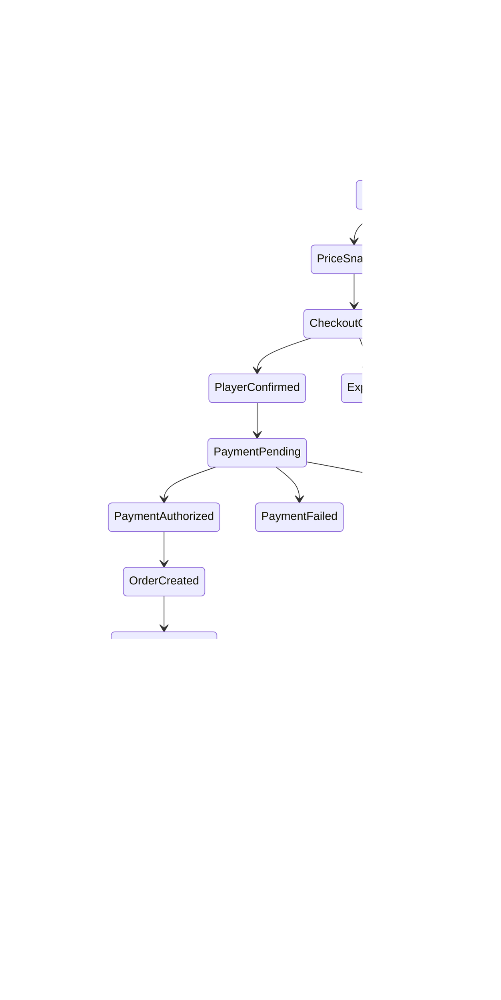

# Monetization System（商业化系统）

> Status: V1  
> Category: Commercial  
> Path: `design/systems/commercial/monetization-system.md`  
> Owner: TBD  
> Reviewers: Product / Design / Economy / Engineering / Finance / Legal / Privacy / Trust and Safety / Accessibility / Data / Support  
> Last Updated: 2026-07-11  
> Version: 1.0  
> Risk Level: Critical  
> Dependencies: Resources and Economy, Reward System, Progression System, Content and Unlocks, Entitlement and Ownership, Offers and Pricing, Save and Persistence, Settings and Preferences, Notification and Reminders  
> Affected Systems: Characters and Loadouts, Content Lifecycle, Live Operations, Experiment Management, Analytics and Telemetry, Moderation and Safety, Account and Family Controls

---

## 1. System Summary

Monetization System 负责定义：

```text
产品如何通过玩家自愿支付获得收入；
什么可以销售；
什么不能销售；
购买前玩家如何理解价值、价格、期限和所有权；
支付、发货、权益、退款和撤销如何保持一致；
付费货币、订阅、DLC、礼包、广告和随机机制如何治理；
商业化如何与游戏经济、成长、竞争、公平、儿童保护和长期信任保持边界。
```

商业化系统通常覆盖：

- Premium Purchase；
- DLC；
- Expansion；
- Subscription；
- Battle Pass；
- Season Pass；
- Cosmetic；
- Convenience；
- Account Service；
- Paid Currency；
- Earned Currency；
- Mixed Currency；
- Bundle；
- Offer；
- Discount；
- Coupon；
- Trial；
- Rental；
- Gift；
- Preorder；
- Crowdfunding Reward；
- Advertising；
- Rewarded Ads；
- Randomized Purchase；
- Pity；
- Duplicate Protection；
- Spending Limit；
- Receipt；
- Refund；
- Chargeback；
- Fraud；
- Tax；
- Regional Compliance；
- Parental Control；
- Commercial Analytics。

健康的商业化系统应让玩家感受到：

```text
我知道自己在买什么；
价格和期限清楚；
购买是自愿的；
不付费也能理解并享受核心体验；
付费不会秘密操纵难度、匹配或奖励；
已购买价值不会静默消失；
退款、取消和恢复有明确路径；
系统尊重我的时间、预算和脆弱状态。
```

---

## 2. Purpose

### 2.1 Player Value

商业化只有在提供真实价值时才成立。

它可以帮助玩家：

- 获得额外内容；
- 获得长期服务；
- 表达身份；
- 支持创作者或产品；
- 节省非核心重复操作时间；
- 获得便利；
- 解锁扩展体验；
- 订阅持续更新；
- 购买收藏和纪念性内容；
- 在清楚规则下参与自愿随机购买。

### 2.2 Experience Contribution

健康商业化可以支持：

- 长期运营；
- 稳定内容更新；
- 高质量服务；
- 更多创作；
- 社区活动；
- 免费或低门槛进入；
- 个性化表达。

不健康商业化会造成：

- Pay-to-Win；
- 人为制造痛点；
- 虚假稀缺；
- 误导价格；
- 多货币遮蔽成本；
- 强制每日参与；
- 未成年人高消费；
- 利用失败和疲劳；
- 订阅难取消；
- 已购内容下架；
- 随机机制不透明；
- 退款后状态混乱；
- 付费影响匹配、公平或安全。

### 2.3 Product Value

统一商业化系统可以：

- 建立一致购买流程；
- 降低支付和权益事故；
- 统一商品定义；
- 支持多平台和多地区；
- 支持税务和收据；
- 支持退款、Chargeback 和恢复；
- 统一订阅；
- 统一付费货币；
- 管理随机购买；
- 支持家长控制；
- 支持经济平衡；
- 支持审计和财务对账；
- 降低各功能自行接入支付的风险；
- 提高长期信任和收入质量。

### 2.4 Why This System Exists

如果每个功能自行商业化，常见问题包括：

```text
同一商品在不同页面价格不同；
购买成功但未获得权益；
发货成功但支付状态未知；
退款后商品仍可使用；
订阅取消后立即丢失已付费期间；
付费货币余额与交易记录不一致；
礼包显示的原价并不存在；
随机商品概率在客户端展示但服务端使用另一版本；
儿童账户绕过支出限制；
优惠实验覆盖玩家真实价格；
平台购买无法跨设备恢复；
商业通知伪装为系统消息；
Support 无法判断钱、商品和权益各自处于什么状态。
```

---

## 3. Non-Goals

商业化系统不负责：

- 代替完整经济系统；
- 代替支付平台；
- 代替 Offers and Pricing；
- 代替 Entitlement and Ownership；
- 通过人为制造挫折迫使付费；
- 用付费绕过核心竞争公平；
- 将辅助功能作为付费权益；
- 出售基础安全、隐私或举报能力；
- 根据玩家情绪、失败或脆弱状态隐藏提高价格；
- 让付费用户获得 Moderation 或处罚豁免；
- 让客户端成为支付和权益权威；
- 自动决定所有退款；
- 用多币种和礼包复杂度掩盖真实成本；
- 让所有内容都必须变现；
- 以短期收入为理由破坏长期产品健康。

---

## 4. Governing Principles

### 4.1 Player First Design

参考：

- `../../philosophy/foundation/player-first-design.md`

应用原则：

- 玩家先理解价值，再购买；
- 价格和所有权清楚；
- 购买不是完成核心教学的必要步骤；
- 取消、退款和恢复入口可发现；
- 不付费不应受到羞辱。

### 4.2 Choice and Consequence

参考：

- `../../philosophy/experience/choice-and-consequence.md`

应用原则：

- 高影响购买需要明确确认；
- 永久、限时、租赁和订阅语义不同；
- 随机购买前展示可能结果和规则；
- 玩家知道购买后的不可逆或可撤销后果。

### 4.3 Progression and Motivation

参考：

- `../../philosophy/long-term/progression-and-motivation.md`

应用原则：

- 商业化不应破坏成长意义；
- 不出售核心掌握感；
- 不用无限数值膨胀推动消费；
- 付费便利不应让免费路径变得故意痛苦。

### 4.4 Challenge and Fairness

参考：

- `../../philosophy/experience/challenge-and-fairness.md`

应用原则：

- 正式竞争不受付费状态秘密影响；
- 付费不应提供不可克服的战斗优势；
- 匹配和掉落不根据消费秘密调整；
- 竞技辅助和商业权益必须分离。

### 4.5 Ethical Design

参考：

- `../../philosophy/responsibility/ethical-design.md`

应用原则：

- 不使用虚假倒计时；
- 不制造虚假折扣；
- 不利用儿童、失败、疲劳、孤独或焦虑；
- 订阅容易取消；
- 随机机制透明；
- 营销、服务和安全消息明确区分；
- 高消费需要保护和提醒。

---

## 5. Player Experience

### 5.1 Player Goal

玩家使用商业系统通常为了：

- 查看商品；
- 比较价值；
- 购买；
- 订阅；
- 取消；
- 兑换；
- 恢复购买；
- 使用付费货币；
- 查看交易；
- 申请退款；
- 查看权益；
- 管理支出；
- 设置家长限制；
- 领取已购内容；
- 查看随机机制规则。

### 5.2 Entry

入口包括：

- Store；
- Content Page；
- Character Page；
- Cosmetics；
- Battle Pass；
- Subscription Page；
- Offer；
- Event；
- Trial；
- Notification；
- Account；
- Entitlement Page；
- Platform Store；
- Purchase History；
- Family Controls。

### 5.3 Main Actions

玩家可以：

- Browse；
- Preview；
- Compare；
- Buy；
- Subscribe；
- Upgrade；
- Downgrade；
- Cancel；
- Redeem；
- Gift；
- Restore Purchase；
- View Receipt；
- Request Refund；
- Set Spending Limit；
- Hide Offers；
- View Probability；
- Confirm Age / Parent；
- Manage Auto-Renew。

### 5.4 Core Decisions

关键决策包括：

- 是否购买；
- 买永久权益还是订阅；
- 使用真钱还是付费货币；
- 是否购买礼包；
- 是否参与随机机制；
- 是否自动续费；
- 是否使用优惠；
- 是否赠礼；
- 是否接受限时条款；
- 是否申请退款；
- 是否设置支出上限。

### 5.5 Success

健康体验意味着：

- 商品内容、价格和期限清楚；
- 购买路径短但不误导；
- 交易状态明确；
- 发货和权益及时；
- 失败不会重复扣款；
- 退款和取消可完成；
- 多平台规则可理解；
- 支出控制真实生效；
- 随机概率和保底可验证；
- 已购价值受到保护。

### 5.6 Failure

失败包括：

- 重复扣款；
- 未发货；
- 发货错误；
- 商品描述不符；
- 价格不同步；
- 订阅无法取消；
- 自动续费不清楚；
- 恢复购买失败；
- 退款后状态不一致；
- 付费货币余额错误；
- 限时商品过早下架；
- 儿童绕过限制；
- 平台和产品收据冲突。

---

## 6. System Boundary

### 6.1 Inputs

系统接收：

- Product Catalog；
- Offer；
- Price；
- Currency；
- Player Account；
- Region；
- Age and Family State；
- Platform；
- Tax Context；
- Payment Method；
- Purchase Request；
- Subscription State；
- Entitlement State；
- Inventory and Economy State；
- Promotion；
- Coupon；
- Eligibility；
- Fraud Signal；
- Refund Request；
- Chargeback；
- Live Operations Schedule；
- Experiment Assignment；
- Legal and Compliance Policy。

### 6.2 Outputs

系统产生：

- Purchase Intent；
- Checkout Session；
- Payment Request；
- Payment Result；
- Order；
- Receipt；
- Fulfillment Request；
- Entitlement Grant；
- Currency Transaction；
- Subscription State；
- Refund State；
- Chargeback State；
- Commercial History；
- Spending State；
- Player-Facing Confirmation；
- Commercial Event。

### 6.3 Owned State

系统拥有：

- Monetization Definition；
- Product Reference；
- Purchase Intent；
- Order；
- Checkout State；
- Payment State Reference；
- Fulfillment State；
- Commercial Transaction；
- Subscription Commercial State；
- Refund Commercial State；
- Chargeback Commercial State；
- Spending Control State；
- Randomized Purchase State；
- Commercial Audit；
- Monetization Version。

### 6.4 Read-Only Dependencies

系统读取：

- Product Catalog；
- Offers and Pricing；
- Entitlement；
- Economy；
- Reward；
- Account；
- Family；
- Platform；
- Payment Provider；
- Legal；
- Tax；
- Save；
- Live Operations；
- Analytics。

### 6.5 Write Dependencies

系统通过正式契约请求：

- Payment Provider 扣款；
- Entitlement 创建拥有权；
- Economy 处理付费货币；
- Reward 创建交付实例；
- Save 持久化；
- Account 更新订阅和支出状态；
- Notification 发送交易和订阅消息；
- Support 创建退款和恢复 Case；
- Analytics 记录商业结果；
- Fraud 系统处理风险。

### 6.6 Out of Scope

商业化系统不直接：

- 计算战斗结果；
- 修改 Matchmaking；
- 直接处罚玩家；
- 修改核心难度；
- 直接写入角色属性；
- 绕过平台支付；
- 使用 Analytics 事件作为支付成功事实；
- 在未确认价格和所有权前发起购买。

---

## 7. Core Entities and Concepts

| Entity / Concept | Definition | Owner | Lifetime | Notes |
|---|---|---|---|---|
| Product | 可购买对象定义 | Catalog / Commercial | 版本级 | 唯一 Product ID |
| SKU | 平台和销售层具体商品标识 | Commercial / Platform | 版本级 | 可映射同一 Product |
| Offer | 在特定条件下展示的购买方案 | Offers | 短期或长期 | 不等同 Product |
| Price | 某地区、平台、时间的价格 | Pricing | 版本级 | 含币种和税规则 |
| Purchase Intent | 玩家确认前的购买意图 | Monetization | 短期 | 有 Expiry |
| Checkout Session | 一次结账上下文 | Monetization | 短期 | 绑定价格快照 |
| Order | 一次商业订单 | Monetization | 长期 | 唯一 Order ID |
| Payment Transaction | 支付提供方交易引用 | Payment Provider | 长期 | 外部权威 |
| Fulfillment | 向玩家交付商品或权益 | Monetization / Entitlement | 至完成 | 幂等 |
| Receipt | 交易凭证 | Platform / Monetization | 长期 | 有地区要求 |
| Entitlement | 对内容或服务的使用权 | Entitlement | 长期或期限级 | 与 Order 分离 |
| Paid Currency | 通过真钱购买的内部货币 | Economy | 长期 | 需 Ledger |
| Earned Currency | 通过游戏获得的货币 | Economy | 长期 | 与 Paid 分离 |
| Mixed Balance | 可由付费和免费来源组成的余额 | Economy | 长期 | 消耗顺序必须明确 |
| Subscription | 持续服务关系 | Monetization / Entitlement | 周期级 | 有续费和宽限 |
| Refund | 逆转订单的商业流程 | Monetization / Provider | 至完成 | 不等同 Chargeback |
| Chargeback | 支付渠道争议逆转 | Provider / Fraud | 事件级 | 可能触发风险 |
| Gift | 购买者与接收者不同的订单 | Monetization | 长期 | 有资格和防欺诈 |
| Randomized Purchase | 结果包含随机性的购买 | Monetization | 实例级 | 高风险 |
| Pity State | 随机机制中的累计保护状态 | Monetization / Reward | 长期或池级 | 必须版本化 |
| Spending Control | 限额、冷静期和家长控制 | Account / Commercial | 长期 | 权威限制 |

---

## 8. Product Taxonomy

### 8.1 Base Product

基础产品本体。

### 8.2 DLC

额外下载内容。

### 8.3 Expansion

较大规模扩展。

### 8.4 Subscription

持续访问或服务。

### 8.5 Pass

在固定周期内提供任务、奖励或权益。

### 8.6 Cosmetic

不改变核心能力的表现内容。

### 8.7 Convenience

减少非核心摩擦。

### 8.8 Service

例如：

- 改名；
- 转服；
- 角色槽；
- 存档槽；
- 外观重置。

### 8.9 Currency Pack

付费货币包。

### 8.10 Bundle

多个 Product 组合。

### 8.11 Trial

有限时间或范围试用。

### 8.12 Rental

限时使用。

### 8.13 Gift

赠送商品。

### 8.14 Preorder

正式发布前购买。

### 8.15 Crowdfunding / Founder Pack

支持型商品，需明确风险和承诺边界。

---

## 9. Product Definition Template

```markdown
## Product Definition

- Product ID:
- Display Name:
- Product Type:
- Player Value:
- Contents:
- Ownership Type:
- Duration:
- Platforms:
- Regions:
- Age Restrictions:
- Prerequisites:
- Entitlement:
- Fulfillment:
- Refund Policy:
- Transferable:
- Giftable:
- Restore Purchase:
- Content Lifecycle:
- Accessibility Impact:
- Competitive Impact:
- Version:
- Owner:
- Risk Level:
```

### 9.1 必须回答

- 卖什么；
- 玩家获得什么；
- 永久还是限时；
- 是否订阅；
- 是否消耗；
- 是否可退款；
- 是否可恢复；
- 是否跨平台；
- 是否影响竞争；
- 内容退役后怎么办；
- 是否适合儿童账户。

---

## 10. Ownership Types

### 10.1 Permanent Ownership

永久拥有，但仍受：

- 服务关闭；
- 法律；
- 许可；
- 平台；
- 账户政策；

边界影响。

### 10.2 Time-Limited Access

在明确时间内使用。

### 10.3 Subscription Access

订阅有效期间使用。

### 10.4 Consumable

使用后减少或消失。

### 10.5 Rental

明确开始和结束。

### 10.6 Trial

有限功能或时间。

### 10.7 Revocable License

必须明确可撤销条件，不应使用模糊条款隐藏普通下架风险。

### 10.8 Ownership Communication

购买前显示：

- 取得何种权利；
- 是否永久；
- 是否跨平台；
- 是否需要联网；
- 到期后状态；
- 退款和撤销；
- 内容下架处理。

---

## 11. Monetization Models

### 11.1 Premium

一次性购买完整产品。

### 11.2 Free-to-Play

免费进入，依赖可选消费。

### 11.3 Subscription

周期收费。

### 11.4 Hybrid

Premium + DLC / Cosmetic / Subscription。

### 11.5 Ad-Supported

以广告支持。

### 11.6 Creator Marketplace

玩家创作交易。

### 11.7 Crowdfunding

开发前或开发中支持。

### 11.8 Model Fit

商业模型必须与：

- 核心体验；
- 内容节奏；
-目标用户；
-平台；
-运营能力；
-法律；
-团队价值观；

匹配。

---

## 12. Purchase Lifecycle

```text
Product Viewed
→ Purchase Intent Created
→ Eligibility Validated
→ Price Snapshot Created
→ Checkout Opened
→ Player Confirmed
→ Payment Pending
→ Payment Authorized
→ Order Created
→ Fulfillment Pending
→ Fulfilled
→ Entitlement Verified
→ Completed
```

异常：

```text
Eligibility Rejected
Checkout Expired
Payment Failed
Payment Unknown
Payment Reversed
Fulfillment Failed
Entitlement Failed
Refund Pending
Refunded
Chargeback
Cancelled
```



---

## 13. Purchase Invariants

1. 同一 Purchase Intent 只能生成一个有效 Order。
2. Order ID 必须唯一。
3. Payment Authorized 不等于 Fulfilled。
4. Fulfilled 不等于 Payment 最终不可逆。
5. Player-Facing Success 只能在 Order 和 Fulfillment 达到明确成功状态后展示。
6. Unknown Payment 必须查询，不得盲目重试扣款。
7. Fulfillment 必须幂等。
8. Entitlement Grant 必须引用 Order。
9. Analytics 失败不影响支付和发货。
10. 价格快照在 Checkout 内固定。
11. 退款和 Chargeback 不得通过客户端自行决定。
12. 同一 Order 不得重复发货。
13. 恢复购买不得重复创建永久权益。
14. 儿童和家长限制优先于 Offer Eligibility。
15. 商业实验不得改变已确认 Checkout 价格。
16. 付费状态不得影响 Moderation、Matchmaking 或安全规则。

---

## 14. Purchase Intent

Purchase Intent 应包含：

- Intent ID；
- Account；
- Product；
- Offer；
- SKU；
- Platform；
- Region；
- Currency；
- Price；
- Tax Mode；
- Quantity；
- Eligibility Snapshot；
- Age / Family Snapshot；
- Created At；
- Expiry；
- Idempotency Key；
- Source Surface；
- Version。

### 14.1 Expiry

Intent 过期后需重新获取价格和资格。

### 14.2 No Hidden Mutation

Intent 创建后，不应静默改变：

- Product；
- Quantity；
- Price；
- Duration；
- Subscription；
- Auto-Renew；
- Ownership。

---

## 15. Checkout

### 15.1 Checkout Requirements

显示：

- 商品；
- 内容；
- 数量；
- 单价；
- 总价；
- 币种；
- 税；
- 折扣；
- 使用期限；
- 自动续费；
- 退款；
- 账户；
- 平台；
- 支付方式；
- 付费货币消耗。

### 15.2 Confirmation

高风险购买需要：

- 明确按钮；
- 不使用默认勾选；
- 不误导；
- 不隐藏总价；
- 不把关闭放在不易发现位置。

### 15.3 Platform Checkout

平台支付界面与产品内信息必须一致。

### 15.4 Purchase Friction

摩擦应与风险匹配：

- 小额重复购买；
- 大额购买；
- 订阅；
- 自动续费；
- 随机商品；
- 儿童购买；
- Gift；

需要不同确认强度。

---

## 16. Payment States

### 16.1 Created

支付请求已建立。

### 16.2 Pending

等待用户或 Provider。

### 16.3 Authorized

支付已授权。

### 16.4 Captured

资金已确认捕获。

### 16.5 Failed

支付失败。

### 16.6 Cancelled

玩家或 Provider 取消。

### 16.7 Unknown

无法确认最终状态。

### 16.8 Reversed

授权被撤销。

### 16.9 Refunded

已退款。

### 16.10 Charged Back

发生 Chargeback。

### 16.11 Provider Is Payment Authority

内部系统引用 Provider 状态，不应伪造支付成功。

---

## 17. Order

Order 应包含：

- Order ID；
- Account；
- Product；
- SKU；
- Offer；
- Price Snapshot；
- Currency；
- Tax；
- Payment Transaction；
- State；
- Fulfillment；
- Entitlement；
- Receipt；
- Refund；
- Chargeback；
- Created At；
- Completed At；
- Platform；
- Region；
- Version；
- Correlation ID。

### 17.1 Order Is Long-Lived

Order 是财务和权益审计基础，不应随商品下架删除。

### 17.2 Order History

玩家可查看必要摘要。

---

## 18. Fulfillment

### 18.1 Fulfillment Types

- Entitlement Grant；
- Currency Credit；
- Reward Instance；
- Inventory Item；
- Subscription Activation；
- Content Unlock；
- Account Service；
- Gift Delivery。

### 18.2 Fulfillment Flow

```text
Order Authorized
→ Validate Product Version
→ Create Fulfillment Instance
→ Apply Domain Transaction
→ Verify
→ Mark Fulfilled
```

### 18.3 Partial Bundle Fulfillment

礼包多个内容必须：

- 原子；
- 或记录逐项状态并支持恢复。

### 18.4 Fulfillment Failure

处理：

- 自动重试；
- Pending；
- Support；
- 退款；
- 部分补偿；
- 不重复发货。

### 18.5 Fulfillment Verification

不能只相信客户端展示。

---

## 19. Entitlement Integration

### 19.1 Entitlement Is Separate

Order 表示商业交易。

Entitlement 表示使用权。

### 19.2 Grant

Entitlement 必须记录：

- Source Order；
- Product；
- Scope；
- Platform；
- Start；
- End；
- Ownership Type；
- Version。

### 19.3 Restore Purchase

恢复时：

- 查询平台和 Order；
- 重建缺失 Entitlement；
- 不重复发放 Consumable；
- 不重复发放一次性奖励；
- 记录恢复来源。

### 19.4 Entitlement Failure

支付成功但权益失败是 Critical Incident。

---

## 20. Paid Currency

### 20.1 Paid Currency Definition

通过真钱获得的内部价值媒介。

### 20.2 Ledger

余额必须由 Ledger 推导。

### 20.3 Currency Pack

显示：

- 购买金额；
- 付费货币数量；
- Bonus；
- 每单位价格；
- 是否过期；
- 退款规则；
- 地区币种。

### 20.4 Bonus Currency

必须明确：

- 是否与主余额同等；
- 是否可退款；
- 消耗顺序；
- 是否过期；
- 是否可用于全部商品。

### 20.5 No Obfuscation

不应设计过多换算层级来掩盖真实成本。

---

## 21. Paid, Earned and Mixed Balances

### 21.1 Separate Balances

推荐至少逻辑区分：

- Paid；
- Earned；
- Promotional；
- Refund Credit；
- Region-Specific。

### 21.2 Spend Order

必须明确：

- 先用哪一类；
- 玩家是否可选；
- 退款时如何计算；
- 跨平台如何处理。

### 21.3 Display

可以显示总额，但应能解释组成。

### 21.4 Cross-Platform

部分平台可能限制 Paid Currency 跨平台使用。

### 21.5 Expiry

Paid Currency 通常不应轻易过期；如法律允许且必须过期，应非常清楚。

---

## 22. Currency Purchase Flow

```text
Select Pack
→ Show Real-Money Price
→ Confirm
→ Payment
→ Order
→ Ledger Credit
→ Balance Verify
→ Receipt
```

### 22.1 No Direct Balance Write

支付成功不能直接修改客户端余额。

### 22.2 Unknown Result

查询 Order 和 Ledger。

### 22.3 Refund

退款后根据未消费状态和平台政策处理。

---

## 23. Subscription

### 23.1 Subscription Definition

- Subscription ID；
- Product；
- Tier；
- Billing Period；
- Trial；
- Price；
- Auto-Renew；
- Benefits；
- Start；
- Renewal；
- Grace；
- Expiry；
- Cancellation；
- Refund；
- Platform；
- Region。

### 23.2 Subscription Lifecycle

```text
Eligible
→ Trial
→ Active
→ Renewal Pending
→ Renewed
```

异常和结束：

```text
Payment Failed
Grace Period
Paused
Cancelled
Expired
Refunded
Revoked
```

### 23.3 Active vs Cancelled

取消自动续费不等于立即失去已付费期间。

### 23.4 Grace Period

支付失败后可提供有限宽限。

### 23.5 Benefits

到期后明确：

- 什么失效；
- 什么保留；
- 已获得奖励；
- 下载内容；
- 存档；
- 角色和构筑；
- 离线使用。

---

## 24. Subscription Transparency

购买前显示：

- 价格；
- 周期；
- 试用结束；
- 自动续费；
- 下次扣款；
- 取消方法；
- 到期影响；
- 退款；
- 地区税。

### 24.1 Trial

免费试用：

- 不默认隐藏续费；
- 提前提醒；
- 取消简单；
- 不使用虚假免费；
- 不要求不必要支付信息，除非平台规则和清楚说明。

### 24.2 Price Change

提前通知并按法律和平台规则处理。

### 24.3 Downgrade

说明何时生效和权益变化。

---

## 25. Battle Pass and Season Pass

### 25.1 Pass Components

- Free Track；
- Premium Track；
- Objectives；
- Progression；
- Rewards；
- Start；
- End；
- Grace；
- Catch-Up；
- Purchase Cutoff；
- Claim Period。

### 25.2 Ethical Risks

- 时间压力；
- 沉没成本；
- 每日强制；
- 过度任务；
- 付费后仍需高强度劳动；
- 购买后奖励过期。

### 25.3 Healthy Pass

- 提前展示完整价值；
- 进度合理；
- 支持 Catch-Up；
- 不要求极端每日登录；
- 已完成等级购买后可追溯领取；
- 到期前清楚提醒；
- 未领取奖励有合理处理。

### 25.4 Premium Track

不应包含正式竞争不可替代的数值优势。

---

## 26. DLC and Expansion

### 26.1 Access

明确：

- Base Product Requirement；
- Ownership；
- Platform；
- Save Compatibility；
- Multiplayer；
- Party；
- Host Sharing；
- Guest Access；
- Offline；
- Region。

### 26.2 Multiplayer

Party 中部分成员未拥有 DLC 时：

- 阻止进入；
- 提供 Guest Pass；
- Host Share；
- 替代内容；
- 提示购买。

规则必须在邀请和 Ready 前说明。

### 26.3 Retirement

许可或服务变化时保护已购价值。

---

## 27. Cosmetic Monetization

### 27.1 Cosmetic Types

- Character Skin；
- Weapon Skin；
- Avatar；
- Banner；
- Emote；
- Voice；
- VFX；
- UI Theme；
- Housing；
- Profile；
- Pet；
- Mount。

### 27.2 Competitive Readability

Cosmetic 不应：

- 隐藏 Hitbox；
- 混淆队伍；
- 降低目标识别；
- 制造视觉优势；
- 绕过内容评级。

### 27.3 Preview

支持：

- 多角度；
- 动画；
- 实际场景；
- 不同设备；
- 可访问性。

### 27.4 Ownership

明确角色依赖和退款影响。

---

## 28. Convenience Monetization

### 28.1 Suitable Areas

- 存档槽；
- 外观槽；
- 可选自动化；
- 非核心重复；
- 账户服务；
- 额外空间。

### 28.2 Risk

产品可能故意制造不便再售卖解决方案。

### 28.3 Test

必须问：

```text
如果这个付费便利不存在，
基础免费体验是否仍然合理？
```

### 28.4 Prohibited

不出售：

- 基础辅助；
- 举报；
- Block；
- 必要存档安全；
- 账户安全；
- 核心性能；
- 基础设置；
- 取消订阅。

---

## 29. Pay-to-Win Boundary

### 29.1 Pay-to-Win Signals

- 付费获得不可替代强度；
- 付费获得更高 Rating；
- 付费缩短核心成长到明显压倒；
- 付费角色长期显著更强；
- 付费提高随机成功率；
- 付费降低竞技惩罚；
- 付费影响 Matchmaking；
- 付费获得隐藏信息。

### 29.2 Acceptable Power Sales

若产品确实销售力量，必须：

- 明确；
- 不伪装公平竞争；
- 提供合理非付费路径；
- 控制上限；
- 避免无限膨胀；
- 评估儿童和地区法规。

### 29.3 Ranked Modes

正式 Ranked 通常应严格限制付费力量影响。

---

## 30. Randomized Purchases

### 30.1 Definition

玩家支付后，获得结果包含随机性。

### 30.2 High-Risk Requirements

必须定义：

- Pool；
- Probability；
- Price；
- Duplicate；
- Pity；
- Guarantee；
- Expiry；
- Region；
- Age；
- Purchase Limit；
- History；
- Refund；
- Compensation；
- Version。

### 30.3 Probability Transparency

展示：

- 单项概率；
- 类别概率；
- 是否动态；
- 是否受 Pity 影响；
- 是否保底；
- 是否重复；
- Pool 版本。

### 30.4 No Hidden Personalization

概率不能根据：

-消费历史；
-失败；
-情绪；
-留存风险；
-年龄；
-脆弱状态；

秘密变化。

---

## 31. Randomized Purchase Lifecycle

```text
Intent
→ Price Confirmed
→ Pool Version Locked
→ Payment / Currency Spend
→ Random Seed Committed
→ Result Generated
→ Reward Granted
→ History Recorded
```

异常：

```text
Spend Unknown
Result Pending
Grant Failed
Duplicate Conversion Failed
Pity Update Failed
```

### 31.1 Atomicity

Spend、Result、Grant、History 和 Pity 必须处于一致事务。

### 31.2 Verifiability

内部应能审计：

- Pool Version；
- Seed Reference；
- Probability；
- Pity Before；
- Pity After；
- Result；
- Grant。

### 31.3 Player History

提供合理购买和结果历史。

---

## 32. Pity and Guarantee

### 32.1 Pity Types

- Hard Pity；
- Soft Pity；
- Guaranteed Category；
- Guaranteed Featured；
- Choice Guarantee；
- Exchange Token；
- Duplicate Protection。

### 32.2 Scope

Pity 必须明确绑定：

- Pool；
- Banner；
- Product；
- Season；
- Account；
- Platform；
- Region。

### 32.3 Carryover

明确是否跨：

- Banner；
- Season；
- Featured；
- Platform；
- Region。

### 32.4 No Silent Reset

Pity 重置必须提前说明并符合规则。

### 32.5 Refund

退款和 Chargeback 后 Pity 如何处理需明确。

---

## 33. Duplicate Handling

### 33.1 Possible Outcomes

- Duplicate Allowed；
- Conversion；
- Upgrade；
- Token；
- Reroll；
- Protection；
- Player Choice。

### 33.2 Value

转换价值需要清楚。

### 33.3 No Zero-Value Surprise

高价值随机购买不应在未说明时产生几乎无价值重复。

---

## 34. Purchase Limits and Cooling-Off

### 34.1 Limits

可以按：

- 每日；
- 每周；
- 每月；
- 活动；
- Product；
- Account；
- Age；
- Region；
- Family。

### 34.2 Cooling-Off

高频或高额消费后可以：

- 提醒；
- 延迟；
- 要求重新确认；
- 提供支出摘要；
- 提供停止入口。

### 34.3 Self-Set Limits

玩家可设：

- 日限额；
- 月限额；
- 单笔限额；
- 随机购买限额；
- Quiet Commercial Hours；
- PIN。

### 34.4 Limit Reduction

降低限额应立即或尽快生效。

提高限额可以有冷静期。

---

## 35. Spending Controls

### 35.1 Account Controls

- Spending Cap；
- Purchase PIN；
- Disable Randomized Purchase；
- Disable Paid Currency；
- Disable Gifting；
- Disable Subscription；
- Receipt Notification。

### 35.2 Family Controls

- Parent Approval；
- Child Account Limit；
- Age-Restricted Product；
- Monthly Budget；
- Purchase History；
- Auto-Renew Restriction。

### 35.3 Server Enforcement

不能只在客户端隐藏按钮。

### 35.4 Circumvention

跨设备、平台 Store 和 Gift 不能绕过产品安全限制，除非平台边界明确且已说明。

---

## 36. Advertising

### 36.1 Ad Types

- Banner；
- Interstitial；
- Rewarded；
- Sponsored Placement；
- Native；
- Cross-Promotion。

### 36.2 Ad Principles

- 明确标记；
- 不伪装系统内容；
- 不遮挡关键操作；
- 不在高风险时出现；
- 不影响安全和隐私；
- 儿童广告受限；
- 可关闭或限制；
- 不强迫观看以恢复基础功能。

### 36.3 Rewarded Ads

玩家主动选择观看以获得奖励。

必须：

- 奖励明确；
- 广告完成验证；
- 失败可恢复；
- 不重复；
- 不在儿童或受限地区违规使用；
- 不制造基础体验痛苦。

### 36.4 Ad Personalization

需要：

- 同意；
- 地区合规；
- 年龄保护；
- 数据最小化；
- 可关闭。

---

## 37. Rewarded Ad Lifecycle

```text
Offer Shown
→ Player Opt-In
→ Ad Requested
→ Ad Started
→ Ad Completed
→ Verification
→ Reward Instance Created
→ Reward Granted
```

异常：

```text
No Fill
Playback Failed
Verification Failed
Reward Pending
Duplicate Callback
```

### 37.1 Invariants

- 未完成广告不发奖励，除非错误补偿策略；
- 同一观看只发一次；
- Provider Callback 幂等；
- Analytics 失败不影响 Reward；
- 玩家主动选择；
- 不自动播放。

---

## 38. Offers and Bundles

详细定价和 Offer 逻辑由：

- `offers-and-pricing.md`

定义。

Monetization System 负责确保：

- Offer 引用真实 Product；
- Checkout 使用固定价格快照；
- Bundle 内容可验证；
- 已拥有内容处理清楚；
- 折扣不虚假；
- Offer Expiry 真实；
- 购买后正确发货。

### 38.1 Owned Item in Bundle

可采用：

- 不允许重复购买；
- 降价；
- 替代；
- 退款信用；
- 明确重复无额外价值。

不能静默收取完整价格并不给价值。

---

## 39. Trials

### 39.1 Trial Types

- Time-Limited；
- Feature-Limited；
- Content-Limited；
- Usage-Limited；
- Subscription Trial；
- Character Trial。

### 39.2 Trial Requirements

说明：

- 开始条件；
- 结束条件；
- 自动续费；
- 存档；
- 转正；
- 奖励；
- 购买；
- 再试；
- 平台。

### 39.3 No Fake Trial

若必须付费且难以取消，不应称为“免费试用”。

---

## 40. Gift

### 40.1 Gift Flow

```text
Select Product
→ Select Recipient
→ Validate Eligibility
→ Confirm Price and Recipient
→ Payment
→ Order
→ Recipient Delivery
→ Acceptance or Auto-Grant
```

### 40.2 Eligibility

检查：

- 好友关系；
- 地区；
- 平台；
- 年龄；
- Ownership；
- Block；
- Fraud；
- Gift Limits。

### 40.3 Risks

- 诈骗；
- 洗钱；
- Chargeback；
- 骚扰；
- 未成年人；
- 跨地区套利。

### 40.4 Decline

接收者可以拒绝某些 Gift。

---

## 41. Preorder

### 41.1 Requirements

展示：

- 产品状态；
- 预计时间；
- 不确定性；
- 奖励；
- 取消；
- 退款；
- 平台；
- 交付；
- 内容变化权利；
- 延期处理。

### 41.2 No False Certainty

未完成内容不应使用确定性描述。

### 41.3 Preorder Bonus

不应制造核心能力永久错过。

---

## 42. Crowdfunding and Founder Packs

### 42.1 Risks

- 产品可能变化；
- 时间不确定；
- 奖励延迟；
- 服务失败；
- 投资与购买混淆。

### 42.2 Communication

必须说明：

- 是购买、支持还是投资；
- 回报；
- 风险；
- 时间；
- 退款；
- 权利；
- 交付。

---

## 43. Refund

### 43.1 Refund Types

- Player Requested；
- Platform；
- Automatic；
- Partial；
- Full；
- Subscription；
- Duplicate Purchase；
- Service Failure；
- Legal；
- Fraud。

### 43.2 Refund Flow

```text
Request
→ Eligibility
→ Evidence / Order Check
→ Decision
→ Provider Refund
→ Entitlement Adjustment
→ Currency / Item Reconciliation
→ Confirmation
```

### 43.3 Refund Invariants

1. Refund 必须引用 Order。
2. Provider Refund 和内部撤销必须对账。
3. 退款不能导致负余额状态无法解释。
4. 已消费 Consumable 需按政策处理。
5. 退款后 Entitlement 不应静默保留，除非政策允许。
6. 错误退款恢复需要审计。
7. Analytics 失败不影响退款。
8. 同一 Order 不重复退款。

---

## 44. Refund Eligibility

考虑：

- 商品类型；
- 购买时间；
- 使用情况；
- 地区法律；
- 平台政策；
- 服务故障；
- 描述不符；
- 未成年人；
- 重复购买；
- 诈骗；
- 已消费；
- 随机购买；
- 订阅；
- Chargeback。

### 44.1 No Dark Refund Flow

退款和取消入口不应故意隐藏。

### 44.2 Partial Refund

礼包或订阅可以部分退款，但规则要清楚。

---

## 45. Refund Reconciliation

### 45.1 Permanent Content

撤销 Entitlement 或按政策保留。

### 45.2 Consumable

若已使用：

- 拒绝；
- 部分退款；
- 负余额；
- 账户信用；
- Support 审核。

### 45.3 Paid Currency

根据剩余 Paid Portion 处理。

### 45.4 Bundle

按实际交付和使用状态处理。

### 45.5 Subscription

处理：

- 当前周期；
- 未来续费；
- 试用；
- 宽限；
- 已领取权益。

---

## 46. Chargeback

### 46.1 Definition

玩家通过支付渠道争议交易。

### 46.2 Flow

```text
Chargeback Notice
→ Order Match
→ Risk Review
→ Entitlement / Asset Hold
→ Evidence Response
→ Provider Decision
→ Reconcile
```

### 46.3 No Immediate Permanent Ban by Default

需要区分：

- 盗刷；
- 误解；
- 家庭购买；
- 服务故障；
- 恶意欺诈。

### 46.4 Abuse

重复恶意 Chargeback 可触发限制。

### 46.5 Recovery

Chargeback 撤销后恢复权益和限制。

---

## 47. Fraud Prevention

### 47.1 Signals

- 支付方式；
- 设备；
- 账户；
- 地区；
- 速度；
- Gift；
- Chargeback；
- 订单模式；
- IP 风险；
- 身份；
- 平台；
- 退款模式。

### 47.2 Actions

- Extra Verification；
- Delay Fulfillment；
- Spending Limit；
- Gift Restriction；
- Transaction Hold；
- Manual Review；
- Account Protection。

### 47.3 False Positive Protection

不能仅因：

- 旅行；
- 家庭共享；
- 新设备；
- 高额合法购买；

直接永久限制。

---

## 48. Purchase Recovery

### 48.1 Scenarios

- Payment Succeeded / Fulfillment Failed；
- Entitlement Missing；
- Device Changed；
- Reinstall；
- Platform Restore；
- Save Lost；
- Subscription Desync；
- Receipt Missing；
- Unknown Payment。

### 48.2 Recovery Order

```text
Query Order
→ Query Provider
→ Query Entitlement
→ Query Ledger / Reward
→ Reconcile
→ Restore Missing State
→ Confirm
```

### 48.3 Support Recovery

必须：

- 最小权限；
- Order 和 Receipt；
- 幂等；
- 审计；
- 不手工直接加资产绕过交易链。

---

## 49. Receipts and History

### 49.1 Receipt Fields

- Order；
- Product；
- Price；
- Tax；
- Currency；
- Date；
- Platform；
- Payment Reference；
- Subscription；
- Refund；
- Support Link。

### 49.2 Purchase History

玩家应能查看：

- 已完成；
- Pending；
- Failed；
- Refunded；
- Subscription；
- Gift；
- Paid Currency。

### 49.3 Sensitive Data

不展示完整支付凭据。

---

## 50. Tax and Regional Compliance

### 50.1 Tax Modes

- Tax Included；
- Tax Added；
- Platform Managed；
- Region Specific。

### 50.2 Regional Requirements

可能影响：

- 价格；
- 随机机制；
- 年龄；
- 退款；
- 收据；
- 订阅；
- 广告；
- Paid Currency；
- Gift；
- 支出限制。

### 50.3 Region Change

账户或居住地变化需要：

- 验证；
- 价格更新；
- 货币处理；
- Entitlement 保护；
- 防套利；
- 法律合规。

---

## 51. Platform Differences

### 51.1 Platform Store

每个平台可能有：

- SKU；
- 价格层；
- 税；
- 退款；
- 订阅；
- 钱包；
- 收据；
- Gift；
- Restore Purchase；
- Cross-Progression；

差异。

### 51.2 Product Consistency

商品核心价值应尽量一致。

### 51.3 Platform-Exclusive

如存在，需要清楚标识。

### 51.4 Cross-Platform Entitlement

明确：

- 是否共享；
- 哪个平台购买；
- 哪个平台使用；
- 退款影响；
- Paid Currency 限制。

---

## 52. Offline and Delayed Purchase

### 52.1 Offline Browsing

可以浏览缓存 Catalog，但购买前必须刷新：

- Price；
- Availability；
- Region；
- Eligibility；
- Offer。

### 52.2 Offline Fulfillment

高价值购买通常需要在线确认。

### 52.3 Delayed Callback

Provider 可能延迟回调。

系统必须支持：

- Pending；
- Query；
- Idempotency；
- Reconciliation；
- Player Notice。

---

## 53. Content Lifecycle and Commercial Products

### 53.1 Product Retirement

商品停止销售不等于已购权益失效。

### 53.2 Stop Sale vs Stop Access

必须区分：

- Stop Sale；
- Stop New Entitlement；
- Stop Download；
- Stop Access；
- Retire；
- Archive。

### 53.3 Licensed Content

许可到期前处理：

- 停止销售；
- 继续访问；
- 下载；
- 已购保护；
- 替代；
- 退款；
- 通知。

### 53.4 Live Service Shutdown

应提前定义：

- 访问终止；
- 退款或信用；
- 导出；
- 离线；
- 存档；
- 收据；
- 订阅停止；
- Paid Currency 处理。

---

## 54. Economy Integration

### 54.1 Commercial Source

购买是经济 Source。

### 54.2 Inflation Risk

售卖资源、能力和加速会影响：

- 通胀；
- Sink；
-成长速度；
-免费玩家；
-竞争；
-内容寿命。

### 54.3 Economy Review

每个商业商品需评估：

- 进入经济的价值；
- 是否永久；
- 是否可交易；
- 是否重复；
- 是否通胀；
- 是否替代玩法；
- 是否影响留存。

### 54.4 No Economy Override

商业系统不能直接跳过 Economy Ledger。

---

## 55. Progression Integration

### 55.1 Paid Acceleration

如提供：

- 必须有上限；
- 免费路径合理；
- 不破坏核心掌握；
- 不影响正式竞争；
- 不制造人为慢速。

### 55.2 Skip

售卖 Skip 需评估：

- 玩家错过的学习；
- 内容价值；
- 角色构筑；
- 社交；
- 匹配；
- 经济。

### 55.3 Pass Progress

付费 Pass 不应要求极端重复。

---

## 56. Reward Integration

### 56.1 Reward Instance

商业奖励必须通过 Reward System 创建。

### 56.2 Pending

Payment 成功后 Reward Pending 可恢复。

### 56.3 Duplicate Protection

同一 Order 只创建一次奖励。

### 56.4 Reward Expiry

已购买奖励通常不应因短领取窗口失效。

---

## 57. Competitive Integrity

### 57.1 Separation

商业系统不得控制：

- 对手；
- Rating；
- Rank；
- 匹配优先；
- 网络质量；
- Anti-Cheat 豁免；
- Moderation 豁免。

### 57.2 Competitive Products

可以销售：

- Cosmetic；
- Profile；
- Spectator Presentation；
- Tournament Entry（谨慎）；
- Non-Competitive Convenience。

### 57.3 Tournament Entry

需处理：

- 资格；
- 地区；
- 奖品法规；
- 退款；
- 取消；
- 儿童；
- 公平。

---

## 58. Accessibility

### 58.1 Commercial UI

- 价格有文本；
- 不只靠颜色；
- 支持读屏；
- 大字体不隐藏总价；
- 商品内容可展开；
- 关闭和取消可操作；
- 购买按钮与预览按钮清楚分离。

### 58.2 Input

- 键鼠、手柄、触摸、辅助设备；
- 高风险确认不要求精确操作；
- 不通过长按唯一方式确认；
- 支持撤回到最终提交前。

### 58.3 Cognitive

- 总价优先；
- 货币换算清楚；
- 订阅和随机机制使用普通语言；
- 不用复杂礼包制造混淆；
- 已拥有内容清楚标记。

### 58.4 Timing

- Checkout 有合理时间；
- 不使用虚假短倒计时；
- Subscription 取消不要求在极短窗口；
- Refund 和 Appeal 有合理时限。

### 58.5 Essential Accessibility

辅助功能不能付费化。

---

## 59. Child and Family Safety

### 59.1 Child Account Defaults

- 购买受限；
- Gift 受限；
- 随机购买受限或关闭；
- 广告个性化关闭；
- 订阅需家长；
- 支出摘要；
- 收据通知；
- 年龄不适商品隐藏。

### 59.2 Parent Approval

可按：

- 每次；
- 金额；
- Product Type；
- 月限额；
- 随机机制；
- 订阅；

配置。

### 59.3 No Bypass

平台 Store、Gift、Paid Currency 和跨设备不能绕过家长控制。

### 59.4 Marketing to Children

不得使用：

- 角色责备；
- 社交压力；
- 虚假稀缺；
- 隐藏价格；
- 复杂币种；
- 未经许可个性化。

---

## 60. Ethical Review

### 60.1 Dark Patterns

禁止：

- 预选购买；
- 隐藏取消；
- 虚假倒计时；
- 虚假原价；
- 自动添加商品；
- 不清楚续费；
- 误导按钮；
- 复杂货币遮蔽；
- 强制连续点击；
- 假免费；
- 购买后才显示限制。

### 60.2 Emotional Exploitation

不应在：

- 连续失败；
- 掉段；
- 社交排斥；
- 深夜；
- 疲劳；
- 重大损失；
- 儿童独处；
- 危机表达；

后触发高压商业 Offer。

### 60.3 Personalization

可以根据明确兴趣推荐，但不能根据脆弱状态或不透明价格歧视。

### 60.4 FOMO

- 稀缺必须真实；
- 返场策略清楚；
- 核心内容不永久错过；
- 已购买 Pass 有合理完成期；
- 不通过持续红点制造压力。

### 60.5 Spending Health

提供：

- 支出历史；
- 限额；
- 冷静期；
- 关闭随机购买；
- 关闭商业通知；
- 家长控制；
- Support。

---

## 61. Privacy

### 61.1 Commercial Data

包括：

- Orders；
- Receipts；
- Payment References；
- Subscription；
- Refund；
- Chargeback；
- Spending；
- Offer Interaction；
- Fraud Signals。

### 61.2 Data Minimization

不存储完整支付凭据。

### 61.3 Purpose Limitation

支付和欺诈数据不应无关用于操纵游戏难度或匹配。

### 61.4 Access

财务、Support、Fraud、Legal 使用严格权限。

### 61.5 Retention

按财务、税务、退款、法律和安全要求保留。

---

## 62. Security

### 62.1 Threats

- Payment Fraud；
- SKU Tampering；
- Price Tampering；
- Replay；
- Duplicate Fulfillment；
- Currency Injection；
- Receipt Forgery；
- Gift Abuse；
- Chargeback Fraud；
- Subscription Spoof；
- Client Balance Edit；
- Admin Abuse；
- Coupon Abuse；
- Region Arbitrage。

### 62.2 Controls

- Server Price；
- Signed Intent；
- Idempotency；
- Provider Verification；
- Receipt Validation；
- Ledger；
- Entitlement Authority；
- Fraud Detection；
- Rate Limit；
- RBAC；
- Audit；
- Device Risk；
- Manual Review。

### 62.3 Client Trust

客户端只负责展示和请求。

不能决定：

- Price；
- Payment；
- Entitlement；
- Paid Balance；
- Refund；
- Pity；
- Random Result。

---

## 63. Support and Operations

### 63.1 Support View

可查看：

- Order；
- Payment；
- Fulfillment；
- Entitlement；
- Receipt；
- Refund；
- Subscription；
- Currency Ledger；
- Gift；
- Random History；
- Pity；
- Fraud Hold；
- Platform。

### 63.2 Least Privilege

Support 不应直接：

- 创建虚假 Order；
- 修改支付结果；
- 手工增加 Paid Balance；
- 删除财务历史；
- 绕过家长控制。

### 63.3 Recovery Actions

可以：

- 重试 Fulfillment；
- 恢复 Entitlement；
- 查询 Payment；
- 重发 Receipt；
- 提交 Refund；
- 修复 Subscription；
- 解除错误 Hold。

需要审计和幂等。

---

## 64. Commercial Incident Management

### 64.1 Incident Types

- 重复扣款；
- 未发货；
- 错误价格；
- 货币异常；
- 订阅重复续费；
- 随机概率错误；
- Pity 重置；
- 退款失败；
- 儿童限制失效；
- Paid Currency 丢失；
- Offer 误导；
- 广告奖励异常；
- Entitlement 丢失。

### 64.2 Severity

#### SEV-1

大规模财务损失、儿童风险、价格或随机机制重大错误。

#### SEV-2

高影响但可快速恢复。

#### SEV-3

局部商品或平台问题。

#### SEV-4

低影响展示或文案问题。

### 64.3 Actions

- Stop Sale；
- Disable Checkout；
- Disable Offer；
- Freeze Random Pool；
- Stop Subscription Renewal；
- Preserve Orders；
- Reconcile；
- Refund；
- Restore；
- Notify；
- Support Playbook；
- Regulatory Escalation。

---

## 65. Failure and Recovery

| Failure | Cause | Player Impact | Recovery | Data Guarantee |
|---|---|---|---|---|
| Payment Unknown | Provider Timeout | 不知是否扣款 | Query Provider / Order | 不重复扣款 |
| Payment Success, No Order | 内部故障 | 已扣款未建单 | Provider Reconciliation | Payment Ref 保留 |
| Order Success, Fulfillment Failed | 下游异常 | 未获得商品 | 幂等重试、Support、退款 | Order 保留 |
| Duplicate Fulfillment | 重试错误 | 重复商品或货币 | Ledger / Entitlement 去重 | Order 只发一次 |
| Price Mismatch | Catalog 不一致 | 误导或错误扣款 | Stop Sale、按确认价格处理 | Price Snapshot 保留 |
| Currency Credit Failed | Ledger 异常 | 余额未增加 | 重放 Transaction | Ledger 幂等 |
| Subscription Desync | 平台与内部状态不同 | 权益错误 | Provider Query、Reconcile | 历史保留 |
| Refund Partial Failure | Provider 与内部不同步 | 钱或权益不一致 | Reconcile、人工审计 | Order 和 Refund 独立 |
| Chargeback Misclassification | 风险模型错误 | 账户错误限制 | Appeal、恢复 | Case 审计 |
| Pity Update Failed | 事务部分完成 | 保底错误 | 原子回滚或修复 | Purchase History 保留 |
| Random Result Grant Failed | Reward 异常 | 已花费无结果 | Result 查询、重发 | 结果唯一 |
| Parent Control Bypass | 跨平台或配置错误 | 未授权消费 | Stop Purchase、通知、退款审查 | 控制状态保留 |

---

## 66. Edge Cases

### Purchase

- 玩家多设备同时购买；
- Checkout 期间价格变化；
- Offer 过期但支付已开始；
- 应用切后台；
- 平台回调延迟；
- 支付成功后账号切换；
- 购买时内容下架；
- Quantity 超限。

### Currency

- Paid 与 Earned 混用；
- 跨平台余额；
- Bonus 先消费；
- 退款后余额已用；
- 负余额；
- 汇率变化；
- 地区切换；
- 过期活动货币。

### Subscription

- Trial 最后一天；
- Payment Failed；
- Grace；
- 多平台订阅；
- Upgrade / Downgrade；
- 重复订阅；
- 取消后退款；
- 价格变化；
- 平台订阅迁移。

### Random

- Pool 结束时购买 Pending；
- Pity 跨池；
- Featured 改变；
- Duplicate Conversion；
- Result Grant 失败；
- 退款；
- Chargeback；
- Region Rule Change；
- 未成年人年龄变化。

### Refund

- Bundle 部分使用；
- Gift 已接受；
- Subscription 已领取奖励；
- 预购延期；
- DLC 已进入存档；
- 货币已消费；
- 平台先退款；
- Chargeback 后申诉成功。

---

## 67. Cross-System Dependencies

| System | Dependency Type | Direction | Data or Event | Failure Impact |
|---|---|---|---|---|
| Offers and Pricing | Critical | Offers → Monetization | Offer / Price | 错误价格 |
| Entitlement and Ownership | Critical | 双向 | Grant / Revoke / Restore | 已购内容风险 |
| Resources and Economy | Critical | 双向 | Paid Currency / Ledger | 资产风险 |
| Reward System | Critical | Monetization → Reward | Fulfillment | 未发货或重复 |
| Progression System | Soft / Hard | Monetization → Progression | Acceleration / Pass | 成长失衡 |
| Content and Unlocks | Hard | Content → Monetization | Product Access | 商品不可用 |
| Content Lifecycle | Hard | 双向 | Stop Sale / Retirement | 已购价值风险 |
| Characters and Loadouts | Soft / Hard | Characters → Monetization | Cosmetic / Character | 构筑影响 |
| Save and Persistence | Critical | 双向 | Order / Subscription / History | 状态丢失 |
| Settings and Preferences | Hard | Settings → Monetization | Consent / Limits | 未授权购买 |
| Notification and Reminders | Hard / Soft | Monetization → Notification | Receipt / Renewal | 玩家不知状态 |
| Moderation and Safety | Soft / Hard | 双向 | Fraud / Restriction | 安全风险 |
| Matchmaking and Competition | Hard Boundary | Monetization → Competition | No Paid Advantage | 公平风险 |
| Live Operations | Hard / Soft | Live → Monetization | Offer / Schedule | 错误售卖 |
| Analytics and Telemetry | Soft | Monetization → Analytics | Commercial Events | 不阻断交易 |

---

## 68. Data and Persistence

| State | Persistent | Authority | Save Trigger | Retention | Recovery |
|---|---|---|---|---|---|
| Product Reference | 是 | Catalog | 产品变化 | 版本期 | Catalog 历史 |
| Purchase Intent | 是或短期 | Monetization | 创建和状态变化 | 短期审计 | 重建 Checkout |
| Order | 是 | Monetization | 创建和状态变化 | 财务长期 | Provider 对账 |
| Payment Reference | 是 | Provider / Monetization | 支付变化 | 财务长期 | Provider Query |
| Fulfillment State | 是 | Monetization | 发货变化 | 长期 | 幂等重试 |
| Receipt | 是 | Platform / Monetization | 完成 | 法定期 | 重发 |
| Subscription State | 是 | Provider / Monetization | 周期变化 | 长期 | Reconcile |
| Refund State | 是 | Provider / Monetization | 退款变化 | 财务长期 | Order 对账 |
| Chargeback State | 是 | Provider / Fraud | 争议变化 | 财务和安全期 | Case |
| Random Purchase History | 是 | Monetization | 每次购买 | 政策期 | Result 重建 |
| Pity State | 是 | Monetization / Reward | 随机交易 | Pool 及历史 | 交易重放 |
| Spending Controls | 是 | Account / Family | 设置变化 | 长期 | 权威查询 |
| Commercial Audit | 是 | Monetization | 高风险动作 | 审计期 | 日志 |

---

## 69. Analytics and Validation

### 69.1 Key Assumptions

1. 玩家能理解商品内容、价格、期限和所有权。
2. Purchase、Payment、Order、Fulfillment 和 Entitlement 状态能够保持一致。
3. 付费货币 Ledger 不会重复或丢失。
4. 订阅可清楚购买、续费、取消和恢复。
5. 随机机制概率、Pity 和 Duplicate 处理透明且可审计。
6. 商业化不会破坏核心竞争公平和成长意义。
7. 儿童、家长和自设支出限制真实生效。
8. Refund、Chargeback 和 Purchase Recovery 可执行。
9. Offer、广告和通知不使用 Dark Pattern。
10. 商业数据不被用于隐藏操纵匹配、难度或价格。

### 69.2 Validation Plan

| Hypothesis | Evidence | Success | Failure | Method |
|---|---|---|---|---|
| 购买可理解 | 用户复述 | 能说明商品、价格和期限 | 误解所有权 | Usability Test |
| 交易一致 | 故障注入 | 无重复扣款或丢失发货 | 钱物不一致 | Integration Test |
| Currency 可靠 | Ledger Audit | 余额可重建 | 客户端与 Ledger 不一致 | Transaction Test |
| Subscription 清楚 | 购买取消任务 | 能找到并完成取消 | 自动续费误解 | Research |
| Random 透明 | 规则理解 | 能说明概率和保底 | 认为概率动态操纵 | Research / Audit |
| 公平边界稳定 | Competition Audit | 付费不影响匹配和结果 | Pay-to-Win | Cross-System Audit |
| Spending Controls 有效 | 多设备测试 | 限额和家长控制不可绕过 | 未授权购买 | Security Test |
| Refund 可恢复 | 多场景测试 | 钱、权益和资产一致 | 部分退款异常 | QA |
| 无 Dark Pattern | UX Review | 关闭、取消和总价清楚 | 误导购买 | Ethics Review |
| 数据隔离 | Data Audit | 商业数据用途受限 | 用于脆弱状态操纵 | Privacy Audit |

### 69.3 Behavioral Metrics

- Product Viewed；
- Purchase Intent Created；
- Checkout Opened；
- Purchase Confirmed；
- Payment Authorized；
- Order Completed；
- Fulfillment Failed；
- Restore Purchase Used；
- Subscription Started；
- Subscription Cancelled；
- Refund Requested；
- Refund Completed；
- Currency Pack Purchased；
- Randomized Purchase Completed；
- Spending Limit Set；
- Offer Hidden；
- Ad Opt-In；
- Gift Sent。

### 69.4 Outcome Metrics

- Purchase Success；
- Payment Failure；
- Unknown Payment；
- Fulfillment Success；
- Time to Fulfillment；
- Entitlement Recovery；
- Duplicate Charge；
- Duplicate Fulfillment；
- Refund Success；
- Chargeback；
- Subscription Cancellation Success；
- Currency Reconciliation；
- Random Grant Success；
- Pity Accuracy；
- Child Control Enforcement；
- Complaint Rate；
- Long-Term Payer Retention；
- Revenue Concentration；
- Spending Health Signals。

### 69.5 Negative Metrics

- 重复扣款；
- 未发货；
- 错误价格；
- 虚假折扣；
- 隐藏续费；
- 取消失败；
- 退款失败；
- Paid Currency 丢失；
- 负余额无法解释；
- Pity 错误；
- 随机概率错误；
- 儿童绕过；
- Pay-to-Win；
- 商业影响匹配；
- 高频 Offer；
- 高额消费后无保护；
- 交易通知夹带营销。

### 69.6 Event Intents

| Event Intent | Trigger | Key Properties | Privacy Notes |
|---|---|---|---|
| Purchase State Changed | 订单变化 | State, Product Type, Platform | 不记录完整支付凭据 |
| Fulfillment Completed | 发货完成 | Fulfillment Type, Duration | 不记录敏感商品备注 |
| Subscription Changed | 订阅变化 | From, To, Reason | 财务权限 |
| Refund Resolved | 退款结束 | Outcome, Product Type | 审计 |
| Paid Currency Changed | Ledger 变化 | Source, Amount Bucket | 不暴露真实支付方式 |
| Random Purchase Resolved | 随机结果完成 | Pool Version, Pity State | 高权限审计 |
| Spending Control Applied | 限制变化 | Type, Result | 不推断家庭身份 |
| Commercial Incident Opened | 事故 | Severity, Scope | 安全和财务权限 |

---

## 70. Test Strategy

### 70.1 Purchase Tests

- 成功；
- 失败；
- 取消；
- Unknown；
- 重试；
- 多设备；
- 账号切换；
- Offer 过期；
- Price Change；
- Quantity；
- Duplicate Intent。

### 70.2 Fulfillment Tests

- Entitlement；
- Currency；
- Bundle；
- Reward；
- Subscription；
- Gift；
- Partial Failure；
- Idempotency；
- Recovery。

### 70.3 Currency Tests

- Paid；
- Earned；
- Bonus；
- Mixed Spend；
- Refund；
- Cross-Platform；
- Negative Balance；
- Ledger Replay。

### 70.4 Subscription Tests

- Trial；
- Renewal；
- Payment Failure；
- Grace；
- Cancel；
- Resume；
- Upgrade；
- Downgrade；
- Duplicate；
- Price Change。

### 70.5 Random Purchase Tests

- Probability；
- Pool Version；
- Pity；
- Duplicate；
- Transaction Atomicity；
- Grant Failure；
- Refund；
- Region；
- Age；
- Purchase Limit。

### 70.6 Refund and Chargeback Tests

- Full；
- Partial；
- Consumable；
- Bundle；
- Gift；
- Subscription；
- Currency；
- Platform First；
- Appeal；
- Recovery。

### 70.7 Security Tests

- Price Tampering；
- SKU Tampering；
- Replay；
- Receipt Forgery；
- Duplicate Fulfillment；
- Currency Injection；
- Gift Abuse；
- Admin Abuse；
- Parent Control Bypass。

### 70.8 Accessibility and Ethics Tests

- 读屏；
- 大字体；
- 总价；
- 关闭；
- 取消；
- Subscription；
- Random；
- Child；
- Offer Fatigue；
- Dark Pattern Review。

---

## 71. Purchase Contract Template

```markdown
# Purchase Contract

## Product

- Product ID:
- SKU:
- Type:
- Ownership:
- Contents:
- Duration:

## Eligibility

- Account:
- Region:
- Platform:
- Age:
- Entitlement:
- Spending Control:

## Checkout

- Price:
- Currency:
- Tax:
- Discount:
- Auto-Renew:
- Refund:
- Expiry:

## Payment

- Provider:
- Idempotency:
- Unknown Result:
- Verification:

## Fulfillment

| Item | Domain | Transaction | Ack | Recovery |
|---|---|---|---|---|

## Ownership

- Entitlement:
- Restore:
- Cross-Platform:
- Retirement:

## Failure

- Payment Failed:
- Fulfillment Failed:
- Duplicate:
- Refund:
- Chargeback:

## Ethics

- No Dark Pattern:
- Child Safety:
- Competitive Impact:
- Accessibility:
```

---

## 72. Subscription Contract Template

```markdown
# Subscription Contract

## Subscription

- ID:
- Tier:
- Billing Period:
- Price:
- Trial:
- Auto-Renew:

## Benefits

| Benefit | Start | End | Retained After Expiry |
|---|---|---|---|

## Lifecycle

- Start:
- Renewal:
- Grace:
- Cancel:
- Pause:
- Expire:
- Refund:

## Platform

- Provider:
- Cross-Platform:
- Restore:
- Duplicate Subscription:

## Communication

- Trial Reminder:
- Renewal Notice:
- Price Change:
- Failure:
- Cancellation:

## Safety

- Child Account:
- Spending Limit:
- Easy Cancel:
- No Hidden Renewal:
```

---

## 73. Randomized Purchase Contract Template

```markdown
# Randomized Purchase Contract

## Pool

- Pool ID:
- Version:
- Start:
- End:
- Region:
- Age:

## Price

- Real Money:
- Paid Currency:
- Purchase Limit:
- Refund:

## Outcomes

| Outcome | Probability | Duplicate Rule | Value |
|---|---:|---|---|

## Pity

- Type:
- Threshold:
- Carryover:
- Reset:
- Featured Guarantee:

## Transaction

- Spend:
- Seed:
- Result:
- Grant:
- History:
- Idempotency:

## Transparency

- Probability Display:
- Pity Display:
- Purchase History:
- Change Notice:

## Safety

- Child Restriction:
- Spending Limit:
- Cooling-Off:
- No Personal Probability:
```

---

## 74. Monetization Debt

包括：

- 多套 Order；
- Payment 和 Fulfillment 耦合；
- 无 Price Snapshot；
- 付费货币无 Ledger；
- 订阅状态分裂；
- Restore Purchase 不可靠；
- Bundle 重复内容处理不清；
- Refund 手工；
- Random Pool 无版本；
- Pity 只在客户端；
- 家长控制只隐藏 UI；
- Offer 和 Product 混淆；
- 平台 SKU 映射失控；
- 支付事故无统一对账；
- 高消费保护缺失；
- 商业实验绕过伦理评审。

### 74.1 Signals

- Support 经常手工加商品；
- 玩家必须提供截图证明购买；
- 重复扣款难追踪；
- 不同平台权益不同步；
- 退款后状态异常；
- Pity 争议频繁；
- 订阅取消投诉高；
- 商品描述和实际发货不一致；
- Paid Currency 无法解释来源；
- 儿童消费争议上升。

### 74.2 Reduction

- 统一 Product / SKU / Offer；
- Order Registry；
- Price Snapshot；
- Payment Reconciliation；
- Fulfillment Orchestrator；
- Entitlement Contract；
- Currency Ledger；
- Subscription State Machine；
- Refund Workflow；
- Random Pool Version；
- Pity Authority；
- Spending Controls；
- Commercial Health Review。

---

## 75. Rollout and Migration

### 75.1 Rollout

商业变更应按：

```text
Legal / Finance Review
→ Sandbox Provider
→ Internal Accounts
→ Test Orders
→ Small Region / Platform
→ Limited Product
→ Broad Release
→ Full Release
```

### 75.2 Shadow Validation

可以：

- Shadow Price；
- Shadow Fulfillment；
- Shadow Fraud；
- Shadow Subscription Reconciliation；
- Shadow Random Audit。

不得向玩家展示或扣款。

### 75.3 High-Risk Changes

包括：

- Payment；
- Order；
- Price；
- Currency；
- Subscription；
- Refund；
- Randomized Purchase；
- Pity；
- Spending Control；
- Child Safety；
- Gift；
- Tax；
- Entitlement Mapping。

### 75.4 Migration

必须定义：

- Product；
- SKU；
- Order；
- Payment Reference；
- Entitlement；
- Paid Currency；
- Subscription；
- Refund；
- Chargeback；
- Random History；
- Pity；
- Spending Limit；
- Receipt；
- Platform Mapping。

### 75.5 Rollback

回滚时：

- 不重复扣款；
- 不重复发货；
- 保留 Order；
- 保留合法 Entitlement；
- 恢复旧 Catalog；
- 停止新售卖；
- 对账 Paid Currency；
- 不重置 Pity；
- 不恢复已取消订阅；
- 保留退款；
- 记录 Correction。

### 75.6 Stop Conditions

出现以下情况应停止发布：

- 重复扣款；
- 大量未发货；
- 错误价格；
- Paid Currency 异常；
- Subscription 重复续费；
- Refund 失败；
- Pity 或概率错误；
- 儿童限制失效；
- Entitlement 大量丢失；
- Restore Purchase 失败；
- Chargeback 激增；
- Platform Receipt 验证异常；
- 商业功能影响 Matchmaking 或竞争公平。

---

## 76. Risks and Open Questions

| Item | Type | Impact | Probability | Mitigation | Owner |
|---|---|---:|---:|---|---|
| Payment 与 Fulfillment 不一致 | Transaction Risk | 严重 | 中 | Order + Reconciliation | Engineering |
| 多平台 SKU 和权益分裂 | Platform Risk | 高 | 高 | Product Mapping | Product |
| Paid Currency 退款复杂 | Financial Risk | 高 | 中 | Separate Ledger | Finance |
| Subscription 取消不清 | Trust Risk | 高 | 中 | Easy Cancel + Notice | Product |
| Randomized Purchase 争议 | Ethical / Legal Risk | 严重 | 中 | Transparency + Audit | Legal |
| 儿童支出绕过 | Safety Risk | 严重 | 低 | Server Enforcement | Security |
| 商业化破坏成长 | Design Risk | 高 | 中 | Economy / Progression Review | Design |
| 付费影响竞争 | Fairness Risk | 严重 | 低 | Hard Boundary Audit | Product |
| 高消费集中 | Sustainability Risk | 高 | 中 | Spending Health | Data |
| 商业债务持续增长 | Architecture Risk | 高 | 高 | Contract Governance | Architecture |

---

## 77. Review Checklist

### Product and Ownership

- [ ] Product、SKU、Offer 和 Entitlement 区分；
- [ ] Product Type 和 Ownership Type 明确；
- [ ] 永久、限时、订阅、消耗和试用语义清楚；
- [ ] Content Retirement 处理已定义；
- [ ] Non-Goals 已明确。

### Purchase and Payment

- [ ] Purchase Intent 和 Price Snapshot 固定；
- [ ] Checkout 显示总价、税、期限和续费；
- [ ] Payment State 完整；
- [ ] Unknown Result 有查询；
- [ ] Order 唯一且长期保留；
- [ ] Player Success 只在明确成功后展示。

### Fulfillment and Entitlement

- [ ] Fulfillment 幂等；
- [ ] Bundle 部分失败可恢复；
- [ ] Entitlement 引用 Order；
- [ ] Restore Purchase 不重复发放；
- [ ] Payment Success / Entitlement Failure 有 Critical Recovery。

### Currency

- [ ] Paid、Earned、Bonus 和 Promotional 区分；
- [ ] Ledger 权威；
- [ ] 消耗顺序明确；
- [ ] Cross-Platform 规则清楚；
- [ ] Refund 和负余额处理完整。

### Subscription and Pass

- [ ] Trial、Active、Renewal、Grace、Cancelled、Expired 区分；
- [ ] Cancel 不立即剥夺已付费期间；
- [ ] Auto-Renew 和 Price Change 清楚；
- [ ] Pass 有合理 Catch-Up；
- [ ] 不通过极端任务制造压力。

### Randomized Purchase

- [ ] Pool 和 Probability 版本化；
- [ ] Pity、Guarantee、Duplicate 和 Carryover 清楚；
- [ ] Spend、Result、Grant、History、Pity 原子；
- [ ] 不使用个性化概率；
- [ ] 儿童、地区和支出限制完整。

### Refund, Chargeback and Fraud

- [ ] Refund 引用 Order；
- [ ] Provider 和内部状态对账；
- [ ] Consumable、Bundle、Gift 和 Subscription 有规则；
- [ ] Chargeback 不默认永久封禁；
- [ ] Fraud 有误判保护和恢复。

### Ads and Commercial Communication

- [ ] 广告明确标记；
- [ ] Rewarded Ad 玩家主动选择；
- [ ] 商业通知与安全、交易分离；
- [ ] 不使用虚假稀缺和虚假折扣；
- [ ] 广告和 Offer 遵守儿童与隐私规则。

### Ethics and Accessibility

- [ ] 基础辅助、安全和举报不付费；
- [ ] 商业化不影响 Matchmaking、Rating 或 Moderation；
- [ ] 总价和币种换算可理解；
- [ ] 取消、退款和关闭可发现；
- [ ] 高消费、儿童和脆弱用户保护完整。

### Validation and Operations

- [ ] Purchase、Fulfillment、Currency、Subscription、Refund、Random、Child 和 Incident 指标完整；
- [ ] Sandbox、故障注入和安全测试完成；
- [ ] Support 以最小权限恢复；
- [ ] Monetization Debt 可监控；
- [ ] Rollback 和 Stop Conditions 明确。

---

## 78. V1 Completion Criteria

Monetization System 可以被视为 V1，当：

- Premium、DLC、Expansion、Subscription、Pass、Cosmetic、Convenience、Service、Currency、Bundle、Trial、Rental、Gift、Preorder 和 Ad 产品类型完整；
- Product、SKU、Offer、Price、Purchase Intent、Checkout、Order、Payment、Fulfillment、Receipt 和 Entitlement 实体明确；
- Permanent、Time-Limited、Subscription、Consumable、Rental 和 Trial Ownership Type 已定义；
- Purchase Lifecycle、Payment State、Order State 和 Purchase Invariants 完整；
- Checkout 能清楚展示商品、总价、税、期限、续费、退款和账户；
- Payment Unknown、Provider Query、Order Reconciliation 和幂等重试可执行；
- Fulfillment、Bundle、Reward、Currency、Subscription 和 Entitlement Grant 有统一事务；
- Paid、Earned、Bonus、Promotional 和 Mixed Currency 有 Ledger、消耗顺序和跨平台规则；
- Subscription、Trial、Renewal、Grace、Cancel、Price Change、Upgrade 和 Downgrade 规则完整；
- Battle Pass 和 Season Pass 有合理进度、Catch-Up、结束和未领取处理；
- Cosmetic、Convenience、Power Sale 和 Pay-to-Win Boundary 明确；
- Randomized Purchase、Probability、Pool Version、Pity、Guarantee、Duplicate、History 和 Atomicity 有完整治理；
- Purchase Limit、Cooling-Off、Self-Set Limit、Family Control 和 Child Safety 服务端执行；
- Advertising、Rewarded Ad、Gift、Preorder 和 Crowdfunding 有专项规则；
- Refund、Partial Refund、Chargeback、Fraud、Purchase Recovery 和 Restore Purchase 可执行；
- Receipt、Tax、Region、Platform、Cross-Platform Entitlement 和 Offline Callback 规则完整；
- Content Lifecycle、Economy、Progression、Reward、Competition 和 Moderation 的商业边界明确；
- 辅助、安全、隐私、举报和取消能力不被付费化；
- Dark Pattern、FOMO、情绪利用、儿童营销和价格歧视通过专项评审；
- Purchase、Fulfillment、Currency、Subscription、Refund、Random、Spending Control 和 Incident 有验证计划；
- Monetization Debt 有识别和治理方式；
- 高风险商业变更支持 Sandbox、Shadow、灰度、迁移、回滚和停止条件；
- 下游 Offers and Pricing、Entitlement、Live Operations、Support、Finance 和 Analytics 可以直接引用本文件。

---

## 79. Related Documents

### Philosophy

- [Player First Design](../../philosophy/foundation/player-first-design.md)
- [Choice and Consequence](../../philosophy/experience/choice-and-consequence.md)
- [Challenge and Fairness](../../philosophy/experience/challenge-and-fairness.md)
- [Progression and Motivation](../../philosophy/long-term/progression-and-motivation.md)
- [Consistency and Coherence](../../philosophy/long-term/consistency-and-coherence.md)
- [Accessibility and Inclusivity](../../philosophy/responsibility/accessibility-and-inclusivity.md)
- [Ethical Design](../../philosophy/responsibility/ethical-design.md)

### Systems

- [Systems README](../README.md)
- [System Design Framework](../system-design-framework.md)
- [System Map](../system-map.md)
- [Integration Rules](../integration-rules.md)
- [Resources and Economy](../progression/resources-and-economy.md)
- [Reward System](../progression/reward-system.md)
- [Progression System](../progression/progression-system.md)
- [Content and Unlocks](../content/content-and-unlocks.md)
- [Content Lifecycle](../content/content-lifecycle.md)
- [Characters and Loadouts](../content/characters-and-loadouts.md)
- [Save and Persistence](../player/save-and-persistence.md)
- [Settings and Preferences](../player/settings-and-preferences.md)
- [Notification and Reminders](../player/notification-and-reminders.md)
- [Matchmaking and Competition](../social/matchmaking-and-competition.md)
- [Moderation and Safety](../social/moderation-and-safety.md)
- `offers-and-pricing.md`
- `entitlement-and-ownership.md`
- `../operations/live-operations.md`
- `../operations/experiment-management.md`
