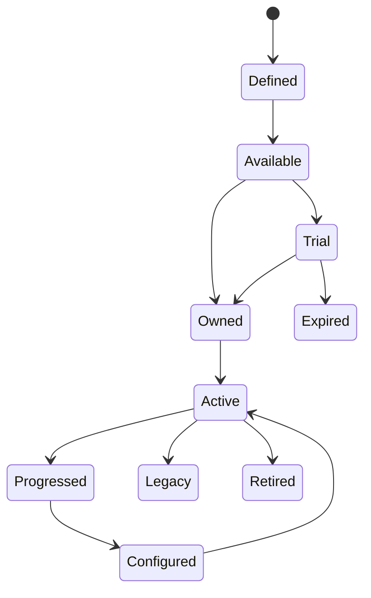

# Characters and Loadouts（角色与配置系统）

> Status: V1  
> Category: Content  
> Path: `design/systems/content/characters-and-loadouts.md`  
> Owner: TBD  
> Reviewers: Design / Product / Engineering / UX / QA / Data / Accessibility / Live Operations  
> Last Updated: 2026-07-11  
> Version: 1.0  
> Risk Level: High  
> Dependencies: Progression System, Resources and Economy, Content and Unlocks, Rules and Resolution, Difficulty and Challenge, Save and Persistence, Entitlement and Ownership  
> Affected Systems: Core Loop, Objectives and Quests, Reward System, Tutorial and Onboarding, Social and Multiplayer, Matchmaking and Competition, Monetization, Analytics and Telemetry

---

## 1. System Summary

Characters and Loadouts 系统负责定义：

```text
角色是什么；
角色拥有哪些稳定身份和能力；
哪些能力来自角色本身；
哪些能力来自成长、装备、技能、队伍和临时状态；
玩家如何组建、保存、切换和验证配置；
角色与物品、技能、外观和队伍之间如何建立所有权与引用；
内容下架、版本变化和迁移时如何保护玩家价值。
```

该系统通常管理：

- 角色身份；
- 职业、阵营和标签；
- 基础能力；
- 角色成长引用；
- 装备槽位；
- 技能槽位；
- 被动与天赋；
- 消耗品；
- 队伍；
- 预设；
- 外观；
- 租借；
- 试用；
- 构筑合法性；
- 配置版本。

健康的角色与配置系统应让玩家感受到：

```text
角色有明确身份；
构筑选择有真实差异；
配置能快速理解和切换；
错误投资可以恢复；
下架和更新不会静默破坏已有构筑。
```

---

## 2. Purpose

### 2.1 Player Value

该系统帮助玩家：

- 选择喜欢的角色；
- 理解角色定位；
- 形成个人构筑；
- 针对挑战调整配置；
- 保存并快速切换方案；
- 比较不同角色和装备；
- 在成长后感知能力变化；
- 保留收藏和表达价值；
- 在版本变化后恢复可用构筑。

### 2.2 Experience Contribution

角色和配置可以支持：

- 身份；
- 策略；
- 选择；
- 表达；
- 组合；
- 掌握；
- 团队协作；
- 长期成长。

但设计不健康时会造成：

- 角色同质化；
- 唯一最优构筑；
- 数值和来源不透明；
- 装备管理负担；
- 共享装备冲突；
- 预设失效；
- 角色下架后价值丢失；
- 付费角色破坏公平；
- 新玩家信息过载。

### 2.3 Product Value

该系统为以下能力提供共同基础：

- 核心玩法；
- 角色成长；
- 装备；
- 技能；
- 队伍；
- 任务条件；
- 难度推荐；
- 收集；
- 表达；
- 社交；
- 竞技；
- 商业化；
- 数据分析。

### 2.4 Why This System Exists

如果角色、装备和预设分别由不同功能独立维护，常见结果是：

```text
同一属性被多个系统重复修改；
角色页面与实际结算不一致；
预设保存了失效引用；
同一装备被多个角色同时占用但状态冲突；
角色下架后任务和存档断裂；
技能槽、装备槽和天赋槽使用不同规则；
UI 自行判断构筑是否合法。
```

统一系统用于确保：

- 角色身份唯一；
- 能力来源清楚；
- 配置引用稳定；
- 预设可恢复；
- 构筑合法性由权威规则判断；
- 跨版本迁移可维护。

---

## 3. Non-Goals

该系统不负责：

- 直接计算所有战斗结果；
- 拥有所有成长状态；
- 管理资源余额；
- 发放奖励；
- 处理支付；
- 定义全部内容生命周期；
- 自动保证所有角色平衡；
- 用大量槽位制造虚假深度；
- 通过装备摩擦延长时长；
- 让付费角色拥有不可替代的基础优势；
- 强迫玩家频繁手动整理；
- 将角色身份仅表达为数值差异。

---

## 4. Governing Principles

### 4.1 Core Experience and Fantasy

参考：

- `../../philosophy/foundation/core-experience-and-fantasy.md`

应用原则：

- 每个角色应强化核心幻想；
- 角色能力和定位应一致；
- 构筑应扩展角色身份，而不是完全覆盖；
- 表达层与玩法层关系清楚。

### 4.2 Simplicity and Depth

参考：

- `../../philosophy/experience/simplicity-and-depth.md`

应用原则：

- 基础角色易理解；
- 深度来自组合与情境；
- 槽位和属性数量受控；
- 高级构筑逐步开放。

### 4.3 Choice and Consequence

参考：

- `../../philosophy/experience/choice-and-consequence.md`

应用原则：

- 角色和构筑选择应有真实差异；
- 配置前可预览主要影响；
- 重配成本应与承诺匹配；
- 不应存在长期唯一最优方案。

### 4.4 Challenge and Fairness

参考：

- `../../philosophy/experience/challenge-and-fairness.md`

应用原则：

- 不同角色拥有可理解优势和弱点；
- 内容应支持多种可行构筑；
- 付费和稀有度不能直接替代掌握；
- 竞技中规则与资格透明。

### 4.5 Progression and Motivation

参考：

- `../../philosophy/long-term/progression-and-motivation.md`

应用原则：

- 成长应改变角色可用策略；
- 新装备和技能重新进入核心循环；
- 收藏不应导致管理负担失控；
- 回归玩家可以恢复构筑上下文。

### 4.6 Accessibility and Inclusivity

参考：

- `../../philosophy/responsibility/accessibility-and-inclusivity.md`

应用原则：

- 角色定位、技能和状态不能只靠颜色或图标；
- 配置支持搜索、筛选和预设；
- 高频整理可自动化；
- 不同操作能力玩家有可行角色和辅助选择。

### 4.7 Ethical Design

参考：

- `../../philosophy/responsibility/ethical-design.md`

应用原则：

- 不故意制造错误构筑后出售重置；
- 不用角色稀有度误导真实强度；
- 付费角色和外观边界清楚；
- 下架、削弱和权益变化必须透明。

---

## 5. Player Experience

### 5.1 Player Goal

玩家使用该系统通常为了：

- 选择角色；
- 理解角色定位；
- 装备物品；
- 配置技能；
- 组建队伍；
- 保存预设；
- 针对挑战调整；
- 比较和优化；
- 表达身份；
- 试用新内容。

### 5.2 Entry

入口包括：

- 角色页面；
- 队伍页面；
- 装备页面；
- 技能页面；
- 战前准备；
- 奖励结算；
- 商店；
- 任务；
- 活动；
- 教学；
- 社交和匹配。

### 5.3 Main Actions

玩家可以：

- 查看；
- 选择；
- 装备；
- 卸下；
- 替换；
- 升级；
- 保存预设；
- 复制预设；
- 重命名；
- 分享；
- 锁定；
- 比较；
- 试用；
- 删除；
- 恢复。

### 5.4 Core Decisions

关键决策包括：

- 使用哪个角色；
- 选择何种定位；
- 哪些装备和技能组合；
- 如何分配共享资源；
- 是否保存当前配置；
- 是否重置；
- 是否为某挑战创建专用预设；
- 是否接受推荐配置。

### 5.5 Success

健康体验意味着：

- 角色身份清楚；
- 构筑差异可感知；
- 当前属性来源可解释；
- 配置合法性清楚；
- 预设切换快速可靠；
- 共享装备冲突有明确处理；
- 版本变化后构筑不会静默失效；
- 收藏和表达不制造过度负担。

### 5.6 Failure

失败包括：

- 角色不可加载；
- 装备引用失效；
- 技能冲突；
- 共享装备占用冲突；
- 预设损坏；
- 构筑不合法；
- 数值来源错误；
- 下架内容仍被引用；
- 权益不同步；
- 多设备修改冲突。

---

## 6. System Boundary

### 6.1 Inputs

系统接收：

- Character Ownership；
- Progression State；
- Item Ownership；
- Skill Ownership；
- Entitlement State；
- Content Availability；
- Challenge Requirements；
- Team Rules；
- Resource State；
- Accessibility Preferences；
- Live Operations Configuration；
- Version State。

### 6.2 Outputs

系统产生：

- Character Definition；
- Character Instance；
- Loadout Definition；
- Loadout Instance；
- Equip Result；
- Skill Configuration；
- Team Composition；
- Derived Attribute Summary；
- Build Validation；
- Preset State；
- Character Availability；
- Migration Result；
- Loadout Changed Event。

### 6.3 Owned State

系统拥有：

- Character Definition；
- Character Instance Reference；
- Role and Tag State；
- Loadout Definition；
- Loadout Instance；
- Equipped Item Reference；
- Equipped Skill Reference；
- Team Slot State；
- Preset；
- Favorite and Lock State；
- Trial and Rental State；
- Configuration Version；
- Loadout History。

### 6.4 Read-Only Dependencies

系统读取：

- Progression；
- Economy；
- Content；
- Entitlement；
- Difficulty；
- Reward；
- Save；
- Time；
- Social；
- Live Operations。

### 6.5 Write Dependencies

系统通过正式契约请求：

- Progression 应用成长；
- Economy 扣除配置成本；
- Content 校验可用性；
- Rules 计算派生结果；
- Save 持久化；
- Analytics 记录；
- Matchmaking 验证队伍资格。

### 6.6 Out of Scope

系统不直接：

- 修改资源余额；
- 授予购买权益；
- 发放奖励；
- 处理支付；
- 决定所有战斗结果；
- 管理任务完成；
- 修改活动生命周期。

---

## 7. Core Entities and Concepts

| Entity / Concept | Definition | Owner | Lifetime | Notes |
|---|---|---|---|---|
| Character Definition | 角色稳定定义 | Characters | 版本级 | 唯一 ID |
| Character Instance | 玩家拥有或使用的具体角色实例 | Characters / Ownership | 长期 | 可唯一或可重复 |
| Role | 角色主要定位 | Characters | 定义级 | 如防御、支援 |
| Tag | 用于规则和筛选的标签 | Characters | 定义级 | 不等同显示分类 |
| Base Attribute | 角色基础能力 | Characters | 定义级 | 不含成长修正 |
| Growth Reference | 成长系统状态引用 | Progression | 长期 | 只读 |
| Item Definition | 可装备对象定义 | Content / Item System | 版本级 | 唯一 ID |
| Item Instance | 玩家拥有的具体物品 | Ownership / Inventory | 长期 | 可有品质与状态 |
| Skill Definition | 技能定义 | Content / Rules | 版本级 | 唯一 ID |
| Slot Definition | 槽位类型和约束 | Characters | 版本级 | 装备、技能等 |
| Loadout | 一组角色、装备、技能和设置 | Characters | 长期 | 可保存 |
| Preset | 可命名和快速应用的 Loadout | Characters | 长期 | 具有版本 |
| Team Composition | 多角色组合 | Characters | 会话或长期 | 受队伍规则约束 |
| Derived Attribute | 由多个来源计算的最终摘要 | Rules | 动态 | 非直接写入 |
| Build Validation | 当前配置是否合法 | Characters / Rules | 动态 | 返回原因 |
| Trial State | 临时试用资格 | Characters / Entitlement | 短期 | 不等于拥有 |

---

## 8. Character Taxonomy

### 8.1 Playable Character

玩家直接控制或配置。

### 8.2 Companion

由 AI 或规则控制，但属于玩家队伍。

### 8.3 Summon

短期生成的从属单位。

### 8.4 Avatar

代表玩家身份。

### 8.5 Class or Archetype

不是具体角色，而是一组规则和能力模板。

### 8.6 Non-Playable Character

叙事、功能或世界角色。

### 8.7 Rental or Trial Character

临时可用，不代表永久所有权。

### 8.8 Legacy Character

旧版本仍保留的角色。

---

## 9. Character Definition Template

```markdown
## Character Definition

- Character ID:
- Display Name:
- Category:
- Core Fantasy:
- Role:
- Secondary Roles:
- Tags:
- Base Attributes:
- Ability Kit:
- Slot Layout:
- Progression Track:
- Ownership:
- Availability:
- Trial:
- Team Restrictions:
- Competitive Rules:
- Accessibility Notes:
- Retirement Policy:
- Version:
- Owner:
- Risk Level:
```

### 9.1 必须回答

- 角色核心幻想是什么；
- 玩家为什么选择；
- 主要优势和弱点；
- 与其他角色的区别；
- 需要什么成长；
- 能装备什么；
- 是否可重复拥有；
- 是否付费或限时；
- 下架后如何处理。

---

## 10. Character Identity

角色身份应通过多个层次表达：

- 核心幻想；
- 视觉；
- 动作；
- 能力；
- 资源模型；
- 节奏；
- 风险；
- 队伍关系；
- 成长方向；
- 叙事。

### 10.1 Role Clarity

玩家应能在短时间理解：

- 角色擅长什么；
- 不擅长什么；
- 适合什么情境；
- 操作负担；
- 队伍价值。

### 10.2 Avoid Stat-Only Identity

如果角色差异只来自：

- 更高伤害；
- 更多生命；
- 更高稀有度；

则身份不够稳定。

---

## 11. Roles and Tags

### 11.1 Role

用于高层定位。

例如：

- Damage；
- Defense；
- Support；
- Control；
- Utility；
- Specialist。

### 11.2 Tag

用于：

- 筛选；
- 任务；
- 规则；
- 队伍；
- 内容；
- AI；
- 匹配。

### 11.3 Role vs Tag

Role 是玩家可理解定位。

Tag 是可组合的规则标记。

### 11.4 Tag Governance

标签应：

- 有统一命名；
- 有 Owner；
- 有版本；
- 避免重复；
- 不依赖显示文案。

---

## 12. Character Lifecycle

```text
Defined
→ Available
→ Trial or Owned
→ Active
→ Progressed
→ Configured
→ Retired or Legacy
```



### 12.1 Defined

存在于内容定义中。

### 12.2 Available

可获取或使用。

### 12.3 Trial

临时使用。

### 12.4 Owned

永久或长期拥有。

### 12.5 Active

当前配置或队伍中使用。

### 12.6 Legacy

仍可使用但不再主要维护。

### 12.7 Retired

不再正常使用。

---

## 13. Ownership

角色和物品所有权应由：

- Entitlement；
- Inventory；
- Account Ownership；

中的明确系统拥有。

Characters and Loadouts 读取所有权。

### 13.1 Owned vs Usable

拥有不等于当前可用。

可能因为：

- 平台；
- 地区；
- 模式；
- 版本；
- 队伍；
- 维护；
- 禁用。

### 13.2 Trial vs Owned

试用必须明确：

- 开始；
- 结束；
- 可用内容；
- 成长是否保留；
- 试用结束后的配置；
- 是否可购买。

### 13.3 Duplicate Ownership

若允许重复角色或物品，必须定义：

- 实例差异；
- 合并；
- 升级；
- 重复补偿；
- 最大数量；
- 交易；
- 下架。

---

## 14. Character Instances

### 14.1 Unique Character Model

一个角色仅有一份长期实例。

优点：

- 简单；
- 易管理；
- 预设稳定。

### 14.2 Multiple Instance Model

同一角色可以拥有多个实例。

风险：

- 管理复杂；
- 比较困难；
- 重复付费压力；
- 预设引用脆弱。

### 14.3 Instance Identity

若使用多实例，必须有稳定：

- Instance ID；
- Ownership；
- Growth；
- Equipment；
- Lock；
- History。

---

## 15. Attribute Sources

最终能力通常来自：

```text
Base Character
+ Progression
+ Equipment
+ Skills
+ Team Effects
+ Temporary Effects
+ Difficulty Rules
+ Mode Rules
```

### 15.1 Source Transparency

玩家应能查看主要来源。

### 15.2 Source Ownership

- Base Character：Characters；
- Progression：Progression；
- Equipment：Item / Loadout；
- Temporary Effect：Rules；
- Difficulty：Difficulty；
- Mode Rule：Game State / Rules。

### 15.3 Avoid Direct Final Attribute Writes

最终属性应由规则计算，不应由多个系统直接覆盖。

---

## 16. Attribute Presentation

### 16.1 Primary Attributes

与角色核心定位直接相关。

### 16.2 Secondary Attributes

支持细节构筑。

### 16.3 Derived Attributes

由多个来源计算。

### 16.4 Hidden Attributes

应尽量减少。

若影响关键结果，应提供可理解说明。

### 16.5 Before and After

配置变化时显示：

- 当前值；
- 新值；
- 差异；
- 主要来源；
- 受影响能力。

---

## 17. Slot Model

### 17.1 Slot Types

- Character Slot；
- Weapon Slot；
- Armor Slot；
- Accessory Slot；
- Skill Slot；
- Passive Slot；
- Consumable Slot；
- Cosmetic Slot；
- Companion Slot；
- Team Slot。

### 17.2 Slot Definition

每个槽位应定义：

- 可接受类型；
- 数量；
- 前置；
- 互斥；
- 是否必填；
- 是否共享；
- 是否锁定；
- 解锁方式。

### 17.3 Slot Growth

新增槽位应产生实际选择，不应只增加管理。

### 17.4 Empty Slot

是否允许为空必须明确。

---

## 18. Equipment Model

### 18.1 Equipment Categories

- Weapon；
- Armor；
- Accessory；
- Tool；
- Relic；
- Module；
- Consumable；
- Cosmetic。

### 18.2 Equipment Identity

装备可以由：

- 类型；
- 基础效果；
- 固定属性；
- 随机属性；
- 套装；
- 稀有度；
- 成长；
- 耐久；
- 外观；

构成。

### 18.3 Equip Eligibility

检查：

- 所有权；
- 角色；
- 等级；
- 职业；
- 标签；
- 模式；
- 唯一性；
- 队伍；
- 当前占用。

### 18.4 Equip Transaction

```text
Request Equip
→ Validate Ownership
→ Validate Slot
→ Validate Restrictions
→ Resolve Conflicts
→ Apply Reference
→ Recalculate Build
→ Save
→ Publish Event
```

---

## 19. Shared Equipment

共享装备会产生配置冲突。

### 19.1 Policies

- Exclusive；
- Shared Copy；
- Auto Move；
- Duplicate Reference；
- Mode-Specific Copy。

### 19.2 Auto Move

如果装备自动从另一角色移走，必须：

- 提前说明；
- 显示受影响预设；
- 支持撤销；
- 防止多预设静默失效。

### 19.3 Preset Conflict

加载预设时若装备被占用，可以：

- 移动；
- 替换；
- 跳过；
- 使用替代；
- 标记不可用。

不能静默应用错误构筑。

---

## 20. Skill Configuration

### 20.1 Skill Types

- Active；
- Passive；
- Ultimate；
- Utility；
- Reaction；
- Team Skill；
- Context Skill。

### 20.2 Skill Sources

- 角色默认；
- 成长解锁；
- 装备；
- 内容；
- 试用；
- 临时活动。

### 20.3 Skill Slot Rules

定义：

- 数量；
- 类型；
- 互斥；
- 前置；
- 冷却组；
- 资源；
- 模式限制。

### 20.4 Invalid Skill

技能不可用时应说明：

- 未解锁；
- 冲突；
- 模式限制；
- 内容下架；
- 版本不兼容；
- 角色不支持。

---

## 21. Passive and Talent Configuration

### 21.1 Passive Types

- Always Active；
- Conditional；
- Triggered；
- Team Aura；
- Mode-Specific。

### 21.2 Talent Tree

如果角色拥有天赋树，应明确与 Progression 的边界。

### 21.3 Loadout Reference

预设保存的是：

- 当前选择；
- 节点引用；
- 版本；

而不是复制权威成长状态。

### 21.4 Respec

重置后，引用失效的预设应：

- 标记；
- 自动迁移；
- 提供修复；
- 不静默使用旧效果。

---

## 22. Loadout Definition

Loadout 通常包括：

- Character；
- Equipment；
- Skills；
- Passives；
- Consumables；
- Cosmetics；
- Team Position；
- AI Behavior；
- Assist Options；
- Mode-Specific Settings。

### 22.1 Minimal Loadout

只保存对玩法有意义的状态。

### 22.2 Do Not Duplicate Ownership

Loadout 保存引用，不保存物品所有权副本。

### 22.3 Definition Template

```markdown
## Loadout Definition

- Loadout ID:
- Character:
- Equipment:
- Skills:
- Passives:
- Consumables:
- Team Position:
- Cosmetics:
- Mode:
- Validation Version:
- Owner:
```

---

## 23. Loadout Lifecycle

```text
Created
→ Edited
→ Validated
→ Saved
→ Equipped
→ Used
→ Updated
→ Invalidated
→ Repaired or Archived
```

### 23.1 Created

初始配置建立。

### 23.2 Validated

检查所有引用和规则。

### 23.3 Equipped

成为当前权威配置。

### 23.4 Used

进入具体活动。

### 23.5 Invalidated

因：

- 内容下架；
- 规则变化；
- 权益失效；
- 共享装备；
- 成长重置；

变得不可用。

### 23.6 Repaired

自动或手动恢复。

---

## 24. Build Validation

构筑验证应返回：

- Valid；
- Valid with Warnings；
- Invalid；
- Temporarily Unavailable；
- Version Conflict。

### 24.1 Validation Checks

- 所有权；
- 内容可用性；
- 槽位；
- 类型；
- 前置；
- 互斥；
- 队伍；
- 模式；
- 权益；
- 版本；
- 数量；
- 唯一性。

### 24.2 Warning vs Error

Warning 允许继续。

Error 阻止进入。

### 24.3 Player-Facing Reason

应说明：

- 哪一项有问题；
- 为什么；
- 如何修复；
- 是否可自动修复。

---

## 25. Presets

### 25.1 Preset Purpose

用于：

- 快速切换；
- 按内容准备；
- 保存实验；
- 分享；
- 降低重复管理。

### 25.2 Preset Fields

- Preset ID；
- Name；
- Loadout Reference；
- Mode；
- Tags；
- Last Used；
- Version；
- Validation State；
- Shared / Private。

### 25.3 Preset Limits

应根据可用性和管理负担决定。

不应主要通过过低上限推动付费。

### 25.4 Preset Naming

支持：

- 默认命名；
- 自定义；
- 本地化；
- 隐私过滤。

### 25.5 Preset Delete

删除可逆或有确认。

---

## 26. Preset Application

推荐流程：

```text
Select Preset
→ Check Version
→ Check Ownership
→ Check Availability
→ Resolve Shared Conflicts
→ Preview Changes
→ Apply Atomically
→ Recalculate
→ Save
```

### 26.1 Atomicity

预设应尽量全部应用。

若部分应用，必须：

- 清楚说明；
- 列出未应用项；
- 不假装成功。

### 26.2 Fallback

可使用：

- 最近合法装备；
- 默认技能；
- 空槽；
- 推荐替代。

必须说明替代。

---

## 27. Team Composition

### 27.1 Team Rules

定义：

- 队伍人数；
- 必填位置；
- 重复角色；
- 角色唯一性；
- 职业限制；
- 阵营；
- Cost Budget；
- 支援；
- 候补；
- 队长。

### 27.2 Team Roles

队伍可以包含：

- Frontline；
- Damage；
- Support；
- Control；
- Utility；
- Flex。

角色不应被单一标签完全限制。

### 27.3 Team Validation

检查：

- 每个成员合法；
- 队伍规则；
- 内容要求；
- 多人所有权；
- 重复；
- 支援资格；
- 匹配规则。

---

## 28. Party and Multiplayer Loadouts

### 28.1 Personal Loadout

每位玩家拥有自己的配置。

### 28.2 Shared Party Rules

可能限制：

- 重复角色；
- 共享装备；
- 队伍角色；
- Cost；
- 竞技标准。

### 28.3 Visibility

队友应能看到支持协作所需的信息，但不应暴露不必要私人数据。

### 28.4 Ready Check

进入多人活动前验证：

- 配置合法；
- 版本一致；
- 角色可用；
- 权益；
- 网络；
- 队伍规则。

---

## 29. Recommended Loadouts

推荐可以基于：

- 角色定位；
- 当前内容；
- 难度；
- 已拥有物品；
- 明确偏好；
- 辅助需求。

### 29.1 Recommendation Principles

- 解释原因；
- 只使用已拥有或清楚标记未拥有内容；
- 不伪装唯一最优；
- 不优先推荐商业内容；
- 支持一键预览。

### 29.2 Auto Equip

自动装备应：

- 可撤销；
- 显示变化；
- 不移动锁定物品；
- 不破坏其他预设；
- 不消耗高价值资源。

---

## 30. Comparison

比较应支持：

- 当前 vs 候选；
- 角色 vs 角色；
- 预设 vs 预设；
- 基础值 vs 派生值；
- 单项变化 vs 整体变化。

### 30.1 Comparison Scope

不要只比较一个“总战力”。

应突出：

- 核心能力；
- 主要收益；
- 主要损失；
- 受影响技能；
- 情境差异。

### 30.2 False Precision

如果系统无法准确计算情境价值，不应给出伪精确总分。

---

## 31. Loadout Cost

配置变化可能有：

- 免费；
- 资源成本；
- 冷却；
- 战前限制；
- 活动限制；
- 竞技锁定。

### 31.1 Cost Purpose

成本应保护：

- 承诺；
- 规则；
- 竞争公平。

不应：

- 制造日常摩擦；
- 让错误投资长期受罚；
- 通过频繁换装收费。

### 31.2 Free Conditions

以下通常应免费：

- 新手；
- 规则重大变化；
- 内容下架；
- 辅助需求；
- 预设修复；
- 系统错误。

---

## 32. Locking and Favorites

### 32.1 Item Lock

防止：

- 分解；
- 出售；
- 移动；
- 自动装备覆盖。

### 32.2 Favorite

用于：

- 快速访问；
- 筛选；
- 推荐保护；
- 展示。

### 32.3 Lock Persistence

锁定状态必须跨设备保留。

### 32.4 Bulk Action

批量操作应尊重锁定状态。

---

## 33. Cosmetics

### 33.1 Cosmetic Scope

- 角色外观；
- 装备外观；
- 动作；
- 特效；
- 头像；
- 语音；
- 展示。

### 33.2 Gameplay Boundary

外观不应隐藏关键可读性或改变权威能力，除非明确属于玩法内容。

### 33.3 Competitive Readability

竞技中需要：

- 轮廓；
- 状态；
- 阵营；
- 关键技能；

保持可辨识。

### 33.4 Ownership

Cosmetic Ownership 由 Entitlement 或 Inventory 拥有。

---

## 34. Trial and Rental

### 34.1 Trial Purpose

- 教学；
- 购买前体验；
- 活动；
- 新角色介绍；
- 追赶。

### 34.2 Trial Rules

必须说明：

- 时间；
- 内容范围；
- 模式；
- 成长；
- 奖励；
- 是否保存；
- 试用结束；
- 配置处理。

### 34.3 Trial Expiry

试用结束时：

- 预设保留但标记不可用；
- 不删除玩家自定义信息；
- 不自动购买；
- 提供安全替代。

---

## 35. Character Availability

角色可用性可能受：

- 所有权；
- 内容生命周期；
- 模式；
- 平台；
- 地区；
- 竞技禁用；
- 维护；
- 版本；
- 队伍；

影响。

### 35.1 Owned but Unavailable

必须说明原因和恢复条件。

### 35.2 Temporary Disable

若角色因 Bug 或平衡临时禁用：

- 明确通知；
- 保护进度；
- 处理活动和任务；
- 提供补偿或替代；
- 不删除所有权。

---

## 36. Character Retirement

### 36.1 Retirement Reasons

- 技术不可维护；
- 许可；
- 设计重构；
- 合并；
- 安全；
- 内容下架。

### 36.2 Retirement Plan

必须处理：

- 所有权；
- 付费；
- 角色成长；
- 装备；
- 预设；
- 任务；
- 收藏；
- 社交；
- 历史；
- 替代内容。

### 36.3 Avoid Silent Removal

角色和玩家投入不得静默消失。

### 36.4 Legacy Character

可选择：

- 继续使用；
- 限定模式；
- 只读收藏；
- 转换；
- 替代角色。

---

## 37. Balance Changes

### 37.1 Buff and Nerf

变化应说明：

- 改了什么；
- 为什么；
- 影响哪些构筑；
- 是否提供重置；
- 是否影响竞技。

### 37.2 Major Rework

重大重构需要：

- 旧技能映射；
- 预设迁移；
- 免费重置；
- 教学更新；
- 任务和内容检查；
- 付费价值评审。

### 37.3 Paid Character Changes

付费角色削弱需要专项信任与政策评审。

---

## 38. Build Diversity

### 38.1 Healthy Diversity

不同构筑应在不同情境中可行。

### 38.2 Diversity Signals

- 装备分布；
- 技能分布；
- 队伍组合；
- 难度分布；
- 角色使用；
- 预设切换。

### 38.3 Unique Best Build

如果所有玩家长期使用同一配置，应检查：

- 数值；
- 内容；
- 推荐；
- 信息；
- 成本；
- 平衡；
- 任务要求。

### 38.4 False Diversity

大量选项但结果几乎相同，不是真正多样性。

---

## 39. Power Creep

新角色和装备持续强于旧内容会造成：

- 旧资产失效；
- 付费压力；
- 角色收藏贬值；
- 内容数值膨胀；
- 构筑集中。

### 39.1 Controls

- Power Budget；
- 横向能力；
- 情境优势；
- 递减收益；
- 竞技标准化；
- 旧角色更新；
- 内容轮换。

### 39.2 Rarity

稀有度不应自动等于长期绝对强度。

---

## 40. Character and Loadout Debt

包括：

- 过多属性；
- 过多槽位；
- 失效预设；
- 旧角色；
- 重复标签；
- 共享装备冲突；
- 特殊规则；
- 下架引用；
- 无效推荐。

### 40.1 Signals

- 玩家依赖外部工具；
- 大量构筑无法加载；
- 总战力无法解释；
- 新角色必须增加新系统；
- 预设频繁失效；
- 角色页面信息过载。

### 40.2 Reduction

- 合并属性；
- 减少槽位；
- 统一标签；
- 预设修复；
- Legacy 策略；
- 推荐审计；
- 迁移工具；
- 清理特殊例外。

---

## 41. Failure and Recovery

| Failure | Cause | Player Impact | Recovery | Data Guarantee |
|---|---|---|---|---|
| Missing Character Definition | 配置缺失 | 角色无法加载 | Legacy Placeholder / 回滚 | 所有权保留 |
| Invalid Equipment Reference | 物品下架或删除 | 预设失效 | 替代、空槽、修复 | 原引用留档 |
| Shared Item Conflict | 多预设争用 | 配置不一致 | 选择移动或替代 | 不静默覆盖 |
| Skill Version Conflict | 技能重构 | 构筑非法 | 迁移或默认技能 | 保留历史 |
| Preset Partial Apply | 部分引用失败 | 实际配置不明确 | 回滚或明确部分应用 | 保存结果摘要 |
| Ownership Delay | 权益未同步 | 已拥有内容不可用 | 查询恢复 | 不重复购买 |
| Trial Expired | 临时资格结束 | 预设不可用 | 保留并标记 | 不删除自定义 |
| Character Disabled | 临时禁用 | 无法进入内容 | 替代和补偿 | 进度保留 |
| Migration Failure | 版本变化 | 构筑丢失 | 备份恢复 | 旧版本可回退 |

---

## 42. Edge Cases

### Character

- 同一角色多实例；
- 角色正在活动中被禁用；
- 角色下架但已购买；
- 角色被合并；
- 角色标签变化；
- 多设备同时切换。

### Equipment

- 装备被多个角色引用；
- 物品达到最大强化；
- 装备被分解但预设仍引用；
- 共享装备在多人中冲突；
- 物品版本变化；
- 容量不足。

### Skills

- 技能被删除；
- 技能槽数量变化；
- 天赋重置；
- 技能互斥规则变化；
- 模式禁用；
- 试用技能过期。

### Presets

- 预设名称冲突；
- 预设超过上限；
- 云端和本地冲突；
- 预设部分失效；
- 角色所有权变化；
- 版本回滚。

### Team

- 队伍人数变化；
- 重复角色规则变化；
- 队友断线；
- 支援角色失效；
- 竞技规则切换；
- 队伍角色同时下架。

---

## 43. Cross-System Dependencies

| System | Dependency Type | Direction | Data or Event | Failure Impact |
|---|---|---|---|---|
| Progression System | Hard | Progression → Characters | Growth State | 角色能力错误 |
| Resources and Economy | Hard / Soft | Economy → Characters | Upgrade / Equip Cost | 配置阻塞 |
| Content and Unlocks | Hard | Content → Characters | Availability | 角色或物品不可用 |
| Rules and Resolution | Hard | 双向 | Derived Attributes / Validation | 实际结果错误 |
| Difficulty and Challenge | Soft / Hard | 双向 | Requirements / Recommendation | 构筑失配 |
| Entitlement and Ownership | Hard | Entitlement → Characters | Ownership | 付费资产风险 |
| Reward System | Soft / Hard | Reward → Characters | Character / Item Grant | 内容延迟 |
| Save and Persistence | Hard | Characters → Save | Loadout / Preset | 无法恢复 |
| Objectives and Quests | Soft | Characters → Objectives | Character / Build Facts | 任务进度错误 |
| Matchmaking | Hard for Competitive | Characters → Matchmaking | Team Eligibility | 无法匹配 |
| Analytics | Soft | Characters → Analytics | Usage Events | 不阻断 |
| Live Operations | Soft | Live → Characters | Trial / Disable / Rotation | 使用 Last Known Good |

---

## 44. Data and Persistence

| State | Persistent | Authority | Save Trigger | Retention | Recovery |
|---|---|---|---|---|---|
| Character Definition | 是 | Characters | 配置发布 | 版本期 | Last Known Good |
| Character Instance Reference | 是 | Characters / Ownership | 获得或变化 | 长期 | 权益恢复 |
| Loadout | 是 | Characters | 修改确认 | 长期 | 版本迁移 |
| Preset | 是 | Characters | 保存 | 长期 | 备份恢复 |
| Equipped Item Reference | 是 | Characters | 装备变化 | 长期 | 所有权查询 |
| Equipped Skill Reference | 是 | Characters | 技能变化 | 长期 | 版本映射 |
| Team Composition | 是或会话级 | Characters | 队伍变化 | 按模式 | 默认恢复 |
| Favorite / Lock | 是 | Characters / Inventory | 修改时 | 长期 | 云端恢复 |
| Trial State | 是 | Entitlement / Characters | 资格变化 | 试用期 | 时间重算 |
| Loadout History | 是 | Characters | 关键变化 | 审计期 | 回滚 |
| Configuration Version | 是 | Characters | 每次保存 | 长期 | 迁移 |

### 44.1 Save Triggers

至少在以下时刻保存：

- 装备；
- 卸下；
- 技能变化；
- 预设保存；
- 队伍变化；
- 角色获得；
- 试用变化；
- 迁移；
- 自动修复。

---

## 45. Accessibility

### 45.1 Visual

- 角色定位、技能和属性有文本；
- 不只靠颜色区分角色和槽位；
- 装备变化前后清楚；
- 冲突和非法状态明显。

### 45.2 Cognitive

- 主要属性优先；
- 高级详情折叠；
- 支持推荐和解释；
- 支持筛选、搜索和收藏；
- 预设减少重复管理。

### 45.3 Input

- 支持键鼠、手柄和触摸；
- 批量操作防误触；
- 高价值分解和覆盖有保护；
- 长列表焦点稳定。

### 45.4 Timing

- 战前配置不要求极短时间；
- 多人准备有合理倒计时；
- 试用结束提前提醒；
- 重大重构提供过渡期。

### 45.5 Motor and Assist

- 自动装备；
- 一键修复；
- Toggle；
- 减少拖拽；
- 支持单手和替代输入；
- 不强制复杂精确拖动。

---

## 46. Ethical and Safety Review

### 46.1 Paid Characters

- 价格和所有权清楚；
- 不隐藏额外成长成本；
- 不将付费稀有度伪装为保证强度；
- 竞技公平有隔离或标准化。

### 46.2 Power Creep

- 新角色不持续全面替代旧角色；
- 旧资产有维护策略；
- 稀有度不自动等于绝对强度；
- 付费内容变更有信任评审。

### 46.3 FOMO

- 核心角色和能力支持返场或替代；
- 试用和活动结束规则透明；
- 不用短倒计时推动购买；
- 已拥有价值不因活动结束消失。

### 46.4 Mistake Monetization

- 不故意让构筑难理解再出售重置；
- 重大规则变化提供免费修复；
- 自动推荐不优先商业内容；
- 共享装备冲突不成为付费扩容压力。

### 46.5 Children and Vulnerable Users

- 角色购买和随机获取有消费保护；
- 不用角色失望或队友压力推动购买；
- 支持监护和限额；
- 试用结束不自动扣款。

### 46.6 Privacy

分享构筑时不暴露：

- 账户信息；
- 支付状态；
- 私人标签；
- 未公开社交数据。

---

## 47. Analytics and Validation

### 47.1 Key Assumptions

1. 玩家能快速理解角色定位。
2. 构筑选择有真实差异。
3. 属性和效果来源可解释。
4. 预设能显著降低管理负担。
5. 构筑验证能阻止错误但不过度限制。
6. 共享装备冲突可理解和恢复。
7. 多种角色和构筑长期保持可行。
8. 角色下架、重构和迁移不会丢失玩家价值。
9. 付费角色不会破坏基础公平。
10. 回归玩家能快速恢复旧构筑。

### 47.2 Validation Plan

| Hypothesis | Evidence | Success | Failure | Method |
|---|---|---|---|---|
| 角色定位清楚 | 复述与选择 | 能说明优势和用途 | 只看稀有度 | 可用性测试 |
| 构筑有差异 | 行为与结果 | 不同配置改变策略 | 只有数值变化 | 玩法测试 |
| 来源可解释 | 属性任务 | 能识别主要来源 | 认为数值随机 | 研究 |
| 预设有效 | 操作时长 | 切换明显更快 | 仍频繁手动整理 | 数据 |
| 验证合理 | 错误恢复 | 能理解并修复 | 只看到“非法” | QA / UX |
| 共享冲突可恢复 | 场景测试 | 无静默覆盖 | 预设损坏 | 集成测试 |
| 多样性健康 | 使用分布 | 多角色和构筑可行 | 单一方案压倒性 | 平衡分析 |
| 迁移可靠 | 版本测试 | 旧预设可恢复 | 大量构筑丢失 | QA |
| 付费公平 | 竞技与投诉 | 差异可接受 | 付费主导 | 长期监控 |
| 回归有效 | 回归任务 | 能恢复并理解配置 | 构筑完全失效 | Research |

### 47.3 Behavioral Metrics

- Character Selected；
- Character Acquired；
- Character Trial Started；
- Loadout Edited；
- Equipment Equipped；
- Skill Changed；
- Preset Saved；
- Preset Applied；
- Preset Failed；
- Build Invalid；
- Auto Equip Used；
- Team Changed；
- Character Disabled；
- Loadout Migrated。

### 47.4 Outcome Metrics

- Character Usage Distribution；
- Build Diversity；
- Preset Adoption；
- Time to Ready；
- Invalid Build Rate；
- Preset Recovery Rate；
- Shared Conflict Rate；
- Auto Equip Acceptance；
- Old Character Viability；
- Paid / Free Competitive Gap；
- Return Loadout Recovery；
- Migration Success。

### 47.5 Negative Metrics

- 唯一最优构筑；
- 角色同质化；
- 大量无效预设；
- 属性来源不清；
- 共享装备静默移动；
- 自动装备破坏锁定；
- 角色下架后进度丢失；
- 付费角色压倒性优势；
- 新角色持续替代旧角色；
- 配置管理时长过高；
- 预设迁移失败；
- 试用结束造成误购。

### 47.6 Event Intents

| Event Intent | Trigger | Key Properties | Privacy Notes |
|---|---|---|---|
| Character Selected | 当前角色变化 | Character Category, Context | 匿名 ID |
| Loadout Changed | 配置保存 | Change Type, Mode | 不记录自定义名称全文 |
| Preset Applied | 预设应用 | Result, Warning Count | 数据最小化 |
| Build Invalidated | 构筑失效 | Reason Category | 不用于羞辱玩家 |
| Shared Conflict Resolved | 冲突处理 | Resolution Type | 事务追踪 |
| Trial Changed | 试用状态变化 | Character, State | 不记录支付敏感信息 |
| Character Disabled | 临时禁用 | Reason, Scope | 运营审计 |
| Loadout Migrated | 迁移完成 | From, To, Result | 审计 |

---

## 48. Character and Loadout Model Template

```markdown
# Character and Loadout Model

## Character

- Name:
- Role:
- Core Fantasy:
- Strengths:
- Weaknesses:
- Ownership:
- Availability:

## Attributes

| Attribute | Base | Growth | Equipment | Derived |
|---|---:|---:|---:|---:|

## Slots

| Slot | Type | Count | Restrictions | Unlock |
|---|---|---:|---|---|

## Skills

| Skill | Type | Source | Conflict | Mode |
|---|---|---|---|---|

## Loadout

- Required:
- Optional:
- Shared:
- Validation:
- Preset:
- Fallback:

## Team

- Size:
- Duplicate:
- Roles:
- Restrictions:

## Lifecycle

- Trial:
- Disable:
- Legacy:
- Retirement:
- Migration:

## Validation

- Success:
- Failure:
- Metrics:
```

---

## 49. Rollout and Migration

### 49.1 Rollout

角色与配置变更应按：

- 内部；
- 测试环境；
- 小范围；
- 分角色；
- 分模式；
- 全量；

逐步发布。

### 49.2 High-Risk Changes

包括：

- 角色重构；
- 槽位变化；
- 技能删除；
- 角色下架；
- 共享装备规则；
- 付费角色；
- 预设格式；
- 竞技规则；
- 属性模型变化。

### 49.3 Migration

必须定义：

- Character ID；
- Instance；
- Growth Reference；
- Equipment；
- Skills；
- Preset；
- Team；
- Trial；
- Ownership；
- Cosmetics；
- History。

### 49.4 Rollback

回滚时：

- 保留所有权；
- 保留成长；
- 恢复旧预设；
- 已确认装备变化不重复；
- 临时禁用状态清楚；
- 必要时补偿；
- 使用旧版本映射。

### 49.5 Stop Conditions

出现以下情况应停止发布：

- 角色或预设丢失；
- 所有权错误；
- 大量构筑非法；
- 共享装备静默覆盖；
- 付费角色不可用；
- 技能版本错误；
- 多人资格异常；
- 竞技公平明显受损；
- 迁移失败率升高；
- 自动装备破坏玩家锁定。

---

## 50. Risks and Open Questions

| Item | Type | Impact | Probability | Mitigation | Owner |
|---|---|---:|---:|---|---|
| 角色同质化 | Experience Risk | 高 | 中 | 身份与能力审计 | Design |
| 唯一最优构筑 | Balance Risk | 高 | 高 | 多样内容和分布监控 | Design |
| 属性来源过度复杂 | UX Risk | 高 | 中 | 来源分层和摘要 | UX |
| 共享装备冲突 | Integration Risk | 高 | 高 | 明确 Policy 和预览 | Engineering |
| 预设长期失效 | Maintenance Risk | 高 | 中 | 版本与自动修复 | Engineering |
| 新角色 Power Creep | Ethical Risk | 高 | 高 | Power Budget | Design |
| 付费角色破坏竞技 | Trust Risk | 严重 | 低 | 标准化或隔离 | Product |
| 角色下架损害所有权 | Legal / Trust Risk | 严重 | 低 | Retirement Plan | Product |
| 迁移导致构筑丢失 | Migration Risk | 严重 | 中 | 备份和历史 | Engineering |

---

## 51. Review Checklist

### Purpose and Identity

- [ ] 角色核心幻想和定位明确；
- [ ] 角色差异不只来自数值；
- [ ] Role 与 Tag 区分；
- [ ] Character Definition 完整；
- [ ] Non-Goals 已定义。

### Ownership and Lifecycle

- [ ] Owned、Usable、Trial、Legacy、Retired 区分；
- [ ] 角色和物品所有权 Owner 明确；
- [ ] Trial 结束规则清楚；
- [ ] Duplicate Ownership 规则明确；
- [ ] 下架和禁用保护玩家价值。

### Attributes and Slots

- [ ] 属性来源分层；
- [ ] 最终属性由 Rules 计算；
- [ ] 槽位类型和限制清楚；
- [ ] 不存在不必要槽位膨胀；
- [ ] 变化前后可解释。

### Equipment and Skills

- [ ] Equip Eligibility 完整；
- [ ] 共享装备 Policy 明确；
- [ ] 技能槽、互斥和模式限制清楚；
- [ ] 重构后旧技能有映射；
- [ ] 高价值装备操作防误触。

### Loadouts and Presets

- [ ] Loadout 保存引用而不是复制所有权；
- [ ] Build Validation 返回可解释原因；
- [ ] Preset 支持版本、迁移和修复；
- [ ] Preset Application 原子性明确；
- [ ] 自动替代不会静默改变构筑。

### Team and Multiplayer

- [ ] 队伍人数、重复和角色限制清楚；
- [ ] Ready Check 验证配置；
- [ ] 队友可见信息最小化；
- [ ] 竞技资格和付费边界明确；
- [ ] 多人断线和替代规则明确。

### Diversity and Ethics

- [ ] 多角色和多构筑保持可行；
- [ ] Rarity 不等于绝对强度；
- [ ] Power Creep 有控制策略；
- [ ] 不故意制造错误构筑后出售重置；
- [ ] 儿童和脆弱用户保护完整。

### Data and Validation

- [ ] Character、Loadout、Preset、Trial 和 History 可持久化；
- [ ] 共享冲突和失效预设可监控；
- [ ] 角色使用和构筑多样性有验证；
- [ ] 迁移、回滚和停止条件明确；
- [ ] 已购买内容有审计与恢复。

---

## 52. V1 Completion Criteria

Characters and Loadouts 可以被视为 V1，当：

- 角色类型、职责和系统边界已经定义；
- 每个角色有统一 Character Definition；
- 角色身份、Role、Tag、优势和弱点可理解；
- Defined、Available、Trial、Owned、Active、Legacy 和 Retired 生命周期完整；
- Ownership、Usability、Trial 和 Duplicate Instance 得到区分；
- Base、Progression、Equipment、Skill、Team、Temporary 和 Difficulty 属性来源明确；
- 最终派生属性由 Rules and Resolution 权威计算；
- 装备、技能、被动、消耗品、外观和队伍槽位规则完整；
- Equip Transaction、Shared Equipment 和冲突处理明确；
- Loadout Definition、Lifecycle 和 Build Validation 完整；
- Preset 保存、应用、版本、部分失败、自动修复和迁移规则明确；
- Team Composition、Party Loadout、Ready Check 和 Multiplayer 资格规则清楚；
- Recommended Loadout、Auto Equip 和 Comparison 不误导玩家；
- Trial、Temporary Disable、Retirement、Legacy 和 Major Rework 有专项处理；
- Character、Equipment、Skill、Preset 和 Team 的状态所有权唯一；
- Power Budget、Power Creep、Build Diversity 和 Character Debt 有治理方式；
- 可访问性、付费角色、公平、FOMO、误购和儿童保护通过评审；
- Character Usage、Build Diversity、Preset Recovery、Shared Conflict 和 Migration 有验证计划；
- 高风险角色和配置变更具有灰度、迁移、回滚和停止条件；
- 下游 Objectives、Difficulty、Matchmaking、Reward、Commercial 和 Live Operations 可以直接引用本文件。

---

## 53. Related Documents

### Philosophy

- [Core Experience and Fantasy](../../philosophy/foundation/core-experience-and-fantasy.md)
- [Simplicity and Depth](../../philosophy/experience/simplicity-and-depth.md)
- [Choice and Consequence](../../philosophy/experience/choice-and-consequence.md)
- [Challenge and Fairness](../../philosophy/experience/challenge-and-fairness.md)
- [Progression and Motivation](../../philosophy/long-term/progression-and-motivation.md)
- [Accessibility and Inclusivity](../../philosophy/responsibility/accessibility-and-inclusivity.md)
- [Ethical Design](../../philosophy/responsibility/ethical-design.md)

### Systems

- [Systems README](../README.md)
- [System Design Framework](../system-design-framework.md)
- [System Map](../system-map.md)
- [Integration Rules](../integration-rules.md)
- [Rules and Resolution](../core/rules-and-resolution.md)
- [Content and Unlocks](./content-and-unlocks.md)
- [Objectives and Quests](./objectives-and-quests.md)
- [Progression System](../progression/progression-system.md)
- [Difficulty and Challenge](../progression/difficulty-and-challenge.md)
- [Resources and Economy](../progression/resources-and-economy.md)
- `content-lifecycle.md`
- `../commercial/entitlement-and-ownership.md`
- `../social/matchmaking-and-competition.md`
