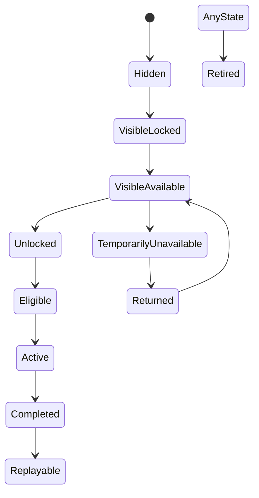

# Content and Unlocks（内容与解锁系统）

> Status: V1  
> Category: Content  
> Path: `design/systems/content/content-and-unlocks.md`  
> Owner: TBD  
> Reviewers: Design / Product / Engineering / UX / QA / Data / Live Operations  
> Last Updated: 2026-07-11  
> Version: 1.0  
> Risk Level: High  
> Dependencies: Core Loop, Game State and Flow, Progression System, Reward System, Resources and Economy, Entitlement and Ownership, Save and Persistence, Live Operations  
> Affected Systems: Objectives and Quests, Characters and Loadouts, Difficulty and Challenge, Tutorial and Onboarding, Monetization, Offers and Pricing, Analytics and Telemetry

---

## 1. System Summary

Content and Unlocks 系统负责定义：

```text
项目中有哪些内容；
内容如何被组织；
内容何时可见；
内容何时可进入；
内容何时可完成；
内容通过什么条件解锁；
内容何时过期、返场、下架或迁移；
内容之间如何形成路径、阶段和长期结构。
```

内容系统不只是“关卡列表”。

它可以管理：

- 玩法；
- 关卡；
- 地区；
- 角色；
- 装备；
- 技能；
- 任务；
- 活动；
- 剧情；
- 商店内容；
- 社交功能；
- 难度；
- 表达内容；
- 教学；
- 系统功能。

解锁系统负责将：

```text
玩家状态
+
内容规则
+
时间
+
权限
+
成长
```

转化为：

```text
当前能看见什么；
能做什么；
为什么不能做；
如何获得访问资格；
解锁后在哪里使用。
```

---

## 2. Purpose

### 2.1 Player Value

该系统帮助玩家：

- 理解当前可做内容；
- 看到下一步目标；
- 感知成长带来的新机会；
- 避免过早接触高复杂度内容；
- 理解为什么某项内容被锁定；
- 在内容返场、下架或版本变化时保留信任；
- 回归后快速理解哪些内容仍然有效；
- 不因复杂资格条件而迷失。

### 2.2 Experience Contribution

内容与解锁系统可以支持：

- 探索；
- 期待；
- 成长；
- 节奏；
- 教学；
- 选择；
- 身份；
- 长期目标。

但不健康的解锁设计会造成：

- 菜单被锁图标填满；
- 玩家不知道下一步；
- 核心内容被重复劳动阻塞；
- 活动内容永久错过；
- 解锁条件隐藏；
- 付费入口伪装为成长；
- 回归玩家被大量新系统淹没；
- 内容路径只有唯一顺序。

### 2.3 Product Value

该系统为以下能力提供共同基础：

- 内容导航；
- 新手引导；
- 成长；
- 任务；
- 活动；
- 商业化；
- 版本发布；
- 内容退役；
- Live Operations；
- 数据分析；
- 个性化推荐。

### 2.4 Why This System Exists

如果每类内容独立管理可见性和资格，常见结果是：

```text
同一内容在不同入口状态不一致；
任务说已解锁但页面仍锁定；
内容下架后存档引用失效；
付费、成长和活动资格互相覆盖；
旧版本内容无法迁移；
入口存在但内容不可加载；
解锁后没有明确下一步。
```

统一内容与解锁系统用于确保：

- 内容身份唯一；
- 资格来源清楚；
- 可见、可进入、可完成分层；
- 时间与权益规则一致；
- 内容生命周期可维护；
- 下游系统共享同一权威判断。

---

## 3. Non-Goals

该系统不负责：

- 定义所有具体玩法规则；
- 管理完整任务进度；
- 拥有角色状态；
- 拥有资源余额；
- 处理支付；
- 决定最终 UI 布局；
- 直接发放奖励；
- 替代 Live Operations；
- 用锁定图标制造虚假内容量；
- 通过大量前置条件强迫重复参与；
- 让所有内容都必须按单一路线开放；
- 通过隐藏资格推动付费。

---

## 4. Governing Principles

### 4.1 Core Experience and Fantasy

参考：

- `../../philosophy/foundation/core-experience-and-fantasy.md`

应用原则：

- 内容开放顺序应强化核心体验；
- 早期内容优先展示核心价值；
- 新内容应扩展而不是稀释核心；
- 重大解锁应符合玩家幻想和身份。

### 4.2 Player First Design

参考：

- `../../philosophy/foundation/player-first-design.md`

应用原则：

- 锁定原因必须可理解；
- 解锁条件不能无意义增加摩擦；
- 核心内容不应因短期离开永久失去；
- 回归时逐步重新介绍内容。

### 4.3 Simplicity and Depth

参考：

- `../../philosophy/experience/simplicity-and-depth.md`

应用原则：

- 内容分类和解锁规则应简单；
- 高级复杂度逐步开放；
- 不用大量独立资格制造复杂度；
- 内容路径可以有分支但应可理解。

### 4.4 Choice and Consequence

参考：

- `../../philosophy/experience/choice-and-consequence.md`

应用原则：

- 内容解锁可以形成路线选择；
- 路线差异应真实；
- 不应因未知信息造成长期不可逆错误；
- 选择前应预览后续影响。

### 4.5 Consistency and Coherence

参考：

- `../../philosophy/long-term/consistency-and-coherence.md`

应用原则：

- 同类内容使用同类解锁规则；
- 同一内容在不同入口状态一致；
- 活动和版本内容遵循统一生命周期；
- 内容 ID、状态和术语稳定。

### 4.6 Ethical Design

参考：

- `../../philosophy/responsibility/ethical-design.md`

应用原则：

- 不使用虚假锁定或虚假稀缺；
- 不隐藏付费与成长资格差异；
- 不通过 FOMO 让核心内容永久错过；
- 儿童和脆弱用户需要额外消费保护。

---

## 5. Player Experience

### 5.1 Player Goal

玩家使用内容系统通常为了：

- 找到当前可做内容；
- 了解下一步；
- 进入目标；
- 解锁新玩法；
- 发现新角色或地区；
- 回看已完成内容；
- 选择路线；
- 参与活动；
- 恢复旧进度。

### 5.2 Entry

内容入口包括：

- 主界面；
- 地图；
- 任务；
- 角色；
- 活动；
- 商店；
- 通知；
- 社交邀请；
- 回归页面；
- 深链；
- 结算；
- 新手引导。

### 5.3 Main Actions

玩家可以：

- 浏览；
- 筛选；
- 预览；
- 进入；
- 收藏；
- 解锁；
- 购买；
- 选择路线；
- 查看条件；
- 返回；
- 追踪；
- 继续。

### 5.4 Core Decisions

关键决策包括：

- 先解锁哪个内容；
- 是否投入资源；
- 是否选择分支；
- 是否现在参与限时内容；
- 是否购买访问资格；
- 是否放弃旧路线；
- 是否回到已完成内容。

### 5.5 Success

健康内容体验意味着：

- 玩家知道当前可做什么；
- 锁定原因清楚；
- 解锁后立即知道在哪里使用；
- 内容入口与实际可用性一致；
- 新内容不会一次淹没玩家；
- 活动结束和返场规则明确；
- 旧内容仍有适当价值。

### 5.6 Failure

失败包括：

- 内容状态不一致；
- 已解锁但不可进入；
- 可见内容没有资格；
- 内容已下架但仍有入口；
- 解锁条件过期；
- 权益不同步；
- 版本不兼容；
- 活动结束后状态丢失；
- 任务引用不存在内容。

---

## 6. System Boundary

### 6.1 Inputs

系统接收：

- Progression State；
- Objective State；
- Entitlement State；
- Resource State；
- Time and Event State；
- Account State；
- Platform and Region；
- Content Configuration；
- Version State；
- Live Operations Rules；
- Social Context；
- Difficulty Eligibility。

### 6.2 Outputs

系统产生：

- Content Visibility；
- Content Availability；
- Entry Eligibility；
- Completion Eligibility；
- Unlock State；
- Lock Reason；
- Unlock Event；
- Content Route；
- Return Target；
- Retirement State；
- Migration Mapping；
- Content Summary。

### 6.3 Owned State

系统拥有：

- Content Definition；
- Content ID；
- Content Category；
- Content Lifecycle State；
- Visibility State；
- Availability State；
- Unlock State；
- Lock Reason；
- Content Dependency Graph；
- Content Route；
- Content Version；
- Retirement Mapping；
- Return Availability；
- Content History。

### 6.4 Read-Only Dependencies

系统读取：

- Progression；
- Objectives；
- Entitlement；
- Economy；
- Time；
- Account；
- Region；
- Platform；
- Live Operations；
- Difficulty；
- Save。

### 6.5 Write Dependencies

系统通过正式契约请求：

- Save 持久化解锁状态；
- Reward 处理内容奖励；
- Objectives 更新目标；
- Game State 进入内容流程；
- Notification 提醒返场或解锁；
- Analytics 记录内容状态变化。

### 6.6 Out of Scope

系统不直接：

- 修改资源余额；
- 发放购买权益；
- 处理支付；
- 完成任务；
- 修改角色属性；
- 计算战斗结果；
- 决定活动奖励表。

---

## 7. Core Entities and Concepts

| Entity / Concept | Definition | Owner | Lifetime | Notes |
|---|---|---|---|---|
| Content Definition | 内容的稳定定义 | Content | 版本级 | 唯一 ID |
| Content Instance | 可重复或动态生成的具体实例 | Content / Domain | 实例期 | 如活动、关卡实例 |
| Content Category | 内容分类 | Content | 长期 | 用于导航和规则 |
| Visibility State | 是否可被看见 | Content | 动态 | 不等于可进入 |
| Availability State | 内容当前是否存在并开放 | Content | 动态 | 与时间和版本有关 |
| Unlock State | 玩家是否获得访问资格 | Content | 长期或阶段性 | 权威状态 |
| Eligibility | 当前是否满足进入条件 | Content | 动态 | 可重新计算 |
| Lock Reason | 当前不可进入的原因 | Content | 动态 | 玩家可见 |
| Dependency | 内容之间的前置关系 | Content | 配置级 | 构成图 |
| Route | 玩家可选择的内容路径 | Content | 长期或阶段性 | 可分支 |
| Lifecycle State | Draft、Active、Retired 等 | Content | 版本级 | 管理内容生命周期 |
| Return State | 返场和恢复资格 | Content | 活动或版本级 | 需要历史 |
| Retirement Mapping | 内容下架后的替代关系 | Content | 迁移期 | 保留旧引用 |

---

## 8. Content Taxonomy

### 8.1 Core Content

构成主要体验。

例如：

- 核心玩法；
- 主线；
- 主要地区；
- 核心角色；
- 基础系统。

### 8.2 Optional Content

可选扩展。

例如：

- 支线；
- 挑战；
- 收集；
- 表达；
- 隐藏内容。

### 8.3 Progression Content

与成长直接相关。

### 8.4 Social Content

需要多人、好友或社交关系。

### 8.5 Competitive Content

用于排名、匹配和竞技。

### 8.6 Event Content

限时或周期性内容。

### 8.7 Commercial Content

通过购买、订阅或权益开放。

### 8.8 Tutorial Content

用于教学和恢复。

### 8.9 Legacy Content

旧版本但仍保留访问的内容。

### 8.10 Retired Content

已经停止正常开放的内容。

---

## 9. Content Definition Template

```markdown
## Content Definition

- Content ID:
- Display Name:
- Category:
- Core / Optional:
- Player Purpose:
- Visibility Rule:
- Availability Rule:
- Unlock Rule:
- Entry Rule:
- Completion Rule:
- Dependencies:
- Rewards:
- Difficulty:
- Entitlement:
- Time Window:
- Region:
- Platform:
- Return Policy:
- Retirement Policy:
- Version:
- Owner:
- Risk Level:
```

### 9.1 必须回答

- 为什么存在；
- 玩家何时应该看见；
- 如何获得访问资格；
- 与什么内容相连；
- 是否会过期；
- 是否返场；
- 是否付费；
- 下架后如何处理；
- 是否属于核心体验。

---

## 10. Visibility, Availability, Unlock, Eligibility

必须严格区分四种状态。

### 10.1 Visibility

玩家是否能看见内容。

### 10.2 Availability

内容当前是否存在并对该平台、地区、版本开放。

### 10.3 Unlock

玩家是否已经获得长期或阶段性访问资格。

### 10.4 Eligibility

玩家当前是否满足进入条件。

例如：

```text
内容可见；
内容当前可用；
玩家已解锁；
但当前队伍不满足进入条件。
```

### 10.5 Why Separation Matters

如果混在一起，会出现：

- 已解锁但入口消失；
- 可见但无法解释锁定；
- 活动下架后状态被误清除；
- 权益恢复困难；
- 深链绕过条件。

---

## 11. Content State Model

```text
Hidden
→ Visible Locked
→ Visible Available
→ Unlocked
→ Eligible
→ Active
→ Completed
→ Replayable
```

生命周期可能分支：

```text
Available
→ Temporarily Unavailable
→ Returned
→ Retired
```



---

## 12. Content Lifecycle

内容生命周期建议统一：

```text
Draft
→ Internal
→ Scheduled
→ Active
→ Grace Period
→ Inactive
→ Returned
→ Legacy
→ Retired
→ Archived
```

### 12.1 Draft

尚未可用。

### 12.2 Internal

内部或测试群体可见。

### 12.3 Scheduled

已经配置未来开放。

### 12.4 Active

正常开放。

### 12.5 Grace Period

不再进入，但允许：

- 完成；
- 领取；
- 兑换；
- 保存；
- 迁移。

### 12.6 Inactive

当前不开放，但可能返场。

### 12.7 Returned

重新开放。

### 12.8 Legacy

旧内容仍可访问，但不再主要维护。

### 12.9 Retired

不再正常访问。

### 12.10 Archived

仅用于历史、审计或数据保留。

---

## 13. Unlock Rule Types

### 13.1 Progression Unlock

基于：

- 等级；
- 里程碑；
- 熟练度；
- Track；
- 成长节点。

### 13.2 Objective Unlock

基于任务或成就完成。

### 13.3 Resource Unlock

消耗资源。

### 13.4 Entitlement Unlock

基于购买、订阅或所有权。

### 13.5 Time Unlock

基于日期、周期或活动状态。

### 13.6 Discovery Unlock

通过探索、发现或交互。

### 13.7 Social Unlock

通过队伍、公会、好友或协作。

### 13.8 Choice Unlock

玩家从多条路线中选择。

### 13.9 Difficulty Unlock

完成特定难度或挑战。

### 13.10 Tutorial Unlock

完成教学后开放。

---

## 14. Unlock Rule Structure

统一结构：

```markdown
| Condition | Source System | Required State | Persistent | Visible |
|---|---|---|---|---|
```

### 14.1 AND / OR

复杂条件应明确：

- 全部满足；
- 任一满足；
- 分组；
- 可替代路径。

### 14.2 Hidden Conditions

一般不应隐藏核心解锁条件。

隐藏条件只适合：

- 秘密内容；
- 探索惊喜；
- 非核心收集。

### 14.3 Condition Stability

若条件会变化，应说明：

- 解锁后是否永久；
- 条件失效是否重新锁定；
- 资格和解锁如何区分。

---

## 15. Permanent vs Conditional Unlock

### 15.1 Permanent Unlock

一旦获得，长期保留。

适合：

- 核心内容；
- 成长里程碑；
- 购买权益；
- 角色；
- 功能。

### 15.2 Conditional Unlock

仅在条件满足时有效。

适合：

- 活动；
- 队伍；
- 特定模式；
- 时间；
- 地区。

### 15.3 Re-Locking

重新锁定高价值内容必须谨慎。

不能因：

- 短期离开；
- 活动结束；
- 配置错误；

无说明撤销已获得核心价值。

### 15.4 Unlock Record

永久解锁应保存：

- 来源；
- 时间；
- 版本；
- 资格；
- 事务 ID。

---

## 16. Lock Reasons

标准分类：

- Progression Required；
- Objective Required；
- Resource Required；
- Entitlement Required；
- Time Locked；
- Region Restricted；
- Platform Restricted；
- Party Required；
- Difficulty Required；
- Tutorial Required；
- Content Unavailable；
- Version Unsupported；
- Temporary Maintenance；
- Account Restricted。

### 16.1 Player-Facing Explanation

应说明：

- 当前原因；
- 需要做什么；
- 距离目标多远；
- 是否有替代路径；
- 是否会返场；
- 是否需要付费。

### 16.2 Avoid Generic Locked

只显示：

```text
未解锁
```

通常不够。

---

## 17. Content Dependency Graph

内容依赖应建模为图，而不是隐藏在页面逻辑中。

### 17.1 Dependency Types

- Required；
- Recommended；
- Alternative；
- Mutually Exclusive；
- Unlocks；
- Replaces；
- Retires；
- Returns From；
- Requires Entitlement。

### 17.2 Cycle Detection

必须防止：

```text
A 需要 B；
B 又需要 A。
```

### 17.3 Orphan Content

应检测：

- 没有入口；
- 没有解锁路径；
- 无法完成；
- 奖励引用失效；
- 旧内容下架后断链。

### 17.4 Graph Review

重大内容版本发布前，应检查：

- 断链；
- 循环；
- 无入口；
- 无替代；
- 过度线性。

---

## 18. Content Routes

### 18.1 Linear Route

适合：

- 教学；
- 叙事；
- 规则建立。

风险：

- 自由度低；
- 回归时重复；
- 单一路线。

### 18.2 Branching Route

支持选择。

风险：

- 内容成本；
- 路线失衡；
- 错过焦虑。

### 18.3 Hub Route

从中心自由选择多个内容。

### 18.4 Layered Route

逐层开放，适合复杂系统。

### 18.5 Dynamic Route

根据玩家状态推荐或改变顺序。

必须透明且不隐藏核心内容。

---

## 19. Progressive Disclosure

复杂内容应逐步开放。

### 19.1 Purpose

- 降低初始负担；
- 建立基础理解；
- 按需要开放；
- 保护节奏。

### 19.2 Risks

- 老玩家被迫重复；
- 功能开放过晚；
- 核心体验被锁住；
- 教学成为摩擦。

### 19.3 Skilled and Returning Players

应提供：

- 跳过；
- 快速验证；
- 直接开放已掌握功能；
- 恢复旧资格。

---

## 20. Content Gating

### 20.1 Soft Gate

提示和推荐，但允许尝试。

### 20.2 Hard Gate

完全阻止进入。

### 20.3 Healthy Hard Gate

适用于：

- 必要教学；
- 权益；
- 法律和地区；
- 多人资格；
- 数据安全；
- 不可恢复风险。

### 20.4 Unhealthy Gate

包括：

- 重复劳动；
- 隐藏条件；
- 无关玩法强制；
- 为付费制造的人工阻塞；
- 纯时间等待。

---

## 21. Content Preview

锁定内容可以展示：

- 名称；
- 类型；
- 核心价值；
- 解锁条件；
- 预计投入；
- 是否限时；
- 是否付费；
- 返场；
- 主要奖励。

### 21.1 Spoiler Control

叙事或秘密内容可以控制信息量。

### 21.2 Preview Accuracy

预览与实际内容应一致。

不得用与实际不符的表现推动解锁或购买。

---

## 22. Unlock Presentation

解锁反馈应说明：

- 解锁了什么；
- 为什么解锁；
- 在哪里使用；
- 是否需要进一步设置；
- 是否永久；
- 是否限时；
- 是否包含奖励。

### 22.1 Major Unlock

重大新系统、角色或玩法需要更清楚介绍。

### 22.2 Minor Unlock

可使用轻量反馈和汇总。

### 22.3 Skip and History

重复演出可跳过，解锁历史可回看。

---

## 23. Content Completion

完成状态可以分为：

- Entered；
- Attempted；
- Completed；
- Perfected；
- Mastered；
- Collected；
- Archived。

### 23.1 Completion Ownership

具体完成事实通常由：

- Objectives；
- Primary Activity；
- Progression；

拥有。

Content 系统读取并维护内容完成摘要。

### 23.2 Replay

已完成内容应说明：

- 是否可重玩；
- 奖励是否变化；
- 难度是否变化；
- 结果是否影响世界；
- 是否支持跳过。

---

## 24. Replayability

### 24.1 Replay Reasons

- 掌握；
- 奖励；
- 路线；
- 随机变化；
- 社交；
- 表达；
- 速度；
- 收藏。

### 24.2 Replay Value

不应只依赖：

- 更高数值奖励；
- 重复劳动；
- 每日次数。

### 24.3 First-Time vs Repeat

应明确：

- 首次奖励；
- 重复奖励；
- 内容变化；
- 跳过选项；
- 进度保留。

---

## 25. Event Content

### 25.1 Event Content Definition

必须说明：

- 开始；
- 结束；
- 宽限；
- 返场；
- 资格；
- 奖励；
- 货币；
- 未完成状态；
- 排名；
- 付费内容。

### 25.2 Core Content Boundary

关键玩法和基础能力不应永久锁定于单次活动。

### 25.3 Event Entry

入口应说明：

- 剩余时间；
- 预计投入；
- 主要价值；
- 是否适合当前进度；
- 结束后处理。

---

## 26. Return and Rerun

### 26.1 Return Types

- Exact Rerun；
- Updated Rerun；
- Partial Return；
- Permanent Addition；
- Rotating Availability。

### 26.2 Historical State

返场时应决定：

- 旧进度是否保留；
- 旧奖励是否可继续；
- 旧货币是否恢复；
- 保底是否继承；
- 旧版本任务如何映射。

### 26.3 Communication

返场规则必须提前说明。

---

## 27. Commercial Content

### 27.1 Entitlement

购买内容的访问资格由 Entitlement and Ownership 拥有。

Content 系统只读取资格并决定入口。

### 27.2 Purchase vs Unlock

购买后：

```text
Entitlement Granted
→ Content Unlock Evaluated
→ Content Available
```

不能由商城直接改内容状态。

### 27.3 Preview and Price

商业内容预览应说明：

- 包含内容；
- 所有权范围；
- 平台；
- 地区；
- 是否永久；
- 退款影响；
- 是否还需要其他前置。

### 27.4 Paid Gate

不能将基础退出、辅助和安全功能设为付费内容。

---

## 28. Region and Platform Availability

### 28.1 Availability Factors

- 法律；
- 许可；
- 平台能力；
- 商店政策；
- 性能；
- 语言；
- 服务器；
- 年龄。

### 28.2 Player Communication

不可用时应说明：

- 原因分类；
- 是否未来可用；
- 替代内容；
- 已购买权益处理；
- 转区风险。

### 28.3 Save Compatibility

跨平台切换时，内容状态和权益要可解释。

---

## 29. Version Compatibility

内容可能依赖：

- 客户端版本；
- 数据版本；
- 规则版本；
-平台版本；
- 服务器版本。

### 29.1 Unsupported Version

应：

- 阻止不安全进入；
- 保留解锁资格；
- 提示升级；
- 不清除内容状态。

### 29.2 In-Progress Content

版本更新时需要定义：

- 继续旧版本；
- 迁移；
- 重启；
- 补偿；
- 只读完成。

---

## 30. Content Retirement

### 30.1 Retirement Reasons

- 技术不可维护；
- 许可结束；
- 设计淘汰；
- 安全；
- 平衡；
- 内容合并；
- 版本迁移。

### 30.2 Retirement Plan

必须定义：

- 停止新进入时间；
- 宽限期；
- 进行中状态；
- 奖励；
- 资源；
- 所有权；
- 替代内容；
- 存档；
- 历史记录；
- 玩家通知。

### 30.3 Purchased Content

已购买内容下架需要：

- 所有权处理；
- 退款或替代；
- 法律评审；
- 清楚通知；
- 访问策略。

### 30.4 Avoid Silent Removal

不能让内容和玩家投入静默消失。

---

## 31. Legacy Content

Legacy Content 可能：

- 继续可玩；
- 只读；
- 不再奖励；
- 不进入匹配；
- 不再更新；
- 只对已有玩家开放。

### 31.1 Legacy Label

玩家应知道：

- 维护状态；
- 兼容风险；
- 奖励差异；
- 是否会下架。

---

## 32. Content Migration

### 32.1 Migration Types

- ID Mapping；
- Route Mapping；
- Progress Mapping；
- Reward Mapping；
- Resource Mapping；
- Entitlement Mapping；
- Save Mapping；
- Difficulty Mapping。

### 32.2 Migration Principles

- 不丢失核心价值；
- 保留历史；
- 可审计；
- 可回滚；
- 有补偿；
- 有 Last Known Good。

### 32.3 Removed Content

旧引用应映射到：

- 替代内容；
- 已完成记录；
- Legacy；
- 归档；
- 补偿。

---

## 33. Content Discoverability

### 33.1 Discovery Methods

- 导航；
- 推荐；
- 任务；
- 地图；
- 角色；
- 社交；
- 通知；
- 搜索；
- 收藏；
- 历史。

### 33.2 Avoid Hidden Useful Content

核心功能和重要成长路径不应依赖外部攻略才能发现。

### 33.3 Recommendation

推荐应基于：

- 当前目标；
- 资格；
- 进度；
- 时间；
- 玩家明确偏好。

不应基于敏感属性或高压商业目标。

---

## 34. Content Navigation

内容导航应支持：

- 分类；
- 搜索；
- 筛选；
- 收藏；
- 最近；
- 继续；
- 未完成；
- 已解锁；
- 即将结束；
- 返场。

### 34.1 State Consistency

列表、地图、任务和深链必须读取同一权威内容状态。

---

## 35. Content Density

过多可见内容会造成：

- 决策疲劳；
- 信息负担；
- 核心目标被稀释；
- 活动压力。

### 35.1 Density Controls

- 分层；
- 推荐；
- 折叠；
- 分类；
- 逐步开放；
- 优先级；
- 隐藏已完成低价值项。

### 35.2 Do Not Hide Ownership

即使内容不推荐，也应保留玩家已拥有内容的访问路径。

---

## 36. Content Freshness

内容新鲜感来自：

- 新规则；
- 新情境；
- 新组合；
- 新目标；
- 新角色；
- 新表达；
- 新社交；
- 新叙事。

不应只来自：

- 数值提高；
- 奖励倍率；
- 旧内容换皮；
- 新货币。

---

## 37. Content Debt

Content Debt 包括：

- 过多内容分类；
- 旧入口；
- 断链；
- 重复资格；
- 已下架内容引用；
- 无效奖励；
- Legacy 过多；
- 活动永久堆积；
- 解锁条件例外。

### 37.1 Signals

- 玩家找不到内容；
- 大量锁图标；
- 入口状态不一致；
- 旧内容无法维护；
- 每次活动需要特殊代码；
- 回归页面过度复杂。

### 37.2 Reduction

- 内容合并；
- 路线简化；
- ID 清理；
- Legacy 策略；
- 资格统一；
- 旧资源转换；
- 删除无效入口；
- 生命周期治理。

---

## 38. Failure and Recovery

| Failure | Cause | Player Impact | Recovery | Data Guarantee |
|---|---|---|---|---|
| Unlock Event Lost | 事件丢失 | 已满足但未解锁 | 重新评估资格 | 条件可重算 |
| Content Missing | 配置或版本缺失 | 无法进入 | 安全返回或替代 | 解锁状态保留 |
| Entitlement Delay | 权益未同步 | 已购买但锁定 | 查询与恢复 | 不重复购买 |
| Time Misconfiguration | 活动时间错误 | 提前关闭或延迟 | Last Known Good、补偿 | 历史记录 |
| Dependency Cycle | 配置错误 | 无法解锁 | 阻止发布 | 不进入生产 |
| Retirement Mapping Missing | 下架无替代 | 存档断链 | Legacy 或归档 | 保留旧引用 |
| Version Unsupported | 客户端过旧 | 无法进入 | 升级提示 | 资格保留 |
| Deep Link Invalid | 参数失效 | 空页面 | 安全入口 | 不修改状态 |
| Route Broken | 前置内容删除 | 路线中断 | 替代条件 | 记录迁移 |

---

## 39. Edge Cases

### Unlock

- 同时满足多个条件；
- 条件完成后内容下架；
- 购买和成长同时解锁；
- 解锁时跨版本；
- 多设备同时解锁。

### Availability

- 活动结束瞬间进入；
- 平台切换；
- 地区变化；
- 账户年龄变化；
- 维护中；
- 服务不可用。

### Dependencies

- 前置内容被删除；
- 分支互斥；
- 替代路线同时满足；
- 内容循环依赖；
- 隐藏内容依赖公开内容。

### Retirement

- 玩家正在内容中；
- 未领取奖励；
- 已购买；
- Legacy 存档；
- 返场计划变化；
- 许可突然结束。

### Replay

- 首次奖励已领取；
- 版本变化；
- 难度变化；
- 内容状态重置；
- 多人队伍成员资格不同。

---

## 40. Cross-System Dependencies

| System | Dependency Type | Direction | Data or Event | Failure Impact |
|---|---|---|---|---|
| Progression System | Hard / Soft | Progression → Content | Milestone / Level | 解锁延迟 |
| Objectives and Quests | Hard / Soft | Objectives → Content | Completion | 路线中断 |
| Entitlement and Ownership | Hard | Entitlement → Content | Ownership | 付费访问风险 |
| Resources and Economy | Soft / Hard | Economy → Content | Resource Unlock | 无法进入 |
| Reward System | Soft | Reward → Content | Unlock Reward | 内容延迟 |
| Game State and Flow | Hard | 双向 | Entry / Return | 无法进入或退出 |
| Difficulty and Challenge | Soft / Hard | Difficulty → Content | Eligibility | 挑战不匹配 |
| Live Operations | Hard for Events | Live → Content | Lifecycle State | 活动错误 |
| Save and Persistence | Hard | Content → Save | Unlock / History | 无法恢复 |
| Notification | Soft | Content → Notification | Return / Expiry | 不阻断 |
| Analytics | Soft | Content → Analytics | State Events | 不阻断 |

---

## 41. Data and Persistence

| State | Persistent | Authority | Save Trigger | Retention | Recovery |
|---|---|---|---|---|---|
| Content Definition | 是 | Content | 配置发布 | 版本期 | Last Known Good |
| Unlock State | 是 | Content | 解锁或撤销 | 长期 | 条件重算或历史 |
| Visibility State | 可重算 | Content | 状态变化 | 当前版本 | 重新计算 |
| Availability State | 可重算 | Content / Live | 时间和配置变化 | 当前周期 | Last Known Good |
| Dependency Graph | 是 | Content | 发布 | 版本期 | 回滚 |
| Route State | 是 | Content | 路线选择 | 长期 | 历史恢复 |
| Completion Summary | 是 | Content / Domain | 完成变化 | 长期 | 领域状态重建 |
| Return State | 是 | Content | 返场或活动变化 | 活动及审计期 | 历史恢复 |
| Retirement Mapping | 是 | Content | 下架发布 | 长期 | 旧 ID 映射 |
| Content History | 是 | Content | 关键变化 | 长期 | 审计 |

---

## 42. Accessibility

### 42.1 Visual

- Lock、Available、Owned、Completed 等状态不只靠颜色；
- 锁定原因有文本；
- 内容分类和路径可缩放；
- 重要时间状态清楚。

### 42.2 Cognitive

- 限制同时展示的内容；
- 提供当前目标；
- 解锁条件简化；
- 路线差异清楚；
- 回归时逐步介绍。

### 42.3 Input

- 支持搜索、筛选和收藏；
- 锁定内容不会抢焦点；
- 高风险解锁和购买防误触；
- 长列表支持多设备导航。

### 42.4 Timing

- 限时内容提前提醒；
- 宽限期；
- 不要求极短时间内处理解锁；
- 下架前有通知。

### 42.5 Reading

- 条件、时间和资格使用一致术语；
- 不用复杂多层换算表达解锁要求；
- 支持完整详情和简要摘要。

---

## 43. Ethical and Safety Review

### 43.1 FOMO

- 核心内容不永久错过；
- 活动返场和替代路径清楚；
- 不使用虚假倒计时；
- 宽限期合理。

### 43.2 Paid Access

- 付费与成长资格明确区分；
- 不隐藏额外前置；
- 不将基础安全和辅助功能设为付费；
- 退款和下架处理透明。

### 43.3 Children and Vulnerable Users

- 商业内容有年龄和监护保护；
- 不用锁图标和角色失望制造压力；
- 不用短期活动强迫购买；
- 提供低压力内容入口。

### 43.4 Content Removal

- 不静默删除玩家已获得价值；
- 已购买内容有明确处理；
- 许可和平台限制透明；
- 历史和身份尽量保留。

### 43.5 Personalization

内容推荐不应根据敏感属性或脆弱状态操纵消费和参与。

---

## 44. Analytics and Validation

### 44.1 Key Assumptions

1. 玩家能理解当前可做内容。
2. Lock Reason 和 Unlock Path 清楚。
3. 内容开放顺序支持核心体验。
4. Progressive Disclosure 降低负担而不制造摩擦。
5. 内容路径既有方向又保留选择。
6. 活动内容结束、返场和下架规则可理解。
7. 已购买和已解锁内容不会因版本变化丢失。
8. 回归玩家可以快速恢复内容上下文。
9. 内容数量增长不会导致导航和资格失控。

### 44.2 Validation Plan

| Hypothesis | Evidence | Success | Failure | Method |
|---|---|---|---|---|
| 可做内容清楚 | 找路任务 | 能快速选择目标 | 经常迷失 | 可用性测试 |
| Lock Reason 清楚 | 复述 | 能说明解锁方式 | 只看到锁定 | 研究 |
| 开放顺序合理 | 学习表现 | 新系统按需要理解 | 信息过载 | 新手测试 |
| 路线有选择 | 路线分布 | 多条路线被使用 | 单一路线 | 行为分析 |
| 活动规则清楚 | 结束测试 | 能预测未完成处理 | 到期投诉 | 访谈 |
| 权益稳定 | 购买恢复 | 已购买内容可恢复 | 重复购买或丢失 | QA |
| 回归有效 | 回归任务 | 能找到当前内容 | 新系统淹没 | Research |
| 长期可维护 | 债务指标 | 断链和例外受控 | 内容系统持续复杂化 | 架构审计 |

### 44.3 Behavioral Metrics

- Content Viewed；
- Lock Reason Viewed；
- Unlock Path Started；
- Content Unlocked；
- Content Entered；
- Content Completed；
- Content Replayed；
- Route Selected；
- Content Returned；
- Content Expired；
- Content Retired；
- Invalid Entry Attempt。

### 44.4 Outcome Metrics

- Time to Relevant Content；
- Unlock Conversion；
- Lock Understanding；
- Route Diversity；
- Content Discovery；
- Replay Rate；
- Event Completion；
- Return Recovery；
- Purchased Content Recovery；
- Orphan Content Rate；
- Broken Route Rate。

### 44.5 Negative Metrics

- 已解锁但不可进入；
- 入口状态不一致；
- 隐藏前置；
- 付费后仍锁定；
- 活动提前结束；
- 内容静默下架；
- 回归迷失；
- 大量锁图标；
- 路线断链；
- Legacy 过多；
- 深链进入空页面；
- 核心内容永久错过。

### 44.6 Event Intents

| Event Intent | Trigger | Key Properties | Privacy Notes |
|---|---|---|---|
| Content Became Visible | 可见性变化 | Category, Reason | 匿名 ID |
| Content Unlocked | 解锁成功 | Content, Source | 不记录支付敏感信息 |
| Entry Rejected | 进入被拒绝 | Lock Reason | 数据最小化 |
| Route Selected | 路线选择 | Route, Branch | 不用于敏感画像 |
| Content Returned | 返场 | Content, Version | 运营分析 |
| Content Retired | 下架 | Content, Mapping | 审计 |
| Entitlement Recovered | 权益恢复 | Content, Result | 权限控制 |
| Broken Dependency Detected | 图错误 | Type, Severity | 内部使用 |

---

## 45. Content Map Template

```markdown
# Content Map

## Categories

| Category | Purpose | Entry | Lifecycle |
|---|---|---|---|

## Content Inventory

| Content | Category | Visibility | Unlock | Availability | Version |
|---|---|---|---|---|---|

## Dependency Graph

```mermaid
flowchart TD
```

## Routes

| Route | Entry | Branches | Completion | Return |
|---|---|---|---|---|

## Lifecycle

| Content | Start | End | Grace | Return | Retirement |
|---|---|---|---|---|---|

## Risks

- Orphan:
- Cycles:
- Hidden Gates:
- FOMO:
- Paid Access:
- Legacy Debt:

## Validation

- Success:
- Failure:
- Metrics:
```

---

## 46. Rollout and Migration

### 46.1 Rollout

内容与解锁变更应按：

- 内部；
- 测试环境；
- 小范围；
- 分内容；
- 分平台；
- 全量；

逐步发布。

### 46.2 High-Risk Changes

包括：

- 内容 ID 变化；
- 路线重构；
- 付费内容；
- 活动生命周期；
- 核心内容下架；
- 解锁条件变化；
- Legacy 迁移；
- 大规模返场。

### 46.3 Migration

必须定义：

- Unlock State；
- Completion；
- Route；
- Rewards；
- Entitlement；
- Resources；
- In-Progress Instance；
- Legacy ID；
- Return State；
- History。

### 46.4 Rollback

回滚时：

- 保留已获得解锁；
- 已购买内容不丢失；
- 使用旧 Dependency Graph；
- 进行中内容使用原版本或安全映射；
- 保留历史；
- 必要时补偿。

### 46.5 Stop Conditions

出现以下情况应停止发布：

- 已解锁内容被重新锁定；
- 付费内容不可访问；
- 依赖循环；
- 大量入口失效；
- 活动提前结束；
- Retirement Mapping 缺失；
- 旧存档无法加载；
- 路线断裂；
- 核心内容永久错过；
- 深链绕过资格。

---

## 47. Risks and Open Questions

| Item | Type | Impact | Probability | Mitigation | Owner |
|---|---|---:|---:|---|---|
| 内容入口状态不一致 | Integration Risk | 高 | 中 | 单一权威状态 | Engineering |
| 解锁条件膨胀 | Complexity Risk | 高 | 高 | 条件审计和合并 | Design |
| 活动永久错过 | Ethical Risk | 高 | 中 | 返场和替代 | Live Ops |
| 付费内容下架 | Trust Risk | 严重 | 低 | 权益和退款计划 | Product |
| Dependency Graph 断裂 | Architecture Risk | 高 | 中 | 自动图验证 | Engineering |
| 回归玩家内容过载 | UX Risk | 高 | 高 | Progressive Reintroduction | UX |
| Legacy Content 过多 | Maintenance Risk | 高 | 中 | 退役策略 | Product |
| 路线唯一化 | Experience Risk | 中 | 中 | 分支和平衡 | Design |
| 版本迁移丢失解锁 | Migration Risk | 严重 | 中 | 历史和备份 | Engineering |

---

## 48. Review Checklist

### Purpose and Taxonomy

- [ ] 内容分类和职责明确；
- [ ] Core、Optional、Event、Commercial、Legacy 等内容区分；
- [ ] 每项内容有统一 Content Definition；
- [ ] 不用锁图标制造虚假内容量；
- [ ] Non-Goals 已定义。

### State Model

- [ ] Visibility、Availability、Unlock、Eligibility 分离；
- [ ] Content Lifecycle 完整；
- [ ] Permanent 与 Conditional Unlock 区分；
- [ ] Lock Reason 可解释；
- [ ] Return、Legacy、Retired 状态明确。

### Unlocks and Dependencies

- [ ] Unlock Rule 类型明确；
- [ ] AND、OR、替代路径清楚；
- [ ] Dependency Graph 无循环；
- [ ] Orphan Content 可检测；
- [ ] 路线选择有真实差异。

### Gating and Disclosure

- [ ] Hard Gate 有合理理由；
- [ ] Soft Gate 与推荐清楚；
- [ ] Progressive Disclosure 不阻碍熟练玩家；
- [ ] Preview 与实际一致；
- [ ] 解锁后明确下一步。

### Lifecycle and Retirement

- [ ] 活动有开始、结束、宽限和返场；
- [ ] In-Progress 内容处理明确；
- [ ] Retirement 有替代和迁移；
- [ ] Purchased Content 有专项处理；
- [ ] Legacy 标签和维护状态清楚。

### Commercial and Ethics

- [ ] Entitlement 与 Content 状态分离；
- [ ] 付费和成长资格透明；
- [ ] 核心内容不永久错过；
- [ ] 不使用虚假稀缺；
- [ ] 儿童和脆弱用户保护完整。

### Data and Validation

- [ ] Unlock、Route、Return、Retirement 和 History 可持久化；
- [ ] 入口状态一致性可测试；
- [ ] Broken Dependency 和 Orphan 有监控；
- [ ] 回归和内容密度有验证；
- [ ] 迁移、回滚和停止条件明确。

---

## 49. V1 Completion Criteria

Content and Unlocks 可以被视为 V1，当：

- 内容分类、职责和边界已经定义；
- 每项内容有统一 Content Definition；
- Visibility、Availability、Unlock 和 Eligibility 四种状态明确分离；
- Content State Model 和 Lifecycle 完整；
- Progression、Objective、Resource、Entitlement、Time、Social 和 Difficulty Unlock 规则明确；
- Permanent、Conditional、Temporary 和 Commercial Unlock 得到区分；
- Lock Reason 有标准分类和玩家可见说明；
- Content Dependency Graph 可检测循环、断链和孤立内容；
- Linear、Branching、Hub、Layered 和 Dynamic Route 有明确适用范围；
- Progressive Disclosure 支持新手，也允许熟练和回归玩家快速进入；
- Hard Gate 和 Soft Gate 边界明确；
- Unlock Presentation、Completion、Replay 和 History 规则完整；
- Event Content 具有开始、结束、宽限、返场和剩余处理；
- Entitlement、Content 和 Purchase 的状态边界明确；
- Region、Platform 和 Version Availability 规则完整；
- Retirement、Legacy、Migration 和 Purchased Content 处理可执行；
- 已获得和已购买价值不会因内容更新静默丢失；
- Content Discoverability、Navigation、Density 和 Freshness 有治理方式；
- Content Debt 有识别和削减策略；
- 可访问性、FOMO、付费访问和儿童保护通过评审；
- Unlock、Route、Entry、Return、Retirement 和 Orphan Content 有验证计划；
- 高风险内容变更具有灰度、迁移、回滚和停止条件；
- 下游 Objectives、Characters、Difficulty、Tutorial、Live Operations 和 Commercial 系统可以直接引用本文件。

---

## 50. Related Documents

### Philosophy

- [Core Experience and Fantasy](../../philosophy/foundation/core-experience-and-fantasy.md)
- [Player First Design](../../philosophy/foundation/player-first-design.md)
- [Simplicity and Depth](../../philosophy/experience/simplicity-and-depth.md)
- [Choice and Consequence](../../philosophy/experience/choice-and-consequence.md)
- [Consistency and Coherence](../../philosophy/long-term/consistency-and-coherence.md)
- [Ethical Design](../../philosophy/responsibility/ethical-design.md)

### Systems

- [Systems README](../README.md)
- [System Design Framework](../system-design-framework.md)
- [System Map](../system-map.md)
- [Integration Rules](../integration-rules.md)
- [Core Loop](../core/core-loop.md)
- [Game State and Flow](../core/game-state-and-flow.md)
- [Resources and Economy](../progression/resources-and-economy.md)
- [Progression System](../progression/progression-system.md)
- [Reward System](../progression/reward-system.md)
- [Difficulty and Challenge](../progression/difficulty-and-challenge.md)
- `objectives-and-quests.md`
- `characters-and-loadouts.md`
- `content-lifecycle.md`
- `../commercial/entitlement-and-ownership.md`
- `../operations/live-operations.md`
