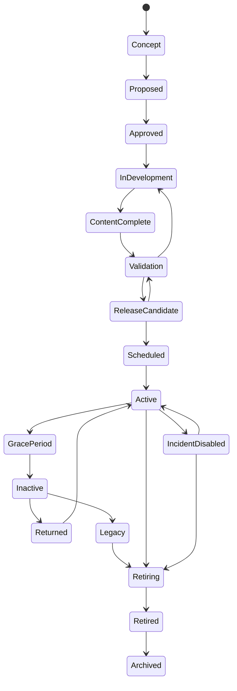

# Content Lifecycle（内容生命周期系统）

> Status: V1  
> Category: Content  
> Path: `design/systems/content/content-lifecycle.md`  
> Owner: TBD  
> Reviewers: Design / Product / Engineering / QA / UX / Data / Live Operations / Legal / Commercial  
> Last Updated: 2026-07-11  
> Version: 1.0  
> Risk Level: High  
> Dependencies: Content and Unlocks, Objectives and Quests, Characters and Loadouts, Reward System, Resources and Economy, Entitlement and Ownership, Save and Persistence, Live Operations, Versioning and Migration  
> Affected Systems: Core Loop, Difficulty and Challenge, Tutorial and Onboarding, Notification and Reminders, Monetization, Analytics and Telemetry, Experiment Management

---

## 1. System Summary

Content Lifecycle 系统负责定义：

```text
内容如何被提出；
如何被评估；
如何被制作；
如何被验证；
如何被发布；
如何进入运营；
如何被更新、返场、替换、降级、退役和归档；
内容变化如何保护玩家进度、所有权和长期信任。
```

它管理的不是单一内容本身，而是：

```text
内容从“想法”
到“玩家可用”
再到“退出主舞台”
的完整生命过程。
```

内容生命周期通常覆盖：

- 玩法；
- 关卡；
- 角色；
- 装备；
- 技能；
- 任务；
- 活动；
- 赛季；
- 奖励；
- 商店内容；
- 叙事；
- 社交功能；
- 教学；
- 系统功能；
- 配置；
- 数据定义。

健康的生命周期系统应保证：

- 内容身份稳定；
- 发布状态可追踪；
- 依赖关系清楚；
- 版本可回滚；
- 进行中内容可恢复；
- 玩家已获得价值不被静默破坏；
- 退役和返场有明确规则；
- 运营不会绕过核心系统边界。

---

## 2. Purpose

### 2.1 Player Value

该系统帮助玩家：

- 获得稳定、完整、可理解的内容；
- 在内容更新时保留进度和所有权；
- 清楚知道活动何时开始和结束；
- 在内容下架前获得合理通知；
- 在返场时恢复旧进度；
- 在版本变化后继续使用已有角色、奖励和构筑；
- 避免因配置错误、依赖断裂或发布失败遭受损失。

### 2.2 Experience Contribution

内容生命周期直接影响：

- 新鲜感；
- 节奏；
- 信任；
- 连贯性；
- 长期价值；
- 回归体验；
- FOMO；
- 内容发现；
- 产品稳定性。

生命周期管理不健康时会造成：

- 活动提前结束；
- 角色或任务突然消失；
- 旧奖励无法领取；
- 返场时进度被清零；
- 内容入口与实际状态不一致；
- 付费内容下架；
- 存档无法读取；
- 配置变更未经验证直接影响玩家。

### 2.3 Product Value

该系统为以下能力提供共同基础：

- 内容规划；
- 版本发布；
- 活动运营；
- 赛季；
- 商业内容；
- 内容轮换；
- 灰度发布；
- 实验；
- 迁移；
- 回滚；
- 法律和许可管理；
- 数据归档；
- 长期技术维护。

### 2.4 Why This System Exists

如果内容生命周期只依赖项目管理状态或临时发布流程，常见结果是：

```text
设计状态与线上状态不一致；
内容已发布但依赖未准备；
活动结束后奖励仍在引用；
旧客户端读取新配置崩溃；
下架内容没有迁移方案；
返场内容复制出新的 ID；
运营直接修改高风险规则；
回滚只能撤代码，无法撤数据影响。
```

统一生命周期系统用于确保：

- 内容状态具有权威定义；
- 每个阶段有进入和退出标准；
- 发布与玩家状态变化分离；
- 高风险变更有保护；
- 内容历史和版本可审计。

---

## 3. Non-Goals

该系统不负责：

- 定义全部具体内容设计；
- 代替项目管理工具；
- 代替代码版本控制；
- 直接发放奖励；
- 直接修改资源余额；
- 处理支付；
- 替代 Live Operations 的日常排期；
- 用频繁内容轮换掩盖核心体验不足；
- 让所有内容都永久在线；
- 通过短生命周期制造虚假稀缺；
- 让运营配置绕过设计和工程验证；
- 自动保证所有内容质量。

---

## 4. Governing Principles

### 4.1 Consistency and Coherence

参考：

- `../../philosophy/long-term/consistency-and-coherence.md`

应用原则：

- 内容 ID 和语义稳定；
- 相同生命周期状态具有相同含义；
- 返场不创建不必要的新身份；
- 版本变化不破坏已有规则理解。

### 4.2 Player First Design

参考：

- `../../philosophy/foundation/player-first-design.md`

应用原则：

- 内容变化先保护玩家价值；
- 下架、过期和迁移要清楚；
- 不因短期离开永久失去核心内容；
- 回归后能理解内容变化。

### 4.3 Pacing and Rhythm

参考：

- `../../philosophy/experience/pacing-and-rhythm.md`

应用原则：

- 内容发布节奏与玩家消化能力匹配；
- 高压活动之间有恢复期；
- 不用过多并发活动制造负担；
- 生命周期支持自然开始、高潮和结束。

### 4.4 Progression and Motivation

参考：

- `../../philosophy/long-term/progression-and-motivation.md`

应用原则：

- 新内容连接现有成长；
- 旧内容不会立即失去价值；
- 返场和追赶规则合理；
- 内容更新不依赖持续数值膨胀。

### 4.5 Ethical Design

参考：

- `../../philosophy/responsibility/ethical-design.md`

应用原则：

- 不使用虚假倒计时；
- 不静默撤销玩家资产；
- 付费内容下架需要明确处理；
- 核心内容不通过单次限时永久锁定；
- 儿童和脆弱用户不被高压内容节奏利用。

---

## 5. Player Experience

### 5.1 Player Goal

玩家并不直接“使用生命周期系统”，但会感知：

- 内容是否可用；
- 是否稳定；
- 是否及时；
- 是否过期；
- 是否返场；
- 是否保留进度；
- 是否值得投入；
- 是否会被突然下架。

### 5.2 Entry

玩家接触生命周期变化的入口包括：

- 版本更新；
- 活动页面；
- 通知；
- 商店；
- 任务；
- 角色页面；
- 内容入口；
- 回归页面；
- 邮件；
- 公告；
- 结算；
- 深链。

### 5.3 Main Actions

玩家可以：

- 查看内容状态；
- 参与；
- 完成；
- 领取；
- 保存；
- 退出；
- 返回；
- 购买；
- 迁移；
- 恢复；
- 申诉。

### 5.4 Core Decisions

关键决策包括：

- 是否现在参与限时内容；
- 是否投入资源；
- 是否购买；
- 是否等待返场；
- 是否完成进行中内容；
- 是否更新客户端；
- 是否接受迁移后的新规则。

### 5.5 Success

健康体验意味着：

- 内容按承诺开放；
- 状态和入口一致；
- 结束前有清楚提醒；
- 进行中进度得到保护；
- 返场规则可预测；
- 付费和已获得内容不静默消失；
- 版本更新不会让玩家无法继续。

### 5.6 Failure

失败包括：

- 内容未按时开放；
- 内容提前结束；
- 入口仍在但内容不可用；
- 配置错误；
- 依赖缺失；
- 旧版本崩溃；
- 返场进度丢失；
- 下架无补偿；
- 奖励和任务未同步退役；
- 回滚造成重复发放或状态冲突。

---

## 6. System Boundary

### 6.1 Inputs

系统接收：

- Content Proposal；
- Content Definition；
- Dependency Graph；
- Validation Result；
- Release Schedule；
- Platform and Region Rules；
- Legal and Licensing State；
- Entitlement Rules；
- Live Operations Configuration；
- Version Compatibility；
- Player Progress State；
- Save Migration State；
- Experiment State；
- Incident State。

### 6.2 Outputs

系统产生：

- Lifecycle State；
- Release Eligibility；
- Activation Schedule；
- Grace Period；
- Return Policy；
- Retirement Plan；
- Migration Plan；
- Rollback Plan；
- Content Version；
- Compatibility Rule；
- Player Communication Requirement；
- Lifecycle Event；
- Archive Record。

### 6.3 Owned State

系统拥有：

- Content Lifecycle Definition；
- Lifecycle State；
- Content Release Version；
- Activation Window；
- Grace Window；
- Return State；
- Retirement State；
- Archive State；
- Dependency Approval State；
- Validation Approval State；
- Migration Mapping；
- Rollback Reference；
- Lifecycle History。

### 6.4 Read-Only Dependencies

系统读取：

- Content and Unlocks；
- Objectives and Quests；
- Characters and Loadouts；
- Economy；
- Reward；
- Entitlement；
- Save；
- Time；
- Live Operations；
- Platform；
- Legal；
- Analytics。

### 6.5 Write Dependencies

系统通过正式契约请求：

- Content 更新可用性；
- Live Operations 激活或关闭内容；
- Save 执行迁移；
- Notification 发送提醒；
- Reward 处理未领取奖励；
- Economy 处理剩余资源；
- Entitlement 处理下架所有权；
- Analytics 记录生命周期变化。

### 6.6 Out of Scope

系统不直接：

- 修改玩家资源；
- 完成任务；
- 发放奖励；
- 处理退款；
- 决定商业价格；
- 修改角色属性；
- 计算玩法结果。

---

## 7. Core Entities and Concepts

| Entity / Concept | Definition | Owner | Lifetime | Notes |
|---|---|---|---|---|
| Content Proposal | 内容立项请求 | Product / Design | 立项期 | 包含目标和风险 |
| Content Definition | 内容稳定定义 | Content Owner | 版本级 | 唯一 ID |
| Lifecycle State | 当前生命周期状态 | Content Lifecycle | 长期 | 权威状态 |
| Release Candidate | 准备发布的具体版本 | Content Lifecycle | 发布期 | 可被验证和否决 |
| Release Version | 线上内容版本 | Content Lifecycle | 版本期 | 可回滚 |
| Activation Window | 可进入内容的时间窗口 | Content Lifecycle / Live Ops | 周期级 | 权威时间 |
| Grace Window | 结束后的处理窗口 | Content Lifecycle | 周期级 | 领取、兑换、完成 |
| Dependency Approval | 依赖是否就绪 | Content Lifecycle | 发布期 | 必须可审计 |
| Validation Gate | 发布前验证门槛 | Content Lifecycle | 发布期 | Blocking / Non-Blocking |
| Migration Plan | 旧状态到新状态映射 | Versioning / Content | 迁移期 | 可回滚 |
| Retirement Plan | 内容退出计划 | Content Lifecycle | 退役期 | 保护玩家价值 |
| Archive Record | 内容历史和审计记录 | Content Lifecycle | 长期 | 不等同可访问内容 |
| Return Policy | 返场方式和状态继承 | Content Lifecycle | 周期级 | 保留历史 |
| Incident State | 内容异常状态 | Operations | 事故期 | 可临时关闭 |

---

## 8. Lifecycle State Model

推荐状态：

```text
Concept
→ Proposed
→ Approved
→ In Development
→ Content Complete
→ Validation
→ Release Candidate
→ Scheduled
→ Active
→ Grace Period
→ Inactive
→ Returned
→ Legacy
→ Retiring
→ Retired
→ Archived
```



---

## 9. State Definitions

### 9.1 Concept

仅有初步想法。

### 9.2 Proposed

已经形成明确提案，等待评估。

### 9.3 Approved

目标、范围、风险和资源得到批准。

### 9.4 In Development

正在制作。

### 9.5 Content Complete

主要内容资产和规则已经完成，但尚未通过完整验证。

### 9.6 Validation

进行：

- 功能；
- 内容；
- 数据；
- 可访问性；
- 伦理；
- 性能；
- 兼容；
- 安全；

验证。

### 9.7 Release Candidate

所有 Blocking Gate 已通过，形成候选版本。

### 9.8 Scheduled

已确定上线窗口。

### 9.9 Active

对目标玩家开放。

### 9.10 Grace Period

停止新进入或活动主体结束，但仍允许：

- 完成；
- 领取；
- 兑换；
- 结算；
- 迁移。

### 9.11 Inactive

当前不可进入，但未来可能返场。

### 9.12 Returned

内容再次进入发布流程。

### 9.13 Legacy

仍可能可访问，但不再重点维护。

### 9.14 Retiring

正在执行退出计划。

### 9.15 Retired

不再正常可用。

### 9.16 Archived

只保留历史、审计、存档和迁移用途。

### 9.17 Incident Disabled

因事故、安全或严重错误临时关闭。

---

## 10. Lifecycle Invariants

1. 每个内容版本只能有一个权威生命周期状态。
2. Active 内容必须拥有可验证的 Release Version。
3. 未通过 Blocking Gate 的内容不能进入 Scheduled。
4. Grace Period 与 Inactive 不能混为一体。
5. Retired 不等于删除历史。
6. 返场必须引用原 Content ID 或明确迁移。
7. 玩家所有权状态不能由生命周期系统直接删除。
8. 内容关闭不应自动撤销已确认奖励。
9. 进行中实例必须有迁移、完成、取消或补偿策略。
10. Incident Disabled 必须记录原因、影响范围和恢复条件。
11. Analytics 失败不阻止内容状态变化。
12. 旧版本兼容规则必须在激活前确定。

---

## 11. Content Proposal

内容提案应包含：

```markdown
## Content Proposal

- Content Name:
- Content Category:
- Player Problem:
- Player Value:
- Core Loop Connection:
- Target Audience:
- Expected Lifecycle:
- Dependencies:
- Reward and Economy Impact:
- Progression Impact:
- Commercial Impact:
- Accessibility Risks:
- Ethical Risks:
- Technical Risks:
- Retirement Assumption:
- Success Metrics:
- Stop Conditions:
```

### 11.1 Proposal Questions

立项前应回答：

- 为什么现在做；
- 解决什么问题；
- 如果不做会怎样；
- 是否可以修改现有内容解决；
- 生命周期预期多长；
- 是否需要返场；
- 是否会产生永久玩家资产；
- 结束后如何处理。

### 11.2 Avoid Content for Content's Sake

不应仅因为：

- 需要填满日历；
- 竞品有；
- 想增加活动数量；

而立项。

---

## 12. Content Classification by Lifecycle

### 12.1 Evergreen

长期持续可用。

例如：

- 核心玩法；
- 基础系统；
- 主线；
- 长期角色。

### 12.2 Seasonal

按赛季变化。

### 12.3 Limited-Time

只在有限窗口开放。

### 12.4 Rotating

周期轮换。

### 12.5 Experimental

用于验证假设。

### 12.6 Commercial

与购买和权益相关。

### 12.7 Licensed

受许可期限影响。

### 12.8 Legacy

停止主要维护但仍保留。

### 12.9 One-Off

一次性特殊内容。

不同类别需要不同：

- 迁移；
-返场；
- 所有权；
- 通知；
- 归档；

策略。

---

## 13. Content Identity and Versioning

### 13.1 Stable Content ID

同一逻辑内容应保持稳定 ID。

### 13.2 Version ID

每次重要变化产生新版本。

### 13.3 New Content vs New Version

以下通常属于新版本：

- 数值调整；
- 规则修正；
- 文案更新；
- 兼容更新；
- 重构但身份保留。

以下可能属于新内容：

- 核心体验完全不同；
- 所有权含义不同；
- 生命周期独立；
- 奖励和资格独立。

### 13.4 Avoid ID Duplication on Return

返场不应复制新 ID 来规避历史状态。

### 13.5 Version Metadata

应记录：

- Content ID；
- Version；
- Schema Version；
- Rule Version；
- Asset Version；
- Dependency Versions；
- Compatibility；
- Published At；
- Retired At。

---

## 14. Dependency Management

内容依赖可能包括：

- 玩法规则；
- 角色；
- 技能；
- 地图；
- 任务；
- 奖励；
- 经济；
- 权益；
- 商店；
- 服务器；
- 平台；
- 许可；
- 本地化；
- 音频；
- 分析；
- 支持工具。

### 14.1 Dependency Types

- Hard；
- Soft；
- Optional；
- Runtime；
- Build-Time；
- Legal；
- Commercial；
- Data；
- Operational。

### 14.2 Hard Dependency

未就绪则不能发布。

### 14.3 Soft Dependency

缺失时可降级。

### 14.4 Dependency Contract

每项依赖应定义：

- Owner；
- Required Version；
- Availability；
- Failure Behavior；
- Fallback；
- Validation；
- Rollback。

---

## 15. Dependency Readiness

发布前应检查：

```markdown
| Dependency | Type | Required Version | Ready | Fallback | Owner |
|---|---|---|---|---|---|
```

### 15.1 Orphaned Dependency

内容不能引用：

- 已退役内容；
- 不存在奖励；
- 已删除任务；
- 无法购买权益；
- 不兼容角色；
- 过期资源。

### 15.2 Circular Dependency

应通过自动检查阻止发布。

---

## 16. Content Gates

内容必须通过多个 Gate。

### 16.1 Design Gate

检查：

- 体验目标；
- 核心循环；
- 选择；
- 难度；
- 奖励；
- 长期价值。

### 16.2 Functional Gate

检查功能正确性。

### 16.3 Data Gate

检查：

- 配置；
- ID；
- 引用；
- Schema；
- 数值；
- 默认值；
- 上下限。

### 16.4 Economy Gate

检查：

- Source；
- Sink；
- 通胀；
- 补偿；
- 付费影响；
- 资源过期。

### 16.5 Progression Gate

检查：

- 成长价值；
- Cap；
- Power Creep；
- Catch-Up；
- 旧内容影响。

### 16.6 Accessibility Gate

检查感官、输入、认知、时间和辅助。

### 16.7 Ethical Gate

检查：

- FOMO；
- 付费压力；
- 儿童保护；
- 隐私；
- 动态操纵；
- 内容下架。

### 16.8 Performance Gate

检查：

- 加载；
- 内存；
- 网络；
- 帧率；
- 设备；
- 容量。

### 16.9 Compatibility Gate

检查：

- 旧客户端；
- 旧存档；
- 跨平台；
- 服务器；
- 本地化；
- 版本。

### 16.10 Operations Gate

检查：

- 监控；
- 回滚；
- 支持；
- 通知；
- Kill Switch；
- 数据看板。

---

## 17. Gate Severity

### 17.1 Blocking

未通过不能发布。

### 17.2 Conditional

可以发布，但必须有：

- 限制；
- 监控；
- 明确补救时间；
- Owner。

### 17.3 Advisory

不阻止发布，但记录风险。

### 17.4 Waiver

例外必须：

- 记录原因；
- 指定责任人；
- 设置到期；
- 制定补救；
- 不允许永久豁免高风险问题。

---

## 18. Release Candidate

Release Candidate 应冻结：

- 内容定义；
- 规则版本；
- 配置版本；
- 资产版本；
- 依赖版本；
- 时间窗口；
- 迁移方案；
- 回滚方案；
- 监控；
- 通知。

### 18.1 Frozen Does Not Mean Immutable Forever

若修改任何高风险字段，应生成新 Candidate。

### 18.2 Release Candidate Checklist

```markdown
- [ ] Content ID stable
- [ ] All blocking gates passed
- [ ] Dependencies ready
- [ ] Migration tested
- [ ] Rollback tested
- [ ] Player communication ready
- [ ] Monitoring ready
- [ ] Support playbook ready
- [ ] Grace and retirement rules ready
```

---

## 19. Scheduling

### 19.1 Schedule Fields

- Start；
- End；
- Grace Start；
- Grace End；
- Time Zone；
- Region；
- Platform；
- Segment；
- Recurrence；
- Return Window。

### 19.2 Authority

使用权威服务器时间。

### 19.3 Time Zone Communication

玩家看到的时间应：

- 本地化；
- 明确时区；
- 避免歧义；
- 对跨区玩家一致。

### 19.4 Schedule Conflict

多个内容并发时应检查：

- 注意力竞争；
- 奖励冲突；
- 经济倍率；
- 任务重叠；
- 商业压力；
- 社交容量；
- 技术负载。

---

## 20. Content Calendar

内容日历应包含：

- Evergreen 更新；
- 活动；
- 赛季；
- 返场；
- 商业发布；
- 维护；
- 迁移；
- 退役；
- 实验。

### 20.1 Calendar Review

应检查：

- 同期活动数量；
- 玩家时间预算；
- 奖励密度；
- 经济冲击；
- 叙事顺序；
- 地区和节日；
- 团队运维能力。

### 20.2 Avoid Calendar Saturation

日历满不等于内容健康。

---

## 21. Activation

激活流程：

```text
Schedule Reached
→ Revalidate Dependencies
→ Revalidate Compatibility
→ Activate Availability
→ Verify Entry
→ Verify Reward and Economy
→ Publish Lifecycle Event
→ Begin Monitoring
```

### 21.1 Last-Minute Revalidation

即使已经通过 Gate，也应在激活时检查：

- 服务；
- 配置；
- 权益；
- 时间；
- 版本；
- 依赖；
- Kill Switch。

### 21.2 Partial Activation

可以按：

- 地区；
- 平台；
- 分群；
- 百分比；
- 服务器；

逐步激活。

---

## 22. Grace Period

Grace Period 用于结束后的安全处理。

### 22.1 Possible Actions

允许：

- 完成进行中实例；
- 领取奖励；
- 排名结算；
- 使用活动货币；
- 兑换；
- 处理退款；
- 保存；
- 迁移。

### 22.2 New Entry

通常停止新进入，但可以根据内容定义允许。

### 22.3 Grace Communication

应说明：

- 主内容已结束；
- 仍能做什么；
- 截止时间；
- 剩余资源处理；
- 未领取奖励处理。

---

## 23. Inactive State

Inactive 内容：

- 当前不可进入；
- 可能返场；
- 保留历史；
- 保留解锁和所有权；
- 不应被当作删除。

### 23.1 Inactive Data

需要保留：

- Progress；
- Ownership；
- Rewards；
- Pity；
- Choices；
- History；
- Return Mapping。

### 23.2 UI Behavior

可：

- 隐藏；
- 显示历史；
- 显示返场状态；
- 显示收藏；
- 显示“当前不可用”。

---

## 24. Return and Rerun

### 24.1 Return Types

- Exact Return；
- Updated Return；
- Partial Return；
- Permanent Promotion；
- Rotation；
- Remastered Return。

### 24.2 Return Validation

返场前检查：

- 旧存档；
- 旧奖励；
- 旧货币；
- Pity；
- 任务；
- 角色；
- 商业权益；
- 当前经济；
- 当前版本。

### 24.3 Progress Carryover

必须说明：

- 完全继承；
- 部分继承；
- 重置；
- 转换；
- 选择。

### 24.4 Reward Carryover

旧奖励是否：

- 继续；
- 替换；
- 已领取保留；
- 未领取迁移；
- 重复补偿。

---

## 25. Content Update

### 25.1 Patch

小范围修复，不改变主要身份。

### 25.2 Balance Update

改变数值和规则。

### 25.3 Feature Update

增加新功能或分支。

### 25.4 Rework

重大重构。

### 25.5 Remaster

保留身份但大幅更新表现和兼容。

### 25.6 Update Requirements

每种更新必须说明：

- 玩家影响；
- 旧状态；
- 配置；
- 奖励；
- 所有权；
- 任务；
- 存档；
- 预设；
- 迁移；
- 回滚。

---

## 26. Live Configuration

### 26.1 Suitable Fields

适合 Live Config：

- 开放时间；
- 倍率；
- 内容轮换；
- 可见性；
- 非高风险数值；
- 通知；
- 推荐。

### 26.2 High-Risk Fields

谨慎或禁止直接 Live 修改：

- 付费价格；
- 权益；
- 核心概率；
- 保底；
- 高价值奖励；
- 存档 Schema；
- 永久解锁；
- 角色所有权；
- 迁移规则。

### 26.3 Last Known Good

每套配置必须有可快速恢复的稳定版本。

### 26.4 Config Audit

记录：

- 谁修改；
- 修改什么；
- 何时；
- 为什么；
- 旧值；
- 新值；
- 影响范围；
- 回滚版本。

---

## 27. Feature Flags

Feature Flag 可用于：

- 灰度；
- 试验；
- 平台差异；
- 紧急关闭；
- 新旧版本并行。

### 27.1 Flag Ownership

每个 Flag 应有：

- Owner；
- 目的；
- 生命周期；
- 默认值；
- 依赖；
- 删除日期。

### 27.2 Flag Debt

长期 Flag 会导致：

- 组合爆炸；
- 隐藏状态；
- 测试困难；
- 迁移风险。

### 27.3 Kill Switch

高风险内容必须有可快速关闭的控制。

Kill Switch 不应删除玩家状态。

---

## 28. Experiment Integration

实验内容需要：

- 假设；
- 分群；
- 版本；
- 互斥；
- 指标；
- 伦理；
- 停止条件；
- 退出处理。

### 28.1 Experiment Content Ownership

实验不应创建无法迁移的永久资产，除非提前定义归宿。

### 28.2 End of Experiment

必须决定：

- 全量；
- 回滚；
- 保留；
- 转换；
- 补偿；
- 删除临时入口。

---

## 29. Incident Management

内容事故包括：

- 无法进入；
- 奖励错误；
- 资源异常；
- 付费异常；
- 进度丢失；
- 崩溃；
- 漏洞；
- 作弊；
- 许可问题；
- 不当内容。

### 29.1 Incident Severity

- SEV-1：严重资产、安全或大规模不可用；
- SEV-2：高影响但有替代；
- SEV-3：局部问题；
- SEV-4：低影响表现问题。

### 29.2 Incident Actions

- Disable Entry；
- Disable Reward；
- Freeze Transaction；
- Roll Back Config；
- Switch to Last Known Good；
- Extend Grace Period；
- Preserve Progress；
- Notify Players；
- Prepare Compensation。

### 29.3 Incident Principle

先保护：

1. 玩家资产；
2. 数据完整性；
3. 安全；
4. 可恢复性；
5. 体验连续性。

---

## 30. Temporary Disable

临时关闭内容时必须定义：

- 原因；
- 范围；
- 开始时间；
- 预计恢复条件；
- 进行中实例；
- 付费影响；
- 奖励；
- 任务；
- 通知；
- 补偿。

### 30.1 Do Not Delete State

临时关闭不应删除：

- 解锁；
- 所有权；
- 进度；
- 保底；
- 预设；
- 历史。

---

## 31. Retirement

Retirement 是计划性退出，不是简单隐藏。

### 31.1 Retirement Trigger

可能来自：

- 技术债；
- 低使用；
- 许可结束；
- 设计重构；
- 内容合并；
- 安全；
- 成本；
- 产品方向变化。

### 31.2 Retirement Plan Template

```markdown
## Retirement Plan

- Content:
- Reason:
- Stop New Entry:
- Grace Period:
- In-Progress Handling:
- Rewards:
- Resources:
- Progress:
- Ownership:
- Entitlements:
- Purchases:
- Tasks:
- Characters / Loadouts:
- Save Migration:
- Replacement:
- Communication:
- Compensation:
- Archive:
- Rollback:
```

### 31.3 Retirement Review

必须跨：

- Design；
- Product；
- Engineering；
- Legal；
- Commercial；
- Support；
- Data；

评审。

---

## 32. Purchased and Owned Content

已购买或永久获得的内容需要专项保护。

### 32.1 Possible Handling

- 继续访问；
- Legacy 访问；
- 替代权益；
- 退款；
- 账户信用；
- 永久收藏；
- 离线访问；
- 迁移到新内容。

### 32.2 Unacceptable Handling

- 静默删除；
- 无通知失效；
- 要求再次购买相同价值；
- 用短期限补偿替代永久权益；
- 清除购买记录。

---

## 33. Player Asset Protection

内容变化可能影响：

- 货币；
- 物品；
- 角色；
- 构筑；
- 技能；
- 任务；
- 奖励；
- 排名；
- 成就；
- 付费权益。

### 33.1 Protection Order

优先：

1. 保留原资产；
2. 映射到等价资产；
3. 提供选择；
4. 退款或补偿；
5. 明确移除。

### 33.2 Value Equivalence

“等价”应考虑：

- 功能；
- 稀缺；
- 付费；
- 时间；
- 身份；
- 收藏；
- 社交价值。

---

## 34. Save Migration

### 34.1 Migration Scope

- Content ID；
- Progress；
- Quest State；
- Character；
- Loadout；
- Reward；
- Resource；
- Entitlement；
- Pity；
- Choice；
- History。

### 34.2 Migration Modes

- In-Place；
- Copy and Verify；
- Lazy；
- Batch；
- On Login；
- On Content Entry。

### 34.3 Migration Invariants

- 不重复发放；
- 不重复扣除；
- 已完成不变未完成；
- 所有权不丢失；
- 旧 ID 可追踪；
- 失败可回滚；
- 版本可审计。

### 34.4 Migration Dry Run

高风险迁移必须支持：

- 样本测试；
- 全量模拟；
- 差异报告；
- 异常列表；
- 回滚验证。

---

## 35. Rollback

Rollback 不等于简单恢复旧文件。

需要考虑：

- 玩家已经完成新内容；
- 已获得奖励；
- 已消费资源；
- 已购买权益；
- 已选择分支；
- 已迁移存档。

### 35.1 Rollback Principles

- 不撤销已确认玩家价值，除非安全或法律要求；
- 新状态需要映射回旧系统；
- Pending 事务继续恢复；
- 重复请求保持幂等；
- 必要时补偿；
- 保留完整审计。

### 35.2 Rollback Levels

- Config Rollback；
- Feature Flag Rollback；
- Content Version Rollback；
- Server Logic Rollback；
- Data Migration Rollback；
- Full Incident Recovery。

---

## 36. Compatibility

### 36.1 Client Compatibility

定义：

- Minimum Version；
- Supported Version Range；
- Update Required；
- Degraded Mode；
- Read-Only Mode。

### 36.2 Save Compatibility

- Backward Compatible；
- Forward Compatible；
- Migration Required；
- Unsupported。

### 36.3 Platform Compatibility

内容可能在不同平台：

- 完全一致；
- 功能降级；
- 延迟发布；
- 不可用；
- 所有权共享；
- 所有权独立。

### 36.4 Cross-Version Play

多人内容需明确：

- 是否允许；
- 规则版本；
- 匹配隔离；
- 数据交换；
- 回放。

---

## 37. Localization Lifecycle

内容发布必须包含：

- 文案；
- 字幕；
- 配音；
- 图片文字；
- 时间格式；
- 商业条款；
- 法律文本；
- 无障碍标签。

### 37.1 Missing Localization

可采用：

- 阻止发布；
- 使用安全回退语言；
- 延迟地区；
- 降级展示。

不能显示未处理的内部 Key。

### 37.2 Post-Release Fix

本地化修复应保留内容版本和审计。

---

## 38. Legal and Licensing Lifecycle

Licensed Content 必须记录：

- 许可开始；
- 许可结束；
- 地区；
- 平台；
- 可销售窗口；
- 可访问窗口；
- 存档权；
- 用户所有权；
- 宣传限制；
- 下架义务。

### 38.1 License Expiry

许可到期前应执行：

- 停止销售；
- 通知；
- 访问策略；
- 退款或替代；
- 任务和奖励清理；
- 存档迁移。

---

## 39. Commercial Lifecycle

商业内容具有额外阶段：

```text
Configured
→ Store Approved
→ Available for Purchase
→ Purchase Disabled
→ Ownership Supported
→ Retired
```

### 39.1 Stop Sale vs Stop Access

必须区分：

- 停止销售；
- 停止新获取；
- 停止使用。

### 39.2 Price Changes

价格变化不能改变已购买权益。

### 39.3 Subscription Content

应定义：

- 到期；
- 宽限；
- 离线；
- 恢复；
- 内容保存；
- 取消后的状态。

---

## 40. Reward and Economy Lifecycle

内容结束时应处理：

- 未领取奖励；
- 活动货币；
- 保底；
- 奖励表；
- 商店；
- 兑换；
- 补偿；
- 交易 Pending。

### 40.1 Reward Closure

应定义：

- 停止生成；
- 继续领取；
- 自动发放；
- 过期；
- 替代；
- 补偿。

### 40.2 Resource Closure

活动资源可以：

- 保留；
- 转换；
- 过期；
- 下次返场继续；
- 兑换。

不能无说明清零。

---

## 41. Quest Lifecycle Integration

内容变化需处理：

- 未接任务；
- 进行中任务；
- 已完成未领奖励；
- 分支；
- 日常重置；
- 活动任务；
- 历史。

### 41.1 In-Progress Options

- 允许完成；
- 自动完成；
- 替代目标；
- 迁移；
- 取消并补偿。

### 41.2 Broken References

不能让任务引用已退役内容而永久卡死。

---

## 42. Character and Loadout Integration

内容变化可能导致：

- 角色不可用；
- 技能变化；
- 装备下架；
- 预设失效；
- 队伍不合法。

### 42.1 Required Handling

- 预设迁移；
- 免费重配；
- 替代物；
- Legacy 支持；
- 所有权保留；
- 任务更新；
- 竞技处理。

---

## 43. Content Monitoring

上线后至少监控：

- Entry Success；
- Load Failure；
- Completion；
- Reward Error；
- Economy Anomaly；
- Crash；
- Latency；
- Save Failure；
- Entitlement Failure；
- Invalid State；
- Support Volume；
- Abuse。

### 43.1 Monitoring Window

高风险内容在：

- 激活前；
- 激活时；
- 激活后；
- 结束前；
- 结束时；
- 迁移后；

都需要重点监控。

### 43.2 Alert Threshold

阈值应在发布前确定。

---

## 44. Success and Stop Conditions

### 44.1 Success Conditions

包括：

- 内容可进入；
- 状态稳定；
- 目标体验达成；
- 奖励正确；
- 经济在预期范围；
- 玩家理解；
- 无重大公平或伦理问题；
- 支持量可接受。

### 44.2 Stop Conditions

包括：

- 数据损失；
- 重复发放；
- 付费权益错误；
- 大量崩溃；
- 经济异常；
- 内容不可完成；
- 许可问题；
- 严重不当内容；
- 竞技公平破坏；
- 安全漏洞。

---

## 45. Content Health Review

周期性检查：

- 使用率；
- 完成率；
- 满意度；
- 维护成本；
- 技术风险；
- 经济影响；
- 成长价值；
- 内容重叠；
- 发现率；
- 回归价值；
- 商业价值；
- 伦理风险。

### 45.1 Possible Outcomes

- Maintain；
- Improve；
- Rotate；
- Merge；
- Promote to Evergreen；
- Move to Legacy；
- Retire；
- Replace。

---

## 46. Content Freshness vs Stability

### 46.1 Freshness

来自：

- 新机制；
- 新情境；
- 新组合；
- 新目标；
- 新故事；
- 新社交。

### 46.2 Stability

来自：

- 稳定规则；
- 可靠所有权；
- 持续可用；
- 清楚历史；
- 可预测返场。

### 46.3 Balance

不能为了新鲜感持续破坏稳定基础。

---

## 47. Content Lifecycle Debt

生命周期债务包括：

- 长期未清理 Feature Flag；
- 无 Owner 内容；
- 无 Retirement Plan；
- 旧 ID；
- 重复返场副本；
- Legacy 无边界；
- 无回滚配置；
- 依赖未记录；
- 迁移例外；
- 活动资源残留；
- 失效任务；
- 商业权益不清。

### 47.1 Signals

- 每次返场都手工修复；
- 内容只能上线不能下线；
- 旧存档越来越难兼容；
- 活动日历不敢调整；
- 大量未使用配置；
- 支持团队无法判断玩家状态。

### 47.2 Reduction

- 统一生命周期状态；
- ID 治理；
- Flag 清理；
- Retirement 评审；
- Legacy 策略；
- 自动依赖检查；
- 迁移工具；
- 归档；
- Owner 审计。

---

## 48. Failure and Recovery

| Failure | Cause | Player Impact | Recovery | Data Guarantee |
|---|---|---|---|---|
| Activation Failed | 配置或服务错误 | 内容不可进入 | 回滚、延迟激活 | 玩家状态不变 |
| Early Expiry | 时间配置错误 | 提前结束 | 恢复、延长、补偿 | 历史保留 |
| Dependency Missing | 依赖未就绪 | 内容部分失效 | 降级或关闭 | 不生成错误状态 |
| Migration Failed | 状态映射错误 | 进度或资产风险 | 回滚、冻结、修复 | 旧数据保留 |
| Reward Closure Failed | 未领取处理错误 | 奖励丢失 | 重放或补偿 | Reward Instance 保留 |
| Entitlement Mismatch | 商业状态不同步 | 已购买不可用 | 恢复权益 | 不重复购买 |
| Return State Lost | 返场未继承历史 | 进度清零 | 历史恢复 | 原记录保留 |
| Incident Disable Error | Kill Switch 失效 | 风险继续扩大 | 强制配置回滚 | 审计完整 |
| Retirement Mapping Missing | 下架无迁移 | 存档断裂 | Legacy Placeholder | 旧引用保留 |

---

## 49. Edge Cases

### Scheduling

- 跨时区；
- 夏令时；
- 跨日；
- 服务器时间漂移；
- 多地区不同时间；
- 活动提前延期。

### Activation

- 一部分平台成功；
- 一部分地区失败；
- 旧客户端在线；
- 商店审核延迟；
- 权益服务延迟；
- 配置缓存未刷新。

### Grace

- 玩家在结束瞬间进入；
- 进行中实例跨 Grace；
- 奖励 Pending；
- 排名延迟；
- 活动货币达到上限；
- 邮件到期。

### Return

- 旧进度版本不兼容；
- 旧货币已经转换；
- 旧角色被重构；
- 旧任务下架；
- 旧奖励已经替代；
- 玩家跨平台。

### Retirement

- 已购买内容；
- 许可突然终止；
- 玩家仍在内容中；
- 未领取奖励；
- 共享社交内容；
- 排名和记录；
- 预设引用。

---

## 50. Cross-System Dependencies

| System | Dependency Type | Direction | Data or Event | Failure Impact |
|---|---|---|---|---|
| Content and Unlocks | Hard | Lifecycle → Content | Availability | 入口状态错误 |
| Objectives and Quests | Hard / Soft | Lifecycle → Objectives | Quest Lifecycle | 任务断裂 |
| Characters and Loadouts | Hard / Soft | Lifecycle → Characters | Availability / Migration | 构筑失效 |
| Reward System | Hard / Soft | 双向 | Reward Closure | 奖励丢失 |
| Resources and Economy | Hard / Soft | 双向 | Resource Closure | 经济异常 |
| Entitlement and Ownership | Hard for Commercial | 双向 | Ownership / Access | 付费风险 |
| Save and Persistence | Hard | Lifecycle → Save | Migration | 无法恢复 |
| Live Operations | Hard | 双向 | Activation / Schedule | 活动异常 |
| Versioning and Migration | Hard | 双向 | Schema / Mapping | 版本冲突 |
| Notification and Reminders | Soft | Lifecycle → Notification | Start / End / Return | 不阻断 |
| Analytics and Telemetry | Soft | Lifecycle → Analytics | Lifecycle Events | 不阻断 |
| Experiment Management | Soft / Hard | 双向 | Experiment State | 分群异常 |

---

## 51. Data and Persistence

| State | Persistent | Authority | Save Trigger | Retention | Recovery |
|---|---|---|---|---|---|
| Lifecycle State | 是 | Content Lifecycle | 每次状态变化 | 长期 | History 重建 |
| Content Version | 是 | Content Lifecycle | 发布 | 长期 | 回滚 |
| Activation Window | 是 | Content Lifecycle | 排期变化 | 周期及审计期 | Last Known Good |
| Grace Window | 是 | Content Lifecycle | 排期变化 | 周期及审计期 | 延长或恢复 |
| Return Policy | 是 | Content Lifecycle | 策略发布 | 长期 | 历史恢复 |
| Retirement Plan | 是 | Content Lifecycle | 批准 | 长期 | 审计 |
| Migration Mapping | 是 | Versioning / Lifecycle | 迁移发布 | 长期 | 回滚 |
| Dependency Approval | 是 | Content Lifecycle | Gate 变化 | 发布期 | 重新验证 |
| Validation Result | 是 | Content Lifecycle | Gate 完成 | 版本期 | 审计 |
| Incident State | 是 | Operations | 事故变化 | 事故及审计期 | 恢复 |
| Lifecycle History | 是 | Content Lifecycle | 关键变化 | 长期 | 审计 |

---

## 52. Accessibility

### 52.1 Communication

- 内容开始、结束、返场和下架有清楚文本；
- 时间不只靠颜色或动画；
- 变更摘要可回看；
- 重要迁移提供简明说明。

### 52.2 Cognitive

- 不同时展示过多活动；
- 生命周期术语一致；
- 返场和结束规则简化；
- 回归时分阶段介绍变化；
- 提供“现在还能做什么”。

### 52.3 Timing

- 结束前多次合理提醒；
- 提供 Grace Period；
- 不要求极短时间内处理奖励；
- 重大迁移有过渡期。

### 52.4 Input

- 内容变化不会突然抢焦点；
- 迁移确认和高风险选择防误触；
- 长公告支持键鼠、手柄和读屏；
- 关闭公告不影响内容状态。

### 52.5 Perception

- 更新、下架和风险不只依赖图标；
- 付费内容变化突出说明；
- 状态变化有视觉、文本和必要音频替代。

---

## 53. Ethical and Safety Review

### 53.1 FOMO

- 不使用虚假倒计时；
- 核心内容支持返场、替代或永久化；
- Grace Period 合理；
- 不通过过多并发活动制造压力。

### 53.2 Player Ownership

- 已购买和已获得价值不静默失效；
- 下架前提供通知；
- 退款、替代和 Legacy 规则透明；
- 不要求再次购买同等价值。

### 53.3 Financial Pressure

- 内容结束不与高压限时销售叠加；
- 付费内容变化提前说明；
- 试用、订阅和许可到期不自动造成误购；
- 儿童账户有额外保护。

### 53.4 Player Time

- 不通过过短生命周期浪费玩家投入；
- 进行中内容有完成或补偿路径；
- 迁移不要求重复低价值劳动；
- 回归不被大量活动淹没。

### 53.5 Personalization

内容生命周期和结束时间不应根据个人脆弱状态被不透明调整。

---

## 54. Analytics and Validation

### 54.1 Key Assumptions

1. 生命周期状态在所有入口保持一致。
2. 内容发布前所有关键依赖已经就绪。
3. Grace Period 足以保护进行中玩家。
4. 返场能够正确恢复历史状态。
5. 下架和退役不会静默损害玩家资产。
6. Live Config 和 Feature Flag 可安全回滚。
7. 版本和存档迁移可以恢复。
8. 内容日历不会造成过度压力。
9. 运营、商业和核心系统不会绕过生命周期边界。
10. Legacy 和 Retirement 能降低长期维护债务。

### 54.2 Validation Plan

| Hypothesis | Evidence | Success | Failure | Method |
|---|---|---|---|---|
| 状态一致 | 多入口检查 | 所有入口相同 | 入口冲突 | 集成测试 |
| 依赖就绪 | Gate 结果 | 发布无断链 | 运行时缺失 | 自动验证 |
| Grace 有效 | 结束行为 | 大多数玩家安全处理 | 大量未领取或卡死 | 数据与研究 |
| 返场可靠 | 旧玩家测试 | 进度和权益正确 | 清零或重复 | QA |
| 退役安全 | 迁移结果 | 资产被保留或补偿 | 价值丢失 | 审计 |
| Config 可回滚 | 演练 | 快速恢复 LKG | 状态持续异常 | 故障演练 |
| 迁移可靠 | Dry Run | 差异在预期内 | 大量异常 | 模拟 |
| 日历健康 | 玩家时间数据 | 活动参与自主 | 高压力与放弃 | 长期研究 |
| 债务可控 | Lifecycle Debt | Legacy 和 Flag 受控 | 持续增长 | 架构审计 |

### 54.3 Behavioral Metrics

- Content Proposed；
- Content Approved；
- Release Candidate Created；
- Content Scheduled；
- Content Activated；
- Grace Started；
- Content Inactivated；
- Content Returned；
- Content Retired；
- Migration Completed；
- Rollback Triggered；
- Incident Disabled；
- Feature Flag Removed。

### 54.4 Outcome Metrics

- Activation Success；
- Entry Success；
- Dependency Failure；
- Migration Success；
- Return Recovery；
- Grace Completion；
- Unclaimed Reward Rate；
- Asset Preservation；
- Rollback Recovery Time；
- Incident Duration；
- Legacy Content Count；
- Lifecycle Debt；
- Player Support Volume。

### 54.5 Negative Metrics

- 提前结束；
- 内容无法进入；
- 付费内容不可访问；
- 进度丢失；
- 奖励丢失或重复；
- 活动资源静默清零；
- 返场状态错误；
- Feature Flag 长期残留；
- 依赖断裂；
- 旧客户端崩溃；
- 迁移失败；
- 退役无替代；
- 内容日历过载。

### 54.6 Event Intents

| Event Intent | Trigger | Key Properties | Privacy Notes |
|---|---|---|---|
| Lifecycle State Changed | 状态变化 | Content, From, To, Version | 内部审计 |
| Release Gate Failed | Gate 未通过 | Gate Type, Severity | 不记录玩家数据 |
| Content Activated | 激活完成 | Region, Platform, Segment | 聚合 |
| Grace Started | 宽限开始 | Content, End Time | 不含敏感信息 |
| Content Returned | 返场 | Return Type, Version | 运营分析 |
| Content Retired | 退役 | Reason, Replacement | 审计 |
| Migration Failed | 迁移异常 | Type, Severity | 权限控制 |
| Incident Disabled | 临时关闭 | Reason, Scope | 安全审计 |

---

## 55. Lifecycle Review Template

```markdown
# Content Lifecycle Review

## Content

- Name:
- ID:
- Category:
- Version:
- Owner:

## Current State

- Lifecycle State:
- Availability:
- Active Window:
- Grace:
- Return:
- Retirement:

## Dependencies

| Dependency | Type | Version | Ready | Fallback |
|---|---|---|---|---|

## Gates

| Gate | Result | Severity | Owner | Follow-Up |
|---|---|---|---|---|

## Player Impact

- Progress:
- Rewards:
- Resources:
- Ownership:
- Purchases:
- Save:
- Accessibility:
- Ethics:

## Operations

- Monitoring:
- Alerts:
- Kill Switch:
- Last Known Good:
- Support Playbook:

## Migration and Rollback

- Migration:
- Dry Run:
- Rollback:
- Compensation:

## Decision

- Ship:
- Delay:
- Limit:
- Return:
- Retire:
```

---

## 56. Rollout

### 56.1 Rollout Stages

推荐：

```text
Internal
→ QA
→ Staff / Trusted Group
→ Small Cohort
→ Regional / Platform Cohort
→ Broad Release
→ Full Release
```

### 56.2 Cohort Criteria

可以按：

- 地区；
- 平台；
- 账户年龄；
- 版本；
- 服务集群；
- 随机分群；

但不应根据敏感属性或脆弱状态操纵内容。

### 56.3 Promotion Criteria

每阶段需要：

- 成功指标；
- 错误阈值；
- 最小样本；
- 最短观察期；
- Stop Condition；
- Owner 决策。

---

## 57. Migration and Rollback Checklist

### Migration

- [ ] Old Content IDs mapped
- [ ] Progress mapped
- [ ] Rewards mapped
- [ ] Resources mapped
- [ ] Entitlements mapped
- [ ] Quests mapped
- [ ] Characters and loadouts mapped
- [ ] Pity and choices mapped
- [ ] Dry run completed
- [ ] Difference report reviewed
- [ ] Backup available
- [ ] Player communication ready

### Rollback

- [ ] Last Known Good available
- [ ] Config rollback tested
- [ ] Feature flag rollback tested
- [ ] Data rollback or forward-fix defined
- [ ] Pending transactions recoverable
- [ ] No duplicate grants
- [ ] Player asset protection defined
- [ ] Support playbook ready
- [ ] Compensation policy ready

---

## 58. Risks and Open Questions

| Item | Type | Impact | Probability | Mitigation | Owner |
|---|---|---:|---:|---|---|
| 内容状态与入口不一致 | Integration Risk | 高 | 中 | 单一生命周期状态 | Engineering |
| 依赖未就绪仍发布 | Release Risk | 高 | 中 | Blocking Gate | Product |
| 活动时间配置错误 | Operations Risk | 高 | 中 | 双重验证和 LKG | Live Ops |
| 返场进度丢失 | Trust Risk | 严重 | 中 | 历史和迁移测试 | Engineering |
| 付费内容下架 | Legal / Trust Risk | 严重 | 低 | Retirement Plan | Product |
| Feature Flag 债务 | Architecture Risk | 高 | 高 | 到期和清理 | Engineering |
| Legacy 内容持续膨胀 | Maintenance Risk | 高 | 中 | 周期性健康评审 | Product |
| Live Config 绕过验证 | Safety Risk | 严重 | 低 | 高风险字段限制 | Engineering |
| 内容日历过载 | Ethical Risk | 高 | 高 | 时间预算和节奏评审 | Product |
| 数据回滚不可行 | Migration Risk | 严重 | 中 | Forward Fix 和备份 | Engineering |

---

## 59. Review Checklist

### Identity and State

- [ ] Content ID 稳定；
- [ ] Version 规则明确；
- [ ] Lifecycle State 完整；
- [ ] Active、Grace、Inactive、Legacy、Retired 区分；
- [ ] Return 不复制不必要的新 ID。

### Proposal and Scope

- [ ] 玩家问题和价值明确；
- [ ] 核心循环连接清楚；
- [ ] 生命周期预期已定义；
- [ ] 结束和退役假设已定义；
- [ ] 不只是为了填充日历。

### Dependencies and Gates

- [ ] Hard / Soft 依赖完整；
- [ ] Dependency Readiness 可验证；
- [ ] 所有 Blocking Gate 已通过；
- [ ] Accessibility 和 Ethics Gate 已完成；
- [ ] Waiver 有到期和补救。

### Release and Operations

- [ ] Release Candidate 已冻结；
- [ ] 排期和时区清楚；
- [ ] Last-Minute Revalidation 完成；
- [ ] Monitoring、Alert、Kill Switch 和 LKG 已准备；
- [ ] Support Playbook 已准备。

### Grace, Return and Retirement

- [ ] Grace 允许的行为明确；
- [ ] 返场进度、奖励和资源继承明确；
- [ ] Retirement Plan 完整；
- [ ] Purchased Content 有专项处理；
- [ ] 旧引用和 Legacy 策略清楚。

### Migration and Compatibility

- [ ] Save、Quest、Character、Reward、Resource 和 Entitlement 已映射；
- [ ] Dry Run 和 Difference Report 完成；
- [ ] 旧客户端和跨平台兼容明确；
- [ ] 回滚不重复发放或扣除；
- [ ] 玩家资产保护优先。

### Ethics and Accessibility

- [ ] 不使用虚假倒计时；
- [ ] 内容日历不过载；
- [ ] 核心内容不永久错过；
- [ ] 付费和已获得价值不静默失效；
- [ ] 结束和迁移信息可访问。

### Validation and Debt

- [ ] 生命周期指标完整；
- [ ] Stop Conditions 明确；
- [ ] Incident Drill 完成；
- [ ] Feature Flag 和 Legacy Debt 可监控；
- [ ] 周期性 Content Health Review 已安排。

---

## 60. V1 Completion Criteria

Content Lifecycle 可以被视为 V1，当：

- 从 Concept 到 Archived 的完整生命周期状态已经定义；
- 每个状态的进入、退出和玩家影响清楚；
- Content ID、Version 和 Return 规则稳定；
- Evergreen、Seasonal、Limited、Rotating、Experimental、Commercial、Licensed 和 Legacy 内容有独立策略；
- 内容 Proposal、Dependency 和 Release Candidate 模板完整；
- Design、Functional、Data、Economy、Progression、Accessibility、Ethics、Performance、Compatibility 和 Operations Gate 已建立；
- Gate Severity、Waiver 和 Blocking 规则明确；
- Scheduling、Time Zone、Content Calendar 和并发冲突规则完整；
- Activation、Grace Period、Inactive 和 Return 流程明确；
- Live Config、Feature Flag、Kill Switch 和 Last Known Good 有治理方式；
- Experiment Content 的结束和资产归宿明确；
- Incident Disable、Temporary Disable 和恢复流程完整；
- Retirement、Legacy、Archive 和 Purchased Content 处理可执行；
- 玩家进度、奖励、资源、角色、构筑、任务、权益和付费价值有保护顺序；
- Save Migration、Dry Run、Difference Report 和 Rollback 规则完整；
- Client、Save、Platform 和 Cross-Version Compatibility 已定义；
- Localization、Legal、License 和 Commercial Lifecycle 有专项规则；
- Reward、Economy、Quest、Character 和 Entitlement Closure 有明确集成；
- 监控、警报、成功指标和停止条件已经建立；
- Content Health Review 和 Lifecycle Debt 有治理机制；
- 可访问性、FOMO、玩家时间、付费和儿童保护通过评审；
- 高风险内容支持灰度发布、快速关闭、迁移、回滚和补偿；
- 下游 Live Operations、Versioning、Commercial、Support 和 Analytics 可以直接引用本文件。

---

## 61. Related Documents

### Philosophy

- [Player First Design](../../philosophy/foundation/player-first-design.md)
- [Pacing and Rhythm](../../philosophy/experience/pacing-and-rhythm.md)
- [Progression and Motivation](../../philosophy/long-term/progression-and-motivation.md)
- [Consistency and Coherence](../../philosophy/long-term/consistency-and-coherence.md)
- [Accessibility and Inclusivity](../../philosophy/responsibility/accessibility-and-inclusivity.md)
- [Ethical Design](../../philosophy/responsibility/ethical-design.md)

### Systems

- [Systems README](../README.md)
- [System Design Framework](../system-design-framework.md)
- [System Map](../system-map.md)
- [Integration Rules](../integration-rules.md)
- [Content and Unlocks](./content-and-unlocks.md)
- [Objectives and Quests](./objectives-and-quests.md)
- [Characters and Loadouts](./characters-and-loadouts.md)
- [Reward System](../progression/reward-system.md)
- [Resources and Economy](../progression/resources-and-economy.md)
- `../commercial/entitlement-and-ownership.md`
- `../operations/live-operations.md`
- `../operations/experiment-management.md`
- `../operations/versioning-and-migration.md`
