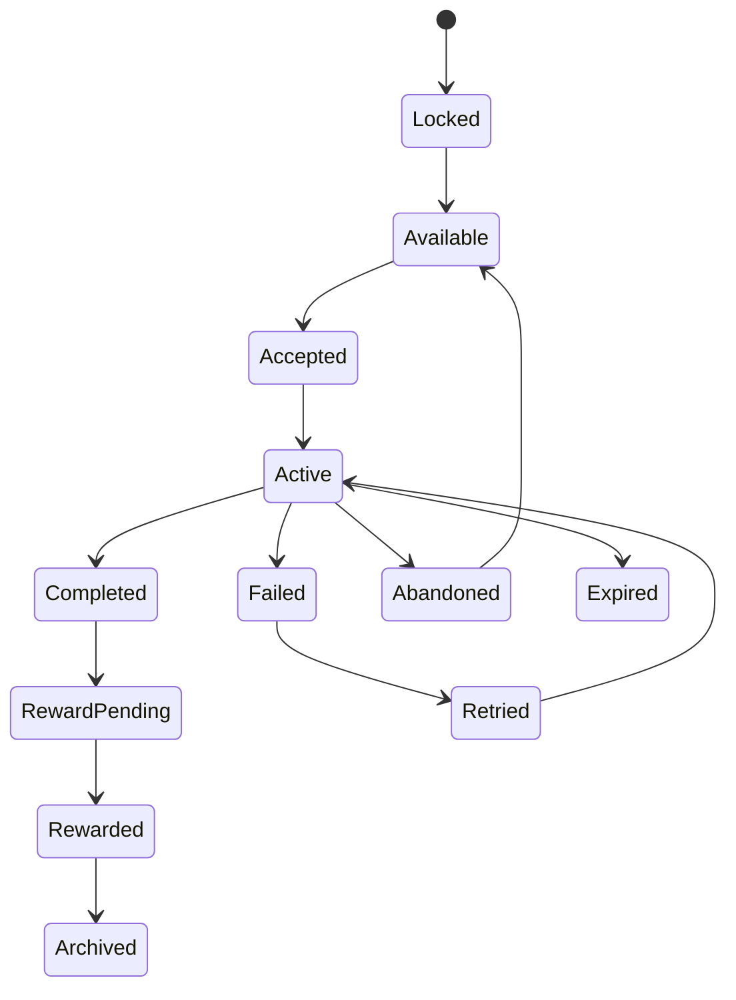

# Objectives and Quests（目标与任务系统）

> Status: V1  
> Category: Content  
> Path: `design/systems/content/objectives-and-quests.md`  
> Owner: TBD  
> Reviewers: Design / Product / Engineering / UX / QA / Data / Live Operations / Research  
> Last Updated: 2026-07-11  
> Version: 1.0  
> Risk Level: High  
> Dependencies: Core Loop, Rules and Resolution, Content and Unlocks, Reward System, Progression System, Save and Persistence, Time, Live Operations  
> Affected Systems: Tutorial and Onboarding, Characters and Loadouts, Difficulty and Challenge, Notification and Reminders, Social and Multiplayer, Analytics and Telemetry

---

## 1. System Summary

Objectives and Quests 系统负责定义：

```text
玩家当前要做什么；
为什么要做；
什么行为会推进目标；
何时视为完成；
失败、放弃、重试和过期如何处理；
多个目标如何组合、排序和分支；
目标如何连接奖励、成长、内容和核心循环。
```

Objective 是可验证的目标条件。

Quest 是由一个或多个 Objective、状态、叙事上下文、奖励和生命周期组成的完整任务结构。

该系统应让玩家始终能够回答：

- 我当前的目标是什么；
- 已经完成了多少；
- 哪些行为会推进；
- 什么不会推进；
- 为什么卡住；
- 失败后还能做什么；
- 完成后获得什么；
- 下一步在哪里。

---

## 2. Purpose

### 2.1 Player Value

该系统帮助玩家：

- 理解当前目标；
- 将长期内容拆解为可执行步骤；
- 感知行为与进度之间的关系；
- 在复杂内容中保持方向；
- 选择适合自己的目标；
- 从失败和中断中恢复；
- 追踪长期承诺；
- 发现下一步内容。

### 2.2 Experience Contribution

目标与任务可以支持：

- 方向；
- 教学；
- 节奏；
- 叙事；
- 探索；
- 选择；
- 成长；
- 社交；
- 长期目标。

但不健康的任务系统会造成：

- 清单化劳动；
- 无意义重复；
- 目标堆积；
- 进度不透明；
- 奖励绑架行为；
- FOMO；
- 社交强迫；
- 任务与核心体验脱节；
- 回归后信息过载。

### 2.3 Product Value

该系统为以下能力提供共同基础：

- 主线；
- 支线；
- 教学；
- 每日与每周目标；
- 成就；
- 活动；
- 新手引导；
- 内容解锁；
- 奖励；
- 回归；
- Live Operations；
- 数据分析。

### 2.4 Why This System Exists

如果每个功能独立记录目标，常见结果是：

```text
同一行为被多个系统重复计算；
任务进度依赖 UI 操作而不是领域事实；
条件顺序和完成时机不一致；
放弃后状态残留；
活动结束后未完成任务无明确处理；
多人共享进度规则冲突；
任务奖励和完成状态不同步。
```

统一系统用于确保：

- 目标状态唯一；
- 进度来源权威；
- 完成判定稳定；
- 任务链路可维护；
- 失败和恢复可预测；
- 奖励发放幂等；
- 回归与迁移可处理。

---

## 3. Non-Goals

该系统不负责：

- 计算完整战斗结果；
- 直接修改资源余额；
- 直接发放奖励；
- 定义所有内容可用性；
- 替代 Tutorial；
- 用任务替代玩家自由探索；
- 将所有行为都变成清单；
- 通过每日任务强迫登录；
- 用大量重复目标制造内容量；
- 自动决定玩家应该做什么；
- 管理完整社交关系；
- 处理支付和权益。

---

## 4. Governing Principles

### 4.1 Player First Design

参考：

- `../../philosophy/foundation/player-first-design.md`

应用原则：

- 目标必须清楚；
- 高频任务减少无意义操作；
- 放弃和恢复路径明确；
- 不通过任务堆积制造焦虑；
- 任务不应惩罚现实生活中断。

### 4.2 Clarity and Feedback

参考：

- `../../philosophy/experience/clarity-and-feedback.md`

应用原则：

- 进度变化必须可见；
- 未推进时说明原因；
- 完成、失败和过期状态清楚；
- 多条件目标要显示当前满足情况。

### 4.3 Choice and Consequence

参考：

- `../../philosophy/experience/choice-and-consequence.md`

应用原则：

- 分支任务应产生真实后果；
- 选择前应预览影响；
- 不应因隐藏条件造成不可逆损失；
- 放弃和重选的成本应合理。

### 4.4 Pacing and Rhythm

参考：

- `../../philosophy/experience/pacing-and-rhythm.md`

应用原则：

- 目标长度与会话匹配；
- 长任务有中间反馈；
- 高压目标后有整理和恢复；
- 日常任务不应占据全部会话。

### 4.5 Progression and Motivation

参考：

- `../../philosophy/long-term/progression-and-motivation.md`

应用原则：

- 任务连接短期行动与长期成长；
- 奖励不是唯一动机；
- 任务应支持理解、掌握和探索；
- 回归玩家有上下文恢复。

### 4.6 Ethical Design

参考：

- `../../philosophy/responsibility/ethical-design.md`

应用原则：

- 不利用连续签到清零和过度限时制造压力；
- 不将核心成长绑定短期任务；
- 不用社交羞辱推动完成；
- 不在疲劳状态推送付费捷径。

---

## 5. Player Experience

### 5.1 Player Goal

玩家使用任务系统通常为了：

- 找到方向；
- 推进内容；
- 学习机制；
- 完成挑战；
- 获得奖励；
- 解锁新内容；
- 追踪长期目标；
- 与他人协作；
- 了解世界和角色。

### 5.2 Entry

任务入口包括：

- 主界面；
- 地图；
- 内容页面；
- NPC 或角色；
- 活动；
- 通知；
- 社交；
- 结算；
- 回归页面；
- 教学；
- 成就页面。

### 5.3 Main Actions

玩家可以：

- 接取；
- 追踪；
- 查看；
- 筛选；
- 推进；
- 选择；
- 放弃；
- 重试；
- 分享；
- 领取；
- 回看；
- 切换目标。

### 5.4 Core Decisions

关键决策包括：

- 当前追踪哪个目标；
- 是否接受任务；
- 是否承担限时或高风险任务；
- 是否选择分支；
- 是否放弃；
- 是否与他人协作；
- 是否延迟领取或继续链路。

### 5.5 Success

健康任务体验意味着：

- 玩家知道目标；
- 行为与进度对应；
- 任务不遮蔽核心体验；
- 目标长度合理；
- 失败可理解；
- 分支结果真实；
- 回归时能恢复上下文；
- 完成后下一步明确。

### 5.6 Failure

失败包括：

- 进度不更新；
- 条件含义不清；
- 目标已完成但未结算；
- 任务链断裂；
- 活动过期；
- 共享进度错误；
- 重复计数；
- 奖励未生成；
- 放弃后无法重新接取；
- 深链进入错误阶段。

---

## 6. System Boundary

### 6.1 Inputs

系统接收：

- Domain Facts；
- Content Availability；
- Player Progression；
- Time；
- Party and Social State；
- Character and Loadout State；
- Difficulty Result；
- Live Operations Configuration；
- Entitlement State；
- Account State；
- Tutorial State。

### 6.2 Outputs

系统产生：

- Objective Definition；
- Quest Definition；
- Quest Instance；
- Progress Update；
- Objective Completion；
- Quest Completion；
- Failure State；
- Branch State；
- Tracking State；
- Reward Eligibility；
- Next Quest Recommendation；
- Quest Event。

### 6.3 Owned State

系统拥有：

- Objective Definition；
- Quest Definition；
- Quest Instance；
- Quest State；
- Objective State；
- Progress Value；
- Branch Selection；
- Tracking State；
- Failure State；
- Abandon State；
- Repeat State；
- Shared Progress State；
- Quest Version；
- Quest History。

### 6.4 Read-Only Dependencies

系统读取：

- Content；
- Progression；
- Characters；
- Difficulty；
- Economy；
- Entitlement；
- Time；
- Social；
- Save；
- Live Operations。

### 6.5 Write Dependencies

系统通过正式契约请求：

- Reward 创建奖励；
- Content 解锁后续内容；
- Save 持久化状态；
- Notification 提醒；
- Analytics 记录；
- Game State 导航到目标内容。

### 6.6 Out of Scope

系统不直接：

- 修改资源余额；
- 应用角色成长；
- 处理支付；
- 决定完整玩法结果；
- 修改权益；
- 控制所有页面导航；
- 直接改变社交关系。

---

## 7. Core Entities and Concepts

| Entity / Concept | Definition | Owner | Lifetime | Notes |
|---|---|---|---|---|
| Objective Definition | 单个可验证目标定义 | Objectives | 版本级 | 唯一 ID |
| Quest Definition | 一组目标和流程定义 | Objectives | 版本级 | 可包含分支 |
| Quest Instance | 某玩家或队伍的具体任务实例 | Objectives | 至结束 | 唯一 ID |
| Objective State | 某目标当前状态 | Objectives | 实例级 | 权威状态 |
| Progress Value | 当前进度 | Objectives | 实例级 | 数值或集合 |
| Domain Fact | 领域系统发布的事实 | Domain Owner | 瞬时 | 用于推进 |
| Branch | 任务分支 | Objectives | 实例级 | 可互斥 |
| Tracking State | 当前是否追踪 | Objectives | 会话或长期 | 不影响权威完成 |
| Shared Progress | 多人共享进度 | Objectives | 任务级 | 需归属规则 |
| Quest History | 任务完成和选择记录 | Objectives | 长期 | 用于迁移与回顾 |
| Reward Eligibility | 完成后奖励资格 | Objectives / Reward | 短期 | 由 Reward 发放 |
| Repeat Policy | 任务是否可重复 | Objectives | 定义级 | 包含周期和上限 |

---

## 8. Objective Taxonomy

### 8.1 Action Objective

执行某个行为。

例如：

- 使用技能；
- 制作物品；
- 进入地区。

### 8.2 Count Objective

累计次数或数量。

### 8.3 State Objective

达到某状态。

例如：

- 资源达到阈值；
- 角色达到等级；
- 队伍包含特定类型。

### 8.4 Completion Objective

完成某内容。

### 8.5 Collection Objective

收集一组对象。

### 8.6 Discovery Objective

发现地点、信息或秘密。

### 8.7 Choice Objective

做出特定选择。

### 8.8 Survival Objective

在条件下持续或生存。

### 8.9 Performance Objective

达到评分、时间、连击或效率要求。

### 8.10 Social Objective

与他人协作、帮助或组队。

### 8.11 Economic Objective

购买、出售、投资或管理资源。

### 8.12 Negative Objective

避免某行为或维持某限制。

例如：

- 不受到伤害；
- 不使用某资源；
- 不触发警报。

---

## 9. Quest Taxonomy

### 9.1 Main Quest

承载主要内容和核心方向。

### 9.2 Side Quest

提供可选故事、角色、探索或机制。

### 9.3 Tutorial Quest

教学与验证理解。

### 9.4 Daily Quest

短周期重复目标。

### 9.5 Weekly Quest

更长周期目标。

### 9.6 Event Quest

限时活动目标。

### 9.7 Challenge Quest

高难、特殊条件或熟练度目标。

### 9.8 Achievement

长期、跨内容目标。

### 9.9 Social Quest

协作或社交目标。

### 9.10 Return Quest

回归恢复和追赶。

### 9.11 Dynamic Quest

根据状态、内容或世界生成。

### 9.12 Narrative Quest

以剧情、角色和选择为主要价值。

---

## 10. Objective Definition Template

```markdown
## Objective Definition

- Objective ID:
- Display Text:
- Category:
- Domain Fact:
- Filter:
- Progress Type:
- Target Value:
- Completion Rule:
- Failure Rule:
- Reset Rule:
- Hidden:
- Shared:
- Retroactive:
- Owner:
- Risk Level:
```

### 10.1 必须回答

- 哪个领域事实会推进；
- 哪些字段参与过滤；
- 何时更新；
- 是否可以回溯；
- 是否共享；
- 是否会重置；
- 何时完成；
- 何时失败。

---

## 11. Quest Definition Template

```markdown
## Quest Definition

- Quest ID:
- Display Name:
- Category:
- Player Purpose:
- Entry Rule:
- Accept Rule:
- Objectives:
- Objective Logic:
- Branches:
- Failure:
- Abandon:
- Repeat:
- Time Window:
- Rewards:
- Next Quest:
- Content Dependencies:
- Version:
- Owner:
- Risk Level:
```

---

## 12. Objective Progress Types

### 12.1 Boolean

完成或未完成。

### 12.2 Counter

累计数量。

### 12.3 Threshold

达到目标值。

### 12.4 Collection Set

收集唯一对象集合。

### 12.5 Sequence

按顺序完成。

### 12.6 Percentage

按比例推进。

### 12.7 Best Value

记录最高分、最快时间或最佳表现。

### 12.8 Current State

要求当前保持某状态。

### 12.9 Duration

持续满足一定时间。

### 12.10 Composite

多个子条件组合。

---

## 13. Domain Facts

任务进度应由领域事实驱动，而不是 UI 事件。

推荐：

```text
EnemyDefeated
ItemCrafted
AreaDiscovered
ResourceSpent
CharacterLeveledUp
MatchCompleted
```

不推荐：

```text
ButtonClicked
ScreenOpened
ProgressBarFilled
```

除非任务本身就是教学 UI 操作。

### 13.1 Fact Ownership

只有领域 Owner 可以发布权威事实。

### 13.2 Fact Payload

应包含：

- Event ID；
- Fact Type；
- Actor；
- Target；
- Amount；
- Tags；
- Context；
- Timestamp；
- Version；
- Correlation ID。

### 13.3 Idempotency

同一 Fact 不应被重复计数。

---

## 14. Filters

Objective 可以按以下维度过滤：

- Content ID；
- Target Type；
- Character；
- Weapon；
- Difficulty；
- Region；
- Mode；
- Party；
- Time；
- Resource；
- Outcome；
- Tags。

### 14.1 Filter Clarity

玩家可见目标应能理解主要过滤条件。

例如：

```text
使用火属性角色完成任意标准难度关卡
```

不能隐藏关键条件。

---

## 15. Progress Update Rules

### 15.1 Incremental Update

每个 Fact 直接增加进度。

### 15.2 Recalculated State

根据当前权威状态重新计算。

### 15.3 Hybrid

事件推进 + 定期校验。

### 15.4 Progress Cap

通常不超过目标值，除非 Best Value 需要保留实际结果。

### 15.5 Decrement

若进度可以下降，必须明确：

- 原因；
- 下限；
- 是否影响已完成状态；
- 是否允许重新完成。

### 15.6 Retroactive Progress

任务创建前的行为是否计入，应明确。

---

## 16. Retroactive Progress

### 16.1 Suitable Cases

适合：

- 长期成就；
- 已拥有内容；
- 已完成里程碑；
- 迁移；
- 回归。

### 16.2 Unsuitable Cases

不适合：

- 教学；
- 限时挑战；
- 需要明确承诺的任务；
- 选择型任务；
- 高风险重复奖励。

### 16.3 Source of Truth

回溯必须基于权威历史或当前状态。

不能仅信任客户端自报。

---

## 17. Objective Logic

多目标组合可以使用：

- All；
- Any；
- N of M；
- Ordered；
- Parallel；
- Optional；
- Mutually Exclusive；
- Weighted。

### 17.1 All

全部完成。

### 17.2 Any

任一完成。

### 17.3 N of M

完成部分。

### 17.4 Ordered

必须按顺序。

### 17.5 Parallel

可并行推进。

### 17.6 Optional

不影响主完成，但可能影响奖励或结果。

### 17.7 Hidden Objective

适用于秘密和探索，不适合核心要求。

---

## 18. Quest State Model

```text
Locked
→ Available
→ Accepted
→ Active
→ Completed
→ Reward Pending
→ Rewarded
→ Archived
```

异常分支：

```text
Active
→ Failed
Active
→ Abandoned
Active
→ Expired
Failed
→ Retried
Abandoned
→ Available
```



---

## 19. State Definitions

### 19.1 Locked

尚不可用。

### 19.2 Available

可接取或自动激活。

### 19.3 Accepted

玩家已承诺，但尚未开始推进。

### 19.4 Active

目标正在推进。

### 19.5 Completed

完成条件已满足。

### 19.6 Reward Pending

奖励资格已生成但未完成发放。

### 19.7 Rewarded

奖励已处理。

### 19.8 Failed

失败条件已满足。

### 19.9 Abandoned

玩家主动放弃。

### 19.10 Expired

时间窗口结束。

### 19.11 Archived

任务保留历史但不再活跃。

---

## 20. State Invariants

1. 同一 Quest Instance 同一时刻只有一个主状态。
2. Completed 不应因普通进度回退重新变成 Active，除非定义明确。
3. Rewarded 不应再次生成奖励。
4. UI 关闭不改变任务状态。
5. Tracking 不等于 Active。
6. 任务进度只能由权威 Domain Fact 或重算更新。
7. Analytics 失败不影响完成。
8. Expired 和 Failed 必须有明确原因。
9. Abandon 不得静默删除不可恢复价值。
10. 版本迁移必须保留完成与分支历史。

---

## 21. Accept and Auto-Start

### 21.1 Manual Accept

适合：

- 需要承诺；
- 有时间限制；
- 有成本；
- 有分支；
- 有失败后果。

### 21.2 Auto-Start

适合：

- 主线连续流程；
- 教学；
- 成就；
- 后台长期目标；
- 无额外负担。

### 21.3 Acceptance Preview

在接取前展示：

- 目标；
- 时间；
- 风险；
- 失败；
- 奖励；
- 是否可放弃；
- 是否共享。

---

## 22. Tracking

### 22.1 Tracking Purpose

帮助玩家在当前体验中看到重点。

### 22.2 Tracking Does Not Change Progress

未追踪任务仍可推进，除非任务设计明确要求激活。

### 22.3 Tracking Limits

追踪数量应受控，避免信息过载。

### 22.4 Auto-Tracking

可以在：

- 新接取；
- 关键主线；
- 临近完成；

时建议，但应允许关闭。

---

## 23. Quest Chains

任务链可以：

- 线性；
- 分支；
- 汇合；
- 循环；
- 条件跳转；
- 并行。

### 23.1 Chain Definition

必须说明：

- Entry；
- Nodes；
- Edges；
- Branch Conditions；
- Failure Route；
- Return Route；
- Completion；
- Archive。

### 23.2 Broken Chain

应检测：

- 无下一节点；
- 循环依赖；
- 不可达节点；
- 已删除内容；
- 分支条件冲突。

---

## 24. Branching Quests

### 24.1 Branch Purpose

用于：

- 叙事选择；
- 角色关系；
- 阵营；
- 内容路线；
- 奖励差异；
- 风险差异。

### 24.2 Choice Preview

应说明：

- 主要方向；
- 是否互斥；
- 是否可撤销；
- 是否影响奖励；
- 是否影响内容。

### 24.3 Hidden Consequence

可以保留叙事惊喜，但不能隐藏：

- 永久核心损失；
- 付费影响；
- 大量资源损失；
- 无法恢复的功能锁定。

### 24.4 Branch Persistence

分支选择必须长期保存并可迁移。

---

## 25. Failure Conditions

失败可以来自：

- 时间；
- 目标死亡；
- 资源耗尽；
- 条件被破坏；
- 选择；
- 多人解散；
- 排名；
- 内容结束。

### 25.1 Failure Clarity

失败条件必须在承诺前可理解。

### 25.2 System Failure

网络、Bug、服务异常不应被当作普通任务失败。

### 25.3 Failure Outcome

失败后可能：

- 重试；
- 进入替代分支；
- 部分保留；
- 重新接取；
- 永久结束；
- 补偿。

---

## 26. Abandon

### 26.1 Abandon Purpose

让玩家：

- 清理任务；
- 改变路线；
- 放弃不适合目标；
- 释放任务槽位。

### 26.2 Abandon Rules

必须说明：

- 进度是否保留；
- 成本是否返还；
- 是否可重新接取；
- 是否影响分支；
- 是否影响队伍；
- 是否影响奖励。

### 26.3 High-Risk Abandon

重大主线、付费或多人任务需要确认。

---

## 27. Retry

### 27.1 Retry Types

- Immediate Retry；
- Restart Objective；
- Restart Quest；
- Resume Checkpoint；
- Alternative Route；
- Assisted Retry。

### 27.2 Retry Cost

不能让正常学习成本过高。

### 27.3 Retry Version

重试时应明确使用：

- 原版本；
- 当前版本；
- 迁移后的版本。

---

## 28. Repeatable Quests

### 28.1 Repeat Policies

- Unlimited；
- Daily；
- Weekly；
- Seasonal；
- Limited Count；
- Cooldown；
- Once per Character；
- Once per Account。

### 28.2 Reset Time

必须使用权威时间并说明：

- 时区；
- 重置点；
- 宽限；
- 跨区行为。

### 28.3 Repeat Rewards

应区分：

- 首次；
- 重复；
- 递减；
- 上限；
- 无奖励。

### 28.4 Avoid Grind

重复任务不应成为核心成长唯一来源。

---

## 29. Daily and Weekly Quests

### 29.1 Purpose

可以帮助：

- 提供短期方向；
- 介绍内容；
- 支持节奏；
- 提供稳定资源。

### 29.2 Risks

- 登录压力；
- 清单劳动；
- 错过焦虑；
- 无关玩法强迫；
- 时间占用。

### 29.3 Healthy Design

- 允许多日累计；
- 提供替代目标；
- 不清零长期核心价值；
- 目标与核心体验相关；
- 奖励不过度集中；
- 不要求全部完成。

---

## 30. Timed Quests

### 30.1 Time Types

- Start Window；
- Completion Window；
- Active Timer；
- Real-Time Expiry；
- Session Timer；
- Grace Period。

### 30.2 Requirements

- 时间清楚；
- 时区清楚；
- 暂停规则清楚；
- 后台规则清楚；
- 到期后处理清楚；
- 提前提醒。

### 30.3 Hidden Timer

不能隐藏影响核心结果的计时。

---

## 31. Event Quests

### 31.1 Lifecycle

必须定义：

- Scheduled；
- Active；
- Grace；
- Expired；
- Returned；
- Archived。

### 31.2 Unfinished State

活动结束时应决定：

- 自动失败；
- 保留；
- 转换；
- 宽限；
- 下次返场继续；
- 补偿。

### 31.3 Core Progression

核心成长不应永久锁定于单次活动任务。

---

## 32. Shared and Group Progress

### 32.1 Shared Types

- Party Shared；
- Contribution；
- Group Completion；
- Individual within Group；
- Community Goal；
- Guild Goal。

### 32.2 Contribution Rules

应明确：

- 谁获得进度；
- 是否需要在场；
- 支援行为是否计入；
- 中途加入；
- 中途离开；
- 队伍规模；
- 角色分工。

### 32.3 Avoid Last-Hit Bias

不要只奖励最后一击或表面输出。

### 32.4 Community Goals

需要防止：

- 搭便车争议；
- 付费主导；
- 作弊；
- 结果不可审计。

---

## 33. Social Quests

社交任务可以鼓励：

- 协作；
- 帮助；
- 新关系；
- 社区参与。

但不应：

- 强迫加好友；
- 强迫公开分享；
- 羞辱单人玩家；
- 将核心成长锁在社交行为后；
- 鼓励垃圾邀请。

---

## 34. Tutorial Objectives

教学目标应：

- 教学意图，而非只教学按键；
- 使用真实领域事实；
- 提供安全练习；
- 允许熟练玩家跳过；
- 不造成高惩罚；
- 设备切换时更新提示。

### 34.1 Tutorial Completion

应验证理解，而不是只验证点击顺序。

---

## 35. Hidden Objectives

适合：

- 秘密；
- 彩蛋；
- 探索；
- 可选挑战。

不适合：

- 核心解锁；
- 付费资格；
- 大量资源；
- 永久路线；
- 失败条件。

### 35.1 Reveal

完成后应解释：

- 触发了什么；
- 为什么；
- 是否可再次完成。

---

## 36. Negative Objectives

例如：

- 不受伤；
- 不被发现；
- 不使用某工具。

### 36.1 Tracking

玩家需要知道：

- 当前是否仍满足；
- 何时失败；
- 是否可恢复；
- 哪个行为导致失败。

### 36.2 Hidden Failure

不应在任务结束后才突然告知早已失败，除非是明确秘密挑战。

---

## 37. Objective Progress Feedback

### 37.1 Immediate

行为推进时确认。

### 37.2 Milestone

达到阶段性进度。

### 37.3 Completion

目标完成。

### 37.4 Blocked

行为未推进时说明关键原因。

### 37.5 Summary

会话或批量汇总。

### 37.6 Avoid Spam

高频计数不应每次都使用强演出。

---

## 38. Quest Presentation

任务页面应至少展示：

- 目标；
- 进度；
- 条件；
- 时间；
- 奖励；
- 状态；
- 位置或入口；
- 分支；
- 失败；
- 放弃；
- 下一步。

### 38.1 Priority

区分：

- Main；
- Tracked；
- Time-Sensitive；
- Near Completion；
- Optional；
- Archived。

### 38.2 Density

限制同时活跃和展示的任务数量。

---

## 39. Quest Log

Quest Log 应支持：

- Active；
- Available；
- Completed；
- Failed；
- Archived；
- Event；
- Main；
- Side；
- Search；
- Filter；
- History。

### 39.1 History

历史记录应保留：

- 关键选择；
- 结局；
- 完成时间；
- 主要奖励；
- 版本；
- 重复次数。

---

## 40. Reward Integration

完成任务后：

```text
Quest Completed
→ Reward Eligibility Created
→ Reward Instance Created
→ Reward Delivered
→ Quest Rewarded
```

### 40.1 Invariants

- 同一 Quest Completion 只创建一次奖励资格；
- Reward Pending 不应阻止任务完成事实；
- Rewarded 前可恢复；
- UI 关闭不影响奖励；
- Analytics 不影响业务结果。

### 40.2 Partial Rewards

多阶段任务可以：

- 每阶段奖励；
- 最终奖励；
- 可选目标奖励。

必须清楚区分。

---

## 41. Content and Unlock Integration

任务可以：

- 解锁内容；
- 引导内容；
- 关闭内容；
- 选择路线；
- 返场内容。

但 Content and Unlocks 仍拥有最终内容状态。

### 41.1 Missing Content

若目标引用内容不可用：

- 暂停；
- 替代；
- 自动完成；
- 迁移；
- 补偿。

不能让任务永久卡死。

---

## 42. Progression Integration

任务可以提供：

- 经验；
- 熟练度；
- 里程碑；
- 解锁资格；
- 追赶。

但不应让：

- 日常任务成为成长唯一来源；
- 任务奖励完全替代核心行为；
- 错过短期任务造成永久成长差距。

---

## 43. Dynamic Quests

动态任务可以根据：

- 玩家状态；
- 内容；
- 地区；
- 角色；
- 资源；
- 世界状态；
- 社交；
- 活动；

生成。

### 43.1 Requirements

- 模板版本；
- Seed；
- 条件；
- 奖励；
- 过期；
- 可解性检查；
- 重复控制；
- 迁移。

### 43.2 Solvability

生成前必须验证任务可完成。

---

## 44. Personalization

任务推荐可以基于：

- 当前目标；
- 明确偏好；
- 已解锁内容；
- 时间预算；
- 难度选择；
- 最近活动。

不应基于敏感属性或脆弱状态推动付费和参与。

### 44.1 Recommendation Is Not Assignment

推荐不应自动接受高成本或限时任务。

---

## 45. Return and Catch-Up Quests

回归任务应：

- 恢复规则理解；
- 检查构筑；
- 引导当前内容；
- 提供目标型追赶；
- 分阶段重新介绍系统；
- 避免一次展示大量任务。

### 45.1 Abuse Protection

不能让故意离开成为最优策略。

---

## 46. Quest Debt

Quest Debt 包括：

- 过多活跃任务；
- 重复模板；
- 无效条件；
- 旧内容引用；
- 断裂链路；
- 隐藏进度；
- 特殊代码；
- 活动任务永久堆积。

### 46.1 Signals

- 任务日志过载；
- 玩家大量忽略任务；
- 大量任务无法完成；
- 每个活动创建新计数逻辑；
- 奖励比目标更重要；
- 回归时任务爆炸。

### 46.2 Reduction

- 合并目标；
- 删除无价值重复；
- 使用领域事实；
- 统一模板；
- 归档旧任务；
- 限制活跃数量；
- 重构任务链；
- 迁移失效内容。

---

## 47. Failure and Recovery

| Failure | Cause | Player Impact | Recovery | Data Guarantee |
|---|---|---|---|---|
| Fact Lost | 事件丢失 | 进度未更新 | 重放或状态重算 | 事实可审计 |
| Duplicate Fact | 重试 | 重复计数 | Event ID 去重 | 只计一次 |
| Quest Chain Broken | 内容删除 | 无法继续 | 替代节点或自动迁移 | 保留历史 |
| Reward Pending | 下游超时 | 奖励未到账 | 幂等恢复 | 完成事实保留 |
| Expiry Misfire | 时间错误 | 提前过期 | 恢复或补偿 | 保留实例 |
| Shared Progress Mismatch | 队伍同步错误 | 成员进度不一致 | 重算与对账 | 贡献记录 |
| Version Conflict | 定义更新 | 状态不兼容 | 迁移或锁定旧版本 | 保留版本 |
| Abandon Failure | 状态未清理 | 无法重接 | 幂等恢复 | 保留旧实例 |
| Dynamic Quest Invalid | 生成不可完成 | 玩家卡死 | 替换或自动取消 | 不损失成本 |

---

## 48. Edge Cases

### Progress

- 一次 Fact 推进多个 Objective；
- 同时完成多个任务；
- 超额进度；
- 当前状态下降；
- 任务创建前已满足；
- 多设备同时更新。

### State

- 完成和过期同时发生；
- 完成和失败同时发生；
- 放弃和奖励 Pending 同时发生；
- 任务链版本切换；
- 已完成任务重新开放。

### Party

- 中途加入；
- 中途离开；
- 队长解散；
- 不同成员拥有不同资格；
- 共享任务转单人；
- 断线重连。

### Time

- 跨日；
- 跨时区；
- 活动结束；
- 服务器时间变化；
- 后台期间到期；
- 宽限期。

### Content

- 目标内容下架；
- 角色被移除；
- 难度被修改；
- 奖励被替换；
- 路线节点删除；
- 深链进入旧任务。

---

## 49. Cross-System Dependencies

| System | Dependency Type | Direction | Data or Event | Failure Impact |
|---|---|---|---|---|
| Rules and Resolution | Hard | Rules → Objectives | Domain Facts | 进度错误 |
| Content and Unlocks | Hard | 双向 | Availability / Unlock | 任务链中断 |
| Reward System | Hard | Objectives → Reward | Completion Eligibility | 奖励延迟 |
| Progression System | Soft / Hard | Progression → Objectives | Milestone / Requirement | 条件失效 |
| Difficulty and Challenge | Soft | Difficulty → Objectives | Completion Context | 高难条件错误 |
| Characters and Loadouts | Soft / Hard | Characters → Objectives | Actor / Build Facts | 过滤错误 |
| Time | Hard for Timed | Time → Objectives | Expiry / Reset | 时间错误 |
| Social and Multiplayer | Hard for Shared | Social → Objectives | Party / Contribution | 共享不一致 |
| Save and Persistence | Hard | Objectives → Save | Quest State | 无法恢复 |
| Live Operations | Hard for Events | Live → Objectives | Event Definition | 活动异常 |
| Notification | Soft | Objectives → Notification | Near Expiry / Completion | 不阻断 |
| Analytics | Soft | Objectives → Analytics | Progress Events | 不阻断 |

---

## 50. Data and Persistence

| State | Persistent | Authority | Save Trigger | Retention | Recovery |
|---|---|---|---|---|---|
| Quest Definition | 是 | Objectives | 配置发布 | 版本期 | Last Known Good |
| Quest Instance | 是 | Objectives | 创建 | 至归档后审计期 | 幂等查询 |
| Quest State | 是 | Objectives | 每次变化 | 长期或实例期 | 历史重建 |
| Objective State | 是 | Objectives | 进度变化 | 实例期 | Fact 重放或重算 |
| Branch Selection | 是 | Objectives | 选择确认 | 长期 | 历史恢复 |
| Tracking State | 是或会话级 | Objectives | 修改时 | 短期或长期 | 默认恢复 |
| Shared Progress | 是 | Objectives | 贡献变化 | 任务期 | 对账 |
| Repeat State | 是 | Objectives | 完成或重置 | 周期期 | 权威时间重算 |
| Quest History | 是 | Objectives | 完成、失败、选择 | 长期 | 审计 |
| Quest Version | 是 | Objectives | 实例创建 | 长期 | 迁移 |

---

## 51. Accessibility

### 51.1 Visual

- 目标、进度、状态和时间有文本；
- 不只依赖颜色；
- 多条件任务逐项展示；
- 失败和完成清楚区分。

### 51.2 Cognitive

- 限制同时追踪数量；
- 使用一致术语；
- 提供下一步；
- 长任务分阶段；
- 回归时提供摘要；
- 隐藏目标只用于可选内容。

### 51.3 Input

- 任务日志支持搜索和筛选；
- 接取、放弃和领取防误触；
- 支持键鼠、手柄和触摸；
- 长列表焦点稳定。

### 51.4 Timing

- 限时任务提前提醒；
- 提供宽限；
- 不要求极短时间内处理；
- 现实时间中断有保护。

### 51.5 Reading

- 目标描述使用明确动词；
- 过滤条件可见；
- 数量、比例和状态格式一致；
- 支持简要与详细说明。

---

## 52. Ethical and Safety Review

### 52.1 Time Pressure

- 不通过过多每日任务强迫登录；
- 核心成长不依赖短周期全部完成；
- 提供累计和替代；
- 不使用连续完成清零惩罚现实生活。

### 52.2 Financial Pressure

- 失败后不优先推荐付费捷径；
- 不隐藏任务成本；
- 付费任务和免费任务明确区分；
- 高风险购买前有确认。

### 52.3 Social Pressure

- 不强迫公开分享；
- 不通过好友骚扰完成任务；
- 单人玩家不失去核心价值；
- 协作贡献公平。

### 52.4 Children and Vulnerable Users

- 限制高压限时；
- 不用角色失望推动完成和消费；
- 提供消费与时间保护；
- 任务推荐不基于脆弱状态。

### 52.5 FOMO

- 核心任务和能力支持返场或替代；
- 活动结束和宽限透明；
- 不使用虚假倒计时；
- 未领取高价值奖励有保护。

---

## 53. Analytics and Validation

### 53.1 Key Assumptions

1. 玩家能理解当前目标和进度。
2. 领域行为能够稳定推进 Objective。
3. 任务长度与会话和节奏匹配。
4. 分支和选择具有真实意义。
5. 失败、放弃和重试规则可理解。
6. 日常和活动任务不会制造过度压力。
7. Shared Progress 公平且可解释。
8. 奖励与任务完成保持一致。
9. 回归玩家能快速恢复任务上下文。
10. 任务数量增长不会导致日志和链路失控。

### 53.2 Validation Plan

| Hypothesis | Evidence | Success | Failure | Method |
|---|---|---|---|---|
| 目标清楚 | 复述 | 能说明当前任务和下一步 | 经常迷失 | 可用性测试 |
| 进度可信 | 行为对比 | 行为后正确更新 | 投诉未计数 | QA / 数据 |
| 长度合理 | 完成时长 | 符合目标会话 | 大量中途放弃 | 行为分析 |
| 分支有意义 | 分支分布 | 多条路线被选择 | 唯一路线 | 数据与访谈 |
| 失败可理解 | 失败复述 | 能说明原因和恢复 | 只感到惩罚 | 研究 |
| 日常健康 | 完成模式 | 自主选择而非强迫 | 高焦虑和清单劳动 | 长期研究 |
| 共享公平 | 队伍反馈 | 各角色贡献被认可 | 最后一击偏差 | 多人测试 |
| 回归有效 | 回归任务 | 能恢复当前链路 | 任务堆积 | Research |
| 长期可维护 | 债务指标 | 断链和无效任务受控 | 例外持续增加 | 架构审计 |

### 53.3 Behavioral Metrics

- Quest Available；
- Quest Accepted；
- Objective Progressed；
- Objective Completed；
- Quest Completed；
- Quest Failed；
- Quest Abandoned；
- Quest Retried；
- Quest Expired；
- Quest Tracked；
- Branch Selected；
- Shared Progress Added；
- Reward Pending。

### 53.4 Outcome Metrics

- Acceptance Rate；
- Completion Rate；
- Time to Complete；
- Abandon Rate；
- Failure Reason Distribution；
- Retry Success；
- Branch Diversity；
- Shared Contribution Fairness；
- Daily Burden；
- Return Recovery；
- Broken Chain Rate；
- Progress Dispute Rate。

### 53.5 Negative Metrics

- 进度未更新；
- 重复计数；
- 任务链断裂；
- 活跃任务过多；
- 大量忽略；
- 限时压力；
- 奖励未发放；
- 共享进度不公平；
- 放弃后无法恢复；
- 隐藏失败条件；
- 日常任务成为成长唯一来源；
- 回归任务爆炸。

### 53.6 Event Intents

| Event Intent | Trigger | Key Properties | Privacy Notes |
|---|---|---|---|
| Quest Became Available | 资格满足 | Quest Type, Source | 匿名 ID |
| Quest Accepted | 接取 | Quest, Entry Source | 不记录敏感文本 |
| Objective Progressed | 进度变化 | Objective Type, Delta | 数据最小化 |
| Quest Completed | 完成 | Quest Type, Duration | 业务用途 |
| Quest Failed | 失败 | Failure Category | 不推断健康状态 |
| Quest Abandoned | 放弃 | Stage, Reason Category | 不用于羞辱或操纵 |
| Branch Selected | 分支选择 | Branch, Context | 不用于敏感画像 |
| Shared Progress Added | 多人贡献 | Contribution Type | 不记录聊天内容 |

---

## 54. Quest Model Template

```markdown
# Quest Model

## Quest

- Name:
- Category:
- Purpose:
- Entry:
- Repeat:
- Time:

## Objectives

| Objective | Fact | Progress | Completion | Failure |
|---|---|---|---|---|

## Logic

- All / Any / Ordered / Branching:
- Hidden:
- Optional:

## State

- Accept:
- Active:
- Complete:
- Fail:
- Abandon:
- Retry:
- Expire:

## Rewards

- Stage:
- Final:
- Optional:
- Recovery:

## Integration

- Content:
- Progression:
- Social:
- Live Operations:

## Validation

- Success:
- Failure:
- Metrics:
```

---

## 55. Rollout and Migration

### 55.1 Rollout

任务系统变更应按：

- 内部；
- 测试环境；
- 小范围；
- 分任务类型；
- 分活动；
- 全量；

逐步发布。

### 55.2 High-Risk Changes

包括：

- 任务链重构；
- Objective 语义变化；
- 共享进度；
- 限时；
- 奖励；
- 旧任务迁移；
- 分支重构；
- 每日重置规则。

### 55.3 Migration

必须定义：

- Quest Instance；
- Objective Progress；
- Branch；
- Repeat；
- Reward Pending；
- Time；
- Shared Progress；
- History；
- Old Content Reference。

### 55.4 Rollback

回滚时：

- 完成事实不撤销；
- 已发放奖励不重复；
- 进行中任务使用原版本或安全映射；
- 保留分支历史；
- Pending 奖励继续恢复；
- 必要时补偿。

### 55.5 Stop Conditions

出现以下情况应停止发布：

- 大量进度不更新；
- 重复计数；
- 任务链断裂；
- 奖励重复或丢失；
- 活动任务提前过期；
- Shared Progress 不一致；
- 旧任务无法迁移；
- 隐藏条件导致大规模失败；
- 回归玩家任务数量异常；
- 每日重置错误。

---

## 56. Risks and Open Questions

| Item | Type | Impact | Probability | Mitigation | Owner |
|---|---|---:|---:|---|---|
| 任务数量持续膨胀 | Complexity Risk | 高 | 高 | 活跃数量和模板审计 | Design |
| 任务替代核心乐趣 | Experience Risk | 高 | 中 | 核心行为对齐 | Design |
| Domain Fact 不稳定 | Integration Risk | 高 | 中 | 权威事件契约 | Engineering |
| Shared Progress 不公平 | Social Risk | 高 | 中 | 贡献模型 | Design |
| 每日任务制造压力 | Ethical Risk | 高 | 高 | 累计、替代、非强制 | Product |
| 分支迁移错误 | Migration Risk | 高 | 中 | 历史和版本 | Engineering |
| Reward Pending 卡死 | Transaction Risk | 严重 | 低 | 幂等和恢复 | Engineering |
| 活动结束任务丢失 | Trust Risk | 高 | 中 | 宽限和返场 | Live Ops |
| 动态任务不可完成 | System Risk | 高 | 低 | 可解性验证 | Engineering |

---

## 57. Review Checklist

### Purpose and Taxonomy

- [ ] Objective 与 Quest 区分清楚；
- [ ] Objective 和 Quest 类型完整；
- [ ] 每项任务有统一定义；
- [ ] 目标支持核心体验；
- [ ] Non-Goals 已定义。

### Facts and Progress

- [ ] 进度由权威 Domain Fact 驱动；
- [ ] Fact 具有 Event ID 和版本；
- [ ] 重复 Fact 不重复计数；
- [ ] Filter 条件可理解；
- [ ] Retroactive Progress 有明确范围。

### Logic and State

- [ ] All、Any、N of M、Ordered、Optional 等逻辑明确；
- [ ] Quest State Model 完整；
- [ ] Completed、Failed、Abandoned、Expired 区分；
- [ ] State Invariants 可测试；
- [ ] Tracking 不影响权威进度。

### Chains and Branches

- [ ] 任务链无断裂和循环；
- [ ] 分支有真实后果；
- [ ] 隐藏后果不涉及重大核心损失；
- [ ] Branch History 可持久化；
- [ ] 版本迁移有映射。

### Time and Repeat

- [ ] Daily、Weekly、Event、Cooldown 规则明确；
- [ ] 权威时间和时区明确；
- [ ] Timed Quest 有提醒和宽限；
- [ ] 重复任务不成为唯一成长来源；
- [ ] 错过不会造成永久核心差距。

### Failure and Recovery

- [ ] 失败条件提前说明；
- [ ] System Failure 不转化为普通失败；
- [ ] Abandon 和 Retry 规则清楚；
- [ ] Reward Pending 可恢复；
- [ ] 动态任务可解性已验证。

### Social and Ethics

- [ ] Shared Progress 贡献公平；
- [ ] 不强迫社交；
- [ ] 不使用过多日常任务制造压力；
- [ ] 不在失败后优先推付费；
- [ ] 儿童和脆弱用户保护完整。

### Validation and Maintenance

- [ ] Completion、Failure、Abandon、Retry、Branch 和 Shared Progress 指标完整；
- [ ] Quest Debt 有治理方式；
- [ ] 回归体验有验证；
- [ ] 迁移、回滚和停止条件明确；
- [ ] Quest History 可审计。

---

## 58. V1 Completion Criteria

Objectives and Quests 可以被视为 V1，当：

- Objective 与 Quest 的职责和边界已经定义；
- Objective、Quest、Progress、Branch、Shared Progress 和 History 实体明确；
- Action、Count、State、Completion、Collection、Discovery、Choice、Performance 等目标类型完整；
- Main、Side、Tutorial、Daily、Weekly、Event、Challenge、Achievement、Social、Return 和 Dynamic Quest 有明确职责；
- Objective Definition 和 Quest Definition 模板完整；
- 进度由权威 Domain Fact 驱动；
- Progress Type、Filter、Retroactive 和 Idempotency 规则明确；
- All、Any、N of M、Ordered、Parallel、Optional 和 Hidden Objective 逻辑明确；
- Quest State Model、State Invariants 和转换规则完整；
- Accept、Auto-Start、Tracking、Chain、Branch、Failure、Abandon、Retry 和 Repeat 规则明确；
- Timed、Event、Shared、Social、Tutorial、Hidden 和 Negative Objective 有专项规则；
- 任务进度反馈、Quest Log、History 和展示优先级完整；
- Reward、Content、Progression、Difficulty、Social 和 Live Operations 的状态边界明确；
- Reward Pending 和跨系统失败支持幂等恢复；
- Daily、Weekly 和 Event Quest 不通过 FOMO、清零和强迫社交伤害玩家；
- Return、Catch-Up 和 Quest Debt 有治理方式；
- 可访问性、伦理、儿童保护和时间压力通过评审；
- Completion、Failure、Abandon、Branch、Shared Progress 和 Return 有验证计划；
- 高风险任务变更具有灰度、迁移、回滚和停止条件；
- 下游 Tutorial、Content、Reward、Social、Live Operations 和 Analytics 系统可以直接引用本文件。

---

## 59. Related Documents

### Philosophy

- [Player First Design](../../philosophy/foundation/player-first-design.md)
- [Clarity and Feedback](../../philosophy/experience/clarity-and-feedback.md)
- [Choice and Consequence](../../philosophy/experience/choice-and-consequence.md)
- [Pacing and Rhythm](../../philosophy/experience/pacing-and-rhythm.md)
- [Progression and Motivation](../../philosophy/long-term/progression-and-motivation.md)
- [Ethical Design](../../philosophy/responsibility/ethical-design.md)

### Systems

- [Systems README](../README.md)
- [System Design Framework](../system-design-framework.md)
- [System Map](../system-map.md)
- [Integration Rules](../integration-rules.md)
- [Core Loop](../core/core-loop.md)
- [Rules and Resolution](../core/rules-and-resolution.md)
- [Content and Unlocks](./content-and-unlocks.md)
- [Reward System](../progression/reward-system.md)
- [Progression System](../progression/progression-system.md)
- [Difficulty and Challenge](../progression/difficulty-and-challenge.md)
- `characters-and-loadouts.md`
- `content-lifecycle.md`
- `../player/tutorial-and-onboarding.md`
- `../social/social-and-multiplayer.md`
- `../operations/live-operations.md`
