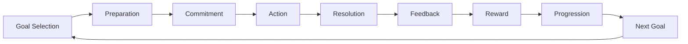
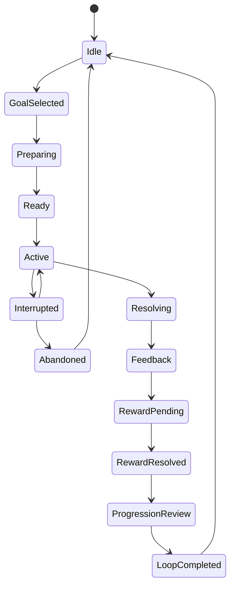
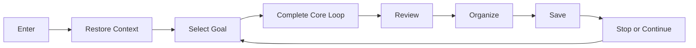

# Core Loop（核心循环系统）

> Status: V1  
> Category: Core  
> Path: `design/systems/core/core-loop.md`  
> Owner: TBD  
> Reviewers: Design / Product / Engineering / UX / Research / Data / QA  
> Last Updated: 2026-07-11  
> Version: 1.0  
> Risk Level: High  
> Dependencies: Game State and Flow, Input and Interaction, Rules and Resolution, Objectives and Quests, Reward System, Progression System, Save and Persistence  
> Affected Systems: Content and Unlocks, Difficulty and Challenge, Characters and Loadouts, Tutorial and Onboarding, Analytics and Telemetry

---

## 1. System Summary

核心循环系统负责组织玩家反复经历的主要体验结构。

它将：

```text
目标
→ 准备
→ 行动
→ 结算
→ 反馈
→ 奖励
→ 成长
→ 新目标
```

连接成一个能够持续重复、产生变化并支持长期体验的闭环。

核心循环系统不拥有所有领域状态。

它主要负责：

- 编排阶段；
- 明确进入条件；
- 协调系统顺序；
- 保持体验连续性；
- 定义循环何时完成；
- 将结果传递给下一轮。

它不直接拥有：

- 具体战斗数值；
- 任务进度；
- 奖励余额；
- 角色成长；
- 内容解锁；
- 存档实现。

这些状态由对应领域系统拥有。

---

## 2. Purpose

### 2.1 Player Value

核心循环帮助玩家：

- 清楚知道当前目标；
- 理解自己正在做什么；
- 通过行动影响结果；
- 获得明确反馈；
- 感知投入转化为成长；
- 自然进入下一目标；
- 在合理节点停止并返回。

### 2.2 Experience Contribution

核心循环负责将项目的核心体验支柱转化为可重复结构。

例如：

```text
如果核心体验是战术准备，
循环必须给予准备和调整空间。

如果核心体验是快速行动，
循环不能被过长管理流程阻断。

如果核心体验是探索未知，
循环需要让新信息持续进入下一轮决策。
```

### 2.3 Product Value

核心循环为以下内容提供共同骨架：

- 新手引导；
- 内容设计；
- 奖励；
- 成长；
- 留存；
- 活动；
- 分析；
- 商业化；
- 版本迭代。

### 2.4 Why This System Exists

如果没有明确核心循环，项目容易出现：

- 功能彼此孤立；
- 奖励与行动脱节；
- 成长没有用途；
- 内容只增加数量；
- 玩家不知道下一步；
- 会话没有自然结束；
- 长期目标无法连接短期体验。

---

## 3. Non-Goals

核心循环系统不负责：

- 定义所有页面导航；
- 拥有具体任务进度；
- 计算战斗或活动结果；
- 直接发放资源；
- 定义所有奖励数值；
- 管理角色等级；
- 决定完整内容排期；
- 替代具体玩法系统；
- 强制所有玩法使用完全相同节奏；
- 通过无限循环延长会话；
- 以留存指标替代核心体验。

---

## 4. Governing Principles

### 4.1 Core Experience and Fantasy

参考：

- `../../philosophy/foundation/core-experience-and-fantasy.md`

应用原则：

- 核心循环必须反复兑现核心体验承诺；
- 每一轮应包含至少一个核心决策或核心行动；
- 不应让外围管理流程取代核心体验；
- 长期成长必须重新进入核心循环。

### 4.2 Player First Design

参考：

- `../../philosophy/foundation/player-first-design.md`

应用原则：

- 循环应尊重玩家时间；
- 玩家应能够理解当前阶段；
- 玩家应能够安全退出和恢复；
- 高频步骤应减少无价值操作；
- 中断不应轻易造成不可恢复损失。

### 4.3 Clarity and Feedback

参考：

- `../../philosophy/experience/clarity-and-feedback.md`

应用原则：

- 每个阶段必须有明确状态；
- 玩家应知道为什么进入下一阶段；
- 结算必须说明关键因果；
- 下一目标必须可理解。

### 4.4 Choice and Consequence

参考：

- `../../philosophy/experience/choice-and-consequence.md`

应用原则：

- 循环中应存在真正影响结果的选择；
- 选择差异应进入反馈或下一轮；
- 不应让奖励完全覆盖行为后果。

### 4.5 Pacing and Rhythm

参考：

- `../../philosophy/experience/pacing-and-rhythm.md`

应用原则：

- 行动、反馈、奖励和恢复应形成节奏；
- 高张力后应有消化和整理空间；
- 会话应有自然停止点。

### 4.6 Progression and Motivation

参考：

- `../../philosophy/long-term/progression-and-motivation.md`

应用原则：

- 成长应扩大能力、理解或选择空间；
- 奖励应将当前结果连接到未来目标；
- 返回应来自价值，而不是错过恐惧。

### 4.7 Accessibility and Inclusivity

参考：

- `../../philosophy/responsibility/accessibility-and-inclusivity.md`

应用原则：

- 核心循环应支持暂停、减速、辅助和中断恢复；
- 关键阶段不能只依赖单一感官表达；
- 非核心输入障碍应可调整。

### 4.8 Ethical Design

参考：

- `../../philosophy/responsibility/ethical-design.md`

应用原则：

- 不以人为阻塞、资源溢出或惩罚离开强迫重复；
- 不通过无限循环隐藏停止点；
- 不利用疲劳状态推动高风险消费。

---

## 5. Player Experience

### 5.1 Player Goal

玩家进入核心循环，是为了：

- 完成一个有意义目标；
- 检验准备与判断；
- 获得结果与反馈；
- 推进成长或内容；
- 解锁下一目标。

### 5.2 Entry

常见入口：

- 主界面；
- 任务；
- 地图；
- 活动；
- 社交邀请；
- 通知；
- 回归恢复；
- 新手引导。

入口必须说明：

- 当前目标；
- 预计投入；
- 主要风险；
- 主要奖励；
- 是否可暂停；
- 是否可退出。

### 5.3 Main Actions

玩家在循环中通常进行：

- 选择目标；
- 准备配置；
- 执行核心行动；
- 根据反馈调整；
- 接受结果；
- 领取或确认奖励；
- 进行成长；
- 选择下一目标。

### 5.4 Core Decisions

循环中的核心决策可能包括：

- 选择哪个目标；
- 使用哪些角色或工具；
- 承担多少风险；
- 何时继续或退出；
- 如何使用有限资源；
- 如何根据结果调整下一轮。

### 5.5 Success

成功不只表示任务完成。

还应包括：

- 玩家理解为什么成功；
- 玩家感知行动产生影响；
- 玩家获得下一步方向；
- 玩家获得合理成长或信息；
- 玩家愿意主动开始下一轮。

### 5.6 Failure

失败应：

- 说明主要原因；
- 保留学习价值；
- 提供重试或调整路径；
- 避免无意义重复；
- 不阻断长期参与。

### 5.7 Exit and Return

玩家应能在以下节点退出：

- 目标选择前；
- 准备完成后；
- 核心活动完成后；
- 结算后；
- 成长整理后。

返回时应恢复：

- 当前目标；
- 最近结果；
- 待处理奖励；
- 推荐下一步；
- 关键状态变化。

---

## 6. System Boundary

### 6.1 Inputs

核心循环接收：

- 玩家选择的目标；
- 当前玩家状态；
- 当前内容可用性；
- 当前队伍或配置；
- 难度参数；
- 活动状态；
- 玩法结果；
- 奖励结果；
- 成长结果；
- 中断与恢复事件。

### 6.2 Outputs

核心循环产生：

- 循环阶段变化；
- 进入玩法请求；
- 结算开始请求；
- 循环完成事件；
- 下一目标请求；
- 会话停止点；
- 分析阶段事件；
- 保存请求。

### 6.3 Owned State

核心循环拥有：

- 当前 Loop Instance；
- 当前 Loop Stage；
- 当前 Loop Goal Reference；
- 当前 Loop Correlation ID；
- 当前 Loop Completion State；
- 当前 Session 中循环次数；
- 当前自然停止点状态。

### 6.4 Read-Only Dependencies

核心循环读取：

- Objectives 的目标状态；
- Game State 的当前模式；
- Characters 的当前配置；
- Difficulty 的当前参数；
- Economy 的资源摘要；
- Progression 的成长摘要；
- Content 的解锁状态；
- Settings 的辅助偏好。

### 6.5 Write Dependencies

核心循环通过正式命令请求：

- Game State 进入玩法模式；
- Objectives 启动或完成目标；
- Reward 生成结算；
- Save 保存阶段；
- Analytics 记录阶段暴露。

### 6.6 Out of Scope

核心循环不直接：

- 修改资源余额；
- 修改角色等级；
- 写入权益；
- 计算奖励；
- 修改任务进度；
- 处理支付；
- 发布运营配置。

---

## 7. Entities and Concepts

| Entity / Concept | Definition | Owner | Lifetime | Notes |
|---|---|---|---|---|
| Loop Definition | 某类循环的阶段与规则定义 | Core Loop | 版本级 | 可由内容配置引用 |
| Loop Instance | 玩家一次具体循环实例 | Core Loop | 一次循环 | 具有唯一 ID |
| Loop Stage | 当前循环阶段 | Core Loop | 循环内 | 必须可恢复 |
| Goal Reference | 当前目标引用 | Objectives | 循环内 | Core Loop 只读 |
| Activity Instance | 当前核心活动实例 | Primary Activity | 活动内 | 可能是战斗、建造等 |
| Resolution Result | 活动结算结果 | Rules and Resolution | 循环内 | Core Loop 只读 |
| Reward Instance | 可领取或已发放奖励实例 | Reward | 跨阶段 | 具有幂等身份 |
| Growth Result | 成长变化摘要 | Progression | 循环后 | 用于下一目标 |
| Stop Point | 自然停止点 | Core Loop | 会话内 | 可安全退出 |
| Session Loop Count | 当前会话完成循环数 | Core Loop | 会话内 | 用于节奏分析 |

---

## 8. Core Loop Model

通用模型：

```text
Goal Selection
→ Preparation
→ Commitment
→ Action
→ Resolution
→ Feedback
→ Reward
→ Progression
→ Next Goal
```



### 8.1 Goal Selection

玩家理解：

- 可以做什么；
- 为什么做；
- 预计投入；
- 风险；
- 奖励；
- 是否适合当前状态。

### 8.2 Preparation

玩家调整：

- 角色；
- 装备；
- 技能；
- 资源；
- 难度；
- 辅助；
- 队伍。

准备应支持核心判断，不应变成无限管理。

### 8.3 Commitment

系统确认：

- 条件满足；
- 成本明确；
- 风险明确；
- 高影响选择已确认；
- 活动实例创建。

### 8.4 Action

玩家执行核心行为。

该阶段应最大程度体现项目核心体验。

### 8.5 Resolution

系统计算：

- 成功；
- 失败；
- 评分；
- 资源变化；
- 目标变化；
- 后续状态。

### 8.6 Feedback

玩家理解：

- 发生了什么；
- 为什么发生；
- 自己的行为有什么影响；
- 可以如何改进。

### 8.7 Reward

系统提供：

- 价值；
- 认可；
- 资源；
- 内容；
- 表达；
- 信息。

### 8.8 Progression

玩家将奖励转化为：

- 能力；
- 选择；
- 理解；
- 身份；
- 内容访问。

### 8.9 Next Goal

系统提供：

- 新目标；
- 推荐；
- 分支；
- 自由选择；
- 自然停止点。

---

## 9. Loop Variants

不是所有循环都需要完整九阶段。

### 9.1 Short Loop

```text
Action
→ Feedback
→ Immediate Adjustment
```

适用于：

- 单次攻击；
- 放置；
- 编辑；
- 移动；
- 小型交互。

### 9.2 Encounter Loop

```text
Prepare
→ Act
→ Resolve
→ Recover
```

适用于：

- 战斗；
- 关卡；
- 谜题；
- 经营周期。

### 9.3 Session Loop

```text
Enter
→ Restore
→ Select Goal
→ Complete Loops
→ Review
→ Save
→ Stop
```

### 9.4 Long-Term Loop

```text
Learn
→ Master
→ Expand
→ Face New Challenge
→ Form Identity
→ Return
```

### 9.5 Event Loop

```text
Event Entry
→ Limited Objectives
→ Event Currency
→ Event Reward
→ Event Closure
```

Event Loop 不应破坏主循环，也不应创造无法恢复的核心断层。

---

## 10. State Model



### 10.1 Idle

没有活跃循环。

### 10.2 GoalSelected

目标已选择，但尚未准备。

### 10.3 Preparing

玩家正在配置和理解条件。

### 10.4 Ready

前置条件满足，可以进入核心行动。

### 10.5 Active

核心玩法正在进行。

### 10.6 Interrupted

因暂停、断线、后台或外部中断暂时停止。

### 10.7 Resolving

结果正在计算或确认。

### 10.8 Feedback

结果正在呈现。

### 10.9 RewardPending

奖励已经生成，但尚未完成发放或领取。

### 10.10 RewardResolved

奖励已安全处理。

### 10.11 ProgressionReview

成长、解锁和新能力正在整理。

### 10.12 LoopCompleted

本轮完成，允许进入下一轮或停止。

### 10.13 Abandoned

玩家主动退出，或系统无法安全恢复。

---

## 11. State Transitions

| From | To | Trigger | Conditions | Outputs | Failure | Reversible |
|---|---|---|---|---|---|---|
| Idle | GoalSelected | SelectGoal | 目标可用 | 创建 Loop Instance | 保持 Idle | 是 |
| GoalSelected | Preparing | OpenPreparation | 目标有效 | 加载准备状态 | 返回目标选择 | 是 |
| Preparing | Ready | ConfirmPreparation | 条件满足 | 生成准备摘要 | 显示缺失条件 | 是 |
| Ready | Active | StartActivity | 活动可创建 | 创建 Activity Instance | 返回 Ready | 是 |
| Active | Interrupted | Pause / Disconnect | 支持中断 | 保存中断点 | 降级或 Abandoned | 是 |
| Interrupted | Active | Resume | 状态可恢复 | 恢复 Activity | 转为 Abandoned | 是 |
| Active | Resolving | ActivityEnded | 活动结束 | 提交结算 | Pending | 否 |
| Resolving | Feedback | ResolutionConfirmed | 结果权威 | 生成反馈摘要 | 重试或人工修复 | 否 |
| Feedback | RewardPending | Continue | 奖励条件成立 | 创建 Reward Instance | 记录无奖励原因 | 否 |
| RewardPending | RewardResolved | Claim / AutoGrant | 发放成功 | 奖励事件 | 保持 Pending | 否 |
| RewardResolved | ProgressionReview | Continue | 成长数据可用 | 生成成长摘要 | 跳过并记录 | 是 |
| ProgressionReview | LoopCompleted | Confirm | 处理完成 | 循环完成事件 | 保持当前 | 是 |
| LoopCompleted | Idle | Next / Exit | 已保存 | 清理 Loop Instance | 延迟清理 | 是 |
| Active | Abandoned | Exit / FatalFailure | 无法继续 | 中止事件 | 保留恢复记录 | 否 |

---

## 12. Invariants

1. 同一 Loop Instance 同一时间只能处于一个主阶段。
2. 只有目标有效时才能进入 Preparation。
3. 只有准备条件满足时才能进入 Active。
4. 同一 Activity Result 只能被结算一次。
5. 同一 Reward Instance 只能被成功处理一次。
6. LoopCompleted 前，高风险状态必须已经持久化或可恢复。
7. Analytics 失败不能改变业务结果。
8. UI 不拥有 Loop Stage。
9. Core Loop 不直接修改 Economy、Progression 或 Entitlement 状态。
10. Abandoned 不等于数据删除，必要恢复信息必须保留。

---

## 13. Core Rules

### 13.1 每轮必须有明确目标

目标可以是：

- 外部指定；
- 玩家自选；
- 系统推荐；
- 探索发现；
- 社交共同目标。

但不能让玩家在核心循环中长期不知道为什么行动。

### 13.2 每轮至少包含一个核心价值行为

例如：

- 决策；
- 执行；
-创造；
-探索；
-组合；
-表达。

### 13.3 结果必须可归因

玩家至少应理解：

- 主要成功原因；
- 主要失败原因；
- 关键选择影响。

### 13.4 奖励必须连接下一步

奖励应至少支持一种价值：

- 当前认可；
- 下一轮准备；
- 长期成长；
- 内容解锁；
- 表达；
- 学习。

### 13.5 成长必须重新进入循环

如果成长不能影响：

- 下一轮能力；
- 选择空间；
- 目标；
- 内容；
- 身份；

则成长与核心循环脱节。

### 13.6 循环必须有停止点

至少在一轮完整结束后，玩家应能安全退出。

### 13.7 不应强制无尽连锁

系统可以推荐下一轮，但不应：

- 隐藏退出；
- 自动消耗高价值资源；
- 用倒计时阻止思考；
- 让退出造成不合理损失。

---

## 14. Preparation Rules

准备阶段应帮助玩家：

- 理解目标；
- 比较方案；
- 发现风险；
- 调整配置；
- 决定是否进入。

### 14.1 准备成本

准备时间应与：

- 决策价值；
- 风险；
- 内容复杂度；
- 玩家熟练度；

匹配。

### 14.2 快速准备

熟练玩家应支持：

- 预设；
- 最近配置；
- 推荐；
- 批量；
- 跳过已掌握步骤。

### 14.3 不替代玩家判断

推荐可以解释，但不应默认将唯一最优方案直接替玩家完成所有核心选择。

---

## 15. Commitment Rules

进入高成本或不可逆活动前，应明确：

- 消耗；
- 预计时长；
- 中断规则；
- 失败影响；
- 奖励范围；
- 是否可撤销。

低风险活动不应过度确认。

高风险活动应使用：

- 预览；
- 明确确认；
- 防误触；
- 可恢复设计。

---

## 16. Resolution Rules

### 16.1 权威结算

结果必须来自 Rules and Resolution 或对应领域系统。

### 16.2 结算顺序

推荐：

```text
1. 确认活动结束
2. 冻结输入
3. 计算结果
4. 更新目标状态
5. 创建奖励资格
6. 保存权威结果
7. 展示反馈
8. 处理奖励
9. 更新成长
10. 完成循环
```

### 16.3 Pending

外部依赖未完成时，应进入 Pending，而不是重复创建结果。

### 16.4 部分结果

如果系统支持阶段性结果，应明确：

- 已确认部分；
- 未确认部分；
- 是否可继续；
- 是否可退出；
- 如何恢复。

---

## 17. Feedback Rules

反馈分为：

### 17.1 Immediate Feedback

确认当前输入。

### 17.2 Progress Feedback

说明目标推进。

### 17.3 Outcome Feedback

说明最终结果。

### 17.4 Causal Feedback

说明关键原因。

### 17.5 Learning Feedback

说明可以如何调整。

### 17.6 Future Feedback

说明下一轮发生了什么变化。

反馈不应只展示：

```text
成功 / 失败
```

而缺少原因与下一步。

---

## 18. Reward Integration

核心循环不计算奖励，但负责保证奖励进入正确时机。

### 18.1 奖励触发

奖励可以在：

- 行动中即时产生；
- 结算后生成；
- 目标完成后生成；
- 循环完成后发放；
- 长期里程碑后发放。

### 18.2 奖励时机

应考虑：

- 是否打断核心行动；
- 是否需要汇总；
- 是否存在高价值奖励；
- 是否需要选择；
- 是否需要空间管理。

### 18.3 自动发放与手动领取

自动发放适合：

- 高频；
- 低风险；
- 无选择；
- 不会溢出。

手动领取适合：

- 需要选择；
- 需要确认；
- 需要展示里程碑；
- 存在容量或过期。

不应仅为了增加点击而要求手动领取。

### 18.4 奖励失败

奖励失败时：

- Loop Result 不能丢失；
- Reward Instance 保持 Pending；
- 支持幂等恢复；
- 玩家能看到当前状态。

---

## 19. Progression Integration

成长阶段应回答：

- 哪些能力变化；
- 哪些选项开放；
- 哪些内容解锁；
- 下一轮有什么不同；
- 是否需要玩家立即处理。

### 19.1 强制成长操作

不应每轮强迫玩家进入复杂成长管理。

可以：

- 延迟；
- 汇总；
- 自动应用低风险成长；
- 在自然停止点处理。

### 19.2 成长提示

只突出：

- 影响下一轮的重要变化；
- 新能力；
- 新选择；
- 关键里程碑。

---

## 20. Next Goal Integration

下一目标可以来自：

- 内容路线；
- 任务链；
- 玩家自由选择；
- 社交；
- 回归推荐；
- 难度提升；
- 新解锁。

### 20.1 推荐原则

推荐应解释：

- 为什么适合；
- 预计时长；
- 风险；
- 主要价值。

### 20.2 不强制

推荐不应：

- 自动开始高成本活动；
- 隐藏其他选择；
- 使用虚假紧迫；
- 惩罚玩家停止。

---

## 21. Session Loop



### 21.1 Enter

包括：

- 启动；
- 登录；
- 回归；
- 通知进入；
- 深链进入。

### 21.2 Restore Context

恢复：

- 上次目标；
- 待处理结果；
- 变化；
- 当前资源；
- 推荐下一步。

### 21.3 Review and Organize

提供：

- 奖励汇总；
- 成长；
- 配置；
- 任务；
- 内容。

### 21.4 Save

在自然停止点确保：

- 状态持久化；
- Pending 可恢复；
- 玩家知道是否保存成功。

### 21.5 Stop or Continue

玩家清楚知道：

- 可以结束；
- 下一轮是什么；
- 退出不会造成什么损失。

---

## 22. Long-Term Loop

```text
Learn
→ Practice
→ Master
→ Expand Choice
→ Face New Challenge
→ Express Identity
→ Set New Goal
```

### 22.1 Learn

理解规则和基础反馈。

### 22.2 Practice

重复核心行为并形成技能。

### 22.3 Master

降低基础执行负担，关注更高层判断。

### 22.4 Expand Choice

开放新工具、组合和路线。

### 22.5 New Challenge

要求重新使用已掌握能力。

### 22.6 Express Identity

通过构筑、风格、角色或目标形成个人表达。

### 22.7 New Goal

建立长期追求。

长期循环不能只依赖：

- 数值变大；
- 奖励变多；
- 任务变长。

---

## 23. Failure and Recovery

| Failure | Cause | Player Impact | Recovery | Data Guarantee |
|---|---|---|---|---|
| Goal Invalid | 内容过期或条件变化 | 无法开始 | 返回目标选择 | 不创建实例 |
| Preparation Invalid | 条件不足 | 无法进入 | 显示缺失条件 | 保持配置 |
| Activity Disconnect | 网络中断 | 暂停或失败风险 | 恢复或安全退出 | 保存中断点 |
| Resolution Timeout | 结算服务超时 | 结果 Pending | 幂等查询或重试 | 不重复结算 |
| Reward Failure | 发放失败 | 奖励未到账 | 保持 Reward Pending | 结果不丢失 |
| Progression Failure | 成长更新失败 | 下一轮状态延迟 | 延迟同步 | 保留原结果 |
| Save Failure | 持久化失败 | 无法安全退出 | 重试、缓存、提示 | 不显示完全完成 |
| Version Conflict | 客户端或数据版本冲突 | 无法继续 | 迁移或升级 | 保留备份 |

---

## 24. Edge Cases

### 24.1 Input

- 重复点击开始；
- 结算时快速退出；
- 多次领取；
- 连续跳过；
- 切换输入设备；
- 焦点丢失。

### 24.2 Time

- 活动在循环中结束；
- 跨日结算；
- 倒计时结束时断线；
- 时区变化；
- 设备时间错误。

### 24.3 Network

- 进入活动前断线；
- 活动中断线；
- 结算后断线；
- 奖励发放时断线；
- Save 超时；
- 响应乱序。

### 24.4 Data

- 目标已删除；
- 奖励配置缺失；
- 资源容量不足；
- 成长达到上限；
- 存档版本过旧；
- Loop Instance 重复。

### 24.5 Content

- 内容下架；
- 难度不存在；
- 奖励过期；
- 解锁链断裂；
- 下一目标为空。

### 24.6 Player

- 首次玩家；
- 熟练玩家；
- 回归玩家；
- 单手操作；
- 无声；
- 大字体；
- 低性能；
- 短会话。

---

## 25. Cross-System Dependencies

| System | Dependency Type | Direction | Data or Event | Failure Impact |
|---|---|---|---|---|
| Game State and Flow | Hard | 双向协调 | Mode State | 无法进入或退出 |
| Input and Interaction | Hard | Input → Loop | Player Intent | 无法操作 |
| Rules and Resolution | Hard | Loop → Rules | Activity Result | 无法结算 |
| Objectives and Quests | Hard | 双向 | Goal State | 无目标或无进度 |
| Reward System | Hard | Loop → Reward | Reward Instance | 循环无法完整结束 |
| Progression System | Soft / Hard | Reward → Progression | Growth Result | 下一轮状态延迟 |
| Save and Persistence | Hard | Loop → Save | Loop State | 无法安全恢复 |
| Content and Unlocks | Soft | Content → Loop | Available Goals | 可用目标减少 |
| Difficulty | Soft | Difficulty → Loop | Challenge Parameters | 使用默认值 |
| Analytics | Soft | Loop → Analytics | Stage Events | 不阻断 |
| Tutorial | Soft | Tutorial → Loop | Guidance State | 缺少引导 |
| Settings | Soft | Settings → Loop | Assist Preferences | 使用最后有效配置 |

---

## 26. Data and Persistence

| State | Persistent | Authority | Save Trigger | Retention | Recovery |
|---|---|---|---|---|---|
| Loop Instance ID | 是 | Core Loop | 创建时 | 至循环完成后审计期 | 重新加载 |
| Loop Stage | 是 | Core Loop | 阶段变化 | 当前活跃实例 | 恢复阶段 |
| Goal Reference | 是 | Objectives | 选择目标 | 当前实例 | 重新验证 |
| Activity Reference | 是 | Primary Activity | 创建活动 | 当前实例 | 查询活动 |
| Resolution Reference | 是 | Rules | 结果确认 | 审计期 | 幂等查询 |
| Reward Reference | 是 | Reward | 创建奖励 | 长期 | 恢复领取 |
| Stop Point | 可选 | Core Loop | 循环完成 | 当前会话 | 恢复上下文 |
| Session Loop Count | 否或会话级 | Core Loop | 循环完成 | 会话 | 可重算 |

### 26.1 Save Trigger

至少在以下时刻保存：

- Loop Instance 创建；
- 进入 Active；
- Activity 结束；
- Resolution 确认；
- Reward 创建；
- Reward 完成；
- LoopCompleted；
- 中断；
- 退出。

### 26.2 恢复优先级

```text
权威结果
→ Pending 事务
→ 当前阶段
→ 玩家可见上下文
```

---

## 27. Accessibility

### 27.1 Visual

- 每个阶段有文本或图标状态；
- 不只依赖颜色；
- 重要结果支持放大和高对比；
- 进度与停止点清晰。

### 27.2 Audio

- 关键阶段不只依赖声音；
- 重要提示有字幕或视觉替代；
- 结果音效不替代结果说明。

### 27.3 Input

- 核心操作可重绑；
- 支持按住与切换替代；
- 高频重复可自动化；
- 结算和奖励不依赖精确输入。

### 27.4 Cognitive

- 同时目标数量受控；
- 阶段命名一致；
- 可回看结果；
- 下一步明确；
- 回归时提供上下文。

### 27.5 Timing

- 单人循环尽量支持暂停；
- 长活动提供阶段保存；
- 时间窗口可根据辅助设置调整；
- 会话有自然停止点。

### 27.6 Assist Options

- 难度；
- 速度；
- 预警；
- 自动化；
- 输入容错；
- 失败惩罚；
- 信息增强。

---

## 28. Ethical and Safety Review

### 28.1 Player Time

- 不隐藏循环长度；
- 不用低上限强迫频繁进入；
- 不让退出造成无意义损失；
- 长内容提供中断点。

### 28.2 Financial Risk

核心循环不能在玩家疲劳、失败或结算脆弱时刻强制高压付费。

### 28.3 Randomness

随机结果必须：

- 符合公平原则；
- 可理解；
- 高影响时有保护；
- 付费概率透明。

### 28.4 FOMO and Pressure

下一目标和活动推荐不应依赖：

- 虚假倒计时；
- 永久核心损失；
- 社交羞辱；
- 连续签到清零。

### 28.5 Privacy

循环分析只收集支持明确设计判断的数据。

### 28.6 Children and Vulnerable Users

- 不使用角色失望或群体压力推动付费；
- 不在连续失败后立即推高风险消费；
- 提供消费和时间保护。

### 28.7 Cancellation and Recovery

玩家可以：

- 停止；
- 暂停；
- 返回；
- 恢复 Pending；
- 查看未处理结果。

---

## 29. Analytics and Validation

### 29.1 Key Assumptions

1. 玩家能够理解当前循环目标。
2. 准备阶段提供有价值判断，而不是管理负担。
3. 核心行动体现项目主要体验。
4. 结算帮助玩家理解因果。
5. 奖励和成长能够推动下一轮。
6. 玩家可以在自然停止点安全退出。
7. 长期重复不会快速失去变化和意义。

### 29.2 Validation Plan

| Hypothesis | Evidence | Success | Failure | Method |
|---|---|---|---|---|
| 玩家理解目标 | 复述与行为 | 大多数玩家能准确说明目标 | 频繁无目的进入 | 可用性测试 |
| 准备有价值 | 配置变化与访谈 | 调整与结果相关 | 大量无意义管理 | 观察与数据 |
| 结算可理解 | 失败原因复述 | 玩家能说明主要原因 | 只归因运气或数值 | 回顾访谈 |
| 奖励连接下一轮 | 下一目标行为 | 奖励影响准备或选择 | 奖励只被动累积 | 长期测试 |
| 停止点有效 | 退出分布 | 退出集中在完整节点 | 大量中途强退 | 会话数据 |
| 循环可持续 | 长期行为 | 选择和情境持续变化 | 很快固定唯一流程 | 长期测试 |

### 29.3 Behavioral Metrics

- 目标选择率；
- 准备阶段耗时；
- 准备变更率；
- 开始率；
- 完成率；
- 失败率；
- 中断率；
- 重试率；
- 奖励处理率；
- 下一轮进入率；
- 自然停止点退出率。

### 29.4 Outcome Metrics

- 目标理解；
- 核心决策质量；
- 失败原因理解；
- 成长使用率；
- 新目标发现；
- 回归理解；
- 长期选择多样性。

### 29.5 Negative Metrics

- 无意义重复；
- 准备疲劳；
- 结算跳过；
- 奖励 Pending 长期未恢复；
- 中途强制退出；
- 资源溢出压力；
- 失败后高压付费；
- 循环无法安全停止；
- 存档丢失；
- 唯一最优路线固化。

### 29.6 Event Intents

| Event Intent | Trigger | Key Properties | Privacy Notes |
|---|---|---|---|
| Loop Created | 目标确认 | Loop Type, Goal Type | 不记录不必要个人信息 |
| Stage Entered | 阶段变化 | Stage, Duration | 使用匿名 ID |
| Activity Started | 进入核心行动 | Difficulty, Loadout Summary | 避免完整敏感配置 |
| Activity Resolved | 结果确认 | Outcome, Main Cause | 不记录聊天内容 |
| Reward Resolved | 奖励处理 | Reward Category | 不记录支付信息 |
| Loop Completed | 一轮完成 | Duration, Attempts | 支持分群 |
| Stop Point Used | 玩家退出 | Stop Point Type | 不推断健康状况 |
| Loop Abandoned | 中止 | Stage, Reason | 避免过度追踪 |

---

## 30. Rollout and Migration

### 30.1 Rollout

- 内部测试；
- 小规模玩家；
- 分玩法；
- 分平台；
- 全量。

### 30.2 Feature Flag

可用于：

- 新循环结构；
- 新结算；
- 新停止点；
- 新推荐逻辑。

不能让不同 Flag 组合破坏状态恢复。

### 30.3 Migration

旧循环实例需要定义：

- 是否继续旧规则；
- 是否迁移到新阶段；
- Pending 奖励如何处理；
- 旧目标如何映射；
- 旧存档如何恢复。

### 30.4 Rollback

回滚时：

- 已确认结果不撤销；
- Pending 事务继续恢复；
- 新阶段映射到旧阶段；
- 保留审计；
- 必要时补偿。

### 30.5 Stop Conditions

出现以下情况应停止发布：

- 循环无法完成；
- 奖励重复或丢失；
- 大量 Loop Instance 卡死；
- 存档恢复失败；
- 结算与展示不一致；
- 玩家无法理解目标；
- 中断后无法恢复；
- 高风险消费压力异常上升。

---

## 31. Risks and Open Questions

| Item | Type | Impact | Probability | Mitigation | Owner |
|---|---|---:|---:|---|---|
| 准备阶段过长 | Long-Term Risk | 高 | 中 | 预设、推荐、熟练度分层 | Design |
| 奖励流程阻塞循环 | Dependency Risk | 高 | 中 | Pending、幂等、异步恢复 | Engineering |
| 唯一最优路线 | Design Risk | 高 | 中 | 情境变化、平衡审计 | Design |
| 中断恢复不完整 | Technical Risk | 高 | 中 | 阶段保存、恢复测试 | Engineering |
| 下一目标过度引导 | Ethical Risk | 中 | 中 | 保留选择、解释推荐 | Product |
| 分析指标替代体验 | Validation Risk | 中 | 中 | 定性与定量结合 | Research |
| 活动循环破坏主循环 | System Risk | 高 | 中 | 活动边界和返场规则 | Live Ops |

---

## 32. Review Checklist

### Purpose and Scope

- [ ] 核心循环支持核心体验；
- [ ] 循环目的清楚；
- [ ] Non-Goals 已定义；
- [ ] 不直接拥有其他领域状态。

### Loop Structure

- [ ] 目标、准备、行动、结算、反馈、奖励、成长和下一目标完整；
- [ ] 短循环、会话循环和长期循环关系清楚；
- [ ] 每阶段有明确价值；
- [ ] 没有无意义强制步骤。

### State and Rules

- [ ] Loop Instance 与 Stage 定义完整；
- [ ] 转换条件可测试；
- [ ] 同一结果只结算一次；
- [ ] Reward 和 Save 支持恢复；
- [ ] Abandoned 行为明确。

### Player Experience

- [ ] 玩家知道当前目标；
- [ ] 准备阶段有价值；
- [ ] 结果可归因；
- [ ] 失败可学习；
- [ ] 奖励连接下一轮；
- [ ] 有自然停止点。

### Dependencies

- [ ] Game State、Objectives、Reward、Progression、Save 关系明确；
- [ ] 状态所有权唯一；
- [ ] Analytics 不阻断；
- [ ] Pending 状态可恢复；
- [ ] 没有循环写依赖。

### Responsibility

- [ ] 支持暂停和中断；
- [ ] 关键阶段多通道表达；
- [ ] 不强迫无限循环；
- [ ] 不用 FOMO 或资源浪费惩罚退出；
- [ ] 疲劳状态下不推高风险消费。

### Validation

- [ ] 关键假设明确；
- [ ] 成功与失败标准明确；
- [ ] 自然停止点有验证；
- [ ] 长期重复价值有验证；
- [ ] 负面指标已定义。

---

## 33. V1 Completion Criteria

Core Loop 可以被视为 V1，当：

- 核心循环阶段已经定义；
- 核心循环与核心体验直接关联；
- 短循环、会话循环和长期循环关系明确；
- Loop Instance、Loop Stage 和 Stop Point 有状态模型；
- 所有关键状态转换可测试；
- 目标、准备、行动、结算、反馈、奖励、成长和下一目标职责清楚；
- Objectives、Reward、Progression、Save 等状态所有权不被绕过；
- 结果与奖励支持幂等和 Pending 恢复；
- 中断、断线、退出和回归路径完整；
- 玩家可以理解成功、失败和下一步；
- 一轮完整结束后存在自然停止点；
- 可访问性和辅助设置可以作用于循环；
- 不通过强制连续、资源溢出或 FOMO 惩罚退出；
- 关键假设、指标和负面指标已经定义；
- 新旧循环实例具有迁移和回滚方案；
- 下游玩法、任务、奖励和成长系统可以引用本循环。

---

## 34. Related Documents

### Philosophy

- [Core Experience and Fantasy](../../philosophy/foundation/core-experience-and-fantasy.md)
- [Player First Design](../../philosophy/foundation/player-first-design.md)
- [Clarity and Feedback](../../philosophy/experience/clarity-and-feedback.md)
- [Choice and Consequence](../../philosophy/experience/choice-and-consequence.md)
- [Pacing and Rhythm](../../philosophy/experience/pacing-and-rhythm.md)
- [Progression and Motivation](../../philosophy/long-term/progression-and-motivation.md)
- [Accessibility and Inclusivity](../../philosophy/responsibility/accessibility-and-inclusivity.md)
- [Ethical Design](../../philosophy/responsibility/ethical-design.md)

### Systems

- [Systems README](../README.md)
- [System Design Framework](../system-design-framework.md)
- [System Map](../system-map.md)
- [Integration Rules](../integration-rules.md)
- `game-state-and-flow.md`
- `input-and-interaction.md`
- `rules-and-resolution.md`
- `../progression/reward-system.md`
- `../progression/progression-system.md`
- `../player/save-and-persistence.md`
