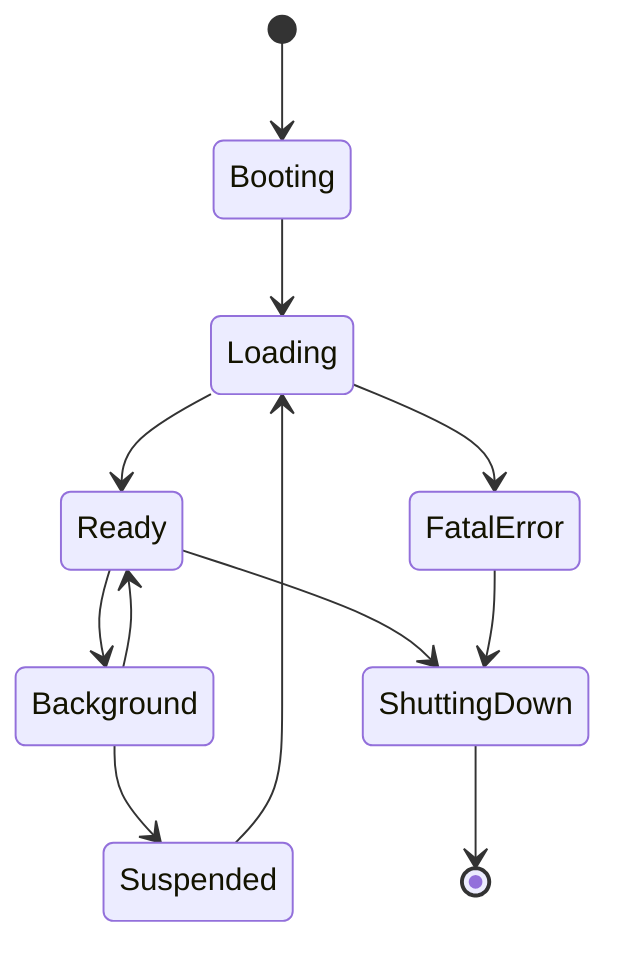
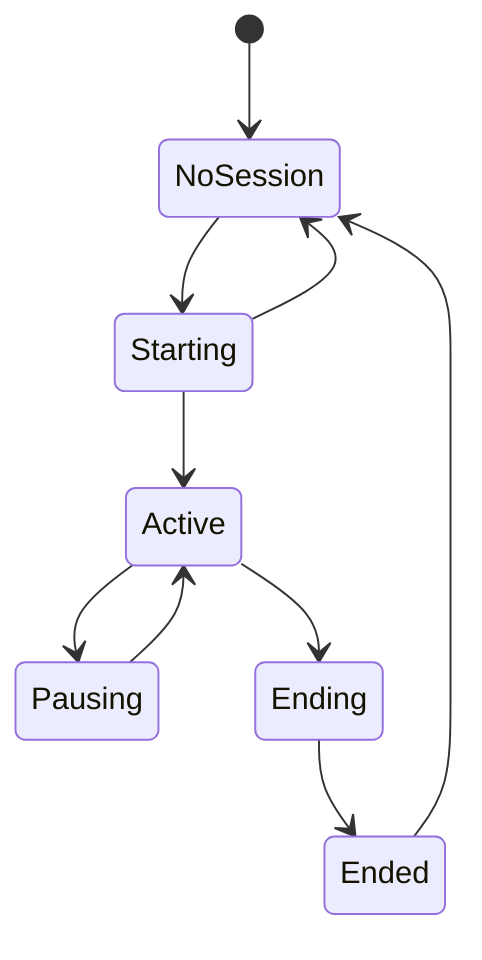
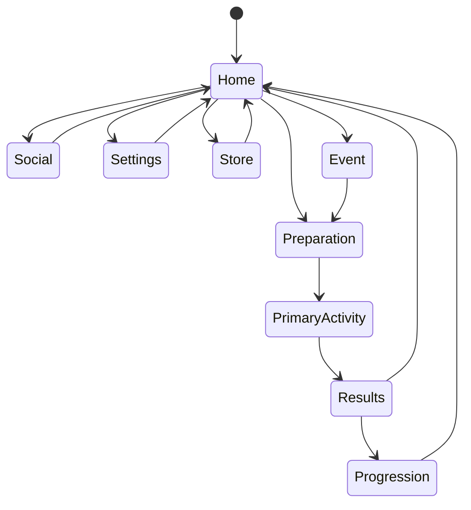

# Game State and Flow（游戏状态与流程系统）

> Status: V1  
> Category: Core  
> Path: `design/systems/core/game-state-and-flow.md`  
> Owner: TBD  
> Reviewers: Design / Product / Engineering / UX / QA / Research  
> Last Updated: 2026-07-11  
> Version: 1.0  
> Risk Level: High  
> Dependencies: Core Loop, Input and Interaction, Rules and Resolution, Save and Persistence, Content and Unlocks, Account and Identity  
> Affected Systems: Tutorial and Onboarding, Objectives and Quests, Notification and Reminders, Social and Multiplayer, Live Operations, Analytics and Telemetry

---

## 1. System Summary

Game State and Flow 系统负责管理产品当前处于什么状态，以及玩家如何在不同模式、页面、流程和会话阶段之间切换。

它回答：

```text
当前是什么状态？
允许进入哪里？
谁可以触发切换？
切换前需要满足什么条件？
切换失败时如何恢复？
暂停、后台、断线和退出如何处理？
深链、通知和回归如何进入正确上下文？
```

它是：

- 页面流的上层约束；
- 核心循环的运行环境；
- 输入上下文的来源；
- 保存与恢复的协调者；
- 跨模式切换的权威状态拥有者。

它不等于 UI 路由器、页面栈、技术场景管理器、单个玩法内部状态机或存档系统。

---

## 2. Purpose

### 2.1 Player Value

该系统帮助玩家：

- 知道自己当前处于什么模式；
- 在不同系统之间安全切换；
- 暂停、退出和返回时不丢失上下文；
- 在状态变化时获得明确反馈；
- 避免异常切换造成进度损失；
- 从通知、邀请和深链进入正确内容；
- 恢复时理解上次做了什么。

### 2.2 Experience Contribution

它支撑：

- 清晰；
- 连贯；
- 可恢复；
- 会话节奏；
- 输入一致性；
- 核心循环连续性。

### 2.3 Product Value

它为以下能力提供基础：

- 新手引导；
- 核心循环；
- 多模式产品；
- 活动；
- 社交邀请；
- 断线恢复；
- 深链；
- 跨设备恢复；
- 页面分析；
- 平台生命周期。

### 2.4 Why This System Exists

没有统一状态系统时，项目容易演化成：

```text
每个页面自己决定返回；
每个功能自己决定能否进入；
每个弹窗自己修改全局状态；
每个模式自己处理暂停和恢复；
页面栈代替业务状态；
异常切换依赖临时补丁。
```

最终导致隐式耦合、状态冲突、恢复失败和玩家资产风险。

---

## 3. Non-Goals

该系统不负责：

- 定义页面最终视觉布局；
- 管理具体 UI 动画；
- 计算战斗、任务或经济结果；
- 拥有任务、角色、装备和资源状态；
- 替代 Save and Persistence；
- 替代平台生命周期 API；
- 替代网络连接系统；
- 将所有玩法内部状态塞进一个巨大全局状态机；
- 通过页面跳转表达全部业务状态。

---

## 4. Governing Principles

### Player First Design

- 玩家应理解当前状态和退出后果；
- 高影响切换必须可恢复；
- 中断不应造成不可解释损失；
- 返回路径应符合预期。

### Clarity and Feedback

- 当前模式必须可识别；
- 不可进入必须说明原因；
- 状态切换必须有反馈；
- 恢复后必须解释发生了什么。

### Consistency and Coherence

- 相似模式采用相似进入和退出规则；
- 返回行为在不同平台保持语义一致；
- 暂停、恢复和错误使用统一术语。

### Pacing and Rhythm

- 状态切换不应频繁打断核心体验；
- 高张力活动中只允许必要中断；
- 会话应有自然停止点；
- 恢复流程不应过长。

### Accessibility and Inclusivity

- 暂停、后台和恢复能力明确；
- 模式切换不只依赖视觉或声音；
- 焦点变化可预测；
- 输入设备变化时保持可控。

### Ethical Design

- 不隐藏退出；
- 不通过流程阻塞强迫留存；
- 不将营销入口伪装成系统级警告；
- 取消和停止路径不应故意复杂化。

---

## 5. Player Experience

### Player Goal

玩家进入状态系统是为了开始目标、切换内容、暂停、返回、查看结果、处理设置、接受邀请或恢复进度。

### Entry

常见入口：

- 冷启动；
- 热启动；
- 登录后进入；
- 本地或云端恢复；
- 通知；
- 深链；
- 社交邀请；
- 活动入口；
- 外部平台邀请。

### Main Actions

- 进入模式；
- 返回上层；
- 暂停；
- 恢复；
- 放弃；
- 切换目标；
- 打开临时覆盖层；
- 结束会话；
- 切换账户；
- 接受或拒绝邀请。

### Success

状态流程成功意味着：

- 玩家到达预期位置；
- 业务状态与页面状态一致；
- 输入上下文正确；
- 数据已保存或可恢复；
- 返回行为可预测；
- 异常没有造成资产损失。

### Failure

失败包括：

- 进入条件失效；
- 切换中断；
- 路由目标不存在；
- 存档失败；
- 版本冲突；
- 权限不足；
- 网络变化；
- 活动过期；
- 当前模式禁止切换。

### Exit and Return

退出时应说明：

- 是否保存；
- 是否保留进度；
- 是否消耗资源；
- 是否可以继续；
- 是否失去多人资格；
- 下次从哪里恢复。

---

## 6. System Boundary

### Inputs

- 玩家导航意图；
- Core Loop 阶段变化；
- 平台生命周期事件；
- 登录和账户状态；
- Save 恢复结果；
- 内容可用性；
- 深链和通知参数；
- 社交邀请；
- 网络连接状态；
- 输入设备变化；
- 版本迁移结果。

### Outputs

- 全局模式变化；
- 页面流目标；
- 暂停和恢复请求；
- 保存请求；
- 输入上下文变化；
- 退出确认；
- 深链解析结果；
- 状态切换事件；
- 恢复上下文；
- 分析事件。

### Owned State

- Application State；
- Session State；
- Global Mode；
- Navigation Context；
- Modal Layer Stack；
- Pause State；
- Background State；
- Transition State；
- Resume Context；
- Pending Entry Intent；
- Current Flow Correlation ID。

### Read-Only Dependencies

- Account 当前状态；
- Save 恢复状态；
- Content 可用性；
- Core Loop 当前阶段；
- Objectives 当前目标；
- Social 邀请状态；
- Live Operations 活动状态；
- Entitlement 访问资格。

### Write Dependencies

通过正式命令请求：

- Save 保存上下文；
- Core Loop 暂停或放弃；
- Input 切换上下文；
- Account 切换账户；
- Social 接受邀请；
- Analytics 记录变化。

---

## 7. State Layers

不应使用单一巨大全局状态，建议拆分以下层级。

### 7.1 Application State

```text
Booting
Loading
Ready
Background
Suspended
ShuttingDown
FatalError
```

### 7.2 Session State

```text
NoSession
Starting
Active
Pausing
Ending
Ended
```

### 7.3 Global Mode

```text
Home
Preparation
PrimaryActivity
Results
Progression
Social
Settings
Store
Event
```

### 7.4 Modal Layer

- Confirmation；
- Notification；
- Error；
- Tutorial Prompt；
- Reward Preview；
- System Dialog。

### 7.5 Transition State

```text
Stable
Entering
Exiting
Loading
Restoring
Failed
```

### 7.6 Pause State

```text
NotPaused
PlayerPaused
SystemPaused
BackgroundPaused
NetworkPaused
```

---

## 8. Application State Model



### State Responsibilities

- **Booting**：初始化平台、配置、日志和版本；
- **Loading**：加载账户、存档、内容和设置；
- **Ready**：允许正常交互；
- **Background**：应用仍存活，但限制前台行为；
- **Suspended**：可能被操作系统冻结或回收；
- **ShuttingDown**：执行最终保存和释放；
- **FatalError**：无法保证安全继续。

---

## 9. Session State Model



### Starting

执行：

- 身份验证；
- 存档恢复；
- 深链解析；
- 上下文恢复；
- 迁移检查。

### Pausing

等待：

- 保存；
- 外部中断；
- 模式暂停；
- 网络恢复。

### Ending

执行：

- 保存；
- 清理临时状态；
- 处理 Pending；
- 结束当前会话。

---

## 10. Global Mode Model



该图只描述主要模式，具体项目应根据核心体验裁剪。

---

## 11. State Composition

同一时刻可能同时存在：

```text
Application State = Ready
Session State = Active
Global Mode = PrimaryActivity
Transition State = Stable
Pause State = PlayerPaused
Modal Layer = Settings Overlay
```

因此要区分：

- 主状态；
- 正交状态；
- 临时覆盖；
- 派生状态。

例如：

```text
CanAcceptInvite
CanOpenStore
CanSave
CanResume
```

这些应由权威状态计算，不应独立持久化为另一份业务事实。

---

## 12. State Ownership

| State | Owner | Readers | Writers | Persistence |
|---|---|---|---|---|
| Application State | Game State and Flow | 全部系统 | Game State | 会话级 |
| Session State | Game State and Flow | Core Loop、Save、Analytics | Game State | 会话级 |
| Global Mode | Game State and Flow | UI、Input、Analytics | Game State | 可恢复 |
| Modal Layer Stack | Game State and Flow | UI、Input | Game State | 通常不持久 |
| Pause State | Game State and Flow | Core Loop、Input、Audio | Game State | 中断时保存 |
| Resume Context | Game State and Flow | Core Loop、UI | Game State | 是 |
| Account State | Account and Identity | Game State | Account | 是 |
| Loop Stage | Core Loop | Game State | Core Loop | 是 |
| Objective State | Objectives | Game State | Objectives | 是 |
| Save Status | Save and Persistence | Game State | Save | 是 |

---

## 13. Flow Definition

Flow 是围绕一个玩家目标组织的一组状态和转换。

例如：

- Login Flow；
- New Game Flow；
- Resume Flow；
- Start Activity Flow；
- Results Flow；
- Purchase Flow；
- Account Deletion Flow。

每个 Flow 必须定义：

- Entry；
- Preconditions；
- Steps；
- Owned State；
- Exit；
- Cancel；
- Failure；
- Resume；
- Timeout；
- Analytics。

Flow 不等于页面序列。同一 Flow 可以跨多个页面，也可以在一个页面或后台完成。

---

## 14. Navigation Context

Navigation Context 应包含：

- Source；
- Destination；
- Reason；
- Return Target；
- Correlation ID；
- Deep Link Parameters；
- Required State；
- Resume Policy。

### Return Policy

可选：

- Return to Source；
- Return to Parent；
- Return to Home；
- Return to Last Stable State；
- No Return。

系统必须知道当前 Flow 完成后应回到哪里，而不是只依赖页面栈猜测。

---

## 15. Transition Rules

### 15.1 进入前验证

- 目标状态存在；
- 玩家有权限；
- 当前状态允许；
- 必要数据可用；
- 高风险事务已完成；
- Pending 状态可安全处理。

### 15.2 切换期间

- 锁定重复切换；
- 展示加载反馈；
- 保存必要上下文；
- 管理输入焦点；
- 阻止旧页面继续写入。

### 15.3 切换成功

- 更新权威状态；
- 更新输入上下文；
- 发布事件；
- 恢复焦点；
- 记录分析。

### 15.4 切换失败

- 返回 Last Stable State；
- 显示原因；
- 保留玩家数据；
- 提供重试；
- 必要时降级。

---

## 16. Transition Table

| From | To | Trigger | Preconditions | Save Required | Failure Fallback |
|---|---|---|---|---|---|
| Booting | Loading | InitComplete | 配置可读 | 否 | FatalError |
| Loading | Ready | LoadComplete | 存档或默认状态可用 | 是 | Recovery Flow |
| Home | Preparation | SelectGoal | 目标可用 | 可选 | Home |
| Preparation | PrimaryActivity | Start | 条件满足 | 是 | Preparation |
| PrimaryActivity | Results | ActivityEnded | 权威结果可用 | 是 | Pending Results |
| Results | Progression | Continue | 奖励处理完成 | 是 | Results |
| Progression | Home | Finish | 成长状态稳定 | 是 | Progression |
| Any Stable | Settings | OpenSettings | 当前模式允许 | 否 | 原状态 |
| Any Stable | Background | PlatformEvent | 无 | 是 | Background |
| Background | Ready | Foreground | 状态可恢复 | 是 | Recovery Flow |
| Any | FatalError | Unrecoverable | 无法安全继续 | 尽可能 | Safe Exit |

---

## 17. Back Behavior

Back 的建议语义优先级：

```text
1. 关闭当前临时覆盖层
2. 取消当前未提交操作
3. 返回父级 Flow
4. 返回 Last Stable State
5. 提示退出应用
```

Back 不应：

- 直接丢失未保存内容；
- 绕过高风险确认；
- 穿透多个模态层；
- 在不同平台产生相反语义；
- 在活动中静默视为失败。

Android Back、iOS 返回手势、PC Escape 和主机返回键可以有不同输入，但应保持相同业务语义。

---

## 18. Modal Layer Rules

### 类型

- Informational；
- Confirmation；
- Error；
- Blocking；
- Non-Blocking；
- System；
- Tutorial。

### Stack Rules

应限制：

- 最大层级；
- 重复弹出；
- 相互覆盖；
- 背景输入；
- 焦点；
- 关闭顺序。

高风险确认适用于：

- 永久删除；
- 高价值消耗；
- 放弃不可恢复进度；
- 退出多人活动；
- 账号切换。

低风险且可逆操作不应频繁弹窗。

---

## 19. Pause Rules

### Pause Types

- Player Pause；
- System Pause；
- Background Pause；
- Network Pause。

暂停时必须定义：

- 时间是否停止；
- AI 是否停止；
- 输入是否停止；
- 音频如何变化；
- 计时器是否继续；
- 网络是否继续；
- 是否保存；
- 是否允许设置；
- 是否允许退出。

多人在线模式可以不完全暂停世界，但仍应提供：

- 安全退出；
- 明确状态；
- 网络恢复；
- 不输入时的保护策略。

---

## 20. Background and Suspension

### 进入后台

立即判断：

- 当前模式；
- 是否需要暂停；
- 是否需要保存；
- 是否存在高风险事务；
- 是否需要断开连接；
- 是否降低资源使用。

### 后台期间

不应默认继续：

- 高风险倒计时；
- 本地实时战斗；
- 不可恢复流程；
- 需要持续输入的活动。

### 恢复前台

检查：

- 应用是否被回收；
- 会话是否过期；
- 网络是否恢复；
- 活动是否结束；
- 存档是否变化；
- 配置是否更新；
- 权益是否变化。

长时间后台后应执行 Cold Resume，包括重新验证身份、存档、活动状态和版本。

---

## 21. Interruption Model

中断来源：

- 来电；
- 系统弹窗；
- 权限请求；
- 控制器断开；
- 网络断开；
- 应用后台；
- 设备休眠；
- 社交邀请；
- 支付平台跳转。

### 分类

- **Soft Interruption**：可以立即恢复；
- **Hard Interruption**：需要重新加载或同步；
- **Destructive Interruption**：当前活动可能无法继续。

### 恢复策略

```text
Resume Exact State
Resume Checkpoint
Return to Preparation
Return to Results
Return to Home
Abort with Compensation
```

---

## 22. Resume Context

Resume Context 应记录：

- Last Stable State；
- Current Flow；
- Current Mode；
- Loop Instance；
- Goal Reference；
- Activity Reference；
- Pending Transactions；
- Return Target；
- Save Version；
- Timestamp；
- Recovery Policy。

### 恢复顺序

```text
1. 验证账户
2. 验证版本
3. 恢复 Save
4. 查询 Pending
5. 验证内容和活动状态
6. 恢复 Last Stable State
7. 解释期间变化
8. 恢复输入
```

最小恢复保证：

- 玩家知道自己在哪里；
- 未完成事务不会重复；
- 已确认结果不会丢失；
- 无法继续时有明确替代路径。

---

## 23. Deep Link and Notification Entry

### Deep Link Types

- Content；
- Quest；
- Social Invite；
- Offer；
- Settings；
- Reward；
- Event；
- Support。

### 解析前检查

- 参数有效；
- 内容存在；
- 权限满足；
- 活动未结束；
- 版本支持；
- 账户正确；
- 当前状态允许。

如果玩家正在高影响流程中，不应直接跳转。应将入口放入 Pending Intent，允许玩家完成、保存、拒绝或稍后进入。

失效链接应解释原因并回到安全入口，而不是进入空白页面。

---

## 24. Social Invite Flow

推荐流程：

```text
Invite Received
→ Display Non-Blocking Prompt
→ Player Accepts
→ Validate Current State
→ Save or Exit Current Flow
→ Join Social Flow
```

不应：

- 自动接受；
- 直接放弃当前进度；
- 通过拒绝羞辱玩家；
- 隐藏离队后果。

---

## 25. Loading State

Loading 类型：

- Initial；
- Mode Transition；
- Content；
- Network；
- Save；
- Migration；
- Recovery。

Loading 必须说明：

- 正在做什么；
- 是否可以取消；
- 超时怎么办；
- 是否可以后台；
- 失败后回到哪里。

长时间 Loading 需要进度、状态说明、重试、安全退出和支持信息。

不要在权威状态未完成时提前展示成功页面。

---

## 26. Error State

### Recoverable Error

提供原因、重试、返回和恢复。

### Blocking Error

当前 Flow 无法继续，但应用其他部分仍可使用。

### Fatal Error

无法保证数据安全，应：

- 尝试保存；
- 记录诊断；
- 显示明确说明；
- 安全退出；
- 提供支持路径。

错误文案不应归责玩家。

---

## 27. Exit Rules

区分：

- 关闭弹窗；
- 离开页面；
- 放弃 Flow；
- 结束活动；
- 结束会话；
- 退出账户；
- 退出应用。

高影响退出需要说明：

- 未保存内容；
- 消耗；
- 多人影响；
- 奖励；
- 是否可恢复。

退出前应处理 Pending、保存必要状态、停止输入、关闭连接并确认最终状态。

不得通过多层劝阻、隐藏按钮、延迟、羞辱或虚假损失阻塞正常退出。

---

## 28. Flow Invariants

1. 同一时刻只有一个权威 Global Mode。
2. Modal Layer 不能直接修改领域业务状态。
3. 全局模式切换必须通过 Game State and Flow。
4. 页面销毁不等于业务状态完成。
5. 返回基于 Flow Context，而非仅依赖页面栈。
6. 高风险切换前必须验证保存和事务状态。
7. 深链不能绕过访问资格和状态保护。
8. Background 恢复前必须重新验证时效性状态。
9. UI 不直接拥有 Pause、Resume 或 Mode 状态。
10. Fatal Error 不继续接受高风险输入。

---

## 29. Transition Idempotency

以下操作应幂等：

- Resume；
- Enter Results；
- Restore Session；
- Apply Deep Link；
- Accept Invite；
- Exit Flow；
- Save Before Background；
- Complete Migration。

重复请求应返回当前权威状态、已处理结果或 Pending 状态，不应重复创建 Activity、结束会话、发放奖励、接受邀请或创建购买。

---

## 30. Cross-System Dependencies

| System | Dependency Type | Direction | Data or Event | Failure Impact |
|---|---|---|---|---|
| Core Loop | Hard | 双向 | Loop Stage | 模式与循环不同步 |
| Input and Interaction | Hard | State → Input | Input Context | 错误输入生效 |
| Save and Persistence | Hard | State → Save | Resume Context | 无法恢复 |
| Account and Identity | Hard | Account → State | Account State | 无法进入会话 |
| Content and Unlocks | Hard / Soft | Content → State | Availability | 入口失效 |
| Rules and Resolution | Soft | Rules → State | Pending Result | 无法进入 Results |
| Settings | Soft | Settings → State | Pause / Display Preferences | 使用默认设置 |
| Social | Soft / Hard | Invite → State | Join Intent | 邀请失败 |
| Notification | Soft | Notification → State | Deep Link Intent | 回到安全入口 |
| Live Operations | Soft | Live → State | Event State | 使用最后有效配置 |
| Analytics | Soft | State → Analytics | Transition Events | 不阻断 |

---

## 31. Data and Persistence

| State | Persistent | Authority | Save Trigger | Retention | Recovery |
|---|---|---|---|---|---|
| Global Mode | 是 | Game State | 稳定切换后 | 当前会话 | 恢复 Last Stable |
| Current Flow | 是 | Game State | Flow 进入与退出 | 当前会话 | 恢复或取消 |
| Resume Context | 是 | Game State | 中断、后台、退出 | 至成功恢复 | Recovery Flow |
| Pending Entry Intent | 可选 | Game State | 深链或邀请排队 | 短期 | 重新验证 |
| Pause State | 是 | Game State | 进入暂停 | 当前活动 | 恢复规则 |
| Modal Stack | 通常否 | Game State | 不适用 | 会话 | 重建 |
| Transition State | 否 | Game State | 不适用 | 瞬时 | 回到稳定状态 |
| Flow Correlation ID | 是 | Game State | Flow 创建 | 审计期 | 追踪 |

每次稳定切换后记录 Last Stable State：Mode、Flow、Context、Save Version 和 Timestamp。

---

## 32. Accessibility

### Visual

- 当前模式有明确标题或状态；
- 焦点变化可见；
- 暂停、错误和恢复状态可辨识；
- 不只依赖动画表达切换完成。

### Audio

- 模式变化不只依赖音效；
- 暂停与错误有视觉替代；
- 后台恢复不突然播放高音量内容。

### Input

- 返回、暂停和确认可重绑；
- 控制器断开时自动暂停；
- 焦点不会落入不可见元素；
- Modal 打开时背景输入被阻止。

### Cognitive

- 返回路径稳定；
- 模式名称一致；
- 深链进入后解释上下文；
- 错误状态提供明确下一步。

### Timing

- 单人模式尽量支持暂停；
- 限时流程在系统中断时有保护；
- 长 Loading 提供取消或说明；
- 恢复时允许玩家阅读变化。

---

## 33. Ethical and Safety Review

### Player Control

- 玩家可明确退出；
- 取消路径可见；
- 不隐藏 Back；
- 不通过流程阻塞强迫留存。

### Deep Links and Notifications

- 不伪装系统警告；
- 不绕过高风险确认；
- 不将营销入口置为阻塞状态；
- 失效链接安全降级。

### Commercial Flow

- Store 不覆盖不可中断流程；
- 失败后不自动跳转购买；
- 支付 Pending 可解释；
- 取消购买容易。

### Children and Vulnerable Users

- 不在高压时刻强制弹出购买；
- 社交邀请可拒绝；
- 退出多人流程不使用羞辱文案；
- 隐私入口不默认开放。

### Data Safety

- 状态切换前确认高风险事务；
- 账户切换前保存；
- 删除和退出不可误触；
- Fatal Error 优先保护数据。

---

## 34. Analytics and Validation

### Key Assumptions

1. 玩家能理解当前模式。
2. Back 行为符合预期。
3. 暂停和恢复不会丢失上下文。
4. 深链和通知不会破坏当前流程。
5. 状态切换时间和 Loading 可接受。
6. 错误流程能够安全恢复。
7. 页面状态与业务状态保持一致。

### Validation Plan

| Hypothesis | Evidence | Success | Failure | Method |
|---|---|---|---|---|
| 当前状态清楚 | 玩家复述 | 能说明所在模式和下一步 | 经常迷路 | 可用性测试 |
| Back 可预测 | 行为与访谈 | 返回符合预期 | 误退出或多次试错 | 任务测试 |
| 恢复可靠 | 中断测试 | 恢复到正确上下文 | 进度丢失或重复 | QA / 长期测试 |
| 深链安全 | 场景测试 | 正确进入或安全降级 | 绕过条件或空页面 | 集成测试 |
| Loading 可接受 | 耗时与放弃率 | 关键切换在目标范围 | 大量强退 | 性能与数据 |
| 错误可恢复 | 恢复率 | 错误有明确路径 | 卡死或数据损失 | 故障注入 |

### Behavioral Metrics

- 模式进入与退出率；
- Back 使用和取消率；
- 暂停与恢复率；
- 深链成功率；
- Loading 放弃率；
- 错误重试率；
- Fatal Error 率；
- 状态切换耗时。

### Negative Metrics

- 错误返回；
- 页面与状态不一致；
- 重复进入；
- Loading 卡死；
- 未保存退出；
- 深链绕过资格；
- 恢复到过期内容；
- 邀请导致进度丢失；
- 购买流程阻塞；
- Modal Stack 失控。

### Event Intents

| Event Intent | Trigger | Key Properties | Privacy Notes |
|---|---|---|---|
| Application State Changed | 生命周期变化 | From, To, Reason | 不记录不必要设备标识 |
| Session Started | 会话启动 | Entry Source | 匿名化 |
| Global Mode Entered | 模式进入 | Mode, Source | 不记录敏感内容 |
| Transition Failed | 切换失败 | From, To, Reason | 错误内容脱敏 |
| Pause Changed | 暂停变化 | Pause Type | 不推断健康状态 |
| Resume Completed | 恢复成功 | Resume Type, Duration | 不记录私密上下文 |
| Deep Link Resolved | 链接处理 | Type, Result | 参数最小化 |
| Flow Abandoned | 流程放弃 | Flow, Stage, Reason | 不收集自由文本 |

---

## 35. Rollout and Migration

### Rollout

按内部、平台、模式、玩家分群到全量逐步发布。

### Feature Flags

可控制新导航、新暂停逻辑、新恢复策略、新深链和新 Modal 系统，但必须保证不同 Flag 组合不会产生不可恢复状态。

### Migration

旧状态迁移应定义：

- 旧 Mode 到新 Mode 的映射；
- 旧页面栈到 Flow Context 的映射；
- 旧 Pending 状态；
- 旧深链；
- 旧存档；
- 未完成活动。

### Rollback

- 使用 Last Stable State；
- 保留 Resume Context；
- 不撤销已确认业务结果；
- 重建 UI；
- 清理不兼容 Modal；
- 保留审计。

### Stop Conditions

- 状态切换导致进度丢失；
- Back 大量误退出；
- Resume 失败率异常；
- 深链绕过访问资格；
- 页面和业务状态大规模不一致；
- Loading 卡死；
- 账户切换造成资产冲突；
- Fatal Error 上升。

---

## 36. Risks and Open Questions

| Item | Type | Impact | Probability | Mitigation | Owner |
|---|---|---:|---:|---|---|
| 全局状态机过大 | Architecture Risk | 高 | 中 | 分层与正交状态 | Engineering |
| 页面栈替代业务状态 | Design Risk | 高 | 中 | Flow Context 与 Owner | Design |
| 深链破坏当前流程 | Integration Risk | 高 | 中 | Pending Intent | Engineering |
| 多设备 Resume 冲突 | Data Risk | 高 | 中 | 版本、摘要、玩家选择 | Save Owner |
| Modal 层级失控 | UX Risk | 中 | 中 | Stack 规则与最大层级 | UX |
| Back 行为不一致 | Consistency Risk | 中 | 高 | 统一语义映射 | UX |
| 后台继续高风险计时 | Ethical Risk | 高 | 低 | 暂停与补偿规则 | Product |
| 运营入口绕过条件 | System Risk | 高 | 中 | 统一 Deep Link 验证 | Live Ops |

---

## 37. Review Checklist

### Purpose and Scope

- [ ] Application、Session、Mode、Modal 和 Pause 分层明确；
- [ ] 不使用单一巨大状态机；
- [ ] Game State 不拥有领域业务状态；
- [ ] Non-Goals 已定义。

### State Model

- [ ] Application State 完整；
- [ ] Session State 完整；
- [ ] Global Mode 完整；
- [ ] Transition 和 Pause 状态明确；
- [ ] 派生状态不被当作权威。

### Flow

- [ ] 主要 Flow 有 Entry、Exit、Cancel、Failure 和 Resume；
- [ ] Flow 不等同于页面序列；
- [ ] Return Target 明确；
- [ ] Back 语义统一；
- [ ] Modal Stack 有边界。

### Interruption and Recovery

- [ ] Background 行为明确；
- [ ] 中断类型得到区分；
- [ ] Resume Context 完整；
- [ ] Pending 事务可恢复；
- [ ] 长时间后台有 Cold Resume。

### Deep Link and Social

- [ ] 深链验证访问资格；
- [ ] 失效链接安全降级；
- [ ] 高风险流程不会被直接打断；
- [ ] 社交邀请可拒绝；
- [ ] 邀请不导致未说明的数据损失。

### Data and Safety

- [ ] Last Stable State 被保存；
- [ ] 状态切换幂等；
- [ ] 高风险退出前保存；
- [ ] Fatal Error 优先保护数据；
- [ ] 页面销毁不等于业务完成。

### Accessibility and Ethics

- [ ] Pause、Back 和确认可访问；
- [ ] 模式变化不依赖单一感官；
- [ ] 不隐藏退出；
- [ ] 不用流程摩擦强迫留存；
- [ ] 营销入口不伪装为系统状态。

### Validation

- [ ] 模式理解有验证；
- [ ] Back 可预测性有验证；
- [ ] Resume 有故障测试；
- [ ] 深链与通知有集成测试；
- [ ] 状态冲突和 Loading 有负面指标。

---

## 38. V1 Completion Criteria

Game State and Flow 可以被视为 V1，当：

- Application、Session、Global Mode、Modal、Transition 和 Pause 状态已分层；
- 每个主要状态有清晰定义；
- 主要模式转换和失败回退已定义；
- 状态所有权与其他系统边界明确；
- Flow 与页面序列得到区分；
- Navigation Context、Return Target 和 Back 语义明确；
- Modal Stack、Loading 和 Error 状态有统一规则；
- Player、System、Background 和 Network Pause 得到区分；
- 中断模型、Resume Context 和恢复顺序完整；
- 深链、通知和社交邀请有安全进入规则；
- 高影响退出前的数据保存和后果说明明确；
- 状态切换支持幂等和 Last Stable State；
- 页面状态不会代替业务权威状态；
- 可访问性、伦理、隐私与儿童保护已检查；
- 状态理解、Back、Resume、Deep Link 和 Loading 有验证计划；
- 新旧状态结构具有迁移与回滚策略；
- 下游 UI、Input、Save、Core Loop 和 Content 系统可以直接引用本文件。

---

## 39. Related Documents

### Philosophy

- [Player First Design](../../philosophy/foundation/player-first-design.md)
- [Clarity and Feedback](../../philosophy/experience/clarity-and-feedback.md)
- [Pacing and Rhythm](../../philosophy/experience/pacing-and-rhythm.md)
- [Consistency and Coherence](../../philosophy/long-term/consistency-and-coherence.md)
- [Accessibility and Inclusivity](../../philosophy/responsibility/accessibility-and-inclusivity.md)
- [Ethical Design](../../philosophy/responsibility/ethical-design.md)

### Systems

- [Systems README](../README.md)
- [System Design Framework](../system-design-framework.md)
- [System Map](../system-map.md)
- [Integration Rules](../integration-rules.md)
- [Core Loop](./core-loop.md)
- `input-and-interaction.md`
- `rules-and-resolution.md`
- `../player/save-and-persistence.md`
- `../player/settings-and-preferences.md`
- `../player/notification-and-reminders.md`
