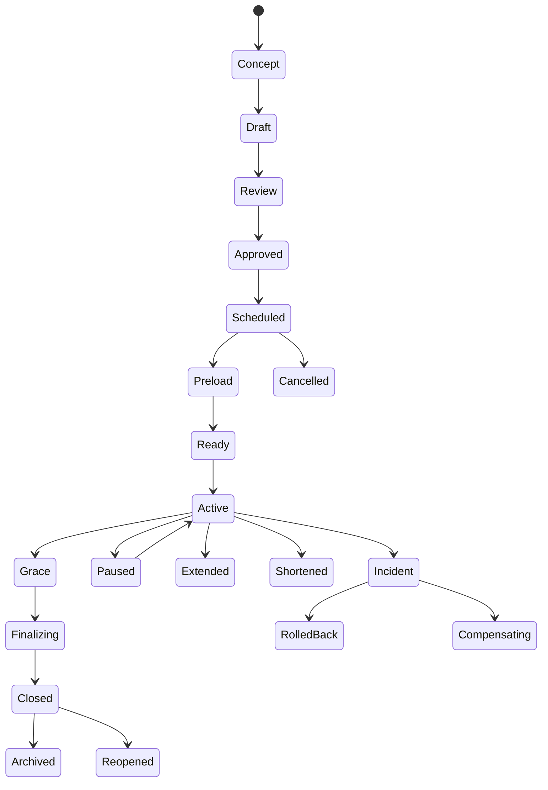

# Live Operations（实时运营系统）

> Status: V1  
> Category: Operations  
> Path: `design/systems/operations/live-operations.md`  
> Owner: TBD  
> Reviewers: Product / Design / Engineering / Data / QA / Community / Support / Trust and Safety / Commerce / Finance / Legal / Privacy / Platform / SRE  
> Last Updated: 2026-07-11  
> Version: 1.0  
> Risk Level: Critical  
> Dependencies: Analytics and Telemetry, Content Lifecycle, Reward System, Resources and Economy, Notification and Reminders, Monetization System, Offers and Pricing, Entitlement and Ownership, Experiment Management, Versioning and Migration  
> Affected Systems: Core Loop, Progression, Objectives and Quests, Social and Multiplayer, Matchmaking and Competition, Moderation and Safety, Storefront, Support, Community, Platform Integrations

---

## 1. System Summary

Live Operations 系统负责定义：

```text
产品如何在不发布完整客户端版本的情况下，
安全地配置、启动、运行、监控、暂停、修复和结束活动、内容、奖励、商业、社交和系统运营。
```

该系统通常覆盖：

- Operations Calendar；
- Event Definition；
- Event Schedule；
- Campaign；
- Live Configuration；
- Feature Flag；
- Content Rotation；
- Quest Rotation；
- Reward Rotation；
- Shop Rotation；
- Offer Schedule；
- Subscription Campaign；
- Seasonal Program；
- Tournament；
- Community Event；
- Login Campaign；
- Return Campaign；
- Maintenance；
- Service Announcement；
- Capacity Plan；
- Region Rollout；
- Segment Rollout；
- Eligibility；
- Localization；
- Legal Review；
- Platform Certification；
- Publish；
- Pause；
- Resume；
- Extend；
- Shorten；
- Cancel；
- Kill Switch；
- Emergency Override；
- Rollback；
- Incident；
- Compensation；
- Postmortem；
- Archive。

健康的 Live Operations 系统应让玩家感受到：

```text
活动时间清楚；
规则和奖励稳定；
运营变更不会突然伤害进度；
系统故障时有及时说明；
错误不会通过临时配置持续扩散；
结束、延期、补偿和返场有一致规则；
限时内容不会依赖虚假紧迫；
不同地区和平台得到可理解的体验；
已购买和已获得价值受到保护。
```

---

## 2. Purpose

### 2.1 Player Value

Live Operations 可以为玩家提供：

- 持续更新；
- 节日和赛季内容；
- 限时挑战；
- 社区目标；
- 内容轮换；
- 新奖励；
- 回归机会；
- 活动补偿；
- 服务器维护沟通；
- 更快的错误修复；
- 无需频繁下载完整版本的内容调整；
- 更稳定的长期服务。

### 2.2 Product Value

Live Operations 帮助团队：

- 编排长期运营；
- 安全发布配置；
- 支持活动和赛季；
- 控制内容曝光；
- 管理容量；
- 调整经济和奖励；
- 支持商业和订阅；
- 支持平台和地区差异；
- 快速响应事故；
- 执行灰度、暂停、回滚；
- 统一运营审批；
- 形成可复用运营资产；
- 降低临时手工操作风险；
- 提供完整审计。

### 2.3 Experience Contribution

Live Operations 会影响：

- 新鲜感；
- 节奏；
- 长期动机；
- 内容发现；
- 社区活跃；
- 竞争公平；
- 商业节奏；
- 玩家信任；
- 运营负担；
- 系统稳定性。

不健康的运营系统会造成：

- 活动突然开始或结束；
- 时区错误；
- 奖励配置错误；
- 任务不可完成；
- 商店与活动不同步；
- 某地区提前看到内容；
- 活动延期但通知未更新；
- 维护无说明；
- 事故补偿重复；
- 临时配置覆盖正式规则；
- Kill Switch 不可用；
- 活动结束后数据未归档；
- 运营团队依赖直接改数据库；
- 大量人工例外；
- 假倒计时和过度 FOMO。

### 2.4 Why This System Exists

如果运营依赖手工和临时脚本，常见问题包括：

```text
活动由一个人直接改生产配置；
奖励表和任务表使用不同时间；
地区时区互相冲突；
活动已经上线，但本地化和法律审查未完成；
同一 Offer 在 Store、Push 和 Inbox 的结束时间不同；
容量不足导致活动开始后服务器崩溃；
补偿脚本重复执行；
活动延期后旧倒计时继续显示；
Feature Flag 和正式版本依赖不兼容；
无法确认谁改了什么；
事故中不知道该暂停内容、商店还是匹配；
回滚后玩家进度丢失；
运营结束后仍有孤立任务、货币和通知。
```

---

## 3. Non-Goals

Live Operations 不负责：

- 代替 Content Lifecycle 管理完整内容生产；
- 代替 Versioning and Migration 管理代码和数据迁移；
- 代替 Experiment Management 设计实验；
- 代替 Monetization System 完成支付；
- 代替 Reward System 发奖；
- 代替 Analytics 定义全部指标；
- 代替 SRE 管理全部基础设施；
- 通过临时配置绕过设计、法律、安全和财务审查；
- 使用运营紧迫感制造虚假 FOMO；
- 让运营人员直接修改玩家资产；
- 让 Feature Flag 变成永久架构；
- 让活动规则在运行中无版本地改变；
- 通过事故补偿掩盖长期系统性问题；
- 用 Live Config 覆盖客户端安全边界；
- 自动保证所有地区、平台和语言同一时间上线。

---

## 4. Governing Principles

### 4.1 Player First Design

参考：

- `../../philosophy/foundation/player-first-design.md`

应用原则：

- 活动价值先于运营指标；
- 规则和期限清楚；
- 错误优先保护玩家进度；
- 活动结束后保留合理领取和恢复；
- 不用临时运营制造基础体验痛点。

### 4.2 Pacing and Rhythm

参考：

- `../../philosophy/experience/pacing-and-rhythm.md`

应用原则：

- 活动密度有节奏；
- 避免多个高压力活动叠加；
- 预留休息和回顾窗口；
- 重要版本和商业活动不互相争夺注意力；
- 赛季、活动和内容生命周期协调。

### 4.3 Consistency and Coherence

参考：

- `../../philosophy/long-term/consistency-and-coherence.md`

应用原则：

- 时间、规则、奖励和通知使用同一来源；
- 相同运营类型共享模板；
- Pause、Extend、Cancel 和 Compensation 语义统一；
- 活动版本和配置可追踪。

### 4.4 Ethical Design

参考：

- `../../philosophy/responsibility/ethical-design.md`

应用原则：

- 不使用虚假倒计时；
- 不让活动奖励绑定极端每日参与；
- 不根据危机、安全或脆弱状态触发商业运营；
- 儿童和家庭活动有更严格保护；
- 运营补偿不夹带营销。

### 4.5 Iteration and Validation

参考：

- `../../philosophy/validation/iteration-and-validation.md`

应用原则：

- 活动有明确假设；
- 发布前定义成功和停止条件；
- 实时监控数据质量和玩家伤害；
- 结束后复盘并回写模板；
- 不只看参与率和收入。

---

## 5. System Boundary

### 5.1 Inputs

系统接收：

- Operations Plan；
- Event Definition；
- Content Availability；
- Reward Definition；
- Quest Definition；
- Economy Config；
- Offer Definition；
- Entitlement Rule；
- Matchmaking Rule；
- Notification Plan；
- Region；
- Platform；
- Time Zone；
- Eligibility；
- Localization；
- Legal Approval；
- Privacy Approval；
- Safety Approval；
- Capacity Plan；
- Feature Flag；
- Version Compatibility；
- Experiment Assignment；
- Analytics Baseline；
- Incident Signal；
- Support Readiness。

### 5.2 Outputs

系统产生：

- Operations Schedule；
- Event Instance；
- Live Configuration；
- Publish Plan；
- Region Rollout；
- Feature Flag State；
- Content Rotation；
- Reward Schedule；
- Notification Schedule；
- Capacity Reservation；
- Maintenance Window；
- Kill Switch State；
- Incident State；
- Compensation Plan；
- Player Communication；
- Archive Record；
- Postmortem；
- Operations Audit。

### 5.3 Owned State

系统拥有：

- Operations Calendar；
- Event Definition；
- Event Instance；
- Campaign Definition；
- Schedule；
- Eligibility Snapshot；
- Live Config Version；
- Publish State；
- Pause State；
- Extension State；
- Cancellation State；
- Kill Switch State；
- Maintenance State；
- Incident Reference；
- Compensation Reference；
- Operations History；
- Live Operations Version。

### 5.4 Read-Only Dependencies

系统读取：

- Content；
- Reward；
- Economy；
- Quest；
- Offers；
- Entitlement；
- Matchmaking；
- Notification；
- Analytics；
- Platform；
- Region；
- Capacity；
- Version；
- Legal；
- Privacy；
- Safety；
- Support。

### 5.5 Write Dependencies

系统通过正式契约请求：

- Content 发布或隐藏；
- Reward 创建发奖资格；
- Objectives 启用任务；
- Economy 启用运营规则；
- Store 启用 Offer；
- Notification 调度消息；
- Matchmaking 启用队列；
- Entitlement 启用临时权限；
- Platform 同步活动；
- Capacity 扩容；
- Support 发布脚本；
- Analytics 启用监控；
- Versioning 发布配置版本。

### 5.6 Out of Scope

系统不直接：

- 修改玩家余额；
- 直接授予高价值资产；
- 直接修改支付状态；
- 直接修改 Rating；
- 绕过 Moderation；
- 绕过家长控制；
- 让客户端时间决定活动状态；
- 使用未审核脚本批量修改生产；
- 在无审计下执行紧急操作。

---

## 6. Core Entities and Concepts

| Entity / Concept | Definition | Owner | Lifetime | Notes |
|---|---|---|---|---|
| Operations Calendar | 全局运营时间和冲突视图 | Live Ops | 长期 | 单一来源 |
| Event Definition | 一类运营事件模板 | Live Ops / Product | 版本级 | 唯一 ID |
| Event Instance | 一次实际运行的活动 | Live Ops | 实例级 | 有开始和结束 |
| Campaign | 由多个活动和渠道组成的运营计划 | Live Ops | 周期级 | 可跨系统 |
| Live Configuration | 可远程发布的配置 | Live Ops / Engineering | 版本级 | 受 Schema 约束 |
| Schedule | 开始、结束和阶段时间 | Live Ops | 实例级 | 权威时间 |
| Eligibility | 谁可以参与 | Domain / Live Ops | 版本级 | 可解释 |
| Rotation | 内容、任务或商品轮换 | Live Ops | 周期级 | 有顺序和版本 |
| Publish Plan | 发布范围、步骤和检查 | Live Ops | 发布期 | 有 Rollback |
| Feature Flag | 控制功能可用性的开关 | Engineering / Live Ops | 临时或长期 | 不应替代架构 |
| Kill Switch | 紧急关闭高风险功能 | Engineering / Live Ops | 事故期 | 独立于普通 Flag |
| Maintenance Window | 计划维护时段 | Operations | 短期 | 有通知 |
| Incident | 运营或系统异常 | Operations / SRE | 事故期 | 有 Severity |
| Compensation Plan | 面向受影响玩家的恢复方案 | Product / Live Ops | 事件级 | 幂等 |
| Operations Audit | 运营发布和变更历史 | Live Ops | 长期 | 可追踪 |
| Postmortem | 事故和活动复盘 | Operations | 长期 | 有 Action Items |
| Runbook | 标准操作和恢复步骤 | Operations | 版本级 | 与告警关联 |

---

## 7. Live Operations Taxonomy

### 7.1 Seasonal Operations

- Season；
- Chapter；
- Festival；
- Anniversary；
- Holiday。

### 7.2 Content Operations

- Content Release；
- Content Rotation；
- Featured Content；
- Return Content；
- Limited Content；
- Community Creation Spotlight。

### 7.3 Progression Operations

- Progression Boost；
- Catch-Up；
- Return Track；
- Seasonal Track；
- Limited Objectives。

### 7.4 Reward Operations

- Login Reward；
- Milestone Reward；
- Community Reward；
- Compensation；
- Bonus Drop；
- Claim Campaign。

### 7.5 Economy Operations

- Resource Bonus；
- Sink Promotion；
- Exchange；
- Crafting Event；
- Market Rule；
- Currency Conversion。

### 7.6 Social Operations

- Community Goal；
- Guild Event；
- Co-op Event；
- Referral；
- Friend Campaign；
- Creator Campaign。

### 7.7 Competitive Operations

- Ranked Season；
- Tournament；
- Ladder；
- Qualifier；
- Leaderboard Event；
- Limited Queue。

### 7.8 Commercial Operations

- Store Rotation；
- Offer；
- Sale；
- Subscription Campaign；
- DLC Launch；
- Bundle；
- Gift Campaign。

### 7.9 Service Operations

- Maintenance；
- Migration；
- Capacity Test；
- Provider Switch；
- Regional Launch；
- Sunset。

### 7.10 Safety Operations

- Scam Warning；
- Moderation Campaign；
- Child Safety Update；
- Emergency Restriction；
- Harmful Content Response。

---

## 8. Event Definition Template

```markdown
## Live Event Definition

- Event ID:
- Display Name:
- Event Type:
- Player Value:
- Business Goal:
- Start:
- End:
- Time Zone:
- Phases:
- Regions:
- Platforms:
- Languages:
- Eligibility:
- Content:
- Objectives:
- Rewards:
- Economy:
- Matchmaking:
- Offers:
- Entitlements:
- Notifications:
- Capacity:
- Safety:
- Legal:
- Analytics:
- Kill Switch:
- Rollback:
- Compensation:
- Owner:
- Version:
- Risk Level:
```

### 8.1 必须回答

- 为什么运行；
- 玩家获得什么；
- 谁能参加；
- 什么时候开始和结束；
- 依赖哪些版本和内容；
- 奖励和经济影响；
- 商业和通知影响；
- 容量需求；
- 风险和停止条件；
- 出错后如何暂停、回滚和补偿。

---

## 9. Event Instance

Event Instance 应包含：

- Instance ID；
- Event Definition；
- Version；
- Start；
- End；
- Grace End；
- Claim End；
- Regions；
- Platforms；
- Languages；
- Eligibility Snapshot；
- Content Version；
- Reward Version；
- Economy Version；
- Offer Version；
- Notification Version；
- Feature Flag Set；
- Capacity Plan；
- Status；
- Owner；
- Incident Reference；
- Audit；
- Correlation ID。

### 9.1 Stable Identity

Instance ID 永不复用。

### 9.2 Definition vs Instance

Definition 是模板。

Instance 是一次具体运行。

### 9.3 No In-Place Semantic Mutation

活动规则发生重大变化时，应创建新 Version，而不是静默覆盖。

---

## 10. Event Lifecycle

```text
Concept
→ Draft
→ Review
→ Approved
→ Scheduled
→ Preload
→ Ready
→ Active
→ Grace
→ Finalizing
→ Closed
→ Archived
```

异常和管理状态：

```text
Paused
Extended
Shortened
Cancelled
Rolled Back
Incident
Compensating
Reopened
```



---

## 11. State Definitions

### 11.1 Concept

初始方案。

### 11.2 Draft

形成可评审定义。

### 11.3 Review

跨职能审核。

### 11.4 Approved

允许进入排期。

### 11.5 Scheduled

已锁定时间和依赖。

### 11.6 Preload

提前发布资源、配置和缓存。

### 11.7 Ready

完成 Launch Checklist。

### 11.8 Active

玩家可参与。

### 11.9 Grace

停止新参与，但允许完成、领取或结算。

### 11.10 Finalizing

完成奖励、排行榜、退款和归档。

### 11.11 Closed

运营结束。

### 11.12 Archived

只保留历史。

### 11.13 Paused

暂时停止新进度或入口。

### 11.14 Extended

活动结束时间延后。

### 11.15 Shortened

活动提前结束，通常需要高风险评审。

### 11.16 Cancelled

活动未上线或被取消。

### 11.17 Rolled Back

恢复至前一安全版本。

### 11.18 Compensating

正在执行补偿。

---

## 12. Live Operations Invariants

1. 所有 Event Instance 有唯一 ID。
2. 开始、结束、Grace 和 Claim 时间来自权威服务端。
3. 活动规则、奖励和资格必须版本化。
4. 活动结束不能只依赖客户端倒计时。
5. 运营配置不能直接修改玩家高价值状态。
6. Reward、Economy、Entitlement 和 Purchase 使用各自权威事务。
7. 已发布配置变更必须可审计。
8. Kill Switch 必须独立于普通发布流程可用。
9. Pause、Extend、Shorten 和 Cancel 必须有明确玩家影响。
10. Compensation 必须幂等。
11. Analytics 失败不直接停止活动，除非指标是安全或交易关键。
12. 未完成法律、隐私、安全和平台审核的高风险活动不能上线。
13. Feature Flag 不能绕过版本兼容。
14. 事故中优先保护玩家状态和交易。
15. 活动结束后必须归档孤立任务、货币、Offer 和通知。
16. 商业紧迫和库存必须真实。
17. 多地区和平台状态必须可解释。
18. 运营人员不能直接修改数据库完成常规流程。

---

## 13. Operations Calendar

### 13.1 Purpose

统一展示：

- 版本发布；
- 活动；
- 商业；
- 赛季；
- 维护；
- 平台审核；
- 本地化；
- 社区；
- 安全；
- 竞争；
- 节假日；
- 容量；
- 团队资源。

### 13.2 Calendar Layers

- Global；
- Region；
- Platform；
- Product；
- Content；
- Commercial；
- Community；
- Maintenance；
- Safety；
- Internal。

### 13.3 Conflict Detection

检测：

- 同期高压力活动；
- 同一货币重复奖励；
- 同一内容互斥；
- 多个商业促销叠加；
- 维护和活动冲突；
- 赛季结束和版本迁移冲突；
- 平台认证窗口；
- 团队 On-Call 能力。

### 13.4 Freeze Window

高风险日期可设变更冻结。

---

## 14. Operations Planning Horizon

建议使用多层时间范围：

### 14.1 Annual

- 大型版本；
- Season；
- 周年；
- 许可；
- 商业节奏；
- 基础设施。

### 14.2 Quarterly

- 内容批次；
- 活动；
- 赛季；
- 平台；
- Creator；
- Community。

### 14.3 Monthly

- 详细活动；
- Store Rotation；
- Notifications；
- Capacity；
- Support；
- Localization。

### 14.4 Weekly

- 最终配置；
- Launch Checklist；
- On-Call；
- 风险；
- Monitoring。

### 14.5 Daily

- 健康检查；
- 热修；
- 通知；
- 小型调整；
- 事故响应。

---

## 15. Campaign

Campaign 可以包含多个 Event Instance。

例如：

```text
Anniversary Campaign
├─ Login Event
├─ Community Goal
├─ Store Offer
├─ Return Player Program
├─ Tournament
└─ Social Media Communication
```

### 15.1 Campaign Definition

- Campaign ID；
- Goal；
- Audience；
- Narrative；
- Events；
- Channels；
- Timeline；
- Budget；
- Offers；
- Notifications；
- Safety；
- Metrics；
- Owner；
- Version。

### 15.2 Cross-Channel Consistency

所有渠道使用：

- 同一时间；
- 同一规则；
- 同一价格；
- 同一资格；
- 同一法务版本。

---

## 16. Phased Events

活动可以分阶段：

- Announcement；
- Registration；
- Preload；
- Warm-Up；
- Active；
- Final；
- Grace；
- Claim；
- Archive。

### 16.1 Phase Fields

- Phase ID；
- Start；
- End；
- Entry；
- Progress；
- Rewards；
- Rules；
- Notifications；
- Capacity；
- Transition。

### 16.2 Transition

阶段切换由服务端时间和状态控制。

### 16.3 Phase Compatibility

玩家在旧阶段中的状态如何迁移需明确。

---

## 17. Time and Scheduling

### 17.1 Authority

使用服务端权威时间。

### 17.2 Storage

统一存储 UTC。

### 17.3 Display

按玩家本地时区展示。

### 17.4 Daylight Saving

排期工具必须处理 DST。

### 17.5 Region-Specific Start

可以按：

- 全球统一时刻；
- 各地区本地时刻；
- Rolling Launch；
- Platform Launch；

运行。

### 17.6 Calendar Semantics

区分：

- Inclusive Start；
- Exclusive End；
- Daily Reset；
- Weekly Reset；
- Claim End；
- Grace End。

---

## 18. Reset Schedule

### 18.1 Reset Types

- Daily；
- Weekly；
- Monthly；
- Season；
- Rolling；
- Account-Local；
- Region-Local；
- Global UTC。

### 18.2 Reset Risks

- DST；
- 重复领取；
- 漏领奖励；
- 不同平台错位；
- 旅行；
- 多设备；
- 离线。

### 18.3 Reset Invariants

1. Reset 使用权威周期 ID。
2. 同一周期只能结算一次。
3. 客户端不决定是否已重置。
4. 旅行不应产生无限重复领取。
5. Reset 变化需迁移和通知。

---

## 19. Live Configuration

### 19.1 Suitable Uses

- 活动时间；
- 内容列表；
- 奖励引用；
- 资格；
- 文案引用；
- 轮换；
- 容量参数；
- 安全限制；
- Feature Flag；
- 通知计划。

### 19.2 Unsuitable Uses

- 任意业务脚本；
- 无 Schema 的 JSON Dump；
- 绕过客户端兼容；
- 修改数据库结构；
- 改变高价值事务语义；
- 隐藏安全规则；
- 无版本随机概率。

### 19.3 Config Definition

每项配置包含：

- Config ID；
- Schema；
- Version；
- Default；
- Environment；
- Region；
- Platform；
- Start；
- End；
- Validation；
- Owner；
- Approval；
- Rollback；
- Risk Level。

---

## 20. Live Config Lifecycle

```text
Draft
→ Validated
→ Reviewed
→ Approved
→ Scheduled
→ Published
→ Active
→ Superseded
→ Retired
```

异常：

```text
Rejected
Paused
Rolled Back
Invalidated
```

### 20.1 Validation

- Schema；
- Type；
- Range；
- References；
- Version；
- Compatibility；
- Time；
- Region；
- Platform；
- Safety；
- Economy；
- Reward；
- Localization。

### 20.2 Last Known Good

每个高风险 Config 有 LKG。

---

## 21. Configuration Invariants

1. 无 Schema 配置不能发布到生产。
2. 配置版本不可原地覆盖。
3. 发布前验证所有引用。
4. 配置与客户端版本兼容。
5. 高风险配置需要审批。
6. Published 不等于 Active。
7. Rollback 必须可执行。
8. 缓存有 TTL 和版本。
9. 未能拉取配置时使用安全默认或 LKG。
10. 客户端不能扩大配置权限。
11. 配置变更有 Audit。
12. Config 删除不能破坏历史活动。
13. Analytics 事件记录 Config Version。
14. 大规模配置变更支持灰度。
15. Kill Switch 优先于普通 Config。

---

## 22. Feature Flags

### 22.1 Flag Types

- Release；
- Operations；
- Experiment；
- Permission；
- Safety；
- Kill；
- Platform；
- Region；
- Debug。

### 22.2 Flag Definition

- Flag ID；
- Purpose；
- Default；
- Scope；
- Eligibility；
- Start；
- End；
- Dependencies；
- Owner；
- Expiry；
- Rollback；
- Version。

### 22.3 Flag Debt

每个 Flag 必须有：

- 移除日期；
- Owner；
- 清理计划；
- 依赖；
- 默认最终状态。

### 22.4 Flags Are Not Architecture

长期分支应进入正式系统设计。

---

## 23. Feature Flag Evaluation

### 23.1 Inputs

- Account；
- Region；
- Platform；
- Version；
- Experiment；
- Entitlement；
- Age；
- Safety；
- Time。

### 23.2 Output

- Enabled；
- Disabled；
- Reason；
- Version；
- Expiry；
- Source。

### 23.3 Deterministic

同一输入稳定。

### 23.4 Safety Flags

优先级高于普通运营和实验。

### 23.5 Exposure

只有真正进入功能时发送 Exposure，不是 Flag Assignment 时。

---

## 24. Kill Switch

### 24.1 Purpose

快速关闭：

- 购买；
- 随机机制；
- 奖励；
- Matchmaking Queue；
- UGC；
- Voice；
- Chat；
- Content；
- Trade；
- Gift；
- Subscription Renewal；
- Feature；
- Region。

### 24.2 Requirements

- 快速；
- 独立；
- 高可用；
- 权限严格；
- 审计；
- 可测试；
- 有默认状态；
- 有 Runbook；
- 有恢复。

### 24.3 Kill Switch Levels

- Global；
- Region；
- Platform；
- Version；
- Product；
- Account Cohort；
- Feature；
- Transaction Type。

### 24.4 No Hidden Permanent Use

Kill Switch 是事故工具，不应长期代替修复。

---

## 25. Content Rotation

### 25.1 Rotation Types

- Daily；
- Weekly；
- Seasonal；
- Randomized；
- Curated；
- Algorithmic；
- Community；
- Platform；
- Region。

### 25.2 Rotation Definition

- Rotation ID；
- Content Pool；
- Sequence；
- Start；
- End；
- Repeat；
- Eligibility；
- Cooldown；
- Weight；
- Fallback；
- Version。

### 25.3 No Accidental Exclusion

轮换需要评估：

- 新玩家；
- 回归；
- 地区；
- Accessibility；
- Entitlement；
- 内容依赖；
- 奖励；
- 任务。

### 25.4 Random Rotation

随机种子和 Pool Version 可审计。

---

## 26. Quest and Objective Rotation

### 26.1 Validation

- 目标可完成；
- 内容可用；
- 资格匹配；
- Reward 有效；
- Duration 合理；
- Localization 完整；
- Accessibility 可达；
- Matchmaking Queue 存在。

### 26.2 Impossible Quest Protection

检测：

- Content Disabled；
- Mode Closed；
- Character Unavailable；
- Region Restriction；
- Version Mismatch；
- Time Too Short。

### 26.3 Replacement

不可完成时：

- 自动替换；
- 延长；
- 补偿；
- 标记完成；
- 移除。

### 26.4 Progress Preservation

替换前如何保留进度需明确。

---

## 27. Reward Operations

### 27.1 Reward References

Live Ops 引用 Reward Definition，不直接写资产。

### 27.2 Reward Schedule

- Eligibility；
- Start；
- End；
- Claim；
- Expiry；
- Duplicate；
- Compensation；
- Version。

### 27.3 Retroactive Grant

活动错误后按资格快照补发。

### 27.4 Reward Safety

检查：

- 经济影响；
- 重复；
- 价值；
- Inventory；
- Platform；
- Region；
- Child；
- Commercial；
- Competitive。

---

## 28. Economy Operations

### 28.1 Operations Types

- Earn Bonus；
- Sink Discount；
- Crafting Modifier；
- Exchange；
- Drop Bonus；
- Cap Change；
- Market Rule；
- Resource Conversion。

### 28.2 Risk Review

- Inflation；
- Deflation；
- Hoarding；
- Wealth Gap；
- Progression；
- Pay-to-Win；
- Bot；
- Fraud；
- Long-Term Price。

### 28.3 Live Economy Guardrails

- Max Change；
- Duration；
- Rollback；
- Reconciliation；
- Negative Balance；
- Transaction Failure；
- Source / Sink Ratio。

### 28.4 No Direct Balance Change

通过 Economy Transaction 执行。

---

## 29. Commercial Operations

### 29.1 Coordination

Offer 和 Store Rotation 必须与：

- Product；
- Price；
- Entitlement；
- Content；
- Notification；
- Region；
- Platform；
- Legal；
- Tax；

一致。

### 29.2 Stop Sale

事故时可以停止新销售，不影响已购权益。

### 29.3 Subscription

运营不能静默改变续费价或权益。

### 29.4 Commercial Pressure

避免：

- 连续高压 Offer；
- 失败后促销；
- 儿童高压；
- 假倒计时；
- 商业通知过量。

---

## 30. Social and Community Operations

### 30.1 Community Goals

- 贡献；
- 进度；
- 里程碑；
- 奖励；
- 反作弊；
- 隐私；
- Region；
- Platform；
- Finalization。

### 30.2 Guild Events

考虑：

- Membership Snapshot；
- 加入和离开；
- Contribution；
- Reward；
- Exploit；
- Leader 权限。

### 30.3 Referral

防止：

- 多账号；
- Bot；
- Gift Fraud；
- 儿童绕过；
- Spam。

### 30.4 Community Communication

规则和进度来源一致。

---

## 31. Competitive Operations

### 31.1 Ranked Season

需要：

- Queue；
- Rating Version；
- Rules；
- Placement；
- Start；
- End；
- Grace；
- Leaderboard；
- Rewards；
- Integrity Review。

### 31.2 Tournament

需要：

- Registration；
- Check-In；
- Bracket；
- Seeding；
- Match；
- Admin；
- Dispute；
- Prize；
- Region；
- Platform；
- Broadcast。

### 31.3 Mid-Season Change

正式竞争规则不应随意中途改变。

如必须改变：

- 新 Rule Version；
- 通知；
- 是否重置；
- 公平评估；
- 结果隔离。

---

## 32. Maintenance Operations

### 32.1 Maintenance Types

- Planned；
- Emergency；
- Partial；
- Regional；
- Platform；
- Database；
- Provider；
- Migration；
- Content；
- Network。

### 32.2 Maintenance Window

包含：

- Start；
- Expected End；
- Affected Systems；
- Player Impact；
- Read-Only Mode；
- Retry；
- Communication；
- Rollback；
- On-Call。

### 32.3 Pre-Maintenance

- 通知；
- 队列关闭；
- 新交易停止；
- 保存；
- Session Drain；
- Cache；
- Backup；
- Support。

### 32.4 Post-Maintenance

- 健康检查；
- 数据对账；
- 交易恢复；
- 队列恢复；
- 通知；
- 监控。

---

## 33. Read-Only and Degraded Modes

### 33.1 Read-Only

允许：

- 查看；
- 浏览；
- 本地内容；
- 历史；
- 设置。

禁止：

- 交易；
- 高价值写入；
- 排名；
- Gift；
- Market。

### 33.2 Degraded Mode

关闭部分功能，保留核心体验。

### 33.3 Requirements

- 玩家知道；
- 状态可见；
- 不伪装为正常；
- 写入请求安全拒绝；
- 恢复后对账。

### 33.4 Offline Mode

与服务端维护的 Read-Only 区分。

---

## 34. Capacity Planning

### 34.1 Inputs

- Historical Traffic；
- Event Forecast；
- Marketing；
- Platform Feature；
- Region；
- Concurrency；
- Matchmaking；
- Commerce；
- Reward；
- Notification；
- UGC；
- Voice；
- Database；
- Provider Limits。

### 34.2 Capacity Plan

- Expected；
- Peak；
- Headroom；
- Region；
- Service；
- Scale Trigger；
- Cost；
- Failover；
- Limit；
- Owner。

### 34.3 Load Test

高风险活动发布前执行。

### 34.4 Provider Quotas

包括：

- Push；
- Email；
- Payment；
- Voice；
- CDN；
- Platform API；
- Moderation；
- Analytics。

---

## 35. Traffic Management

### 35.1 Controls

- Rate Limit；
- Queue；
- Admission Control；
- Regional Routing；
- Waiting Room；
- Gradual Open；
- Backpressure；
- Circuit Breaker；
- Degraded Mode。

### 35.2 Fairness

Waiting Room 和 Admission 不应秘密优待高付费用户。

### 35.3 Account Retry

防止重试风暴。

### 35.4 Client Messaging

说明：

- 等待；
- 预计；
- 当前状态；
- 可取消；
- 重试建议。

---

## 36. Region Rollout

### 36.1 Rollout Order

可按：

- Test Region；
- Low-Risk Region；
- Time Zone；
- Capacity；
- Legal；
- Platform；
- Language；
- Support Coverage。

### 36.2 Region Differences

- 内容；
- 时间；
- Price；
- Reward；
- Legal；
- Language；
- Moderation；
- Platform；
- Capacity。

### 36.3 Global Consistency

差异必须可解释。

### 36.4 Travel

短期旅行玩家的资格和时间规则需明确。

---

## 37. Platform Rollout

### 37.1 Platform Dependencies

- Certification；
- Store；
- Patch；
- Price；
- SKU；
- Feature；
- Social；
- Voice；
- Notification；
- Entitlement。

### 37.2 Staggered Launch

说明：

- 哪个平台先；
- 为什么；
- Cross-Play；
- Progress；
- Rewards；
- Competitive Fairness。

### 37.3 Platform Delay

处理：

- 延期；
- 统一开始；
- 补偿；
- 跨平台隔离；
- 版本兼容。

---

## 38. Eligibility

### 38.1 Dimensions

- Account；
- Region；
- Platform；
- Version；
- Age；
- Family；
- Entitlement；
- Progression；
- Content；
- Subscription；
- Moderation；
- Matchmaking；
- Experiment；
- Time；
- Prior Participation。

### 38.2 Eligibility Result

- Eligible；
- Ineligible；
- Pending；
- Waitlisted；
- Requires Update；
- Requires Purchase；
- Requires Parent；
- Region Locked；
- Version Locked。

### 38.3 Explainability

玩家能看到主要原因。

### 38.4 Snapshot

活动开始或奖励结算时是否使用资格快照需明确。

---

## 39. Segmentation

### 39.1 Suitable Segments

- New；
- Return；
- Region；
- Platform；
- Version；
- Content Ownership；
- Progression；
- Language；
- Explicit Preference。

### 39.2 High-Risk Segments

禁止用于高压运营：

- 危机；
- 自伤；
- 儿童脆弱性；
- Moderation Case；
- 失败焦虑；
- 孤独；
- 财务困境；
- 健康。

### 39.3 Stable Segment

活动期间分组是否固定需明确。

### 39.4 Minimum Cohort

避免小群体识别。

---

## 40. Localization and Cultural Review

### 40.1 Requirements

- 文案；
- 日期；
- 时间；
- 数字；
- 货币；
- 法律；
- 节日；
- 图像；
- 符号；
- 语音；
- Support；
- Notification。

### 40.2 Cultural Fit

同一全球活动可能需要：

- 改名；
- 改视觉；
- 改时间；
- 改奖励；
- 不上线；
- 独立版本。

### 40.3 Late Localization

没有关键语言时，不能假设英文可替代。

---

## 41. Legal, Privacy and Safety Review

### 41.1 Legal

检查：

- 地区；
- Prize；
- Random；
- Paid Entry；
- Advertising；
- Children；
- UGC；
- License；
- Tax；
- Consumer Rights。

### 41.2 Privacy

检查：

- 数据用途；
- Consent；
- Segmentation；
- Notification；
- Third Party；
- Retention；
- Child Data。

### 41.3 Safety

检查：

- Harassment；
- Scam；
- Child Safety；
- UGC；
- Voice；
- Community Goal；
- Creator；
- Moderation Capacity。

### 41.4 Approval

高风险活动需要显式签署。

---

## 42. Launch Readiness

### 42.1 Launch Checklist

- Event Definition Approved；
- Config Valid；
- Content Available；
- Rewards Valid；
- Economy Reviewed；
- Offers Valid；
- Entitlements Valid；
- Notifications Scheduled；
- Localization Complete；
- Legal Approved；
- Privacy Approved；
- Safety Approved；
- Capacity Ready；
- Monitoring Ready；
- Alerts Ready；
- Support Ready；
- Kill Switch Tested；
- Rollback Tested；
- Compensation Drafted；
- Owners On-Call；
- Calendar Updated。

### 42.2 Go / No-Go

明确决策人和时间。

### 42.3 No-Go Conditions

- 关键奖励错误；
- 资格错误；
- 交易风险；
- 容量不足；
- Kill Switch 不可用；
- 关键本地化缺失；
- 法律未批准；
- 监控不可用；
- Support 未准备；
- 版本不兼容。

---

## 43. Publish Plan

Publish Plan 包含：

- Scope；
- Time；
- Regions；
- Platforms；
- Versions；
- Config Versions；
- Flags；
- Owners；
- Steps；
- Verification；
- Metrics；
- Alerts；
- Rollback；
- Communication；
- Support；
- Dependencies。

### 43.1 Staged Publish

- Internal；
- Staff；
- Test Accounts；
- 1%；
- 5%；
- Region；
- Platform；
- 50%；
- 100%。

### 43.2 Verification Gates

每阶段满足指标后继续。

### 43.3 Manual Approval

关键阶段可以要求人工批准。

---

## 44. Canary and Progressive Rollout

### 44.1 Canary

小范围真实流量。

### 44.2 Progressive

逐步扩大。

### 44.3 Cohort Selection

避免只选：

- 高端设备；
- 低风险玩家；
- 单一地区；

导致结果偏差。

### 44.4 Guardrails

- Error；
- Crash；
- Reward；
- Economy；
- Purchase；
- Safety；
- Support；
- Performance；
- Retention；
- Complaint。

### 44.5 Automatic Halt

达到 Stop Condition 自动停止扩张。

---

## 45. Monitoring During Live Events

### 45.1 Core Health

- Entry；
- Participation；
- Completion；
- Error；
- Crash；
- Latency；
- Capacity；
- Queue；
- Save；
- Reward；
- Economy；
- Notification；
- Purchase；
- Entitlement；
- Safety；
- Support。

### 45.2 Expected Baseline

活动前定义正常范围。

### 45.3 Real-Time and Batch

- 实时：事故、交易、安全；
- 小时：参与、奖励、容量；
- 日：留存、经济、内容；
- 周：长期效果。

### 45.4 Data Quality

监控事件是否可信。

---

## 46. Operational Alerts

### 46.1 Alert Types

- Activity Entry Drop；
- Completion Drop；
- Reward Failure；
- Economy Spike；
- Duplicate Grant；
- Purchase Failure；
- Entitlement Failure；
- Matchmaking Wait；
- Queue Crash；
- Safety Report Spike；
- Notification Failure；
- Capacity Saturation；
- Config Mismatch；
- Region Desync；
- Platform Delay。

### 46.2 Alert Requirements

- Severity；
- Owner；
- Runbook；
- Impact；
- Scope；
- Source；
- Suppression；
- Escalation；
- Recovery。

### 46.3 Alert Fatigue

聚合重复告警。

---

## 47. Live Event Health Model

可以使用：

```text
Player Access Health
+ Core Completion Health
+ Reward Health
+ Economy Health
+ Technical Health
+ Safety Health
+ Commercial Health
+ Support Health
```

### 47.1 No Single Score

综合状态可以可视化，但必须保留各维度。

### 47.2 Stop Conditions

任何 Critical 维度可阻止继续扩张。

---

## 48. Pause

### 48.1 Pause Types

- Entry Pause；
- Progress Pause；
- Reward Pause；
- Purchase Pause；
- Matchmaking Pause；
- Notification Pause；
- Full Pause。

### 48.2 Player State

明确：

- 当前 Session；
- 当前任务；
- 当前进度；
- 当前订单；
- 当前奖励；
- 当前计时。

### 48.3 Resume

恢复时：

- 对账；
- 延长；
- 补偿；
- 重新通知；
- 验证。

### 48.4 No Data Loss

Pause 不等于删除。

---

## 49. Extend

### 49.1 Reasons

- 事故；
- 平台延迟；
- 维护；
- 规则错误；
- 容量；
- 地区；
- 玩家公平；
- 法律。

### 49.2 Extension Effects

同步更新：

- Event；
- Quest；
- Reward；
- Claim；
- Offer；
- Notification；
- Store；
- Matchmaking；
- Leaderboard；
- Subscription；
- Calendar。

### 49.3 Player Communication

及时说明：

- 新结束时间；
- 原因；
- 哪些部分延长；
- 领取窗口；
- 排名影响。

---

## 50. Shorten or Cancel

### 50.1 Shorten Risks

- 破坏玩家计划；
- 购买价值；
- 赛季公平；
- 任务不可完成；
- 地区差异；
- 法律。

### 50.2 Requirements

- 高级审批；
- 法律评估；
- 退款或补偿；
- 进度处理；
- 通知；
- Support；
- Audit。

### 50.3 Cancel Before Start

取消：

- Notifications；
- Offers；
- Preload；
- Capacity；
- Store；
- Tasks；
- Rewards；
- Platform Listing。

---

## 51. Finalization

### 51.1 Finalization Tasks

- 停止新入口；
- 完成当前 Session；
- 结算任务；
- 结算排行榜；
- 发奖；
- 处理 Pending；
- 关闭 Offer；
- 停止通知；
- 处理 Gift；
- 归档配置；
- 保留历史；
- 清理临时货币；
- 迁移进度；
- 更新 Support；
- 生成报告。

### 51.2 Finalization Window

与 Active End 分离。

### 51.3 Result Integrity

排名和奖励在最终确认后发布。

---

## 52. Claim Window

### 52.1 Purpose

活动结束后允许领取已获得奖励。

### 52.2 Rules

- Claim Start；
- Claim End；
- Auto-Claim；
- Expiry；
- Inventory；
- Offline；
- Return Player；
- Notification。

### 52.3 Purchased Rewards

已购买或已明确获得的奖励不应因极短 Claim Window 消失。

### 52.4 Auto-Grant

重要未领取奖励可自动发放。

---

## 53. Compensation

### 53.1 Causes

- Downtime；
- Reward Failure；
- Purchase Failure；
- Progress Loss；
- Platform Delay；
- Event Shortening；
- Wrong Rule；
- Economy Error；
- Matchmaking Error；
- Notification Error。

### 53.2 Compensation Principles

- 基于受影响事实；
- 比例合理；
- 不破坏经济；
- 不重复；
- 不夹带营销；
- 可解释；
- 可审计；
- 兼顾不同地区和平台。

### 53.3 Compensation Types

- Restore Progress；
- Grant Reward；
- Extend Event；
- Refund；
- Credit；
- Unlock；
- Rank Protection；
- Subscription Extension；
- Apology Communication。

---

## 54. Compensation Contract

```markdown
## Compensation Plan

- Compensation ID:
- Incident:
- Affected Cohort:
- Eligibility Snapshot:
- Player Impact:
- Compensation Type:
- Reward / Credit:
- Delivery:
- Start:
- End:
- Duplicate Protection:
- Economy Review:
- Finance Review:
- Legal Review:
- Communication:
- Support:
- Verification:
- Rollback:
- Owner:
```

### 54.1 Eligibility

优先使用可验证影响。

### 54.2 Broad Compensation

若无法精确识别，可适度扩大，但需评估经济影响。

### 54.3 Idempotency

同一玩家同一 Compensation ID 只执行一次。

---

## 55. Incident Management

### 55.1 Incident Types

- Config Error；
- Reward Error；
- Economy Error；
- Price Error；
- Payment Error；
- Entitlement Error；
- Matchmaking Error；
- Capacity Error；
- Notification Error；
- Content Error；
- Localization Error；
- Safety Incident；
- Privacy Incident；
- Platform Incident；
- Data Incident。

### 55.2 Severity

#### SEV-1

重大财务、安全、隐私、权益或大规模不可用。

#### SEV-2

高影响、多地区或核心功能异常。

#### SEV-3

局部功能或单地区异常。

#### SEV-4

低影响展示或非关键问题。

### 55.3 Incident Lifecycle

```text
Detected
→ Confirmed
→ Mitigating
→ Stabilized
→ Recovering
→ Resolved
→ Monitoring
→ Closed
→ Postmortem
```

---

## 56. Incident Command

### 56.1 Roles

- Incident Commander；
- Technical Lead；
- Operations Lead；
- Communications Lead；
- Support Lead；
- Safety / Privacy / Legal Lead；
- Scribe；
- Executive Escalation。

### 56.2 Command Principles

- 单一指挥；
- 明确频道；
- 时间线；
- 决策记录；
- 玩家保护；
- 不并行无协调改动。

### 56.3 Handover

长事故需要正式交接。

---

## 57. Incident Response Priorities

1. 防止继续伤害；
2. 保护交易、存档、权益和证据；
3. 降低范围；
4. 稳定服务；
5. 告知玩家和 Support；
6. 恢复；
7. 对账；
8. 补偿；
9. 复盘；
10. 防复发。

---

## 58. Emergency Changes

### 58.1 Allowed Emergency Changes

- Kill Switch；
- Stop Sale；
- Pause Reward；
- Disable Queue；
- Disable UGC；
- Extend Grace；
- Block Broken Content；
- Revert Config；
- Rate Limit；
- Maintenance Mode。

### 58.2 Requirements

- 最小范围；
- 最短时间；
- 高权限；
- 审计；
- 事后评审；
- 恢复计划。

### 58.3 No Unreviewed Permanent Change

紧急修改不能成为永久正式规则。

---

## 59. Rollback

### 59.1 Rollback Types

- Config；
- Feature Flag；
- Content；
- Offer；
- Reward；
- Economy；
- Queue；
- Notification；
- Platform；
- Version。

### 59.2 Rollback Plan

包含：

- Target Version；
- Scope；
- Preconditions；
- Data Compatibility；
- Player State；
- Transactions；
- Verification；
- Communication；
- Support；
- Forward Fix。

### 59.3 Data Rollback

通常风险高。

优先：

- 停止新写入；
- 补偿事务；
- 向前修复；
- 保留审计。

### 59.4 No Blind Rollback

如果新版本已产生合法玩家状态，直接回滚可能破坏数据。

---

## 60. Forward Fix

当数据已经变化时，可以：

- 发布修正配置；
- 补偿；
- 迁移；
- Reconcile；
- Restore；
- Invalid State Repair。

### 60.1 When Preferred

- 新状态不可安全回退；
- 玩家已获得合法奖励；
- 已发生支付；
- 已产生进度；
- 多平台同步。

### 60.2 Audit

记录旧、新状态。

---

## 61. Support Readiness

### 61.1 Support Pack

活动发布前提供：

- Summary；
- Rules；
- Eligibility；
- Time；
- Rewards；
- Known Issues；
- Error Codes；
- Restore Steps；
- Refund Policy；
- Compensation；
- Escalation；
- Player Messaging。

### 61.2 Live Updates

事故中同步：

- 当前状态；
- 受影响范围；
- 临时建议；
- 不应建议的操作；
- 补偿状态。

### 61.3 No Manual Database Fix

Support 使用正式工具。

---

## 62. Communication Plan

### 62.1 Channels

- In-App；
- Inbox；
- Push；
- Email；
- Status Page；
- Social；
- Community；
- Platform；
- Support；
- Store。

### 62.2 Communication Types

- Announcement；
- Reminder；
- Maintenance；
- Delay；
- Extension；
- Cancellation；
- Incident；
- Recovery；
- Compensation；
- Postmortem Summary。

### 62.3 Consistency

所有渠道使用统一 Source of Truth。

### 62.4 Privacy

不要在锁屏和公开渠道显示敏感账户信息。

---

## 63. Status Page

### 63.1 Purpose

提供：

- Current Status；
- Incident；
- Maintenance；
- Region；
- Platform；
- Affected Services；
- Updates；
- Recovery。

### 63.2 Update Cadence

按 Severity 定义。

### 63.3 Historical Incidents

保留一定历史。

### 63.4 No Marketing

状态页不夹带营销。

---

## 64. Live Operations Dashboard

### 64.1 Dashboard Layers

- Executive；
- Campaign；
- Event；
- Technical；
- Economy；
- Reward；
- Commercial；
- Safety；
- Support；
- Region；
- Platform。

### 64.2 Required Fields

- Event Version；
- Time；
- Region；
- Platform；
- Data Freshness；
- Quality；
- Health；
- Incidents；
- Owners；
- Runbooks。

### 64.3 Player Harm Signals

包括：

- Error；
- Progress Loss；
- Missing Reward；
- Refund；
- Complaint；
- Safety；
- Opt-Out；
- Support；
- High-Spend Concentration。

---

## 65. Operations Metrics

### 65.1 Participation

- Eligible；
- Exposed；
- Entered；
- Active；
- Completed；
- Returned。

### 65.2 Progress

- Objective；
- Milestone；
- Time；
- Drop-Off；
- Difficulty；
- Catch-Up。

### 65.3 Reward

- Earned；
- Granted；
- Claimed；
- Missing；
- Duplicate；
- Expired；
- Pending。

### 65.4 Economy

- Source；
- Sink；
- Balance；
- Inflation；
- Exchange；
- Hoarding。

### 65.5 Commercial

- Offer；
- Checkout；
- Purchase；
- Refund；
- Complaint；
- Fatigue。

### 65.6 Technical

- Error；
- Crash；
- Latency；
- Capacity；
- Queue；
- Provider。

### 65.7 Safety

- Report；
- Harassment；
- Block；
- Scam；
- Child Safety；
- Moderator Load。

---

## 66. Success Criteria

每个 Event 需要：

- Primary Outcome；
- Driver Metrics；
- Guardrail Metrics；
- Technical Health；
- Safety Health；
- Data Quality；
- Stop Conditions。

### 66.1 Example

```text
Primary:
- 完成核心活动目标的合格玩家比例

Drivers:
- Entry Rate
- Objective Completion
- Return Rate

Guardrails:
- Reward Failure
- Economy Inflation
- Complaint
- Safety Reports
- Purchase Refund
- Notification Opt-Out
```

### 66.2 No Revenue-Only Success

收入不能单独定义活动成功。

---

## 67. Post-Event Review

### 67.1 Questions

- 玩家价值是否实现；
- 活动规则是否清楚；
- 参与和完成如何；
- 奖励是否合理；
- 经济影响；
- 技术稳定；
- 商业和通知压力；
- 安全问题；
- Support 问题；
- 地区和平台差异；
- 是否值得返场；
- 哪些配置成为债务。

### 67.2 Output

- Summary；
- Metrics；
- Findings；
- Incidents；
- Player Feedback；
- Decisions；
- Action Items；
- Template Changes；
- Archive；
- Owner。

### 67.3 Close the Loop

Action Items 有期限和 Owner。

---

## 68. Postmortem

### 68.1 Blameless Principle

关注系统和流程，不简单归咎个人。

### 68.2 Contents

- Impact；
- Timeline；
- Detection；
- Root Cause；
- Contributing Factors；
- Response；
- What Worked；
- What Failed；
- Player Communication；
- Compensation；
- Action Items；
- Owners；
- Due Dates。

### 68.3 High-Risk Review

重大事故需要：

- Product；
- Engineering；
- SRE；
- Legal；
- Privacy；
- Safety；
- Support；
- Executive；

共同复盘。

---

## 69. Archive

活动结束后归档：

- Definition；
- Instance；
- Versions；
- Schedule；
- Config；
- Rewards；
- Offers；
- Notifications；
- Incidents；
- Compensation；
- Metrics；
- Feedback；
- Postmortem；
- Legal；
- Assets；
- Owner；
- Return Policy。

### 69.1 Reuse

返场应引用历史，但创建新 Instance 和 Version。

### 69.2 No Copy-Paste Without Review

旧配置可能已不兼容。

---

## 70. Return and Rerun

### 70.1 Rerun Types

- Exact；
- Updated；
- Remastered；
- Regional；
- Anniversary；
- Catch-Up；
- Shortened。

### 70.2 Rerun Review

检查：

- Content Version；
- Rewards；
- Economy；
- Price；
- Entitlement；
- Platform；
- Localization；
- Legal；
- Safety；
- Data；
- Notification。

### 70.3 Player History

决定：

- 是否重置；
- 是否继承；
- 是否补发；
- 已拥有奖励；
- Leaderboard；
- Quest Progress。

---

## 71. Operations Runbooks

### 71.1 Required Runbooks

- Launch；
- Pause；
- Extend；
- Cancel；
- Kill Switch；
- Rollback；
- Compensation；
- Maintenance；
- Capacity；
- Notification Failure；
- Reward Failure；
- Price Error；
- Entitlement Failure；
- Data Incident；
- Safety Incident。

### 71.2 Runbook Fields

- Trigger；
- Preconditions；
- Steps；
- Permissions；
- Verification；
- Rollback；
- Communication；
- Escalation；
- Owner；
- Last Tested。

### 71.3 Regular Testing

至少在高风险赛季前演练。

---

## 72. Permissions and RBAC

### 72.1 Roles

- Viewer；
- Operator；
- Publisher；
- Approver；
- Incident Commander；
- Finance Approver；
- Safety Approver；
- Admin。

### 72.2 Separation of Duties

创建、审批、发布不应由单一人无限制完成。

### 72.3 Emergency Access

- Break Glass；
- MFA；
- Time-Limited；
- Reason；
- Audit；
- Review。

### 72.4 Bulk Actions

需要更高权限。

---

## 73. Audit Logging

记录：

- Actor；
- Action；
- Target；
- Before；
- After；
- Reason；
- Approval；
- Time；
- Environment；
- Region；
- Version；
- Correlation；
- Result。

### 73.1 Immutable

高风险 Audit Append-Only。

### 73.2 Access

最小权限。

### 73.3 Player Data

不在普通运营审计中复制不必要个人信息。

---

## 74. Environment Strategy

### 74.1 Environments

- Local；
- Development；
- QA；
- Staging；
- Pre-Production；
- Production；
- Sandbox；
- Shadow。

### 74.2 Data Separation

生产数据不复制到测试，除非脱敏且批准。

### 74.3 Config Promotion

配置从低环境逐级提升。

### 74.4 No Direct Production Authoring

高风险配置不应只在生产创建。

---

## 75. Dry Run and Simulation

### 75.1 Dry Run

验证：

- Eligibility；
- Reward Count；
- Economy；
- Notifications；
- Capacity；
- Offer；
- Time；
- Config；
- Region；
- Platform。

### 75.2 Simulation

使用历史或合成数据。

### 75.3 Output

- Expected Eligible；
- Expected Rewards；
- Expected Currency；
- Expected Load；
- Conflicts；
- Errors；
- Missing References。

### 75.4 Approval

异常结果阻止发布。

---

## 76. Synthetic Players and Test Accounts

### 76.1 Use Cases

- Launch Validation；
- Region；
- Platform；
- Entitlement；
- Subscription；
- Notification；
- Matchmaking；
- Reward；
- Store。

### 76.2 Isolation

测试账户不进入正式排行榜和商业报表。

### 76.3 Marking

明确内部身份。

### 76.4 No Real Player Manipulation

不要使用真实玩家作为未告知测试账户。

---

## 77. Operational Data Quality

### 77.1 Checks

- Event Start；
- Event End；
- Eligibility；
- Reward；
- Offer；
- Price；
- Content；
- Notification；
- Region；
- Platform；
- Version；
- Capacity。

### 77.2 Cross-System Reconciliation

- Event Participation vs Quest；
- Reward Eligibility vs Grant；
- Offer Exposure vs Price Snapshot；
- Entitlement vs Access；
- Matchmaking Queue vs Event；
- Notification vs Schedule。

### 77.3 Data Failure

若关键数据不可用：

- 降级；
- 停止扩张；
- 保留原始状态；
- 不盲目补偿。

---

## 78. Privacy

### 78.1 Operations Data

包括：

- Eligibility；
- Participation；
- Region；
- Platform；
- Notifications；
- Support；
- Compensation；
- Incidents；
- Experiment；
- Segments。

### 78.2 Purpose Limitation

运营数据不应被用于：

- 危机商业化；
- 安全标签定价；
- 儿童高压促销；
- 未授权敏感画像。

### 78.3 Minimum Cohort

小群体抑制。

### 78.4 Access

运营人员默认看聚合数据。

---

## 79. Security

### 79.1 Threats

- Config Tampering；
- Unauthorized Publish；
- Kill Switch Abuse；
- Reward Abuse；
- Price Abuse；
- Bulk Grant Abuse；
- Region Spoof；
- Feature Flag Injection；
- Audit Tampering；
- Break-Glass Abuse；
- Test Account Abuse；
- Script Injection。

### 79.2 Controls

- Authentication；
- MFA；
- RBAC；
- Approval；
- Signed Config；
- Schema；
- Audit；
- Environment Separation；
- Rate Limit；
- Change Freeze；
- Anomaly Detection；
- Secret Management；
- Break-Glass Review。

### 79.3 Client Trust

客户端不能决定：

- Event State；
- Reward；
- Eligibility；
- Price；
- End Time；
- Kill Switch；
- Compensation。

---

## 80. Accessibility

### 80.1 Event Access

- 不要求极短时间；
- 支持合理 Grace；
- 目标可通过多种输入完成；
- 不只靠颜色和声音；
- 文案支持读屏；
- 活动入口可导航；
- 倒计时有绝对时间。

### 80.2 Participation Pace

避免：

- 极端每日任务；
- 只能连续在线；
- 过短 Reaction Window；
- 不可暂停的高压流程。

### 80.3 Notification

可关闭商业和非必要提醒。

### 80.4 Maintenance

状态和错误可访问。

### 80.5 Compensation

不会排除辅助使用者和较慢玩家。

---

## 81. Child and Family Safety

### 81.1 Child Operations

- 低商业压力；
- 不使用虚假稀缺；
- 随机机制限制；
- 家长批准；
- 通知克制；
- 社交和 UGC 风险控制；
- Prize 合规。

### 81.2 Family Timing

考虑：

- School Hours；
- Local Holidays；
- Quiet Hours；
- Parent Controls。

### 81.3 No Bypass

活动和 Feature Flag 不绕过 Family Controls。

---

## 82. Ethical Review

### 82.1 FOMO

检查：

- 活动是否过短；
- 奖励是否不可替代；
- 是否需要每日参与；
- 是否有返场；
- 是否有 Catch-Up；
- 是否有 Grace；
- 是否使用假倒计时。

### 82.2 Pressure Stacking

避免同一时间叠加：

- Season End；
- Battle Pass End；
- Store Sale；
- Tournament；
- Subscription Renewal；
- Limited Quest。

### 82.3 Commercial Separation

事故、补偿和维护消息不夹带营销。

### 82.4 Vulnerable Signals

不根据：

- 自伤；
- 危机；
- 处罚；
- 孤独；
- 失败焦虑；
- 财务困境；

触发运营商业活动。

### 82.5 Long-Term Trust

运营决策看：

- 投诉；
- Opt-Out；
- Refund；
- Support；
- Safety；
- Return；
- Satisfaction；
- Fatigue。

---

## 83. Failure and Recovery

| Failure | Cause | Player Impact | Recovery | Data Guarantee |
|---|---|---|---|---|
| Wrong Start Time | 时区或配置错误 | 提前或延迟开放 | Pause、Correct、Extend | Original Version 保留 |
| Wrong End Time | Schedule 错误 | 提前结束或超时 | Extend、Compensate | Progress 保留 |
| Invalid Reward | 配置引用错误 | 无法领取或价值错误 | Pause Grant、Fix、Backfill | Reward Instance 幂等 |
| Duplicate Compensation | 重试或多脚本 | 重复资产 | Compensation ID 去重 | 单一执行 |
| Quest Impossible | 内容或队列不可用 | 无法完成 | Replace、Extend、Auto-Complete | Progress Snapshot |
| Offer Desync | Store / Schedule 不一致 | 错价或不可买 | Stop Sale、Reconcile | Price Snapshot 保留 |
| Entitlement Missing | Grant / Mapping 错误 | 无法进入内容 | Restore、Grace | Source 保留 |
| Capacity Exhaustion | 预测不足 | 排队或宕机 | Admission、Scale、Extend | 交易和存档保护 |
| Notification Wrong | 时间或文案错误 | 误导 | Cancel、Correct、Inbox Update | Delivery Audit |
| Region Desync | Rollout 错误 | 地区不公平 | Pause Region、Align、Compensate | Region Version |
| Kill Switch Failure | 控制面异常 | 伤害持续 | Secondary Control、Manual Isolation | Audit 保留 |
| Data Blindness | Analytics 失效 | 无法判断健康 | Hold Rollout、Fallback Metrics | 不盲目扩张 |

---

## 84. Edge Cases

### Scheduling

- DST；
- Leap Day；
- 跨年；
- 区域节假日；
- Server Clock；
- Client Offline；
- Rolling Launch；
- Platform Delay。

### Event State

- 玩家在 Active End 时仍在 Session；
- Grace 中购买；
- Claim End 时离线；
- Event 延长后旧客户端；
- Pause 时正在交易；
- Cancel 后已预载内容。

### Rewards

- Reward 已领取后配置修正；
- 重复资格；
- Inventory Full；
- Region Different；
- Platform Delay；
- Child Account；
- Compensation 与正常奖励重叠。

### Commercial

- Offer 结束但 Checkout Snapshot 有效；
- Subscription Renewal；
- Price Change；
- Gift Pending；
- Store Cache；
- Refund During Event。

### Incidents

- 多事件同时异常；
- Kill Switch 控制面故障；
- Analytics 同时失效；
- Support 高峰；
- Platform Status 不一致；
- 通知 Provider 故障。

---

## 85. Cross-System Dependencies

| System | Dependency Type | Direction | Data or Event | Failure Impact |
|---|---|---|---|---|
| Analytics and Telemetry | Critical | 双向 | Health / Event / Alerts | 运营盲区 |
| Content Lifecycle | Critical | 双向 | Availability / Retirement | 内容错误 |
| Objectives and Quests | Hard | 双向 | Rotation / Progress | 任务不可完成 |
| Reward System | Critical | 双向 | Eligibility / Grant | 资产风险 |
| Resources and Economy | Critical | 双向 | Modifiers / Flow | 经济失衡 |
| Progression System | Hard | Live → Progression | Boost / Catch-Up | 节奏失衡 |
| Notification and Reminders | Hard | Live → Notification | Schedule / Message | 玩家误导 |
| Social and Multiplayer | Hard | Live → Social | Community / Party | 社交异常 |
| Matchmaking and Competition | Critical | 双向 | Queue / Season / Tournament | 公平风险 |
| Moderation and Safety | Critical | 双向 | Safety Campaign / Incident | 安全风险 |
| Monetization System | Critical | 双向 | Stop Sale / Campaign | 财务风险 |
| Offers and Pricing | Critical | 双向 | Offer / Price / Schedule | 错误销售 |
| Entitlement and Ownership | Critical | 双向 | Temporary Access / Restore | 已购风险 |
| Experiment Management | Critical | 双向 | Variant / Rollout | 实验污染 |
| Versioning and Migration | Critical | 双向 | Config / Data / Compatibility | 状态损坏 |
| Save and Persistence | Critical | 双向 | Progress / Recovery | 进度丢失 |
| Support | Hard | 双向 | Readiness / Recovery | 无法服务 |
| Platform Services | Hard | 双向 | Certification / Store / Status | 上线延迟 |

---

## 86. Data and Persistence

| State | Persistent | Authority | Save Trigger | Retention | Recovery |
|---|---|---|---|---|---|
| Operations Calendar | 是 | Live Ops | 排期变化 | 长期 | Version History |
| Event Definition | 是 | Live Ops | 发布变化 | 长期版本 | Archive |
| Event Instance | 是 | Live Ops | 状态变化 | 长期 | Instance History |
| Live Config | 是 | Config Service | 发布变化 | 长期版本 | LKG |
| Feature Flag | 是 | Flag Service | 状态变化 | Flag 期及审计 | Previous Version |
| Kill Switch | 是 | Control Plane | 状态变化 | 事故及审计期 | Secondary Control |
| Schedule | 是 | Live Ops | 时间变化 | 长期 | Version |
| Eligibility Snapshot | 是或短期 | Domain / Live Ops | Launch / Finalize | 活动及审计期 | Recompute |
| Incident | 是 | Incident System | 事故变化 | 长期 | Timeline |
| Compensation | 是 | Live Ops / Reward | 执行变化 | 长期审计 | Idempotent Retry |
| Maintenance State | 是 | Operations | 维护变化 | 历史 | Runbook |
| Operations Audit | 是 | Audit System | 高风险动作 | 长期 | Append-Only |
| Postmortem | 是 | Operations | 事故结束 | 长期 | Knowledge Base |

---

## 87. Analytics and Validation

### 87.1 Key Assumptions

1. 运营日历能减少活动和版本冲突。
2. Event Definition、Instance、Schedule 和 Config 状态一致。
3. 发布、暂停、延期、取消和回滚可安全执行。
4. Reward、Economy、Offer 和 Entitlement 不因运营配置产生分裂。
5. Kill Switch 在事故中可用。
6. Capacity Plan 能覆盖预期峰值。
7. 通知、Store 和活动时间使用同一 Source of Truth。
8. Compensation 可准确识别受影响玩家并幂等执行。
9. 活动不会通过过度 FOMO、压力叠加和儿童营销伤害玩家。
10. 事故和活动复盘能真正减少重复问题。

### 87.2 Validation Plan

| Hypothesis | Evidence | Success | Failure | Method |
|---|---|---|---|---|
| Calendar 降低冲突 | 排期审查 | 高风险冲突提前发现 | 上线时互相影响 | Calendar Review |
| Event 状态一致 | 多系统验证 | Start / End / Grace 一致 | 时间错位 | Integration Test |
| 发布可恢复 | Rollout Drill | Pause / Rollback 成功 | 事故持续 | Game Day |
| 资产安全 | Reward / Economy 对账 | 无重复或缺失 | 资产异常 | Transaction Test |
| Kill Switch 有效 | 演练 | 在目标时间关闭 | 控制面失效 | Incident Drill |
| Capacity 足够 | Load Test | 峰值有 Headroom | 排队或宕机 | Performance Test |
| 通信一致 | 多渠道检查 | 同一时间和规则 | 误导 | Content QA |
| Compensation 正确 | 故障模拟 | 受影响者准确且只发一次 | 误发或漏发 | Dry Run |
| Ethics 受控 | UX / Data Review | FOMO 和压力在边界内 | 投诉和疲劳上升 | Ethics Review |
| 复盘有效 | Repeat Incident | 同类事故下降 | Action 未完成 | Postmortem Audit |

### 87.3 Behavioral Metrics

- Event Announced；
- Event Entered；
- Event Completed；
- Event Paused；
- Event Resumed；
- Event Extended；
- Event Cancelled；
- Reward Claimed；
- Compensation Delivered；
- Maintenance Entered；
- Region Enabled；
- Feature Flag Changed；
- Kill Switch Activated；
- Support Contacted；
- Notification Dismissed。

### 87.4 Outcome Metrics

- Eligible Participation；
- Completion；
- Return；
- Reward Success；
- Economy Stability；
- Queue Health；
- Purchase Success；
- Entitlement Access；
- Error；
- Crash；
- Incident；
- Complaint；
- Safety Reports；
- Notification Opt-Out；
- Refund；
- Support Volume；
- Capacity Headroom；
- Rollback Success；
- Compensation Accuracy。

### 87.5 Negative Metrics

- 错误开始或结束；
- 任务不可完成；
- 重复发奖；
- Missing Reward；
- Economy Spike；
- Store / Activity Desync；
- Region 不公平；
- Platform 延迟；
- Kill Switch 失效；
- Notification 误导；
- 高压活动重叠；
- Refund 上升；
- Child Complaint；
- Support 爆量；
- 数据盲区；
- 事故重复。

### 87.6 Event Intents

| Event Intent | Trigger | Key Properties | Privacy Notes |
|---|---|---|---|
| Live Event State Changed | 活动状态变化 | Event, From, To, Version | 不记录个人内容 |
| Live Config Published | 配置发布 | Config, Version, Scope | 高权限审计 |
| Kill Switch Changed | 紧急开关 | Feature, Scope, Actor | 安全审计 |
| Compensation Resolved | 补偿完成 | Cohort, Result | 不记录完整身份列表 |
| Maintenance Changed | 维护变化 | Scope, State, Region | 运营用途 |
| Region Rollout Changed | 地区灰度 | Region, Stage, Result | 不记录精确位置 |
| Incident State Changed | 事故变化 | Severity, State, Scope | 高权限 |
| Postmortem Action Updated | Action 变化 | Owner, Status | 内部运营 |

---

## 88. Test Strategy

### 88.1 Scheduling Tests

- UTC；
- Local Time；
- DST；
- Rolling；
- Region；
- Platform；
- Leap Day；
- Extend；
- Shorten；
- Claim Window。

### 88.2 Config Tests

- Schema；
- Reference；
- Version；
- Compatibility；
- Cache；
- LKG；
- Rollback；
- Invalid Config；
- Multi-Region。

### 88.3 Event Tests

- Draft；
- Scheduled；
- Preload；
- Active；
- Grace；
- Finalizing；
- Closed；
- Pause；
- Cancel；
- Reopen。

### 88.4 Reward and Economy Tests

- Eligibility；
- Grant；
- Duplicate；
- Missing；
- Backfill；
- Compensation；
- Inflation；
- Negative Balance；
- Transaction Failure。

### 88.5 Commercial Tests

- Offer Start；
- Offer End；
- Stop Sale；
- Price；
- Checkout Snapshot；
- Subscription；
- Gift；
- Refund。

### 88.6 Capacity Tests

- Peak Load；
- Regional Failover；
- Waiting Room；
- Rate Limit；
- Provider Quota；
- Retry Storm；
- Degraded Mode。

### 88.7 Incident Tests

- Kill Switch；
- Pause；
- Rollback；
- Forward Fix；
- Status Page；
- Support；
- Compensation；
- Analytics Failure。

### 88.8 Accessibility and Ethics Tests

- Screen Reader；
- Countdown；
- Grace；
- Daily Pressure；
- Child；
- Notification；
- Commercial Fatigue；
- Maintenance Messaging。

### 88.9 Security Tests

- Unauthorized Publish；
- Config Tamper；
- Kill Switch Abuse；
- Break Glass；
- Bulk Grant；
- Audit Tamper；
- Environment Escape；
- Test Account Abuse。

---

## 89. Live Event Contract Template

```markdown
# Live Event Contract

## Definition

- Event ID:
- Instance ID:
- Version:
- Type:
- Player Value:
- Owner:

## Schedule

- Start:
- End:
- Grace:
- Claim End:
- Time Zone:
- Reset:

## Scope

- Regions:
- Platforms:
- Versions:
- Languages:
- Eligibility:

## Systems

| System | Definition / Version | Start | End | Fallback |
|---|---|---|---|---|

## Rewards and Economy

- Reward:
- Economy Impact:
- Duplicate Protection:
- Backfill:
- Compensation:

## Operations

- Capacity:
- Monitoring:
- Alerts:
- Kill Switch:
- Pause:
- Rollback:
- Support:
- Communication:

## Governance

- Legal:
- Privacy:
- Safety:
- Accessibility:
- Ethics:
```

---

## 90. Live Config Contract Template

```markdown
# Live Config Contract

## Config

- Config ID:
- Schema:
- Version:
- Owner:
- Risk Level:

## Scope

- Environment:
- Region:
- Platform:
- Client Version:
- Server Version:
- Start:
- End:

## Validation

- Type:
- Range:
- References:
- Compatibility:
- Safety:
- Economy:
- Reward:

## Publish

- Approval:
- Stages:
- Verification:
- LKG:
- Rollback:
- Kill Switch:

## Audit

- Created By:
- Approved By:
- Published By:
- Reason:
- Correlation ID:
```

---

## 91. Incident Contract Template

```markdown
# Live Operations Incident Contract

## Incident

- Incident ID:
- Severity:
- Detected At:
- Confirmed At:
- Scope:
- Player Impact:

## Command

- Incident Commander:
- Technical Lead:
- Operations Lead:
- Communications:
- Support:
- Safety / Legal:

## Mitigation

- Kill Switch:
- Pause:
- Stop Sale:
- Degraded Mode:
- Rollback:
- Forward Fix:

## Recovery

- Reconciliation:
- Restore:
- Compensation:
- Player Communication:
- Monitoring:

## Close

- Resolved At:
- Postmortem:
- Action Items:
- Owners:
- Due Dates:
```

---

## 92. Live Operations Debt

包括：

- 多套运营日历；
- 直接改生产配置；
- 无 Config Schema；
- 无 LKG；
- Feature Flag 永久存在；
- Kill Switch 未测试；
- 活动规则无版本；
- 奖励和任务时间不一致；
- 多地区人工复制；
- Support 未准备；
- 补偿脚本无幂等；
- 运营结束无归档；
- 事故复盘无 Action Owner；
- 维护和活动冲突；
- 倒计时由客户端控制；
- 商业、内容和通知各自排期；
- 测试账户进入正式报表。

### 92.1 Signals

- 活动上线前大量手工检查；
- 同类事故重复；
- 只有少数人知道如何暂停；
- 配置回滚困难；
- 活动结束后孤立货币和任务残留；
- Support 经常临时询问规则；
- 区域和平台时间不同步；
- 补偿重复或漏发；
- 事故时通知和状态页不一致；
- Flag 数量持续增长。

### 92.2 Reduction

- Operations Calendar；
- Event Registry；
- Config Schema；
- Publish Pipeline；
- LKG；
- Feature Flag Expiry；
- Kill Switch Drill；
- Launch Checklist；
- Compensation Contract；
- Incident Command；
- Status Source of Truth；
- Postmortem Governance；
- Quarterly Operations Health Review。

---

## 93. Rollout and Migration

### 93.1 Rollout

Live Operations 系统自身变更应按：

```text
Design Review
→ Schema Review
→ Staging
→ Simulation
→ Shadow
→ Internal
→ Small Region
→ Platform Cohort
→ Broad Release
→ Full Release
```

### 93.2 High-Risk Changes

包括：

- Schedule Engine；
- Config Service；
- Feature Flag；
- Kill Switch；
- Eligibility；
- Reward Schedule；
- Compensation；
- Region Rollout；
- Platform Mapping；
- Maintenance；
- Incident Control Plane。

### 93.3 Migration

必须定义：

- Event Definition；
- Event Instance；
- Schedule；
- Config；
- Flag；
- Region；
- Platform；
- Eligibility；
- Reward；
- Compensation；
- Audit；
- Runbook；
- Incident；
- Archive。

### 93.4 Dual Run

新旧运营控制面并行时：

- 单一写入权威；
- 比较状态；
- 防止双发布；
- 明确切换；
- 及时结束双运行。

### 93.5 Rollback

回滚时：

- 保留 Event History；
- 恢复 LKG；
- 不重复 Reward；
- 不改变合法 Order；
- 不丢 Eligibility；
- 不重置 Grace；
- 保留 Audit；
- 恢复旧 Control Plane；
- 通知运营团队。

### 93.6 Stop Conditions

出现以下情况应停止发布：

- Config 无法回滚；
- Kill Switch 不可用；
- Event State 分叉；
- 多地区状态不同步；
- 重复补偿；
- Reward / Economy 异常；
- 已购权益受损；
- 错误 Stop Sale；
- 未授权发布；
- Audit 缺失；
- Support 无法诊断；
- 关键监控不可用。

---

## 94. Risks and Open Questions

| Item | Type | Impact | Probability | Mitigation | Owner |
|---|---|---:|---:|---|---|
| 活动跨系统时间不一致 | Coordination Risk | 严重 | 高 | Single Schedule Source | Live Ops |
| 配置错误直接影响生产 | Operational Risk | 严重 | 中 | Schema + Staged Publish | Engineering |
| Kill Switch 不可用 | Incident Risk | 严重 | 低 | Independent Control Plane | SRE |
| 奖励和经济误配置 | Asset Risk | 严重 | 中 | Dry Run + Guardrails | Economy |
| 多地区和平台不公平 | Trust Risk | 高 | 中 | Region / Platform Contract | Product |
| 容量预测不足 | Reliability Risk | 高 | 中 | Load Test + Headroom | SRE |
| Compensation 重复 | Transaction Risk | 高 | 中 | Compensation ID | Engineering |
| 商业和活动压力叠加 | Ethical Risk | 高 | 高 | Calendar Pressure Review | Product |
| 运营权限滥用 | Security Risk | 严重 | 低 | RBAC + Audit | Security |
| Live Operations Debt 增长 | Architecture Risk | 高 | 高 | Governance | Architecture |

---

## 95. Review Checklist

### Calendar and Planning

- [ ] 运营日历是单一来源；
- [ ] 版本、活动、维护、商业和安全冲突可见；
- [ ] Freeze Window 和 On-Call 能力已考虑；
- [ ] 年、季、月、周、日规划层级完整；
- [ ] Pressure Stacking 已评审。

### Event Definition and Lifecycle

- [ ] Event Definition 和 Instance 分离；
- [ ] 生命周期完整；
- [ ] Start、End、Grace 和 Claim 时间明确；
- [ ] Rule、Reward、Economy、Offer 和 Eligibility 版本化；
- [ ] 返场创建新 Instance。

### Config and Flags

- [ ] Live Config 有 Schema；
- [ ] LKG 和 Rollback 可用；
- [ ] Feature Flag 有 Expiry 和 Owner；
- [ ] Kill Switch 独立且已测试；
- [ ] Config 不绕过版本兼容和安全边界。

### Rewards, Economy and Commerce

- [ ] Reward 只引用 Definition；
- [ ] Compensation 幂等；
- [ ] Economy Modifier 有 Guardrail；
- [ ] Store、Offer、Price 和活动时间一致；
- [ ] Stop Sale 不影响已购权益。

### Capacity and Maintenance

- [ ] 峰值、Headroom 和 Provider Quota 已评估；
- [ ] Waiting Room 和 Admission Control 有规则；
- [ ] Maintenance 有 Drain、Save、Backup 和恢复；
- [ ] Read-Only / Degraded Mode 可用；
- [ ] 客户端消息清楚。

### Region and Platform

- [ ] Rolling、Local 和 Global Time 语义明确；
- [ ] Platform Certification 和延迟策略完整；
- [ ] Cross-Play 和竞争公平已评估；
- [ ] 地区差异可解释；
- [ ] Travel 和 Region Change 已考虑。

### Launch and Monitoring

- [ ] Launch Checklist 完成；
- [ ] Go / No-Go 决策明确；
- [ ] Progressive Rollout 和 Verification Gate 可用；
- [ ] Dashboard、Alerts 和 Data Quality 可用；
- [ ] Stop Conditions 已定义。

### Incident and Recovery

- [ ] Incident Command 角色完整；
- [ ] Pause、Extend、Cancel、Rollback 和 Forward Fix 可执行；
- [ ] Status Page 和 Communication Plan 完整；
- [ ] Compensation 有 Cohort 和 Duplicate Protection；
- [ ] Postmortem 和 Action Owner 完整。

### Privacy, Safety and Ethics

- [ ] Segmentation 不使用敏感和脆弱信号；
- [ ] 儿童和家长控制不被绕过；
- [ ] 假倒计时和假稀缺被禁止；
- [ ] 补偿和维护消息不夹带营销；
- [ ] 可访问性和合理 Grace 已评估。

### Security and Operations

- [ ] RBAC、Approval 和 Separation of Duties 完整；
- [ ] Break Glass 有期限和审计；
- [ ] 测试环境与生产隔离；
- [ ] Dry Run、Simulation 和 Synthetic Account 可用；
- [ ] Live Operations Debt 可监控。

---

## 96. V1 Completion Criteria

Live Operations 可以被视为 V1，当：

- Seasonal、Content、Progression、Reward、Economy、Social、Competitive、Commercial、Service 和 Safety Operations 分类完整；
- Operations Calendar、Event Definition、Event Instance、Campaign、Live Config、Feature Flag、Kill Switch、Incident、Compensation 和 Runbook 实体明确；
- Event Concept、Draft、Review、Approved、Scheduled、Preload、Ready、Active、Grace、Finalizing、Closed 和 Archived 生命周期完整；
- Pause、Extend、Shorten、Cancel、Rollback、Reopen 和 Compensate 状态有统一语义；
- Start、End、Grace、Claim、Reset、Time Zone、DST、Rolling Launch 和 Region Time 规则完整；
- Event Definition 和 Instance 分离，所有关键规则和配置版本化；
- Live Config 有 Schema、Validation、LKG、Cache、Compatibility、Approval 和 Rollback；
- Feature Flag 类型、评估、Exposure、Expiry 和 Debt 治理完整；
- Kill Switch 有独立控制面、权限、审计、测试和恢复；
- Content、Quest、Reward、Economy、Commercial、Social 和 Competitive Rotation 有专项规则；
- Reward、Compensation、Economy Modifier 和 Stop Sale 通过权威事务执行；
- Maintenance、Read-Only、Degraded Mode、Capacity、Admission Control 和 Provider Quota 可执行；
- Region、Platform、Version、Eligibility、Localization、Legal、Privacy 和 Safety Review 完整；
- Launch Checklist、Go / No-Go、Publish Plan、Canary、Progressive Rollout 和 Verification Gate 可执行；
- Event Health、Operational Alerts、Data Quality 和 Stop Conditions 可监控；
- Pause、Extend、Cancel、Finalization、Claim Window 和 Archive 有明确玩家状态处理；
- Incident Severity、Incident Command、Emergency Change、Rollback、Forward Fix、Status Page 和 Communication Plan 完整；
- Compensation 有受影响 Cohort、资格快照、经济评审、幂等和验证；
- Post-Event Review、Postmortem、Action Items 和 Return / Rerun 形成闭环；
- RBAC、Separation of Duties、Break Glass、Audit、Environment 和 Dry Run 通过安全评审；
- Accessibility、Child Safety、FOMO、Pressure Stacking、Commercial Separation 和 Vulnerable Signal 禁止用途通过伦理评审；
- Event、Config、Reward、Capacity、Incident、Compensation 和 Rollback 有验证计划；
- Live Operations Debt 有识别和治理方式；
- Live Operations 自身高风险变更支持 Shadow、Dual Run、灰度、迁移、回滚和停止条件；
- 所有下游系统可以直接引用本文件设计活动、赛季、维护和事故流程。

---

## 97. Related Documents

### Philosophy

- [Player First Design](../../philosophy/foundation/player-first-design.md)
- [Clarity and Feedback](../../philosophy/experience/clarity-and-feedback.md)
- [Pacing and Rhythm](../../philosophy/experience/pacing-and-rhythm.md)
- [Consistency and Coherence](../../philosophy/long-term/consistency-and-coherence.md)
- [Accessibility and Inclusivity](../../philosophy/responsibility/accessibility-and-inclusivity.md)
- [Ethical Design](../../philosophy/responsibility/ethical-design.md)
- [Iteration and Validation](../../philosophy/validation/iteration-and-validation.md)

### Systems

- [Systems README](../README.md)
- [System Design Framework](../system-design-framework.md)
- [System Map](../system-map.md)
- [Integration Rules](../integration-rules.md)
- [Resources and Economy](../progression/resources-and-economy.md)
- [Progression System](../progression/progression-system.md)
- [Reward System](../progression/reward-system.md)
- [Objectives and Quests](../content/objectives-and-quests.md)
- [Content and Unlocks](../content/content-and-unlocks.md)
- [Content Lifecycle](../content/content-lifecycle.md)
- [Save and Persistence](../player/save-and-persistence.md)
- [Notification and Reminders](../player/notification-and-reminders.md)
- [Social and Multiplayer](../social/social-and-multiplayer.md)
- [Matchmaking and Competition](../social/matchmaking-and-competition.md)
- [Moderation and Safety](../social/moderation-and-safety.md)
- [Monetization System](../commercial/monetization-system.md)
- [Offers and Pricing](../commercial/offers-and-pricing.md)
- [Entitlement and Ownership](../commercial/entitlement-and-ownership.md)
- [Analytics and Telemetry](./analytics-and-telemetry.md)
- `experiment-management.md`
- `versioning-and-migration.md`
