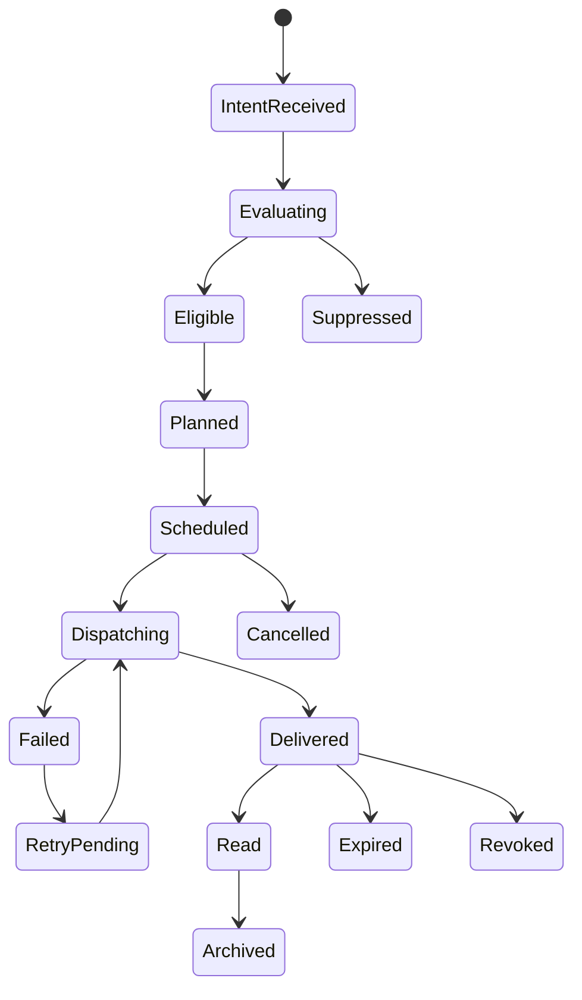

# Notification and Reminders（通知与提醒系统）

> Status: V1  
> Category: Player  
> Path: `design/systems/player/notification-and-reminders.md`  
> Owner: TBD  
> Reviewers: Product / UX / Design / Engineering / Privacy / Security / Legal / Accessibility / Data / Support / Live Operations  
> Last Updated: 2026-07-11  
> Version: 1.0  
> Risk Level: High  
> Dependencies: Settings and Preferences, Save and Persistence, Game State and Flow, Content Lifecycle, Objectives and Quests, Reward System, Social and Multiplayer, Account and Privacy  
> Affected Systems: Tutorial and Onboarding, Live Operations, Monetization, Moderation and Safety, Analytics and Telemetry, Experiment Management, Entitlement and Ownership

---

## 1. System Summary

Notification and Reminders 系统负责定义：

```text
什么事件值得打断玩家；
通知通过什么渠道送达；
何时发送；
发送给谁；
如何尊重权限、偏好、时区和安静时段；
如何去重、合并、限频、过期、撤销和更新；
通知点击后应进入哪里；
发送失败后如何恢复；
通知如何避免骚扰、操纵、泄露和误导。
```

通知系统通常覆盖：

- In-App Banner；
- Inbox；
- Badge；
- Toast；
- Modal；
- Push Notification；
- Email；
- SMS；
- Platform Notification；
- Calendar Reminder；
- Security Alert；
- Social Notification；
- Event Reminder；
- Reward Reminder；
- Service Message；
- Commercial Message；
- Moderation and Safety Message。

提醒是通知的一种特殊形式。

提醒通常基于：

```text
未来时间
+
玩家未完成状态
+
明确可执行下一步
```

而不是单纯重复宣传。

健康的通知系统应让玩家感受到：

```text
重要信息不会错过；
不重要的信息不会反复打扰；
我可以控制渠道和类别；
系统尊重我的时间、时区和隐私；
点击后会到达正确位置；
关闭和拒绝会真实生效。
```

---

## 2. Purpose

### 2.1 Player Value

该系统帮助玩家：

- 及时获知安全和服务问题；
- 获知好友、队伍和社交变化；
- 记住自己明确关注的目标；
- 在活动、奖励和任务到期前获得合理提醒；
- 了解内容开放、返场和维护；
- 从中断后恢复上下文；
- 控制通知频率、渠道和安静时段；
- 避免因错过短窗口失去高价值内容；
- 在通知点击后直接执行下一步。

### 2.2 Experience Contribution

通知系统直接影响：

- 信任；
- 回归；
- 节奏；
- 安全；
- 社交；
- FOMO；
- 注意力；
- 隐私；
- 留存；
- 品牌感受。

不健康的通知会造成：

- 通知疲劳；
- 权限拒绝；
- 关闭应用；
- 屏蔽邮件；
- 品牌失信；
- 活动焦虑；
- 商业骚扰；
- 社交压力；
- 隐私泄露；
- 深链错误；
- 安全提醒被噪音淹没。

### 2.3 Product Value

统一通知系统可以：

- 降低各功能重复发送；
- 统一渠道和模板；
- 建立频率和优先级治理；
- 遵守隐私、平台和法律要求；
- 支持撤销和更新；
- 支持跨设备状态；
- 支持运营和事件通信；
- 支持安全事故通知；
- 支持实验但不越过玩家偏好；
- 降低 Support 压力；
- 提高关键消息送达质量。

### 2.4 Why This System Exists

缺少统一通知框架时，常见问题包括：

```text
每个系统独立发通知；
同一事件在多个渠道重复触达；
通知权限关闭后仍发送邮件；
活动已结束但提醒仍到达；
玩家正在使用功能时仍收到相同 Push；
同一好友请求反复提醒；
通知点击后进入错误页面；
营销通知挤压安全提醒；
安静时段只在客户端生效；
删除账户后旧设备继续收到通知。
```

---

## 3. Non-Goals

该系统不负责：

- 代替完整 Inbox 或任务系统；
- 直接完成业务操作；
- 直接发放奖励；
- 替代客户支持；
- 替代平台通知权限；
- 通过大量通知强迫回归；
- 将所有事件都升级为 Push；
- 将商业消息伪装为系统安全提醒；
- 利用失败、焦虑、孤独或疲劳触发高压营销；
- 使用通知替代清晰的产品内信息架构；
- 保证外部渠道 100% 送达；
- 在未获授权时发送非必要通知。

---

## 4. Governing Principles

### 4.1 Player First Design

参考：

- `../../philosophy/foundation/player-first-design.md`

应用原则：

- 通知必须有明确玩家价值；
- 玩家可以控制非必要类别；
- 关闭和拒绝真实生效；
- 重要信息优先于商业信息；
- 通知不要求玩家随时待命。

### 4.2 Clarity and Feedback

参考：

- `../../philosophy/experience/clarity-and-feedback.md`

应用原则：

- 标题、内容、来源和下一步清楚；
- 到期、撤销和失效状态明确；
- 点击行为可预测；
- 发送失败和订阅状态可解释；
- 不使用模糊倒计时。

### 4.3 Pacing and Rhythm

参考：

- `../../philosophy/experience/pacing-and-rhythm.md`

应用原则：

- 尊重会话、睡眠和现实节奏；
- 高频事件合并；
- 高压活动之间留出安静空间；
- 不在同一时段堆叠多个类别。

### 4.4 Accessibility and Inclusivity

参考：

- `../../philosophy/responsibility/accessibility-and-inclusivity.md`

应用原则：

- 不只依赖声音或颜色；
- 支持读屏和大字体；
- 内容简洁但可展开；
- 重要通知可回看；
- 不要求快速点击才能保留价值。

### 4.5 Ethical Design

参考：

- `../../philosophy/responsibility/ethical-design.md`

应用原则：

- 不使用虚假紧迫感；
- 不利用心理脆弱状态；
- 营销、社交和安全通知明确区分；
- 儿童账户默认更克制；
- 隐私和同意优先于触达指标。

---

## 5. Player Experience

### 5.1 Player Goal

玩家使用通知系统通常为了：

- 查看发生了什么；
- 确认是否重要；
- 快速进入相关内容；
- 标记已读；
- 稍后处理；
- 关闭某类提醒；
- 设置安静时段；
- 撤销订阅；
- 查找历史；
- 报告错误通知。

### 5.2 Entry

通知入口包括：

- 系统通知栏；
- App Icon Badge；
- In-App Inbox；
- Toast；
- Banner；
- Modal；
- Email；
- SMS；
- Calendar；
- Platform Message；
- Security Center；
- Social Center。

### 5.3 Main Actions

玩家可以：

- Open；
- Mark Read；
- Mark Unread；
- Dismiss；
- Snooze；
- Mute Category；
- Disable Channel；
- Adjust Frequency；
- Set Quiet Hours；
- Unsubscribe；
- Report；
- Follow Deep Link；
- Archive；
- Delete；
- View Details。

### 5.4 Core Decisions

关键决策包括：

- 是否允许某渠道；
- 哪些类别保留；
- 是否稍后提醒；
- 是否点击进入；
- 是否关闭营销或社交；
- 是否允许紧急安全通知绕过 Quiet Hours；
- 是否清除 Badge；
- 是否保留历史。

### 5.5 Success

健康体验意味着：

- 重要通知及时到达；
- 非重要通知不过度；
- 同一事件不会重复轰炸；
- 通知点击进入正确位置；
- 已处理状态在多设备一致；
- 过期通知不会误导；
- 玩家可以快速调整偏好；
- 安静时段和权限真实生效。

### 5.6 Failure

失败包括：

- 未送达；
- 延迟过久；
- 重复；
- 错误受众；
- 错误时区；
- 活动结束后仍发送；
- 深链失效；
- Badge 不清除；
- 关闭类别仍发送；
- 安全消息被营销覆盖；
- 私密内容显示在锁屏；
- 多设备状态冲突。

---

## 6. System Boundary

### 6.1 Inputs

系统接收：

- Notification Intent；
- Domain Event；
- Player State；
- Account State；
- Notification Preferences；
- Platform Permission；
- Quiet Hours；
- Time Zone；
- Locale；
- Device State；
- Content Availability；
- Objective State；
- Reward State；
- Social State；
- Security State；
- Live Operations Schedule；
- Experiment Assignment；
- Legal and Age Context。

### 6.2 Outputs

系统产生：

- Notification Instance；
- Delivery Plan；
- Channel Selection；
- Scheduled Delivery；
- In-App Message；
- Badge State；
- Delivery Attempt；
- Delivery Result；
- Read State；
- Dismiss State；
- Snooze State；
- Deep Link；
- Cancellation；
- Notification Event；
- Player-Facing History。

### 6.3 Owned State

系统拥有：

- Notification Definition；
- Notification Instance；
- Delivery Plan；
- Delivery State；
- Read State；
- Dismiss State；
- Snooze State；
- Frequency State；
- Dedupe State；
- Aggregation State；
- Expiry State；
- Cancellation State；
- Badge State；
- Notification History；
- Notification Version。

### 6.4 Read-Only Dependencies

系统读取：

- Settings and Preferences；
- Account and Privacy；
- Content Lifecycle；
- Objectives；
- Reward；
- Social；
- Security；
- Save；
- Time；
- Platform；
- Device；
- Live Operations。

### 6.5 Write Dependencies

系统通过正式契约请求：

- Platform Push Service 发送；
- Email / SMS Provider 发送；
- App Inbox 持久化；
- Badge Service 更新；
- Save 保存状态；
- Account 更新订阅；
- Deep Link Router 打开目标；
- Analytics 记录非敏感结果；
- Support 查看送达与失败。

### 6.6 Out of Scope

通知系统不直接：

- 修改资源余额；
- 完成任务；
- 发放奖励；
- 更改权益；
- 处理支付；
- 自动接受好友或队伍；
- 绕过平台权限；
- 在通知点击前执行不可逆操作。

---

## 7. Core Entities and Concepts

| Entity / Concept | Definition | Owner | Lifetime | Notes |
|---|---|---|---|---|
| Notification Definition | 通知规则和模板定义 | Notification | 版本级 | 唯一 ID |
| Notification Intent | 某领域希望触达玩家的请求 | Domain | 瞬时 | 不保证发送 |
| Notification Instance | 一次具体通知 | Notification | 至归档 | 唯一 ID |
| Delivery Plan | 渠道、时间、优先级和策略 | Notification | 实例级 | 评估偏好后产生 |
| Channel | In-App、Push、Email 等 | Notification / Platform | 定义级 | 有独立权限 |
| Priority | 通知重要程度 | Notification | 实例级 | 不等同商业价值 |
| Dedupe Key | 去重身份 | Notification | 短期或实例期 | 防重复 |
| Aggregation Group | 可合并通知组 | Notification | 时间窗 | 如多条社交消息 |
| Frequency Budget | 玩家或类别频率预算 | Notification | 周期级 | 多系统共享 |
| Quiet Hours | 玩家不希望被打扰的时间 | Settings | 长期 | Notification 读取 |
| Expiry | 通知失效时间 | Notification | 实例级 | 失效后不应投递 |
| Deep Link | 点击后的安全目标 | Game State / Notification | 实例级 | 需要验证 |
| Delivery Attempt | 一次渠道发送尝试 | Notification | 审计期 | 可重试 |
| Delivery Receipt | Provider 或客户端送达结果 | Notification | 短期或审计期 | 不保证已读 |
| Read State | 玩家是否打开或标记已读 | Notification | 长期或历史期 | 跨设备同步 |
| Cancellation | 对已计划或已发送通知的撤销 | Notification | 实例级 | 视渠道支持 |
| Inbox Item | App 内持久化消息 | Notification | 按保留期 | 可回看 |

---

## 8. Notification Taxonomy

### 8.1 Security Notification

例如：

- 登录异常；
- 密码变化；
- 支付风险；
- 账户恢复；
- 家长控制变化。

最高优先级之一。

### 8.2 Service Notification

例如：

- 维护；
- 服务中断；
- 版本要求；
- 存档风险；
- 权益异常。

### 8.3 Transaction Notification

例如：

- 购买结果；
- 退款；
- 奖励恢复；
- 订阅状态；
- 资产变化。

### 8.4 Social Notification

例如：

- 好友请求；
- 队伍邀请；
- 公会；
- 私信；
- 提及；
- Moderation Result。

### 8.5 Content Notification

例如：

- 新内容；
- 返场；
- 内容开放；
- 下载完成。

### 8.6 Objective Reminder

例如：

- 任务即将到期；
- 玩家明确追踪的目标；
- 预定提醒。

### 8.7 Reward Reminder

例如：

- 高价值奖励未领取；
- 邮件即将过期；
- 容量问题。

### 8.8 Event Notification

例如：

- 活动开始；
- 阶段解锁；
- 结束提醒；
- 排名结算。

### 8.9 Community Notification

例如：

- 公告；
- 社区活动；
- 更新说明。

### 8.10 Commercial Notification

例如：

- 商品；
- 优惠；
-订阅；
-促销。

必须与服务和交易消息明确分离。

---

## 9. Reminder Taxonomy

### 9.1 User-Created Reminder

由玩家明确创建。

### 9.2 Follow-Up Reminder

玩家选择“稍后提醒”。

### 9.3 Deadline Reminder

在明确截止前提醒。

### 9.4 State-Based Reminder

只有在状态仍未完成时发送。

### 9.5 Recurring Reminder

按周期重复。

### 9.6 Contextual Reminder

进入相关环境或重新打开产品时出现。

### 9.7 Recovery Reminder

提醒继续中断流程。

### 9.8 Safety Reminder

提醒完成账户保护或家长设置。

---

## 10. Notification Definition Template

```markdown
## Notification Definition

- Notification ID:
- Display Name:
- Category:
- Player Value:
- Source System:
- Trigger:
- Audience:
- Priority:
- Channels:
- Required / Optional:
- Dedupe Key:
- Aggregation:
- Frequency Budget:
- Quiet Hours Policy:
- Expiry:
- Cancellation:
- Deep Link:
- Privacy Classification:
- Age Restrictions:
- Template Version:
- Owner:
- Risk Level:
```

### 10.1 必须回答

- 为什么值得触达；
- 是否必须打断；
- 可通过哪些渠道；
- 是否需要同意；
- 是否可在 Quiet Hours 发送；
- 如何去重；
- 何时失效；
- 点击后去哪里；
- 状态变化后如何撤销；
- 是否包含敏感信息。

---

## 11. Notification Intent

领域系统只应提交 Intent，而不是直接调用渠道。

推荐结构：

```markdown
| Field | Meaning |
|---|---|
| Intent ID | 唯一请求 |
| Definition ID | 通知定义 |
| Recipient | 接收者 |
| Source Event | 来源事件 |
| Context | 业务上下文 |
| Earliest Send | 最早时间 |
| Latest Send | 最晚时间 |
| Dedupe Key | 去重键 |
| Correlation ID | 跨系统追踪 |
| Version | 规则版本 |
```

### 11.1 Intent Does Not Guarantee Delivery

通知系统还要评估：

- 玩家偏好；
- 权限；
- 安静时段；
- 频控；
- 当前状态；
- 去重；
- 过期；
- 渠道；
- 风险。

---

## 12. Notification Lifecycle

```text
Intent Received
→ Evaluating
→ Eligible
→ Planned
→ Scheduled
→ Dispatching
→ Delivered
→ Read
→ Archived
```

异常：

```text
Evaluating
→ Suppressed
Scheduled
→ Cancelled
Dispatching
→ Failed
Failed
→ Retry Pending
Delivered
→ Expired
Delivered
→ Revoked or Updated
```



---

## 13. State Definitions

### 13.1 Intent Received

收到领域请求。

### 13.2 Evaluating

评估资格、偏好、频控和时机。

### 13.3 Suppressed

因规则不发送。

### 13.4 Eligible

可发送。

### 13.5 Planned

渠道和内容已确定。

### 13.6 Scheduled

等待发送时间。

### 13.7 Dispatching

正在调用渠道。

### 13.8 Delivered

Provider 或客户端确认已接受。

不等于玩家已看到。

### 13.9 Read

玩家打开或标记已读。

### 13.10 Failed

确定发送失败。

### 13.11 Retry Pending

等待重试。

### 13.12 Cancelled

发送前已取消。

### 13.13 Expired

已失去业务价值。

### 13.14 Revoked

发送后内容被撤回或标记无效。

### 13.15 Archived

保留历史但不再活跃。

---

## 14. Notification Invariants

1. 同一业务事件不应因重试生成无限重复通知。
2. Notification Intent 必须幂等。
3. Expired 通知不能继续外发。
4. 已关闭的可选类别不能通过其他普通渠道绕过。
5. 安全、服务、交易和营销类别必须分离。
6. Provider Accepted 不等于玩家 Read。
7. Deep Link 打开前必须重新验证资格和内容状态。
8. 通知点击不能直接执行不可逆业务操作。
9. Quiet Hours 和频控必须在服务端或权威层执行。
10. 通知模板不能暴露超出渠道安全级别的信息。
11. Analytics 失败不影响正常发送或取消。
12. 删除账户后不得继续发送非必要通知。
13. 用户已处理事件后，应抑制尚未发送的相关提醒。
14. Commercial Notification 不能伪装为 Security 或 Service。
15. 多设备 Read State 应最终一致。

---

## 15. Channel Model

### 15.1 In-App Toast

适合：

- 即时轻量反馈；
- 当前会话信息。

### 15.2 In-App Banner

适合：

- 需要注意但不阻塞的消息。

### 15.3 Modal

只适合：

- 高风险；
- 必须确认；
- 法律；
- 安全；
- 无法继续。

### 15.4 Inbox

适合：

- 可回看；
- 详细；
- 跨会话；
- 奖励和系统消息。

### 15.5 Badge

表示未处理数量或状态。

### 15.6 Push

适合：

- 产品外重要提醒；
- 玩家明确允许的类别。

### 15.7 Email

适合：

- 安全；
- 交易；
- 长内容；
- 账户；
- 合法营销订阅。

### 15.8 SMS

只用于：

- 高风险安全；
- 明确授权；
- 法律允许。

### 15.9 Platform Notification

由平台提供。

### 15.10 Calendar

只在玩家明确添加时使用。

---

## 16. Channel Selection

渠道选择应考虑：

- 重要性；
- 紧迫性；
- 内容长度；
- 隐私；
- 玩家偏好；
- 平台权限；
- 时区；
- 当前在线状态；
- 设备可用性；
- 送达成本；
- 法律；
- 年龄；
- 频率。

### 16.1 Online Suppression

玩家当前正在处理相关内容时，可以抑制外部 Push，改用 In-App。

### 16.2 Multi-Channel Escalation

只适用于少数高风险情况。

例如：

```text
Security Alert
→ In-App
→ Email
→ 必要时 SMS
```

### 16.3 Avoid Channel Flood

同一普通消息不应无差别通过所有渠道发送。

---

## 17. Required vs Optional Notifications

### 17.1 Required

可能包括：

- 安全；
- 交易；
- 法律；
- 服务必要信息；
- 账户变更；
- 家长控制。

### 17.2 Optional

包括：

- 活动；
- 社交；
- 奖励；
- 内容；
- 商业；
- 一般提醒。

### 17.3 Required Does Not Mean Unbounded

必要通知仍需：

- 最小化；
- 清楚；
- 仅用于必要目的；
- 不附带不相关营销。

### 17.4 Opt-Out

可选通知必须可关闭。

---

## 18. Permission and Preference

有效发送条件：

```text
Platform Permission
+
Account Consent
+
Category Preference
+
Channel Preference
+
Current Policy
=
Effective Delivery Permission
```

### 18.1 Platform Permission

例如 Push、SMS、系统通知。

### 18.2 Product Preference

应用内类别和渠道设置。

### 18.3 Consent

营销和某些数据驱动触达需要明确同意。

### 18.4 Permission Request

应在玩家理解价值时请求，而不是首次启动立即索取全部权限。

### 18.5 Denied Permission

拒绝后：

- 不重复高频弹窗；
- 提供设置入口；
- 不羞辱；
- 不降低核心功能；
- 不用假系统弹窗诱导开启。

---

## 19. Priority Model

推荐等级：

### P0 — Critical

- 安全；
- 资产风险；
- 法律要求；
- 严重服务问题。

### P1 — High

- 交易结果；
- 重要社交邀请；
- 高价值到期；
- 账号恢复。

### P2 — Normal

- 任务；
- 内容；
- 奖励；
- 活动。

### P3 — Low

- 一般更新；
- 社区；
- 建议；
- 低价值提醒。

### P4 — Commercial

- 营销；
- 促销；
- 商品推荐。

### 19.1 Priority Is Not Revenue

商业价值不能提高到安全优先级。

### 19.2 Priority Effects

影响：

- 频率预算；
- Quiet Hours；
- 聚合；
- 渠道；
- 展示；
- 重试；
- 保留期。

---

## 20. Quiet Hours

### 20.1 Definition

玩家不希望被外部渠道打扰的时间范围。

### 20.2 Scope

可以按：

- Push；
- Email；
- SMS；
- Social；
- Commercial；
- All Optional。

### 20.3 Time Zone

基于玩家当前或指定时区。

### 20.4 Travel

时区变化时需要：

- 自动更新；
- 或使用固定时区；
- 并明确策略。

### 20.5 Exceptions

只有：

- Critical Security；
- 明确法律或账户风险；

可考虑绕过。

### 20.6 Deferred Delivery

Quiet Hours 内的通知可以：

- 延迟；
- 聚合；
- 转为 Inbox；
- 过期后取消。

---

## 21. Scheduling

### 21.1 Scheduling Types

- Immediate；
- Earliest / Latest Window；
- Fixed Time；
- Relative Delay；
- Recurring；
- Event-Based；
- State-Based；
- Local-Time Reminder。

### 21.2 Authority

使用权威时间。

### 21.3 Local Time Semantics

例如：

```text
每天晚上 8 点
```

应明确：

- 随本地时区变化；
- 还是固定原时区；
- 夏令时如何处理。

### 21.4 Schedule Update

状态变化后需要：

- 重算；
- 取消；
- 延后；
- 更新。

### 21.5 No Stale Scheduling

活动取消或任务完成后，相关提醒必须取消。

---

## 22. Reminder State Validation

发送前重新检查：

- 目标是否仍未完成；
- 内容是否仍可用；
- 奖励是否仍未领取；
- 截止时间是否仍有效；
- 玩家是否已关闭类别；
- 玩家是否正在使用相关内容；
- 深链是否仍可打开；
- 是否已经发送同类消息。

### 22.1 Last-Mile Validation

即使很早已排期，也要在 Dispatch 前重新验证。

---

## 23. Frequency Control

### 23.1 Frequency Dimensions

- 每玩家；
- 每渠道；
- 每类别；
- 每来源系统；
- 每活动；
- 每时间窗；
- 全局。

### 23.2 Frequency Budget

不同系统共享统一预算，避免：

```text
每个系统各自认为只发送一条，
玩家却收到十条。
```

### 23.3 Cooldown

相同或相近通知之间有冷却。

### 23.4 Daily / Weekly Cap

可对可选通知设置上限。

### 23.5 Adaptive Reduction

玩家连续忽略或关闭时，可降低频率。

不能通过更激进文案继续骚扰。

---

## 24. Dedupe

### 24.1 Dedupe Key

通常由：

```text
Recipient
+
Notification Definition
+
Source Entity
+
Business State
+
Time Window
```

构成。

### 24.2 Dedupe Window

定义多长时间内视为重复。

### 24.3 Cross-Channel Dedupe

同一事件跨 Push、Email、Inbox 需要协调。

### 24.4 Retry Does Not Create New Notification

发送重试使用同一 Instance。

---

## 25. Aggregation

### 25.1 Use Cases

- 多个好友请求；
- 多条消息；
- 多项奖励；
- 多个任务完成；
- 多个活动更新。

### 25.2 Aggregation Window

例如：

- 5 分钟；
- 1 小时；
- Quiet Hours 结束后。

### 25.3 Aggregated Message

应说明：

- 数量；
- 主要类别；
- 最近事件；
- 点击后的列表入口。

### 25.4 Do Not Aggregate Critical

安全和重要交易通常独立发送。

---

## 26. Suppression Rules

可抑制的情况：

- 玩家正在相关页面；
- 已处理；
- 已读；
- 已取消；
- 已过期；
- 相同事件已发送；
- 类别关闭；
- 频控达到；
- 内容不可用；
- Quiet Hours；
- 玩家已退出或删除账户；
- 当前设备不安全展示。

### 26.1 Suppression Reason

必须记录原因，便于分析和 Support。

### 26.2 Suppressed Does Not Mean Lost

必要时可转为：

- Inbox；
- Digest；
- 延迟发送；
- 历史记录。

---

## 27. Expiry

### 27.1 Expiry Purpose

防止过期信息继续误导。

### 27.2 Expiry Types

- Hard Expiry；
- Soft Expiry；
- Content Expiry；
- Action Expiry；
- Display Expiry；
- Delivery Expiry。

### 27.3 Expired Behavior

- 不再外发；
- Inbox 标记失效；
- Deep Link 转为安全说明；
- Badge 更新；
- 不再重试。

### 27.4 No Fake Urgency

Expiry 必须来自真实业务状态。

---

## 28. Cancellation and Revocation

### 28.1 Cancellation

在发送前取消。

### 28.2 Revocation

发送后声明无效。

### 28.3 Causes

- 活动取消；
- 任务完成；
- 奖励领取；
- 社交邀请撤回；
- 内容下架；
- 安全误报；
- 时间配置错误。

### 28.4 Channel Capability

不同渠道支持能力不同：

- In-App 可以删除或更新；
- Push 通常无法完全撤回；
- Email 通常不能撤回；
- Badge 可以更新；
- Inbox 可以标记无效。

### 28.5 Follow-Up Correction

无法撤回时，必要时发送更正，但应避免造成第二次困扰。

---

## 29. Notification Templates

### 29.1 Template Components

- Title；
- Body；
- Category Label；
- Sender；
- Timestamp；
- Expiry；
- Primary Action；
- Secondary Action；
- Deep Link；
- Accessibility Label；
- Privacy Level。

### 29.2 Template Versioning

每个 Instance 记录 Template Version。

### 29.3 Localization

模板支持：

- 语言；
- 复数；
- 日期；
- 数字；
- 时区；
- 文本方向；
- 截断；
- 字体。

### 29.4 Personalization

仅使用必要且已授权的数据。

### 29.5 Avoid Sensitive Lock-Screen Content

锁屏文案应根据隐私级别降级。

---

## 30. Content Design

### 30.1 Good Notification

包含：

```text
发生了什么
+
为什么重要
+
玩家可以做什么
```

### 30.2 Avoid Ambiguity

不使用：

- “快回来！”
- “你错过了！”
- “大家都在等你！”
- “最后机会！”

除非准确且符合伦理。

### 30.3 Actionable

点击后应到达可执行位置。

### 30.4 Honest Urgency

只有真实紧急时使用紧急语言。

### 30.5 Tone

不同类别应有稳定语气：

- 安全：清楚、冷静；
- 服务：准确；
- 社交：中性；
- 活动：积极但不过度；
- 商业：明确标记。

---

## 31. Deep Links

### 31.1 Deep Link Components

- Route；
- Target ID；
- Context；
- Required State；
- Fallback；
- Expiry；
- Version；
- Security Token Reference。

### 31.2 Open Flow

```text
Notification Opened
→ Authenticate
→ Validate Account
→ Validate Content
→ Validate Permission
→ Validate Version
→ Resolve Route
→ Open Target or Fallback
```

### 31.3 Fallback

目标失效时：

- 打开相关列表；
- 打开历史；
- 显示已结束说明；
- 回到安全主页。

### 31.4 No Irreversible Action

不能通过点击通知直接：

- 购买；
- 删除；
- 接受交易；
- 接受好友；
- 消耗资源。

必须进入确认流程。

### 31.5 Deep Link Security

防止：

- 参数篡改；
- 越权；
- 跨账户；
- 旧 Token；
- 外部伪造。

---

## 32. Inbox

### 32.1 Inbox Purpose

提供：

- 可回看历史；
- 详细信息；
- 不适合 Push 的内容；
- 重要系统消息；
- 奖励和交易记录。

### 32.2 Inbox Categories

- System；
- Security；
- Transactions；
- Social；
- Rewards；
- Events；
- Community；
- Commercial。

### 32.3 Inbox State

- Unread；
- Read；
- Action Pending；
- Completed；
- Expired；
- Revoked；
- Archived。

### 32.4 Retention

每类消息定义保留期。

### 32.5 Inbox Is Not Reward Storage

奖励应由 Reward System 持有，Inbox 只展示和触发领取。

---

## 33. Badge

### 33.1 Badge Types

- Numeric；
- Dot；
- Priority Indicator；
- Category Badge。

### 33.2 Badge Source

Badge 应基于：

- Unread；
- Action Pending；
- Critical State；

而不是简单累计全部历史。

### 33.3 Clear Rules

打开应用不一定自动清除全部。

### 33.4 Multi-Device

Read / Action State 同步后 Badge 最终一致。

### 33.5 Avoid Badge Anxiety

不要为低价值营销长期显示红点。

---

## 34. Read and Dismiss State

### 34.1 Read

玩家查看内容。

### 34.2 Dismiss

玩家关闭当前展示。

### 34.3 Completed

相关动作已经完成。

### 34.4 Archive

移出主要列表但保留历史。

### 34.5 Delete

从玩家可见历史删除，受政策和审计要求约束。

### 34.6 State Sync

多设备状态应最终一致。

---

## 35. Snooze

### 35.1 Snooze Options

- 15 分钟；
- 1 小时；
- 今晚；
- 明天；
- 自定义；
- 截止前；
- 不再提醒。

### 35.2 Eligibility

只适合仍有未来价值的提醒。

### 35.3 State Change

Snooze 期间如果目标完成，应取消。

### 35.4 Frequency

反复 Snooze 不应产生重复实例。

---

## 36. Digest

### 36.1 Digest Purpose

将低紧迫性信息合并。

### 36.2 Digest Types

- Daily；
- Weekly；
- Session End；
- Quiet Hours End；
- Social；
- Content；
- Account Summary。

### 36.3 Digest Composition

优先：

- 安全和服务摘要；
- 玩家追踪目标；
- 未处理动作；
- 新内容；
- 低优先级更新。

### 36.4 Commercial Separation

营销 Digest 与服务 Digest 分开。

---

## 37. Security Notifications

### 37.1 Requirements

必须：

- 清楚说明事件；
- 提供时间和设备摘要；
- 提供保护动作；
- 提供非通知入口；
- 避免泄露完整敏感信息；
- 可验证来源。

### 37.2 Urgency

可以绕过部分 Quiet Hours，但只在真实风险下。

### 37.3 Phishing Protection

通知不应要求：

- 回复密码；
- 发送验证码；
- 点击不明外链；
- 通过非官方渠道付款。

### 37.4 Account Lock

通知点击只进入安全中心，不直接执行解锁或交易。

---

## 38. Transaction Notifications

包括：

- 购买；
- 退款；
- 订阅；
- 奖励恢复；
- 付费货币变化；
- 权益变化。

### 38.1 Required Information

- 事件；
- 时间；
- 状态；
- 金额或内容摘要；
- 账户；
- 支持入口；
- 是否需要行动。

### 38.2 No Marketing Attachment

交易通知不应夹带无关营销。

---

## 39. Social Notifications

### 39.1 Social Types

- Friend Request；
- Party Invite；
- Message；
- Mention；
- Guild；
- Match；
- Moderation Result。

### 39.2 Privacy

锁屏不应显示敏感消息内容，除非玩家允许。

### 39.3 Safety

支持：

- Mute；
- Block；
- Report；
- Category Disable；
- Sender Control。

### 39.4 Invite Expiry

邀请过期后：

- 不再 Push；
- Deep Link 显示已过期；
- Badge 更新。

### 39.5 Anti-Spam

同一发送者和同类邀请需限频。

---

## 40. Objective and Reward Reminders

### 40.1 Objective Reminder

只有在：

- 玩家明确追踪；
- 目标仍可完成；
- 时间真实有限；
- 下一步清楚；

时发送。

### 40.2 Reward Reminder

适用于：

- 高价值未领取；
- 即将真实过期；
- 容量阻塞；
- 玩家明确选择稍后。

### 40.3 Avoid Manufactured Loss

不应故意缩短领取窗口再通过通知制造压力。

### 40.4 Completion Suppression

完成或领取后立即取消相关提醒。

---

## 41. Event Notifications

### 41.1 Event Stages

- Announced；
- Starting；
- Active；
- Milestone；
- Ending；
- Grace；
- Result；
- Returned。

### 41.2 Stage Budget

每个活动不应在每个阶段都对所有玩家 Push。

### 41.3 Relevance

根据：

- 玩家资格；
- 明确关注；
- 已参与；
- 未完成；
- 地区；
- 平台；

判断。

### 41.4 Event Cancelled

必须取消或更正已排期通知。

---

## 42. Commercial Notifications

### 42.1 Consent

必须符合：

- 营销同意；
- 渠道同意；
- 地区法律；
- 年龄；
- 频控；
- 退订。

### 42.2 Labeling

明确标识：

- Offer；
- Promotion；
- Sponsored；
- Store。

### 42.3 Prohibited Triggers

不应在以下状态利用性触发：

- 连续失败；
- 深夜；
- 疲劳；
- 资产损失焦虑；
- 社交排斥；
- 儿童独立使用；
- 刚拒绝权限或购买。

### 42.4 Unsubscribe

应简单、真实、快速生效。

---

## 43. Local Notifications

### 43.1 Use Cases

- 玩家创建提醒；
- 单机进度；
- 下载完成；
- 明确的本地计划。

### 43.2 Risks

- 设备时钟；
- 时区；
- 应用卸载；
- 状态已改变但无法取消；
- 多设备重复。

### 43.3 Reconciliation

应用打开时：

- 清理过期；
- 取消已处理；
- 与服务端状态对账；
- 更新 Badge。

### 43.4 High-Value Limit

高价值安全和交易不应只依赖本地通知。

---

## 44. Multi-Device Delivery

### 44.1 Device Selection

可以选择：

- 最近活跃设备；
- 全部设备；
- 当前登录设备；
- 支持 Push 的设备；
- 玩家指定设备。

### 44.2 Duplicate Experience

多设备同时 Push 需要控制。

### 44.3 Read Sync

在一台设备处理后，其他设备：

- 更新 Badge；
- 标记已读；
- 取消本地提醒；
- 保留必要历史。

### 44.4 Device Revocation

登出、删除设备或账户风险时应停止普通通知。

---

## 45. Time Zone and Locale

### 45.1 Time Zone Source

- Account；
- Device；
- Player Selected；
- Region；
- Last Active。

### 45.2 Localized Time

通知中显示：

- 本地时间；
- 明确日期；
- 必要时显示时区。

### 45.3 Travel

短期旅行时，避免错误凌晨发送。

### 45.4 Locale

模板根据：

- 语言；
- 数字；
- 日期；
- 复数；
- 文本方向；

渲染。

---

## 46. Delivery Attempts and Retry

### 46.1 Retryable Failures

- 临时网络；
- Provider Timeout；
- 速率限制；
- 服务暂不可用。

### 46.2 Non-Retryable

- Permission Denied；
- Invalid Token；
- Unsubscribed；
- Expired；
- Deleted Account；
- Permanent Address Failure。

### 46.3 Retry Policy

定义：

- 最大次数；
- Backoff；
- Jitter；
- Latest Send；
- Priority；
- Provider；
- Fallback Channel。

### 46.4 No Retry After Expiry

过期后停止。

### 46.5 Idempotency

Provider 重试必须使用稳定 Instance 和外部幂等键。

---

## 47. Delivery Receipt

### 47.1 States

- Accepted；
- Delivered；
- Displayed；
- Opened；
- Failed；
- Bounced；
- Suppressed。

### 47.2 Limitations

不同渠道支持不同 Receipt。

### 47.3 No False Read

Email 像素或 Push Receipt 不等同真实阅读。

### 47.4 Privacy

避免使用侵入式追踪确认阅读，尤其在无同意情况下。

---

## 48. Failure and Recovery

| Failure | Cause | Player Impact | Recovery | Data Guarantee |
|---|---|---|---|---|
| Intent Lost | 领域事件未进入系统 | 未提醒 | 事件重放或状态扫描 | 业务事实保留 |
| Duplicate Intent | 重试 | 多条通知 | Dedupe / Idempotency | 单一 Instance |
| Provider Failure | 外部服务异常 | 未送达 | Backoff、Fallback、Inbox | 不重复业务动作 |
| Stale Notification | 状态已变化 | 误导 | Dispatch 前验证、取消 | 原状态不修改 |
| Deep Link Invalid | 内容下架或版本变化 | 无法进入 | Fallback Route | 不执行业务动作 |
| Preference Desync | 设置不同步 | 错误发送 | 权威查询、停止、审计 | 玩家选择保留 |
| Quiet Hours Error | 时区或逻辑错误 | 深夜打扰 | 延迟、修正、道歉 | 记录影响 |
| Badge Stuck | Read State 不同步 | 持续红点 | 重算 Badge | 历史保留 |
| Sensitive Preview Leak | 锁屏模板错误 | 隐私泄露 | 关闭预览、更新模板 | 安全事件审计 |
| Cancellation Failure | Provider 不支持撤回 | 错误通知仍显示 | 更正、Inbox 标记失效 | 原通知可追踪 |
| Deleted Account Delivery | Token 未清理 | 继续骚扰 | Token Revoke、Tombstone | 删除意图保留 |
| Recurring Reminder Drift | 时区或 DST | 错误时间 | 重算下次计划 | 原规则保留 |

---

## 49. Edge Cases

### Scheduling

- 跨时区；
- 夏令时；
- 设备时间错误；
- 活动延期；
- 结束时间改变；
- Quiet Hours 跨午夜；
- 计划时间已过去。

### State

- 通知发送瞬间任务完成；
- 奖励领取和 Dispatch 同时发生；
- 邀请撤回；
- 内容下架；
- 账户登出；
- 设备被移除。

### Permissions

- 平台权限关闭；
- 产品偏好开启；
- 营销同意撤回；
- 儿童账户转成年；
- 地区法律变化；
- Email 退订但 Push 允许。

### Multi-Device

- 一台设备离线；
- 同时打开通知；
- 不同账户共享设备；
- Push Token 重复；
- 旧设备未注销；
- Badge 状态冲突。

### Deep Link

- 目标版本不兼容；
- 需要登录；
- 需要下载内容；
- 已过期；
- 无资格；
- 角色或队伍状态不满足；
- 外部 URL 被篡改。

---

## 50. Cross-System Dependencies

| System | Dependency Type | Direction | Data or Event | Failure Impact |
|---|---|---|---|---|
| Settings and Preferences | Critical | Settings → Notification | Permission / Preference | 错误触达 |
| Save and Persistence | Hard | 双向 | Read / Schedule / History | 状态丢失 |
| Game State and Flow | Hard / Soft | 双向 | Online Context / Deep Link | 路由错误 |
| Content Lifecycle | Hard / Soft | Content → Notification | Availability / Expiry | 过期通知 |
| Objectives and Quests | Soft / Hard | Objectives → Notification | Deadline / Completion | 任务误提醒 |
| Reward System | Soft / Hard | Reward → Notification | Unclaimed / Expiry | 奖励误提醒 |
| Social and Multiplayer | Hard / Soft | Social → Notification | Invite / Message | 隐私与骚扰风险 |
| Account and Privacy | Critical | 双向 | Consent / Age / Deletion | 合规风险 |
| Moderation and Safety | Hard | Safety → Notification | Enforcement / Appeal | 安全信息缺失 |
| Live Operations | Hard / Soft | Live → Notification | Schedule / Event | 活动错误 |
| Analytics and Telemetry | Soft | Notification → Analytics | Delivery Events | 不阻断 |
| Experiment Management | Soft / Hard | 双向 | Template / Timing | 偏好被覆盖 |

---

## 51. Data and Persistence

| State | Persistent | Authority | Save Trigger | Retention | Recovery |
|---|---|---|---|---|---|
| Notification Definition | 是 | Notification | 配置发布 | 版本期 | Last Known Good |
| Notification Instance | 是 | Notification | 创建 | 至归档后审计期 | Intent 重建 |
| Delivery Plan | 是 | Notification | 计划生成 | 实例期 | 重新评估 |
| Delivery Attempt | 是 | Notification | 每次尝试 | 审计期 | 重试 |
| Read / Dismiss State | 是 | Notification | 状态变化 | 历史期 | 多设备合并 |
| Snooze State | 是 | Notification | Snooze | 至完成或过期 | 重新计划 |
| Dedupe State | 是或缓存 | Notification | Instance 创建 | Dedupe Window | 来源历史 |
| Frequency State | 是 | Notification | 每次计数 | 周期级 | 重算 |
| Badge State | 可重算 | Notification | Read / Pending 变化 | 当前 | 重算 |
| Cancellation State | 是 | Notification | 取消 | 实例期 | Provider 对账 |
| Notification History | 是 | Notification | 关键变化 | 政策期 | 审计 |
| Push Token Reference | 是 | Account / Platform | Token 变化 | 设备期 | 重新注册 |

---

## 52. Accessibility

### 52.1 Visual

- 通知类别、状态和动作有文本；
- 不只依赖颜色；
- 大字体不截断关键动作；
- Badge 有可读替代；
- 锁屏预览可关闭。

### 52.2 Screen Reader

应读取：

- 发送者；
- 类别；
- 标题；
- 正文；
- 时间；
- 主要动作；
- 是否过期；
- 当前状态。

### 52.3 Audio

- 音效不是唯一提醒；
- 音效可独立关闭；
- 关键通知有视觉或触觉替代；
- 不使用突然高强度声音。

### 52.4 Input

- 支持键鼠、手柄、触摸和辅助设备；
- Dismiss 与 Primary Action 清楚分离；
- 不要求精确滑动；
- Snooze 和设置入口易操作。

### 52.5 Cognitive

- 内容简洁；
- 重要信息优先；
- 低优先级聚合；
- 不使用操纵性语言；
- 提供历史；
- 频繁类别可快速关闭。

### 52.6 Timing

- 重要消息可回看；
- 不要求数秒内响应；
- 提醒有真实宽限；
- Quiet Hours 可配置；
- 动画可减弱。

---

## 53. Privacy and Security

### 53.1 Data Minimization

通知只包含完成目的所需信息。

### 53.2 Sensitive Categories

- 安全；
- 支付；
- 私信；
- 健康相关内容；
- 儿童账户；
- 家长控制；
- 位置。

需要更严格模板和渠道。

### 53.3 Lock-Screen Privacy

支持：

- Show Full；
- Show Summary；
- Hide Content；
- Hide All。

### 53.4 Push Tokens

需要：

- 加密存储；
- 设备绑定；
- 失效清理；
- 登出撤销；
- 账户切换隔离。

### 53.5 Email and SMS

验证：

- 地址和号码；
- 同意；
- 退订；
- 频率；
- 发送域；
- 防钓鱼。

### 53.6 Deep Link Security

必须重新鉴权，不信任通知参数。

---

## 54. Ethical Review

### 54.1 FOMO

- 不用虚假倒计时；
- 不夸大损失；
- 核心内容不依赖短通知窗口；
- 未读通知不等于玩家承诺。

### 54.2 Attention

- 不通过不断打断提高留存；
- 不在深夜发送普通营销；
- 不使用高压 Badge；
- 不通过社交比较制造焦虑。

### 54.3 Financial Pressure

- 失败、损失和疲劳后不推高压商业通知；
- 交易通知不夹带营销；
- 优惠条件准确；
- 退订真实有效。

### 54.4 Children and Vulnerable Users

- 营销默认关闭或受限制；
- 社交预览更谨慎；
- 不使用角色责备；
- 家长可控制类别和时段；
- 不根据脆弱状态个性化刺激。

### 54.5 Autonomy

- 关闭和 Snooze 真实有效；
- 权限请求有上下文；
- 不用“允许”作为唯一突出按钮；
- 不反复骚扰已拒绝用户。

---

## 55. Support and Diagnostics

### 55.1 Support View

可查看：

- Notification Instance；
- Definition；
- Eligibility；
- Suppression Reason；
- Delivery Attempts；
- Provider Result；
- Preference Snapshot；
- Deep Link；
- Read State；
- Cancellation；
- Template Version。

### 55.2 Redaction

Support 不应看到：

- 完整私信；
- 密钥；
- Token；
- 未必要敏感数据；
- 完整支付凭据。

### 55.3 Recovery Actions

Support 可以：

- 重新发送必要消息；
- 将消息写入 Inbox；
- 取消错误计划；
- 重算 Badge；
- 修复订阅状态；
- 撤销失效 Token。

需要最小权限和审计。

---

## 56. Analytics and Validation

### 56.1 Key Assumptions

1. 重要通知能够及时送达。
2. 可选通知不会造成过度打扰。
3. 频控和去重能够跨系统生效。
4. Quiet Hours、权限和类别偏好真实生效。
5. Dispatch 前状态验证能减少过期提醒。
6. Deep Link 能进入正确且安全的目标。
7. 多设备 Read 和 Badge 最终一致。
8. 营销、社交、交易和安全消息清楚区分。
9. 通知内容不会泄露敏感信息。
10. 玩家可以轻松关闭和退订。

### 56.2 Validation Plan

| Hypothesis | Evidence | Success | Failure | Method |
|---|---|---|---|---|
| 重要消息可达 | 送达与确认 | 在目标时间窗内 | 大量延迟或缺失 | Delivery Test |
| 不过度打扰 | 频率反馈 | 关闭率和投诉可控 | 大量禁用权限 | Longitudinal Study |
| 去重有效 | 重试场景 | 单一实例 | 多条重复 | Integration Test |
| 偏好真实生效 | 设置测试 | 关闭后停止 | 仍继续发送 | Privacy / QA |
| 状态验证有效 | 完成并等待提醒 | 提醒被取消 | 收到过期消息 | Scenario Test |
| Deep Link 安全 | 过期和越权 | 进入正确 fallback | 越权或崩溃 | Security Test |
| 多设备一致 | 多设备操作 | Badge 和 Read 同步 | 长期冲突 | QA |
| 类别清楚 | 用户复述 | 能区分消息类型 | 商业伪装系统 | Research |
| 隐私安全 | 锁屏测试 | 敏感信息不泄露 | 内容泄露 | Security Review |
| 关闭简单 | 退订任务 | 快速完成 | 找不到入口 | Usability Test |

### 56.3 Behavioral Metrics

- Intent Received；
- Notification Planned；
- Notification Scheduled；
- Notification Suppressed；
- Notification Dispatched；
- Delivery Failed；
- Notification Opened；
- Notification Dismissed；
- Snoozed；
- Category Muted；
- Channel Disabled；
- Unsubscribed；
- Deep Link Resolved；
- Notification Cancelled；
- Badge Cleared。

### 56.4 Outcome Metrics

- Delivery Success；
- Time to Delivery；
- Open Rate；
- Action Completion；
- Duplicate Rate；
- Suppression Accuracy；
- Stale Notification Rate；
- Deep Link Success；
- Quiet Hours Violation；
- Preference Enforcement；
- Unsubscribe Success；
- Complaint Rate；
- Permission Revocation；
- Badge Accuracy。

### 56.5 Negative Metrics

- 重复通知；
- 过期通知；
- 深夜打扰；
- 关闭仍发送；
- 商业消息伪装；
- 锁屏泄露；
- Deep Link 越权；
- Badge 不清除；
- 多设备重复；
- 删除账户后继续发送；
- 邀请骚扰；
- 交易通知缺失；
- 安全通知被频控；
- 营销退订失效。

### 56.6 Event Intents

| Event Intent | Trigger | Key Properties | Privacy Notes |
|---|---|---|---|
| Notification Evaluated | Intent 评估 | Result, Reason, Category | 不记录正文 |
| Delivery Attempted | 渠道调用 | Channel, Result, Latency | 不记录地址全文 |
| Notification Opened | 玩家打开 | Category, Age | 不推断敏感状态 |
| Deep Link Resolved | 路由完成 | Route Type, Result | 不记录 Token |
| Preference Suppressed | 偏好阻止 | Category, Channel | 隐私用途 |
| Quiet Hours Deferred | 延迟 | Category, Delay | 不记录精确位置 |
| Notification Cancelled | 取消 | Reason, Stage | 审计 |
| Unsubscribe Completed | 退订 | Scope, Result | 合规审计 |

---

## 57. Test Strategy

### 57.1 Intent and Dedupe

- 重复 Intent；
- 不同业务状态；
- 多来源系统；
- 跨渠道；
- Provider 重试；
- 幂等。

### 57.2 Scheduling

- Immediate；
- Fixed Time；
- Relative；
- Recurring；
- Quiet Hours；
- 时区；
- DST；
- 活动延期；
- 过期。

### 57.3 Preference and Permission

- 类别关闭；
- 渠道关闭；
- 平台权限拒绝；
- 营销撤回；
- 儿童账户；
- 家长限制；
- 删除账户。

### 57.4 Delivery

- Provider Timeout；
- Bounce；
- Invalid Token；
- Rate Limit；
- Fallback；
- 多设备；
- 离线。

### 57.5 State Validation

- 任务完成；
- 奖励领取；
- 邀请撤回；
- 内容下架；
- 活动结束；
- 账户登出。

### 57.6 Deep Link

- 未登录；
- 版本不兼容；
- 无资格；
- 过期；
- 内容缺失；
- 参数篡改；
- 跨账户。

### 57.7 Accessibility

- 读屏；
- 大字体；
- 高对比；
- 无声音；
- 手柄；
- 触摸；
- Snooze；
- 设置入口。

### 57.8 Privacy and Security

- 锁屏隐藏；
- Push Token 撤销；
- 退订；
- 钓鱼文案；
- 敏感模板；
- Support 脱敏；
- 删除后复活。

---

## 58. Notification Contract Template

```markdown
# Notification Contract

## Definition

- ID:
- Category:
- Owner:
- Player Value:
- Required / Optional:

## Trigger

- Source Event:
- Audience:
- State Validation:
- Dedupe:
- Aggregation:

## Delivery

- Priority:
- Channels:
- Earliest:
- Latest:
- Quiet Hours:
- Frequency:
- Retry:
- Fallback:

## Content

- Title:
- Body:
- Privacy Level:
- Localization:
- Template Version:

## Action

- Deep Link:
- Fallback:
- Expiry:
- Cancellation:
- No-Irreversible-Action Check:

## Preferences

- Permission:
- Category:
- Unsubscribe:
- Age / Region:

## Validation

- Success:
- Failure:
- Metrics:
```

---

## 59. Reminder Contract Template

```markdown
# Reminder Contract

## Reminder

- ID:
- Purpose:
- User-Created / System:
- Source State:
- Completion State:

## Schedule

- Time Semantics:
- Time Zone:
- Recurrence:
- Quiet Hours:
- Snooze:
- Expiry:

## Revalidation

- Still Relevant:
- Already Completed:
- Content Available:
- Preference Enabled:
- Dedupe:

## Delivery

- Channel:
- Priority:
- Fallback:
- Cancellation:

## Action

- Deep Link:
- Safe Fallback:
- Result:

## Ethics

- Real Deadline:
- FOMO Review:
- Commercial Influence:
- Child Safety:
```

---

## 60. Notification Debt

Notification Debt 包括：

- 重复通知定义；
- 无 Owner 模板；
- 无 Expiry；
- 无 Dedupe；
- 各系统独立频控；
- 旧 Deep Link；
- 营销和服务混用；
- 长期未清理 Push Token；
- Badge 逻辑分裂；
- 无取消机制；
- Quiet Hours 只在客户端；
- 模板无隐私等级；
- 过多红点；
- 多渠道重复。

### 60.1 Signals

- 玩家大量关闭权限；
- 重复投诉；
- 过期通知频发；
- Badge 长期不清；
- 每次活动都单独实现 Push；
- Support 无法查送达状态；
- 商业消息打开率下降同时退订上升；
- 安全消息被忽略。

### 60.2 Reduction

- 统一 Notification Intent；
- 统一定义和模板；
- 全局 Frequency Budget；
- Dedupe 和 Aggregation；
- Deep Link Registry；
- Expiry 必填；
- Token 生命周期治理；
- Badge 单一计算；
- 商业类别隔离；
- 定期 Notification Health Review。

---

## 61. Rollout and Migration

### 61.1 Rollout

通知变更应按：

```text
Template Preview
→ Internal Inbox
→ Internal Push
→ Test Accounts
→ Small Cohort
→ Regional / Platform Cohort
→ Broad Release
→ Full Release
```

### 61.2 High-Risk Changes

包括：

- 安全通知；
- 交易通知；
- 默认权限；
- Quiet Hours；
- 营销同意；
- 儿童规则；
- Deep Link；
- Badge；
- 多设备同步；
- Push Token 迁移；
- 频率预算。

### 61.3 Migration

必须定义：

- Notification Definition；
- Template；
- Pending Schedule；
- Recurring Reminder；
- Dedupe State；
- Frequency State；
- Read State；
- Badge；
- Permission Reference；
- Push Token；
- Deep Link Version。

### 61.4 Pending Notifications

版本变化时可以：

- 保留；
- 重新评估；
- 重新渲染；
- 取消；
- 转入 Inbox。

### 61.5 Rollback

回滚时：

- 不重复发送；
- 取消新版本 Pending；
- 保留 Read State；
- 恢复旧模板；
- 不翻转玩家偏好；
- 不恢复已撤回营销同意；
- 更新 Badge；
- 保留审计。

### 61.6 Stop Conditions

出现以下情况应停止发布：

- 安全或交易通知大规模缺失；
- 大量重复发送；
- Quiet Hours 违规；
- 关闭后仍发送；
- 锁屏敏感信息泄露；
- Deep Link 越权；
- 营销退订失效；
- 删除账户后继续发送；
- Badge 异常激增；
- Provider 错误率显著上升。

---

## 62. Risks and Open Questions

| Item | Type | Impact | Probability | Mitigation | Owner |
|---|---|---:|---:|---|---|
| 各系统争抢频率预算 | Governance Risk | 高 | 高 | 全局频控 | Product |
| 安全通知被噪音淹没 | Safety Risk | 严重 | 中 | 类别和优先级隔离 | Security |
| 通知偏好不同步 | Privacy Risk | 严重 | 中 | 权威设置查询 | Engineering |
| Deep Link 越权 | Security Risk | 严重 | 低 | 重新鉴权和验证 | Security |
| 多设备重复触达 | UX Risk | 高 | 高 | 设备选择和 Read Sync | Engineering |
| 锁屏隐私泄露 | Privacy Risk | 严重 | 中 | Privacy Level 模板 | UX / Security |
| 活动通知制造 FOMO | Ethical Risk | 高 | 高 | 真实截止和频控 | Product |
| 营销退订不彻底 | Compliance Risk | 严重 | 低 | 统一 Consent | Privacy |
| Push Token 生命周期失控 | Security / Ops Risk | 高 | 中 | Token Revocation | Engineering |
| 通知定义持续膨胀 | Maintenance Risk | 高 | 高 | Health Review | Product |

---

## 63. Review Checklist

### Purpose and Classification

- [ ] 通知有明确玩家价值；
- [ ] Security、Service、Transaction、Social、Content、Reward、Event 和 Commercial 分类清楚；
- [ ] Reminder 与普通通知区分；
- [ ] Required 与 Optional 区分；
- [ ] Non-Goals 已定义。

### Intent and Lifecycle

- [ ] 领域系统提交 Intent 而不是直接发送；
- [ ] Notification Instance 唯一；
- [ ] Lifecycle、State Definitions 和 Invariants 完整；
- [ ] Intent 和 Delivery 幂等；
- [ ] Expiry、Cancellation 和 Revocation 明确。

### Permission and Preference

- [ ] Platform Permission、Consent、Category 和 Channel Preference 分离；
- [ ] 拒绝和关闭真实生效；
- [ ] Quiet Hours 服务端执行；
- [ ] 儿童和家长规则明确；
- [ ] Commercial 不绕过营销同意。

### Priority and Frequency

- [ ] Priority 不由收入决定；
- [ ] 全局 Frequency Budget；
- [ ] Cooldown 和 Cap 完整；
- [ ] Dedupe Key 明确；
- [ ] Aggregation 和 Digest 有规则。

### Scheduling and Revalidation

- [ ] 时间、时区和 DST 语义明确；
- [ ] Dispatch 前重新验证；
- [ ] 已完成或已领取状态取消提醒；
- [ ] Recurring Reminder 能重算；
- [ ] 过期后停止发送和重试。

### Content and Deep Link

- [ ] 模板包含发生什么、为什么重要和下一步；
- [ ] 不使用虚假紧迫感；
- [ ] Deep Link 重新鉴权；
- [ ] 目标失效有 Fallback；
- [ ] 点击不执行不可逆操作。

### Inbox, Badge and Multi-Device

- [ ] Inbox 状态和保留期清楚；
- [ ] Inbox 不拥有奖励；
- [ ] Badge 基于未处理价值；
- [ ] Read 和 Dismiss 跨设备同步；
- [ ] 多设备发送不重复轰炸。

### Privacy, Safety and Ethics

- [ ] 锁屏隐私等级完整；
- [ ] Push Token 生命周期安全；
- [ ] Social 支持 Mute、Block 和 Report；
- [ ] 交易通知不夹带营销；
- [ ] FOMO、儿童和脆弱用户保护完整。

### Validation and Operations

- [ ] Delivery、Dedupe、Preference、Deep Link、Badge 和 Privacy 指标完整；
- [ ] Provider Failure 和 Retry 测试完成；
- [ ] Support 能查看脱敏送达状态；
- [ ] Notification Debt 可监控；
- [ ] Rollback 和 Stop Conditions 明确。

---

## 64. V1 Completion Criteria

Notification and Reminders 可以被视为 V1，当：

- Security、Service、Transaction、Social、Content、Objective、Reward、Event、Community 和 Commercial 通知类型完整；
- User-Created、Deadline、Recurring、State-Based、Recovery 和 Safety Reminder 有统一分类；
- 每类通知有统一 Notification Definition；
- 领域系统通过 Notification Intent 提交触达请求；
- Intent、Instance、Delivery Plan、Attempt、Receipt、Read、Dismiss、Snooze、Expiry 和 Cancellation 实体明确；
- Notification Lifecycle、State Definitions 和 Invariants 完整；
- In-App、Inbox、Badge、Push、Email、SMS、Platform 和 Calendar 渠道有明确边界；
- Required、Optional、Permission、Consent、Category Preference 和 Channel Preference 已分离；
- Priority、Quiet Hours、Scheduling、Time Zone 和 Dispatch Revalidation 规则完整；
- 全局 Frequency Budget、Cooldown、Cap、Dedupe、Aggregation 和 Digest 已建立；
- Suppression、Expiry、Cancellation、Revocation 和更正机制明确；
- 模板版本、本地化、隐私等级和内容语气有统一规范；
- Deep Link 支持重新鉴权、资格检查、失效 Fallback 和禁止不可逆点击动作；
- Inbox、Badge、Read、Dismiss、Archive、Delete 和 Multi-Device Sync 规则清楚；
- Security、Transaction、Social、Objective、Reward、Event、Commercial 和 Local Notification 有专项规则；
- Delivery Retry、Receipt、Provider Failure 和 Fallback Channel 规则完整；
- Save、Settings、Account、Content、Objectives、Reward、Social、Safety 和 Live Operations 的状态边界明确；
- 可访问性、锁屏隐私、营销同意、FOMO、儿童和脆弱用户保护通过评审；
- Delivery、Duplicate、Stale、Preference、Deep Link、Badge 和 Complaint 有验证计划；
- Notification Debt 有识别和治理方式；
- 高风险通知变更具有测试账户、灰度、迁移、回滚和停止条件；
- 下游 Live Operations、Social、Safety、Commercial、Support 和 Analytics 可以直接引用本文件。

---

## 65. Related Documents

### Philosophy

- [Player First Design](../../philosophy/foundation/player-first-design.md)
- [Clarity and Feedback](../../philosophy/experience/clarity-and-feedback.md)
- [Pacing and Rhythm](../../philosophy/experience/pacing-and-rhythm.md)
- [Accessibility and Inclusivity](../../philosophy/responsibility/accessibility-and-inclusivity.md)
- [Ethical Design](../../philosophy/responsibility/ethical-design.md)

### Systems

- [Systems README](../README.md)
- [System Design Framework](../system-design-framework.md)
- [System Map](../system-map.md)
- [Integration Rules](../integration-rules.md)
- [Game State and Flow](../core/game-state-and-flow.md)
- [Reward System](../progression/reward-system.md)
- [Content and Unlocks](../content/content-and-unlocks.md)
- [Objectives and Quests](../content/objectives-and-quests.md)
- [Content Lifecycle](../content/content-lifecycle.md)
- [Tutorial and Onboarding](./tutorial-and-onboarding.md)
- [Save and Persistence](./save-and-persistence.md)
- [Settings and Preferences](./settings-and-preferences.md)
- `../social/social-and-multiplayer.md`
- `../social/moderation-and-safety.md`
- `../operations/live-operations.md`
- `../operations/experiment-management.md`
