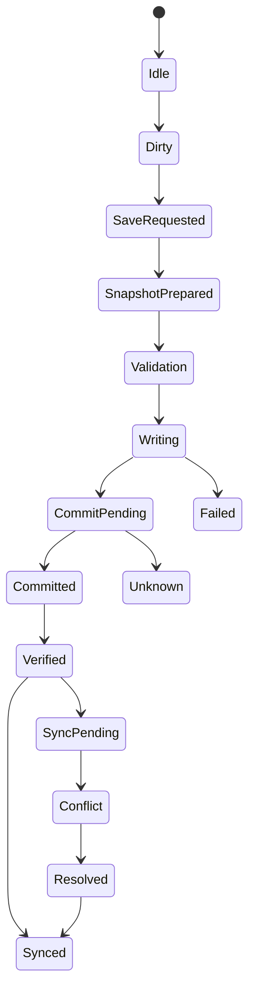

# Save and Persistence（存档与持久化系统）

> Status: V1  
> Category: Player  
> Path: `design/systems/player/save-and-persistence.md`  
> Owner: TBD  
> Reviewers: Engineering / Design / Product / QA / Security / Privacy / Data / Support / Live Operations  
> Last Updated: 2026-07-11  
> Version: 1.0  
> Risk Level: Critical  
> Dependencies: Game State and Flow, Rules and Resolution, Integration Rules, Content Lifecycle, Entitlement and Ownership, Versioning and Migration, Settings and Preferences  
> Affected Systems: Progression System, Resources and Economy, Reward System, Objectives and Quests, Characters and Loadouts, Tutorial and Onboarding, Social and Multiplayer, Live Operations, Analytics and Telemetry

---

## 1. System Summary

Save and Persistence 系统负责定义：

```text
哪些状态必须保存；
谁拥有这些状态；
何时保存；
保存到哪里；
如何确认写入成功；
如何在本地、云端和服务端之间同步；
如何处理版本变化、冲突、损坏、回滚和删除；
玩家如何在跨设备、离线、回归和更新后继续原有体验。
```

存档系统不只是：

```text
把当前对象序列化到文件。
```

它还负责：

- 数据所有权；
- 事务一致性；
- 高价值资产保护；
- 自动保存；
- 手动保存；
- Checkpoint；
- Suspend / Resume；
- 本地与云端同步；
- 多设备冲突；
- 离线合并；
- 版本迁移；
- 损坏检测；
- 备份恢复；
- 删除和导出；
- 权益与存档关系；
- 玩家可见反馈；
- Support 与审计。

健康的持久化系统应让玩家相信：

```text
我的进度不会无原因消失；
系统会清楚告诉我是否已经保存；
跨设备时不会静默覆盖；
更新后仍能继续；
发生异常时有恢复路径；
删除和重置由我明确控制。
```

---

## 2. Purpose

### 2.1 Player Value

该系统帮助玩家：

- 保留长期进度；
- 安全退出和继续；
- 跨会话恢复；
- 跨设备延续体验；
- 在离线后重新同步；
- 从崩溃、断电、网络中断中恢复；
- 在版本更新后继续旧存档；
- 在误操作或数据损坏后获得恢复机会；
- 理解哪些状态已保存、正在保存或保存失败；
- 控制自己的存档删除、导出和云同步。

### 2.2 Experience Contribution

持久化直接影响：

- 信任；
- 安全感；
- 长期投入；
- 退出自由；
- 回归体验；
- 跨平台连续性；
- 付费资产信心；
- Support 成本；
- 版本更新接受度。

即使核心体验优秀，只要发生：

- 存档丢失；
- 云存档覆盖；
- 资源重复扣除；
- 奖励重复发放；
- 更新后无法加载；
- 自动保存状态不清；

玩家都会认为整个产品不可靠。

### 2.3 Product Value

统一持久化系统可以：

- 降低各系统重复实现；
- 建立统一状态 Owner；
- 支持审计与恢复；
- 支持版本迁移；
- 支持跨设备；
- 支持灰度和回滚；
- 降低资产争议；
- 支持在线与离线混合；
- 支持 Support 工具；
- 支持隐私和删除要求；
- 支持长期产品演进。

### 2.4 Why This System Exists

缺少统一持久化框架时，常见问题包括：

```text
每个系统自行保存；
同一状态存在多个副本；
客户端和服务端都认为自己权威；
自动保存和交易提交顺序不一致；
奖励成功但存档失败；
退出时最后几分钟进度丢失；
云端旧数据覆盖本地新数据；
迁移脚本只处理主进度，遗漏预设、任务和保底；
删除账户后备份仍可恢复业务状态；
Support 无法判断真正发生了什么。
```

---

## 3. Non-Goals

该系统不负责：

- 定义各业务系统的具体玩法规则；
- 替代领域状态 Owner；
- 自动解决所有业务冲突；
- 将 Analytics 当作权威存档；
- 使用存档回滚绕过正常退款和权益流程；
- 通过频繁存档提示打断体验；
- 无限保留全部历史数据；
- 让客户端直接决定在线高价值资产；
- 将所有临时 UI 状态长期保存；
- 允许玩家编辑受保护的在线权威状态；
- 用“云端同步”掩盖数据归属不清；
- 将数据备份等同于完整灾难恢复。

---

## 4. Governing Principles

### 4.1 One State, One Owner

参考：

- `../integration-rules.md`

应用原则：

- 每个持久化事实只有一个权威 Owner；
- Save 系统负责保存和恢复，不自动成为业务 Owner；
- 派生数据不应作为独立权威保存，除非有性能和恢复理由；
- 多份缓存必须能追溯到同一权威事实。

### 4.2 Consistency and Coherence

参考：

- `../../philosophy/long-term/consistency-and-coherence.md`

应用原则：

- 同类状态采用一致保存语义；
- 相同存档状态在不同入口表达一致；
- 版本、时间、状态和错误术语统一；
- 跨设备冲突规则可预测。

### 4.3 Player First Design

参考：

- `../../philosophy/foundation/player-first-design.md`

应用原则：

- 优先保护玩家投入；
- 保存失败要清楚且可恢复；
- 删除、覆盖和重置必须防误触；
- 不因现实生活中断惩罚玩家；
- 玩家应知道是否可以安全退出。

### 4.4 Clarity and Feedback

参考：

- `../../philosophy/experience/clarity-and-feedback.md`

应用原则：

- Saving、Saved、Failed、Conflict 等状态清楚；
- 云端和本地差异可解释；
- 恢复动作和影响可预览；
- 高风险覆盖前展示时间、设备和进度差异。

### 4.5 Ethical Design

参考：

- `../../philosophy/responsibility/ethical-design.md`

应用原则：

- 不隐藏删除和导出；
- 不将数据恢复作为付费功能；
- 不利用云同步冲突推动订阅；
- 不保留超出必要范围的敏感数据；
- 不静默恢复已明确删除的业务状态。

---

## 5. Player Experience

### 5.1 Player Goal

玩家希望：

- 开始；
- 继续；
- 暂停；
- 退出；
- 切换设备；
- 切换账号；
- 恢复存档；
- 创建新档；
- 删除旧档；
- 导入或导出；
- 解决同步冲突；
- 重置部分或全部进度。

### 5.2 Entry

玩家接触持久化系统的入口包括：

- 启动；
- 登录；
- 继续游戏；
- 退出；
- Checkpoint；
- 手动保存；
- 设备切换；
- 云同步；
- 崩溃恢复；
- 版本更新；
- 新游戏；
- New Game Plus；
- 删除账户；
- Support 恢复。

### 5.3 Main Actions

玩家可以：

- Continue；
- Save；
- Load；
- Select Slot；
- Rename Slot；
- Delete Slot；
- Resolve Conflict；
- Enable Cloud Sync；
- Disable Cloud Sync；
- Export；
- Import；
- Restore Backup；
- Reset；
- Start New Game；
- Resume Suspended Session。

### 5.4 Core Decisions

关键决策包括：

- 使用本地还是云端版本；
- 是否覆盖；
- 是否删除；
- 是否开始新档；
- 是否保留旧档；
- 是否启用同步；
- 是否接受迁移；
- 是否恢复备份；
- 是否重置部分进度。

### 5.5 Success

健康体验意味着：

- 玩家可以安全退出；
- 继续时位置和状态合理；
- 重要进度不会丢失；
- 云端冲突不静默覆盖；
- 保存失败有明确提示；
- 更新后自动迁移成功；
- 恢复不会重复奖励或扣除；
- 删除和重置符合玩家选择。

### 5.6 Failure

失败包括：

- 写入失败；
- 磁盘空间不足；
- 云端不可用；
- 版本不兼容；
- 数据损坏；
- 多设备冲突；
- 事务部分完成；
- 备份不可用；
- 权益不同步；
- 账户切换错误；
- 本地时钟异常；
- 重复恢复。

---

## 6. System Boundary

### 6.1 Inputs

系统接收：

- Domain State Snapshots；
- Domain Events；
- Save Requests；
- Checkpoint Requests；
- Transaction Commit Results；
- Account State；
- Entitlement State；
- Device and Platform；
- Cloud Sync State；
- Network State；
- Version and Schema；
- Time；
- Privacy and Retention Policy；
- Deletion Request；
- Import / Export Request；
- Support Recovery Request。

### 6.2 Outputs

系统产生：

- Save Record；
- Snapshot；
- Journal Entry；
- Save Status；
- Cloud Sync Result；
- Conflict Record；
- Load Result；
- Migration Result；
- Recovery Result；
- Backup State；
- Deletion Result；
- Export Package；
- Persistence Event；
- Player-Facing Save Summary。

### 6.3 Owned State

Save and Persistence 拥有：

- Save Slot Metadata；
- Snapshot Metadata；
- Journal Metadata；
- Save Version；
- Schema Version；
- Checkpoint Metadata；
- Sync State；
- Conflict State；
- Backup Metadata；
- Migration State；
- Corruption State；
- Save Operation State；
- Deletion State；
- Export State；
- Persistence History。

### 6.4 Read-Only Dependencies

系统读取：

- 各领域系统的权威状态；
- Account；
- Entitlement；
- Content Version；
- Platform；
- Time；
- Privacy Policy；
- Support Authorization；
- Storage Capacity；
- Network。

### 6.5 Write Dependencies

系统通过正式契约请求：

- Domain Owners 导出或恢复状态；
- Cloud Storage 上传和下载；
- Account 执行账户删除；
- Entitlement 重新验证拥有状态；
- Versioning 执行迁移；
- Analytics 记录非敏感操作结果；
- Notification 提示冲突或失败。

### 6.6 Out of Scope

Save 系统不直接：

- 修改资源余额；
- 发放奖励；
- 完成任务；
- 授予权益；
- 处理支付；
- 决定角色能力；
- 决定游戏规则；
- 通过编辑快照绕过领域验证。

---

## 7. Core Entities and Concepts

| Entity / Concept | Definition | Owner | Lifetime | Notes |
|---|---|---|---|---|
| Save Slot | 一组可独立加载的长期状态 | Save | 长期 | 可能单槽或多槽 |
| Save Record | 一次成功或失败的保存记录 | Save | 审计期 | 包含状态和原因 |
| Snapshot | 某一时间点的状态快照 | Save | 长期或轮转 | 用于快速恢复 |
| Journal | 快照之后的状态变更日志 | Save | 短期或长期 | 可重放 |
| Checkpoint | 可恢复的玩法安全节点 | Domain / Save | 内容期 | 不等同完整存档 |
| Suspend State | 快速恢复会话的临时状态 | Save | 短期 | 通常单设备 |
| Save Manifest | 存档所含领域、版本和校验信息 | Save | 与存档同寿命 | 加载入口 |
| Schema Version | 数据结构版本 | Versioning / Save | 版本级 | 用于迁移 |
| Domain Save Contract | 领域导出和恢复契约 | Domain / Save | 版本级 | 明确 Owner |
| Sync Record | 本地和云端同步元数据 | Save | 长期 | 冲突判断 |
| Conflict Record | 两个合法分支发生冲突 | Save | 至解决 | 不静默丢弃 |
| Backup | 用于恢复的历史副本 | Save | 轮转 | 不等同玩家槽位 |
| Recovery Point | 可选择恢复的状态 | Save | 恢复期 | 可来自备份或快照 |
| Tombstone | 删除或撤销记录 | Save | 政策期 | 防止被旧端复活 |
| Export Package | 玩家数据导出包 | Save / Privacy | 短期 | 可验证和加密 |

---

## 8. Persistence Taxonomy

### 8.1 Permanent Player State

长期保留：

- 进度；
- 角色；
- 装备；
- 资源；
- 解锁；
- 任务历史；
- 所有权引用；
- 设置；
- 成就；
- 社交关系。

### 8.2 Session State

当前会话：

- 当前区域；
- 当前流程；
- 临时选择；
- 活跃任务；
- 当前队伍；
- 部分战斗上下文。

### 8.3 Checkpoint State

用于特定挑战恢复。

### 8.4 Ephemeral State

不应长期保存：

- Hover；
- 动画进度；
- 临时 UI 过渡；
- 网络请求对象；
- 未提交输入；
- 调试状态。

### 8.5 Derived State

可以重算：

- 总战力；
- 派生属性；
- 推荐内容；
- 缓存；
- 排序结果。

### 8.6 Audit State

用于：

- 高价值交易；
- 付费资产；
- 奖励；
- 迁移；
- Support；
- 安全。

### 8.7 Privacy-Sensitive State

需要额外控制：

- 个人资料；
- 聊天；
- 语音；
- 位置；
- 联系人；
- 支付关联；
- 年龄；
- 设备标识。

---

## 9. Save Domain Definition

每个领域必须声明：

```markdown
## Save Domain

- Domain ID:
- State Owner:
- Persistence Class:
- Authority:
- Snapshot Fields:
- Journal Events:
- Save Trigger:
- Restore Validation:
- Migration Owner:
- Retention:
- Privacy Classification:
- Failure Policy:
```

### 9.1 必须回答

- 哪些字段需要保存；
- 哪些可以重算；
- 谁是权威；
- 什么时候产生一致快照；
- 如何恢复；
- 如何验证；
- 如何迁移；
- 保存失败时怎么办；
- 删除请求如何处理。

---

## 10. Authority Models

### 10.1 Local Authoritative

本地存档是主要权威。

适合：

- 完全离线；
- 单人；
- 无高价值跨设备资产。

风险：

- 篡改；
- 丢失；
- 多设备冲突；
- 设备损坏。

### 10.2 Server Authoritative

服务端状态是主要权威。

适合：

- 在线经济；
- 付费资产；
- 竞技；
- 社交；
- 跨设备。

风险：

- 网络依赖；
- 服务不可用；
- 延迟；
- 运营成本。

### 10.3 Hybrid Authority

不同领域使用不同权威。

例如：

- 角色位置：本地或会话服务；
- 付费货币：服务端；
- 设置：本地并云同步；
- 任务历史：服务端；
- UI 布局：本地。

### 10.4 Authority Must Be Explicit

不能出现：

```text
客户端认为本地较新，所以直接覆盖服务端货币。
```

---

## 11. Save Lifecycle

```text
Idle
→ Dirty
→ Save Requested
→ Snapshot Prepared
→ Validation
→ Writing
→ Commit Pending
→ Committed
→ Verified
→ Synced
```

异常分支：

```text
Writing
→ Failed
Commit Pending
→ Unknown
Verified
→ Sync Pending
Sync Pending
→ Conflict
Conflict
→ Resolved
```



---

## 12. Save State Definitions

### 12.1 Idle

没有待保存变更。

### 12.2 Dirty

存在未持久化变化。

### 12.3 Save Requested

保存已请求。

### 12.4 Snapshot Prepared

领域状态已冻结或形成一致视图。

### 12.5 Validation

检查：

- Schema；
- Required Fields；
- Invariants；
- Ownership；
- Version；
- Capacity。

### 12.6 Writing

写入临时位置或事务缓冲。

### 12.7 Commit Pending

等待原子替换或服务端确认。

### 12.8 Committed

写入已成功提交。

### 12.9 Verified

重新读取或校验成功。

### 12.10 Sync Pending

本地已保存，但云端尚未同步。

### 12.11 Synced

本地与云端一致。

### 12.12 Failed

确定保存失败。

### 12.13 Unknown

客户端不知道请求最终是否成功，必须查询或幂等重试。

### 12.14 Conflict

存在多个合法分支，无法自动决定。

---

## 13. Save Invariants

1. 成功提示只能在 Commit 完成后展示。
2. 高价值状态不能只依赖 UI 关闭时保存。
3. 保存失败不能伪装为成功。
4. 同一 Save Operation 必须幂等。
5. Snapshot 必须来自一致状态边界。
6. 领域恢复必须通过领域 Owner 验证。
7. Analytics 失败不影响保存。
8. 云同步失败不应破坏已成功的本地存档。
9. 删除状态必须使用 Tombstone 防止旧设备复活。
10. 迁移失败不能覆盖原始可恢复版本。
11. 备份必须独立于当前活动写入。
12. 高价值在线资产不能由本地时间或本地余额覆盖。
13. Load 成功前不能销毁当前可恢复状态。
14. 保存文件存在不代表内容完整。
15. 所有恢复和覆盖操作必须记录来源和版本。

---

## 14. Save Triggers

### 14.1 Critical Transaction Trigger

高价值事务完成后立即保存。

例如：

- 购买；
- 奖励；
- 资源消费；
- 角色获得；
- 任务里程碑；
- 分支选择；
- 永久解锁。

### 14.2 Checkpoint Trigger

达到玩法安全节点。

### 14.3 Interval Trigger

按时间周期保存。

### 14.4 State Transition Trigger

例如：

- 进入区域；
- 离开内容；
- 暂停；
- 返回主菜单；
- 进入后台；
- 退出。

### 14.5 Manual Trigger

玩家主动保存。

### 14.6 Suspend Trigger

平台挂起或设备休眠。

### 14.7 Migration Trigger

版本变化前后。

### 14.8 Shutdown Trigger

正常退出时补充保存，但不能作为唯一保障。

---

## 15. Autosave

### 15.1 Purpose

降低：

- 崩溃损失；
- 断电损失；
- 忘记保存；
- 退出压力。

### 15.2 Autosave Cadence

应根据：

- 状态价值；
- 变化频率；
- 写入成本；
- 平台限制；
- 性能；
- 电池；
- 网络；

决定。

### 15.3 Autosave Feedback

可以使用轻量提示：

- Saving；
- Saved；
- Sync Pending；
- Failed。

### 15.4 Avoid Save Spam

频繁提示会造成噪音。

### 15.5 Autosave Safety

不能在以下时刻创建不一致快照：

- 事务中间；
- 内容切换未完成；
- 角色迁移中；
- 奖励只完成一半；
- 规则版本切换中。

---

## 16. Manual Save

### 16.1 Suitable Use

适合：

- 长内容；
- 高自由度单人体验；
- 多路线；
- 实验；
- 构筑测试。

### 16.2 Restrictions

可能限制：

- 战斗中；
- 竞技中；
- 在线事务中；
- 不可恢复随机节点；
- 数据迁移中。

### 16.3 Save Anywhere vs Save Point

两种模式都必须说明：

- 能保存什么；
- 从哪里恢复；
- 是否保留当前临时状态；
- 是否影响挑战公平。

### 16.4 Manual Save Does Not Replace Autosave

玩家不应承担全部保存责任。

---

## 17. Checkpoints

### 17.1 Purpose

Checkpoint 用于：

- 降低重复；
- 支持长挑战；
- 支持失败恢复；
- 控制回滚范围。

### 17.2 Checkpoint Definition

每个 Checkpoint 应定义：

- 位置；
- 玩家状态；
- 内容状态；
- 资源；
- 目标；
- 难度；
- 规则版本；
- 随机状态；
- 恢复限制。

### 17.3 Checkpoint vs Save Slot

Checkpoint 通常：

- 自动；
- 内容相关；
- 可轮转；
- 不一定玩家可命名。

### 17.4 Checkpoint Integrity

不能通过恢复导致：

- 重复奖励；
- 重复资源；
- 重新抽取高价值随机结果；
- 绕过消耗；
- 复制交易。

---

## 18. Suspend and Resume

### 18.1 Suspend State

用于快速恢复设备上的当前体验。

### 18.2 Limitations

Suspend 不应被视为长期稳定存档。

可能因：

- 系统更新；
- 应用终止；
- 设备重启；
- 版本变化；

失效。

### 18.3 Resume Validation

恢复前检查：

- 内容版本；
- 规则版本；
- 账户；
- 权益；
- 网络；
- 时间；
- 活动状态；
- 安全状态。

### 18.4 Invalid Resume

如果不能原地恢复：

- 返回最近 Checkpoint；
- 返回安全页面；
- 解释原因；
- 保留长期进度。

---

## 19. Save Slots

### 19.1 Single Slot

优点：

- 简单；
- 云同步容易；
- 减少错误。

风险：

- 缺少实验；
- 删除风险；
- 路线不可回看。

### 19.2 Multiple Slots

支持：

- 多路线；
- 多玩家；
- 实验；
- 家庭共享；
- 挑战存档。

风险：

- 管理复杂；
- 云空间；
- 冲突；
- 误覆盖。

### 19.3 Slot Metadata

显示：

- 名称；
- 时间；
- 版本；
- 进度摘要；
- 角色；
- 位置；
- 设备；
- 同步状态；
- 是否损坏；
- 是否可迁移。

### 19.4 Slot Limits

不应通过过低槽位上限制造不必要付费压力。

---

## 20. Profiles and Accounts

### 20.1 Profile

可以代表：

- 本地玩家；
- 家庭成员；
- 角色档案；
- 平台用户。

### 20.2 Account Binding

必须明确：

- 哪些状态绑定账户；
- 哪些状态绑定设备；
- 哪些状态绑定平台；
- 哪些状态绑定 Save Slot。

### 20.3 Account Switch

切换账户前：

- 保存当前状态；
- 清理内存缓存；
- 验证新账户；
- 防止状态串档；
- 更新权益；
- 更新云同步。

### 20.4 Guest Account

应说明：

- 是否云同步；
- 是否可升级为正式账户；
- 迁移方式；
- 删除风险；
- 购买限制。

---

## 21. Snapshot Model

### 21.1 Full Snapshot

保存全部持久化状态。

优点：

- 恢复简单。

风险：

- 大；
- 慢；
- 写入成本高；
- 冲突范围大。

### 21.2 Domain Snapshot

按领域拆分。

优点：

- 可独立更新；
- 迁移灵活。

风险：

- 跨领域一致性复杂。

### 21.3 Incremental Snapshot

只保存变化。

### 21.4 Snapshot Manifest

必须记录：

- Save ID；
- Slot ID；
- Account；
- Created At；
- Domain Versions；
- Schema Versions；
- Hash；
- Parent Snapshot；
- Journal Range；
- Platform；
- Build Version；
- Encryption；
- Completion State。

---

## 22. Journal and Event Log

### 22.1 Purpose

用于：

- 增量保存；
- 重放；
- 审计；
- 恢复；
- 冲突分析。

### 22.2 Journal Entry

应包含：

- Event ID；
- Domain；
- Sequence；
- Timestamp；
- Operation；
- Version；
- Correlation ID；
- Checksum；
- Commit State。

### 22.3 Replay

重放必须：

- 确定性；
- 幂等；
- 有顺序；
- 有版本；
- 有终止点；
- 可检测缺失。

### 22.4 Journal Compaction

定期合并到新 Snapshot，控制：

- 大小；
- 加载时间；
- 风险；
- 保留期。

---

## 23. Transactional Saving

### 23.1 High-Risk Transaction

例如：

- 购买；
- 付费货币；
- 奖励领取；
- 角色获得；
- 分支选择；
- 资源转换；
- 永久删除。

### 23.2 Recommended Flow

```text
Validate
→ Reserve
→ Apply Domain Change
→ Persist Transaction
→ Commit
→ Publish Result
→ Create Snapshot or Journal Entry
```

### 23.3 Atomicity

跨领域事务应：

- 原子提交；
- 或使用补偿事务。

### 23.4 Unknown Result

网络超时后不能直接重试并再次扣除。

必须通过：

- Transaction ID；
- Idempotency Key；
- Query Result；

确认。

### 23.5 Player Feedback

高价值成功反馈只在权威提交后展示。

---

## 24. Save Consistency

### 24.1 Strong Consistency

适用于：

- 资产；
- 权益；
- 交易；
- 角色所有权；
- 高价值奖励。

### 24.2 Eventual Consistency

可用于：

- 最近列表；
- 推荐；
- 非关键统计；
- 展示缓存；
- 社交状态摘要。

### 24.3 Cross-Domain Snapshot

需要定义一致性边界。

例如：

```text
Progression Level 10
必须与
已扣除升级资源
在同一事务边界中成立。
```

### 24.4 Consistency Token

可使用：

- Revision；
- Sequence；
- ETag；
- Transaction Version；
- Snapshot ID。

---

## 25. Local Storage

### 25.1 Local Save Benefits

- 离线；
- 低延迟；
- 快速恢复；
- 降低服务依赖。

### 25.2 Local Risks

- 设备丢失；
- 文件损坏；
- 篡改；
- 存储不足；
- 权限；
- 清理工具；
- 平台卸载。

### 25.3 Local Storage Rules

- 使用原子写；
- 临时文件；
- 校验；
- 备份；
- 加密；
- 不写入不受控公共路径；
- 尊重平台生命周期。

---

## 26. Cloud Save

### 26.1 Cloud Save Benefits

- 跨设备；
- 设备恢复；
- 备份；
- 账户连续性。

### 26.2 Cloud Save Is Not Authority by Default

云端存储只是位置。

权威仍由领域和架构定义。

### 26.3 Upload Flow

```text
Local Commit
→ Prepare Sync Package
→ Upload
→ Server Validate
→ Store Revision
→ Confirm Sync
```

### 26.4 Download Flow

```text
Authenticate
→ Fetch Manifest
→ Compare Revisions
→ Validate Compatibility
→ Detect Conflict
→ Apply or Ask Player
```

### 26.5 Sync Status

- Disabled；
- Local Only；
- Sync Pending；
- Uploading；
- Synced；
- Downloading；
- Conflict；
- Failed；
- Paused。

---

## 27. Sync Metadata

至少记录：

- Account；
- Device；
- Slot；
- Revision；
- Parent Revision；
- Modified At；
- Domain Revisions；
- Hash；
- Schema；
- Build；
- Sync Result；
- Tombstones；
- Conflict Ancestor。

### 27.1 Do Not Use Timestamp Alone

设备时间可能不准确。

冲突判断不能只依赖：

```text
最后修改时间。
```

---

## 28. Conflict Detection

冲突发生在：

```text
本地和云端
从同一祖先版本
分别产生了不同合法变化。
```

### 28.1 Not Every Difference Is Conflict

以下可以直接同步：

- 一方是另一方后继；
- 只有缓存变化；
- 领域支持自动合并；
- 服务端权威覆盖本地非权威状态。

### 28.2 Conflict Signals

- Parent Revision 不一致；
- 相同事务不同结果；
- 多设备离线修改；
- 删除与修改并发；
- Slot 克隆后修改；
- 迁移版本不一致。

---

## 29. Conflict Resolution

### 29.1 Automatic Merge

适用于可交换或可合并状态：

- 设置；
- 收藏；
- 已完成历史；
- 非互斥解锁；
- 统计最大值。

### 29.2 Authoritative Override

适用于服务端权威：

- 付费货币；
- 购买权益；
- 竞技；
- 社交处罚。

### 29.3 Player Choice

适用于：

- 单机进度分支；
- 位置；
- 路线；
- 手动存档。

### 29.4 Duplicate Slot

无法安全合并时，可以：

- 保留两个分支；
- 创建副本；
- 让玩家稍后决定。

### 29.5 Conflict UI

展示：

- 设备；
- 时间；
- 版本；
- 进度摘要；
- 角色；
- 位置；
- 关键资产差异；
- 推荐；
- 覆盖影响。

### 29.6 Never Use “Newest Wins” Blindly

新时间不一定代表正确状态。

---

## 30. Merge Semantics by Data Type

### 30.1 Monotonic State

只能增长：

- 已完成历史；
- 已解锁收藏；
- 成就。

可使用 Union 或 Max。

### 30.2 Consumable Balance

不能简单取 Max 或相加。

必须依赖 Ledger。

### 30.3 Exclusive Choice

不能自动合并：

- 分支；
- 角色路线；
- 世界状态。

### 30.4 Settings

可以按字段最近修改合并，但需保留设备特定设置。

### 30.5 Loadouts

可以保留多个预设，但当前装备引用要重新验证。

### 30.6 Quest Progress

根据：

- Quest Version；
- Domain Facts；
- Completion History；

决定，不能简单求和。

---

## 31. Offline Play

### 31.1 Offline-Capable Domains

明确哪些可离线修改：

- 单人进度；
- 设置；
- 本地内容；
- 部分任务；
- 构筑。

### 31.2 Online-Only Domains

通常包括：

- 付费货币；
- 商店购买；
- 排名；
- 公会；
- 交易；
- 竞技；
- 在线奖励。

### 31.3 Offline Queue

离线行为需要：

- 本地事务 ID；
- 顺序；
- 时间；
- 版本；
- 重试；
- 冲突；
- 防篡改。

### 31.4 Reconnect

重新连接时：

- 验证账户；
- 验证版本；
- 上传事务；
- 查询权威结果；
- 合并；
- 处理冲突；
- 保存新 Revision。

### 31.5 Offline Time

不能完全信任本地时间决定高价值结果。

---

## 32. Cross-Device Continuity

### 32.1 Goal

玩家在不同设备继续时应：

- 看到正确进度；
- 保留适用设置；
- 重新适配输入；
- 理解平台差异；
- 不丢失权益。

### 32.2 Device-Specific State

通常不应全局覆盖：

- 分辨率；
- 图形质量；
- 控制器布局；
- 性能模式；
- 窗口位置。

### 32.3 Account-Wide State

通常同步：

- 进度；
- 角色；
- 资源；
- 解锁；
- 任务；
- 收藏；
- 通用偏好。

### 32.4 Platform-Specific Entitlement

需要清楚说明：

- 是否跨平台共享；
- 是否只在购买平台使用；
- 存档中如何引用；
- 不可用时如何降级。

---

## 33. Save Validation

加载和保存时检查：

- Manifest；
- Hash；
- Schema；
- Required Domains；
- Domain Version；
- Sequence；
- Ownership；
- Entitlement；
- Range；
- Referential Integrity；
- Invariants；
- Security Signature；
- Size Limits。

### 33.1 Validation Levels

- Structural；
- Semantic；
- Cross-Domain；
- Security；
- Compatibility；
- Business。

### 33.2 Invalid Data

不能直接加载到正式状态。

可进入：

- Repair；
- Migration；
- Safe Mode；
- Previous Backup；
- Support Review。

---

## 34. Corruption Detection

可能原因：

- 断电；
- 部分写入；
- 存储损坏；
- 程序错误；
- 手动修改；
- 版本不兼容；
- 加密失败；
- 云上传不完整。

### 34.1 Detection

- Checksum；
- Hash；
- Signature；
- Length；
- Schema；
- Sequence Gap；
- Referential Integrity；
- Domain Validation。

### 34.2 Corruption State

- Suspected；
- Confirmed；
- Repairable；
- Partial；
- Unrecoverable；
- Quarantined。

---

## 35. Corruption Recovery

恢复顺序建议：

```text
1. Retry Read
2. Use Transaction Journal
3. Use Previous Snapshot
4. Use Cloud Revision
5. Use Domain Rebuild
6. Use Support Recovery
7. Start Safe New State with Compensation
```

### 35.1 Never Overwrite Evidence Immediately

损坏存档应先隔离，不要直接删除。

### 35.2 Partial Recovery

若只恢复部分领域，必须：

- 验证跨领域一致性；
- 明确影响；
- 记录缺失；
- 可能需要补偿。

### 35.3 Player Communication

说明：

- 发生什么；
- 可恢复到何时；
- 会失去什么；
- 是否有其他选项；
- 如何联系 Support。

---

## 36. Backup Strategy

### 36.1 Backup Types

- Previous Snapshot；
- Rotating Backup；
- Cloud Revision；
- Pre-Migration Backup；
- Pre-Delete Backup；
- Disaster Recovery Backup。

### 36.2 Rotation

按：

- 数量；
- 时间；
- 版本；
- 关键事件；

轮转。

### 36.3 Backup Independence

备份不应与当前活动文件在同一失败点。

### 36.4 Backup Validation

备份需要定期恢复演练。

### 36.5 Backup Retention

根据：

- 玩家价值；
- 隐私；
- 法律；
- 存储成本；
- Support；

决定。

---

## 37. Save Versioning

### 37.1 Build Version

创建存档的应用版本。

### 37.2 Schema Version

数据结构版本。

### 37.3 Domain Version

每个领域独立版本。

### 37.4 Rule Version

影响进行中内容的规则版本。

### 37.5 Content Version

内容身份和配置版本。

### 37.6 Version Manifest

加载时根据 Manifest 确定迁移路径。

---

## 38. Migration

### 38.1 Migration Types

- Add Field；
- Rename；
- Remove；
- Split Domain；
- Merge Domain；
- Unit Change；
- ID Mapping；
- Progress Mapping；
- Currency Conversion；
- Entitlement Mapping；
- Quest Mapping；
- Loadout Repair。

### 38.2 Migration Pipeline

```text
Read Original
→ Validate Original
→ Create Backup
→ Apply Stepwise Migrations
→ Validate Each Step
→ Validate Final State
→ Commit New Version
→ Keep Migration Record
```

### 38.3 No Direct Overwrite

高风险迁移不应直接覆盖唯一原始副本。

### 38.4 Stepwise Migration

推荐：

```text
v1 → v2 → v3
```

而不是维护大量任意跨版本脚本，除非有经过验证的压缩路径。

### 38.5 Migration Idempotency

重复运行不应重复转换或发放。

---

## 39. Migration Failure

失败时：

- 保留原存档；
- 标记 Migration Failed；
- 不创建半完成正式状态；
- 允许重试；
- 允许旧版本只读；
- 允许 Support 恢复；
- 提供安全返回。

### 39.1 Forward Fix

有些服务端迁移无法完全回滚，需要：

- 修复脚本；
- 补偿；
- 状态重算；
- 人工审计。

### 39.2 Migration Metrics

必须监控：

- 成功率；
- 时长；
- 差异；
- 丢失字段；
- 修复率；
- 回滚率。

---

## 40. New Game

### 40.1 New Game Behavior

必须说明：

- 创建新 Slot；
- 覆盖当前 Slot；
- 是否保留账户级状态；
- 是否保留设置；
- 是否保留权益；
- 是否保留成就；
- 是否保留收藏。

### 40.2 Safe Defaults

不要默认覆盖唯一存档。

### 40.3 Confirmation

显示：

- 受影响 Slot；
- 当前进度；
- 是否有云备份；
- 是否可恢复。

---

## 41. New Game Plus

### 41.1 Carryover

明确保留：

- 角色；
- 能力；
- 资源；
- 装备；
- 解锁；
- 收藏；
- 难度；
- 任务；
- 选择；
- 世界状态。

### 41.2 Reset

明确重置：

- 内容进度；
- 任务；
- 地图；
- 分支；
- Checkpoint；
- 活动状态。

### 41.3 Versioned Rules

New Game Plus 规则需要版本化并记录创建时规则。

---

## 42. Reset

### 42.1 Reset Types

- Tutorial Reset；
- Settings Reset；
- Character Reset；
- Progression Reset；
- Story Reset；
- Slot Reset；
- Account Reset；
- Full Delete。

### 42.2 Reset Scope

必须清楚列出：

- 删除什么；
- 保留什么；
- 是否可恢复；
- 是否影响云端；
- 是否影响权益；
- 是否影响其他设备。

### 42.3 Protected State

通常不应由普通 Reset 删除：

- 购买记录；
- 法定账务；
- 平台权益；
- 必要审计；
- 已明确保留的设置。

---

## 43. Deletion

### 43.1 Delete Slot

删除一个存档槽。

### 43.2 Delete Local Data

仅删除当前设备数据。

### 43.3 Delete Cloud Save

删除云端存档。

### 43.4 Delete Account

删除账户及受政策约束的数据。

### 43.5 Deletion Flow

```text
Explain Scope
→ Confirm Identity
→ Confirm Impact
→ Create Tombstone
→ Stop Sync
→ Delete or Queue Deletion
→ Verify
→ Notify
```

### 43.6 Tombstone

防止旧设备将被删除数据重新上传。

### 43.7 Grace Period

账户删除是否有撤销期需根据产品和法律定义。

---

## 44. Data Export

### 44.1 Export Scope

可以包括：

- 存档；
- 进度；
- 设置；
- 角色；
- 任务；
- 交易摘要；
- 社交数据；
- 隐私数据副本。

### 44.2 Export Format

应：

- 可读；
- 有版本；
- 有 Manifest；
- 有完整性校验；
- 不暴露密钥；
- 对敏感数据加密。

### 44.3 Import

不是所有导出都必须可重新导入。

若支持 Import，必须：

- 验证签名；
- 验证版本；
- 防篡改；
- 处理冲突；
- 预览影响。

---

## 45. Security

### 45.1 Threats

- 文件篡改；
- 回滚复制；
- 货币复制；
- 权益伪造；
- 事务重放；
- Save Injection；
- 路径攻击；
- 数据泄露；
- 恶意 Import；
- 备份泄露。

### 45.2 Controls

- Encryption at Rest；
- Encryption in Transit；
- Signature；
- Checksum；
- Server Authority；
- Nonce；
- Idempotency；
- Access Control；
- Secure Key Storage；
- Audit；
- Rate Limit。

### 45.3 Do Not Trust Client for High-Value State

客户端可展示和缓存，但不能独立授权：

- 付费资产；
- 付费货币；
- 商业权益；
- 排名；
- 竞技结果。

---

## 46. Privacy

### 46.1 Data Minimization

只保存实现目的所需状态。

### 46.2 Purpose Limitation

存档数据不应自动用于无关画像。

### 46.3 Sensitive Data

需要：

- 分类；
- 访问控制；
- 加密；
- 保留期；
- 删除；
- 审计。

### 46.4 Save Telemetry

不应记录：

- 密码；
- 完整聊天；
- 支付凭据；
- 敏感输入；
- 不必要个人标识。

### 46.5 Children

儿童账户需要：

- 更严格权限；
- 数据最小化；
- 监护控制；
- 清楚删除；
- 限制跨服务共享。

---

## 47. Retention

### 47.1 Retention Categories

- Active Save；
- Backup；
- Audit；
- Transaction；
- Deleted Tombstone；
- Export；
- Support Copy；
- Logs。

### 47.2 Retention Rule

每类数据定义：

- 目的；
- 保存时长；
- 删除条件；
- 法律依据；
- Owner；
- 访问权限。

### 47.3 No Indefinite Retention by Default

长期保留必须有明确理由。

---

## 48. Entitlement and Ownership Integration

### 48.1 Save References Ownership

存档可以引用已拥有内容，但不应复制权益事实作为最终权威。

### 48.2 Load Without Entitlement

可能出现：

- 平台切换；
- 订阅到期；
- 退款；
- 许可；
- 区域差异。

处理方式：

- 保留引用；
- 标记不可用；
- 使用替代；
- 不删除构筑；
- 重新验证；
- 允许恢复权益。

### 48.3 Purchased Content

已购买内容不可用时，不应通过存档加载静默删除。

---

## 49. Reward and Economy Integration

### 49.1 Ledger First

高价值资源依赖 Ledger，而不是简单快照余额。

### 49.2 Reward Pending

任务完成和奖励发放可以分离：

- 完成事实已保存；
- Reward Instance Pending；
- 后续恢复发放。

### 49.3 Restore Protection

恢复旧 Checkpoint 不应撤销或重复：

- 已提交购买；
- 已领取奖励；
- 服务端权威消费；
- 权益。

### 49.4 Reconciliation

加载后根据权威 Ledger 和 Entitlement 重算相关状态。

---

## 50. Quest and Content Integration

### 50.1 In-Progress Content

保存：

- Content ID；
- Instance ID；
- Version；
- Stage；
- Objectives；
- Checkpoint；
- Random State；
- Difficulty；
- Expiry。

### 50.2 Content Retired

加载旧存档时：

- 迁移；
- 安全退出；
- Legacy；
- 自动完成；
- 补偿；
- 归档。

### 50.3 Timed Content

不能仅信任存档中的本地结束时间。

---

## 51. Character and Loadout Integration

保存：

- Character References；
- Growth References；
- Equipment References；
- Skill References；
- Presets；
- Team；
- Favorites；
- Locks；
- Version。

### 51.1 Broken Reference

应：

- 保留原引用；
- 标记问题；
- 自动修复或提供选择；
- 不静默丢弃；
- 不复制不存在的所有权。

---

## 52. Settings Integration

### 52.1 Local Settings

例如：

- 分辨率；
- 图形；
- 窗口；
- 设备输入。

### 52.2 Cloud Settings

例如：

- 字幕；
- 通用音量；
- 可访问性；
- 语言；
- Hold / Toggle；
- 通用偏好。

### 52.3 Merge

设置按字段和设备类型合并，而不是整份覆盖。

### 52.4 Last Known Good

设置损坏时恢复最近可用配置。

---

## 53. Social and Multiplayer Integration

### 53.1 Social Authority

好友、公会、排名和处罚通常由服务端权威。

### 53.2 Local Cache

本地只缓存展示，不作为最终状态。

### 53.3 Match State

多人进行中状态需要：

- 会话服务；
- 重连；
- 超时；
- 队伍；
- 断线处理。

不应仅依赖本地 Save Slot 恢复多人比赛。

---

## 54. Support Recovery

### 54.1 Support Capabilities

可以包括：

- 查看 Save Manifest；
- 查看迁移状态；
- 查看交易；
- 查看同步历史；
- 恢复备份；
- 重新触发 Pending；
- 生成恢复报告。

### 54.2 Least Privilege

Support 不应拥有无限编辑业务状态的权限。

### 54.3 Recovery Authorization

高价值恢复需要：

- 身份验证；
- 原因；
- 审批；
- 审计；
- 幂等；
- 影响预览。

### 54.4 Player Communication

恢复后说明：

- 恢复到何时；
- 恢复了什么；
- 未恢复什么；
- 是否有补偿；
- 下一步。

---

## 55. Save Feedback

### 55.1 Saving

正在保存。

### 55.2 Saved

本地提交完成。

### 55.3 Synced

云端同步完成。

### 55.4 Sync Pending

本地安全，但云端未完成。

### 55.5 Failed

保存失败。

### 55.6 Conflict

需要选择。

### 55.7 Migrating

正在迁移。

### 55.8 Recovering

正在恢复。

### 55.9 Feedback Rules

- 不夸大成功；
- 区分 Local Saved 与 Cloud Synced；
- 失败给出可执行下一步；
- 长时间操作有进度或取消说明；
- 图标之外有文字。

---

## 56. Exit Safety

退出前系统应判断：

- 是否 Dirty；
- 是否事务 Pending；
- 是否云同步 Pending；
- 是否安全 Checkpoint；
- 是否在高风险流程；
- 是否可以后台继续。

### 56.1 Safe to Exit

只有关键本地提交完成后才能提示安全退出。

### 56.2 Cloud Pending

可以提示：

```text
本地已保存，云端同步尚未完成。
```

而不是阻止玩家无限等待。

### 56.3 Force Quit

即使被强制关闭，也应通过：

- 自动保存；
- Journal；
- 临时文件；
-事务恢复；

降低损失。

---

## 57. Performance

### 57.1 Save Budget

保存需要预算：

- CPU；
- I/O；
- 内存；
- 网络；
- 帧时间；
- 电池；
- 数据量。

### 57.2 Asynchronous Save

可以异步准备和写入，但提交边界必须清楚。

### 57.3 Main Thread

避免大快照阻塞主线程。

### 57.4 Incremental Work

可以分帧或后台执行，但不能暴露半完成正式状态。

### 57.5 Compression

压缩需权衡：

- CPU；
- 大小；
- 恢复；
- 兼容；
- 损坏范围。

---

## 58. Storage Limits

### 58.1 Limits

来自：

- 平台；
- 云空间；
- 设备；
- 配额；
- 文件系统；
- 账户。

### 58.2 Near Capacity

提前提醒。

### 58.3 Capacity Failure

处理：

- 清理旧备份；
- 压缩；
- 删除非关键缓存；
- 让玩家管理槽位；
- 保留高价值最新存档；
- 不静默删除主存档。

### 58.4 Cloud Quota

云空间不足时本地仍应尽量保存，并清楚标记 Sync Pending。

---

## 59. Failure and Recovery Matrix

| Failure | Cause | Player Impact | Recovery | Data Guarantee |
|---|---|---|---|---|
| Local Write Failed | 磁盘、权限、空间 | 进度未落盘 | 重试、清理、临时备份 | 不显示 Saved |
| Cloud Upload Failed | 网络或服务 | 跨设备不同步 | 保留本地、后台重试 | 本地状态不丢 |
| Unknown Transaction | 超时 | 不知是否成功 | 查询、幂等重试 | 不重复扣除 |
| Conflict | 多设备分支 | 覆盖风险 | 自动合并、选择或复制槽 | 保留双方 |
| Corruption | 部分写入或损坏 | 无法加载 | Journal、Backup、Cloud、Support | 隔离原文件 |
| Migration Failed | 版本错误 | 无法进入 | 原版本、备份、重试 | 不覆盖原始 |
| Missing Entitlement | 平台或同步问题 | 内容不可用 | 重新验证和恢复 | 不删除引用 |
| Storage Full | 空间不足 | 无法保存 | 清理非关键数据、提示 | 主存档优先 |
| Delete Sync Conflict | 旧设备上传 | 已删除数据复活 | Tombstone | 删除意图保留 |
| Backup Invalid | 未验证 | 恢复失败 | 下一个恢复点 | 不覆盖当前档 |
| Save Slot Misbound | 账户切换错误 | 串档 | 隔离、恢复正确账户 | 保留审计 |
| Partial Domain Restore | 某领域失败 | 状态不一致 | 全局验证、回滚或补偿 | 不进入正式状态 |

---

## 60. Edge Cases

### Save Timing

- 退出和奖励同时发生；
- 进入后台时事务 Pending；
- Checkpoint 与版本更新同时发生；
- 自动保存和手动保存重叠；
- 保存时账户切换；
- 保存时内容结束。

### Cloud

- 两台设备同时离线；
- 云端较旧但本地损坏；
- 玩家关闭云同步；
- 云端配额满；
- 跨平台 Schema 不同；
- 平台服务暂时不可用。

### Migration

- 跳过多个版本；
- 降级客户端；
- 部分领域已迁移；
- ID 被合并；
- 货币单位变化；
- 旧角色下架；
- 旧任务已退役。

### Deletion

- 删除后旧设备离线；
- 删除过程中断线；
- 删除与退款同时发生；
- 账户删除但法律审计需保留；
- 删除后重新注册同一账号。

### Recovery

- 恢复点本身损坏；
- 云端和本地备份都不同；
- 玩家已在新版本继续很久；
- Support 恢复与玩家当前操作并发；
- 恢复后权益变化。

---

## 61. Cross-System Dependencies

| System | Dependency Type | Direction | Data or Event | Failure Impact |
|---|---|---|---|---|
| Game State and Flow | Hard | 双向 | Save Boundary / Resume | 恢复位置错误 |
| Rules and Resolution | Hard | Rules → Save | Committed Result | 状态不一致 |
| Integration Rules | Hard | 双向 | Transaction / Idempotency | 重复或丢失 |
| Resources and Economy | Critical | 双向 | Ledger / Balance | 资产风险 |
| Reward System | Critical | 双向 | Reward Instance / Pending | 奖励丢失或重复 |
| Progression System | Hard | 双向 | Track State | 成长丢失 |
| Objectives and Quests | Hard | 双向 | Quest State | 任务断裂 |
| Characters and Loadouts | Hard | 双向 | References / Presets | 构筑失效 |
| Content Lifecycle | Hard | 双向 | Version / Availability | 旧存档不可用 |
| Entitlement and Ownership | Critical | 双向 | Ownership | 付费资产风险 |
| Settings and Preferences | Soft / Hard | 双向 | Profiles | 偏好丢失 |
| Versioning and Migration | Critical | 双向 | Schema / Migration | 无法升级 |
| Analytics and Telemetry | Soft | Save → Analytics | Operation Events | 不阻断 |
| Support | Soft / Hard | 双向 | Recovery | 争议处理 |

---

## 62. Data and Persistence of the Persistence System

| State | Persistent | Authority | Save Trigger | Retention | Recovery |
|---|---|---|---|---|---|
| Save Slot Metadata | 是 | Save | Slot 变化 | 长期 | Manifest 重建 |
| Save Manifest | 是 | Save | 每次提交 | 长期 | Backup |
| Snapshot | 是 | Save | 策略触发 | 轮转或长期 | Journal / Cloud |
| Journal | 是 | Save | 每次状态变化 | 至压缩或审计期 | Replay |
| Sync Metadata | 是 | Save | 同步变化 | 长期 | Cloud Manifest |
| Conflict Record | 是 | Save | 冲突产生 | 至解决后审计期 | 双方副本 |
| Migration Record | 是 | Versioning / Save | 迁移 | 长期 | 原始备份 |
| Backup Metadata | 是 | Save | Backup 变化 | 轮转 | 扫描恢复 |
| Tombstone | 是 | Save / Account | 删除 | 政策期 | 防复活 |
| Export Record | 是 | Privacy / Save | 导出 | 短期审计 | 重新生成 |
| Persistence History | 是 | Save | 关键操作 | 审计期 | 日志 |

---

## 63. Accessibility

### 63.1 Visual

- Saving、Saved、Conflict、Failed 有文字；
- 不只依赖图标和颜色；
- Slot 元数据易读；
- 进度摘要支持大字体；
- 冲突差异清楚分组。

### 63.2 Cognitive

- 使用一致术语；
- 高风险操作分步骤；
- 覆盖前提供摘要；
- 推荐选项解释原因；
- 不显示不必要技术细节；
- 允许查看详细信息。

### 63.3 Input

- 删除和覆盖防误触；
- 支持键鼠、手柄、触摸和辅助设备；
- 不强制精确拖拽管理槽位；
- 长列表支持搜索和筛选；
- 恢复选择可撤销到确认前。

### 63.4 Timing

- 冲突解决不要求极短时间；
- 云同步失败不无限阻止退出；
- 迁移长时间运行时有状态说明；
- 账户删除有合理确认和政策允许的撤销期。

### 63.5 Reading and Language

- 时间、设备、版本和进度使用本地化格式；
- 错误信息提供玩家行动；
- 不只显示错误码；
- 详细错误可供 Support 使用。

---

## 64. Ethical and Safety Review

### 64.1 Player Ownership

- 玩家进度和已获得价值优先保护；
- 云同步不静默覆盖；
- 删除和重置范围透明；
- 恢复不作为付费功能；
- 付费资产有独立审计。

### 64.2 Dark Patterns

禁止：

- 隐藏本地保存失败；
- 用云同步冲突推动订阅；
- 将“继续”默认绑定覆盖；
- 隐藏删除入口；
- 删除后故意保留业务状态用于重新营销；
- 将导出流程设置为不可用。

### 64.3 Privacy

- 数据最小化；
- 明确保留；
- 支持删除和导出；
- 不保存不必要敏感内容；
- Support 访问有审计。

### 64.4 Children and Vulnerable Users

- 删除、购买恢复和账户切换有额外保护；
- 家庭或儿童 Profile 不串档；
- 不将付费恢复描述为唯一选择；
- 隐私默认更谨慎。

### 64.5 Security

- Import、Export、Cloud 和 Support 恢复均需权限验证；
- 高价值资产不信任客户端；
- 备份和日志不暴露敏感信息。

---

## 65. Analytics and Validation

### 65.1 Key Assumptions

1. 玩家可以安全退出并继续。
2. 高价值状态不会因保存失败丢失或重复。
3. Local Saved 与 Cloud Synced 能被清楚区分。
4. 多设备冲突不会静默覆盖。
5. 迁移可恢复且不覆盖原始版本。
6. 损坏后至少存在一条恢复路径。
7. 删除和 Tombstone 能防止旧设备复活数据。
8. 权益、Ledger 和存档引用能正确重算。
9. 跨设备只同步适合共享的状态。
10. Support 能在最小权限下处理争议。

### 65.2 Validation Plan

| Hypothesis | Evidence | Success | Failure | Method |
|---|---|---|---|---|
| 安全退出 | 强制终止测试 | 损失在目标范围内 | 大量进度丢失 | Fault Injection |
| 事务可靠 | 重试和超时 | 无重复扣除或发放 | 资产异常 | Integration Test |
| 状态可理解 | 用户任务 | 能区分 Saved / Synced | 误以为已云同步 | Usability Test |
| 冲突安全 | 多设备场景 | 双方都保留或正确合并 | 静默覆盖 | QA |
| 迁移可靠 | 全版本样本 | 成功且差异合理 | 大量失败 | Dry Run |
| 损坏可恢复 | 文件破坏 | 恢复到可接受点 | 无法加载 | Recovery Drill |
| 删除有效 | 离线设备测试 | 数据不复活 | 旧端重新上传 | Security Test |
| 权益重算正确 | 跨平台测试 | 不丢已购内容 | 删除或重复购买 | QA |
| Support 可审计 | 恢复演练 | 操作可追踪 | 无法说明变更 | Audit Review |

### 65.3 Behavioral Metrics

- Save Requested；
- Save Committed；
- Save Failed；
- Autosave Triggered；
- Manual Save；
- Load Started；
- Load Completed；
- Sync Started；
- Sync Completed；
- Sync Failed；
- Conflict Detected；
- Conflict Resolved；
- Migration Started；
- Migration Completed；
- Recovery Used；
- Slot Deleted；
- Export Requested。

### 65.4 Outcome Metrics

- Save Success Rate；
- Load Success Rate；
- Data Loss Window；
- Sync Success；
- Conflict Rate；
- Conflict Resolution Success；
- Migration Success；
- Recovery Success；
- Corruption Rate；
- Duplicate Transaction Rate；
- Storage Failure Rate；
- Support Recovery Time；
- Cross-Device Continuation；
- Deleted Data Resurrection Rate。

### 65.5 Negative Metrics

- 存档丢失；
- 重复奖励；
- 重复扣除；
- 静默覆盖；
- 迁移失败；
- Save 显示成功但未提交；
- 云同步状态误导；
- 删除后复活；
- 备份不可恢复；
- 跨账户串档；
- 付费权益丢失；
- 本地设置覆盖其他设备不适用设置；
- Support 无审计修改。

### 65.6 Event Intents

| Event Intent | Trigger | Key Properties | Privacy Notes |
|---|---|---|---|
| Save Operation Completed | 保存结束 | Type, Result, Duration | 不记录存档内容 |
| Sync State Changed | 同步变化 | From, To, Reason | 不记录设备唯一标识 |
| Conflict Detected | 冲突产生 | Domains, Revisions | 数据最小化 |
| Migration Completed | 迁移结束 | From, To, Result | 审计 |
| Recovery Used | 恢复 | Source Type, Data Loss Window | 不暴露敏感内容 |
| Corruption Detected | 校验失败 | Severity, Domain | 权限控制 |
| Slot Deleted | 删除 | Scope, Tombstone | 不记录自定义名称全文 |
| Support Recovery Applied | 人工恢复 | Authorization, Result | 高权限审计 |

---

## 66. Test Strategy

### 66.1 Save / Load Tests

- 空存档；
- 最大存档；
- 多 Slot；
- 手动保存；
- 自动保存；
- Suspend；
- Checkpoint；
- 强制退出；
- 崩溃。

### 66.2 Transaction Tests

- 重复请求；
- 超时；
- 乱序；
- 部分失败；
- 幂等；
- 补偿；
- 服务重启。

### 66.3 Cloud Tests

- 网络断开；
- 高延迟；
- 上传中断；
- 多设备；
- 离线分支；
- 配额不足；
- 服务不可用。

### 66.4 Corruption Tests

- 截断；
- Bit Flip；
- Manifest 缺失；
- Journal 缺口；
- Hash 错误；
- Schema 错误；
- 引用缺失。

### 66.5 Migration Tests

- 每个历史版本；
- 跳版本；
- 重复迁移；
- 中途失败；
- 回滚；
- Forward Fix；
- 部分领域。

### 66.6 Deletion Tests

- Slot；
- Local；
- Cloud；
- Account；
- Tombstone；
- 离线旧设备；
- 重新登录；
- 重新注册。

### 66.7 Security Tests

- 篡改；
- 重放；
- Import；
- 路径；
- 权限；
- 密钥；
- Support 工具；
- 数据导出。

### 66.8 Accessibility Tests

- 读屏；
- 大字体；
- 手柄；
- 触摸；
- 辅助输入；
- 冲突页面；
- 删除确认；
- 长时间迁移。

---

## 67. Save Contract Template

```markdown
# Save Domain Contract

## Domain

- Domain ID:
- Owner:
- Authority:
- Persistence Class:

## State

| Field | Type | Required | Derived | Sensitive | Version |
|---|---|---|---|---|---|

## Save

- Trigger:
- Snapshot:
- Journal:
- Transaction Boundary:
- Idempotency:

## Load

- Validation:
- Restore:
- Fallback:
- Repair:

## Versioning

- Schema:
- Migration:
- Rollback:
- Compatibility:

## Cloud

- Sync:
- Merge:
- Conflict:
- Device-Specific:

## Privacy

- Retention:
- Delete:
- Export:
- Access:

## Failure

- Fail Open / Closed:
- Recovery:
- Support:
```

---

## 68. Recovery Playbook Template

```markdown
# Save Recovery Playbook

## Incident

- Account / Slot:
- Detected At:
- Severity:
- Affected Domains:
- Last Known Good:

## Evidence

- Current Manifest:
- Previous Snapshot:
- Journal:
- Cloud Revisions:
- Transactions:
- Migration History:

## Recovery Options

1. Journal Replay
2. Previous Snapshot
3. Cloud Revision
4. Domain Rebuild
5. Manual Support Recovery
6. New Safe State + Compensation

## Chosen Action

- Reason:
- Data Loss Window:
- Asset Impact:
- Compensation:
- Authorization:

## Verification

- Domain Invariants:
- Entitlements:
- Economy:
- Rewards:
- Quests:
- Loadouts:

## Player Communication

- Summary:
- Restored:
- Not Restored:
- Next Steps:
```

---

## 69. Rollout and Migration

### 69.1 Rollout

持久化变更应按：

```text
Unit Test
→ Migration Fixture Test
→ Internal
→ Shadow Write
→ Read Verification
→ Small Cohort
→ Regional / Platform Cohort
→ Broad Release
→ Full Release
```

### 69.2 Shadow Write

新旧格式同时写入，但仍读取旧格式，用于验证差异。

### 69.3 Dual Read

迁移期可同时支持新旧读取，但必须有明确结束时间。

### 69.4 High-Risk Changes

包括：

- Schema；
- 资产 Ledger；
- 云冲突规则；
- 加密；
- Slot 结构；
- Account Binding；
- Tombstone；
- Entitlement 引用；
- 批量迁移。

### 69.5 Rollback

必须定义：

- 是否可读取新格式；
- 是否需要降级迁移；
- 是否采用 Forward Fix；
- 新状态如何保留；
- Pending 事务如何处理；
- 玩家资产如何保护。

### 69.6 Stop Conditions

出现以下情况应停止发布：

- Save / Load 成功率显著下降；
- 资产重复或丢失；
- 迁移失败率超阈值；
- 云冲突激增；
- 删除数据复活；
- 跨账户串档；
- 备份不可恢复；
- 付费权益错误；
- 大量 Unknown Transaction；
- 崩溃或卡死显著增加。

---

## 70. Risks and Open Questions

| Item | Type | Impact | Probability | Mitigation | Owner |
|---|---|---:|---:|---|---|
| 多领域一致快照困难 | Architecture Risk | 严重 | 中 | 事务边界和 Revision | Engineering |
| 云端静默覆盖 | Trust Risk | 严重 | 中 | 冲突检测和玩家选择 | Product |
| 迁移破坏旧档 | Migration Risk | 严重 | 中 | 备份、Dry Run、Shadow Write | Engineering |
| 本地高价值状态被篡改 | Security Risk | 严重 | 中 | 服务端权威和签名 | Security |
| Tombstone 失效 | Privacy Risk | 严重 | 低 | 删除版本和旧端验证 | Engineering |
| Backup 未真正可恢复 | Recovery Risk | 严重 | 中 | 定期恢复演练 | Operations |
| Save 提示误导 | UX Risk | 高 | 中 | 区分 Saved / Synced | UX |
| Support 权限过大 | Security Risk | 高 | 低 | 最小权限和审批 | Security |
| Slot 和账户绑定错误 | Data Risk | 严重 | 低 | 强隔离和测试 | Engineering |
| 领域保存契约持续膨胀 | Maintenance Risk | 高 | 高 | Schema Governance | Architecture |

---

## 71. Review Checklist

### Ownership and Boundary

- [ ] 每个持久化状态有唯一 Owner；
- [ ] Save 不替代领域 Owner；
- [ ] Authority Model 明确；
- [ ] Derived、Ephemeral 和 Permanent State 已区分；
- [ ] Non-Goals 已定义。

### Save Lifecycle

- [ ] Dirty、Requested、Writing、Committed、Verified、Synced 等状态完整；
- [ ] 成功提示只在 Commit 后展示；
- [ ] Save Operation 幂等；
- [ ] Unknown Result 有查询和恢复；
- [ ] 保存失败不静默。

### Triggers and Checkpoints

- [ ] 高价值事务有立即保存；
- [ ] Autosave 频率合理；
- [ ] Manual Save 规则清楚；
- [ ] Checkpoint 不重复资产；
- [ ] Suspend 不被当作长期存档。

### Snapshot and Transactions

- [ ] Snapshot Manifest 完整；
- [ ] Journal 可重放和压缩；
- [ ] 跨领域一致性边界明确；
- [ ] 高价值事务原子或可补偿；
- [ ] Ledger、Reward Pending 和 Entitlement 可对账。

### Cloud and Conflict

- [ ] Cloud Save 状态完整；
- [ ] 冲突不只依赖时间戳；
- [ ] 可自动合并的数据类型明确；
- [ ] Exclusive Choice 和余额不错误合并；
- [ ] 冲突 UI 展示关键差异。

### Offline and Cross-Device

- [ ] Offline-Capable 与 Online-Only 领域明确；
- [ ] 离线事务有 ID、顺序和版本；
- [ ] 设备特定设置不错误全局覆盖；
- [ ] 平台权益差异可解释；
- [ ] 重连后有验证与对账。

### Validation and Recovery

- [ ] Structural、Semantic、Cross-Domain 和 Security Validation 完整；
- [ ] Corruption 可检测；
- [ ] 原始损坏文件先隔离；
- [ ] Backup 有独立失败域；
- [ ] 恢复演练已执行。

### Versioning and Migration

- [ ] Build、Schema、Domain、Rule 和 Content Version 区分；
- [ ] Migration Pipeline 完整；
- [ ] 原始存档先备份；
- [ ] Migration 幂等；
- [ ] Failure、Rollback 和 Forward Fix 明确。

### Deletion, Privacy and Security

- [ ] Slot、Local、Cloud、Account Delete 区分；
- [ ] Tombstone 防止旧端复活；
- [ ] Export 与 Import 安全；
- [ ] Retention 有目的和时限；
- [ ] Support 操作最小权限且可审计。

### Accessibility and UX

- [ ] Saved 与 Synced 区分；
- [ ] 覆盖、删除和恢复防误触；
- [ ] 冲突页面可访问；
- [ ] 错误提供行动而非只给错误码；
- [ ] 云同步失败不会无限阻止退出。

### Validation and Operations

- [ ] Save、Load、Sync、Conflict、Migration、Recovery 和 Delete 指标完整；
- [ ] Fault Injection 和 Recovery Drill 完成；
- [ ] Shadow Write 或等效验证可用；
- [ ] Stop Conditions 明确；
- [ ] Support Recovery Playbook 已准备。

---

## 72. V1 Completion Criteria

Save and Persistence 可以被视为 V1，当：

- Permanent、Session、Checkpoint、Ephemeral、Derived、Audit 和 Sensitive State 已分类；
- 每个领域有统一 Save Domain Contract；
- Local、Server 和 Hybrid Authority Model 明确；
- Save Lifecycle、State Definitions 和 Invariants 完整；
- Critical、Checkpoint、Interval、Transition、Manual、Suspend 和 Migration Trigger 已定义；
- Autosave、Manual Save、Checkpoint、Suspend 和 Save Slot 规则清楚；
- Snapshot、Manifest、Journal、Compaction 和 Replay 模型完整；
- 高价值事务支持原子提交、补偿、幂等和 Unknown Result 查询；
- Strong 与 Eventual Consistency 边界明确；
- Local Storage 和 Cloud Save 有独立规则；
- Sync Metadata、Conflict Detection 和按数据类型 Merge Semantics 已定义；
- Offline Queue、Reconnect 和 Cross-Device Continuity 规则完整；
- Save Validation、Corruption Detection、Recovery Order 和 Backup Strategy 已建立；
- Build、Schema、Domain、Rule 和 Content Version 可追踪；
- Migration Pipeline、Dry Run、Backup、Rollback 和 Forward Fix 已定义；
- New Game、New Game Plus、Reset、Delete、Tombstone、Export 和 Import 规则明确；
- Security、Privacy、Retention 和 Children Protection 通过专项评审；
- Entitlement、Economy、Reward、Quest、Content、Character、Settings 和 Social 的集成边界明确；
- Support Recovery 在最小权限、审批和审计下可执行；
- Saving、Saved、Synced、Pending、Failed、Conflict、Migrating 和 Recovering 反馈清楚；
- Save、Load、Sync、Conflict、Migration、Recovery、Delete 和 Corruption 有验证计划；
- 高风险持久化变更支持 Shadow Write、灰度、回滚和停止发布；
- 下游 Settings、Notification、Versioning、Support、Live Operations 和 Analytics 可以直接引用本文件。

---

## 73. Related Documents

### Philosophy

- [Player First Design](../../philosophy/foundation/player-first-design.md)
- [Clarity and Feedback](../../philosophy/experience/clarity-and-feedback.md)
- [Consistency and Coherence](../../philosophy/long-term/consistency-and-coherence.md)
- [Accessibility and Inclusivity](../../philosophy/responsibility/accessibility-and-inclusivity.md)
- [Ethical Design](../../philosophy/responsibility/ethical-design.md)

### Systems

- [Systems README](../README.md)
- [System Design Framework](../system-design-framework.md)
- [System Map](../system-map.md)
- [Integration Rules](../integration-rules.md)
- [Game State and Flow](../core/game-state-and-flow.md)
- [Rules and Resolution](../core/rules-and-resolution.md)
- [Resources and Economy](../progression/resources-and-economy.md)
- [Reward System](../progression/reward-system.md)
- [Progression System](../progression/progression-system.md)
- [Content Lifecycle](../content/content-lifecycle.md)
- [Objectives and Quests](../content/objectives-and-quests.md)
- [Characters and Loadouts](../content/characters-and-loadouts.md)
- [Tutorial and Onboarding](./tutorial-and-onboarding.md)
- `settings-and-preferences.md`
- `notification-and-reminders.md`
- `../commercial/entitlement-and-ownership.md`
- `../operations/versioning-and-migration.md`
