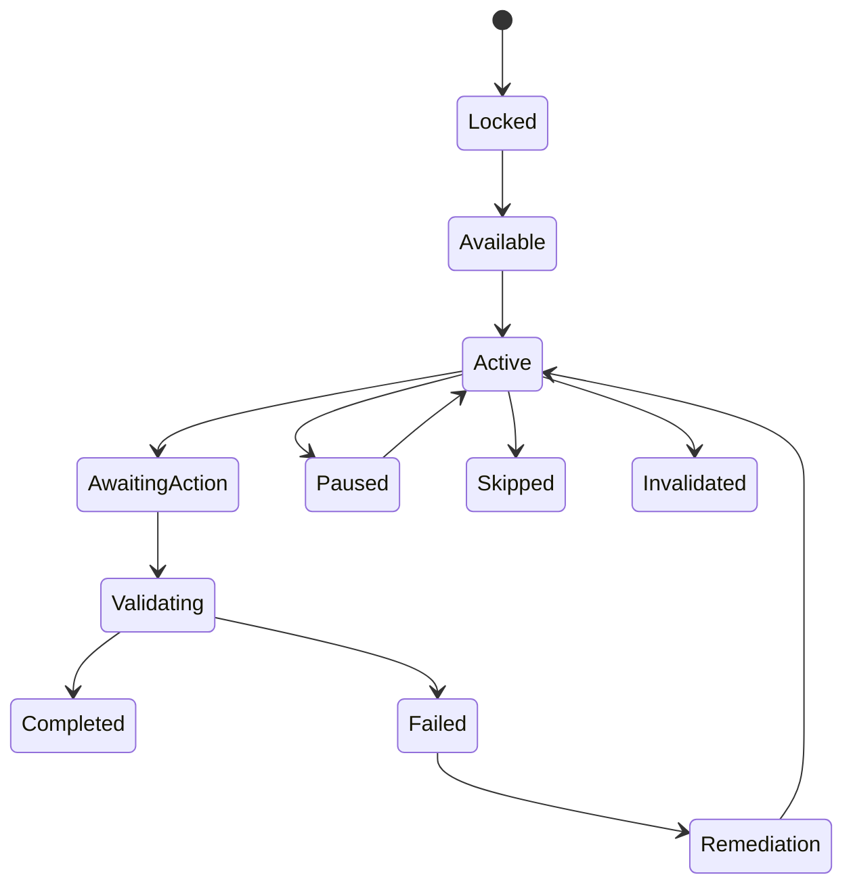

# Tutorial and Onboarding（教学与新手引导系统）

> Status: V1  
> Category: Player  
> Path: `design/systems/player/tutorial-and-onboarding.md`  
> Owner: TBD  
> Reviewers: Design / UX / Product / Engineering / QA / Research / Accessibility / Data / Support  
> Last Updated: 2026-07-11  
> Version: 1.0  
> Risk Level: High  
> Dependencies: Core Loop, Game State and Flow, Input and Interaction, Rules and Resolution, Content and Unlocks, Objectives and Quests, Settings and Preferences, Save and Persistence  
> Affected Systems: Progression System, Difficulty and Challenge, Characters and Loadouts, Reward System, Notification and Reminders, Analytics and Telemetry, Experiment Management, Live Operations

---

## 1. System Summary

Tutorial and Onboarding 系统负责定义：

```text
玩家第一次进入产品时如何建立理解；
系统如何识别玩家当前需要学习什么；
教学如何从“告诉玩家”
过渡到“让玩家尝试”
再到“验证玩家是否真正掌握”；
玩家如何跳过、重学、回顾和恢复；
回归玩家如何重新建立上下文；
不同设备、能力、经验和目标的玩家如何获得合适引导。
```

Onboarding 的范围通常大于 Tutorial。

Tutorial 主要负责：

- 教规则；
- 教操作；
- 教目标；
- 教反馈；
- 教系统关系。

Onboarding 还负责：

- 建立第一印象；
- 设定预期；
- 完成必要设置；
- 建立安全感；
- 介绍核心价值；
- 引导完成首次核心循环；
- 帮助玩家形成第一个自主目标。

健康的新手体验应让玩家在尽可能短的时间内回答：

- 我是谁；
- 我在这里要做什么；
- 我该如何行动；
- 系统如何回应我；
- 为什么值得继续；
- 接下来我可以自主做什么。

---

## 2. Purpose

### 2.1 Player Value

该系统帮助玩家：

- 快速理解核心体验；
- 以低风险方式尝试；
- 在失败后得到针对性帮助；
- 根据设备和能力调整输入；
- 跳过已掌握内容；
- 回看忘记的规则；
- 在回归后恢复上下文；
- 不被大量功能、奖励和入口淹没；
- 在形成依赖前理解付费、社交、数据和通知边界。

### 2.2 Experience Contribution

教学与引导直接影响：

- 首次理解；
- 首次成功；
- 首次信任；
- 掌控感；
- 可访问性；
- 节奏；
- 留存；
- 回归；
- 口碑；
- 支持成本。

不健康的教学会造成：

- 强制长流程；
- 只教按钮不教意图；
- 信息一次性过载；
- 角色替玩家完成核心行为；
- 无法跳过；
- 跳过后又无法补学；
- 新手保护长期限制玩家；
- 设备提示与实际绑定不一致；
- 回归玩家重新经历整套首登流程。

### 2.3 Product Value

该系统为以下能力提供共同基础：

- 首次用户体验；
- 新手留存；
- 功能开放；
- 设置引导；
- 输入适配；
- 难度推荐；
- 辅助功能发现；
- 回归；
- 新版本教育；
- 商业和社交边界说明；
- 数据验证；
- Support Deflection。

### 2.4 Why This System Exists

如果每个功能各自实现教学，常见结果是：

```text
同一术语被重复解释；
不同系统争夺玩家注意力；
教学只响应页面打开；
玩家跳过后状态不可恢复；
内容更新后旧教学失效；
教程完成状态与实际掌握无关；
所有新功能都弹出强制说明；
回归玩家被大量弹窗轰炸。
```

统一教学系统用于确保：

- 学习目标唯一；
- 教学状态可持久化；
- 内容分层；
- 提示按需要出现；
- 设备与输入提示动态更新；
- 跳过、重学、回归有统一规则；
- 教学不会绕过正常业务规则。

---

## 3. Non-Goals

该系统不负责：

- 替玩家长期做决定；
- 永久降低核心挑战；
- 代替完整帮助中心；
- 代替 Settings；
- 代替 Difficulty；
- 通过大量奖励强迫完成教学；
- 将所有功能都包装为强制教程；
- 使用一次性说明替代清楚设计；
- 让教学脚本直接修改领域状态；
- 通过不可跳过流程提高留存数字；
- 隐藏产品复杂度而不真正降低复杂度；
- 自动保证所有玩家都以同样方式学习。

---

## 4. Governing Principles

### 4.1 Player First Design

参考：

- `../../philosophy/foundation/player-first-design.md`

应用原则：

- 先展示核心价值，再解释周边系统；
- 教学长度尊重玩家时间；
- 熟练玩家有快速路径；
- 玩家可以跳过、暂停和恢复；
- 不用强制流程制造虚假参与。

### 4.2 Clarity and Feedback

参考：

- `../../philosophy/experience/clarity-and-feedback.md`

应用原则：

- 每个教学步骤有明确目标；
- 玩家操作后立即获得反馈；
- 错误说明原因；
- 完成状态可见；
- 输入提示与当前设备一致。

### 4.3 Simplicity and Depth

参考：

- `../../philosophy/experience/simplicity-and-depth.md`

应用原则：

- 先教最小可用规则；
- 深层系统按需要开放；
- 不一次解释全部例外；
- 通过真实情境建立理解。

### 4.4 Pacing and Rhythm

参考：

- `../../philosophy/experience/pacing-and-rhythm.md`

应用原则：

- 信息、操作和自主体验交替；
- 长引导有自然中断点；
- 高密度教学后提供自由空间；
- 不在高压时同时引入多个系统。

### 4.5 Accessibility and Inclusivity

参考：

- `../../philosophy/responsibility/accessibility-and-inclusivity.md`

应用原则：

- 首次进入尽早发现辅助设置；
- 支持文字、音频、图示和演示；
- 不要求高精度、快速反应或持续按住才能通过；
- 支持重复、减速和替代输入；
- 不因使用辅助而羞辱玩家。

### 4.6 Ethical Design

参考：

- `../../philosophy/responsibility/ethical-design.md`

应用原则：

- 教学不伪装商业入口；
- 不在信息不足时引导高风险消费；
- 社交、通知、数据和付费权限应清楚；
- 儿童和脆弱用户需要额外保护；
- 跳过和退出应真实可用。

---

## 5. Player Experience

### 5.1 Player Goal

玩家在新手阶段通常希望：

- 快速开始；
- 理解基本目标；
- 学会必要操作；
- 获得首次成功；
- 明白下一步；
- 避免犯不可逆错误；
- 调整适合自己的设置；
- 跳过已经掌握的内容。

### 5.2 Entry

教学与引导入口包括：

- 首次启动；
- 创建账户；
- 选择角色；
- 初始设置；
- 首次核心循环；
- 新功能解锁；
- 新版本；
- 设备切换；
- 失败后支持；
- 回归；
- 帮助中心；
- 手动重学。

### 5.3 Main Actions

玩家可以：

- 阅读；
- 观看；
- 尝试；
- 选择；
- 调整；
- 跳过；
- 暂停；
- 重试；
- 查看详情；
- 返回；
- 重学；
- 关闭；
- 接受推荐。

### 5.4 Core Decisions

关键决策包括：

- 是否启用辅助；
- 是否接受默认设置；
- 是否跳过教学；
- 是否选择推荐难度；
- 是否继续完整引导；
- 是否授权通知、社交或数据；
- 是否进入高风险或商业流程。

### 5.5 Success

健康的新手体验意味着：

- 玩家完成一次真实核心循环；
- 能说明主要目标；
- 能执行基础操作；
- 能理解成功和失败反馈；
- 能找到下一步；
- 能调整基础设置；
- 能退出或跳过不需要的教学；
- 不依赖教程脚本才能继续使用系统。

### 5.6 Failure

失败包括：

- 玩家不知道目标；
- 输入提示错误；
- 教学状态卡死；
- 设备切换后无法继续；
- 操作完成但未识别；
- 脚本绕过正常规则；
- 跳过后关键功能不可用；
- 回归后重复强制教学；
- 教学奖励未发放；
- 新版本导致旧步骤失效。

---

## 6. System Boundary

### 6.1 Inputs

系统接收：

- Account State；
- Player Experience State；
- Input Device；
- Input Mapping；
- Accessibility Preferences；
- Progression State；
- Content Unlock State；
- Objective State；
- Difficulty State；
- Feature Version；
- Return State；
- Failure History；
- Experiment Assignment；
- Platform and Region Context。

### 6.2 Outputs

系统产生：

- Onboarding Plan；
- Tutorial Step；
- Learning Objective；
- Guidance Prompt；
- Practice Scenario；
- Mastery Check；
- Skip Result；
- Completion State；
- Remediation Plan；
- Return Plan；
- Settings Recommendation；
- Tutorial Event；
- Next Action Recommendation。

### 6.3 Owned State

系统拥有：

- Onboarding Profile；
- Tutorial Definition；
- Tutorial Instance；
- Learning Objective State；
- Step State；
- Mastery Evidence；
- Skip State；
- Remediation State；
- Return Guidance State；
- Tutorial Version；
- Tutorial History；
- Prompt Frequency State。

### 6.4 Read-Only Dependencies

系统读取：

- Input and Interaction；
- Game State；
- Content and Unlocks；
- Objectives；
- Progression；
- Difficulty；
- Settings；
- Save；
- Analytics；
- Live Operations。

### 6.5 Write Dependencies

系统通过正式契约请求：

- Objectives 更新教学目标；
- Content 开放后续内容；
- Settings 保存偏好；
- Save 持久化教学状态；
- Reward 创建一次性教学奖励；
- Notification 记录权限选择；
- Analytics 记录教学行为。

### 6.6 Out of Scope

系统不直接：

- 修改资源余额；
- 应用角色成长；
- 完成普通任务；
- 解锁商业权益；
- 处理支付；
- 修改输入映射而不经确认；
- 替玩家执行不可逆业务操作。

---

## 7. Core Entities and Concepts

| Entity / Concept | Definition | Owner | Lifetime | Notes |
|---|---|---|---|---|
| Onboarding Profile | 当前玩家的新手和回归状态 | Tutorial | 长期 | 跨版本 |
| Tutorial Definition | 教学内容定义 | Tutorial | 版本级 | 唯一 ID |
| Tutorial Instance | 一次具体教学流程 | Tutorial | 至结束 | 可恢复 |
| Learning Objective | 玩家需要理解或掌握的能力 | Tutorial | 长期或版本级 | 与步骤分离 |
| Tutorial Step | 一个教学动作或说明 | Tutorial | 实例级 | 不等同学习目标 |
| Guidance Prompt | 情境提示 | Tutorial | 短期 | 有频率限制 |
| Practice Scenario | 安全练习环境 | Tutorial / Content | 短期 | 使用真实规则 |
| Mastery Evidence | 玩家已理解的证据 | Tutorial | 长期或版本级 | 非单一点击 |
| Remediation | 针对失败的补充教学 | Tutorial | 短期 | 按需要触发 |
| Skip State | 玩家跳过了什么 | Tutorial | 长期 | 支持重学 |
| Return Plan | 回归玩家的恢复路径 | Tutorial | 阶段性 | 根据变化生成 |
| Tutorial History | 完成、跳过、失败和版本记录 | Tutorial | 长期 | 支持迁移 |

---

## 8. Onboarding Phases

推荐分为：

```text
1. Pre-Entry
2. First Launch
3. Safety and Preferences
4. Core Value Preview
5. First Guided Action
6. First Core Loop
7. First Independent Action
8. First Meaningful Choice
9. First Failure and Recovery
10. Transition to Normal Experience
```

### 8.1 Pre-Entry

包括：

- 平台要求；
- 登录；
- 更新；
- 权限；
- 网络；
- 年龄和地区。

### 8.2 First Launch

建立：

- 产品身份；
- 基础预期；
- 初始状态。

### 8.3 Safety and Preferences

尽早提供：

- 字幕；
- 音量；
- 文字大小；
- 输入；
- 运动减少；
- 色觉；
- 难度；
- 隐私；
- 通知。

### 8.4 Core Value Preview

让玩家尽快看到：

- 核心幻想；
- 核心行为；
- 核心反馈。

### 8.5 Guided Action

低风险引导一次基础行为。

### 8.6 First Core Loop

完成：

```text
目标
→ 行动
→ 结果
→ 奖励
→ 下一目标
```

### 8.7 Independent Action

移除部分提示，让玩家自主完成。

### 8.8 Meaningful Choice

引入第一个真实选择，而不是假选择。

### 8.9 Failure and Recovery

让玩家理解：

- 失败原因；
- 重试；
- 调整；
- 不可用操作。

### 8.10 Transition

明确告诉玩家：

- 引导已结束；
- 接下来可以做什么；
- 帮助在哪里；
- 教学可以重看。

---

## 9. Learning Objective Taxonomy

### 9.1 Concept Objective

理解一个概念。

例如：

- 资源用于什么；
- 角色定位是什么。

### 9.2 Input Objective

学会表达一个意图。

### 9.3 Rule Objective

理解规则。

### 9.4 Feedback Objective

识别系统状态和结果。

### 9.5 Decision Objective

学会做一个选择。

### 9.6 Navigation Objective

找到入口和返回路径。

### 9.7 Recovery Objective

学会失败后如何恢复。

### 9.8 Safety Objective

理解：

- 购买；
- 删除；
- 退出；
- 隐私；
- 社交；
- 通知。

### 9.9 Mastery Objective

稳定应用多个已学规则。

---

## 10. Tutorial Definition Template

```markdown
## Tutorial Definition

- Tutorial ID:
- Display Name:
- Audience:
- Entry Condition:
- Learning Objectives:
- Required Context:
- Steps:
- Practice:
- Mastery Check:
- Failure Support:
- Skip:
- Replay:
- Reward:
- Unlocks:
- Accessibility:
- Version:
- Owner:
- Risk Level:
```

### 10.1 必须回答

- 教什么；
- 为什么现在教；
- 玩家什么时候需要；
- 如何练习；
- 如何验证掌握；
- 是否可跳过；
- 如何重学；
- 内容更新后如何迁移；
- 教学失败是否阻塞核心体验。

---

## 11. Step Types

### 11.1 Explanation

说明概念。

### 11.2 Demonstration

展示正确行为。

### 11.3 Guided Action

要求玩家执行。

### 11.4 Practice

在低风险环境中自由尝试。

### 11.5 Mastery Check

验证玩家是否能够独立完成。

### 11.6 Reflection

总结：

- 做了什么；
- 为什么成功；
- 下一步如何使用。

### 11.7 Choice

让玩家做出真实选择。

### 11.8 Recovery

处理错误、失败或卡住。

---

## 12. Tutorial Step State Model

```text
Locked
→ Available
→ Active
→ Awaiting Action
→ Validating
→ Completed
```

异常状态：

```text
Active
→ Paused
Active
→ Skipped
Active
→ Failed
Failed
→ Remediation
Remediation
→ Active
Any
→ Invalidated by Version
```



---

## 13. Tutorial State Invariants

1. Tutorial 状态不应由 UI 动画决定。
2. Step Completed 必须基于权威事实或明确确认。
3. 跳过不会伪造 Mastery Evidence。
4. 教学脚本不能直接修改领域状态。
5. Tutorial Reward 只能成功发放一次。
6. 页面关闭不等于教学完成。
7. 设备切换不应重置已完成步骤。
8. 版本失效时保留历史并进入迁移。
9. Analytics 失败不阻止教学。
10. 玩家退出教学后必须返回安全状态。
11. 教学提示不能覆盖高风险系统警告。
12. 使用辅助不应导致教学无法完成。

---

## 14. Teach Intent, Not Buttons

教学应优先描述：

```text
你要完成什么
```

再根据当前设备显示：

```text
如何执行
```

例如：

```text
目标：
打开背包并装备一件物品。

当前设备：
手柄 A / 键盘 E / 触摸按钮。
```

### 14.1 Benefits

- 支持重绑定；
- 支持设备切换；
- 支持辅助设备；
- 降低平台耦合；
- 帮助玩家理解业务语义。

### 14.2 Avoid Hardcoded Prompts

不要在教学内容中硬编码：

```text
Press E
```

应引用：

```text
Context Action
```

---

## 15. Real Rules and Safe Context

教学应尽量使用真实规则。

### 15.1 Real Rule Principle

如果教学中：

- 伤害；
- 资源；
- 冷却；
- 目标；
- 奖励；

与正式体验不同，会导致迁移成本。

### 15.2 Safe Context

可以降低风险：

- 无永久损失；
- 更宽输入窗口；
- 更少敌人；
- 更多提示；
- 免费重试；
- Checkpoint；
- 自动恢复。

### 15.3 Do Not Fake Core Systems

避免只在教学中存在的特殊交互，除非明确是演示工具。

---

## 16. Progressive Disclosure

### 16.1 Layer 1: Essential

立即完成核心循环所需。

### 16.2 Layer 2: Useful

玩家开始自主后需要。

### 16.3 Layer 3: Advanced

深层构筑、优化和高级系统。

### 16.4 Layer 4: Expert

边界规则、复杂组合和高难内容。

### 16.5 Disclosure Rule

只有当玩家：

- 即将使用；
- 明确需要；
- 主动查看；
- 反复失败；

时再引入复杂信息。

---

## 17. Information Budget

每个阶段应控制：

- 新术语数量；
- 新按钮数量；
- 新系统数量；
- 需要记忆的规则；
- 同时显示的提示；
- 连续说明时长。

### 17.1 Budget Signals

出现以下现象说明过载：

- 玩家连续快速关闭；
- 提示后立即遗忘；
- 依赖外部攻略；
- 任务完成但不能复述原因；
- 大量回退；
- 随机点击。

---

## 18. Prompt Types

### 18.1 Blocking Prompt

必须处理才能继续。

只适用于：

- 安全；
- 法律；
- 必要设置；
- 无法继续的核心教学。

### 18.2 Context Prompt

在相关情境出现。

### 18.3 Optional Tip

可忽略。

### 18.4 Reminder

玩家之前学过但当前可能忘记。

### 18.5 Recovery Prompt

错误或失败后出现。

### 18.6 Discovery Hint

帮助发现功能。

### 18.7 Commercial Prompt

不应混入普通教学 Prompt。

---

## 19. Prompt Frequency and Fatigue

### 19.1 Frequency Rules

每个 Prompt 应有：

- 最大显示次数；
- 冷却；
- 关闭记忆；
- 完成条件；
- 重置条件；
- 版本。

### 19.2 Dismissal

关闭应有真实效果。

### 19.3 Do Not Repeatedly Reopen

如果玩家连续拒绝提示，应：

- 降低频率；
- 转入帮助中心；
- 不不断强制弹出。

### 19.4 Critical Reminder

只有高风险安全问题可以覆盖普通频率限制。

---

## 20. Guidance Layers

推荐分层：

```text
1. Environmental Cue
2. UI Highlight
3. Short Text
4. Demonstration
5. Guided Step
6. Strong Hint
7. Assisted Completion
```

应从低干扰层开始，根据需要逐步加强。

### 20.1 Environmental Cue

通过环境和布局引导。

### 20.2 UI Highlight

突出当前相关元素。

### 20.3 Short Text

提供简要说明。

### 20.4 Demonstration

演示操作。

### 20.5 Guided Step

限制部分无关操作。

### 20.6 Strong Hint

明确下一步。

### 20.7 Assisted Completion

只用于非核心障碍或卡死恢复，且应可关闭。

---

## 21. Input Guidance

### 21.1 Dynamic Device Prompt

根据当前设备和绑定显示。

### 21.2 Device Change

设备切换时：

- 更新提示；
- 保留步骤；
- 重新建立焦点；
- 不重复已完成说明。

### 21.3 Remapping

教学读取实际映射。

### 21.4 Unbound Action

如果核心 Action 未绑定：

- 暂停教学；
- 引导修复；
- 提供默认恢复；
- 保留安全退出。

### 21.5 Assistive Input

Switch、Adaptive Controller、Eye Tracking 等设备应通过相同 Intent 完成教学。

---

## 22. Practice Design

### 22.1 Practice Purpose

让玩家在低风险环境形成：

- 认知；
- 操作；
- 反馈识别；
- 决策。

### 22.2 Practice Structure

```text
Explain
→ Demonstrate
→ Guided Attempt
→ Free Attempt
→ Feedback
→ Repeat or Advance
```

### 22.3 Safe Failure

失败不应产生：

- 永久损失；
- 高资源成本；
- 排名损失；
- 付费压力。

### 22.4 Practice Exit

玩家可以：

- 重试；
- 跳过；
- 查看演示；
- 调整设置；
- 返回。

---

## 23. Mastery Checks

### 23.1 Purpose

验证玩家能独立完成，而不是只跟随高亮。

### 23.2 Evidence Types

- 独立完成动作；
- 在正确情境使用；
- 识别反馈；
- 做出正确选择；
- 从失败中恢复；
- 多次稳定完成。

### 23.3 Weak Evidence

以下通常不足：

- 打开页面；
- 点击高亮按钮；
- 等待动画结束；
- 阅读完成。

### 23.4 Mastery Threshold

根据风险决定：

- 一次成功；
- 多次成功；
- 情境变化；
- 无提示完成；
- 明确确认理解。

---

## 24. Mastery State

可使用：

- Unknown；
- Introduced；
- Practiced；
- Demonstrated；
- Mastered；
- Needs Refresh；
- Invalidated by Version。

### 24.1 Version Changes

若规则重大变化：

- Mastered → Needs Refresh；
- 保留旧历史；
- 只教学变化部分。

### 24.2 Avoid Permanent Assumption

多年未使用或长期回归后，可以提供可选刷新，而不是强制重做。

---

## 25. Error and Failure Support

### 25.1 Error Types

- Input Error；
- Rule Misunderstanding；
- Navigation Error；
- Timing Error；
- Decision Error；
- Configuration Error；
- System Error。

### 25.2 Support Ladder

```text
Feedback
→ Short Hint
→ Specific Hint
→ Demonstration
→ Assisted Practice
→ Optional Skip
```

### 25.3 Do Not Punish Learning

新手错误不应造成：

- 重大资源损失；
- 永久路线锁定；
- 高等待；
- 社交羞辱；
- 付费压力。

### 25.4 System Error

Bug、网络、设备问题不能被解释为“玩家操作错误”。

---

## 26. Remediation

Remediation 是针对特定缺口的补充教学。

### 26.1 Trigger

- 连续失败；
- 错误重复；
- 长时间无进度；
- 频繁打开帮助；
- 构筑非法；
- 输入无效；
- 回归遗忘。

### 26.2 Remediation Types

- 重新解释；
- 演示；
- 练习；
- 设置建议；
- 难度建议；
- 目标分解；
- 设备修复；
- 替代路径。

### 26.3 Respectful Delivery

应：

- 可忽略；
- 不羞辱；
- 不自动改变设置；
- 不公开展示；
- 不首先指向付费。

---

## 27. Skip

### 27.1 Skip Types

- Skip Step；
- Skip Section；
- Skip Tutorial；
- Skip Known Content；
- Skip on New Character；
- Skip on New Account with Experience Proof。

### 27.2 Skip Rules

跳过前说明：

- 会跳过什么；
- 是否仍解锁功能；
- 是否失去奖励；
- 是否可以重学；
- 是否影响后续。

### 27.3 Critical Steps

以下可能不可完全跳过：

- 法律；
- 安全；
- 必需权限；
- 高风险交易说明；
- 账户保护。

但仍应尽量简化。

### 27.4 Skip Does Not Equal Mastery

只记录：

```text
Skipped
```

不能记录为：

```text
Mastered
```

---

## 28. Replay and Relearning

### 28.1 Replay Entry

玩家应能从：

- 帮助中心；
- 设置；
- 系统页面；
- 失败提示；
- 回归页面；

重新进入教学。

### 28.2 Replay Modes

- Full；
- Summary；
- Demonstration；
- Practice；
- Mastery Check；
- What Changed。

### 28.3 Reward Rules

重学通常不重复发放一次性奖励。

### 28.4 State Protection

重学不应覆盖正常进度和配置。

---

## 29. Tutorial Rewards

### 29.1 Reward Purpose

教学奖励可以：

- 提供起步资源；
- 支持首次选择；
- 确认完成；
- 让玩家试用功能。

### 29.2 Avoid Reward Coercion

奖励不应大到迫使玩家完成不需要的长教程。

### 29.3 Invariants

- 同一教学奖励只发一次；
- 跳过是否发放需提前说明；
- 重学不重复发放；
- Pending 可恢复；
- Reward 系统拥有最终发放。

---

## 30. Feature Onboarding

新功能开放时不应默认弹出完整教程。

### 30.1 Trigger

在玩家：

- 首次进入；
- 首次需要；
- 主动查看；
- 相关失败；

时教学。

### 30.2 Feature Onboarding Structure

```text
Why It Matters
→ What It Does
→ One Safe Action
→ Result
→ Where to Learn More
```

### 30.3 Avoid Popup Cascade

多个新功能同时开放时：

- 排队；
- 分层；
- 按需要；
- 合并摘要；
- 允许稍后查看。

---

## 31. Progressive Feature Unlock

复杂系统应在玩家已有上下文时开放。

### 31.1 Unlock Criteria

可以基于：

- 核心循环完成；
- 掌握证据；
- 进度；
- 明确选择；
- 内容需要。

### 31.2 Do Not Delay Core Value

核心体验不应被大量教学门槛推迟。

### 31.3 Skilled Player Fast Path

可以通过：

- 自我声明；
- 快速测试；
- 旧账户历史；
- 平台存档；
- 已完成相关内容；

跳过基础教学。

---

## 32. Settings Onboarding

首次进入应尽早提供关键设置。

### 32.1 Essential Settings

- 字幕；
- 语言；
- 音量；
- 文字大小；
- 高对比；
- 色觉；
- 减少运动；
- 输入；
- Hold / Toggle；
- 难度；
- 隐私；
- 通知。

### 32.2 Suggested Defaults

可以根据平台推荐，但需：

- 说明；
- 可修改；
- 不推断敏感健康身份；
- 不自动开启高风险权限。

### 32.3 Revisit

设置入口必须长期可访问。

---

## 33. Accessibility Onboarding

### 33.1 Early Access

辅助设置应在核心教学前或早期可达。

### 33.2 Discovery

可以通过中性方式询问：

```text
是否需要调整显示、输入、声音或节奏？
```

而不是要求用户声明障碍或身份。

### 33.3 Assist Presets

可以提供：

- Motor；
- Vision；
- Hearing；
- Cognitive；
- Low Stress；
- Custom。

但应允许逐项查看和修改。

### 33.4 Tutorial Compatibility

所有教学必须在辅助模式下可完成。

---

## 34. Difficulty Onboarding

### 34.1 Initial Difficulty

提供：

- 清楚说明；
- 可随时调整；
- 不羞辱标签；
- 核心体验差异；
- 奖励影响。

### 34.2 Recommendation

可以根据：

- 自我选择；
- 快速测试；
- 过往经验；
- 输入能力；
- 目标；

提供建议。

### 34.3 Dynamic Support

连续失败后可以建议：

- 提示；
- 辅助；
- 降低难度；
- 练习。

不应自动隐藏调整。

---

## 35. Character and Build Onboarding

### 35.1 Character Selection

应解释：

- 核心幻想；
- 定位；
- 操作负担；
- 优势；
- 弱点。

### 35.2 First Build

首次构筑应：

- 选项有限但真实；
- 可预览；
- 可重置；
- 不造成永久错误；
- 使用实际系统。

### 35.3 Advanced Build

只有在玩家需要时介绍：

- 深层属性；
- 互斥；
- 套装；
- 复杂资源；
- 高级推荐。

---

## 36. Economy and Reward Onboarding

### 36.1 Resource Teaching

只介绍当前立即有用途的资源。

### 36.2 Spend Teaching

首次消费应：

- 低风险；
- 结果可感知；
- 成本清楚；
- 可恢复或可重置。

### 36.3 Reward Teaching

说明：

- 来源；
- 用途；
- 领取；
- 容量；
- 重复；
- 到期。

### 36.4 Premium Currency

在首次商业使用前必须清楚说明：

- 真实价值；
- 扣除；
- 退款；
- 是否随机；
- 是否过期。

---

## 37. Social Onboarding

### 37.1 Social Features

应解释：

- 谁能看到什么；
- 如何拒绝；
- 如何屏蔽；
- 如何举报；
- 是否公开；
- 是否跨平台。

### 37.2 Consent

好友、组队、语音、公开分享不能默认强制开启。

### 37.3 No Forced Social

核心成长不应要求玩家完成强制社交教学。

---

## 38. Commercial Onboarding

### 38.1 Separation

商业入口不得伪装成普通教学完成步骤。

### 38.2 First Purchase Education

应说明：

- 商品内容；
- 价格；
- 所有权；
- 平台；
- 退款；
- 订阅；
- 随机；
- 自动续费。

### 38.3 No High-Pressure Timing

不应在：

- 首次失败；
- 疲劳；
- 教学卡住；
- 角色失望；

时立即推送高压购买。

---

## 39. Permission Onboarding

权限包括：

- 通知；
- 麦克风；
- 相册；
- 定位；
- 联系人；
- 追踪；
- 云存档。

### 39.1 Ask in Context

只在玩家理解用途时请求。

### 39.2 Explain

说明：

- 为什么需要；
- 不授权会怎样；
- 如何之后修改；
- 数据如何使用。

### 39.3 No Fake Requirement

可选权限不能伪装成必须。

---

## 40. Return Onboarding

回归玩家需要的不是完整首登教程，而是：

- 状态摘要；
- 规则变化；
- 构筑变化；
- 进行中目标；
- 新功能；
- 追赶；
- 设置；
- 快速练习。

### 40.1 Return Classification

可以按离开时长和变化程度分为：

- Short Return；
- Medium Return；
- Major Return；
- Version Return；
- Platform Return。

### 40.2 Return Plan

```text
Welcome Back
→ What Changed
→ Your Current State
→ Optional Practice
→ Recommended Goal
→ Normal Experience
```

### 40.3 Avoid Flooding

新功能按优先级和需要重新介绍。

---

## 41. What Changed

版本更新后提供：

- 核心规则变化；
- 角色或构筑变化；
- 资源变化；
- 内容变化；
- 已失效入口；
- 免费重置；
- 新辅助；
- 新安全设置。

### 41.1 Change Relevance

只展示与玩家状态相关的主要变化。

### 41.2 Detailed History

完整变化可在 Patch Notes 或帮助中心查看。

---

## 42. Cross-Device and Cross-Platform Onboarding

### 42.1 Device Change

换设备时重新介绍：

- 输入；
- 平台惯例；
- 性能设置；
- 云存档；
- 权益差异。

### 42.2 Do Not Reset Knowledge

不重复教学已掌握业务规则。

### 42.3 Platform Restrictions

应说明：

- 内容差异；
- 所有权；
- 购买；
- 社交；
- 存档；
- 设置同步。

---

## 43. Tutorial Save and Resume

### 43.1 Save State

至少保存：

- Tutorial Instance；
- Current Step；
- Completed Objectives；
- Skip State；
- Mastery State；
- Device；
- Version；
- Safe Return Point。

### 43.2 Resume

恢复时：

- 验证 Context；
- 验证 Content；
- 验证版本；
- 验证输入；
- 返回安全步骤；
- 不重复奖励。

### 43.3 Mid-Step Resume

高复杂步骤可以从最近安全节点恢复，而不是精确恢复动画。

---

## 44. Tutorial Versioning

### 44.1 Version Changes

需要新版本的情况：

- 核心规则变化；
- 输入语义变化；
- 页面流程变化；
- 内容入口变化；
- 安全或商业说明变化。

### 44.2 Migration

旧状态可映射为：

- Completed；
- Needs Refresh；
- Skipped；
- Restart Section；
- Deprecated。

### 44.3 Removed Tutorial

删除教学时：

- 保留历史；
- 迁移未完成实例；
- 处理奖励；
- 清理入口；
- 提供新帮助路径。

---

## 45. Tutorial Experiments

可以实验：

- 顺序；
- 长度；
- 提示方式；
-练习；
- Mastery Check；
- 跳过入口；
- 设置发现。

### 45.1 Experiment Constraints

不能实验：

- 隐藏关键安全信息；
- 让部分玩家无法退出；
- 不透明改变付费；
- 删除基础辅助入口；
- 让一组玩家承受重大不可逆风险。

### 45.2 Permanent State

实验结束后必须迁移：

- 完成状态；
- 奖励；
- 解锁；
- 设置；
- Mastery；
- Skip。

---

## 46. Tutorial Analytics

### 46.1 Learning Metrics

关注：

- 理解；
- 独立完成；
- 错误类型；
- 重试；
- 回顾；
- 后续使用。

### 46.2 Avoid Vanity Metrics

仅关注：

- 教程完成率；
- 点击率；
- 停留时长；

不足以证明教学有效。

### 46.3 Mastery Transfer

应验证玩家在正式情境中是否能应用。

---

## 47. Failure and Recovery

| Failure | Cause | Player Impact | Recovery | Data Guarantee |
|---|---|---|---|---|
| Step Not Recognized | Fact 丢失或条件错误 | 无法继续 | 重算、跳过或重试 | 已完成状态不丢失 |
| Device Changed | 输入设备切换 | 提示错误 | 更新 Prompt、恢复焦点 | Step 保留 |
| Input Unbound | Action 无绑定 | 无法执行 | 引导修复或恢复默认 | Mapping 备份 |
| Tutorial Context Missing | 内容下架或版本变化 | 教程卡死 | 迁移到安全步骤 | 历史保留 |
| Reward Pending | 下游超时 | 奖励未到账 | 幂等恢复 | 完成事实保留 |
| Save Failed | 持久化异常 | 重复教学 | 本地安全点和重试 | 不重复奖励 |
| Assist Incompatible | 教程不支持辅助 | 无法完成 | 替代步骤或自动验证 | 偏好保留 |
| Return Plan Invalid | 状态变化过大 | 回归迷失 | 重新生成计划 | 原进度保留 |
| Version Conflict | 教学定义更新 | 步骤失效 | Needs Refresh / Migration | 版本可审计 |

---

## 48. Edge Cases

### First Launch

- 无网络；
- 无账户；
- 旧存档；
- 云端冲突；
- 控制器未连接；
- 辅助设备；
- 低性能设备；
- 地区限制。

### Tutorial Flow

- 玩家快速跳过多个步骤；
- 在 Modal 中退出；
- 应用进入后台；
- 教学中崩溃；
- 内容版本更新；
- 输入设备切换；
- 页面重载。

### Mastery

- 玩家偶然完成；
- 玩家通过不同方法完成；
- 使用辅助；
- 自动化功能；
- 多人队友代为完成；
- 行为在教学开始前已发生。

### Return

- 离开多年；
- 多个大版本；
- 角色重构；
- 资源迁移；
- 内容下架；
- 平台更换；
- 设置丢失。

### Rewards

- 跳过是否领奖；
- 重学；
- 多设备重复；
- Reward Pending；
- 容量不足；
- 活动奖励已过期。

---

## 49. Cross-System Dependencies

| System | Dependency Type | Direction | Data or Event | Failure Impact |
|---|---|---|---|---|
| Input and Interaction | Hard | 双向 | Intent / Prompt | 无法完成教学 |
| Game State and Flow | Hard | 双向 | Tutorial Mode / Resume | 流程卡死 |
| Content and Unlocks | Hard | Content → Tutorial | Context / Unlock | 教学失效 |
| Objectives and Quests | Hard / Soft | 双向 | Learning Objective | 完成识别错误 |
| Settings and Preferences | Hard / Soft | 双向 | Accessibility / Input | 使用默认设置 |
| Save and Persistence | Hard | Tutorial → Save | State / History | 无法恢复 |
| Difficulty and Challenge | Soft / Hard | 双向 | Practice / Assist | 挑战不适配 |
| Characters and Loadouts | Soft | Characters → Tutorial | Build Context | 教学不匹配 |
| Reward System | Soft / Hard | Tutorial → Reward | One-Time Reward | 奖励延迟 |
| Notification and Reminders | Soft | Tutorial → Notification | Permission / Reminder | 不阻断 |
| Analytics and Telemetry | Soft | Tutorial → Analytics | Learning Events | 不阻断 |
| Experiment Management | Soft / Hard | 双向 | Tutorial Variant | 状态迁移风险 |

---

## 50. Data and Persistence

| State | Persistent | Authority | Save Trigger | Retention | Recovery |
|---|---|---|---|---|---|
| Onboarding Profile | 是 | Tutorial | 关键阶段变化 | 长期 | History 重建 |
| Tutorial Instance | 是 | Tutorial | 创建和状态变化 | 实例期及审计期 | Resume |
| Learning Objective State | 是 | Tutorial | 掌握变化 | 长期或版本期 | 重新验证 |
| Step State | 是 | Tutorial | Step 变化 | 实例期 | 安全节点 |
| Skip State | 是 | Tutorial | 跳过 | 长期 | 重学入口 |
| Mastery Evidence | 是 | Tutorial | 验证完成 | 长期或版本期 | Needs Refresh |
| Remediation State | 是或会话级 | Tutorial | 失败支持 | 短期 | 重新生成 |
| Return Plan | 是或可重算 | Tutorial | 回归生成 | 阶段性 | 重新生成 |
| Tutorial Version | 是 | Tutorial | 实例创建 | 长期 | 迁移 |
| Tutorial History | 是 | Tutorial | 完成、跳过、失败 | 长期 | 审计 |

---

## 51. Accessibility

### 51.1 Visual

- 说明有文本；
- 高亮不只靠颜色；
- 支持文字大小和高对比；
- 教学遮罩不遮挡关键状态；
- 动画可减弱。

### 51.2 Audio

- 所有语音有字幕；
- 声音提示有视觉替代；
- 可重复播放；
- 音量可独立调整。

### 51.3 Input

- 支持重绑定；
- 支持 Hold / Toggle；
- 支持单手；
- 支持替代输入；
- 不强制拖拽；
- 扩大输入窗口。

### 51.4 Cognitive

- 每步目标单一；
- 术语一致；
- 支持重复；
- 支持摘要；
- 分阶段；
- 避免大量同时提示。

### 51.5 Timing

- 可暂停；
- 可减速；
- 无不必要倒计时；
- 阅读时间不限制；
- 长步骤有中断点。

### 51.6 Stress

- 失败无重大损失；
- 可以跳过；
- 可以降低压力；
- 不公开展示表现；
- 不用角色责备玩家。

---

## 52. Ethical and Safety Review

### 52.1 Autonomy

- 跳过、退出和稍后处理真实有效；
- 教学不强制不必要权限；
- 不自动改变高影响设置；
- 不把商业入口设为完成条件。

### 52.2 Financial Safety

- 首次付费前完整说明；
- 不在失败后高压推销；
- 不使用教程奖励诱导不理解的消费；
- 自动续费和随机性清楚。

### 52.3 Children and Vulnerable Users

- 提供监护和时间保护；
- 不使用角色羞辱；
- 不用连续完成压力；
- 社交和公开功能默认谨慎；
- 付费教学有额外确认。

### 52.4 Privacy

- 权限按需请求；
- 数据用途清楚；
- 不记录敏感文本和输入；
- 不利用教学失败推断健康或认知身份。

### 52.5 Dark Patterns

禁止：

- 假关闭按钮；
- 隐藏跳过；
- 强制倒计时；
- 伪装教学的购买；
- 关闭后反复立即出现；
- 将拒绝描述为错误选择。

---

## 53. Analytics and Validation

### 53.1 Key Assumptions

1. 玩家能快速理解核心目标。
2. 玩家能独立完成基础核心循环。
3. 教学提示与设备和实际映射一致。
4. Progressive Disclosure 降低信息负担。
5. Mastery Check 能反映真实理解。
6. Skip 和 Replay 提高自主性而不破坏可用性。
7. 失败支持能够改善后续表现。
8. 辅助设置容易发现且教学兼容。
9. 回归玩家能恢复上下文而不重复完整首登。
10. 新功能教学不会造成 Popup Fatigue。

### 53.2 Validation Plan

| Hypothesis | Evidence | Success | Failure | Method |
|---|---|---|---|---|
| 核心目标清楚 | 复述 | 能说明目标和下一步 | 随机操作 | 可用性测试 |
| 可独立完成 | 无提示任务 | 正常完成核心循环 | 仍依赖高亮 | Mastery Test |
| 设备提示正确 | 切换设备 | Prompt 稳定更新 | 错误或抖动 | QA |
| 信息负担合理 | 回忆和行为 | 关键内容保留 | 立即遗忘 | 研究 |
| Mastery 有效 | 正式场景表现 | 能迁移应用 | 只会教学场景 | 行为对比 |
| Skip 安全 | 跳过路径 | 能正常使用系统 | 核心功能不可用 | QA / Research |
| Remediation 有效 | 失败后表现 | 错误减少 | 重复失败 | 数据 |
| 辅助可发现 | 目标用户测试 | 能找到和应用 | 教学无法完成 | Accessibility Test |
| Return 有效 | 回归任务 | 快速恢复上下文 | 弹窗过载 | Research |
| Feature Onboarding 健康 | 提示行为 | 按需查看 | 大量关闭和疲劳 | 长期数据 |

### 53.3 Behavioral Metrics

- Onboarding Started；
- Step Started；
- Step Completed；
- Step Failed；
- Tutorial Paused；
- Tutorial Skipped；
- Tutorial Replayed；
- Mastery Demonstrated；
- Remediation Shown；
- Remediation Completed；
- Accessibility Settings Opened；
- Device Changed；
- Return Plan Completed；
- Help Opened。

### 53.4 Outcome Metrics

- Time to First Core Action；
- Time to First Core Loop；
- Independent Completion；
- Mastery Transfer；
- Error Reduction；
- Skip Success；
- Replay Success；
- Return Recovery Time；
- Settings Discovery；
- Assist Completion；
- Tutorial Reward Recovery；
- Feature Prompt Fatigue。

### 53.5 Negative Metrics

- 教学卡死；
- 设备提示错误；
- 输入未绑定；
- 强制流程过长；
- 跳过后不可用；
- 重学重复奖励；
- 新功能弹窗堆积；
- 回归重复首登；
- 辅助模式无法完成；
- 失败后付费推送；
- 页面关闭导致状态丢失；
- 教学完成但正式场景不会使用。

### 53.6 Event Intents

| Event Intent | Trigger | Key Properties | Privacy Notes |
|---|---|---|---|
| Tutorial Started | 实例创建 | Tutorial Type, Version | 匿名 ID |
| Learning Objective Completed | 掌握验证 | Objective Type, Evidence | 不记录敏感输入 |
| Tutorial Skipped | 跳过 | Scope, Stage | 不用于羞辱或操纵 |
| Remediation Triggered | 连续失败 | Reason Category | 不推断健康身份 |
| Device Prompt Changed | 设备切换 | Device Type | 不记录硬件唯一标识 |
| Accessibility Entry Used | 打开辅助设置 | Category | 不推断个人属性 |
| Return Plan Generated | 回归 | Return Type, Change Count | 数据最小化 |
| Tutorial Recovery Completed | 恢复成功 | Failure Type | 审计 |

---

## 54. Tutorial Model Template

```markdown
# Tutorial Model

## Audience

- New:
- Skilled:
- Returning:
- Accessibility:
- Platform:

## Learning Objectives

| Objective | Why Now | Practice | Mastery Evidence |
|---|---|---|---|

## Flow

| Step | Type | Context | Completion | Failure Support |
|---|---|---|---|---|

## Input

- Intent:
- Device Prompt:
- Rebinding:
- Assistive Input:

## Skip and Replay

- Skip:
- Critical Steps:
- Replay:
- Reward:

## Return

- What Changed:
- Practice:
- Recommendation:

## Validation

- Success:
- Failure:
- Metrics:
```

---

## 55. Tutorial Debt

Tutorial Debt 包括：

- 旧截图；
- 硬编码按键；
- 失效页面路径；
- 重复说明；
- 强制弹窗；
- 无 Owner 教学；
- 旧版本步骤；
- 无法跳过；
- 无法重学；
- 脚本直接改业务状态；
- 辅助不兼容；
- 回归规则缺失。

### 55.1 Signals

- 每次 UI 改动都破坏教学；
- 玩家完成教程仍不会操作；
- Support 大量回答基础问题；
- 不敢调整核心流程；
- 新功能都依赖弹窗；
- 跳过率和失败率同时很高。

### 55.2 Reduction

- 以 Intent 替代按键；
- 以 Learning Objective 替代页面步骤；
- 使用 Domain Fact；
- 减少强制 Prompt；
- 增加 Replay；
- 建立版本迁移；
- 定期内容审计；
- 删除重复和低价值教学。

---

## 56. Rollout and Migration

### 56.1 Rollout

教学变更应按：

- 内部；
- 可用性测试；
- 目标用户测试；
- 小范围；
- 分平台；
- 分新手类型；
- 全量；

逐步发布。

### 56.2 High-Risk Changes

包括：

- 首次核心流程；
- 关键权限；
- 付费说明；
- 跳过；
- Mastery Gate；
- 辅助入口；
- 教学奖励；
- 旧状态迁移；
- 回归计划。

### 56.3 Migration

必须定义：

- Tutorial Instance；
- Step State；
- Learning Objective；
- Mastery；
- Skip；
- Reward；
- Unlock；
- Settings；
- Return Plan；
- History。

### 56.4 Rollback

回滚时：

- 不重复教学奖励；
- 不重新锁定已解锁功能；
- 保留玩家 Skip；
- 保留辅助设置；
- 恢复旧定义或安全摘要；
- Pending 教学继续恢复；
- 不丢失 Mastery History。

### 56.5 Stop Conditions

出现以下情况应停止发布：

- 大量玩家无法完成首个核心循环；
- 教学卡死；
- 输入提示错误；
- 跳过后功能不可用；
- 付费或权限说明缺失；
- 辅助入口失效；
- 教学奖励重复；
- 回归玩家被强制重做；
- 状态迁移失败；
- 首次流程崩溃或大量退出。

---

## 57. Risks and Open Questions

| Item | Type | Impact | Probability | Mitigation | Owner |
|---|---|---:|---:|---|---|
| 教学过长 | Experience Risk | 高 | 高 | 核心价值优先、分层 | UX |
| 只教按钮不教意图 | Learning Risk | 高 | 高 | Intent-Based Tutorial | Design |
| Mastery Evidence 过弱 | Validation Risk | 高 | 中 | 独立完成与迁移验证 | Research |
| UI 更新导致教学失效 | Maintenance Risk | 高 | 高 | 语义锚点和版本 | Engineering |
| Skip 后不可用 | Product Risk | 高 | 中 | Fast Path QA | QA |
| 辅助模式不兼容 | Accessibility Risk | 严重 | 中 | 专项测试 | Accessibility |
| 回归提示过载 | UX Risk | 高 | 高 | 相关性排序 | UX |
| 教学伪装商业入口 | Ethical Risk | 严重 | 低 | 明确分离 | Product |
| 奖励重复发放 | Transaction Risk | 高 | 低 | 幂等 Reward Instance | Engineering |
| 教学数据被用于敏感推断 | Privacy Risk | 高 | 低 | 数据最小化 | Data |

---

## 58. Review Checklist

### Purpose and Learning

- [ ] Onboarding 与 Tutorial 区分；
- [ ] Learning Objective 明确；
- [ ] 教学连接核心体验；
- [ ] 先教意图，再显示按键；
- [ ] Non-Goals 已定义。

### Flow and Pacing

- [ ] 首次核心价值尽早出现；
- [ ] 首次完整核心循环可完成；
- [ ] Guided 与 Independent 阶段都存在；
- [ ] 信息预算受控；
- [ ] 长流程有中断点。

### Practice and Mastery

- [ ] 使用真实规则；
- [ ] Practice 低风险；
- [ ] Mastery Check 不只是点击高亮；
- [ ] Mastery State 可版本化；
- [ ] 正式场景迁移得到验证。

### Input and Accessibility

- [ ] Prompt 读取实际映射；
- [ ] 设备切换不中断流程；
- [ ] 未绑定核心 Action 可修复；
- [ ] 辅助设备可完成教学；
- [ ] 字幕、文字大小、运动和输入设置早期可达。

### Skip, Replay and Return

- [ ] Step、Section 和 Full Skip 规则清楚；
- [ ] Skip 不伪造 Mastery；
- [ ] 教学可重学；
- [ ] 重学不重复奖励；
- [ ] 回归只介绍相关变化。

### Failure and Recovery

- [ ] 错误类型可分类；
- [ ] Remediation 分层；
- [ ] 学习失败无重大损失；
- [ ] Bug 和网络错误不归咎玩家；
- [ ] Tutorial Resume 有安全节点。

### Commercial and Ethics

- [ ] 商业入口与教学分离；
- [ ] 首次购买说明完整；
- [ ] 权限按情境请求；
- [ ] 跳过和关闭真实有效；
- [ ] 儿童和脆弱用户保护完整。

### Data and Maintenance

- [ ] Tutorial、Step、Mastery、Skip、Return 和 History 可持久化；
- [ ] 教学版本和迁移明确；
- [ ] Mastery、Error、Skip、Replay 和 Return 指标完整；
- [ ] Tutorial Debt 可监控；
- [ ] 回滚和停止条件明确。

---

## 59. V1 Completion Criteria

Tutorial and Onboarding 可以被视为 V1，当：

- Onboarding、Tutorial、Learning Objective、Step、Practice、Mastery 和 Remediation 的职责已经定义；
- 首次体验从设置、核心价值、引导行为、完整循环、独立行为到正常体验的阶段完整；
- Concept、Input、Rule、Feedback、Decision、Navigation、Recovery 和 Safety Learning Objective 有统一分类；
- Tutorial Definition、Step State Model 和 State Invariants 完整；
- 教学以 Player Intent 为中心，并动态读取当前设备和映射；
- 教学使用真实规则和低风险练习环境；
- Progressive Disclosure 和 Information Budget 有明确规则；
- Blocking、Context、Optional、Reminder 和 Recovery Prompt 得到区分；
- Prompt Frequency、关闭记忆和疲劳控制完整；
- Guidance Ladder、Practice 和 Mastery Check 已建立；
- Mastery Evidence 不依赖单一点击或页面打开；
- Error、Failure、Remediation 和 Safe Recovery 规则完整；
- Skip、Replay、Relearning 和 Tutorial Reward 规则明确；
- 新功能引导、设置、辅助、难度、角色、经济、社交、商业和权限引导有独立边界；
- Return Onboarding 和 What Changed 能根据玩家状态生成；
- 跨设备、跨平台、Save、Resume 和 Version Migration 规则完整；
- 教学实验不影响安全、辅助、付费透明和玩家自主性；
- Tutorial、Objectives、Content、Settings、Difficulty、Reward 和 Save 的状态所有权明确；
- 可访问性、隐私、商业压力、儿童保护和 Dark Pattern 通过评审；
- Mastery Transfer、Error Reduction、Skip Success、Return Recovery 和 Prompt Fatigue 有验证计划；
- Tutorial Debt 有识别和治理方式；
- 高风险教学变更具有灰度、迁移、回滚和停止条件；
- 下游 Settings、Save、Notification、Experiment、Support 和 Analytics 可以直接引用本文件。

---

## 60. Related Documents

### Philosophy

- [Player First Design](../../philosophy/foundation/player-first-design.md)
- [Clarity and Feedback](../../philosophy/experience/clarity-and-feedback.md)
- [Simplicity and Depth](../../philosophy/experience/simplicity-and-depth.md)
- [Pacing and Rhythm](../../philosophy/experience/pacing-and-rhythm.md)
- [Accessibility and Inclusivity](../../philosophy/responsibility/accessibility-and-inclusivity.md)
- [Ethical Design](../../philosophy/responsibility/ethical-design.md)

### Systems

- [Systems README](../README.md)
- [System Design Framework](../system-design-framework.md)
- [System Map](../system-map.md)
- [Integration Rules](../integration-rules.md)
- [Core Loop](../core/core-loop.md)
- [Game State and Flow](../core/game-state-and-flow.md)
- [Input and Interaction](../core/input-and-interaction.md)
- [Content and Unlocks](../content/content-and-unlocks.md)
- [Objectives and Quests](../content/objectives-and-quests.md)
- [Characters and Loadouts](../content/characters-and-loadouts.md)
- [Difficulty and Challenge](../progression/difficulty-and-challenge.md)
- `settings-and-preferences.md`
- `save-and-persistence.md`
- `notification-and-reminders.md`
- `../operations/experiment-management.md`
