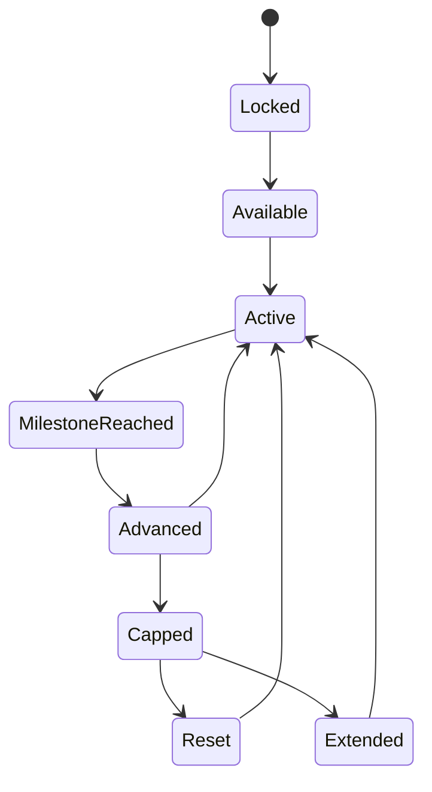

# Progression System（成长系统）

> Status: V1  
> Category: Progression  
> Path: `design/systems/progression/progression-system.md`  
> Owner: TBD  
> Reviewers: Design / Product / Engineering / Data / QA / UX / Research / Live Operations  
> Last Updated: 2026-07-11  
> Version: 1.0  
> Risk Level: High  
> Dependencies: Core Loop, Resources and Economy, Reward System, Content and Unlocks, Characters and Loadouts, Difficulty and Challenge, Save and Persistence  
> Affected Systems: Objectives and Quests, Tutorial and Onboarding, Monetization, Live Operations, Analytics and Telemetry, Settings and Preferences

---

## 1. System Summary

Progression System 负责定义：

```text
玩家如何从当前状态成长到新的状态；
成长通过什么获得；
成长改变什么；
成长如何影响下一轮体验；
成长何时达到里程碑；
成长如何重置、追赶、回归和长期维护。
```

成长系统不只是“数值变大”。

它可以包含：

- 能力成长；
- 选择空间成长；
- 内容成长；
- 认知成长；
- 技能成长；
- 身份成长；
- 表达成长；
- 社交成长；
- 世界状态成长。

一个健康的成长系统应让玩家感受到：

```text
我做出的投入，
确实改变了我能做什么、如何做、为什么继续做。
```

---

## 2. Purpose

### 2.1 Player Value

成长系统帮助玩家：

- 感知长期投入；
- 获得新能力和新选择；
- 建立目标；
- 形成角色和构筑身份；
- 看见自己掌握了什么；
- 进入新的挑战；
- 在中断后重新理解进度；
- 对未来拥有明确期待。

### 2.2 Experience Contribution

成长系统可以支持：

- 成就感；
- 掌控感；
- 探索；
- 构筑；
- 表达；
- 身份；
- 长期目标；
- 回归动机。

但不健康的成长会造成：

- 数值膨胀；
- 内容过时；
- 唯一路线；
- 错误投资；
- 新老玩家差距扩大；
- 回归困难；
- 过度重复劳动；
- 付费压力。

### 2.3 Product Value

成长系统为以下能力提供共同基础：

- 长期留存；
- 内容解锁；
- 难度曲线；
- 奖励规划；
- 角色养成；
- 构筑；
- 活动；
- 赛季；
- 回归；
- 商业价值；
- 数据分群。

### 2.4 Why This System Exists

如果成长由各功能独立定义，常见结果是：

```text
多个等级体系彼此重叠；
奖励很多但没有实际用途；
数值成长与核心体验脱节；
旧内容快速失效；
成长上限只能不断提高；
重置和追赶依赖临时活动；
不同角色和系统共享一条唯一最优路径。
```

统一成长系统用于确保：

- 成长有明确职责；
- 成长重新进入核心循环；
- 长期扩展可维护；
- 追赶和回归不依赖临时补丁；
- 不同成长维度可以彼此区分。

---

## 3. Non-Goals

成长系统不负责：

- 直接发放所有奖励；
- 管理资源余额；
- 定义完整难度规则；
- 替代角色系统；
- 替代内容解锁系统；
- 用等级替代玩家学习；
- 通过无限数值增长制造长期目标；
- 让玩家必须持续参与才能保留已有价值；
- 通过复杂成长树制造虚假深度；
- 将所有成长与付费绑定；
- 自动保证全部构筑平衡。

---

## 4. Governing Principles

### 4.1 Core Experience and Fantasy

参考：

- `../../philosophy/foundation/core-experience-and-fantasy.md`

应用原则：

- 成长必须强化核心体验；
- 新能力应改变玩家如何行动；
- 成长应支持玩家幻想和身份；
- 不应让成长后的体验偏离项目核心。

### 4.2 Choice and Consequence

参考：

- `../../philosophy/experience/choice-and-consequence.md`

应用原则：

- 成长路线应有真实差异；
- 投资应产生可理解后果；
- 重置成本应与承诺相匹配；
- 不应存在长期唯一最优路径。

### 4.3 Simplicity and Depth

参考：

- `../../philosophy/experience/simplicity-and-depth.md`

应用原则：

- 成长体系数量受控；
- 深度来自组合与情境；
- 避免多个同质等级系统；
- 高级复杂度逐步开放。

### 4.4 Challenge and Fairness

参考：

- `../../philosophy/experience/challenge-and-fairness.md`

应用原则：

- 成长应让玩家应对新挑战；
- 不应只通过数值碾压跳过核心判断；
- 失败应保留学习价值；
- 竞争环境中的成长差异必须透明。

### 4.5 Progression and Motivation

参考：

- `../../philosophy/long-term/progression-and-motivation.md`

应用原则：

- 成长连接短期行动和长期目标；
- 内在动机与外在奖励共同存在；
- 回归玩家应有恢复路径；
- 重复劳动不应成为主要成长手段。

### 4.6 Ethical Design

参考：

- `../../philosophy/responsibility/ethical-design.md`

应用原则：

- 不利用错过恐惧维持成长；
- 不隐藏成长成本；
- 不故意制造错误投资后出售修复；
- 付费成长不能破坏基础公平；
- 儿童和脆弱用户需要消费保护。

---

## 5. Player Experience

### 5.1 Player Goal

玩家使用成长系统通常为了：

- 变得更强；
- 获得新能力；
- 开放新内容；
- 形成构筑；
- 改变玩法；
- 表达身份；
- 完成长期目标；
- 应对更高挑战。

### 5.2 Entry

玩家接触成长系统的入口包括：

- 奖励结算；
- 升级界面；
- 角色页面；
- 技能树；
- 内容解锁；
- 里程碑；
- 任务；
- 活动；
- 回归页面；
- 构筑管理。

### 5.3 Main Actions

玩家可以：

- 查看；
- 比较；
- 投资；
- 升级；
- 解锁；
- 选择；
- 重置；
- 重配；
- 预览；
- 收藏；
- 追赶；
- 完成里程碑。

### 5.4 Core Decisions

关键决策包括：

- 投资哪个成长方向；
- 纵向提升还是横向扩展；
- 立即升级还是保存资源；
- 是否重置；
- 是否更换构筑；
- 是否追求效率或表达；
- 是否进入更高挑战。

### 5.5 Success

健康成长体验意味着：

- 玩家知道当前在成长什么；
- 成长后可以感知差异；
- 新能力重新进入核心循环；
- 成长路线有真实选择；
- 错误投资不会导致长期不可玩；
- 回归后仍能理解状态；
- 长期仍有目标但不依赖无限膨胀。

### 5.6 Failure

失败包括：

- 成长没有实际效果；
- 升级后体验没有变化；
- 资源投入后长期后悔；
- 路线唯一；
- 旧内容失效；
- 达到上限后没有目标；
- 回归时无法理解体系；
- 新赛季完全抹除已有价值。

---

## 6. System Boundary

### 6.1 Inputs

系统接收：

- Growth Resources；
- Reward Results；
- Player Actions；
- Milestone Completion；
- Content Requirements；
- Character State；
- Difficulty State；
- Entitlement State；
- Season or Event State；
- Reset Request；
- Catch-Up Eligibility。

### 6.2 Outputs

系统产生：

- Level Change；
- Ability Unlock；
- Stat Change；
- Skill Point；
- Branch Unlock；
- Milestone Completion；
- Content Eligibility；
- Growth Summary；
- Reset Result；
- Catch-Up Grant；
- Progression Changed Event。

### 6.3 Owned State

系统拥有：

- Progression Definition；
- Progression Track；
- Progression Level；
- Experience or Progress Value；
- Milestone State；
- Unlock Point；
- Branch Selection；
- Reset State；
- Catch-Up State；
- Progression Version；
- Growth History。

### 6.4 Read-Only Dependencies

系统读取：

- Economy 资源余额；
- Reward 奖励结果；
- Character 当前状态；
- Content 解锁条件；
- Difficulty 当前要求；
- Entitlement 权益；
- Live Operations 赛季配置；
- Save 当前版本。

### 6.5 Write Dependencies

系统通过正式契约请求：

- Economy 扣除成长成本；
- Content 解锁内容；
- Character 应用能力或属性；
- Reward 创建里程碑奖励；
- Save 持久化成长状态；
- Analytics 记录成长变化。

### 6.6 Out of Scope

系统不直接：

- 修改资源余额；
- 发放付费权益；
- 处理支付；
- 决定全部角色表现；
- 定义任务内容；
- 管理商店；
- 计算完整战斗结果。

---

## 7. Core Entities and Concepts

| Entity / Concept | Definition | Owner | Lifetime | Notes |
|---|---|---|---|---|
| Progression Track | 一条独立成长路径 | Progression | 长期 | 如角色、账号、技能 |
| Progression Level | 当前层级 | Progression | 长期 | 可非线性 |
| Progress Value | 用于推进成长的值 | Progression | 长期 | 经验、熟练度等 |
| Milestone | 有明确意义的成长节点 | Progression | 长期 | 提供新价值 |
| Unlock Point | 可分配的成长选择点 | Progression | 长期 | 可重置 |
| Branch | 成长分支 | Progression | 长期 | 体现选择差异 |
| Growth Effect | 成长产生的能力或状态变化 | Progression / Domain | 长期 | 由领域系统应用 |
| Reset Record | 一次重置事务 | Progression | 审计期 | 可幂等 |
| Catch-Up State | 追赶资格和进度 | Progression | 阶段性 | 需防滥用 |
| Progression Cap | 当前成长上限 | Progression | 版本级 | 需长期策略 |
| Prestige / Rebirth | 达到上限后的重构型成长 | Progression | 长期 | 不应简单清零 |
| Growth History | 关键成长变更记录 | Progression | 长期 | 支持恢复与审计 |

---

## 8. Progression Taxonomy

### 8.1 Vertical Progression

提升：

- 数值；
- 强度；
-效率；
- 容量；
- 生存能力。

优点：

- 易理解；
- 反馈直接。

风险：

- 数值膨胀；
- 旧内容失效；
- 竞争差距扩大；
- 新内容成本上升。

### 8.2 Horizontal Progression

增加：

- 新工具；
- 新技能；
- 新角色；
- 新构筑；
- 新策略；
- 新表达。

优点：

- 长期扩展更稳定；
- 支持选择和身份。

风险：

- 复杂度增加；
- 平衡成本提高；
- 新手信息负担上升。

### 8.3 Mastery Progression

成长来自：

- 玩家理解；
- 操作；
- 策略；
- 识别模式；
- 规则掌握。

系统可以支持，但不应伪装成数值成长。

### 8.4 Knowledge Progression

通过：

- 图鉴；
- 地图；
- 规则发现；
- 情报；
-世界状态；

获得新理解。

### 8.5 Access Progression

开放：

- 内容；
- 模式；
- 地区；
- 难度；
- 功能。

### 8.6 Identity Progression

形成：

- 职业；
- 阵营；
- 声望；
- 社交身份；
- 成就；
- 收藏。

### 8.7 Expression Progression

开放：

- 外观；
- 装饰；
- 动作；
- 标识；
- 展示空间。

### 8.8 Social Progression

包括：

- 好友关系；
- 公会贡献；
- 团队协作；
- 社交声望。

---

## 9. Progression Layers

建议区分不同层级：

### 9.1 Account Progression

跨角色、跨模式的长期状态。

### 9.2 Character Progression

单个角色能力和身份。

### 9.3 Build Progression

当前构筑或装备路线。

### 9.4 Session Progression

单次会话内成长。

### 9.5 Content Progression

内容开放和完成。

### 9.6 Seasonal Progression

赛季或阶段性成长。

### 9.7 Mastery Progression

玩家对具体系统的熟练度。

多层成长必须避免：

- 职责重复；
- 奖励重复；
- 同时开放过多；
- 每层都要求独立资源。

---

## 10. Progression Track Definition

统一模板：

```markdown
## Progression Track

- Track ID:
- Display Name:
- Category:
- Player Purpose:
- Entry Condition:
- Progress Source:
- Cost:
- Level Structure:
- Milestones:
- Unlocks:
- Cap:
- Reset:
- Catch-Up:
- Seasonal:
- Persistent:
- Paid Influence:
- Owner:
- Risk Level:
```

### 10.1 必须回答

- 为什么存在；
- 改变什么；
- 如何进入核心循环；
- 与其他 Track 有什么区别；
- 到达上限后发生什么；
- 是否需要重置；
- 是否会失效；
- 付费是否影响。

---

## 11. Progression Lifecycle

```text
Locked
→ Available
→ Active
→ Milestone Reached
→ Advanced
→ Capped
→ Reset or Extended
```



### 11.1 Locked

尚不可进入。

### 11.2 Available

已解锁但未开始。

### 11.3 Active

正在推进。

### 11.4 Milestone Reached

达到有意义节点。

### 11.5 Advanced

已应用成长结果。

### 11.6 Capped

达到当前上限。

### 11.7 Reset

重新配置或重构。

### 11.8 Extended

新版本提高上限或增加横向内容。

---

## 12. Progress Sources

成长来源可以包括：

- 核心活动；
- 任务；
- 掌握度；
- 角色使用；
- 探索；
- 社交；
- 成就；
- 赛季；
- 资源投资；
- 时间；
- 付费。

### 12.1 Stable Source

关键成长应有稳定来源。

### 12.2 Variable Source

随机或活动来源可以提供额外效率，但不应成为唯一可行路径。

### 12.3 Source Alignment

成长来源应与被成长的能力相关。

例如：

```text
战术熟练度
应主要来自战术行为，
而不是完全无关的每日登录。
```

### 12.4 Anti-Grind

应避免：

- 同一低价值行为无限重复；
- 成长速度只由时间堆积决定；
- 核心成长强制依赖无关内容。

---

## 13. Cost Model

成长成本可以包括：

- 资源；
- 时间；
- 机会；
- 条件；
- 任务；
- 风险；
- 选择点；
- 重置限制。

### 13.1 Cost Transparency

升级前展示：

- 完整成本；
- 当前余额；
- 结果；
- 是否可逆；
- 后续影响。

### 13.2 Cost Curve

成本增长可以：

- 线性；
- 阶梯；
- 指数；
- 分段；
- 固定；
- 条件化。

应与成长价值匹配。

### 13.3 Multi-Currency Cost

多资源成本应谨慎，避免：

- 人为阻塞；
- 复杂度；
- 过度活动依赖；
- 付费压力。

### 13.4 Hidden Cost

禁止隐藏：

- 后续维护；
- 重置损失；
- 附带资源；
- 时间锁；
- 资格消耗。

---

## 14. Progression Curves

### 14.1 Linear Curve

每级变化相近。

优点：

- 易理解；
- 可预测。

风险：

- 缺少里程碑；
- 长期单调。

### 14.2 Exponential Curve

成本或数值快速增长。

风险：

- 膨胀；
- 追赶困难；
- 老内容失效。

### 14.3 Step Curve

关键层级产生明显变化。

适合：

- 新能力；
- 新分支；
- 新内容。

### 14.4 Diminishing Return

高投入后收益递减。

适合：

- 控制极端数值；
- 鼓励横向发展。

### 14.5 S-Curve

早期快、中期稳定、后期放缓。

适合：

- 新手快速建立能力；
- 中期形成目标；
- 后期避免失控。

### 14.6 Curve Selection

曲线应根据：

- 体验目标；
- 目标周期；
- 内容量；
- 追赶；
- 上限；
- 付费影响；

决定，而不是只按数值美观。

---

## 15. Milestones

Milestone 是有意义的成长节点。

可以提供：

- 新能力；
- 新内容；
- 新选择；
- 身份变化；
- 视觉变化；
- 规则变化；
- 资源效率；
- 认可。

### 15.1 Milestone 应明显

玩家应理解：

- 达到了什么；
- 为什么重要；
- 下一阶段有什么变化。

### 15.2 避免空 Milestone

仅提供微小数值且无可感知变化的节点，不应被包装成重大里程碑。

### 15.3 Milestone Spacing

间隔应与：

- 会话长度；
- 内容节奏；
- 玩家熟练度；
- 长期目标；

匹配。

---

## 16. Unlocks

成长可以解锁：

- 技能；
- 角色；
- 装备槽；
- 内容；
- 模式；
- 设置；
- 辅助；
- 外观；
- 社交能力。

### 16.1 Unlock Timing

功能解锁应考虑：

- 玩家是否理解；
- 是否已经需要；
- 是否增加过多复杂度；
- 是否阻塞核心体验。

### 16.2 Progressive Disclosure

复杂系统应逐步开放，但不能让老玩家重复等待已掌握内容。

### 16.3 Unlock Permanence

必须说明：

- 永久；
- 赛季；
- 角色；
- 会话；
- 条件性；
- 权益绑定。

### 16.4 Unlock Failure

若内容不可用：

- 保留解锁资格；
- 延迟应用；
- 不重复消耗；
- 明确说明。

---

## 17. Branching Progression

### 17.1 Branch Purpose

分支用于表达：

- 风格；
- 角色身份；
- 策略；
- 权衡；
- 专精。

### 17.2 Meaningful Branch

分支应有：

- 明确差异；
- 可理解后果；
- 不同适用情境；
- 至少多条可行路线。

### 17.3 False Choice

应避免：

- 一条明显最优；
- 只是数值大小不同；
- 后续内容强制某一分支；
- 重置成本过高导致不敢尝试。

### 17.4 Branch Preview

展示：

- 当前效果；
- 后续方向；
- 主要代价；
- 是否可重置；
- 与其他分支关系。

---

## 18. Skill Points and Allocation

### 18.1 Point Source

明确：

- 等级；
- 任务；
- 掌握；
- 里程碑；
- 购买。

### 18.2 Allocation Rules

- 单点；
- 前置；
- 分支；
- 层级；
- 上限；
- 互斥；
- 组合。

### 18.3 Unspent Points

允许玩家：

- 保存；
- 规划；
- 延迟。

不应强迫立即分配，除非不分配会造成明显体验问题。

### 18.4 Respec

应定义：

- 免费；
- 有成本；
- 有冷却；
- 部分重置；
- 全部重置；
- 预设切换。

---

## 19. Reset and Respec

### 19.1 Reset Types

- Point Refund；
- Branch Reset；
- Character Reset；
- Track Reset；
- Seasonal Reset；
- Prestige；
- Full Account Reset。

### 19.2 Reset Purpose

重置用于：

- 纠正错误；
- 尝试新构筑；
- 适应内容变化；
- 重新规划；
- 开启新的长期循环。

### 19.3 Reset Cost

成本应保护承诺，但不应：

- 让玩家因未知信息永久受罚；
- 让平衡更新造成玩家损失；
- 故意制造摩擦再出售重置。

### 19.4 Free Reset Conditions

通常应在以下情况提供免费重置：

- 规则重大变化；
- 内容被削弱；
- 新手阶段；
- 系统错误；
- 迁移；
- 可访问性需求。

### 19.5 Reset Preview

显示：

- 将失去什么；
- 将返还什么；
- 哪些内容不受影响；
- 是否可撤销；
- 新状态。

---

## 20. Prestige and Rebirth

### 20.1 Purpose

用于达到上限后的新循环。

可能提供：

- 新身份；
- 横向能力；
- 新规则；
- 新目标；
- 表达；
- 长期认可。

### 20.2 风险

- 重复清零；
- 数值无限膨胀；
- 强迫重玩；
- 旧投入失去价值；
- 新玩家无法追赶。

### 20.3 Healthy Prestige

应：

- 保留核心成果；
- 提供新选择；
- 缩短已掌握阶段；
- 不重复低价值劳动；
- 明确永久与临时部分。

---

## 21. Progression Cap

### 21.1 Cap 类型

- Hard Cap；
- Soft Cap；
- Seasonal Cap；
- Content Cap；
- Mastery Cap；
- Temporary Cap。

### 21.2 Cap Purpose

可以用于：

- 控制平衡；
- 保护内容节奏；
- 限制复杂度；
- 等待新内容；
- 维持竞争公平。

### 21.3 Cap Experience

达到上限后，玩家需要：

- 清楚反馈；
- 替代目标；
- 横向发展；
- 表达；
- 收藏；
- 社交；
- 掌握。

不应只留下：

```text
等待下次版本提高数字。
```

### 21.4 Cap Increase

提高上限前应检查：

- 旧内容；
- 经济；
- 追赶；
- 竞争；
- 构筑；
- 数值膨胀；
- 玩家资产。

---

## 22. Power Growth

### 22.1 Power Definition

“强度”可以包括：

- 伤害；
- 生存；
-效率；
- 控制；
- 资源；
- 容错；
- 选择范围。

### 22.2 Power Budget

多个成长来源应共享整体预算。

避免：

```text
角色等级、装备、技能、收藏、赛季
同时无上限提升同一数值。
```

### 22.3 Power Creep

新内容持续优于旧内容会导致：

- 旧资产失效；
- 构筑多样性下降；
- 付费压力；
- 数值膨胀。

### 22.4 Countermeasures

- 横向能力；
- 情境优势；
- 侧重差异；
- 旧内容更新；
- 上限；
- 递减收益；
- 标准化竞技。

---

## 23. Horizontal Growth

### 23.1 Healthy Horizontal Growth

提供：

- 新策略；
- 新交互；
- 新组合；
- 新表达；
- 新情境。

### 23.2 Complexity Risk

横向内容过多会导致：

- 新手负担；
- 维护成本；
- 平衡困难；
- 选择瘫痪。

### 23.3 Management

- 分类；
- 推荐；
- 预设；
- 收藏；
- 搜索；
- 熟练度分层；
- 内容退役。

---

## 24. Mastery and Player Skill

### 24.1 System Support

系统可以通过：

- 反馈；
- 复盘；
- 训练；
- 挑战；
- 图鉴；
- 数据；

支持玩家掌握。

### 24.2 Do Not Replace Mastery

数值成长不应完全替代：

- 判断；
- 学习；
- 操作；
- 规划。

### 24.3 Respect Mastery

熟练玩家应获得：

- 快速路径；
- 更少重复教学；
- 更高层目标；
- 可表达空间。

---

## 25. Difficulty Integration

成长与难度之间应形成：

```text
成长
→ 新能力
→ 新挑战
→ 新判断
→ 新成长
```

而不是：

```text
成长
→ 纯数值碾压
→ 旧内容失效
```

### 25.1 Requirement

难度不应只读取等级。

还可以读取：

- 构筑；
- 掌握；
- 内容；
- 角色；
- 队伍；
- 辅助设置。

### 25.2 Recommended Power

推荐强度应：

- 解释构成；
- 不作为绝对门槛；
- 避免误导；
- 支持技巧型玩家。

### 25.3 Scaling

动态缩放必须透明，并避免：

- 成长无意义；
- 隐藏削弱；
- 付费差异；
- 过度追随玩家数值。

---

## 26. Reward Integration

奖励应服务成长，而不是只提供更多数值。

### 26.1 Reward Roles

- 推进；
- 里程碑；
- 选择；
- 试用；
- 表达；
- 修复；
- 追赶。

### 26.2 Reward Timing

成长反馈可以：

- 即时；
- 循环后；
- 里程碑；
- 会话结束；
- 长期目标。

### 26.3 Avoid Fragmentation

奖励系统不应为每条成长路径创建大量独立碎片，除非有明确职责。

---

## 27. Content Integration

成长解锁内容时，需要定义：

- 内容可见；
- 内容可进入；
- 内容可完成；
- 内容推荐；
- 内容过期；
- 内容返场。

### 27.1 Content Gate

门槛可以基于：

- 里程碑；
- 能力；
- 任务；
- 知识；
- 权益；
- 社交。

### 27.2 Avoid Hard Walls

如果门槛只要求重复劳动，应考虑：

- 技能替代；
- 多路径；
- 追赶；
- 预览；
- 低风险试用。

---

## 28. Character and Loadout Integration

### 28.1 Character Growth

定义：

- 等级；
- 技能；
- 属性；
- 专精；
- 关系；
- 身份。

### 28.2 Loadout Growth

定义：

- 槽位；
- 装备；
- 预设；
- 组合；
- 容量；
- 切换。

### 28.3 Ownership

Progression 拥有成长状态。

Character and Loadout 拥有：

- 当前角色；
- 装备关系；
- 预设。

避免双方同时修改同一事实。

---

## 29. Seasonal Progression

### 29.1 Purpose

赛季成长可以提供：

- 有限周期目标；
- 新规则；
- 新内容；
- 竞争重置；
- 回归机会。

### 29.2 Seasonal Reset

必须明确：

- 什么重置；
- 什么保留；
- 为什么；
- 如何追赶；
- 付费价值如何保留；
- 未完成奖励如何处理。

### 29.3 Avoid Full Erasure

完全清零会削弱长期信任。

应保留：

- 身份；
- 收藏；
- 记录；
- 掌握；
- 部分能力；
- 回归加速。

### 29.4 Seasonal Cap

防止高频玩家过早拉开巨大差距时，可以使用阶段 Cap。

但不应只通过强制等待限制参与。

---

## 30. Catch-Up

### 30.1 Purpose

帮助：

- 新玩家；
- 回归玩家；
- 落后玩家；

恢复到可参与当前内容的状态。

### 30.2 Catch-Up Types

- 加速经验；
- 降低旧成本；
- 追赶任务；
- 目标型资源；
- 试用构筑；
- 旧内容跳过；
- 装备基线；
- 赛季压缩。

### 30.3 Eligibility

应基于：

- 当前差距；
- 离开时长；
- 内容阶段；
- 账户历史；
- 已拥有资产。

### 30.4 Abuse Prevention

不能让最优策略变成：

```text
故意离开以获得更高追赶奖励。
```

### 30.5 Catch-Up Goal

追赶恢复：

- 参与能力；
- 理解；
- 基础选择。

不应自动替代：

- 高水平掌握；
- 稀有身份；
- 全部历史成就。

---

## 31. Return Experience

回归时应展示：

- 当前成长层；
- 近期变化；
- 已失效内容；
- 新系统；
- 推荐目标；
- 可用重置；
- 追赶；
- 保留价值。

### 31.1 Progressive Reintroduction

不要一次展示全部新增系统。

### 31.2 Old Build Review

若规则发生变化：

- 标记受影响构筑；
- 提供免费重置；
- 提供推荐；
- 解释差异。

---

## 32. Progression Debt

Progression Debt 指成长体系长期积累的结构问题。

包括：

- 过多 Track；
- 重复等级；
- 旧资源；
- 无效节点；
- 过时成长；
- 例外；
- 强制活动；
- 失控数值。

### 32.1 Signals

- 玩家不知道升级什么；
- 新功能必须增加新等级；
- 旧内容全部被跳过；
- 大量免费重置；
- 付费修复错误投资；
- 平衡依赖不断提高 Cap。

### 32.2 Reduction

- 合并 Track；
- 删除空节点；
- 转换旧资源；
- 提供通用里程碑；
- 降低层级；
- 重构 Cap；
- 增加横向价值。

---

## 33. Failure and Recovery

| Failure | Cause | Player Impact | Recovery | Data Guarantee |
|---|---|---|---|---|
| Insufficient Cost | 资源不足 | 无法升级 | 显示差额 | 不扣除 |
| Duplicate Upgrade | 重复请求 | 重复成长风险 | 幂等返回原结果 | 只执行一次 |
| Effect Apply Failure | Character 或 Domain 失败 | 等级与能力不同步 | Pending、重试或回滚 | 保留事务 |
| Unlock Failure | Content 不可用 | 已成长但内容未开 | 延迟应用 | 保留资格 |
| Reset Failure | 部分返还失败 | 状态不一致 | 事务恢复 | 保留旧状态 |
| Migration Failure | Track 版本变化 | 进度错误 | 备份、转换、补偿 | 保留历史 |
| Cap Misconfiguration | 上限错误 | 无法继续或超量成长 | 回滚配置 | 保留权威进度 |
| Seasonal Reset Error | 重置范围错误 | 资产损失 | 恢复与补偿 | 审计可追踪 |
| Catch-Up Abuse | 资格规则错误 | 经济和公平风险 | 撤销未使用授予或调整 | 记录资格 |

---

## 34. Edge Cases

### Progress

- 一次获得超过多个等级；
- 正好达到里程碑；
- 超过上限；
- 经验溢出；
- 同时完成多个 Track；
- 多设备升级。

### Branching

- 分支节点被删除；
- 前置变化；
- 互斥分支同时满足；
- 重置后内容依赖失效；
- 预设使用旧分支。

### Reset

- 重置中断；
- 资源返还容量不足；
- 规则变更后免费重置；
- 多层成长同时重置；
- 付费点数返还。

### Seasonal

- 赛季结束瞬间升级；
- 未领取里程碑；
- 跨时区；
- 回归玩家进入旧赛季；
- 赛季奖励延迟。

### Migration

- 旧等级不存在；
- 数值单位变化；
- Track 合并；
- Track 拆分；
- Cap 降低；
- 旧技能被移除。

---

## 35. Cross-System Dependencies

| System | Dependency Type | Direction | Data or Event | Failure Impact |
|---|---|---|---|---|
| Resources and Economy | Hard | 双向 | Cost / Balance | 无法升级 |
| Reward System | Hard / Soft | Reward → Progression | Growth Source | 成长延迟 |
| Content and Unlocks | Hard / Soft | Progression → Content | Unlock Eligibility | 内容不同步 |
| Characters and Loadouts | Hard | 双向契约 | Growth Effect | 角色状态错误 |
| Difficulty and Challenge | Soft / Hard | 双向读取 | Power / Requirement | 难度失配 |
| Core Loop | Hard | Progression → Loop | New Capability | 成长脱节 |
| Objectives and Quests | Soft | Objectives → Progression | Milestone Source | 进度延迟 |
| Save and Persistence | Hard | Progression → Save | Track State | 无法恢复 |
| Live Operations | Soft | Live → Progression | Seasonal Rules | 使用 Last Known Good |
| Entitlement | Soft / Hard | Entitlement → Progression | Access Rights | 付费成长风险 |
| Analytics | Soft | Progression → Analytics | Growth Events | 不阻断 |

---

## 36. Data and Persistence

| State | Persistent | Authority | Save Trigger | Retention | Recovery |
|---|---|---|---|---|---|
| Progression Track | 是 | Progression | 配置发布 | 版本期 | Last Known Good |
| Level | 是 | Progression | 每次升级 | 长期 | History 重建 |
| Progress Value | 是 | Progression | 每次变化 | 长期 | 快照与日志 |
| Milestone State | 是 | Progression | 达成 | 长期 | 幂等查询 |
| Branch Selection | 是 | Progression | 选择确认 | 长期 | 重置记录 |
| Reset Record | 是 | Progression | 重置事务 | 审计期 | 恢复 |
| Catch-Up State | 是 | Progression | 资格变化 | 阶段性 | 重新计算 |
| Seasonal State | 是 | Progression | 赛季变化 | 赛季及审计期 | 映射 |
| Growth History | 是 | Progression | 关键变化 | 长期 | 审计 |
| Progression Version | 是 | Progression | 版本发布 | 长期 | 迁移 |

### 36.1 Save Triggers

至少在以下时刻保存：

- 升级；
- 分支选择；
- 里程碑；
- 重置；
- 赛季结束；
- 追赶授予；
- 迁移；
- Cap 变化。

---

## 37. Accessibility

### 37.1 Visual

- 当前等级、进度和下一节点清楚；
- 不只依赖颜色表示可用与锁定；
- 变化前后可比较；
- 重要里程碑有文本说明。

### 37.2 Cognitive

- 限制同时可见 Track 数量；
- 分支差异清楚；
- 提供预览；
- 支持推荐；
- 术语一致；
- 可回看历史。

### 37.3 Input

- 分配、升级和重置防误触；
- 支持批量；
- 支持键鼠、手柄和触摸；
- 长列表可搜索和筛选。

### 37.4 Timing

- 成长决策不应要求极短时间完成；
- 赛季结束有提醒；
- 重置提供冷静期或确认；
- 回归页面允许逐步处理。

### 37.5 Learning Support

- 新 Track 逐步开放；
- 高级系统提供实例；
- 重置后重新解释关键变化；
- 可访问完整规则。

---

## 38. Ethical and Safety Review

### 38.1 Player Time

- 不通过无限重复劳动维持成长；
- 不用每日清零惩罚中断；
- 成长来源应与核心体验相关。

### 38.2 Financial Risk

- 升级成本清楚；
- 付费资源消耗防误触；
- 不故意制造错误投资后出售重置；
- 付费成长不破坏基础公平。

### 38.3 FOMO

- 核心成长不应永久错过；
- 赛季重置透明；
- 里程碑奖励支持合理追赶或返场；
- 不用虚假稀缺推动升级。

### 38.4 Children and Vulnerable Users

- 限制高压付费成长；
- 不通过角色失望和比较制造消费压力；
- 支持监护和消费限额；
- 复杂成长成本提供真实价格参考。

### 38.5 Dynamic Personalization

不应根据敏感属性或脆弱状态，不透明地改变：

- 成长成本；
- 失败概率；
- 付费价格；
- 追赶资格。

---

## 39. Analytics and Validation

### 39.1 Key Assumptions

1. 玩家理解主要成长 Track。
2. 成长后可以感知实际变化。
3. 成长重新进入核心循环。
4. 多条路线保持可行。
5. 重置成本不会阻止合理尝试。
6. Cap 后仍有有意义目标。
7. 回归和追赶能够恢复参与能力。
8. 纵向成长不会快速造成旧内容失效。
9. 付费与免费成长差距处于可接受范围。

### 39.2 Validation Plan

| Hypothesis | Evidence | Success | Failure | Method |
|---|---|---|---|---|
| Track 可理解 | 复述 | 玩家能说明职责 | 多个体系混淆 | 可用性测试 |
| 成长可感知 | 前后行为 | 能识别新能力 | 只看到数字变化 | 研究 |
| 回到核心循环 | 使用率 | 新能力被实际使用 | 成长只停留在菜单 | 行为数据 |
| 路线可行 | 分支分布 | 多条路线存在 | 单一路线压倒性 | 平衡分析 |
| Reset 合理 | 重置率与反馈 | 支持尝试 | 玩家不敢投资 | 数据与访谈 |
| Cap 健康 | Cap 后行为 | 仍有横向目标 | 大量流失或等待 | 长期数据 |
| Catch-Up 有效 | 回归行为 | 能进入当前内容 | 仍长期落后 | 回归测试 |
| Power Creep 受控 | 旧内容使用 | 旧资产仍有价值 | 新内容全面替代 | 长期分析 |

### 39.3 Behavioral Metrics

- Progress Gained；
- Level Up；
- Milestone Reached；
- Branch Selected；
- Skill Point Spent；
- Reset Requested；
- Reset Completed；
- Catch-Up Activated；
- Cap Reached；
- Seasonal Progress Advanced；
- Growth Effect Used。

### 39.4 Outcome Metrics

- Time to Milestone；
- Branch Diversity；
- Reset Rate；
- Unspent Point Rate；
- New Ability Usage；
- Cap Retention；
- Catch-Up Completion；
- Old Content Viability；
- Paid/Free Progress Gap；
- Return Recovery Time。

### 39.5 Negative Metrics

- 唯一最优路线；
- 大量空节点；
- 高比例错误投资；
- 付费重置依赖；
- Cap 后流失；
- 数值膨胀；
- 旧内容失效；
- 回归玩家无法进入；
- 成长 Track 数量膨胀；
- 赛季清零投诉；
- 成长与核心循环脱节。

### 39.6 Event Intents

| Event Intent | Trigger | Key Properties | Privacy Notes |
|---|---|---|---|
| Progression Advanced | 等级变化 | Track, From, To | 使用匿名 ID |
| Milestone Reached | 节点达成 | Track, Milestone | 不记录敏感身份 |
| Branch Selected | 分支确认 | Track, Branch | 仅业务用途 |
| Reset Completed | 重置成功 | Track, Cost, Reason | 审计 |
| Cap Reached | 达到上限 | Track, Version | 不推断健康状态 |
| Catch-Up Applied | 追赶授予 | Type, Gap | 不用于歧视性定价 |
| Growth Effect Used | 新能力使用 | Effect Category | 数据最小化 |
| Migration Completed | 版本迁移 | From, To, Result | 审计 |

---

## 40. Progression Model Template

```markdown
# Progression Model

## Track

- Name:
- Category:
- Purpose:
- Core Loop Connection:

## Levels

| Level / Tier | Cost | Effect | Milestone | Unlock |
|---|---:|---|---|---|

## Curve

- Type:
- Early Pace:
- Mid Pace:
- Late Pace:
- Cap:

## Sources

| Source | Frequency | Amount | Segment |
|---|---:|---:|---|

## Resets

- Type:
- Cost:
- Free Conditions:
- Refund:

## Catch-Up

- Eligibility:
- Method:
- Abuse Protection:

## Risks

- Power Creep:
- Complexity:
- Dead Nodes:
- Paid Gap:
- Return Difficulty:

## Validation

- Success:
- Failure:
- Metrics:
```

---

## 41. Rollout and Migration

### 41.1 Rollout

成长变更应按：

- 内部测试；
- 模拟；
- 测试服；
- 小范围；
- 分群；
- 全量；

逐步发布。

### 41.2 High-Risk Changes

包括：

- Track 合并或拆分；
- Cap 改变；
- 成长成本大改；
- 分支结构变化；
- 赛季重置；
- 付费成长；
- 旧能力移除；
- 大规模免费重置。

### 41.3 Migration

必须定义：

- 旧 Level；
- 新 Level；
- 经验；
- 分支；
- 技能点；
- 资源返还；
- 旧能力；
- Cap；
- 里程碑；
- 赛季状态；
- 追赶状态。

### 41.4 Rollback

回滚时：

- 不删除已确认玩家价值；
- 保留成长历史；
- 恢复旧 Track；
- Pending 重置继续恢复；
- 必要时补偿；
- 解释变化。

### 41.5 Stop Conditions

出现以下情况应停止发布：

- 等级或能力丢失；
- 资源扣除但成长未应用；
- 大量构筑失效；
- 免费重置失败；
- 赛季清零错误；
- Cap 错误；
- 追赶异常；
- 付费成长差距急剧扩大；
- 旧存档无法迁移。

---

## 42. Risks and Open Questions

| Item | Type | Impact | Probability | Mitigation | Owner |
|---|---|---:|---:|---|---|
| Track 数量膨胀 | Complexity Risk | 高 | 高 | 新 Track 审计 | Design |
| 唯一最优分支 | Balance Risk | 高 | 中 | 分支分布与情境设计 | Design |
| Power Creep | Long-Term Risk | 高 | 高 | 横向成长、预算、Cap | Design |
| Cap 后目标不足 | Retention Risk | 高 | 中 | 横向与身份成长 | Product |
| Reset 成本过高 | Choice Risk | 高 | 中 | 新手免费、规则变更免费 | Design |
| 赛季清零伤害信任 | Ethical Risk | 高 | 中 | 保留长期价值 | Product |
| Catch-Up 被滥用 | Economy Risk | 中 | 低 | 资格与防滥用 | Data |
| 成长效果应用失败 | Integration Risk | 严重 | 低 | 幂等和 Pending | Engineering |
| 旧 Track 迁移失败 | Migration Risk | 严重 | 中 | 备份和映射 | Engineering |

---

## 43. Review Checklist

### Purpose and Taxonomy

- [ ] 成长支持核心体验；
- [ ] Vertical、Horizontal、Mastery、Access、Identity 等类型明确；
- [ ] 多层成长职责不重复；
- [ ] 每条 Track 有统一定义；
- [ ] Non-Goals 已定义。

### Sources and Costs

- [ ] 成长来源与能力相关；
- [ ] 关键成长有稳定来源；
- [ ] 成本完整透明；
- [ ] 多货币成本有必要性；
- [ ] 不依赖无意义重复劳动。

### Curves and Milestones

- [ ] 曲线与体验目标一致；
- [ ] 里程碑提供实际价值；
- [ ] 节点间隔合理；
- [ ] 空节点和纯装饰节点受控；
- [ ] Cap 有后续目标。

### Choice and Reset

- [ ] 分支存在真实差异；
- [ ] 没有明显唯一最优；
- [ ] 分支后果可预览；
- [ ] Reset 与 Respec 规则明确；
- [ ] 规则重大变化提供免费重置。

### Power and Content

- [ ] Power Budget 受控；
- [ ] Power Creep 有策略；
- [ ] 旧内容和旧资产仍有价值；
- [ ] 动态缩放不会隐藏削弱成长；
- [ ] 新能力重新进入核心循环。

### Return and Catch-Up

- [ ] 新玩家经济和成长可进入；
- [ ] 回归流程清楚；
- [ ] Catch-Up 恢复参与能力；
- [ ] Catch-Up 不完全复制历史成果；
- [ ] 防滥用明确。

### Seasonal and Ethics

- [ ] 赛季保留与重置范围透明；
- [ ] 付费价值不会被无说明清零；
- [ ] 不通过 FOMO 维持成长；
- [ ] 不制造错误投资后出售修复；
- [ ] 儿童和脆弱用户保护完整。

### Data and Validation

- [ ] Track、分支、Reset、Cap、Catch-Up 指标完整；
- [ ] 成长使用率可验证；
- [ ] Power Creep 和旧内容失效可监控；
- [ ] 迁移、回滚和停止条件明确；
- [ ] 成长历史可审计。

---

## 44. V1 Completion Criteria

Progression System 可以被视为 V1，当：

- 成长类型、层级和职责已经定义；
- 每条成长 Track 有统一模板；
- Progression Lifecycle 完整；
- 成长来源、成本和曲线明确；
- Milestone、Unlock、Branch 和 Skill Point 规则完整；
- Vertical 与 Horizontal Progression 的比例和风险得到评估；
- Reset、Respec、Prestige 和 Cap 规则明确；
- Power Budget、Power Creep 和旧内容失效有控制策略；
- 成长重新进入核心循环并产生可感知变化；
- Difficulty、Reward、Content、Character 和 Economy 的边界清楚；
- Catch-Up 和 Return Experience 已定义；
- Seasonal Progression 的保留、重置和返场规则透明；
- Progression Debt 有识别和治理方式；
- 成长状态由 Progression 唯一拥有；
- 升级、重置、迁移和成长效果应用支持幂等与恢复；
- 可访问性、伦理、付费公平和儿童保护通过评审；
- Track、Branch、Reset、Cap、Catch-Up 和 Power Creep 有指标与验证计划；
- 高风险成长变更具有灰度、迁移、回滚和停止条件；
- 下游 Reward、Difficulty、Content、Character、Live Operations 和 Commercial 系统可以直接引用本文件。

---

## 45. Related Documents

### Philosophy

- [Core Experience and Fantasy](../../philosophy/foundation/core-experience-and-fantasy.md)
- [Simplicity and Depth](../../philosophy/experience/simplicity-and-depth.md)
- [Choice and Consequence](../../philosophy/experience/choice-and-consequence.md)
- [Challenge and Fairness](../../philosophy/experience/challenge-and-fairness.md)
- [Progression and Motivation](../../philosophy/long-term/progression-and-motivation.md)
- [Ethical Design](../../philosophy/responsibility/ethical-design.md)

### Systems

- [Systems README](../README.md)
- [System Design Framework](../system-design-framework.md)
- [System Map](../system-map.md)
- [Integration Rules](../integration-rules.md)
- [Core Loop](../core/core-loop.md)
- [Resources and Economy](./resources-and-economy.md)
- `reward-system.md`
- `difficulty-and-challenge.md`
- `../content/content-and-unlocks.md`
- `../content/characters-and-loadouts.md`
- `../player/save-and-persistence.md`
- `../operations/live-operations.md`
