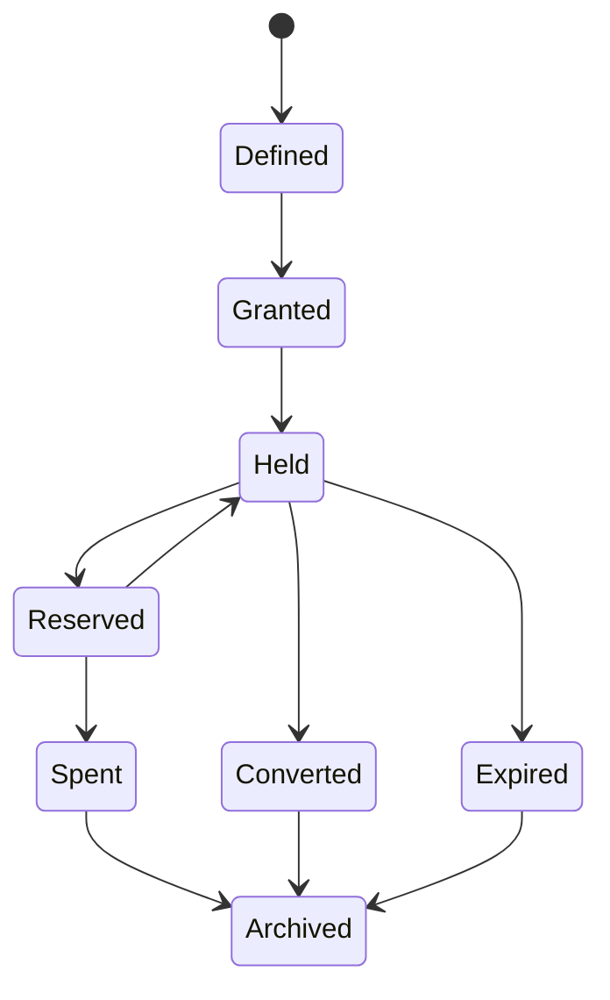
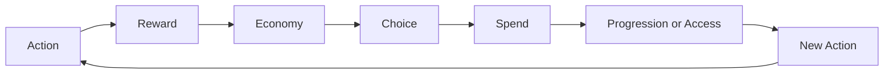

# Resources and Economy（资源与经济系统）

> Status: V1  
> Category: Progression  
> Path: `design/systems/progression/resources-and-economy.md`  
> Owner: TBD  
> Reviewers: Design / Product / Engineering / Data / QA / Live Operations / Monetization / UX  
> Last Updated: 2026-07-11  
> Version: 1.0  
> Risk Level: High  
> Dependencies: Core Loop, Rules and Resolution, Reward System, Progression System, Content and Unlocks, Entitlement and Ownership, Save and Persistence, Live Operations  
> Affected Systems: Characters and Loadouts, Difficulty and Challenge, Objectives and Quests, Monetization, Offers and Pricing, Analytics and Telemetry, Experiment Management

---

## 1. System Summary

Resources and Economy 系统负责定义：

```text
产品中有哪些资源；
每种资源为什么存在；
资源从哪里产生；
在哪里被消耗；
如何储存、转化、过期和回收；
谁拥有资源余额；
资源如何支持选择、成长、内容与商业价值；
长期如何避免通胀、枯竭、冗余和失控。
```

资源系统的本质不是“管理数字”。

它负责建立：

```text
行动
→ 产出
→ 选择
→ 消耗
→ 成长
→ 新目标
```

之间的价值流。

一个健康的经济系统应让玩家理解：

- 什么有价值；
- 为什么有价值；
- 如何获得；
- 为什么现在要使用；
- 使用后会产生什么；
- 保存和消费之间有什么权衡；
- 长期投入如何形成变化。

---

## 2. Purpose

### 2.1 Player Value

资源与经济系统帮助玩家：

- 理解自己的积累；
- 根据目标分配有限资源；
- 在立即收益和长期收益之间做选择；
- 感知行动带来的价值；
- 规划成长；
- 恢复错误；
- 避免无意义重复；
- 相信资源不会被系统任意贬值或删除。

### 2.2 Experience Contribution

资源系统可以支持：

- 准备；
- 选择；
- 风险；
- 承诺；
- 成长；
-表达；
- 探索；
- 长期目标。

但资源过多或职责模糊会造成：

- 管理负担；
- 囤积；
- 选择瘫痪；
- 新手困惑；
- 回归困难；
- 活动压力；
- 经济失控。

### 2.3 Product Value

该系统为以下能力提供共同基础：

- 奖励；
- 成长；
- 制作；
- 商店；
- 活动；
- 任务；
- 角色与装备；
- 商业化；
- 追赶；
- 运营；
- 长期数据分析。

### 2.4 Why This System Exists

如果每个系统独立创造资源，常见结果是：

```text
资源数量不断增加；
多个资源职责重复；
来源多但用途少；
新资源替代旧资源；
旧内容奖励快速失效；
付费资源绕过核心体验；
经济平衡只能靠临时倍率修复。
```

统一经济系统用于确保：

- 资源有明确职责；
- 来源和用途闭合；
- 所有权唯一；
- 交易可审计；
- 长期可维护。

---

## 3. Non-Goals

该系统不负责：

- 定义所有具体奖励数值；
- 决定所有角色成长公式；
- 替代 Reward System；
- 替代 Progression System；
- 直接决定商城视觉；
- 定义所有价格策略；
- 通过人为稀缺强迫参与；
- 使用大量资源掩盖内容不足；
- 将所有价值都货币化；
- 让经济成为核心体验之外的独立负担；
- 为短期活跃牺牲长期信任。

---

## 4. Governing Principles

### 4.1 Player First Design

参考：

- `../../philosophy/foundation/player-first-design.md`

应用原则：

- 资源规则必须可理解；
- 高价值资源误操作应可恢复；
- 玩家时间和注意力也是资源成本；
- 不应因短期离开而失去全部长期价值。

### 4.2 Simplicity and Depth

参考：

- `../../philosophy/experience/simplicity-and-depth.md`

应用原则：

- 资源种类应受控；
- 每种资源有独立职责；
- 深度来自权衡，不来自资源数量；
- 相似资源应合并。

### 4.3 Choice and Consequence

参考：

- `../../philosophy/experience/choice-and-consequence.md`

应用原则：

- 消费资源应形成真实选择；
- 成本和结果应清楚；
- 资源使用应有机会成本；
- 不应存在长期唯一最优消费路径。

### 4.4 Progression and Motivation

参考：

- `../../philosophy/long-term/progression-and-motivation.md`

应用原则：

- 资源应连接行动、奖励与成长；
- 积累本身不是最终目标；
- 长期资源应支持新能力或新选择；
- 回归玩家应有追赶路径。

### 4.5 Consistency and Coherence

参考：

- `../../philosophy/long-term/consistency-and-coherence.md`

应用原则：

- 同类资源遵循同类规则；
- 资源术语、图标和用途保持一致；
- 活动资源不能无理由破坏主经济；
- 例外必须显式记录。

### 4.6 Ethical Design

参考：

- `../../philosophy/responsibility/ethical-design.md`

应用原则：

- 不利用隐藏价格、虚假折扣或复杂换算误导玩家；
- 不通过资源过期和容量限制制造不合理压力；
- 付费和免费资源路径必须透明；
- 儿童和脆弱用户需要额外消费保护。

---

## 5. Player Experience

### 5.1 Player Goal

玩家使用资源系统通常为了：

- 准备下一次行动；
- 提升角色或能力；
- 制作或购买；
- 解锁内容；
- 修复或恢复；
- 表达个性；
- 参与活动；
- 保存长期价值。

### 5.2 Entry

玩家接触资源系统的入口包括：

- 奖励结算；
- 商店；
- 成长界面；
- 制作；
- 任务；
- 活动；
- 角色配置；
- 背包；
- 交易；
- 付费入口。

### 5.3 Main Actions

玩家可以：

- 获取；
- 查看；
- 比较；
- 消耗；
- 转换；
- 保存；
- 分配；
- 退款；
- 回收；
- 领取；
- 兑换；
- 丢弃。

### 5.4 Core Decisions

关键决策包括：

- 现在消费还是保存；
- 投资哪个成长方向；
- 使用通用资源还是专用资源；
- 是否承担随机转换风险；
- 是否接受价格；
- 是否兑换活动资源；
- 是否使用付费资源替代时间投入。

### 5.5 Success

健康的资源体验意味着：

- 玩家理解主要资源职责；
- 能预测主要收入和成本；
- 消费后知道获得了什么；
- 资源不会长期无用途；
- 回归后仍能理解价值；
- 付费路径不会破坏公平和信任。

### 5.6 Failure

失败包括：

- 余额错误；
- 重复扣除；
- 重复发放；
- 容量溢出丢失；
- 资源过期无提示；
- 转换结果不清；
- 价格和实际扣除不一致；
- 活动结束后价值消失；
- 新资源使旧资源彻底失效。

---

## 6. System Boundary

### 6.1 Inputs

系统接收：

- Reward Grants；
- Resource Spend Requests；
- Conversion Requests；
- Purchase or Entitlement Results；
- Progression Costs；
- Crafting Costs；
- Live Operations Configuration；
- Time and Expiry；
- Account and Ownership State；
- Compensation Grants；
- Refund and Revocation Events。

### 6.2 Outputs

系统产生：

- Resource Balance；
- Resource Transactions；
- Spend Results；
- Conversion Results；
- Capacity Warnings；
- Expiry Events；
- Economic Summary；
- Audit Records；
- Resource Changed Events；
- Insufficient Resource Feedback。

### 6.3 Owned State

系统拥有：

- Resource Definition；
- Resource Balance；
- Resource Ledger；
- Transaction Record；
- Reservation；
- Capacity State；
- Resource Expiry State；
- Conversion State；
- Resource Version；
- Economic Snapshot。

### 6.4 Read-Only Dependencies

系统读取：

- Account；
- Entitlement；
- Progression Requirements；
- Reward Grants；
- Content Availability；
- Live Configuration；
- Time；
- Region and Platform Context。

### 6.5 Write Dependencies

系统通过正式契约请求：

- Progression 应用成长；
- Content 解锁；
- Entitlement 校验权益；
- Save 持久化；
- Analytics 记录经济事件；
- Live Operations 发布配置。

### 6.6 Out of Scope

该系统不直接：

- 创建任务完成条件；
- 决定奖励表；
- 定义角色等级；
- 授予购买权益；
- 处理第三方支付；
- 决定最终商店推荐；
- 修改内容生命周期。

---

## 7. Core Entities and Concepts

| Entity / Concept | Definition | Owner | Lifetime | Notes |
|---|---|---|---|---|
| Resource Definition | 资源类型和规则定义 | Economy | 版本级 | 唯一 ID |
| Resource Balance | 玩家当前资源数量 | Economy | 长期 | 权威状态 |
| Resource Ledger | 所有高价值交易记录 | Economy | 长期 | 可审计 |
| Resource Transaction | 一次增加、扣除或转换 | Economy | 单次事务 | 具有幂等键 |
| Reservation | 暂时锁定资源 | Economy | 短期 | Commit 或 Release |
| Source | 资源来源 | Domain / Economy | 事务级 | 奖励、购买等 |
| Sink | 资源消耗点 | Domain / Economy | 事务级 | 成长、制作等 |
| Conversion | 资源 A 转为 B | Economy | 事务级 | 比率和损耗明确 |
| Capacity | 资源或容器上限 | Economy | 长期或配置级 | 溢出规则明确 |
| Expiry | 资源失效时间 | Economy | 资源批次级 | 避免隐藏 |
| Economic Snapshot | 某时间点经济状态汇总 | Economy / Data | 分析期 | 非实时权威 |
| Price | 购买所需价值 | Commercial / Economy | 配置级 | 真实含义清楚 |

---

## 8. Resource Taxonomy

资源应按职责分类，而不是只按表现分类。

### 8.1 Access Resource

用于进入：

- 内容；
- 活动；
- 模式；
- 地区；
-关卡。

风险：

- 阻断核心体验；
- 强迫等待；
- 高压登录。

### 8.2 Progression Resource

用于：

- 升级；
- 解锁技能；
- 提升能力；
- 角色成长。

### 8.3 Crafting Resource

用于：

- 制作；
- 强化；
- 合成；
- 修复；
- 改造。

### 8.4 Action Resource

用于限制或组织短期行为。

例如：

- 行动力；
- 技能点；
- 弹药；
- 耐力。

### 8.5 Expression Resource

用于：

- 外观；
- 装饰；
- 身份；
- 社交表达。

### 8.6 Event Resource

用于特定活动。

应定义：

- 活动结束后行为；
- 是否转换；
- 是否保留；
- 是否返场。

### 8.7 Social Resource

用于：

- 贡献；
- 好感；
- 公会；
- 社交协作。

### 8.8 Premium Currency

通过付费或有限途径获得的高价值货币。

### 8.9 Soft Currency

通过常规玩法大量获得的通用货币。

### 8.10 Non-Currency Resource

具有价值但不应被当作通用货币使用。

例如：

- 时间；
- 背包容量；
- 角色槽位；
- 内容资格；
- 关系；
- 注意力。

---

## 9. Resource Definition

每种资源应使用统一定义模板：

```markdown
## Resource Definition

- Resource ID:
- Display Name:
- Category:
- Player Purpose:
- Primary Sources:
- Primary Sinks:
- Secondary Sources:
- Secondary Sinks:
- Capacity:
- Expiry:
- Tradable:
- Convertible:
- Purchasable:
- Refundable:
- Persistent:
- Owner:
- Risk Level:
```

### 9.1 必须回答

- 为什么存在；
- 如果删除会失去什么；
- 与其他资源有什么不同；
- 玩家什么时候关心；
- 是否产生真实选择；
- 是否会阻断核心循环。

### 9.2 删除测试

新资源立项前询问：

```text
能否使用现有资源表达同一价值？
```

如果可以，应优先复用现有资源。

---

## 10. Resource Lifecycle

通用生命周期：

```text
Defined
→ Granted
→ Held
→ Reserved
→ Spent or Released
→ Converted or Expired
→ Archived
```



### 10.1 Granted

资源进入玩家账户。

### 10.2 Held

资源可用。

### 10.3 Reserved

资源为某事务锁定。

### 10.4 Spent

资源正式消费。

### 10.5 Released

事务失败，资源解除锁定。

### 10.6 Converted

转为其他资源。

### 10.7 Expired

根据明确规则失效。

---

## 11. Source Design

### 11.1 Source 类型

- Core Activity；
- Quest；
- Reward；
- Progression；
- Exploration；
- Social；
- Event；
- Purchase；
- Compensation；
- Return Bonus；
- Conversion。

### 11.2 Source 必须定义

- 触发条件；
- 频率；
- 产出范围；
- 是否随机；
- 是否可重复；
- 是否受倍率影响；
- 是否有上限；
- 是否可追赶；
- 是否可付费。

### 11.3 Source Diversity

多个来源可以支持不同玩家风格。

但不应让玩家为了核心成长被迫参与完全无关玩法。

### 11.4 Guaranteed vs Variable

关键成长资源应有稳定基础来源。

随机来源可以提供：

- 惊喜；
-效率；
-额外收益；

但不应成为唯一可行路径。

---

## 12. Sink Design

### 12.1 Sink 类型

- Progression；
- Crafting；
- Access；
- Repair；
- Reroll；
- Expression；
- Convenience；
- Social；
- Event；
- Upgrade；
- Maintenance。

### 12.2 Sink 必须定义

- 玩家得到什么；
- 成本是否清楚；
- 是否可逆；
- 是否重复；
- 是否存在上限；
- 是否有替代路径；
- 是否受付费影响；
- 是否造成后悔。

### 12.3 Healthy Sink

健康 Sink 应：

- 产生真实价值；
- 支持选择；
- 与核心体验有关；
- 不只是为了消除通胀；
- 不要求玩家持续支付“维护税”才能保留已有价值。

### 12.4 Destructive Sink

销毁资源但不给持续价值的 Sink 应谨慎使用。

例如：

- 频繁维修；
- 过度重抽；
- 强制门票；
- 每日清零。

---

## 13. Source and Sink Matrix

推荐：

```markdown
| Resource | Primary Sources | Secondary Sources | Primary Sinks | Secondary Sinks |
|---|---|---|---|---|
```

审计重点：

- 只有 Source 没有 Sink；
- 只有 Sink 没有稳定 Source；
- Source 与 Sink 不在同一体验周期；
- 新玩家和老玩家面对不同失衡；
- 活动倍率破坏长期节奏。

---

## 14. Economic Loop

通用经济循环：

```text
Action
→ Reward
→ Resource
→ Choice
→ Spend
→ Progression or Access
→ New Action
```



经济循环必须重新连接核心循环。

如果资源只在经济系统内部循环，玩家会感到：

- 管理；
- 兑换；
- 囤积；
- 重复；

却没有实际体验提升。

---

## 15. Currency Roles

每种货币应优先只有一个主要职责。

### 15.1 通用货币

用于多个常规 Sink。

风险：

- 所有决策被同一最优价值支配；
- 新内容难以定价；
- 通胀影响全部系统。

### 15.2 专用货币

用于单一系统或内容。

风险：

- 资源过多；
- 活动结束后无用途；
- 玩家难理解价值。

### 15.3 分层货币

例如：

- 常规；
- 高级；
- 付费。

必须明确转换和获得边界。

### 15.4 多货币审计

若项目有多种货币，应能用一句话说明每种货币职责。

若两种货币描述相同，应考虑合并。

---

## 16. Resource Ownership

### 16.1 Economy 是余额 Owner

其他系统不应直接修改余额。

正确流程：

```text
Domain System
→ Request Grant or Spend
→ Economy Validate
→ Economy Commit
→ Economy Publish Event
```

### 16.2 Ledger

高价值资源和付费相关资源应使用 Ledger。

Ledger 记录：

- Transaction ID；
- Resource；
- Amount；
- Before；
- After；
- Source；
- Reason；
- Correlation ID；
- Timestamp；
- Version。

### 16.3 Derived Balance

余额可以由 Ledger 派生，或使用快照加 Ledger。

无论实现如何，设计层需要保证：

- 可对账；
- 可恢复；
- 可审计。

---

## 17. Transaction Model

### 17.1 Transaction Types

- Grant；
- Spend；
- Reserve；
- Release；
- Convert；
- Expire；
- Refund；
- Revoke；
- Compensate；
- Migrate；
- Adjust。

### 17.2 Standard Flow

```text
Receive Request
→ Validate
→ Check Idempotency
→ Check Balance and Capacity
→ Reserve
→ Commit
→ Publish Event
→ Persist Audit
```

### 17.3 Transaction Result

应包含：

- Transaction ID；
- Status；
- Resource；
- Amount；
- Balance Before；
- Balance After；
- Reason；
- Pending；
- Warnings；
- Version。

### 17.4 Transaction Status

- Succeeded；
- Failed；
- Pending；
- Duplicate；
- Reversed；
- Partially Completed。

---

## 18. Idempotency

以下必须幂等：

- 奖励发放；
- 购买授予；
- 补偿；
- 任务奖励；
- 活动结算；
- 退款；
- 迁移；
- 恢复购买；
- 批量邮件附件。

推荐业务键：

- RewardInstanceID；
- PurchaseTransactionID；
- QuestCompletionID；
- CompensationGrantID；
- MigrationID。

重复请求应返回原结果，而不是再次执行。

---

## 19. Reservation

Reservation 用于跨系统高风险消费。

### 19.1 使用场景

- 制作；
- 升级；
- 购买；
- 匹配门票；
- 跨系统事务；
- 拍卖或交易。

### 19.2 Reservation 状态

```text
Created
→ Confirmed
→ Released
→ Expired
```

### 19.3 规则

- Reservation 不等于消费；
- Reservation 有超时；
- 重复确认必须幂等；
- 失败后必须 Release；
- 玩家应能看到被冻结资源。

---

## 20. Capacity and Overflow

### 20.1 Capacity 类型

- Hard Cap；
- Soft Cap；
- Inventory Capacity；
- Daily Cap；
- Lifetime Cap；
- Category Cap。

### 20.2 Overflow 行为

必须明确：

- 拒绝；
- 邮件；
- 延迟；
- 转换；
- 丢弃；
- 自动扩容。

### 20.3 高价值资源

不能静默丢失。

### 20.4 Capacity 设计目的

容量可以用于：

- 可读性；
- 性能；
- 内容组织；
- 选择。

不应主要用于：

- 强迫登录；
- 制造焦虑；
- 推动付费扩容。

### 20.5 Capacity Feedback

在接近上限时提前提醒：

- 当前上限；
- 即将损失什么；
- 可采取什么行动。

---

## 21. Conversion

### 21.1 Conversion 类型

- One-Way；
- Two-Way；
- Lossy；
- Fixed Rate；
- Dynamic Rate；
- Batch；
- Limited；
- Event Conversion。

### 21.2 转换规则

必须说明：

- 比率；
- 最小单位；
- 舍入；
- 手续费；
- 上限；
- 频率；
- 反向路径；
- 取消；
- 预览。

### 21.3 Lossy Conversion

需要明确损耗，不应隐藏在复杂比率中。

### 21.4 Premium Conversion

付费货币转换必须：

- 价格透明；
- 换算简单；
- 避免故意留下难以使用的尾数；
- 提供真实货币参考。

### 21.5 Event Conversion

活动结束时应定义：

- 自动转换；
- 手动兑换；
- 保留；
- 过期；
- 返场。

---

## 22. Expiry

### 22.1 可以过期的资源

通常包括：

- 临时活动资源；
- 限时资格；
- 临时增益；
- 可返还票券。

### 22.2 不建议过期

通常不应轻易过期：

- 付费货币；
- 已购买权益；
- 核心成长资源；
- 长期积累；
- 高价值补偿。

### 22.3 Expiry 必须说明

- 到期时间；
- 时区；
- 提前提醒；
- 到期后行为；
- 是否转换；
- 是否有宽限期；
- 是否支持返场。

### 22.4 Hidden Expiry

禁止在未清楚说明的情况下让资源失效。

---

## 23. Pricing and Cost

### 23.1 Price Components

价格可以由：

- 基础成本；
- 数量；
- 稀缺；
- 成长阶段；
- 地区；
- 平台；
- 活动；

决定。

### 23.2 Price Transparency

玩家应在提交前看到：

- 完整价格；
- 使用哪种资源；
- 余额变化；
- 是否续费；
- 是否随机；
- 是否退款。

### 23.3 Dynamic Pricing

动态价格应谨慎。

不应根据：

- 玩家脆弱状态；
- 失败；
- 付费倾向；
- 隐私敏感属性；

进行不透明歧视性定价。

### 23.4 Discount

折扣必须基于真实基准价格。

虚假原价和虚假倒计时不可接受。

---

## 24. Free and Paid Paths

### 24.1 价值边界

付费可以提供：

- 内容；
- 表达；
- 便利；
- 时间节省；
- 服务；
- 扩展。

但不应：

- 破坏基础公平；
- 隐藏核心成本；
- 人为制造摩擦再出售修复；
- 让免费玩家完全无法参与核心体验。

### 24.2 Time Skip

时间节省应检查：

- 基础等待是否合理；
- 是否故意延长；
- 是否影响竞争；
- 是否形成付费优势。

### 24.3 Paid Currency

必须说明：

- 购买；
- 获得；
- 使用；
- 退款；
- 过期；
- 地区；
- 未成年人保护。

### 24.4 Mixed Currency Purchase

真实货币 → 付费货币 → 商品 的多层换算容易降低透明度。

应提供：

- 实际价格参考；
- 明确余额；
- 购买结果；
- 取消与退款说明。

---

## 25. Inflation

### 25.1 定义

资源产出长期大于有效消耗，导致：

- 余额不断增长；
- 价格失去意义；
- 新内容成本膨胀；
- 老玩家与新玩家差距扩大。

### 25.2 Inflation Signals

- 中位余额持续上升；
- Sink 使用率下降；
- 价格不断提高；
- 大量玩家达到上限；
- 奖励失去吸引力；
- 活动倍率越来越高。

### 25.3 解决方式

优先：

- 增加有价值 Sink；
- 调整 Source；
- 改善目标；
- 增加横向选择；
- 重新定义资源职责。

谨慎使用：

- 强制清零；
- 高额维护税；
- 隐藏贬值；
- 突然提高价格。

### 25.4 不追求零余额

健康经济不要求玩家持续接近零。

应允许：

- 储蓄；
- 规划；
- 安全感；
- 长期目标。

---

## 26. Deflation and Scarcity

### 26.1 定义

有效资源长期不足，导致：

- 核心成长停滞；
- 玩家不敢消费；
- 囤积；
- 试错减少；
- 付费压力上升。

### 26.2 Signals

- 大量玩家资源长期为零；
- 玩家跳过成长；
- 失败后无法恢复；
- 新内容参与率下降；
- 重复劳动增加；
- 所有玩家选择同一最低成本路线。

### 26.3 改善

- 稳定基础 Source；
- 降低错误惩罚；
- 提供重置；
- 降低早期成本；
- 提供追赶；
- 提高消费价值透明度。

---

## 27. Hoarding

### 27.1 原因

玩家囤积可能因为：

- 未来价值不明；
- 重置困难；
- 资源过于稀有；
- 害怕后悔；
- 当前 Sink 无价值；
- 规则频繁变化。

### 27.2 不应直接惩罚囤积

应优先改善：

- 价值预览；
- 使用反馈；
- 重置和退款；
- 长期规划；
- 稳定规则。

### 27.3 Healthy Saving

储蓄可以是有意义策略。

关键是：

- 不成为唯一理性选择；
- 不让消费长期后悔；
- 不让新内容使旧消费失效。

---

## 28. Resource Redundancy

资源冗余表现为：

- 来源相同；
- 用途相同；
- 价值相同；
- 只是名称不同；
- 为每个活动增加新货币。

### 28.1 合并标准

若两种资源在以下维度高度一致，应考虑合并：

- 玩家目标；
- 来源；
- Sink；
- 时间范围；
- 风险；
- 付费关系。

### 28.2 保留独立资源的理由

只有当它能提供：

- 新选择；
- 不同节奏；
- 不同人群路径；
- 风险隔离；
- 经济隔离；

时才值得独立。

---

## 29. Economy Segmentation

必要时，可以将经济分为：

- Core Economy；
- Event Economy；
- Competitive Economy；
- Social Economy；
- Commercial Economy；
- Expression Economy。

### 29.1 隔离目的

- 限制风险传播；
- 防止活动倍率破坏主经济；
- 防止付费货币影响竞争；
- 保持表达内容独立。

### 29.2 连接规则

分区之间如有转换，必须限制：

- 方向；
- 比率；
- 频率；
- 上限；
- 付费影响。

---

## 30. New Player Economy

新玩家需要：

- 少量资源种类；
- 稳定来源；
- 清楚用途；
- 低风险试错；
- 合理初始储备；
- 不被旧玩家价格体系压制。

### 30.1 Early Economy

早期应避免：

- 同时开放大量资源；
- 高额不可逆消费；
- 依赖攻略才能正确投资；
- 过早引入付费换算。

### 30.2 First Spend

首次消费应：

- 价值明确；
- 风险低；
- 结果可感知；
- 可作为教学。

---

## 31. Veteran and Endgame Economy

长期玩家会出现：

- 资源富余；
- 主要成长完成；
- 价值边际下降；
- 活动奖励无吸引力。

### 31.1 Endgame Sinks

健康方向包括：

- 横向构筑；
- 表达；
-收藏；
- 高级选择；
- 社交贡献；
- 可控重置；
- 新策略。

谨慎使用：

- 无限价格膨胀；
- 高频维护税；
- 强制清零；
- 无上限随机重抽。

---

## 32. Catch-Up and Return

### 32.1 Catch-Up

帮助：

- 新玩家；
- 回归玩家；
- 落后玩家；

重新进入当前有效内容。

### 32.2 方法

- 基础资源加速；
- 旧内容成本下降；
- 选择性补给；
- 目标型奖励；
- 资源转换；
- 追赶任务。

### 32.3 不应完全复制成果

追赶应恢复参与能力，而不是自动替代全部历史投入。

### 32.4 Return Clarity

回归时展示：

- 当前主要资源；
- 旧资源是否仍有效；
- 新资源职责；
- 推荐用途；
- 已过期内容处理。

---

## 33. Event Economy

### 33.1 Purpose

活动经济可以用于：

- 独立节奏；
- 特定目标；
- 奖励路径；
- 风险隔离。

### 33.2 Event Resource Rules

必须定义：

- 来源；
- Sink；
- 上限；
- 到期；
- 剩余处理；
- 返场；
- 付费；
- 主经济转换。

### 33.3 Avoid Event Currency Proliferation

不应每个活动都创建新货币，除非：

- 主经济无法表达；
- 风险需要隔离；
- 活动具有独立长期价值。

### 33.4 Event End

活动结束前：

- 提前提醒；
- 提供兑换；
- 说明剩余资源；
- 避免隐藏清零。

---

## 34. Compensation

### 34.1 使用场景

- 系统错误；
- 资产丢失；
- 活动异常；
- 服务中断；
- 迁移问题；
- 配置错误。

### 34.2 Compensation Principles

- 不重复；
- 可审计；
- 有明确原因；
- 不要求玩家付出额外成本；
- 不破坏经济；
- 不将补偿当作常态。

### 34.3 Compensation Transaction

应具有：

- Compensation ID；
- Audience；
- Reason；
- Resource；
- Amount；
- Expiry；
- Claim or Auto Grant；
- Audit；
- Rollback Policy。

---

## 35. Refund and Reversal

### 35.1 Refund

适用于：

- 错误购买；
- 撤销；
- 政策；
- 服务失败；
- 未消费权益。

### 35.2 Reversal

将之前事务反向处理。

但如果资源已消费，不能简单产生负余额。

### 35.3 Refund Rules

必须定义：

- 可退款条件；
- 时间窗口；
- 已消费处理；
- 权益撤销；
- 平台差异；
- 客服路径。

### 35.4 Player Communication

退款后说明：

- 退回什么；
- 撤销什么；
- 当前余额；
- 是否影响其他内容。

---

## 36. Economic Balancing

### 36.1 Balance Dimensions

- Income Rate；
- Spend Rate；
- Balance Distribution；
- Time to Goal；
- Choice Diversity；
- Resource Velocity；
- Sink Coverage；
- New vs Veteran Gap；
- Paid vs Free Gap。

### 36.2 Static Model

在设计阶段建立：

- 预计收入；
- 预计支出；
- 目标周期；
- 资源缺口；
- 上限；
- 极端情况。

### 36.3 Simulation

模拟：

- 不同玩家行为；
- 高频与低频；
- 新手与老玩家；
- 付费与免费；
- 活动倍率；
- 长期通胀；
- 资源囤积。

### 36.4 Live Data

上线后比较：

- 设计预期；
- 实际分布；
- 分群差异；
- 长期趋势；
- 异常行为。

---

## 37. Economy Metrics

### 37.1 Supply

- Gross Source；
- Net Source；
- Source by Category；
- Source per Active Player；
- Source Concentration。

### 37.2 Demand

- Gross Sink；
- Sink by Category；
- Spend Rate；
- Sink Coverage；
- First Spend；
- Repeat Spend。

### 37.3 Balance

- Mean；
- Median；
- Percentiles；
- Zero Balance Rate；
- Cap Rate；
- Dormant Balance。

### 37.4 Velocity

资源在获得后多久被使用。

### 37.5 Conversion

- Conversion Rate；
- Loss；
- Abandonment；
- Premium Conversion。

### 37.6 Fairness

- Paid vs Free；
- New vs Veteran；
- Region；
- Platform；
- Player Segment。

---

## 38. Economic Health Indicators

### 38.1 Healthy Signals

- 资源用途清楚；
- 多数玩家有可行消费选择；
- 不同阶段有不同 Sink；
- 奖励仍有价值；
- 新老玩家差距可管理；
- 付费路径透明；
- 余额分布稳定。

### 38.2 Warning Signals

- 余额持续上升；
- 大量玩家零余额；
- 资源达到上限；
- 资源长期不使用；
- 活动倍率持续提高；
- 新货币频繁增加；
- 唯一消费路线；
- 退款和投诉增加。

---

## 39. Failure and Recovery

| Failure | Cause | Player Impact | Recovery | Data Guarantee |
|---|---|---|---|---|
| Duplicate Grant | 重试或重复事件 | 资源异常增加 | 幂等返回原结果 | Ledger 可审计 |
| Duplicate Spend | 连点或重试 | 重复扣除 | 幂等拒绝 | 只扣一次 |
| Insufficient Resource | 余额不足 | 操作失败 | 明确差额 | 不产生负值 |
| Capacity Overflow | 达到上限 | 资源可能损失 | 邮件、拒绝或转换 | 高价值不静默丢失 |
| Expiry Misconfiguration | 时间错误 | 资源提前失效 | 恢复与补偿 | 保留批次记录 |
| Conversion Error | 比率或舍入错误 | 价值损失 | 回滚或补偿 | 事务可追踪 |
| Ledger Mismatch | 数据不一致 | 余额不可信 | 对账与冻结高风险操作 | 保留历史 |
| Purchase Pending | 平台未确认 | 资源未到账 | 对账与恢复购买 | 不重复授予 |
| Migration Failure | 版本升级错误 | 余额错误 | 备份恢复 | 旧版本可回退 |

---

## 40. Edge Cases

### Transaction

- 同时消费；
- 同时领取；
- 多设备；
- 重复请求；
- 请求乱序；
- 部分成功；
- 超时后重试。

### Capacity

- 正好达到上限；
- 一次获得超过上限；
- 容量在事务中下降；
- 多种资源同时溢出；
- 付费资源溢出。

### Time

- 跨日；
- 跨时区；
- 活动结束瞬间；
- 设备时间错误；
- 服务器时间变化；
- 宽限期。

### Conversion

- 小数舍入；
- 最小单位；
- 批量转换；
- 转换上限；
- 反向转换；
- 多层换算。

### Content

- Sink 内容下架；
- 资源失去用途；
- 活动返场；
- 旧资源恢复；
- 价格配置缺失。

### Commercial

- 退款；
- 撤销；
- 跨平台购买；
- 货币地区差异；
- 未成年人账户；
- 购买后断线。

---

## 41. Cross-System Dependencies

| System | Dependency Type | Direction | Data or Event | Failure Impact |
|---|---|---|---|---|
| Reward System | Hard | Reward → Economy | Grant Request | 奖励无法到账 |
| Progression System | Hard | 双向 | Cost / Growth | 成长阻塞 |
| Rules and Resolution | Hard | Rules → Economy | State Delta | 交易无法权威提交 |
| Content and Unlocks | Soft / Hard | Economy → Content | Cost / Access | 内容无法解锁 |
| Characters and Loadouts | Soft / Hard | Economy → Characters | Upgrade / Equip Cost | 构筑受阻 |
| Entitlement and Ownership | Hard | Entitlement → Economy | Paid Ownership | 付费资产风险 |
| Monetization | Hard | Commercial → Economy | Currency Purchase | 付费失败 |
| Live Operations | Soft | Live → Economy | Rates / Event Rules | 使用 Last Known Good |
| Save and Persistence | Hard | Economy → Save | Ledger / Balance | 资产无法恢复 |
| Analytics | Soft | Economy → Analytics | Transaction Events | 不阻断 |
| Objectives and Quests | Soft | Objectives → Economy | Reward Source | 目标奖励失败 |
| Time | Hard for Expiry | Time → Economy | Expiry | 资源时间错误 |

---

## 42. Data and Persistence

| State | Persistent | Authority | Save Trigger | Retention | Recovery |
|---|---|---|---|---|---|
| Resource Definition | 是 | Economy | 配置发布 | 版本期 | Last Known Good |
| Balance | 是 | Economy | 每次事务 | 长期 | Ledger 重建或快照 |
| Ledger | 是 | Economy | 每次事务 | 长期或政策期 | 审计与对账 |
| Reservation | 是 | Economy | 创建与变化 | 短期 | 超时恢复 |
| Expiry Batch | 是 | Economy | 发放时 | 至到期后审计期 | 恢复或补偿 |
| Conversion Record | 是 | Economy | 转换完成 | 审计期 | 回滚或补偿 |
| Economic Snapshot | 是 | Data | 定期 | 分析期 | 重算 |
| Pricing Config | 是 | Commercial | 发布 | 版本期 | 回滚 |

### 42.1 Authority

客户端显示余额可以缓存，但服务端或权威存储决定最终结果。

### 42.2 Offline

离线经济需要明确：

- 哪些资源可离线变化；
- 如何防重复；
- 合并规则；
- 冲突；
- 反作弊；
- 上线同步。

---

## 43. Accessibility

### 43.1 Visual

- 资源使用图标、文本和数量；
- 不只依赖颜色区分；
- 变化前后清楚；
- 高价值资源突出但不过度刺激。

### 43.2 Cognitive

- 限制同时展示资源数量；
- 说明资源用途；
- 提供推荐但不替代选择；
- 支持按用途筛选；
- 转换提供预览。

### 43.3 Input

- 批量操作可调；
- 长按和重复输入有替代；
- 高风险消费防误触；
- 购买与转换可取消。

### 43.4 Timing

- 资源到期提前提醒；
- 不要求极短时间内决策；
- 活动结束有宽限期；
- 长流程支持中断。

### 43.5 Reading and Numeracy

- 大数值格式一致；
- 百分比和倍率清楚；
- 避免复杂多层换算；
- 提供真实价格参考。

---

## 44. Ethical and Safety Review

### 44.1 Player Time

- 不通过低容量强迫频繁登录；
- 不用每日清零惩罚现实生活；
- 不制造无价值重复以提高消耗。

### 44.2 Financial Risk

- 价格透明；
- 消费确认；
- 余额变化清楚；
- 支持退款和恢复购买；
- 不默认高价值资源消费。

### 44.3 Randomness

付费随机资源必须说明：

- 概率；
- 保底；
- 重复保护；
- 价值范围；
- 非随机替代路径。

### 44.4 FOMO and Pressure

- 活动资源过期明确；
- 提供宽限期；
- 核心成长不应永久错过；
- 不使用虚假稀缺。

### 44.5 Children and Vulnerable Users

- 支持消费限额；
- 监护控制；
- 购买冷静期；
- 不使用复杂货币换算掩盖真实成本；
- 不在失败后推送高压购买。

### 44.6 Data and Privacy

经济数据用于：

- 正确性；
- 对账；
- 平衡；
- 风险控制。

不应未经必要性评估用于敏感画像和歧视性定价。

---

## 45. Analytics and Validation

### 45.1 Key Assumptions

1. 每种资源有清楚独立职责。
2. 主要来源与用途能够闭合。
3. 玩家能理解主要价格和转换。
4. 资源消费形成有意义选择。
5. 长期不会快速通胀或枯竭。
6. 新玩家和回归玩家可以进入当前经济。
7. 付费和免费路径保持透明与合理。
8. 高价值交易可以恢复和审计。

### 45.2 Validation Plan

| Hypothesis | Evidence | Success | Failure | Method |
|---|---|---|---|---|
| 资源职责清楚 | 复述 | 玩家能说明主要用途 | 多种资源混淆 | 可用性测试 |
| Source/Sink 闭合 | 经济数据 | 收支稳定 | 长期单边积累或枯竭 | 模型与长期数据 |
| 消费有意义 | 选择分布 | 存在多种合理路径 | 唯一消费路线 | 行为分析 |
| 转换透明 | 任务测试 | 能预测实际结果 | 误解损耗 | 可用性测试 |
| 长期稳定 | 余额趋势 | 分布稳定 | 通胀、零余额或上限率高 | 长期监控 |
| 回归可进入 | 回归测试 | 能理解并使用资源 | 旧资源失效 | 研究 |
| 付费合理 | 支付与投诉 | 价格理解、退款低 | 误购、投诉高 | 数据与客服 |
| 交易可靠 | 故障注入 | 无重复和丢失 | 余额不一致 | QA / 对账 |

### 45.3 Behavioral Metrics

- Resource Granted；
- Resource Spent；
- Resource Reserved；
- Resource Converted；
- Resource Expired；
- Resource Refunded；
- Capacity Reached；
- First Spend；
- Premium Spend；
- Event Currency Remaining。

### 45.4 Outcome Metrics

- Source/Sink Ratio；
- Balance Distribution；
- Resource Velocity；
- Sink Diversity；
- Time to Goal；
- Zero Balance Rate；
- Cap Rate；
- Dormant Balance；
- Return Recovery；
- Paid/Free Gap。

### 45.5 Negative Metrics

- 重复发放；
- 重复扣除；
- 负余额；
- 付费资源丢失；
- 容量溢出；
- 隐藏过期；
- 转换误解；
- 活动资源大量浪费；
- 唯一最优消费路线；
- 新资源过度增长；
- 退款与投诉；
- 经济异常回滚。

### 45.6 Event Intents

| Event Intent | Trigger | Key Properties | Privacy Notes |
|---|---|---|---|
| Resource Granted | 交易成功 | Resource, Amount, Source | 使用匿名账户 ID |
| Resource Spent | 消费成功 | Resource, Amount, Sink | 不记录支付敏感信息 |
| Reservation Created | 资源锁定 | Resource, Amount, Reason | 事务追踪 |
| Conversion Completed | 转换成功 | From, To, Rate | 避免不必要画像 |
| Capacity Warning | 接近上限 | Resource, Percent | 不推断健康状态 |
| Resource Expired | 到期 | Resource, Amount | 审计 |
| Refund Completed | 退款成功 | Resource, Amount, Reason | 权限控制 |
| Economy Anomaly | 对账异常 | Category, Severity | 不暴露个人数据 |

---

## 46. Economy Modeling Template

```markdown
# Economy Model

## Resource

- Name:
- Category:
- Purpose:

## Supply

| Source | Frequency | Amount | Variance | Segment |
|---|---:|---:|---:|---|

## Demand

| Sink | Frequency | Cost | Repeatable | Segment |
|---|---:|---:|---|---|

## Balance Targets

- Early:
- Mid:
- Late:
- Return:
- Paid:
- Free:

## Risks

- Inflation:
- Deflation:
- Hoarding:
- Capacity:
- Redundancy:
- Paid Gap:

## Validation

- Success:
- Failure:
- Metrics:
```

---

## 47. Rollout and Migration

### 47.1 Rollout

经济变更应按：

- 内部模拟；
- 测试环境；
- 小范围；
- 分群；
- 全量；

逐步发布。

### 47.2 High-Risk Changes

包括：

- 新货币；
- 余额迁移；
- 转换比率；
- 付费价格；
- 资源清零；
- 过期；
- 大规模补偿；
- Source/Sink 大幅调整。

### 47.3 Migration

迁移必须定义：

- 旧资源；
- 新资源；
- 比率；
- 舍入；
- 上限；
- 剩余；
- 审计；
- 回退；
- 玩家通知。

### 47.4 Rollback

回滚时：

- 不删除已确认付费价值；
- 保护玩家资产；
- 保留旧 Ledger；
- 恢复旧配置；
- 必要时补偿；
- 解释变化。

### 47.5 Stop Conditions

出现以下情况应停止发布：

- 重复扣除或发放；
- 余额异常；
- 付费资源丢失；
- 转换错误；
- 大量玩家资源清零；
- 通胀或枯竭快速扩大；
- 活动资源错误过期；
- 退款和投诉激增；
- 新旧版本无法对账。

---

## 48. Risks and Open Questions

| Item | Type | Impact | Probability | Mitigation | Owner |
|---|---|---:|---:|---|---|
| 资源数量持续膨胀 | Complexity Risk | 高 | 高 | 新资源立项审计 | Design |
| 通用货币通胀 | Long-Term Risk | 高 | 中 | Source/Sink 模型 | Economy Owner |
| 活动资源浪费 | Ethical Risk | 中 | 高 | 转换与宽限期 | Live Ops |
| 付费换算不透明 | Trust Risk | 高 | 中 | 真实价格参考 | Product |
| 新老玩家差距扩大 | Progression Risk | 高 | 中 | Catch-Up | Design |
| 余额和 Ledger 不一致 | Data Risk | 严重 | 低 | 对账和冻结 | Engineering |
| Sink 只用于消灭通胀 | Experience Risk | 中 | 中 | 价值审计 | Design |
| 动态价格歧视 | Ethical Risk | 高 | 低 | 禁止敏感画像定价 | Product |
| 迁移造成价值损失 | Migration Risk | 严重 | 中 | 备份、预览、补偿 | Engineering |

---

## 49. Review Checklist

### Purpose and Taxonomy

- [ ] 每种资源有明确玩家价值；
- [ ] 资源分类清楚；
- [ ] 多种资源职责不重复；
- [ ] 删除测试已执行；
- [ ] Non-Goals 已定义。

### Source and Sink

- [ ] 每种资源有稳定 Source；
- [ ] 每种资源有有价值 Sink；
- [ ] Source 与 Sink 在合理周期连接；
- [ ] 不依赖单一随机来源；
- [ ] 不用无价值 Sink 消灭通胀。

### Ownership and Transactions

- [ ] Economy 是余额唯一 Owner；
- [ ] 所有修改通过正式事务；
- [ ] Ledger 和审计规则明确；
- [ ] 高风险事务幂等；
- [ ] Reservation、Refund 和 Compensation 完整。

### Capacity, Conversion, Expiry

- [ ] Capacity 有明确目的；
- [ ] Overflow 不静默丢失高价值资源；
- [ ] Conversion 比率、舍入和损耗透明；
- [ ] Expiry 提前说明；
- [ ] 付费和核心成长资源不轻易过期。

### Long-Term Health

- [ ] Inflation 和 Deflation 有指标；
- [ ] Hoarding 原因得到分析；
- [ ] New Player、Veteran 和 Return Economy 已考虑；
- [ ] Event Economy 不破坏 Core Economy；
- [ ] Catch-Up 不完全复制历史成果。

### Commercial and Ethics

- [ ] 真实价格清楚；
- [ ] 多层货币换算有参考；
- [ ] 免费与付费路径透明；
- [ ] 不人为制造摩擦再出售修复；
- [ ] 儿童、限额、退款和冷静期已考虑。

### Data and Validation

- [ ] Supply、Demand、Balance、Velocity 指标完整；
- [ ] 经济模型和模拟已建立；
- [ ] 分群差异已考虑；
- [ ] 异常和对账机制明确；
- [ ] 迁移和回滚可执行。

---

## 50. V1 Completion Criteria

Resources and Economy 可以被视为 V1，当：

- 资源分类、职责和边界已经定义；
- 每种资源有统一 Resource Definition；
- Resource Lifecycle 完整；
- Source、Sink、Capacity、Conversion 和 Expiry 规则明确；
- 主要资源形成闭合经济循环；
- 多种货币的主要职责可清楚区分；
- Economy 是余额和 Ledger 的唯一 Owner；
- Grant、Spend、Reserve、Convert、Expire、Refund 和 Compensate 事务语义完整；
- 高风险事务支持幂等、审计和对账；
- Capacity Overflow 不会静默丢失高价值资产；
- Conversion 的比率、损耗、舍入和真实价值透明；
- 资源过期、活动结束和返场规则明确；
- 免费与付费路径、价格和换算通过伦理评审；
- Inflation、Deflation、Hoarding 和 Resource Redundancy 有监控和处理策略；
- New Player、Veteran、Return 和 Event Economy 已分别考虑；
- Catch-Up 和 Compensation 机制明确；
- 经济模型、模拟、指标和负面指标已经建立；
- 高风险经济变更具有灰度、迁移、回滚和停止条件；
- 下游 Reward、Progression、Content、Commercial 和 Live Operations 可以直接引用本文件。

---

## 51. Related Documents

### Philosophy

- [Player First Design](../../philosophy/foundation/player-first-design.md)
- [Simplicity and Depth](../../philosophy/experience/simplicity-and-depth.md)
- [Choice and Consequence](../../philosophy/experience/choice-and-consequence.md)
- [Progression and Motivation](../../philosophy/long-term/progression-and-motivation.md)
- [Consistency and Coherence](../../philosophy/long-term/consistency-and-coherence.md)
- [Ethical Design](../../philosophy/responsibility/ethical-design.md)

### Systems

- [Systems README](../README.md)
- [System Design Framework](../system-design-framework.md)
- [System Map](../system-map.md)
- [Integration Rules](../integration-rules.md)
- [Core Loop](../core/core-loop.md)
- [Rules and Resolution](../core/rules-and-resolution.md)
- `progression-system.md`
- `reward-system.md`
- `difficulty-and-challenge.md`
- `../content/content-and-unlocks.md`
- `../commercial/monetization-system.md`
- `../commercial/offers-and-pricing.md`
- `../commercial/entitlement-and-ownership.md`
- `../operations/live-operations.md`
