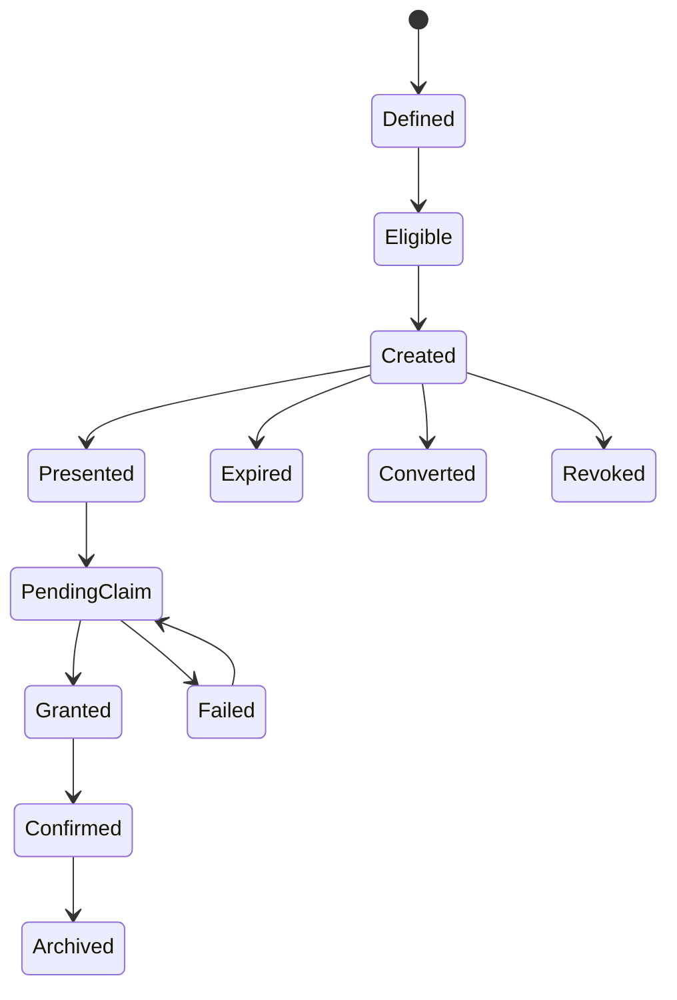

# Reward System（奖励系统）

> Status: V1  
> Category: Progression  
> Path: `design/systems/progression/reward-system.md`  
> Owner: TBD  
> Reviewers: Design / Product / Engineering / Data / QA / UX / Live Operations / Monetization  
> Last Updated: 2026-07-11  
> Version: 1.0  
> Risk Level: High  
> Dependencies: Core Loop, Rules and Resolution, Resources and Economy, Progression System, Content and Unlocks, Objectives and Quests, Save and Persistence  
> Affected Systems: Characters and Loadouts, Difficulty and Challenge, Live Operations, Monetization, Offers and Pricing, Analytics and Telemetry, Tutorial and Onboarding

---

## 1. System Summary

Reward System 负责定义：

```text
什么行为值得被奖励；
奖励何时生成；
奖励以什么形式存在；
奖励如何领取、发放、选择、保底、补偿和过期；
奖励如何连接当前结果与下一步成长；
奖励失败时如何恢复；
奖励如何避免通胀、重复、无效和高压。
```

奖励不是简单的“给东西”。

它承担：

- 反馈；
- 认可；
- 教学；
- 目标连接；
- 成长推进；
- 内容引导；
- 身份表达；
- 风险补偿；
- 长期动机。

健康的奖励系统应让玩家理解：

```text
我为什么获得这个奖励；
这个奖励与我的行为有什么关系；
它能帮助我做什么；
它为什么值得；
我是否需要现在处理；
如果暂时不处理，会发生什么。
```

---

## 2. Purpose

### 2.1 Player Value

奖励系统帮助玩家：

- 感知行动成果；
- 理解成功与进步；
- 获得下一步能力或选择；
- 建立短期与长期目标；
- 从失败和风险中获得反馈；
- 形成收藏、表达和身份；
- 相信高价值奖励不会丢失；
- 在重复内容中仍然看到价值变化。

### 2.2 Experience Contribution

奖励可以支持：

- 即时满足；
- 里程碑；
- 成长；
- 探索；
- 惊喜；
-表达；
- 承诺；
- 长期目标。

但奖励设计不健康时会造成：

- 奖励疲劳；
- 点击疲劳；
- 奖励通胀；
- 内容被奖励绑架；
- 玩家只为外部奖励行动；
- 核心体验被跳过；
- 随机付费压力；
- 囤积和溢出；
- 低价值重复物泛滥。

### 2.3 Product Value

奖励系统为以下能力提供共同基础：

- 核心循环；
- 任务；
- 成长；
- 活动；
- 成就；
- 回归；
- 商业化；
- 追赶；
- 社交；
- Live Operations；
- 数据分析。

### 2.4 Why This System Exists

如果每个功能独立设计奖励，常见结果是：

```text
同一行为被多次奖励；
奖励价值失控；
奖励与行为无关；
活动奖励破坏主经济；
重复物没有处理；
随机奖励缺少保底；
奖励领取失败后丢失；
大量奖励入口制造操作负担。
```

统一奖励系统用于保证：

- 奖励职责明确；
- Reward Instance 唯一；
- 发放幂等；
- 价值与来源可追踪；
- 经济和成长连接稳定；
- 高风险奖励可恢复。

---

## 3. Non-Goals

奖励系统不负责：

- 直接拥有资源余额；
- 定义全部成长轨道；
- 计算完整行为结果；
- 替代 Economy；
- 替代 Progression；
- 定义全部商店价格；
- 用奖励替代核心体验；
- 通过奖励数量制造虚假内容；
- 让所有行为都必须有外在奖励；
- 强迫玩家频繁手动领取；
- 通过隐藏概率推动付费；
- 自动保证全部奖励平衡。

---

## 4. Governing Principles

### 4.1 Core Experience and Fantasy

参考：

- `../../philosophy/foundation/core-experience-and-fantasy.md`

应用原则：

- 奖励应强化核心体验；
- 奖励形式应符合玩家幻想；
- 奖励不应把玩家引向与核心体验无关的最优行为；
- 重大里程碑奖励应体现身份变化。

### 4.2 Clarity and Feedback

参考：

- `../../philosophy/experience/clarity-and-feedback.md`

应用原则：

- 奖励来源、内容、数量和状态必须清楚；
- 领取失败要说明原因；
- 随机奖励应解释概率和保护机制；
- 重复补偿和溢出处理必须可见。

### 4.3 Choice and Consequence

参考：

- `../../philosophy/experience/choice-and-consequence.md`

应用原则：

- 选择型奖励应有真实差异；
- 奖励选择前应可比较；
- 不应使用隐藏信息制造后悔；
- 奖励应连接玩家行为与后果。

### 4.4 Progression and Motivation

参考：

- `../../philosophy/long-term/progression-and-motivation.md`

应用原则：

- 奖励连接当前行动与未来目标；
- 奖励应支持成长、选择或表达；
- 不应只依赖外在奖励维持参与；
- 回归和追赶奖励应恢复参与能力。

### 4.5 Ethical Design

参考：

- `../../philosophy/responsibility/ethical-design.md`

应用原则：

- 不隐藏真实概率；
- 不使用虚假稀缺；
- 不让核心价值永久错过；
- 不通过疲劳和失败推动随机付费；
- 儿童和脆弱用户需要额外保护。

---

## 5. Player Experience

### 5.1 Player Goal

玩家接触奖励系统通常为了：

- 确认成果；
- 获得资源；
- 解锁能力；
- 收集内容；
- 选择方向；
- 完成里程碑；
- 恢复损失；
- 准备下一轮。

### 5.2 Entry

奖励入口包括：

- 即时反馈；
- 结算页面；
- 任务完成；
- 里程碑；
- 成就；
- 活动；
- 邮件；
- 商店；
- 回归；
- 社交；
- 补偿。

### 5.3 Main Actions

玩家可以：

- 查看；
- 领取；
- 选择；
- 比较；
- 跳过展示；
- 自动领取；
- 保存；
- 转换；
- 分解；
- 回看；
- 申诉。

### 5.4 Core Decisions

关键决策包括：

- 选择哪个奖励；
- 现在使用还是保存；
- 是否接受随机结果；
- 是否消耗保底；
- 是否将重复物转换；
- 是否放弃过期奖励；
- 是否用付费资源增加奖励机会。

### 5.5 Success

健康奖励体验意味着：

- 玩家知道为什么获得；
- 奖励与行为有联系；
- 奖励可感知且有用途；
- 高价值奖励不会丢失；
- 重复奖励仍有合理处理；
- 奖励展示不会打断核心节奏；
- 奖励不会迫使玩家无意义重复。

### 5.6 Failure

失败包括：

- 奖励未生成；
- 重复发放；
- 发放失败；
- 领取失败；
- 容量溢出；
- 重复物无价值；
- 随机概率错误；
- 保底状态丢失；
- 活动结束后未领取；
- 奖励过期无提示。

---

## 6. System Boundary

### 6.1 Inputs

系统接收：

- Activity Result；
- Objective Completion；
- Milestone Completion；
- Progression State；
- Economy State；
- Content Availability；
- Entitlement State；
- Random Context；
- Live Operations Configuration；
- Purchase Result；
- Compensation Request；
- Return Eligibility。

### 6.2 Outputs

系统产生：

- Reward Definition；
- Reward Instance；
- Reward Eligibility；
- Reward Choice；
- Reward Roll；
- Reward Grant Request；
- Reward Claim State；
- Duplicate Conversion；
- Overflow Handling；
- Reward Expiry；
- Reward Granted Event；
- Reward Summary。

### 6.3 Owned State

系统拥有：

- Reward Definition；
- Reward Table；
- Reward Instance；
- Reward Claim State；
- Reward Choice State；
- Reward Roll State；
- Pity State；
- Duplicate Protection State；
- Reward Expiry State；
- Reward Presentation State；
- Reward Version；
- Reward Audit Record。

### 6.4 Read-Only Dependencies

系统读取：

- Economy 余额与容量；
- Progression 成长状态；
- Content 所有权与解锁；
- Objectives 完成状态；
- Entitlement 权益；
- Time；
- Live Operations 配置；
- Account 资格。

### 6.5 Write Dependencies

系统通过正式契约请求：

- Economy 发放资源；
- Progression 应用成长；
- Content 解锁内容；
- Entitlement 授予权益；
- Save 持久化；
- Analytics 记录；
- Notification 提醒未领取。

### 6.6 Out of Scope

系统不直接：

- 修改资源余额；
- 修改角色等级；
- 处理支付；
- 计算完整战斗结果；
- 管理商品定价；
- 决定全部内容生命周期。

---

## 7. Core Entities and Concepts

| Entity / Concept | Definition | Owner | Lifetime | Notes |
|---|---|---|---|---|
| Reward Definition | 奖励类型和规则 | Reward | 版本级 | 唯一 ID |
| Reward Table | 奖励候选与权重集合 | Reward | 配置级 | 可版本化 |
| Reward Instance | 一次具体奖励 | Reward | 至完成或失效 | 幂等身份 |
| Reward Bundle | 多项奖励组合 | Reward | 单次事务 | 原子或分项 |
| Reward Choice | 玩家从候选中选择 | Reward | 短期 | 需防重复 |
| Reward Roll | 随机结果记录 | Reward | 审计期 | 包含 Seed |
| Claim State | Unclaimed / Pending / Claimed 等 | Reward | 实例级 | 权威状态 |
| Pity State | 保底进度 | Reward | 长期或池级 | 版本化 |
| Duplicate State | 重复保护和补偿状态 | Reward | 长期 | 与拥有状态关联 |
| Overflow State | 容量不足处理 | Reward | 短期 | 不静默丢失 |
| Reward Summary | 玩家可见汇总 | Reward | 会话或长期 | 不等同权威记录 |

---

## 8. Reward Taxonomy

### 8.1 Immediate Feedback Reward

用于即时确认：

- 命中；
- 完成；
- 连击；
- 发现；
- 正确操作。

不一定产生持久价值。

### 8.2 Resource Reward

提供：

- 货币；
- 材料；
- 行动力；
- 制作资源；
- 活动资源。

### 8.3 Progression Reward

提供：

- 经验；
- 技能点；
- 等级；
- 熟练度；
- 成长资格。

### 8.4 Content Reward

解锁：

- 角色；
- 关卡；
- 地区；
- 模式；
- 剧情；
- 图鉴。

### 8.5 Ability Reward

提供新能力、技能或工具。

### 8.6 Expression Reward

提供：

- 外观；
- 动作；
- 装饰；
- 标识；
- 头像；
- 展示。

### 8.7 Recognition Reward

提供：

- 成就；
- 称号；
- 排名；
- 记录；
- 徽章。

### 8.8 Information Reward

提供：

- 地图；
- 情报；
- 规则；
- 图鉴；
- 叙事信息。

### 8.9 Choice Reward

让玩家从多个选项中选择。

### 8.10 Recovery Reward

用于：

- 补偿；
- 回归；
- 失败恢复；
- 追赶；
- 资产修复。

### 8.11 Social Reward

来自：

- 协作；
- 公会；
- 好友；
- 社交贡献。

---

## 9. Reward Roles

每个奖励应明确主要职责。

### 9.1 Feedback

确认行为结果。

### 9.2 Motivation

推动下一步。

### 9.3 Progression

推进成长。

### 9.4 Teaching

强化正确理解。

### 9.5 Exploration

鼓励发现新内容。

### 9.6 Expression

支持身份和展示。

### 9.7 Recovery

修复中断或错误。

### 9.8 Recognition

确认里程碑和成就。

同一奖励可以承担多个职责，但应有主要职责。

---

## 10. Reward Definition Template

```markdown
## Reward Definition

- Reward ID:
- Display Name:
- Category:
- Primary Role:
- Source:
- Eligibility:
- Contents:
- Quantity:
- Randomness:
- Choice:
- Duplicate Handling:
- Capacity Handling:
- Expiry:
- Claim Mode:
- Pity:
- Paid Influence:
- Persistent:
- Owner:
- Risk Level:
```

### 10.1 必须回答

- 为什么存在；
- 奖励什么行为；
- 对下一步有什么影响；
- 是否会重复；
- 是否会过期；
- 是否需要选择；
- 是否包含随机性；
- 付费是否影响；
- 失败后如何恢复。

---

## 11. Reward Lifecycle

```text
Defined
→ Eligible
→ Created
→ Presented
→ Pending Claim
→ Granted
→ Confirmed
→ Archived
```

可能分支：

```text
Created
→ Expired
Created
→ Converted
Created
→ Revoked
Created
→ Failed and Recovered
```



---

## 12. Reward Instance

每次高价值奖励应创建唯一 Reward Instance。

### 12.1 推荐字段

```markdown
| Field | Meaning |
|---|---|
| Reward Instance ID | 唯一身份 |
| Reward Definition ID | 来源定义 |
| Source | 奖励来源 |
| Recipient | 接收者 |
| Created At | 创建时间 |
| Claim State | 当前状态 |
| Contents | 具体内容 |
| Rule Version | 规则版本 |
| Configuration Version | 配置版本 |
| Random Seed | 随机上下文 |
| Idempotency Key | 防重复 |
| Expiry | 到期 |
| Correlation ID | 跨系统追踪 |
```

### 12.2 Reward Instance 不等于展示卡片

展示可以被关闭或跳过，但权威实例仍然存在。

---

## 13. Eligibility

奖励资格可以来自：

- 行动完成；
- 任务完成；
- 里程碑；
- 排名；
- 购买；
- 回归；
- 补偿；
- 社交；
- 活动参与。

### 13.1 Eligibility Validation

检查：

- 目标状态；
- 时间；
- 权限；
- 次数；
- 所有权；
- 版本；
- 地区；
- 平台；
- 账户限制；
- 重复资格。

### 13.2 Eligibility Snapshot

高风险奖励应在创建时记录资格来源，避免后续状态变化导致争议。

---

## 14. Reward Generation

### 14.1 Deterministic Reward

内容和数量固定。

适合：

- 里程碑；
- 核心成长；
- 补偿；
- 购买权益。

### 14.2 Variable Reward

数量或内容在范围内变化。

### 14.3 Random Reward

通过概率选择结果。

### 14.4 Choice Reward

玩家选择结果。

### 14.5 Hybrid Reward

固定基础 + 随机额外 + 选择性奖励。

### 14.6 Generation Timing

可以在：

- 行动开始前锁定；
- 行动结束后生成；
- 领取时生成；
- 购买确认后生成。

高价值随机奖励应明确：

```text
何时确定结果。
```

---

## 15. Reward Table

推荐结构：

```markdown
| Entry | Weight / Probability | Quantity | Eligibility | Duplicate Rule | Protection |
|---|---:|---:|---|---|---|
```

### 15.1 Table Version

每次 Roll 必须记录 Reward Table Version。

### 15.2 Nested Table

嵌套表需要控制复杂度，并支持最终概率计算。

### 15.3 Empty Result

如果允许空结果，必须明确。

### 15.4 Invalid Entry

配置中的无效内容应：

- 在发布前阻止；
- 或使用安全替代；
- 不静默发放错误奖励。

---

## 16. Random Rewards

### 16.1 Randomness Purpose

随机奖励可以提供：

- 惊喜；
- 变化；
- 探索；
- 构筑多样性。

不应主要用于：

- 模糊真实价格；
- 延长付费；
- 制造恐惧；
- 替代内容深度。

### 16.2 Required Data

每次权威 Roll 记录：

- Seed；
- Table Version；
- Probability；
- Weight；
- Result；
- Pity Before；
- Pity After；
- Duplicate Protection；
- Transaction ID。

### 16.3 Probability Transparency

玩家可见概率应反映：

- 基础概率；
- 保底；
- 权重变化；
- 去重；
- 条件池；
- 稀有度；
- 是否独立。

### 16.4 Paid Randomness

必须经过高风险伦理与法律评审。

---

## 17. Pity and Bad Luck Protection

### 17.1 Pity Types

- Hard Pity；
- Soft Pity；
- Guaranteed Category；
- Guaranteed New Item；
- Token Exchange；
- Progress Carryover；
- Choice after Threshold。

### 17.2 Pity State

必须定义：

- 按账户、池、活动还是角色；
- 何时增加；
- 何时重置；
- 是否跨版本；
- 是否跨活动；
- 是否对玩家可见；
- 退款如何处理。

### 17.3 Pity Transparency

高价值和付费随机应公开：

- 当前进度；
- 最大次数；
- 重置条件；
- 是否继承。

### 17.4 Pity Migration

奖励池变化时，保底进度不能无说明清零。

---

## 18. Duplicate Handling

### 18.1 Duplicate Types

- 完全重复；
- 同类别重复；
- 已拥有唯一内容；
- 达到最大等级；
- 无法再次使用。

### 18.2 Handling Options

- Prevent Duplicate；
- Reroll；
- Convert；
- Upgrade；
- Stack；
- Trade；
- Gift；
- Refund Token；
- Choice Replacement。

### 18.3 Duplicate Compensation

补偿价值应：

- 可理解；
- 不明显低于预期；
- 不制造继续抽取的隐性压力；
- 与物品价值和稀有度相关。

### 18.4 Collection Completion

接近收集完成时，应避免最后少量内容概率极低且无明确保护。

---

## 19. Choice Rewards

### 19.1 Choice Count

明确：

- 从几项中选几项；
- 是否可预览；
- 是否可延迟；
- 是否可撤销；
- 是否会过期。

### 19.2 Meaningful Choice

选项应有：

- 真实差异；
- 适用情境；
- 可理解价值；
- 非唯一最优。

### 19.3 Choice Failure

如果选择时内容失效：

- 重新生成；
- 保留资格；
- 提供替代；
- 不重复消耗。

### 19.4 Deferred Choice

高价值选择可以允许稍后处理。

但必须记录：

- 当前候选；
- 版本；
- 到期；
- 是否随池变化。

---

## 20. Reward Bundles

### 20.1 Bundle Types

- Fixed Bundle；
- Mixed Bundle；
- Selectable Bundle；
- Progressive Bundle；
- Conditional Bundle。

### 20.2 Atomicity

必须定义 Bundle 是：

- 全部成功；
- 分项成功；
- Pending 部分。

高价值 Bundle 应优先保证可恢复。

### 20.3 Presentation

Bundle 展示应区分：

- 主要奖励；
- 次要奖励；
- 重复补偿；
- 溢出；
- 解锁。

---

## 21. Claim Modes

### 21.1 Auto Grant

适合：

- 高频；
- 低风险；
- 无选择；
- 不会溢出；
- 不需仪式感。

### 21.2 Manual Claim

适合：

- 需要选择；
- 需要确认；
- 高价值；
- 里程碑；
- 容量风险。

### 21.3 Deferred Claim

允许稍后领取。

需要：

- 持久化；
- 提醒；
- 到期；
- 恢复。

### 21.4 Claim All

批量领取应：

- 支持预览；
- 处理容量；
- 处理选择型奖励；
- 不重复；
- 给出汇总。

### 21.5 Avoid Click Tax

不应仅为了增加操作量而要求每个低价值奖励手动点击。

---

## 22. Claim State Model

```text
Uncreated
→ Created
→ Unclaimed
→ Pending
→ Claimed
→ Confirmed
```

异常：

```text
Pending
→ Failed
→ Pending
Unclaimed
→ Expired
Unclaimed
→ Revoked
```

### 22.1 Invariants

1. 同一 Reward Instance 只能成功领取一次。
2. Claimed 后不能再次发放。
3. Pending 必须可查询和恢复。
4. UI 关闭不改变 Claim State。
5. Analytics 失败不影响 Claim。
6. Reward 不能直接绕过 Economy、Progression 或 Entitlement 的 Owner。

---

## 23. Delivery

奖励可通过：

- 直接发放；
- 邮件；
- 背包；
- 仓库；
- 角色；
- 解锁；
- 权益；
- 账户；
- 社交礼物。

### 23.1 Delivery Contract

应说明：

- 目标系统；
- 目标状态；
- 幂等键；
- 容量；
- 失败；
- Pending；
- 回滚；
- 审计。

### 23.2 Mail Delivery

邮件不应成为所有异常的默认垃圾桶。

应定义：

- 到期；
- 容量；
- 提醒；
- 自动领取；
- 邮件删除；
- 高价值保护。

---

## 24. Capacity and Overflow

### 24.1 Pre-Check

领取前检查：

- 容量；
- 堆叠；
- 唯一性；
- 上限；
- 所有权。

### 24.2 Overflow Options

- 阻止领取；
- 进入邮件；
- 转换；
- 临时仓库；
- 自动扩容；
- 延迟领取。

### 24.3 High-Value Rewards

不能静默丢弃。

### 24.4 Player Choice

若 Overflow 有多个处理方式，应允许玩家理解并选择。

---

## 25. Expiry

### 25.1 Reward Expiry

可用于：

- 活动资格；
- 临时选择；
- 邮件；
- 时限补给。

### 25.2 Expiry Rules

必须说明：

- 创建时间；
- 到期时间；
- 时区；
- 宽限期；
- 提醒；
- 到期后处理；
- 是否自动发放；
- 是否转换。

### 25.3 不建议过期

通常不应轻易过期：

- 购买所得；
- 核心里程碑；
- 补偿；
- 高价值唯一奖励；
- 长期成长资格。

---

## 26. Reward Presentation

### 26.1 Presentation Levels

#### Immediate

轻量反馈。

#### Transactional

一次行为的完整结果。

#### Milestone

重大演出。

#### Summary

批量或会话汇总。

#### Persistent

历史记录、图鉴或收集。

### 26.2 Presentation Priority

重大新能力应高于：

- 小额资源；
- 重复补偿；
- 常规货币。

### 26.3 Skippable

重复展示应支持：

- 加速；
- 跳过；
- 批量；
- 自动化。

### 26.4 Presentation Does Not Own Reward

动画中断、页面关闭或跳过，不应导致奖励状态丢失。

---

## 27. Reward Feedback

必须说明：

- 来源；
- 内容；
- 数量；
- 稀有度；
- 是否新获得；
- 是否重复；
- 是否转换；
- 是否溢出；
- 是否已到账；
- 是否有下一步。

### 27.1 Before / After

高价值资源变化应显示：

- Before；
- Delta；
- After。

### 27.2 Unlock Feedback

内容解锁应说明：

- 解锁了什么；
- 在哪里使用；
- 为什么解锁；
- 是否需要进一步处理。

---

## 28. Reward Cadence

### 28.1 Micro Reward

高频、轻量。

### 28.2 Loop Reward

每轮核心循环。

### 28.3 Session Reward

一次会话总结。

### 28.4 Milestone Reward

长期节点。

### 28.5 Event Reward

限时结构。

### 28.6 Cadence Balance

奖励过密会：

- 打断节奏；
- 降低价值；
- 制造点击疲劳。

奖励过稀会：

- 反馈不足；
- 目标不清；
- 成长感弱。

---

## 29. Reward Density

奖励密度应与：

- 行为频率；
- 风险；
- 决策价值；
- 会话长度；
- 内容节奏；

匹配。

### 29.1 高频行为

不需要每次都提供持久奖励。

可以使用：

- 即时反馈；
- 进度；
- 汇总；
- 里程碑。

### 29.2 Reward Fragmentation

避免将一个合理奖励拆成大量碎片，仅为了延长领取和收集。

---

## 30. Reward Value

奖励价值包括：

- 功能价值；
- 稀缺价值；
- 情绪价值；
- 表达价值；
- 社交价值；
- 未来价值；
- 选择价值。

### 30.1 Objective Value

由系统定义的效用。

### 30.2 Subjective Value

因玩家目标和偏好不同而变化。

### 30.3 Value Communication

奖励展示应帮助玩家理解用途，但不夸大稀缺和压力。

---

## 31. Reward Inflation

奖励通胀表现为：

- 数量不断增加；
- 稀有度贬值；
- 奖励演出越来越夸张；
- 常规奖励失去吸引力；
- 新奖励全面替代旧奖励。

### 31.1 Causes

- 活动叠加；
- 等级上限提高；
- Source 过多；
- 付费竞争；
- 缺少 Sink；
- 奖励表长期不更新。

### 31.2 Controls

- 价值职责审计；
- 奖励分层；
- 横向奖励；
- 重复补偿；
- 内容轮换；
- 经济联动；
- 删除无效奖励。

---

## 32. Reward Fatigue

玩家对奖励失去兴趣，常见原因：

- 频率过高；
- 展示过长；
- 内容重复；
- 奖励无用途；
- 领取步骤过多；
- 价值难理解。

### 32.1 Reduction

- 汇总；
- 自动领取；
- 跳过；
- 重点突出；
- 删除低价值碎片；
- 提升选择价值；
- 改善用途。

---

## 33. Reward and Intrinsic Motivation

奖励应支持而不是替代核心行为价值。

### 33.1 Risk

过度外在奖励可能让玩家：

- 只做最优奖励行为；
- 忽略探索；
- 失去自主；
- 将无奖励内容视为无价值。

### 33.2 Design Response

- 奖励与核心行为对齐；
- 保留自由探索；
- 使用信息、身份和表达奖励；
- 不给所有行为统一货币化；
- 让部分体验本身成立。

---

## 34. First-Time Rewards

首次奖励可以：

- 教学；
- 鼓励探索；
- 介绍系统；
- 提供起步资源。

### 34.1 First-Time Bonus

必须明确：

- 仅一次；
- 领取条件；
- 是否可错过；
- 重玩行为；
- 多角色行为。

### 34.2 Avoid Farming Exploits

需要防止：

- 重建账号；
- 重置内容；
- 重复创建角色；
- 多设备重复领取。

---

## 35. Repeat Rewards

重复内容需要定义：

- 基础奖励；
- 递减；
- 每日上限；
- 周期上限；
- 无奖励；
- 额外挑战；
- 熟练度奖励。

### 35.1 Diminishing Returns

可以控制重复刷取，但应：

- 清楚；
- 可预测；
- 不在完成后才隐藏削减；
- 不惩罚正常重复。

### 35.2 Repeat Value

长期重复应通过：

- 情境变化；
- 选择；
- 技巧；
- 横向目标；
- 社交；

维持，而不是只提高奖励数量。

---

## 36. Failure Rewards

失败也可以产生：

- 学习反馈；
- 部分进度；
- 保底进度；
- 恢复资源；
- 熟练度；
- 情报。

### 36.1 Failure Reward Purpose

用于：

- 降低挫败；
- 支持学习；
- 保持恢复能力。

### 36.2 Avoid Exploitation

失败奖励不能让故意失败成为最优策略。

### 36.3 Do Not Hide Failure

失败奖励不应掩盖失败原因或取消挑战后果。

---

## 37. Return Rewards

回归奖励用于：

- 恢复上下文；
- 提供起步资源；
- 引导当前内容；
- 支持追赶。

### 37.1 Return Reward Principles

- 不惩罚持续玩家；
- 不让故意离开成为最优策略；
- 价值与当前差距相关；
- 不一次展示过多系统；
- 不用高压倒计时。

---

## 38. Catch-Up Rewards

追赶奖励应：

- 面向明确差距；
- 提供目标型资源；
- 恢复参与能力；
- 支持当前内容；
- 有防滥用。

不应直接复制：

- 全部历史成就；
- 稀有身份；
- 高水平掌握；
- 社交关系。

---

## 39. Event Rewards

### 39.1 Event Reward Types

- 参与；
- 进度；
- 里程碑；
- 排名；
- 挑战；
- 商店；
- 收藏。

### 39.2 Event End

必须处理：

- 未领取；
- 未完成；
- 排名；
- 活动货币；
- 重复物；
- 返场；
- 宽限期。

### 39.3 Core Value

核心能力和关键内容不应永久锁定于单次活动。

### 39.4 Ranking Rewards

排名奖励应避免：

- 极端赢家通吃；
- 付费直接决定；
- 最后时刻隐藏规则；
- 作弊收益。

---

## 40. Social Rewards

社交奖励可以支持：

- 协作；
- 帮助；
- 公会；
- 组队；
- 社区贡献。

### 40.1 Avoid Coercion

不应让玩家因为拒绝社交而失去核心成长能力。

### 40.2 Contribution Fairness

贡献计算应避免：

- 最后一下；
- 高付费优势；
- 在线时长唯一决定；
- 支援角色被低估。

---

## 41. Commercial Rewards

商业奖励包括：

- 购买内容；
- 订阅权益；
- 付费货币；
- 套餐；
- 额外奖励；
- 购买赠品。

### 41.1 Purchase vs Reward

购买所得应明确标识为：

```text
已购买价值
```

而不是伪装成“免费奖励”。

### 41.2 Bonus

赠送和 Bonus 应说明：

- 基础购买内容；
- 额外内容；
- 是否限时；
- 是否重复购买；
- 退款影响。

### 41.3 Paid Random Rewards

必须遵守：

- 概率透明；
- 保底；
- 支出保护；
- 儿童保护；
- 退款和争议处理。

---

## 42. Compensation Rewards

### 42.1 Purpose

用于修复：

- 服务中断；
- 配置错误；
- 资产问题；
- 活动异常；
- 迁移失败；
- 错误扣除。

### 42.2 Compensation Principles

- 原因清楚；
- 受影响范围合理；
- 不重复；
- 可审计；
- 不要求额外行为；
- 不过度破坏经济。

### 42.3 Claim Mode

高风险补偿优先：

- 自动发放；
- 或长期可领取。

不应使用短到期制造再次损失。

---

## 43. Revocation

奖励可能因以下原因撤销：

- 退款；
- 欺诈；
- 错误发放；
- 违规；
- 内容许可变化。

### 43.1 Revocation Rules

必须说明：

- 法律和政策依据；
- 已消费内容；
- 负余额；
- 所有权；
- 通知；
- 申诉；
- 审计。

### 43.2 Avoid Silent Removal

高价值奖励撤销不能静默发生。

---

## 44. Failure and Recovery

| Failure | Cause | Player Impact | Recovery | Data Guarantee |
|---|---|---|---|---|
| Reward Not Created | 来源事件丢失 | 无奖励 | 重放来源、创建实例 | 来源可审计 |
| Duplicate Instance | 重复事件 | 重复资格 | 幂等去重 | 单一实例 |
| Claim Timeout | 下游超时 | Pending | 查询或幂等重试 | 不重复发放 |
| Partial Bundle | 部分发放失败 | 奖励不完整 | 恢复剩余部分 | 分项记录 |
| Capacity Overflow | 容量不足 | 无法到账 | 邮件、延迟、转换 | 高价值不丢失 |
| Pity Lost | 状态错误 | 随机保护失效 | 恢复历史 | Roll 可审计 |
| Duplicate Error | 拥有状态不同步 | 错误重复补偿 | 查询权威所有权 | 保留原结果 |
| Expiry Misfire | 时间配置错误 | 奖励提前失效 | 恢复或补偿 | 保留实例 |
| Presentation Interrupted | 页面关闭 | 玩家不确定 | 从权威状态恢复 | 奖励状态不变 |

---

## 45. Edge Cases

### Creation

- 同一来源多次触发；
- 一次生成大量奖励；
- 配置版本切换；
- 来源内容被删除；
- 玩家在生成时离线。

### Claim

- 连点；
- 多设备；
- 批量领取；
- 领取时容量变化；
- 领取中断；
- 领取后页面崩溃。

### Random

- Pity 正好触发；
- Pool 在 Roll 后更新；
- 最后一项未拥有内容；
- 重复保护与保底同时触发；
- 退款后保底状态。

### Expiry

- 到期瞬间领取；
- 跨时区；
- 设备时间错误；
- 宽限期；
- 活动返场；
- 未领取邮件。

### Bundle

- 部分内容已拥有；
- 一项达到上限；
- 一项需要选择；
- 一项属于不同平台；
- 一项发放 Pending。

---

## 46. Cross-System Dependencies

| System | Dependency Type | Direction | Data or Event | Failure Impact |
|---|---|---|---|---|
| Core Loop | Hard | Loop → Reward | Result / Completion | 循环无法闭合 |
| Rules and Resolution | Hard | Rules → Reward | Eligibility / Roll | 结果错误 |
| Resources and Economy | Hard | Reward → Economy | Grant Request | 资源无法到账 |
| Progression System | Hard / Soft | Reward → Progression | Growth Grant | 成长延迟 |
| Content and Unlocks | Hard / Soft | Reward → Content | Unlock | 内容不同步 |
| Objectives and Quests | Hard / Soft | Objectives → Reward | Completion Source | 奖励不生成 |
| Entitlement | Hard for Paid | Reward → Entitlement | Ownership Grant | 付费权益风险 |
| Save and Persistence | Hard | Reward → Save | Instance / Claim | 无法恢复 |
| Live Operations | Soft | Live → Reward | Event Tables | 使用 Last Known Good |
| Notification | Soft | Reward → Notification | Unclaimed Reminder | 不阻断 |
| Analytics | Soft | Reward → Analytics | Reward Events | 不阻断 |

---

## 47. Data and Persistence

| State | Persistent | Authority | Save Trigger | Retention | Recovery |
|---|---|---|---|---|---|
| Reward Definition | 是 | Reward | 配置发布 | 版本期 | Last Known Good |
| Reward Instance | 是 | Reward | 创建时 | 至完成后审计期 | 幂等查询 |
| Claim State | 是 | Reward | 每次变化 | 长期或实例期 | 恢复 |
| Reward Roll | 高风险时是 | Reward | Roll 完成 | 审计期 | 重放 |
| Pity State | 是 | Reward | 每次变化 | 长期或池周期 | 历史恢复 |
| Choice State | 是 | Reward | 候选创建 | 至选择完成 | 恢复候选 |
| Duplicate State | 是 | Reward | 所有权变化 | 长期 | 查询权威状态 |
| Expiry State | 是 | Reward | 创建与时间变化 | 至到期后审计期 | 恢复或补偿 |
| Presentation State | 可选 | Reward / UI | 展示后 | 短期 | 重新展示摘要 |
| Audit Record | 是 | Reward | 高风险事务 | 长期 | 争议处理 |

---

## 48. Accessibility

### 48.1 Visual

- 奖励类型、数量和状态有文本；
- 不只依赖颜色和闪光表达稀有度；
- 新获得、重复、转换和溢出清楚区分；
- 批量奖励支持汇总。

### 48.2 Audio

- 重大奖励不只依赖音效；
- 音效可关闭；
- 声音不会阻止跳过展示。

### 48.3 Input

- 支持批量领取；
- 支持跳过重复动画；
- 选择型奖励可用键鼠、手柄和触摸；
- 高风险选择防误触。

### 48.4 Cognitive

- 主要奖励突出；
- 低价值内容折叠；
- 随机规则按需展开；
- 概率、保底、重复补偿术语一致；
- 可回看历史。

### 48.5 Timing

- 不要求在极短时间内领取；
- 过期提前提醒；
- 高价值选择允许延迟；
- 动画和展示可加速。

---

## 49. Ethical and Safety Review

### 49.1 Randomness

- 实际概率透明；
- 保底可见；
- Pool 变化有说明；
- 重复保护明确；
- 非随机替代路径合理。

### 49.2 Financial Risk

- 购买所得与免费奖励明确区分；
- 不将已购买内容包装为限时赠送；
- 付费随机提供支出保护；
- 退款和撤销规则清楚。

### 49.3 FOMO

- 核心能力不永久错过；
- 未领取高价值奖励有宽限或自动处理；
- 不用短到期制造高压；
- 活动奖励返场规则清楚。

### 49.4 Player Time

- 不通过大量手动领取增加时长；
- 不将奖励拆成过多碎片；
- 支持汇总和自动化；
- 不强迫无意义重复。

### 49.5 Children and Vulnerable Users

- 限制高压随机付费；
- 提供监护和消费限制；
- 不使用夸张演出掩盖真实概率；
- 不在失败或疲劳状态推动抽取。

### 49.6 Social Pressure

- 不用公开羞辱未参与玩家；
- 排名奖励不过度赢家通吃；
- 社交奖励不成为核心成长唯一来源。

---

## 50. Analytics and Validation

### 50.1 Key Assumptions

1. 玩家理解主要奖励来源和用途。
2. 奖励能够连接当前行为与下一目标。
3. 奖励展示不会破坏节奏。
4. 选择型奖励具有真实差异。
5. 随机奖励的概率和保底可理解。
6. 重复奖励仍有合理价值。
7. 高价值奖励可以安全恢复。
8. 奖励不会快速通胀或失去意义。
9. 回归、追赶和活动奖励不会破坏主经济。

### 50.2 Validation Plan

| Hypothesis | Evidence | Success | Failure | Method |
|---|---|---|---|---|
| 奖励可理解 | 复述 | 能说明来源和用途 | 只看稀有度 | 可用性测试 |
| 连接下一步 | 后续行为 | 奖励影响成长或选择 | 奖励只囤积 | 行为数据 |
| 展示节奏合理 | 跳过和放弃 | 演出被接受 | 大量快速跳过或退出 | 数据与访谈 |
| Choice 有意义 | 选择分布 | 多种选项被选择 | 单一选项压倒性 | 分布分析 |
| Random 可理解 | 概率任务 | 能说明规则 | 误解保底或概率 | 研究 |
| Duplicate 合理 | 重复反馈 | 补偿被认为可接受 | 强烈失望 | 访谈 |
| Recovery 可靠 | 故障注入 | Pending 能恢复 | 奖励丢失或重复 | QA |
| 长期健康 | 价值趋势 | 奖励仍被使用 | 通胀和疲劳 | 长期监控 |

### 50.3 Behavioral Metrics

- Reward Created；
- Reward Presented；
- Reward Claimed；
- Reward Auto Granted；
- Claim Failed；
- Claim Recovered；
- Choice Selected；
- Reward Rerolled；
- Pity Triggered；
- Duplicate Converted；
- Reward Expired；
- Reward Skipped；
- Claim All Used。

### 50.4 Outcome Metrics

- Claim Success Rate；
- Pending Recovery Rate；
- Reward Usage Rate；
- Choice Diversity；
- Duplicate Satisfaction；
- Pity Understanding；
- Reward Velocity；
- Reward Inflation；
- Unclaimed Rate；
- Expiry Loss；
- Reward-to-Next-Action Conversion。

### 50.5 Negative Metrics

- 奖励丢失；
- 重复发放；
- Pending 长期未恢复；
- 领取失败；
- 容量静默丢失；
- 隐藏过期；
- 概率投诉；
- 保底状态错误；
- 重复补偿过低；
- 奖励演出疲劳；
- 大量未领取；
- 奖励通胀；
- 活动奖励破坏主经济。

### 50.6 Event Intents

| Event Intent | Trigger | Key Properties | Privacy Notes |
|---|---|---|---|
| Reward Created | 实例创建 | Type, Source, Version | 匿名 ID |
| Reward Claimed | 成功领取 | Type, Contents Category | 不记录支付敏感信息 |
| Reward Pending | 下游未完成 | Reason, Target System | 审计 |
| Pity Changed | 保底变化 | Pool, Before, After | 高风险访问控制 |
| Duplicate Handled | 重复处理 | Type, Compensation | 数据最小化 |
| Reward Expired | 到期 | Type, Value Category | 不推断健康状态 |
| Claim Recovered | 恢复成功 | Recovery Type | 事务追踪 |
| Reward Presentation Skipped | 跳过演出 | Presentation Type | 不作为负面画像 |

---

## 51. Reward Model Template

```markdown
# Reward Model

## Reward

- Name:
- Category:
- Primary Role:
- Source:
- Claim Mode:

## Contents

| Item | Quantity | Random | Choice | Duplicate Rule |
|---|---:|---|---|---|

## Randomness

- Table:
- Probability:
- Pity:
- Carryover:
- Duplicate Protection:

## Delivery

- Target System:
- Capacity:
- Overflow:
- Expiry:
- Recovery:

## Presentation

- Priority:
- Skippable:
- Summary:
- History:

## Ethics

- Paid Influence:
- FOMO:
- Children:
- Transparency:

## Validation

- Success:
- Failure:
- Metrics:
```

---

## 52. Rollout and Migration

### 52.1 Rollout

奖励变更应按：

- 内部；
- 模拟；
- 测试环境；
- 小范围；
- 分池；
- 分活动；
- 全量；

逐步发布。

### 52.2 High-Risk Changes

包括：

- 概率；
- 保底；
- 付费池；
- 重复补偿；
- 高价值奖励；
- 过期；
- 大规模补偿；
- Reward Table 重构。

### 52.3 Migration

必须定义：

- 未领取 Reward Instance；
- Pity；
- Choice 候选；
- 旧 Pool；
- Duplicate State；
- Expiry；
- Pending Claim；
- 旧版本 Table。

### 52.4 Rollback

回滚时：

- 已发放奖励不自动撤销；
- 未领取实例使用原版本或明确映射；
- Pity 不无说明清零；
- Pending 继续恢复；
- 保留审计；
- 必要时补偿。

### 52.5 Stop Conditions

出现以下情况应停止发布：

- 重复发放；
- 奖励丢失；
- Pity 错误；
- 概率与展示不一致；
- 付费奖励异常；
- 大量 Claim Pending；
- 重复补偿错误；
- 过期配置错误；
- Reward Table 无效；
- 活动奖励破坏经济。

---

## 53. Risks and Open Questions

| Item | Type | Impact | Probability | Mitigation | Owner |
|---|---|---:|---:|---|---|
| 奖励数量膨胀 | Complexity Risk | 高 | 高 | 奖励职责审计 | Design |
| 奖励通胀 | Economy Risk | 高 | 中 | 与 Economy 联动 | Economy Owner |
| 外在奖励替代核心乐趣 | Experience Risk | 高 | 中 | 核心行为对齐 | Design |
| 随机概率误解 | Trust Risk | 高 | 中 | 透明概率和保底 | Product |
| 重复补偿过低 | Motivation Risk | 中 | 高 | 价值审计 | Design |
| Claim Pending 恢复失败 | Integration Risk | 严重 | 低 | 幂等与对账 | Engineering |
| 活动奖励永久错过 | Ethical Risk | 高 | 中 | 返场、宽限、替代 | Live Ops |
| Pity 迁移错误 | Migration Risk | 严重 | 中 | 版本和历史 | Engineering |
| 付费奖励儿童风险 | Ethical Risk | 严重 | 低 | 消费保护 | Product |

---

## 54. Review Checklist

### Purpose and Taxonomy

- [ ] 每种奖励有明确主要职责；
- [ ] Reward Taxonomy 完整；
- [ ] 奖励支持核心体验；
- [ ] 不用奖励数量替代内容价值；
- [ ] Non-Goals 已定义。

### Instance and Lifecycle

- [ ] 高价值奖励有唯一 Reward Instance；
- [ ] Claim State 完整；
- [ ] Pending 可查询和恢复；
- [ ] UI 展示不拥有奖励状态；
- [ ] 同一实例只能成功领取一次。

### Generation and Randomness

- [ ] Deterministic、Variable、Random、Choice 区分；
- [ ] Reward Table 有版本；
- [ ] 随机结果可审计；
- [ ] 概率、保底和去重透明；
- [ ] 付费随机通过专项评审。

### Duplicate and Choice

- [ ] 重复物处理明确；
- [ ] 补偿价值合理；
- [ ] Choice 有真实差异；
- [ ] 候选可持久化；
- [ ] 无效候选有替代路径。

### Claim and Delivery

- [ ] Auto、Manual、Deferred Claim 有明确适用范围；
- [ ] 高频低风险奖励不制造 Click Tax；
- [ ] Delivery Contract 明确；
- [ ] Capacity 和 Overflow 安全；
- [ ] 高价值奖励不静默丢失。

### Presentation and Cadence

- [ ] 展示层级合理；
- [ ] 重复演出可跳过；
- [ ] 主要奖励突出；
- [ ] Reward Density 与节奏匹配；
- [ ] 奖励疲劳有控制方式。

### Return, Event, Commercial

- [ ] Return 和 Catch-Up 不可滥用；
- [ ] Event Reward 有宽限和返场；
- [ ] Purchase 与 Reward 清楚区分；
- [ ] Bonus 不掩盖真实购买价值；
- [ ] Compensation 不重复且可审计。

### Ethics and Validation

- [ ] 不隐藏概率和到期；
- [ ] 不利用失败和疲劳推动付费；
- [ ] 儿童保护完整；
- [ ] Claim、Pity、Duplicate、Expiry 和 Inflation 指标完整；
- [ ] 迁移、回滚和停止条件明确。

---

## 55. V1 Completion Criteria

Reward System 可以被视为 V1，当：

- 奖励类型、职责和边界已经定义；
- 每种奖励有统一 Reward Definition；
- Reward Lifecycle 完整；
- 高价值奖励使用唯一 Reward Instance；
- Eligibility、Generation、Claim、Delivery、Presentation 和 Archive 阶段明确；
- Deterministic、Variable、Random、Choice 和 Hybrid Reward 得到区分；
- Reward Table、Random Seed、Probability、Pity 和 Duplicate Protection 可版本化和审计；
- Claim State、Pending、Duplicate、Expired、Revoked 语义完整；
- Auto Grant、Manual Claim、Deferred Claim 和 Claim All 规则明确；
- Reward Bundle 的原子性和部分失败策略明确；
- Capacity、Overflow、Expiry 和 Mail Delivery 不会静默丢失高价值奖励；
- 奖励展示支持跳过、汇总和历史；
- Reward Cadence、Density、Inflation 和 Fatigue 有治理方式；
- 奖励与核心循环、成长和经济保持连接；
- Failure、Return、Catch-Up、Event、Social、Commercial 和 Compensation Reward 有明确边界；
- Economy、Progression、Content 和 Entitlement 的状态所有权不被绕过；
- 高风险奖励支持幂等、恢复、审计和对账；
- 随机、付费、FOMO、儿童和脆弱用户通过伦理评审；
- Claim、Pity、Duplicate、Expiry、Usage 和 Inflation 有验证计划；
- 高风险奖励变更具有灰度、迁移、回滚和停止条件；
- 下游 Progression、Economy、Content、Live Operations 和 Commercial 系统可以直接引用本文件。

---

## 56. Related Documents

### Philosophy

- [Core Experience and Fantasy](../../philosophy/foundation/core-experience-and-fantasy.md)
- [Clarity and Feedback](../../philosophy/experience/clarity-and-feedback.md)
- [Choice and Consequence](../../philosophy/experience/choice-and-consequence.md)
- [Progression and Motivation](../../philosophy/long-term/progression-and-motivation.md)
- [Ethical Design](../../philosophy/responsibility/ethical-design.md)

### Systems

- [Systems README](../README.md)
- [System Design Framework](../system-design-framework.md)
- [System Map](../system-map.md)
- [Integration Rules](../integration-rules.md)
- [Core Loop](../core/core-loop.md)
- [Rules and Resolution](../core/rules-and-resolution.md)
- [Resources and Economy](./resources-and-economy.md)
- [Progression System](./progression-system.md)
- `difficulty-and-challenge.md`
- `../content/content-and-unlocks.md`
- `../content/objectives-and-quests.md`
- `../commercial/monetization-system.md`
- `../operations/live-operations.md`
