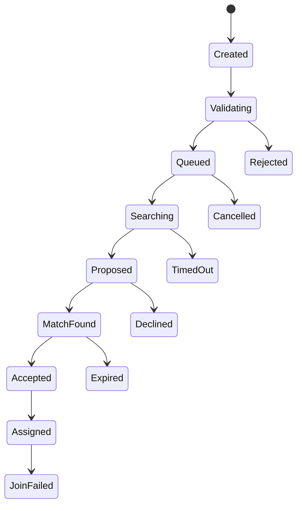

# Matchmaking and Competition（匹配与竞争系统）

> Status: V1  
> Category: Social  
> Path: `design/systems/social/matchmaking-and-competition.md`  
> Owner: TBD  
> Reviewers: Product / Design / Engineering / Data / QA / Security / Trust and Safety / Live Operations / Accessibility / Support  
> Last Updated: 2026-07-11  
> Version: 1.0  
> Risk Level: Critical  
> Dependencies: Social and Multiplayer, Characters and Loadouts, Difficulty and Challenge, Rules and Resolution, Save and Persistence, Settings and Preferences, Moderation and Safety, Analytics and Telemetry  
> Affected Systems: Reward System, Progression System, Objectives and Quests, Live Operations, Experiment Management, Entitlement and Ownership, Notification and Reminders

---

## 1. System Summary

Matchmaking and Competition 系统负责定义：

```text
哪些玩家可以进入同一匹配池；
系统如何从候选玩家中组建公平且可玩的对局；
个人与组队玩家如何被处理；
评分、段位、赛季和排名如何计算；
掉线、弃赛、重赛、无效局和异常结果如何处理；
跨平台、跨输入、跨地区和跨版本如何保持公平；
竞争结果如何被权威确认、保存、审计和奖励；
系统如何防止 Smurf、Boosting、Win Trading、Queue Sniping 和其他滥用。
```

匹配系统不只是：

```text
找几个分数相近的玩家放进同一场。
```

它同时需要平衡：

- 匹配质量；
- 等待时间；
- 网络质量；
- 组队结构；
- 角色和模式资格；
- 输入差异；
- 平台差异；
- 地区；
- 语言；
- 隐私；
- 安全；
- 玩家偏好；
- 竞争公平；
- 系统容量；
- 长期健康。

竞争系统负责：

- Match Result；
- Rating；
- Rank；
- Tier；
- Division；
- Placement；
- Promotion；
- Demotion；
- Leaderboard；
- Season；
- Decay；
- Reset；
- Rewards；
- Integrity；
- Appeals。

健康的匹配与竞争系统应让玩家感受到：

```text
我的对手和队友大致合理；
等待时间与公平之间有可理解平衡；
组队不会获得不透明优势；
比赛结果由真实表现和权威规则决定；
网络和系统异常不会被误判为普通失败；
段位和排名有意义且可解释；
竞争不会被付费、作弊或隐藏规则操纵。
```

---

## 2. Purpose

### 2.1 Player Value

该系统帮助玩家：

- 快速找到可玩的对局；
- 遇到水平、网络和规则相对合适的对手；
- 与好友组队参与；
- 理解当前段位与进步；
- 获得稳定的竞争反馈；
- 在掉线和系统异常时获得公平处理；
- 避免被明显作弊、恶意组队或极端实力差距破坏体验；
- 在赛季变化后保留可理解的历史和身份；
- 选择是否参与竞争；
- 在休闲、合作和竞技模式间得到不同强度的匹配。

### 2.2 Experience Contribution

匹配与竞争直接影响：

- 公平；
- 挑战；
- 节奏；
- 社交；
- 掌握感；
-长期目标；
-身份；
-信任；
-回归；
-社区质量。

不健康的系统会造成：

- 碾压局；
- 排队过长；
- 组排优势过强；
- 隐藏 DDA；
- 主机优势；
- 延迟不公平；
- Smurf；
- Boosting；
- Win Trading；
- 付费优势；
- 掉线误罚；
- 排名结果争议；
- 赛季奖励绑架；
- 输入池冲突；
- 高段位人口断层。

### 2.3 Product Value

统一系统可以：

- 复用匹配基础设施；
- 统一队列和资格；
- 建立稳定 Rating；
- 支持多种模式；
- 支持赛季和排行榜；
- 支持反滥用；
- 支持灰度和实验；
- 支持容量管理；
- 支持跨平台；
- 支持 Support 和 Appeals；
- 降低不同玩法自行实现排名的成本；
- 提高对局质量与长期留存。

### 2.4 Why This System Exists

如果每个模式独立实现匹配和评分，常见结果是：

```text
同一玩家在不同模式被重复识别；
组排与单排规则不一致；
等待时间扩张逻辑互相冲突；
取消队列后仍进入比赛；
评分更新与奖励更新不同步；
掉线后重复匹配或重复结算；
无效局仍改变段位；
排行榜与 Rating 使用不同结果版本；
跨平台输入池无法解释；
赛季重置丢失历史；
Smurf 和 Boosting 只能靠人工判断。
```

统一系统用于确保：

- 资格唯一；
- 队列状态一致；
- Match ID 唯一；
- Result 权威；
- Rating 幂等；
- Rank 可审计；
- 赛季可迁移；
- 公平策略集中治理。

---

## 3. Non-Goals

该系统不负责：

- 代替 Social and Multiplayer 的 Party 和 Session；
- 直接计算完整玩法结果；
- 直接判定所有处罚；
- 直接发放奖励；
- 处理支付；
- 强迫所有玩家参与排名；
- 保证每场比赛完全等强；
- 使用隐藏操纵让结果接近 50%；
- 根据付费、流失风险或情绪秘密调整对手；
- 通过排名奖励迫使长时间参与；
- 用单一 Rating 解释所有技能维度；
- 让客户端决定 Match Result；
- 将所有合作内容都竞争化。

---

## 4. Governing Principles

### 4.1 Challenge and Fairness

参考：

- `../../philosophy/experience/challenge-and-fairness.md`

应用原则：

- 对局挑战应来自玩家理解、决策和执行；
- 不应来自隐藏规则、输入延迟或资格差异；
- 匹配目标和扩张规则可解释；
- 竞争结果使用固定、可审计的规则。

### 4.2 Choice and Consequence

参考：

- `../../philosophy/experience/choice-and-consequence.md`

应用原则：

- 玩家知道进入的是休闲还是排名模式；
- 队列选择、角色选择和弃赛后果清楚；
- 队伍构成产生真实差异；
- 高影响结果前规则必须可见。

### 4.3 Consistency and Coherence

参考：

- `../../philosophy/long-term/consistency-and-coherence.md`

应用原则：

- Queue、Match、Rating、Rank、Season 术语统一；
- 同类模式共享一致状态；
- Result、Rating、Leaderboard 使用同一权威结果；
- 赛季重置和历史保留规则稳定。

### 4.4 Progression and Motivation

参考：

- `../../philosophy/long-term/progression-and-motivation.md`

应用原则：

- Rating 反映竞争能力，不应替代全部成长；
- 排名奖励不应成为核心能力唯一来源；
- 赛季提供长期目标但不制造过度压力；
- 回归玩家有合理重新定位。

### 4.5 Ethical Design

参考：

- `../../philosophy/responsibility/ethical-design.md`

应用原则：

- 不根据付费、脆弱状态或留存风险隐藏操纵匹配；
- 不使用虚假排名；
- 不通过掉段恐惧强迫持续游玩；
- 儿童和脆弱玩家有额外竞争保护；
- 结果和处罚可申诉。

---

## 5. Player Experience

### 5.1 Player Goal

玩家进入匹配和竞争系统通常为了：

- 选择模式；
- 进入队列；
- 与好友组队；
- 找到对手或队友；
- 查看预计等待；
- 接受比赛；
- 完成对局；
- 查看结果；
- 查看 Rating 和 Rank；
- 参加赛季；
- 查看排行榜；
- 申诉异常结果；
- 离开队列。

### 5.2 Entry

入口包括：

- 主菜单；
- Mode Select；
- Party；
- Event；
- Ranked；
- Leaderboard；
- Notification；
- Return Page；
- Tournament；
- Custom Room；
- Recent Match History。

### 5.3 Main Actions

玩家可以：

- Queue；
- Cancel Queue；
- Select Role；
- Select Region；
- Enable Cross-Play；
- Accept Match；
- Decline；
- Ready；
- Requeue；
- View Rating；
- View Rank；
- View Leaderboard；
- View Match History；
- Report；
- Appeal；
- Claim Season Reward。

### 5.4 Core Decisions

关键决策包括：

- 休闲还是排名；
- 单排还是组排；
- 是否跨平台；
- 是否接受当前地区或输入池；
- 是否继续等待；
- 是否选择特定角色或位置；
- 是否重连；
- 是否认领赛季奖励；
- 是否申诉；
- 是否隐藏排行榜身份。

### 5.5 Success

健康体验意味着：

- 队列状态清楚；
- 匹配等待可预期；
- 对局整体强度合理；
- 组队和单排规则清楚；
- 结果与 Rating 变化可解释；
- 掉线和无效局处理公平；
- 赛季重置有预告；
- 排行榜不泄露不必要隐私；
- 作弊和滥用能被持续治理。

### 5.6 Failure

失败包括：

- Queue 卡死；
- Match Found 但无法加入；
- 重复匹配；
- 角色或版本不合法；
- 服务器创建失败；
- 结果丢失；
- Rating 重复更新；
- 无效局仍扣分；
- 排行榜不一致；
- 组排优势失控；
- 跨平台输入差异过大；
- Smurf 大量出现；
- 赛季重置错误。

---

## 6. System Boundary

### 6.1 Inputs

系统接收：

- Player Identity；
- Party State；
- Queue Request；
- Queue Preferences；
- Skill Estimate；
- Rating；
- Rank；
- Match History；
- Region and Latency；
- Input Type；
- Platform；
- Cross-Play Preference；
- Version；
- Content Eligibility；
- Character and Loadout Eligibility；
- Moderation Restriction；
- Entitlement；
- Queue Population；
- Server Capacity；
- Time；
- Season State；
- Experiment Assignment；
- Anti-Abuse Signals。

### 6.2 Outputs

系统产生：

- Queue Ticket；
- Queue State；
- Candidate Pool；
- Match Proposal；
- Match Assignment；
- Server Allocation；
- Team Assignment；
- Match Quality Summary；
- Match Result Reference；
- Rating Update；
- Rank Update；
- Placement State；
- Season State；
- Leaderboard Entry；
- Penalty Recommendation；
- Requeue Option；
- Matchmaking Event。

### 6.3 Owned State

系统拥有：

- Queue Definition；
- Queue Ticket；
- Queue State；
- Candidate Pool State；
- Match Proposal；
- Match Assignment；
- Matchmaking Revision；
- Skill Estimate；
- Rating State；
- Rank State；
- Placement State；
- Promotion / Demotion State；
- Season Competitive State；
- Leaderboard State；
- Competitive History；
- Match Integrity State；
- Appeal Reference；
- Competition Version。

### 6.4 Read-Only Dependencies

系统读取：

- Social Party；
- Session Result；
- Content；
- Character and Loadout；
- Difficulty；
- Moderation；
- Entitlement；
- Save；
- Network；
- Platform；
- Time；
- Live Operations；
- Analytics。

### 6.5 Write Dependencies

系统通过正式契约请求：

- Social 创建或更新 Party / Lobby；
- Session Service 创建 Match Session；
- Reward 创建赛季或比赛奖励；
- Progression 更新竞争进度；
- Moderation 应用 Restriction；
- Notification 发送 Match Found 或赛季消息；
- Save 持久化 Rating、Rank 和 History；
- Analytics 记录匹配与结果。

### 6.6 Out of Scope

系统不直接：

- 执行完整比赛；
- 发放奖励；
- 处理支付；
- 判定聊天处罚；
- 修改角色属性；
- 覆盖玩家明确隐私；
- 根据商业价值改变比赛结果；
- 将客户端声明直接写入 Rating。

---

## 7. Core Entities and Concepts

| Entity / Concept | Definition | Owner | Lifetime | Notes |
|---|---|---|---|---|
| Queue Definition | 某匹配队列的规则 | Matchmaking | 版本级 | 唯一 ID |
| Queue Ticket | 玩家或 Party 的排队实例 | Matchmaking | 至结束 | 幂等 |
| Candidate Pool | 当前可互相匹配的候选集合 | Matchmaking | 动态 | 有分区 |
| Match Proposal | 尚未最终确认的匹配组合 | Matchmaking | 短期 | 可接受或取消 |
| Match Assignment | 最终玩家、队伍、服务器与规则 | Matchmaking | Match 期 | 唯一 Match ID |
| Match Quality | 对公平、延迟、等待等的评估 | Matchmaking | Proposal 期 | 可解释摘要 |
| Skill Estimate | 系统对能力的统计估计 | Matchmaking | 长期动态 | 不等于身份标签 |
| Rating | 用于竞争排序的数值状态 | Competition | 长期 / 赛季 | 模式独立 |
| Rank | 玩家可见的竞争等级 | Competition | 赛季级 | 由 Rating 映射 |
| Tier | 大段位 | Competition | 赛季级 | 如 Gold |
| Division | Tier 内细分 | Competition | 赛季级 | 如 Gold II |
| Placement | 赛季或首次定位过程 | Competition | 短期 | 不等于隐藏随意调分 |
| MMR | 匹配使用的内部能力估计 | Matchmaking | 动态 | 可与显示 Rating 不同 |
| Rank Points | 玩家可见进度值 | Competition | 赛季级 | 需清楚语义 |
| Season | 有开始、结束、规则和奖励的竞争周期 | Competition / Live Ops | 周期级 | 版本化 |
| Leaderboard | 排名列表 | Competition | 赛季级 | 有隐私和反作弊 |
| Integrity State | Match Result 是否可信 | Competition | Match 期 | Valid / Invalid |
| Appeal | 玩家对结果或处罚的申诉引用 | Support / Competition | 至解决 | 可审计 |

---

## 8. Matchmaking Taxonomy

### 8.1 Casual Matchmaking

目标：

- 快速可玩；
- 合理质量；
- 低压力；
- 支持学习和实验。

### 8.2 Ranked Matchmaking

目标：

- 更严格公平；
- 统一规则；
- 更明确资格；
- 结果影响 Rating 和 Rank。

### 8.3 Cooperative Matchmaking

寻找队友共同挑战系统。

### 8.4 Competitive Team Matchmaking

组建双方或多方队伍。

### 8.5 Role-Based Matchmaking

按角色、职业或位置组成队伍。

### 8.6 Event Matchmaking

服务限时活动。

### 8.7 New Player Matchmaking

保护早期体验，但不能长期制造隔离或 Smurf 乐园。

### 8.8 Return Player Matchmaking

为长期回归玩家提供重新定位。

### 8.9 Tournament Matchmaking

使用固定赛制、资格和对阵。

### 8.10 Custom Match

玩家自建，不一定影响 Rating。

---

## 9. Queue Definition Template

```markdown
## Queue Definition

- Queue ID:
- Mode:
- Ranked / Unranked:
- Solo / Party:
- Team Size:
- Party Rules:
- Region:
- Cross-Platform:
- Input Pool:
- Version Range:
- Eligibility:
- Character / Loadout Rules:
- Skill Model:
- Match Quality Weights:
- Expansion Rules:
- Accept Flow:
- Cancel Rules:
- Backfill:
- Penalty Policy:
- Server Allocation:
- Version:
- Owner:
- Risk Level:
```

### 9.1 必须回答

- 谁可以进入；
- 哪些玩家可以互相匹配；
- 队伍人数；
- 是否允许 Party；
- 是否按输入区分；
- 区域和版本限制；
- 等待时间如何扩张；
- 匹配质量如何评价；
- 找到后是否需要确认；
- 取消和失败如何处理。

---

## 10. Queue Ticket

Queue Ticket 应包含：

- Ticket ID；
- Queue ID；
- Player or Party ID；
- Members；
- Roles；
- Skill Snapshot；
- Rating Snapshot；
- Region；
- Latency Candidates；
- Platform；
- Input Type；
- Cross-Play；
- Eligibility Version；
- Created At；
- Expansion Stage；
- Priority；
- Status；
- Correlation ID。

### 10.1 Ticket Snapshot

进入队列时冻结用于匹配的关键字段。

若：

- Party 成员变化；
- Loadout 变化；
- 区域变化；
- Cross-Play 变化；
- 资格变化；

则 Ticket 需要更新或重建。

### 10.2 Idempotency

同一玩家或 Party 同一 Queue 只能有一个有效 Ticket。

---

## 11. Queue Lifecycle

```text
Created
→ Validating
→ Queued
→ Searching
→ Proposed
→ Match Found
→ Accepted
→ Assigned
```

异常：

```text
Validating
→ Rejected
Queued
→ Cancelled
Searching
→ Timed Out
Proposed
→ Declined
Match Found
→ Expired
Assigned
→ Join Failed
```



---

## 12. Queue Invariants

1. 同一玩家不能同时拥有冲突队列 Ticket。
2. Party Ticket 必须包含一致成员快照。
3. 找到 Match 后，所有成员使用同一 Match ID。
4. Cancel 后不能继续产生 Match Assignment。
5. Ticket Expired 后不能重新激活，只能创建新 Ticket。
6. Match Found 必须重新验证版本、资格和 Party 状态。
7. 队列等待时间不能通过付费获得隐藏优先权，除非明确且不影响公平的服务级产品。
8. Analytics 失败不影响队列。
9. Match Assignment 创建后不能静默替换对手。
10. Join Failed 不应直接改变 Rating。
11. 多设备重复排队必须由账户权威统一。
12. Moderation Restriction 优先于 Queue Preference。

---

## 13. Eligibility

### 13.1 Account Eligibility

- 登录；
- 年龄；
- 地区；
- 账户状态；
- 验证；
- 平台。

### 13.2 Mode Eligibility

- 内容解锁；
- 难度；
- 赛季；
- Rank；
- 教学；
- 等级；
- 任务；
- 付费权益。

### 13.3 Competitive Eligibility

- Placement；
- 角色池；
- 最低比赛数；
- 账户年龄；
- 安全验证；
- 行为限制；
- 设备要求；
- 版本。

### 13.4 Party Eligibility

所有成员：

- 有资格；
- 版本兼容；
- Cross-Play 兼容；
- 地区可用；
- 队伍规模合法；
- Rating 差距符合规则。

### 13.5 Revalidation

资格在：

- 入队；
- 入队列；
- Match Found；
- Session Join；

四个节点重新验证。

---

## 14. Matchmaking Dimensions

候选匹配可能考虑：

- Skill；
- Rating；
- Rank；
- Team Skill；
- Party Size；
- Role；
- Region；
- Latency；
- Platform；
- Input；
- Version；
- Language；
- Queue Time；
- Behavior / Trust；
- New / Return Status；
- Team Composition；
- Avoid / Block；
- Server Capacity。

### 14.1 Hard Constraints

必须满足：

- 版本；
- 容量；
- 资格；
- 法律；
- Block；
- 服务器；
- Team Size；
- 关键角色约束。

### 14.2 Soft Constraints

可逐步放宽：

- Skill 差距；
- 延迟；
- Party Size 对称；
- 角色偏好；
- 地区；
- 输入池；
- 语言。

### 14.3 Constraint Governance

每个约束必须定义：

- Hard / Soft；
- 权重；
- 扩张顺序；
- 最大范围；
- 监控；
- 玩家可见说明。

---

## 15. Match Quality Model

Match Quality 可由多个维度构成：

```text
Skill Balance
+ Network Quality
+ Party Symmetry
+ Role Completeness
+ Platform Compatibility
+ Input Fairness
+ Behavior Compatibility
+ Wait Time Cost
```

### 15.1 Not One Universal Number

内部可以有综合 Score，但必须保留各维度。

### 15.2 Quality Trade-Off

例如：

- 更短等待；
- 更宽 Skill；
- 更高延迟；
- Party 不完全对称。

系统需要明确优先顺序。

### 15.3 Quality Floors

即使等待很久，也不应突破：

- 安全；
- 法律；
- 极端延迟；
- 版本；
- Block；
- 竞技核心公平；

底线。

---

## 16. Skill Estimate

### 16.1 Purpose

用于估计玩家在某模式下的竞争能力。

### 16.2 Inputs

可以包括：

- Match Results；
- Opponent Strength；
- Team Strength；
- Role；
- Contribution；
- Uncertainty；
- Recency；
- Mode；
- Party Context。

### 16.3 Avoid Sensitive Inference

不应根据：

- 健康；
- 性别；
- 经济状态；
- 地理精确位置；
- 社交脆弱状态；

推断 Skill。

### 16.4 Separate by Mode

不同玩法和角色可能需要独立 Skill Estimate。

### 16.5 Uncertainty

新玩家和回归玩家应有更高不确定度。

---

## 17. MMR and Display Rating

### 17.1 MMR

用于内部匹配。

### 17.2 Display Rating

玩家可见竞争进度。

### 17.3 Possible Separation

二者可以不同，但必须避免：

- 显示段位与真实对局强度长期严重背离；
- 让玩家认为系统作弊；
- 隐藏大幅匹配操纵。

### 17.4 Transparency

可以说明：

- 显示段位；
- 匹配使用综合能力估计；
- 新玩家和回归玩家不确定度较高。

### 17.5 No Hidden Outcome Manipulation

MMR 不应根据：

- 连败；
- 付费；
- 留存风险；
- 商业目标；

秘密改变对手以操纵结果。

---

## 18. Party Matchmaking

### 18.1 Party Skill

可以使用：

- Average；
- Weighted Average；
- Highest；
- Top N；
- Role Weighted；
- Empirical Team Model。

### 18.2 Party Advantage

固定队伍可能有：

- 沟通；
- 配合；
- 角色规划；
- 经验；

优势。

系统可以加入 Party Adjustment。

### 18.3 Party Symmetry

优先匹配相似：

- Party Size；
- Party Count；
- Coordination Level。

### 18.4 Mixed Party

例如 3+1 对 2+2，需评估公平。

### 18.5 Rank Gap

组队成员 Rating 差距应有规则：

- 禁止；
- 宽松；
- 使用最高分；
- 特殊队列；
- 不计排名。

---

## 19. Solo Queue Protection

### 19.1 Purpose

减少单排玩家面对高度协调队伍的不公平。

### 19.2 Options

- Solo Only；
- Solo / Duo；
- Party Symmetry；
- Separate Queue；
- Party Adjustment。

### 19.3 Population Trade-Off

人口不足时可以合并，但应：

- 透明；
- 有上限；
- 监控质量；
- 不长期隐藏。

---

## 20. Role-Based Matchmaking

### 20.1 Role Declaration

玩家排队时选择：

- Preferred；
- Acceptable；
- Flex；
- Required。

### 20.2 Role Eligibility

验证：

- 角色；
- 构筑；
- 经验；
- 内容；
- 资格。

### 20.3 Role Assignment

应在 Match Found 前或 Lobby 中冻结。

### 20.4 Role Incentives

人口稀缺角色可以有激励，但不能：

- 破坏经济；
- 强迫不适合玩家；
- 让付费角色获得排队优势。

### 20.5 Role Abuse

防止选择稀缺角色后进入比赛立即换成其他角色。

---

## 21. Input-Based Matchmaking

### 21.1 Input Types

- Keyboard / Mouse；
- Controller；
- Touch；
- Gyro；
- Assistive Input；
- Mixed。

### 21.2 Input Pool Policy

可以：

- Strict；
- Preferred；
- Mixed；
- Competitive Only Restriction。

### 21.3 Device Detection

按实际活动输入或锁定输入决定。

### 21.4 Input Switching

比赛中切换输入需按模式规则处理。

### 21.5 Accessibility

辅助设备不能简单被视为作弊。

需要基于实际能力和公平规则评估。

---

## 22. Cross-Platform Matchmaking

### 22.1 Platform Pools

可以：

- 统一；
- 默认跨平台；
- 可选；
- 按竞技模式分离；
- 按输入池分离。

### 22.2 Platform Differences

考虑：

- 性能；
- 帧率；
- 输入；
- 视野；
-补丁；
-平台政策；
-语音；
-社交。

### 22.3 Opt-Out

如果允许关闭 Cross-Play，应说明：

- 等待时间；
- 匹配池大小；
- 可用模式；
- Party 限制。

### 22.4 Competitive Fairness

平台差异过大时，需要：

- 标准化；
- 分池；
- 限制；
- 监控。

---

## 23. Region and Latency

### 23.1 Region Selection

可以自动或玩家选择。

### 23.2 Latency Metrics

不仅看平均 Ping，还考虑：

- Jitter；
- Packet Loss；
- Route Stability；
- Server Capacity；
- Tick Rate。

### 23.3 Region Expansion

等待时间增长时可以逐步扩区。

### 23.4 Maximum Latency

不同模式设置上限。

### 23.5 Party Region

按：

- Leader；
- Majority；
- Optimal Max Latency；
- Average；
- Tournament Rule；

决定。

---

## 24. Queue Expansion

随着等待时间增长，可放宽 Soft Constraints。

示例：

```text
Stage 0:
严格 Skill、Region、Party Symmetry

Stage 1:
扩大 Skill 范围

Stage 2:
扩大 Region 或 Party 组合

Stage 3:
允许更宽 Input / Platform

Stage 4:
提示玩家选择继续等待或放宽条件
```

### 24.1 Expansion Transparency

可以向玩家展示：

- 正在扩大搜索；
- 可能提高延迟；
- 可能匹配更宽水平；
- 可取消。

### 24.2 Player Choice

高影响放宽可以要求玩家确认。

### 24.3 Expansion Cap

不能无限放宽到破坏核心公平。

---

## 25. Estimated Wait Time

### 25.1 Estimate Inputs

- Queue Population；
- 当前 Ticket；
- Region；
- Role；
- Party；
- 时间；
- 历史完成时间；
- Server Capacity。

### 25.2 Uncertainty

显示范围比伪精确秒数更可信。

### 25.3 Update

随着队列变化更新。

### 25.4 Do Not Manipulate

不得故意显示虚假短时间阻止取消。

---

## 26. Queue Priority

### 26.1 Legitimate Priority

可以来自：

- 失败重排；
- Server Join 失败补偿；
- Tournament；
- Backfill；
- Critical Recovery；
- 平台服务级别明确承诺。

### 26.2 Illegitimate Priority

不应基于：

- 付费；
- 高消费；
- 流失风险；
- 影响力；
- 账户价值；
- 广告观看；

秘密提升竞技队列优先级。

### 26.3 Priority Audit

每次优先级提升需记录原因。

---

## 27. Match Found Flow

### 27.1 Proposal

系统生成：

- Players；
- Teams；
- Region；
- Server；
- Rules；
- Match ID；
- Acceptance Window。

### 27.2 Acceptance

可以：

- 自动接受；
- 全员确认；
- Party Leader 确认；
- Tournament 自动进入。

### 27.3 Decline

应说明：

- 是否返回队列；
- 是否有冷却；
- 是否影响 Party；
- 是否可能处罚。

### 27.4 Acceptance Accessibility

确认时间应合理，支持：

- 视觉；
- 音频；
- 震动；
- 读屏；
- 多输入。

### 27.5 No Silent Match Start

排名模式不应在玩家不知道的情况下进入。

---

## 28. Team Formation

### 28.1 Balance Objective

平衡：

- Team Skill；
- Role；
- Party；
- Input；
- Latency；
- Platform；
- Recent Pairings；
- Avoid List；
- Behavior。

### 28.2 Premade Preservation

Party 通常同队，除非模式明确允许拆分。

### 28.3 Team Variance

不仅比较平均值，还考虑：

- 最高玩家；
- 最低玩家；
- 分布；
- 角色；
- 组合；
- Party。

### 28.4 Repeat Opponents

低人口时可能重复，应有控制和说明。

---

## 29. Match Assignment

最终 Assignment 包含：

- Match ID；
- Queue ID；
- Players；
- Teams；
- Roles；
- Server；
- Region；
- Rule Version；
- Input Policy；
- Platform Policy；
- Start Deadline；
- Reconnect Policy；
- Result Policy；
- Integrity Policy；
- Rating Version。

### 29.1 Immutable Snapshot

比赛开始后，关键规则和评分版本固定。

### 29.2 Change Before Start

若成员、服务器或规则改变，应生成新 Assignment Revision。

---

## 30. Match Join

### 30.1 Join Validation

- 身份；
- Assignment；
- Session；
- Version；
- Role；
- Loadout；
- Moderation；
- Reconnect；
- Token；
- Capacity。

### 30.2 Join Failure

分类：

- Player；
- Party；
- Server；
- Version；
- Network；
- Eligibility；
- Security。

### 30.3 Requeue

系统错误导致 Join 失败时，通常应：

- 保留或提升排队优先级；
- 不处罚；
- 说明原因；
- 清理旧 Assignment。

---

## 31. Match Result

### 31.1 Result Authority

来自权威 Session Service。

### 31.2 Result Fields

- Match ID；
- Session ID；
- Queue ID；
- Season；
- Rule Version；
- Rating Version；
- Participants；
- Teams；
- Outcome；
- Score；
- Contributions；
- Disconnects；
- Integrity；
- Finalized At；
- Result ID。

### 31.3 Result States

- Pending；
- Finalizing；
- Valid；
- Invalid；
- Disputed；
- Corrected；
- Archived。

### 31.4 Result Invariants

1. 同一 Match ID 只有一个有效最终 Result。
2. Result 更新必须版本化。
3. Invalid Match 不应正常更新 Rating。
4. Rating、Rank、Leaderboard 和 Reward 必须引用同一 Result ID。
5. Result Finalization 幂等。
6. 客户端显示结果不等于权威提交。
7. 更正结果必须保留旧版本和原因。
8. Analytics 失败不影响 Finalization。

---

## 32. Match Integrity

### 32.1 Integrity States

- Valid；
- Suspected；
- Under Review；
- Invalid；
- Partially Valid；
- Corrected。

### 32.2 Causes

- Server Failure；
- Cheat；
- Exploit；
- Result Mismatch；
- Roster Error；
- Version Error；
- Host Migration Failure；
- Mass Disconnect；
- Tournament Admin Action。

### 32.3 Integrity Before Rating

Rating Update 前必须确认 Integrity。

### 32.4 Delayed Finalization

高风险比赛可以暂缓排名和奖励。

---

## 33. Invalid Match

可能处理：

- 无 Rating 变化；
- 无奖励；
- 部分奖励；
- 保留任务进度；
- 重赛；
- 补偿；
- Admin Review。

### 33.1 Player Communication

说明：

- 为什么无效；
- 哪些结果保留；
- 哪些不保留；
- 是否重赛；
- 是否可申诉。

### 33.2 No Selective Hidden Invalidations

不能只在商业或留存不利时秘密无效。

---

## 34. Rating Model

### 34.1 Rating Purpose

反映某竞争模式下相对能力。

### 34.2 Possible Models

- Elo；
- Glicko；
- Glicko-2；
- TrueSkill；
- Bayesian Team Model；
- Custom Performance Model。

### 34.3 Requirements

任何模型都应定义：

- 初始值；
- 不确定度；
- 更新规则；
- Team Rating；
- Party Adjustment；
- Disconnect；
- Placement；
- Decay；
- Season Reset；
- Anti-Abuse；
- Audit。

### 34.4 Model Version

每次模型变化产生 Rating Version。

---

## 35. Rating Update Pipeline

```text
Valid Match Result
→ Load Pre-Match Rating Snapshot
→ Apply Rating Model
→ Apply Integrity and Penalty Rules
→ Produce Rating Transaction
→ Persist
→ Update Rank
→ Update Leaderboard
→ Publish Result Summary
```

### 35.1 Rating Snapshot

比赛开始前冻结参与者 Rating 和不确定度。

### 35.2 Atomicity

Rating、Rank 和 Match History 应在一致事务边界中更新，或支持可恢复补偿。

### 35.3 Idempotency

同一 Result ID 只更新一次。

---

## 36. Rank Model

### 36.1 Rank Components

- Tier；
- Division；
- Points；
- Stars；
- Promotion State；
- Demotion State；
- Peak Rank；
- Season Rank。

### 36.2 Mapping

Rank 可以由 Rating 直接映射，也可以有额外进度层。

### 36.3 Avoid Misleading Separation

显示 Rank 与 Match Skill 长期严重背离会伤害信任。

### 36.4 Rank Protection

可在：

- 新段位；
- 回归；
- 赛季初；
- 系统异常；

提供有限保护。

不能无限制造虚假进度。

---

## 37. Placement

### 37.1 Purpose

在高不确定度下快速定位。

### 37.2 Inputs

- 历史 Rating；
- 相关模式；
- 新账号；
- 回归；
- Party；
- Result；
- Opponent Strength。

### 37.3 Placement Count

应尽量少且可解释。

### 37.4 Provisional State

定位期间显示：

- Provisional；
- Remaining Matches；
- Uncertainty；
- Reward Eligibility。

### 37.5 No Artificial Loss Requirement

不应要求玩家“必须先输几场”才能定位。

---

## 38. Promotion and Demotion

### 38.1 Direct Mapping

越过阈值自动升降。

### 38.2 Promotion Series

通过额外比赛决定。

风险：

- 戏剧性高；
- 结果噪声；
- 挫败；
- 组排操纵。

### 38.3 Demotion Protection

有限保护可以减少单场噪声。

### 38.4 Transparency

明确：

- 当前阈值；
- 保护；
- 连续条件；
- 赛季变化；
-异常局处理。

---

## 39. Rating Decay

### 39.1 Purpose

可能用于：

- 高段位活跃度；
- 排行榜准确；
- 长期不活跃的不确定性。

### 39.2 Risks

- 强迫登录；
- 焦虑；
- 惩罚现实生活；
- FOMO。

### 39.3 Healthy Decay

- 只影响高段位；
- 有充分预告；
- 有宽限；
- 有上限；
- 不删除历史最高；
- 回归时快速重新定位。

### 39.4 Prefer Uncertainty Increase

长期不活跃可以增加不确定度，而不是简单扣分。

---

## 40. Season

### 40.1 Season Definition

- Season ID；
- Start；
- End；
- Grace；
- Rule Version；
- Queue Set；
- Rating Version；
- Reset Policy；
- Placement Policy；
- Rewards；
- Leaderboard；
- Eligibility；
- Archive。

### 40.2 Season Lifecycle

```text
Announced
→ Preseason
→ Active
→ Finalizing
→ Grace
→ Closed
→ Archived
```

### 40.3 Season Transition

处理：

- 当前 Rating；
- Rank；
- Peak；
- Rewards；
- Pending Matches；
- Appeals；
- Leaderboard；
- History；
- New Placement。

---

## 41. Season Reset

### 41.1 Hard Reset

全部重置。

风险高，通常不适合长期竞争身份。

### 41.2 Soft Reset

向中间值收缩。

### 41.3 Partial Reset

保留一定历史。

### 41.4 Uncertainty Reset

保留 Rating，增加不确定度。

### 41.5 Reset Communication

提前说明：

- 什么变化；
- 什么保留；
- 为什么；
- 首次新赛季如何定位；
- 奖励何时发。

---

## 42. Season Rewards

### 42.1 Reward Bases

- Final Rank；
- Peak Rank；
- Participation；
- Wins；
- Placement；
- Fair Play；
- Tournament Result。

### 42.2 Peak vs Final

需明确。

### 42.3 Core Progression Boundary

高段位奖励不应成为基础能力唯一来源。

### 42.4 Cosmetic Preference

竞争奖励优先：

- 身份；
- 外观；
- 称号；
- Banner；
- 纪念；
- 非强制资源。

### 42.5 Reward Finalization

等待：

- Season Close；
- Integrity Review；
- Leaderboard Freeze；
- Appeals Window；

后再发放高价值奖励。

---

## 43. Leaderboard

### 43.1 Types

- Global；
- Region；
- Platform；
- Friends；
- Guild；
- Role；
- Mode；
- Tournament；
- Seasonal；
- All-Time。

### 43.2 Entry Fields

- Rank；
- Display Name；
- Rating；
- Region；
- Platform；
- Role；
- Matches；
- Updated At；
- Verification State。

### 43.3 Privacy

玩家可选择：

- 公开；
- 仅好友；
- 匿名；
- 不展示部分资料。

### 43.4 Refresh

排行榜可以延迟更新以进行验证。

### 43.5 Ties

定义稳定的 Tie-Breaker。

---

## 44. Leaderboard Integrity

### 44.1 Validation

检查：

- 异常胜率；
- 不可能结果；
- Boosting；
- Win Trading；
- Multi-Account；
- Exploit；
- Region Abuse；
- Match Invalidations。

### 44.2 Freeze

赛季结束后冻结，等待审查。

### 44.3 Removal

移除违规排名需要：

- 原因；
- 证据；
- 审批；
- 历史；
- 申诉。

### 44.4 Public Communication

通常不公开个人处罚细节，但可说明规则执行。

---

## 45. Match History

### 45.1 Fields

- Match ID；
- Mode；
- Date；
- Result；
- Teams；
- Score；
- Rating Change；
- Rank Change；
- Integrity；
- Replay；
- Report；
- Version。

### 45.2 Retention

按模式、隐私和法规决定。

### 45.3 Corrected Result

显示：

- 已更正；
- 原因分类；
- 新结果；
- Rating 修正。

### 45.4 Privacy

对手信息和聊天需按政策最小化。

---

## 46. Disconnect and Competition

### 46.1 Disconnect Classification

- Pre-Match；
- Early；
- Mid；
- Late；
- Reconnected；
- Server Failure；
- Player Exit；
- Moderation Removal。

### 46.2 Rating Handling

根据：

- 是否重连；
- 是否影响结果；
- 是否系统故障；
- 是否重复行为；
- 是否队友受到影响；

处理。

### 46.3 No Automatic Guilt

单次断线不应自动视为恶意。

### 46.4 Repeated Pattern

重复可触发：

- 警告；
- Queue Cooldown；
- Low Priority；
- Rating Penalty；
- Review。

### 46.5 Team Protection

是否减轻队友损失需谨慎，避免可被组排利用。

---

## 47. Leaver and Forfeit

### 47.1 Leave

直接退出比赛。

### 47.2 Forfeit

按规则确认放弃。

### 47.3 Surrender

团队投票结束比赛。

### 47.4 Consequences

可能：

- Rating Loss；
- Queue Cooldown；
- Reward Reduction；
- Behavior Impact；
- Match Result。

### 47.5 Abuse Prevention

防止：

- 为朋友降分；
- 避免特定对手；
- 取消不利比赛；
- 组排替队友承担惩罚。

---

## 48. Remake

Remake 用于比赛早期因：

- 玩家未加载；
- 服务器异常；
- 重大技术故障；

重新开局或无效。

### 48.1 Eligibility

必须严格、可审计。

### 48.2 Result

通常：

- 无 Rating；
- 无正常奖励；
- 有 Queue Priority Recovery；
- 无普通 Leaver Penalty。

### 48.3 Anti-Abuse

防止通过故意断线规避不利对局。

---

## 49. Match Cancellation

比赛开始前或极早阶段可以取消。

### 49.1 Causes

- Server Failure；
- Roster Mismatch；
- Version Error；
- Integrity Risk；
- Tournament Admin；
- Mass Disconnect。

### 49.2 Player Impact

应：

- 不改变 Rating；
- 恢复 Queue；
- 清除 Assignment；
- 说明原因；
- 必要时补偿。

---

## 50. Anti-Smurf

### 50.1 Smurf Definition

高水平玩家使用低估账户进入低水平池。

### 50.2 Signals

- 异常表现；
- 新账号高胜率；
- 快速技能增长；
- 设备或账户关联；
- 多模式表现；
- Party Boost。

### 50.3 Responses

- 提高不确定度更新速度；
- 快速上调 MMR；
- 进入高技能池；
- 资格门槛；
- 安全验证；
- 人工审查。

### 50.4 Avoid False Positives

天赋新玩家、转平台玩家和回归玩家不能被轻率处罚。

---

## 51. Boosting

Boosting 指通过他人帮助不正当地提高 Rating 或 Rank。

### 51.1 Signals

- 账户共享；
- 极端 Party 差异；
- 异常对手重复；
- 地区切换；
- 非常规时间；
- 结果相关性；
- 设备指纹变化。

### 51.2 Responses

- 调查；
- 取消结果；
- Rating 修正；
- 排行榜移除；
- 限制；
- 处罚；
- 申诉。

### 51.3 Privacy

检测必须符合数据最小化和法律要求。

---

## 52. Win Trading

Win Trading 指双方协调操纵结果。

### 52.1 Signals

- 重复对局；
- 非正常行为；
- 固定输赢；
- 特殊时间；
- 排行榜互惠；
- 小池操纵。

### 52.2 Controls

- 避免近期重复；
- 延迟显示对手；
- 排行榜审查；
- Match Integrity；
- 赛季冻结；
- 结果撤销。

---

## 53. Queue Sniping

玩家利用排队时间和地区故意匹配特定目标。

### 53.1 Controls

- 隐藏精确 Queue 信息；
- 延迟 Stream；
- 扩大池；
- 随机化；
- 高段位保护；
- Tournament Queue。

### 53.2 Streaming

可以提供 Streamer Mode：

- 隐藏姓名；
- 延迟 Queue；
- 隐藏 Region；
- 延迟 Match History。

---

## 54. Sandbagging and Deranking

故意表现差以降低 Rating。

### 54.1 Detection

- 长期模式；
- 行为异常；
- 与正常能力差距；
- Party 关系；
- 重复弃赛。

### 54.2 Response

先区分：

- 真实状态变化；
- 回归；
- 新角色；
- 辅助使用；
- 网络问题；
- 故意操纵。

---

## 55. Competitive Integrity

### 55.1 Fixed Rules

排名比赛中：

- 规则版本固定；
- 奖励概率固定；
- 难度不动态隐藏变化；
- 付费状态不影响对局；
- 匹配目标不根据留存操纵。

### 55.2 Auditability

每场比赛保留：

- Assignment；
- Rating Snapshot；
- Result；
- Integrity；
- Rating Update；
- Version；
- Penalty；
- Correction。

### 55.3 Admin Actions

人工修改需要：

- 权限；
- 原因；
- 审批；
- 审计；
- 通知；
- 申诉。

---

## 56. Dynamic Difficulty and Competition

排名和正式竞争模式禁止隐藏 DDA 改变：

- 伤害；
- 命中；
- 资源；
- 对手 AI；
- 随机概率；
- 回报；
- 输入辅助；

以操纵比赛结果。

### 56.1 Allowed Assistance

可访问性和输入辅助可以存在，但必须：

- 明确；
- 按规则允许；
- 可能使用独立池或标准化；
- 不基于付费；
- 不动态秘密改变。

---

## 57. Performance-Based Rating

### 57.1 Potential Benefits

可以减少：

- 团队结果噪声；
- 定位时间；
- 被队友影响。

### 57.2 Risks

- 玩家追逐统计而忽视团队；
- 角色和位置偏差；
- 可被刷分；
- 支援角色被低估；
- 隐藏算法争议。

### 57.3 Use Carefully

优先使用：

- 结果；
- 对手强度；
- 团队上下文；

表现只作为有限辅助。

### 57.4 Explainability

不要展示伪精确贡献分数作为绝对价值。

---

## 58. Behavior and Matchmaking

### 58.1 Behavior Signals

可以用于：

- 减少骚扰；
- 保护新玩家；
- 处罚队列；
- 低优先级池。

### 58.2 Risks

- 形成永久隔离；
- 误判；
- 无申诉；
- 隐藏标签；
- 差异化待遇。

### 58.3 Policy

Behavior Pool 必须：

- 明确触发；
- 有恢复路径；
- 有时限；
- 可申诉；
- 不与付费关联。

---

## 59. New Player Protection

### 59.1 Goals

- 避免立即面对高水平玩家；
- 学习模式；
- 稳定定位；
- 降低 Smurf 影响。

### 59.2 Methods

- 新手池；
- Bot 混合；
- 低复杂模式；
- 快速 Skill Update；
- 教学资格；
- 角色限制。

### 59.3 Exit

保护应根据：

- 比赛数；
- Skill Confidence；
- 掌握；
- 明确选择；

退出。

### 59.4 Transparency

如果使用 Bot，应遵守产品透明策略，不应伪装成真人来误导竞争身份。

---

## 60. Return Player Handling

### 60.1 Uncertainty Increase

长期离开后增加 Skill 不确定度。

### 60.2 Soft Placement

进行少量重新定位。

### 60.3 Rank Protection

避免因系统不确定而立即大幅惩罚。

### 60.4 No Forced Decay Grind

回归不应被要求大量低价值比赛恢复旧身份。

---

## 61. Queue Population Health

### 61.1 Metrics

- Tickets；
- Wait Time；
- Match Quality；
- Region；
- Rank；
- Role；
- Party；
- Time；
- Declines；
- Cancellations；
- Join Failures。

### 61.2 Low Population Strategies

- 合并 Queue；
- 扩展 Region；
- 放宽 Rank；
- 添加 Bot；
- 调整 Team Size；
- 提示高峰时间；
- 限时开放；
- 跨平台。

### 61.3 Risks

合并必须评估：

- 公平；
- 延迟；
- 身份；
- 规则；
- 奖励；
- 可访问性。

---

## 62. Bots in Matchmaking

### 62.1 Use Cases

- 新手；
- 低人口；
- 教学；
- 合作；
- 回填；
- 测试。

### 62.2 Transparency

正式竞争中 Bot 的存在和影响应明确。

### 62.3 Rating

通常不应让 Bot 结果与真人比赛完全同等影响高段位 Rating。

### 62.4 Bot Skill

必须与池和模式匹配，避免刻意操纵结果。

---

## 63. Tournament Competition

### 63.1 Tournament Elements

- Eligibility；
- Registration；
- Check-In；
- Seeding；
- Bracket；
- Match Schedule；
- Admin；
- Result；
- Dispute；
- Prize；
- Broadcast。

### 63.2 Seeding

可以基于：

- Rating；
- Qualifier；
- Random；
- Region；
- Past Result。

### 63.3 Admin Override

所有人工操作必须审计。

### 63.4 No-Show

定义：

- 宽限；
- 替补；
- Forfeit；
- 重排；
- 申诉。

---

## 64. Rating Correction

### 64.1 Causes

- Invalid Match；
- Cheat Ban；
- Result Error；
- Duplicate Update；
- Migration；
- Admin Appeal。

### 64.2 Correction Transaction

包含：

- Old Rating；
- New Rating；
- Reason；
- Result IDs；
- Version；
- Approved By；
- Timestamp。

### 64.3 Downstream

同步更新：

- Rank；
- Leaderboard；
- Season Reward Eligibility；
- Match History；
- Peak；
- Notifications。

### 64.4 Player Communication

重大修正应说明原因分类和影响。

---

## 65. Appeals

### 65.1 Appeal Types

- Result；
- Rating；
- Penalty；
- Leaderboard Removal；
- Match Invalid；
- Technical Failure。

### 65.2 Requirements

- Match ID；
- Reason；
- Evidence；
- Time Window；
- Status；
- Reviewer；
- Outcome。

### 65.3 Appeal Does Not Pause Everything by Default

但高风险奖励可暂缓。

### 65.4 Outcome

- Upheld；
- Corrected；
- Partial；
- Rejected；
- Escalated。

---

## 66. Competition Rewards

### 66.1 Match Rewards

由 Reward System 管理。

### 66.2 Rating Rewards

不应按每一点 Rating 直接发放高价值经济奖励，以防刷分和压力。

### 66.3 Rank Rewards

优先表达身份。

### 66.4 Participation Rewards

可以鼓励尝试，但不能奖励 AFK。

### 66.5 Integrity Hold

Suspected Match 的奖励可 Pending。

---

## 67. Competition and Monetization

### 67.1 Prohibited Advantages

付费不应提供：

- 更高 Rating 增长；
- 更宽输入辅助但不披露；
- 更优对手；
- 更低延迟服务器优先；
- 更少惩罚；
- 隐藏队列优先；
- 竞技角色绝对优势。

### 67.2 Cosmetic Monetization

适合：

- 外观；
- Banner；
- Emote；
- Profile；
- Spectator Presentation。

### 67.3 Paid Access

如果排名模式需要购买，应：

- 明确；
- 不影响比赛内公平；
- 有防作弊理由；
- 评估排除性。

---

## 68. Privacy

### 68.1 Visible Competition Data

可能包括：

- Display Name；
- Rank；
- Rating；
- Region；
- Platform；
- Role；
- Match History；
- Peak Rank。

### 68.2 Player Controls

可允许：

- 隐藏详细历史；
- 匿名 Leaderboard；
- 仅好友可见；
- Streamer Mode；
- 隐藏 Platform。

### 68.3 Hidden Data

不公开：

- 实际 MMR；
- Anti-Abuse Signals；
- 设备指纹；
- 精确位置；
- 账户关系；
- 处罚证据；
- 敏感个人数据。

### 68.4 Data Use

匹配数据不应被用于无关高压商业画像。

---

## 69. Accessibility

### 69.1 Queue UI

- 状态、预计时间和扩张有文字；
- 不只靠颜色；
- Match Found 有视觉、声音和震动替代；
- 接受时间合理；
- 支持读屏。

### 69.2 Input

- 支持键鼠、手柄、触摸和辅助设备；
- 队列取消易操作；
- 不要求精确拖动；
- Role 选择可搜索和筛选。

### 69.3 Cognitive

- 解释 Ranked、MMR、Rank 和 Season；
- 结果摘要清楚；
- Rating 变化显示主要原因；
- 处罚和无效局不使用模糊术语。

### 69.4 Timing

- Match Found 确认时间合理；
- Tournament Check-In 有提醒；
- 申诉有足够窗口；
- 赛季结束有 Grace。

### 69.5 Competitive Assist

辅助功能规则公开，不以羞辱方式标记。

---

## 70. Ethical Review

### 70.1 Hidden Manipulation

禁止：

- 根据付费秘密调整对手；
- 根据流失风险安排“必胜局”或“必败局”；
- 为提高时长隐藏降低匹配质量；
- 伪造 Rank；
- 隐藏强制 50% 胜率操纵。

### 70.2 FOMO

- 赛季奖励不过度；
- Rating Decay 克制；
- 结束提前通知；
- 核心能力不锁高段位；
- 不强迫每日参赛。

### 70.3 Social Pressure

- 不公开羞辱低段位；
- 不用队友压力推销；
- 不强制组排；
- 单排有合理保护。

### 70.4 Children and Vulnerable Users

- 排名默认和展示更谨慎；
- 营销不绑定掉段焦虑；
- 提供休闲替代；
- 家长可限制比赛和通信；
- 不根据情绪或脆弱状态匹配。

---

## 71. Security and Anti-Abuse

### 71.1 Threats

- Queue Injection；
- Ticket Replay；
- Match Forgery；
- Result Forgery；
- Rating Replay；
- Session Hijack；
- Win Trading；
- Boosting；
- Smurf；
- Bot；
- Region Manipulation；
- Multi-Account；
- Leaderboard Attack。

### 71.2 Controls

- Authentication；
- Signed Ticket；
- Short-Lived Assignment；
- Nonce；
- Server Authority；
- Result Signature；
- Idempotency；
- Rate Limit；
- Device / Account Risk；
- Integrity Review；
- Audit；
- Appeals。

### 71.3 False Positive Protection

反滥用必须：

- 使用多信号；
- 有人工复核；
- 有申诉；
- 有时间边界；
- 不仅依赖单场表现。

---

## 72. Failure and Recovery

| Failure | Cause | Player Impact | Recovery | Data Guarantee |
|---|---|---|---|---|
| Queue Ticket Lost | 服务异常 | 排队消失 | Ticket 查询或重建 | 单一 Ticket ID |
| Duplicate Ticket | 并发或多设备 | 重复匹配 | 唯一约束和取消旧 Ticket | 单一有效 Queue |
| Match Proposal Stale | Party 或资格变化 | 无法进入 | 重新验证并重排 | 不处罚 |
| Server Allocation Failed | 容量或服务 | Match 无法开始 | 重排、优先恢复 | Rating 不变 |
| Join Failed | 网络、版本或资格 | 错过对局 | 回 Queue、无普通处罚 | Assignment 保留审计 |
| Result Finalization Failed | 服务超时 | Rating Pending | Result 查询、幂等重试 | 单一 Result |
| Duplicate Rating Update | 重试 | Rating 异常 | Result ID 去重、修正 | 只应用一次 |
| Invalid Match Misclassified | Integrity 错误 | 错误扣分 | Appeal、Correction | 原 Result 保留 |
| Leaderboard Desync | 缓存或延迟 | 排名错误 | 权威重算 | Rating 不变 |
| Season Reset Failed | 迁移错误 | Rank 丢失 | 备份恢复、重新计算 | 历史保留 |
| Queue Expansion Bug | 配置错误 | 极端不公平 | Kill Switch、回滚 | Match Quality 可审计 |
| Block Enforcement Failure | 缓存不同步 | 再次匹配骚扰者 | 刷新限制、退出保护 | Block 权威保留 |

---

## 73. Edge Cases

### Queue

- Party 成员在排队中退出；
- 两设备同时 Queue；
- Cross-Play 设置变化；
- Rank 在排队中变化；
- Season 在排队中结束；
- Queue Definition 更新；
- Region 不可用；
- Role 被禁用。

### Match Found

- 一人未接受；
- Party Leader 离线；
- Server 创建慢；
- 邀请和 Match Found 同时；
- 玩家进入后台；
- Platform Overlay 阻塞；
- 版本热更新。

### Result

- 比赛结束时断线；
- Server 重启；
- Result 重复提交；
- Integrity 后续改变；
- Cheat Ban 撤销结果；
- Reward 已发后 Match Invalid；
- Rating Model 版本切换。

### Season

- 赛季结束时仍有比赛；
- Leaderboard 冻结；
- Reward Pending；
- Appeal Pending；
- 软重置失败；
- 跨地区不同结束时间；
- Tournament 跨赛季。

### Anti-Abuse

- 高水平转平台；
- 回归玩家；
- 家庭共享；
- 网吧设备；
- 辅助设备；
- 新角色学习；
- 小地区重复对手。

---

## 74. Cross-System Dependencies

| System | Dependency Type | Direction | Data or Event | Failure Impact |
|---|---|---|---|---|
| Social and Multiplayer | Critical | 双向 | Party / Session / Result | 无法组局 |
| Characters and Loadouts | Hard | Characters → Matchmaking | Eligibility / Role | 阵容非法 |
| Difficulty and Challenge | Hard / Soft | Difficulty → Competition | Rules / Assist | 公平风险 |
| Rules and Resolution | Critical | Rules → Competition | Result / Version | 结果错误 |
| Save and Persistence | Critical | 双向 | Rating / Rank / History | 状态丢失 |
| Settings and Preferences | Hard / Soft | Settings → Matchmaking | Cross-Play / Input | 错误分池 |
| Moderation and Safety | Critical | 双向 | Restriction / Block | 安全风险 |
| Reward System | Hard / Soft | Competition → Reward | Match / Season Eligibility | 奖励延迟 |
| Progression System | Soft / Hard | Competition → Progression | Competitive Track | 成长错误 |
| Objectives and Quests | Soft | Competition → Objectives | Match Facts | 任务错误 |
| Entitlement and Ownership | Soft / Hard | Entitlement → Queue | Access | 资格错误 |
| Notification and Reminders | Soft | Competition → Notification | Match Found / Season | 不阻断核心结果 |
| Analytics and Telemetry | Soft | Competition → Analytics | Quality / Result | 不阻断 |
| Live Operations | Hard / Soft | Live → Competition | Season / Queue | 配置错误 |

---

## 75. Data and Persistence

| State | Persistent | Authority | Save Trigger | Retention | Recovery |
|---|---|---|---|---|---|
| Queue Definition | 是 | Matchmaking | 配置发布 | 版本期 | Last Known Good |
| Queue Ticket | 是或短期 | Matchmaking | 创建和状态变化 | 至结束后审计期 | Ticket 查询 |
| Match Assignment | 是 | Matchmaking | 最终分配 | Match 及审计期 | Session 对账 |
| Skill Estimate | 是 | Matchmaking | Result 更新 | 长期 | 历史重算 |
| Rating | 是 | Competition | Rating Transaction | 长期 / 赛季 | Result 重放 |
| Rank | 是 | Competition | Rating / Season 变化 | 赛季及历史 | Rating 映射 |
| Placement State | 是 | Competition | Placement Match | 至完成 | 历史恢复 |
| Season State | 是 | Competition / Live Ops | Season 变化 | 长期 | 配置恢复 |
| Leaderboard Entry | 是或可重算 | Competition | Rating / Freeze | 赛季及历史 | 权威重算 |
| Match Integrity | 是 | Competition | Review 变化 | 审计期 | Result 历史 |
| Competitive History | 是 | Competition | Match / Season 变化 | 长期 | Result 重建 |
| Appeal Reference | 是 | Support / Competition | Appeal 变化 | 政策期 | Case System |

---

## 76. Analytics and Validation

### 76.1 Key Assumptions

1. 匹配质量与等待时间达到合理平衡。
2. Party、Solo、Input、Platform 和 Region 规则不会产生长期隐藏不公平。
3. Match Found、Join 和 Session 创建稳定。
4. Result、Rating、Rank、Leaderboard 和 Reward 使用同一权威结果。
5. Placement 和 Season Reset 能保留合理竞争身份。
6. Disconnect、Remake、Invalid Match 和 Appeal 处理公平。
7. Smurf、Boosting、Win Trading 和 Queue Sniping 能被持续治理。
8. Rating 和 Rank 对玩家足够可解释。
9. 竞争不被付费或留存目标秘密操纵。
10. 低人口和高段位仍有可维护策略。

### 76.2 Validation Plan

| Hypothesis | Evidence | Success | Failure | Method |
|---|---|---|---|---|
| 质量与等待平衡 | Quality / Wait | 在目标阈值内 | 长排队或碾压局 | Data Analysis |
| Party 公平 | Party vs Solo | 胜率差受控 | 组排压倒性 | Cohort Analysis |
| Join 稳定 | Match Found Funnel | 高成功率 | 大量 Join Failed | Integration Test |
| 结果一致 | Result Audit | 单一 Result 驱动全部下游 | Rank / Reward 不一致 | Transaction Test |
| Placement 有效 | 后续比赛 | 快速收敛 | 长期严重错位 | Model Validation |
| 异常处理公平 | Disconnect 场景 | 系统故障不误罚 | 误扣分 | Fault Injection |
| 反滥用有效 | Abuse Review | 明显案例下降 | 小号和对刷泛滥 | Trust Analysis |
| 可解释 | 用户研究 | 能理解主要变化 | 认为系统作弊 | Research |
| 无商业操纵 | 审计 | 匹配与消费无不当关联 | 付费影响队列 | Audit |
| 低人口可维护 | 小池测试 | 有明确降级 | 极端不公平 | Simulation |

### 76.3 Behavioral Metrics

- Queue Entered；
- Queue Cancelled；
- Match Proposed；
- Match Accepted；
- Match Declined；
- Match Assigned；
- Join Failed；
- Match Completed；
- Match Invalidated；
- Rating Updated；
- Rank Changed；
- Placement Completed；
- Season Reward Eligible；
- Appeal Submitted；
- Requeue Used；
- Cross-Play Changed。

### 76.4 Outcome Metrics

- Queue Wait Time；
- Match Quality；
- Skill Difference；
- Latency；
- Party Symmetry；
- Input Pool Balance；
- Match Accept Rate；
- Join Success；
- Completion Rate；
- Disconnect Rate；
- Remake Rate；
- Rating Calibration；
- Rank Distribution；
- Smurf Detection；
- Boosting Rate；
- Leaderboard Integrity；
- Appeal Correction Rate。

### 76.5 Negative Metrics

- 碾压局；
- 排队过长；
- 组排优势过大；
- Join Failed；
- 重复 Match；
- Rating 重复更新；
- 无效局扣分；
- Leaderboard 不一致；
- Season Reset 错误；
- Smurf 泛滥；
- Win Trading；
- 付费影响匹配；
- 隐藏 DDA；
- Block 后仍匹配；
- 掉线误罚；
- 输入池不公平。

### 76.6 Event Intents

| Event Intent | Trigger | Key Properties | Privacy Notes |
|---|---|---|---|
| Queue State Changed | Queue 变化 | Queue, State, Reason | 不记录精确位置 |
| Match Quality Evaluated | Proposal 生成 | Dimension Scores | 不公开内部 Anti-Abuse |
| Match Assigned | 最终分配 | Queue, Region, Party Shape | 不记录敏感身份 |
| Result Finalized | 结果确认 | Outcome, Integrity, Version | 审计 |
| Rating Transaction Applied | Rating 更新 | Delta, Model Version | 不公开完整内部 MMR |
| Rank Changed | 升降段 | From, To, Reason | 业务分析 |
| Match Invalidated | Integrity 改变 | Reason Category | 高权限 |
| Appeal Resolved | 申诉结束 | Outcome, Correction | 隐私受控 |

---

## 77. Test Strategy

### 77.1 Queue Tests

- 单排；
- Party；
- 多队列；
- 取消；
- 重复 Ticket；
- Ticket Expiry；
- Party 变化；
- Role 变化；
- Cross-Play 变化。

### 77.2 Match Quality Tests

- Skill；
- Party；
- Role；
- Region；
- Latency；
- Input；
- Platform；
- Low Population；
- High Rank；
- New Player。

### 77.3 Match Found and Join

- 接受；
- 拒绝；
- 超时；
- 一人失败；
- Server Allocation；
- Version；
- Eligibility；
- Background；
- Device Switch。

### 77.4 Result and Rating

- Win；
- Loss；
- Draw；
- Disconnect；
- Remake；
- Invalid；
- Duplicate Result；
- Corrected Result；
- Model Version；
- Atomic Update。

### 77.5 Season

- Start；
- Placement；
- Soft Reset；
- Close；
- Grace；
- Leaderboard Freeze；
- Reward；
- Appeal；
- Cross-Season Match。

### 77.6 Anti-Abuse

- Smurf；
- Boosting；
- Win Trading；
- Deranking；
- Queue Sniping；
- Multi-Account；
- Bot；
- Region Manipulation。

### 77.7 Accessibility

- 读屏；
- 大字体；
- Match Found 多模态；
- 辅助输入；
- Role Selection；
- Queue Cancel；
- Rating Summary。

### 77.8 Security

- Ticket Forgery；
- Result Forgery；
- Rating Replay；
- Assignment Replay；
- Session Hijack；
- Admin Override；
- Privacy Leak。

---

## 78. Matchmaking Contract Template

```markdown
# Matchmaking Contract

## Queue

- Queue ID:
- Mode:
- Ranked:
- Team Size:
- Party:
- Roles:
- Region:
- Cross-Play:
- Input Pool:
- Version:

## Eligibility

- Account:
- Content:
- Character:
- Rank:
- Moderation:
- Entitlement:

## Match Quality

- Skill:
- Latency:
- Party Symmetry:
- Role:
- Platform:
- Wait Time:
- Floors:

## Expansion

| Stage | Time | Skill | Region | Party | Input |
|---|---:|---:|---|---|---|

## Match Found

- Accept:
- Timeout:
- Decline:
- Requeue:
- Accessibility:

## Assignment

- Server:
- Teams:
- Rules:
- Integrity:
- Result Policy:

## Failure

- Cancel:
- Join Failure:
- Server Failure:
- Recovery:

## Validation

- Success:
- Failure:
- Metrics:
```

---

## 79. Competition Contract Template

```markdown
# Competition Contract

## Mode

- Mode ID:
- Season:
- Rating Version:
- Rank Structure:
- Eligibility:

## Rating

- Model:
- Initial:
- Uncertainty:
- Team Handling:
- Party Adjustment:
- Disconnect:
- Correction:

## Rank

- Tiers:
- Divisions:
- Promotion:
- Demotion:
- Protection:
- Decay:

## Season

- Start:
- End:
- Grace:
- Reset:
- Placement:
- Rewards:
- Archive:

## Integrity

- Valid Match:
- Invalid Match:
- Review:
- Appeal:
- Admin Action:

## Leaderboard

- Scope:
- Tie Break:
- Privacy:
- Freeze:
- Removal:

## Ethics

- No Paid Advantage:
- No Hidden DDA:
- FOMO:
- Child Safety:

## Validation

- Success:
- Failure:
- Metrics:
```

---

## 80. Matchmaking and Competition Debt

包括：

- 多套 MMR；
- Rating 与 Rank 长期背离；
- Queue 特殊例外；
- 无版本 Rating 模型；
- 组排修正不一致；
- 输入池规则隐蔽；
- Season Reset 手工；
- Leaderboard 无权威重算；
- Result 与 Reward 不同源；
- 无 Match Integrity；
- 无 Appeal；
- Anti-Abuse 只靠人工；
- 低人口模式长期失控；
- 隐藏 DDA；
- 历史更正不可审计。

### 80.1 Signals

- 玩家普遍认为匹配“被操纵”；
- 同段位对局强度差异极大；
- Rank 和对手水平严重不一致；
- 组排胜率长期异常；
- 高段位等待无限增长；
- 每赛季重置事故；
- 排行榜频繁人工修复；
- Support 无法解释扣分；
- 无效局和掉线争议高。

### 80.2 Reduction

- 统一 Queue Contract；
- Skill Estimate 分模式；
- Rating Model Version；
- Match Result Authority；
- Match Integrity；
- Party Adjustment；
- Input / Platform Contract；
- Season Automation；
- Leaderboard Rebuild；
- Appeal Workflow；
- Anti-Abuse Pipeline；
- 定期 Competition Health Review。

---

## 81. Rollout and Migration

### 81.1 Rollout

匹配和竞争变更应按：

```text
Offline Simulation
→ Historical Replay
→ Shadow Scoring
→ Internal
→ Small Queue
→ Regional Cohort
→ Platform Cohort
→ Broad Release
→ Full Release
```

### 81.2 Shadow Matchmaking

新算法生成 Proposal，但不实际使用，用于比较：

- Quality；
- Wait；
- Party；
- Latency；
- Distribution。

### 81.3 Shadow Rating

新模型并行计算但不展示和写入正式状态。

### 81.4 High-Risk Changes

包括：

- Skill Model；
- Rating；
- Rank Mapping；
- Party Adjustment；
- Input Pool；
- Cross-Play；
- Season Reset；
- Integrity；
- Anti-Abuse；
- Leaderboard；
- Penalty。

### 81.5 Migration

必须定义：

- MMR；
- Rating；
- Rank；
- Placement；
- Peak；
- Season；
- Leaderboard；
- History；
- Pending Result；
- Appeal；
- Reward Eligibility；
- Model Version。

### 81.6 Rollback

回滚时：

- 不重复 Rating Update；
- 保留 Match Result；
- 恢复旧模型；
- 修正 Rank Mapping；
- 重建 Leaderboard；
- 保留玩家历史；
- 不撤销已确认合法奖励，除非安全或政策要求；
- 记录 Correction。

### 81.7 Stop Conditions

出现以下情况应停止发布：

- Match Quality 显著下降；
- Wait Time 异常上升；
- Join Success 下降；
- Rating 重复或丢失；
- Rank Distribution 异常；
- Party 胜率失控；
- 无效局仍更新 Rating；
- Block 失效；
- 付费或实验影响公平；
- Leaderboard 严重错误；
- Anti-Abuse 误判显著增加；
- Season Migration 失败。

---

## 82. Risks and Open Questions

| Item | Type | Impact | Probability | Mitigation | Owner |
|---|---|---:|---:|---|---|
| 等待与公平难以同时满足 | Product Risk | 高 | 高 | Quality Floors + Expansion | Product |
| 组排优势估计不足 | Fairness Risk | 高 | 高 | Party Adjustment | Data |
| MMR 与显示 Rank 背离 | Trust Risk | 高 | 中 | 映射审计和解释 | Product |
| 低人口模式失控 | Population Risk | 高 | 高 | Queue Merge / Schedule | Live Ops |
| Rating 更新重复 | Transaction Risk | 严重 | 低 | Result ID 幂等 | Engineering |
| 赛季重置损坏历史 | Migration Risk | 严重 | 中 | Shadow + Backup | Engineering |
| Anti-Abuse 误判 | Safety Risk | 高 | 中 | 多信号 + Appeal | Trust and Safety |
| 输入池造成排斥 | Accessibility Risk | 高 | 中 | 明确 Policy 和例外 | Accessibility |
| 隐藏商业操纵 | Ethical Risk | 严重 | 低 | 审计与隔离 | Product |
| Leaderboard 被操纵 | Integrity Risk | 严重 | 中 | Freeze + Review | Competition |

---

## 83. Review Checklist

### Queue and Eligibility

- [ ] 每个 Queue 有统一 Definition；
- [ ] Ticket 唯一且幂等；
- [ ] Eligibility 在关键节点重新验证；
- [ ] Party 变化会更新 Ticket；
- [ ] Cancel 后不会继续匹配。

### Match Quality

- [ ] Hard / Soft Constraints 区分；
- [ ] Skill、Latency、Party、Role、Input 和 Platform 有独立维度；
- [ ] Expansion 顺序和上限明确；
- [ ] Quality Floors 不可突破；
- [ ] 等待时间估计不误导。

### Party, Solo and Role

- [ ] Party Skill 模型明确；
- [ ] Party Advantage 有修正；
- [ ] Solo Protection 有策略；
- [ ] Role Queue 防滥用；
- [ ] Rank Gap 规则清楚。

### Cross-Platform and Input

- [ ] Cross-Play、Input Pool 和 Platform Pool 区分；
- [ ] 玩家可理解 Opt-Out 影响；
- [ ] 辅助设备不被简单判为作弊；
- [ ] 比赛中输入切换规则明确；
- [ ] Region 和 Latency 上限可监控。

### Match Found and Assignment

- [ ] Match Found 多模态可访问；
- [ ] Accept、Decline、Timeout 和 Requeue 规则完整；
- [ ] Assignment 关键规则固定；
- [ ] Join Failure 不误罚；
- [ ] Server Allocation 有恢复。

### Result and Rating

- [ ] Match Result 权威唯一；
- [ ] Integrity 在 Rating 前确认；
- [ ] Rating Update 幂等；
- [ ] Rank、Leaderboard 和 Reward 引用同一 Result；
- [ ] Correction 和 Appeal 可审计。

### Season and Leaderboard

- [ ] Season 生命周期完整；
- [ ] Reset、Placement、Decay 和 Reward 规则清楚；
- [ ] Peak / Final Rank 区分；
- [ ] Leaderboard 隐私、冻结和 Tie Break 明确；
- [ ] Season Close 处理 Pending Match 和 Appeal。

### Disconnect and Penalties

- [ ] Disconnect 分类；
- [ ] 系统故障不误罚；
- [ ] Remake、Forfeit、Leave 和 Cancel 区分；
- [ ] 重复断线有渐进处理；
- [ ] 队友保护不可被组排利用。

### Anti-Abuse and Ethics

- [ ] Smurf、Boosting、Win Trading、Sniping、Deranking 有治理；
- [ ] Anti-Abuse 有误判保护和申诉；
- [ ] 不存在隐藏 DDA；
- [ ] 付费不影响匹配或评分；
- [ ] Rating Decay 不制造过度 FOMO。

### Validation and Operations

- [ ] Wait、Quality、Join、Rating、Rank、Integrity、Abuse 和 Appeal 指标完整；
- [ ] Historical Replay、Shadow Matchmaking 和 Shadow Rating 可用；
- [ ] Competition Debt 可监控；
- [ ] Rollback 和 Stop Conditions 明确；
- [ ] Support 可以查看脱敏 Match Audit。

---

## 84. V1 Completion Criteria

Matchmaking and Competition 可以被视为 V1，当：

- Casual、Ranked、Cooperative、Role-Based、Event、New Player、Return Player、Tournament 和 Custom Matchmaking 类型完整；
- Queue Definition、Ticket、Candidate Pool、Proposal、Assignment 和 Match Quality 实体明确；
- Queue Lifecycle、State Invariants、Cancel、Timeout、Accept、Decline 和 Join Failure 规则完整；
- Account、Mode、Competitive 和 Party Eligibility 已定义，并在关键节点重新验证；
- Skill、Rating、Party、Role、Region、Latency、Input、Platform、Version 和 Behavior 匹配维度明确；
- Hard / Soft Constraint、Weight、Expansion 和 Quality Floor 有统一治理；
- Skill Estimate、MMR、Display Rating 和 Rank 的边界清楚；
- Party Skill、Party Advantage、Party Symmetry、Solo Protection 和 Rank Gap 规则完整；
- Role-Based、Input-Based、Cross-Platform、Cross-Region 和 Queue Expansion 有专项策略；
- Match Found、Acceptance、Team Formation、Assignment、Join 和 Requeue 流程完整；
- Match Result、Integrity、Invalid Match、Rating Transaction 和 Rank Update 使用同一权威 Result；
- Rating Model、Placement、Promotion、Demotion、Protection 和 Decay 规则明确；
- Season、Reset、Reward、Leaderboard、Freeze、History 和 Correction 可执行；
- Disconnect、Leaver、Forfeit、Surrender、Remake、Cancellation 和 System Failure 有公平处理；
- Smurf、Boosting、Win Trading、Queue Sniping、Deranking、Bot 和 Multi-Account 有治理方式；
- 竞争模式禁止隐藏 DDA 和付费匹配优势；
- Anti-Abuse、Admin Action、Rating Correction 和 Appeal 可审计；
- Rating、Rank、Season、Leaderboard、Integrity 和 History 可持久化和迁移；
- 可访问性、隐私、儿童保护、FOMO、输入公平和商业隔离通过评审；
- Wait、Quality、Join、Result、Rating、Rank、Integrity、Abuse 和 Appeal 有验证计划；
- Matchmaking and Competition Debt 有识别和治理方式；
- 高风险算法和模型变更支持 Historical Replay、Shadow、灰度、迁移、回滚和停止条件；
- 下游 Moderation、Reward、Progression、Objectives、Live Operations、Support 和 Analytics 可以直接引用本文件。

---

## 85. Related Documents

### Philosophy

- [Player First Design](../../philosophy/foundation/player-first-design.md)
- [Choice and Consequence](../../philosophy/experience/choice-and-consequence.md)
- [Challenge and Fairness](../../philosophy/experience/challenge-and-fairness.md)
- [Progression and Motivation](../../philosophy/long-term/progression-and-motivation.md)
- [Consistency and Coherence](../../philosophy/long-term/consistency-and-coherence.md)
- [Accessibility and Inclusivity](../../philosophy/responsibility/accessibility-and-inclusivity.md)
- [Ethical Design](../../philosophy/responsibility/ethical-design.md)

### Systems

- [Systems README](../README.md)
- [System Design Framework](../system-design-framework.md)
- [System Map](../system-map.md)
- [Integration Rules](../integration-rules.md)
- [Rules and Resolution](../core/rules-and-resolution.md)
- [Characters and Loadouts](../content/characters-and-loadouts.md)
- [Difficulty and Challenge](../progression/difficulty-and-challenge.md)
- [Reward System](../progression/reward-system.md)
- [Progression System](../progression/progression-system.md)
- [Save and Persistence](../player/save-and-persistence.md)
- [Settings and Preferences](../player/settings-and-preferences.md)
- [Notification and Reminders](../player/notification-and-reminders.md)
- [Social and Multiplayer](./social-and-multiplayer.md)
- `moderation-and-safety.md`
- `../operations/live-operations.md`
- `../operations/experiment-management.md`
