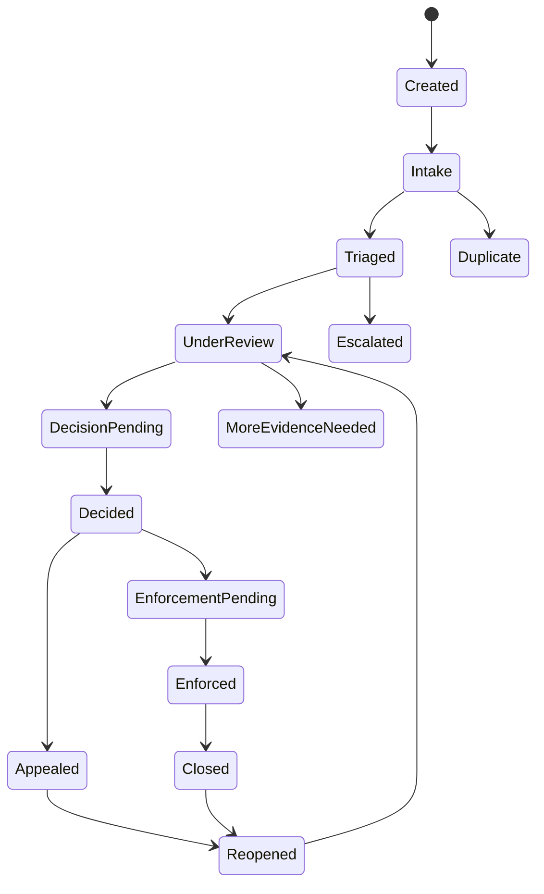

# Moderation and Safety（治理与安全系统）

> Status: V1  
> Category: Social  
> Path: `design/systems/social/moderation-and-safety.md`  
> Owner: TBD  
> Reviewers: Trust and Safety / Product / Legal / Privacy / Security / Engineering / UX / Data / Support / Accessibility / Live Operations  
> Last Updated: 2026-07-11  
> Version: 1.0  
> Risk Level: Critical  
> Dependencies: Social and Multiplayer, Matchmaking and Competition, Notification and Reminders, Settings and Preferences, Save and Persistence, Account and Identity, Privacy and Security  
> Affected Systems: Objectives and Quests, Reward System, Entitlement and Ownership, Live Operations, Analytics and Telemetry, Experiment Management, Support

---

## 1. System Summary

Moderation and Safety 系统负责定义：

```text
什么行为、内容和互动被允许；
玩家如何举报、屏蔽、静音和寻求帮助；
系统如何收集和保护证据；
举报如何被分类、排序、审核和裁决；
处罚如何生效、升级、到期、撤销和申诉；
文本、语音、用户名、UGC、社交、多人和竞争内容如何治理；
儿童、脆弱用户和高风险事件如何获得额外保护；
误判如何恢复；
安全系统如何在隐私、可访问性、公平与运营效率之间取得平衡。
```

该系统通常覆盖：

- Community Rules；
- Code of Conduct；
- Report；
- Block；
- Mute；
- Content Filter；
- Text Moderation；
- Voice Moderation；
- Display Name Moderation；
- User-Generated Content Moderation；
- Harassment；
- Hate and Abuse；
- Sexual Content；
- Threats；
- Self-Harm Concern；
- Fraud；
- Scam；
- Spam；
- Cheating Reports；
- Exploit Reports；
- Child Safety；
- Grooming Risk；
- Enforcement；
- Warning；
- Restriction；
- Suspension；
- Ban；
- Content Removal；
- Match Restriction；
- Chat Restriction；
- Appeal；
- Evidence；
- Audit；
- Safety Incident；
- Law Enforcement and Legal Requests；
- Transparency Reporting。

健康的治理与安全系统应让玩家感受到：

```text
我可以安全地控制互动；
举报不是黑箱；
屏蔽和静音会真实生效；
严重行为会被及时处理；
处罚有清楚理由和申诉路径；
误判可以恢复；
系统不会为了增长而忽视伤害；
安全措施不会无差别侵害隐私或可访问性。
```

---

## 2. Purpose

### 2.1 Player Value

该系统帮助玩家：

- 减少骚扰；
- 控制陌生人互动；
- 屏蔽不希望接触的人；
- 举报有害行为和内容；
- 获知举报是否被接收；
- 理解自己为何受到限制；
- 对错误处罚提出申诉；
- 在高风险事件中获得帮助；
- 保护儿童和家庭成员；
- 继续参与社交与多人体验，而不必完全退出产品。

### 2.2 Experience Contribution

治理与安全直接影响：

- 信任；
- 社区质量；
- 留存；
- 社交参与；
- 心理安全；
- 竞争公平；
- 家庭接受度；
- 口碑；
- 法律风险；
- Support 成本。

不健康的系统会造成：

- 举报无反馈；
- 处罚不一致；
- 屏蔽失效；
- 恶意举报；
- 误判；
- 语音骚扰；
- 儿童暴露于高风险互动；
- 作弊和欺诈扩散；
- 受害者承担证明负担；
- 高价值玩家获得特殊豁免；
- 审核员过度暴露于有害内容；
- 安全工具不可访问；
- 平台与产品层规则冲突。

### 2.3 Product Value

统一治理系统可以：

- 统一行为政策；
- 统一报告分类；
- 统一证据和审计；
- 统一处罚梯度；
- 支持自动检测与人工复核；
- 支持跨平台 Block 和 Restriction；
- 支持儿童保护；
- 支持法律与隐私要求；
- 支持申诉和恢复；
- 支持透明度报告；
- 降低不同玩法自行处罚的风险；
- 建立可持续的安全运营。

### 2.4 Why This System Exists

如果每个功能独立处理安全问题，常见结果是：

```text
聊天系统只做静音；
匹配系统只做踢出；
名称系统只做关键词过滤；
举报入口没有统一 Case；
同一行为在不同模式处罚不同；
自动检测直接处罚但无证据链；
Block 只隐藏 UI，不阻止匹配；
平台举报和产品举报互不相通；
申诉无法关联原处罚；
儿童规则只在客户端；
审核员无法查看完整上下文；
旧处罚在账户迁移后丢失。
```

统一系统用于确保：

- Policy 一致；
- Case 唯一；
- Evidence 可追踪；
- Enforcement 权威；
- Appeal 可审计；
- Safety State 跨系统一致；
- 高风险例外受治理。

---

## 3. Non-Goals

该系统不负责：

- 保证所有伤害完全消失；
- 替代现实世界紧急服务；
- 自动判断所有复杂语境；
- 以安全为由无限收集数据；
- 将所有负面体验都视为违规；
- 代替正常游戏设计和匹配设计；
- 代替网络安全团队处理全部技术攻击；
- 通过惩罚解决全部社区文化问题；
- 让举报成为报复工具；
- 让高付费、高排名或知名玩家获得豁免；
- 将儿童安全责任完全转移给家长；
- 在无证据或无申诉情况下永久处罚；
- 公开披露个人处罚细节；
- 将自动化模型输出直接当作最终事实。

---

## 4. Governing Principles

### 4.1 Player First Design

参考：

- `../../philosophy/foundation/player-first-design.md`

应用原则：

- 安全工具容易找到；
- 报告流程短且清楚；
- Block 和 Mute 立即生效；
- 受害者不承担不必要重复叙述；
- 高风险事件先保护玩家，再进行后续分析。

### 4.2 Clarity and Feedback

参考：

- `../../philosophy/experience/clarity-and-feedback.md`

应用原则：

- Community Rules 可理解；
- 报告状态可见；
- 处罚类别和期限清楚；
- 申诉结果可解释；
- 系统限制和玩家设置不混淆。

### 4.3 Challenge and Fairness

参考：

- `../../philosophy/experience/challenge-and-fairness.md`

应用原则：

- 竞争结果不被作弊破坏；
- 对相同行为应用一致标准；
- 队长、房主、主播和高段位玩家没有额外豁免；
- 自动检测考虑上下文和误判风险。

### 4.4 Accessibility and Inclusivity

参考：

- `../../philosophy/responsibility/accessibility-and-inclusivity.md`

应用原则：

- 报告和安全设置支持读屏、多输入和大字体；
- 不将非标准表达、辅助沟通或语言差异误判为恶意；
- 语音不是唯一证据；
- 内容过滤可以根据玩家需求调整。

### 4.5 Ethical Design

参考：

- `../../philosophy/responsibility/ethical-design.md`

应用原则：

- 数据最小化；
- 处罚可申诉；
- 自动化不应成为无法解释的黑箱；
- 儿童和脆弱用户获得额外保护；
- 审核员也需要安全和心理支持；
- 商业目标不能压过安全判断。

---

## 5. Player Experience

### 5.1 Player Goal

玩家使用该系统通常为了：

- 静音；
- 屏蔽；
- 举报；
- 查看规则；
- 查看处罚；
- 提交申诉；
- 查看举报状态；
- 调整过滤；
- 寻求帮助；
- 保护儿童账户；
- 退出有害互动；
- 恢复被误删内容或错误限制。

### 5.2 Entry

入口包括：

- 玩家 Profile；
- 最近玩家；
- Chat；
- Voice；
- Party；
- Match；
- Room；
- UGC；
- Leaderboard；
- Inbox；
- Notification；
- Account；
- Family Settings；
- Help Center；
- Enforcement Notice；
- Match History；
- Security Center。

### 5.3 Main Actions

玩家可以：

- Mute；
- Block；
- Report；
- Select Reason；
- Add Context；
- Submit Evidence；
- Leave；
- Hide Content；
- Appeal；
- View Status；
- Adjust Filter；
- Review Rules；
- Manage Child Safety；
- Contact Support；
- Emergency Exit。

### 5.4 Core Decisions

关键决策包括：

- 是否立即 Block；
- 是否举报；
- 举报什么类别；
- 是否附加上下文；
- 是否允许平台共享证据；
- 是否申诉；
- 是否改变公开和通信设置；
- 是否退出当前多人内容；
- 是否启用更严格过滤；
- 是否由家长批准互动。

### 5.5 Success

健康体验意味着：

- 安全工具可快速使用；
- Block 和 Mute 立即生效；
- 举报流程不会二次伤害；
- 严重事件得到优先处理；
- 处罚跨系统真实生效；
- 申诉有明确入口；
- 玩家不会被要求反复上传相同证据；
- 儿童和家庭限制无法轻易绕过；
- 误判后状态和资产可恢复。

### 5.6 Failure

失败包括：

- Block 失效；
- 报告未进入 Case；
- 证据丢失；
- 恶意举报；
- 自动误判；
- 审核延迟；
- 处罚未生效；
- 处罚范围错误；
- 申诉无响应；
- 语音证据泄露；
- 儿童限制被绕过；
- 受害者仍被匹配到同一对象；
- 多设备处罚状态不同。

---

## 6. System Boundary

### 6.1 Inputs

系统接收：

- Player Report；
- Automated Detection Signal；
- Chat Content；
- Voice Signal；
- Display Name；
- UGC Content；
- Match and Session Context；
- Social Relationship；
- Account and Age State；
- Platform Enforcement；
- Security Signal；
- Anti-Cheat Signal；
- Payment / Fraud Signal；
- Appeal；
- Legal Request；
- Support Escalation；
- Privacy and Retention Policy；
- Region；
- Version；
- Existing Enforcement History。

### 6.2 Outputs

系统产生：

- Safety Case；
- Evidence Record；
- Risk Score；
- Review Queue Entry；
- Moderation Decision；
- Enforcement；
- Restriction；
- Content Action；
- Account Action；
- Communication Action；
- Matchmaking Action；
- Appeal Result；
- Safety Notification；
- Transparency Aggregate；
- Audit Record；
- Recovery Action。

### 6.3 Owned State

系统拥有：

- Policy Definition；
- Report Definition；
- Safety Case；
- Evidence Metadata；
- Review State；
- Decision State；
- Enforcement State；
- Restriction State；
- Appeal State；
- Safety Incident State；
- Moderator Assignment；
- Audit History；
- Transparency Classification；
- Moderation Version。

### 6.4 Read-Only Dependencies

系统读取：

- Account；
- Social；
- Matchmaking；
- Session；
- Notification；
- Save；
- Privacy；
- Platform；
- Security；
- Entitlement；
- Time；
- Region；
- Live Operations。

### 6.5 Write Dependencies

系统通过正式契约请求：

- Social 应用 Block、Mute 和 Interaction Restriction；
- Matchmaking 应用 Queue Restriction 和 Avoid；
- Session 应用 Kick、Remove、Chat Restriction；
- Account 应用 Suspension、Ban 和 Age Policy；
- Notification 发送处罚和申诉结果；
- Content 移除或隐藏 UGC；
- Save 持久化安全状态；
- Support 创建 Case 和恢复；
- Analytics 记录聚合安全指标。

### 6.6 Out of Scope

系统不直接：

- 修改资源余额；
- 发放奖励；
- 计算 Rating；
- 处理支付退款；
- 替代紧急服务；
- 绕过法律和隐私要求；
- 公开披露受害者或被处罚者隐私；
- 让普通玩家直接执行处罚。

---

## 7. Core Entities and Concepts

| Entity / Concept | Definition | Owner | Lifetime | Notes |
|---|---|---|---|---|
| Policy | 行为和内容规则 | Trust and Safety | 版本级 | 可公开与内部细化 |
| Report Definition | 举报类别和字段 | Moderation | 版本级 | 统一 ID |
| Safety Case | 一次可追踪的治理案件 | Moderation | 至归档 | 唯一 Case ID |
| Reporter | 举报者 | Account | Case 期 | 身份受保护 |
| Subject | 被举报对象 | Account / Content | Case 期 | 玩家或内容 |
| Evidence | 支持 Case 的证据 | Moderation | 政策期 | 受访问控制 |
| Signal | 自动或系统检测线索 | Moderation | Case 期 | 不等于事实 |
| Review Queue | 待审核案件集合 | Moderation | 动态 | 有优先级 |
| Decision | 对 Case 的裁决 | Moderation | 长期 | 可申诉 |
| Enforcement | 实际处罚或限制 | Moderation / Account | 有期限或长期 | 跨系统生效 |
| Restriction | 对特定功能的限制 | Moderation | 期限级 | Chat / Queue 等 |
| Appeal | 对 Decision 的复核请求 | Moderation / Support | 至解决 | 可审计 |
| Moderator | 具备权限的审核者 | Trust and Safety | 工作期 | 最小权限 |
| Safety Incident | 大规模或高风险事件 | Safety Operations | 事故期 | 有 SEV |
| Transparency Record | 用于聚合公开报告的数据 | Moderation | 政策期 | 去标识化 |
| Recovery Action | 对误判或事故的恢复操作 | Moderation / Support | 事件期 | 可审计 |

---

## 8. Policy Taxonomy

### 8.1 Harassment

- 反复骚扰；
- 定向辱骂；
- 跟踪；
- 威胁；
- 恶意邀请；
- 恶意 Ping；
- 群体围攻。

### 8.2 Hate and Dehumanization

针对受保护或脆弱群体的：

- 仇恨；
- 贬低；
- 非人化；
- 排斥；
- 暴力赞美。

### 8.3 Sexual Content and Conduct

- 不当性内容；
- 非自愿性表达；
- 性骚扰；
- 涉及未成年人的性内容或诱导；
- 不当语音和 UGC。

### 8.4 Threats and Violence

- 现实暴力威胁；
- 人肉；
- 威胁性泄露；
- 组织伤害。

### 8.5 Self-Harm Concern

- 明确自伤意图；
- 鼓励自伤；
- 危机信号；
- 高风险求助。

### 8.6 Fraud and Scam

- 账号诈骗；
- 交易诈骗；
- 钓鱼；
- 冒充官方；
- 虚假赠品；
- 外部支付引导。

### 8.7 Spam and Manipulation

- 重复消息；
- 广告；
- Bot；
- 恶意邀请；
- 关注操纵；
- 虚假参与。

### 8.8 Cheating and Exploitation

- 作弊；
- Exploit；
- Win Trading；
- Boosting；
- Botting；
- Account Sharing；
- Result Manipulation。

### 8.9 Inappropriate Identity and UGC

- Display Name；
- Avatar；
- Banner；
- Room Name；
- Custom Text；
- Image；
- Map；
- Mod；
- Voice Clip。

### 8.10 Child Safety

- Grooming；
- 未成年人性化；
- 年龄规避；
- 私下诱导；
- 联系信息索取；
- 不当礼物和交易；
- 平台外迁移。

---

## 9. Policy Definition Template

```markdown
## Policy Definition

- Policy ID:
- Public Name:
- Internal Category:
- Scope:
- Prohibited Conduct:
- Allowed Context:
- Severity Levels:
- Evidence Requirements:
- Automated Detection:
- Human Review:
- Default Enforcement:
- Escalation:
- Appeal:
- Retention:
- Legal / Region Notes:
- Version:
- Owner:
```

### 9.1 必须回答

- 哪些行为禁止；
- 哪些上下文例外；
- 严重程度；
- 需要什么证据；
- 是否允许自动处理；
- 是否必须人工复核；
- 默认处罚；
- 是否需要紧急升级；
- 如何申诉；
- 不同地区是否有差异。

---

## 10. Report Taxonomy

### 10.1 Player Behavior Report

针对玩家行为。

### 10.2 Communication Report

针对：

- Text；
- Voice；
- Ping；
- Emote；
- Direct Message。

### 10.3 Content Report

针对：

- Name；
- Avatar；
- UGC；
- Room；
- Profile；
- Image；
- Map。

### 10.4 Cheating Report

针对作弊和 Exploit。

### 10.5 Fraud Report

针对诈骗和冒充。

### 10.6 Child Safety Report

高优先级专项入口。

### 10.7 Self-Harm Concern Report

用于高风险关切，不等同普通违规举报。

### 10.8 System Safety Report

例如：

- Block 失效；
- 隐私泄露；
- 匹配到被屏蔽对象；
- 处罚绕过。

---

## 11. Report Definition Template

```markdown
## Report Definition

- Report ID:
- Category:
- Available Entry Points:
- Subject Type:
- Required Fields:
- Optional Context:
- Auto-Attached Evidence:
- Reporter Protection:
- Rate Limit:
- Duplicate Handling:
- Priority:
- Emergency Escalation:
- Confirmation:
- Status Visibility:
- Retention:
- Owner:
```

---

## 12. Report Flow

```text
Open Report
→ Select Subject
→ Select Category
→ Add Optional Context
→ Preview Attached Evidence
→ Submit
→ Case Created
→ Confirmation
→ Review
→ Decision
→ Reporter Feedback
```

### 12.1 Report Experience Principles

- 尽量短；
- 不要求重复叙述；
- 类别使用普通语言；
- 支持稍后补充；
- 说明自动附加什么数据；
- 允许立即 Block / Mute；
- 退出后保持安全状态。

### 12.2 No Mandatory Confrontation

举报不应要求玩家先与对方沟通。

---

## 13. Safety Case Lifecycle

```text
Created
→ Intake
→ Triaged
→ Under Review
→ Decision Pending
→ Decided
→ Enforcement Pending
→ Enforced
→ Closed
```

异常和复核：

```text
Created
→ Duplicate
Triaged
→ Escalated
Under Review
→ More Evidence Needed
Decided
→ Appealed
Appealed
→ Reopened
Closed
→ Reopened by New Evidence
```



---

## 14. Case State Definitions

### 14.1 Created

Case ID 已生成。

### 14.2 Intake

验证基本完整性和权限。

### 14.3 Triaged

确定类别、优先级和路由。

### 14.4 Duplicate

与现有 Case 合并。

### 14.5 Under Review

正在审核。

### 14.6 More Evidence Needed

需要系统补充证据，不应默认要求受害者反复提交。

### 14.7 Decision Pending

证据收集完成，等待裁决。

### 14.8 Decided

已形成裁决。

### 14.9 Enforcement Pending

等待跨系统执行。

### 14.10 Enforced

处罚已确认生效。

### 14.11 Closed

Case 完成。

### 14.12 Appealed

进入申诉。

### 14.13 Reopened

因新证据或申诉重新审核。

---

## 15. Safety Invariants

1. Report 提交必须幂等。
2. 同一事件的重复报告应合并，而不是重复处罚。
3. 自动检测 Signal 不等于最终事实。
4. 永久或高影响处罚通常需要更高证据和复核标准。
5. Block 和 Mute 不应等待 Case 审核才能生效。
6. Enforcement 必须由权威系统确认。
7. Appeal 不能由原决定者在无监督下独自终审。
8. 已撤销处罚不能因旧缓存重新生效。
9. 删除账户不应删除必要的安全和法定审计，但必须遵守最小化和保留政策。
10. Analytics 失败不影响安全保护和处罚执行。
11. Reporter 身份不应向 Subject 暴露。
12. Child Safety 和可信现实威胁必须走专项升级流程。
13. 误判恢复必须覆盖跨系统状态。
14. 高付费、高排名或内部身份不影响政策标准。
15. 安全工具不能被普通玩法脚本关闭。

---

## 16. Triage

### 16.1 Triage Inputs

- Report Category；
- Subject Type；
- Evidence；
- Severity；
- Immediacy；
- Repetition；
- Child Risk；
- Real-World Risk；
- Account History；
- Platform；
- Region；
- Language；
- Reporter Safety；
- Automated Signals。

### 16.2 Triage Outputs

- Priority；
- Queue；
- Reviewer Skill；
- SLA；
- Temporary Protection；
- Escalation；
- Required Evidence；
- Legal / Safety Referral。

### 16.3 Priority Model

#### P0 — Immediate Safety Risk

- 可信现实威胁；
- 儿童紧急风险；
- 大规模隐私泄露；
- 严重安全事件。

#### P1 — Severe Harm

- 严重骚扰；
- 仇恨；
- 性骚扰；
- 重大诈骗；
- 作弊破坏大规模竞争。

#### P2 — Standard Harm

- 一般骚扰；
- 不当内容；
- Spam；
- 名称违规；
- 邀请滥用。

#### P3 — Low Risk / Informational

- 低影响问题；
- 单次轻微行为；
- 无足够证据但需观察。

### 16.4 Priority Is Not Popularity

高影响力玩家或高曝光事件可提高运营关注，但不能改变证据和处罚标准。

---

## 17. Evidence Model

### 17.1 Evidence Types

- Text Message；
- Voice Clip；
- Chat Metadata；
- Session Event；
- Match Result；
- Invite History；
- Block History；
- UGC Snapshot；
- Display Name Snapshot；
- Platform Report；
- Account Linkage；
- Device / Security Signal；
- Screenshot；
- Player Statement；
- Moderator Observation。

### 17.2 Evidence Metadata

- Evidence ID；
- Source；
- Created At；
- Collected At；
- Subject；
- Case；
- Version；
- Hash；
- Access Level；
- Retention；
- Redaction；
- Integrity；
- Legal Hold。

### 17.3 Evidence Integrity

需要：

- Hash；
- Chain of Custody；
- Access Log；
- Version；
- Tamper Detection；
- Source Verification。

### 17.4 Evidence Minimization

只收集完成审核所需数据。

### 17.5 Context

单条消息可能不足。

审核应考虑：

- 前后文；
- 持续性；
- 目标对象；
- 语气；
- 语言；
- 玩笑与威胁差异；
- 权力关系；
- 平台上下文。

---

## 18. Player-Provided Evidence

### 18.1 Attachments

可以支持：

- Screenshot；
- Clip；
- Text Context；
- External Reference（谨慎）。

### 18.2 Risks

- 伪造；
- 篡改；
- 隐私泄露；
- 外部恶意文件；
- 无关敏感信息。

### 18.3 Handling

- 病毒扫描；
- 格式限制；
- 去除元数据；
- 最小访问；
- 不自动公开；
- 与系统证据交叉验证。

### 18.4 Burden Reduction

玩家提供证据应是可选补充，而不是系统拒绝自动收集可用上下文的理由。

---

## 19. Automated Detection

### 19.1 Suitable Uses

- Spam；
- 已知诈骗链接；
- 明确禁词；
- Bot 行为；
- 作弊信号；
- 重复邀请；
- 高风险儿童安全信号；
- 大规模异常；
- 已知恶意文件。

### 19.2 Caution Areas

- 讽刺；
- 方言；
- 多语言；
- 语境；
- 引用；
- 自我描述；
- 辅助沟通；
- 身份相关词汇；
- 音频噪声。

### 19.3 Detection Output

应输出：

- Signal；
- Confidence；
- Category；
- Model Version；
- Features；
- Context；
- Recommended Action。

不应直接输出：

```text
Guilty = True
```

### 19.4 Thresholds

不同动作需要不同阈值：

- 降低曝光；
- 临时隔离；
- 人工审核；
- 立即阻止；
- 永久处罚。

### 19.5 Model Governance

记录：

- 训练范围；
- 语言覆盖；
- 偏差；
- 版本；
- 评估；
- 申诉；
- 回滚；
- 监控。

---

## 20. Human Review

### 20.1 Reviewer Skills

根据：

- 语言；
- 政策；
- 儿童安全；
- 欺诈；
- 作弊；
- 语音；
- 地区法律；

分配。

### 20.2 Least Privilege

审核员只访问处理 Case 所需数据。

### 20.3 Reviewer Safety

提供：

- 内容模糊；
- 警告；
- 音频静音；
- 图像预览控制；
- 工作轮换；
- 心理支持；
- 暴露限制；
- 升级退出。

### 20.4 Quality Assurance

- 抽样复核；
- 一致性测试；
- 双人复核；
- 高风险审批；
- 误判分析；
- 政策更新培训。

### 20.5 Reviewer Conflict

避免：

- 审核自己相关 Case；
- 无监督高风险处罚；
- 绩效只看处理量；
- 过度自动化压力。

---

## 21. Decision Model

### 21.1 Possible Decisions

- No Violation；
- Insufficient Evidence；
- Informational Warning；
- Content Hidden；
- Content Removed；
- Feature Restricted；
- Communication Restricted；
- Queue Restricted；
- Match Invalidated；
- Reward Held；
- Temporary Suspension；
- Permanent Ban；
- Escalated；
- Referred；
- Safety Outreach。

### 21.2 Decision Fields

- Decision ID；
- Case ID；
- Policy；
- Severity；
- Evidence Summary；
- Confidence；
- Enforcement；
- Duration；
- Scope；
- Effective At；
- Expiry；
- Appeal Eligibility；
- Reviewer；
- Approval；
- Version。

### 21.3 Standard of Evidence

应按动作风险提高要求。

例如：

```text
隐藏可疑 UGC
需要的标准
低于
永久封禁账户。
```

### 21.4 Consistency

相似 Case 应有一致结果，同时允许上下文差异。

---

## 22. Enforcement Taxonomy

### 22.1 Informational Warning

教育性提醒。

### 22.2 Content Action

- Hide；
- Remove；
- Age Gate；
- De-index；
- Disable Sharing；
- Quarantine。

### 22.3 Communication Restriction

- Text Mute；
- Voice Mute；
- Direct Message Restriction；
- Invite Restriction；
- Ping Restriction。

### 22.4 Social Restriction

- Friend Request Restriction；
- Join Restriction；
- Public Room Restriction；
- Presence Restriction。

### 22.5 Matchmaking Restriction

- Queue Cooldown；
- Low Priority；
- Ranked Restriction；
- Competitive Suspension；
- Tournament Ban。

### 22.6 Account Restriction

- Temporary Suspension；
- Feature Lock；
- Account Lock；
- Permanent Ban。

### 22.7 Asset and Transaction Hold

用于：

- Fraud；
- Chargeback；
- Exploit；
- 作弊调查。

必须有严格边界和复核。

### 22.8 Protective Restriction

对潜在受害者或儿童账户采取：

- 限制陌生人互动；
- 关闭公开通信；
- 安全检查；
- 家长通知。

不应被表达为处罚。

---

## 23. Enforcement Ladder

示例：

```text
Education
→ Warning
→ Temporary Feature Restriction
→ Temporary Account Suspension
→ Long Suspension
→ Permanent Ban
```

但不应机械套用。

严重行为可以直接进入高等级。

### 23.1 Factors

- 严重程度；
- 伤害；
- 意图；
- 目标；
- 重复；
- 历史；
- 规避；
- 现实风险；
- 儿童风险；
- 影响范围。

### 23.2 No Pay-to-Clear

处罚不能通过付费直接解除。

### 23.3 No Revenue Exception

高消费玩家不能获得更轻处罚。

---

## 24. Enforcement Lifecycle

```text
Proposed
→ Validated
→ Approved
→ Applying
→ Active
→ Expired
→ Closed
```

异常：

```text
Applying
→ Failed
Active
→ Appealed
Appealed
→ Stayed
Appealed
→ Modified
Appealed
→ Revoked
Active
→ Escalated
```

### 24.1 Applying

跨系统执行：

- Account；
- Social；
- Matchmaking；
- Chat；
- Voice；
- UGC；
- Notification；
- Reward Hold。

### 24.2 Active

限制已经生效。

### 24.3 Expired

期限结束。

### 24.4 Revoked

因误判或申诉撤销。

### 24.5 Modified

改变范围或时长。

---

## 25. Enforcement Invariants

1. Enforcement 必须有唯一 ID。
2. 同一 Decision 的重试不能重复叠加处罚。
3. Active 状态必须由所有相关系统确认。
4. Expiry 使用权威时间。
5. Appeal 不一定自动暂停低风险处罚，但高风险场景需政策明确。
6. Revoked 后相关系统必须清理限制。
7. 永久处罚必须有更高审批标准。
8. 临时限制到期后不得依赖客户端自行解除。
9. Enforcement 不能静默改变玩家资产，除非政策、法律或安全明确要求。
10. 处罚信息只展示必要详情，避免泄露 Reporter。
11. 多设备和跨平台必须一致。
12. 错误 Enforcement 的恢复必须可审计。

---

## 26. Warning

### 26.1 Purpose

用于：

- 教育；
- 提醒规则；
- 低严重度首次行为；
- 边界不清行为。

### 26.2 Good Warning

包含：

- 哪类行为有问题；
- 哪项规则；
- 下次如何避免；
- 是否有功能限制；
- 是否可申诉。

### 26.3 Avoid Shame

不使用羞辱或公开展示。

### 26.4 Acknowledgment

可以要求确认，但不能伪装为承认犯罪或放弃申诉。

---

## 27. Communication Restriction

### 27.1 Scope

- Channel；
- Audience；
- Duration；
- Platform；
- Public / Private；
- Voice / Text / Ping。

### 27.2 Player Feedback

明确：

- 哪些功能不能用；
- 何时恢复；
- 仍可使用什么；
- 如何申诉。

### 27.3 Team Play

若通信限制影响核心协作，应提供：

- 系统 Ping；
- 安全 Quick Chat；
- 非自由文本。

---

## 28. Queue and Competition Restriction

### 28.1 Use Cases

- Cheating；
- Leaver；
- Win Trading；
- Boosting；
- Harassment；
- Tournament Violation。

### 28.2 Scope

- Casual；
- Ranked；
- Tournament；
- Specific Mode；
- Global Matchmaking。

### 28.3 Match Integrity

处罚不能修改已经合法完成的结果，除非有明确的 Result Correction 流程。

### 28.4 Recovery

期限结束后重新验证资格。

---

## 29. Suspension and Ban

### 29.1 Temporary Suspension

账户暂时无法使用部分或全部功能。

### 29.2 Permanent Ban

长期或永久禁止。

### 29.3 Requirements

高影响处罚需要：

- 证据；
- 政策匹配；
- 复核；
- 审批；
- 通知；
- 申诉；
- 审计。

### 29.4 Ban Evasion

检测：

- 关联账户；
- 设备；
- 支付；
- 行为；
- 身份；
- 平台。

需要兼顾误判和家庭共享。

### 29.5 New Account

不得因为共享设备就自动处罚无关用户。

---

## 30. Content Moderation

### 30.1 Content Types

- Display Name；
- Profile；
- Avatar；
- Banner；
- Room Name；
- Guild Name；
- Text；
- Image；
- Audio；
- Video；
- Map；
- Mod；
- Custom Level；
- Stream；
- Replay Annotation。

### 30.2 Content Lifecycle

```text
Created
→ Scanned
→ Published
→ Reported
→ Reviewed
→ Kept / Restricted / Removed
→ Appealed
→ Restored / Finalized
```

### 30.3 Pre-Moderation vs Post-Moderation

- Pre：发布前审核；
- Post：发布后检测和举报；
- Hybrid：高风险类别预审，普通内容后审。

### 30.4 Content Snapshot

处罚时保留必要版本，防止内容被修改后逃避审核。

---

## 31. Display Name Moderation

### 31.1 Checks

- 禁止词；
- 规避写法；
- 冒充；
- 个人信息；
- 威胁；
- 性内容；
- Hate；
- Scam；
- Official Impersonation。

### 31.2 False Positives

注意：

- 多语言；
- 姓名；
- 方言；
- 身份词；
- 音译；
- 合法文化表达。

### 31.3 Enforcement

可以：

- 阻止创建；
- 要求修改；
- 临时自动名称；
- 限制改名；
- 人工复核。

### 31.4 History

保留名称变化用于反冒充和 Case 审计。

---

## 32. Text Moderation

### 32.1 Layers

- Client Display Filter；
- Server Filter；
- Rate Limit；
- Link Filter；
- Automated Signal；
- User Mute；
- User Block；
- Human Review。

### 32.2 Filter Modes

- Off（在允许地区和年龄下）；
- Standard；
- Strict；
- Custom；
- Child Safe。

### 32.3 Mask vs Block

- Mask：隐藏部分文本；
- Block：不发送；
- Warn：提示重新编辑；
- Review：发送但进入审核；
- Restrict：限制账户。

### 32.4 Context

单词匹配不能替代上下文判断。

### 32.5 Private Message

私信仍受政策约束，但访问和保留需要更严格隐私控制。

---

## 33. Voice Moderation

### 33.1 Safety Controls

- Mute；
- Block；
- Per-Player Volume；
- Voice Indicator；
- Push-to-Talk；
- Reporting；
- Transcription（如支持）；
- Short Buffer（如政策允许）。

### 33.2 Recording and Buffering

必须明确：

- 是否录音；
- 是否只在举报时提交短缓冲；
- 是否本地处理；
- 保留多久；
- 谁可访问；
- 儿童规则；
- 地区差异。

### 33.3 Automated Voice Detection

风险高，需要：

- 语言覆盖；
- 噪声鲁棒；
- 人工复核；
- 误判分析；
- 明确同意和政策；
- 不直接永久处罚。

### 33.4 Accessibility

言语障碍、合成语音、辅助设备和口音不能被轻率误判。

---

## 34. UGC Moderation

### 34.1 Risk Levels

- Low：文本标签；
- Medium：图像、房间和地图；
- High：自由视频、直播、音频和开放脚本。

### 34.2 Publishing Controls

- Age Gate；
- Trust Level；
- Rate Limit；
- Pre-Review；
- Visibility Limit；
- Watermark；
- Report；
- Version Snapshot。

### 34.3 Creator Enforcement

可以区分：

- 内容违规；
- 创作者行为；
- 重复违规；
- 恶意规避；
- 非故意错误。

### 34.4 Subscriber Protection

内容被移除时，处理：

- 收藏；
- 购买；
- 推荐；
- 分享；
- 任务；
- 奖励；
- 存档引用。

---

## 35. Spam and Abuse Prevention

### 35.1 Surfaces

- Friend Request；
- Invite；
- Chat；
- Voice；
- Ping；
- Report；
- UGC Upload；
- Room Creation；
- Guild Invite；
- Commercial Link。

### 35.2 Controls

- Rate Limit；
- Cooldown；
- Reputation；
- Trust Level；
- CAPTCHA；
- Verification；
- Progressive Friction；
- Shadow Review；
- Duplicate Detection。

### 35.3 Avoid Blanket Friction

对所有玩家增加高摩擦不一定合理。

### 35.4 Report Abuse

举报系统也需要：

- 频率限制；
- 恶意模式检测；
- 不因高频自动忽略真实受害者；
- 不轻易处罚合理多次举报。

---

## 36. Cheating and Exploit Reports

### 36.1 Evidence

- Server Logs；
- Anti-Cheat；
- Replay；
- Input；
- Result；
- Build；
- Network；
- Match Context；
- Player Report。

### 36.2 Separation

作弊调查与普通语言审核可能需要不同团队和工具。

### 36.3 Immediate Actions

高风险时可以：

- 暂缓奖励；
- 标记 Match Integrity；
- 限制 Ranked；
- 隔离 Queue；
- 禁用 Exploit 内容。

### 36.4 Result Correction

由 Matchmaking and Competition 的统一流程执行。

---

## 37. Fraud and Scam

### 37.1 Common Risks

- 冒充官方；
- 虚假赠品；
- 账号交易；
- 外部支付；
- 钓鱼链接；
- 退款欺诈；
- 盗号；
- 资产转移。

### 37.2 Protective Actions

- Link Block；
- Warning；
- Account Lock；
- Transaction Hold；
- Recipient Protection；
- Session Restriction；
- Security Notification。

### 37.3 Victim Support

提供：

- 账号保护；
- 交易调查；
- 恢复；
- 教育；
- Support；
- 不责备受害者。

---

## 38. Harassment Protection

### 38.1 Immediate Tools

- Mute；
- Block；
- Leave；
- Hide；
- Report；
- Do Not Disturb；
- Invite Restriction；
- Private Session。

### 38.2 Repeat Targeting

系统应识别：

- 多账号骚扰；
- 重复邀请；
- 跟踪同一玩家；
- Room 追踪；
- Queue Sniping；
- 群体围攻。

### 38.3 Protective Matching

在安全允许范围内降低再次相遇概率。

### 38.4 No Burden Shift

不应只告诉受害者“关闭社交功能”。

---

## 39. Hate and Abuse

### 39.1 Context

审核需要考虑：

- 目标群体；
- 直接性；
- 重复；
- 暴力；
- 去人化；
- 讽刺；
- 引用；
- 自我认同语境；
- 教育语境。

### 39.2 Severity

高严重度包括：

- 现实威胁；
- 鼓励暴力；
- 组织性骚扰；
- 针对未成年人；
- 人肉和身份泄露。

### 39.3 Safety Response

可同时应用：

- 内容移除；
- 通信限制；
- 账号限制；
- 受害者保护；
- Evidence Hold；
- Legal Escalation。

---

## 40. Child Safety

### 40.1 Core Principles

- 最小公开；
- 陌生人互动受限；
- 语音和私信受控；
- 家长控制服务端执行；
- 高风险报告优先；
- 不要求儿童自行处理严重风险。

### 40.2 Risk Signals

- 年龄规避；
- 引导平台外联系；
- 索取个人信息；
- 性化语言；
- 礼物交换；
- 长期私下接触；
- 权力操纵；
- 秘密要求。

### 40.3 Response

- 立即保护；
- 限制互动；
- 保留证据；
- 专项审核；
- 家长或监护流程；
- 法律要求下的报告；
- 不向潜在施害者透露 Reporter。

### 40.4 Age Assurance

需要：

- 合法；
- 最小化；
- 不过度收集；
- 有纠错；
- 不把年龄推断作为绝对事实。

### 40.5 Child Appeal

儿童账户申诉可能需要监护协助，但不能因此失去基本申诉权。

---

## 41. Self-Harm Concern

### 41.1 Scope

用于识别可能的自伤或危机表达。

### 41.2 Response Principles

- 不公开；
- 不羞辱；
- 提供支持资源；
- 区分一般表达与紧急风险；
- 避免仅靠关键词自动升级；
- 不把危机信号用于商业画像。

### 41.3 Emergency Limit

产品不能替代专业和紧急服务。

### 41.4 Privacy

高度敏感，访问和保留需严格控制。

---

## 42. Real-World Threats and Doxxing

### 42.1 Signals

- 精确地址；
- 电话；
- 身份文件；
- 威胁；
- 跟踪；
- 人肉；
- 时间和地点；
- 暴力计划。

### 42.2 Immediate Actions

- 隐藏内容；
- 限制账户；
- 保护目标；
- 保留证据；
- 专项升级；
- 根据法律和政策处理。

### 42.3 False Reports

高风险不意味着跳过验证，但可以先采取可逆保护。

---

## 43. Safety Incident Management

### 43.1 Incident Types

- 大规模骚扰；
- Exploit Abuse；
- 数据泄露；
- 儿童安全事件；
- 语音系统故障；
- 误封大规模发生；
- Block 失效；
- UGC 有害内容扩散；
- 诈骗活动；
- 竞赛完整性危机。

### 43.2 Severity

#### SEV-1

即时重大伤害、法律或大规模安全风险。

#### SEV-2

高影响、多用户、需要快速协调。

#### SEV-3

局部问题，有替代和限制。

#### SEV-4

低影响配置或表现问题。

### 43.3 Incident Actions

- Kill Switch；
- Disable Surface；
- Freeze Publishing；
- Restrict Sharing；
- Disable Queue；
- Force Private；
- Apply Temporary Filter；
- Preserve Evidence；
- Notify；
- Support Escalation；
- Rollback；
- Recovery。

### 43.4 Safety First

事故期间优先：

1. 防止继续伤害；
2. 保护证据；
3. 保护受影响玩家；
4. 恢复安全功能；
5. 再恢复普通体验。

---

## 44. Temporary Protective Measures

### 44.1 Examples

- 临时静音；
- 临时隐藏；
- 临时 Queue Restriction；
- 临时关闭 UGC；
- 临时私密化；
- 临时锁定交易；
- 临时冻结奖励。

### 44.2 Requirements

- 可逆；
- 有时限；
- 有原因；
- 有复核；
- 不自动升级为永久处罚；
- 不超出必要范围。

---

## 45. Appeal

### 45.1 Appeal Eligibility

应说明：

- 哪些决定可申诉；
- 时间窗口；
- 次数；
- 所需信息；
- 处理时间；
- 是否暂停处罚。

### 45.2 Appeal Flow

```text
Appeal Submitted
→ Intake
→ Conflict Check
→ Independent Review
→ Decision
→ Enforcement Update
→ Notification
→ Closed
```

### 45.3 Independent Review

高影响申诉应由：

- 不同审核员；
- 或高级审核；
- 或跨职能小组；

处理。

### 45.4 Appeal Outcomes

- Upheld；
- Reduced；
- Modified；
- Revoked；
- Restored；
- Escalated；
- Insufficient New Evidence。

### 45.5 No Retaliation

申诉不应自动加重处罚，除非发现独立新违规。

---

## 46. Appeal Invariants

1. Appeal 使用原 Decision 和 Evidence 版本。
2. Appeal 不能删除原审计。
3. Reviewer Conflict 必须避免。
4. Revoked Enforcement 要跨系统清理。
5. 恢复包括功能、排名、内容、奖励和声誉的必要修正。
6. 申诉失败通知必须说明结果类别。
7. Appeal Analytics 不用于压低通过率。
8. 高风险自动处罚必须有人工申诉路径。

---

## 47. Recovery After Wrongful Enforcement

### 47.1 Recovery Scope

可能包括：

- 恢复账户；
- 恢复通信；
- 恢复 Queue；
- 恢复内容；
- 恢复 Rating；
- 恢复 Leaderboard；
- 恢复奖励；
- 恢复权益；
- 删除错误 Safety Label；
- 修正历史；
- 通知相关系统。

### 47.2 Compensation

如果误判造成实际损失，可以：

- 补偿资源；
- 延长活动；
- 恢复赛季资格；
- 提供 Support；
- 提供解释。

### 47.3 Do Not Hide Error

严重误判应透明说明类别和恢复结果。

---

## 48. Reporter Feedback

### 48.1 Confirmation

立即确认：

- 已收到；
- Case ID 或参考；
- Block / Mute 状态；
- 紧急帮助入口。

### 48.2 Status

可以显示：

- Received；
- Under Review；
- Action Taken；
- Closed。

### 48.3 Privacy Limit

通常不能披露：

- 具体处罚细节；
- 私人证据；
- Subject 账户信息。

### 48.4 Meaningful Feedback

“已采取适当行动”比完全无反馈更好，但应符合隐私。

---

## 49. Subject Notification

处罚通知应包含：

- 违反的政策类别；
- 行为或内容摘要；
- 处罚范围；
- 开始；
- 结束；
- 仍可使用什么；
- 如何申诉；
- 规则链接；
- 不暴露 Reporter。

### 49.1 Evidence Disclosure

根据法律、隐私和安全，只展示必要摘要。

### 49.2 No Public Shaming

处罚不应公开展示给其他玩家。

---

## 50. Policy Education

### 50.1 Community Rules

应：

- 简洁；
- 有示例；
- 本地化；
- 可访问；
- 版本化；
- 在需要时提示。

### 50.2 Contextual Education

在：

- 首次使用 Chat；
- 首次 UGC；
- 创建 Room；
- 参加 Ranked；
- 处罚后；

提供相关规则。

### 50.3 Avoid Rule Dump

不应在首登一次展示全部复杂政策。

---

## 51. Child and Family Controls

### 51.1 Controls

- 陌生人通信；
- 语音；
- 私信；
-好友；
-公共房；
-UGC；
-分享；
-直播；
-购买；
-时间；
-平台外链接。

### 51.2 Server Enforcement

不能只依赖客户端 UI。

### 51.3 Parent Notifications

需要：

- 明确同意；
- 不暴露不必要私人内容；
- 区分安全与普通行为；
- 避免过度监控。

---

## 52. Platform Coordination

### 52.1 Platform Reports

可能来自：

- Console；
- Store；
- OS；
- Voice Platform；
- Anti-Cheat Platform。

### 52.2 Mapping

需要映射：

- Platform Account；
- Social Identity；
- Product Account；
- Case；
- Enforcement。

### 52.3 Conflicting Enforcement

平台限制与产品限制取更严格有效结果，但要说明来源。

### 52.4 Appeal Boundary

玩家需要知道应向平台还是产品申诉。

---

## 53. Cross-Platform Safety

### 53.1 Block

产品层 Block 应尽量覆盖跨平台互动。

### 53.2 Voice and Text

平台服务和产品服务都需要同步限制。

### 53.3 Shared Account Risks

家庭共享和平台共享不能导致无关账户被自动处罚。

### 53.4 Cross-Region Policy

政策核心一致，但法律处理和内容限制可能因地区不同。

---

## 54. Moderator Tooling

### 54.1 Required Capabilities

- Case Timeline；
- Evidence Viewer；
- Context Viewer；
- Policy Reference；
- Decision Templates；
- Enforcement Preview；
- Conflict Check；
- Appeal History；
- Access Audit；
- Redaction；
- Escalation；
- Notes；
- QA Sampling。

### 54.2 Tool Safety

- 自动遮挡高风险内容；
- 默认最小暴露；
- 不允许批量永久处罚无审批；
- 高风险动作二次确认；
- 权限分层；
- 会话超时；
- 导出受限。

### 54.3 Productivity vs Quality

不应只优化处理数量。

---

## 55. Case Routing

### 55.1 Dimensions

- Policy；
- Severity；
- Language；
- Region；
- Child Safety；
- Fraud；
- Cheating；
- Voice；
- Legal；
- VIP / High Visibility（仅用于运营协调，不改变标准）。

### 55.2 SLA

不同优先级定义：

- 首次响应；
- 临时保护；
- 最终决定；
- 申诉；
- 通知。

### 55.3 Backlog Management

低优先级积压不能导致高风险案件被淹没。

---

## 56. Reviewer Quality

### 56.1 Metrics

- Agreement；
- Appeal Overturn；
- Escalation Accuracy；
- SLA；
- Evidence Completeness；
- Policy Consistency；
- False Positive；
- False Negative。

### 56.2 Avoid Bad Incentives

不要只看：

- Case 数量；
- 处罚率；
- 处理速度。

### 56.3 Calibration

定期：

- Blind Review；
- Policy Quiz；
- Group Calibration；
- Edge Case Review；
- Language Review。

---

## 57. Privacy and Data Governance

### 57.1 Data Categories

- Reports；
- Chat；
- Voice；
- UGC；
- Security Signals；
- Device Signals；
- Account History；
- Child Safety；
- Appeals；
- Moderator Notes。

### 57.2 Purpose Limitation

安全数据只用于：

- 审核；
- 保护；
- 执法；
- 申诉；
- 政策改进；
- 法律要求。

不应直接用于营销。

### 57.3 Retention

每类数据定义：

- 目的；
- 时长；
- Legal Hold；
- 删除；
- 匿名化；
- 访问。

### 57.4 Access

严格 RBAC 和审计。

### 57.5 Data Subject Requests

删除和导出需要：

- 保护 Reporter；
- 保护其他用户隐私；
- 保留必要执法和法律记录；
- 提供合法范围内的数据。

---

## 58. Security

### 58.1 Threats

- False Reports；
- Evidence Tampering；
- Moderator Account Compromise；
- Insider Abuse；
- Case Enumeration；
- Reporter Exposure；
- Ban Evasion；
- Appeal Spam；
- Tool Export Abuse；
- Voice Data Leakage；
- UGC Malware；
- Platform Identity Mismatch。

### 58.2 Controls

- Authentication；
- RBAC；
- MFA；
- Encryption；
- Signed Evidence；
- Audit；
- Rate Limit；
- Redaction；
- Environment Separation；
- Approval；
- Anomaly Detection；
- Incident Response。

### 58.3 Sensitive Operations

以下需要更高权限：

- Permanent Ban；
- Child Safety Case；
- Evidence Export；
- Legal Hold；
- Bulk Enforcement；
- Account Linkage；
- Moderator Override。

---

## 59. Abuse of Moderation Systems

### 59.1 Report Brigading

群体恶意举报。

### 59.2 Revenge Reporting

因比赛结果或拒绝社交而举报。

### 59.3 Appeal Spam

重复无新信息申诉。

### 59.4 Weaponized Block

通过大量 Block 试图操纵匹配或排名。

### 59.5 Controls

- Report Quality；
- Correlation；
- Duplicate Merge；
- Rate Limit；
- Reputation；
- Human Review；
- 不因数量直接判罪。

---

## 60. Safety and Matchmaking

### 60.1 Restrictions

Matchmaking 读取：

- Ranked Restriction；
- Avoid；
- Block；
- Tournament Ban；
- Low Priority；
- Behavior Pool；
- Child Policy。

### 60.2 Hidden Safety Details

匹配系统只读取所需状态，不读取完整 Case 内容。

### 60.3 Block vs Match Quality

Block 优先于普通质量目标，但超大规模 Block 需要防滥用策略。

### 60.4 Safety Pool

特殊池必须：

- 有明确政策；
- 有恢复；
- 不永久隐形隔离；
- 有申诉；
- 不与付费关联。

---

## 61. Safety and Social

### 61.1 Immediate Protection

Social 系统执行：

- Block；
- Mute；
- Invite Restriction；
- Join Restriction；
- Presence Restriction；
- Spectate Restriction；
- Direct Message Restriction。

### 61.2 Current Session

Block 后当前 Session 如何处理需定义：

- 立即隐藏；
- 静音；
- 不再组队；
- 下局不匹配；
- 严重时移除。

### 61.3 No Disclosure

不向对方透露谁进行了举报或 Block。

---

## 62. Safety and Notifications

### 62.1 Notification Types

- Report Received；
- Action Taken；
- Enforcement Notice；
- Appeal Result；
- Safety Alert；
- Account Protection；
- Child Safety；
- System Incident。

### 62.2 Privacy

锁屏不显示敏感 Case 内容。

### 62.3 Required vs Optional

安全和处罚通知通常为必要通知，但不能附带营销。

### 62.4 Notification Failure

必要通知失败时：

- Inbox；
- Email；
- Re-login Banner；
- Support；

作为恢复。

---

## 63. Safety and Rewards

### 63.1 Reward Hold

仅在：

- Fraud；
- Cheat；
- Match Integrity；
- Exploit；

明确场景下使用。

### 63.2 No Arbitrary Asset Removal

普通语言违规不应默认删除无关已购资产。

### 63.3 Result Correction

作弊影响的奖励修正由权威 Result 和 Reward 流程执行。

### 63.4 Wrongful Hold

误判撤销后恢复 Pending Reward。

---

## 64. Transparency

### 64.1 Internal Transparency

记录：

- Policy；
- Evidence；
- Decision；
- Enforcement；
- Appeal；
- Reviewer；
- Version；
- Timing。

### 64.2 Player Transparency

提供：

- 规则；
- 处罚类别；
- 期限；
- 申诉；
- 举报反馈。

### 64.3 Public Transparency

可以发布聚合：

- 报告数量；
- 处理量；
- 处罚类别；
- 申诉；
- 自动化比例；
- 儿童安全措施；
- 平均处理时间。

### 64.4 Privacy

不公开可识别个人数据。

---

## 65. Safety Metrics

### 65.1 Leading Indicators

- Block；
- Mute；
- Report；
- Spam；
- Repeated Contact；
- Harmful Content Exposure；
- Queue Avoidance；
- Child Safety Signals；
- Scam Links；
- Voice Incidents。

### 65.2 Outcome Indicators

- Repeat Harm；
- Report Resolution；
- Enforcement Success；
- Appeal Overturn；
- Block Enforcement；
- User Safety Sentiment；
- Retention after Harm；
- Support Escalation；
- Moderator Agreement。

### 65.3 Negative Incentives

不要以：

- 更高处罚率；
- 更低报告率；
- 更短处理时间；

单独作为成功。

报告下降可能意味着入口失效或失去信任。

---

## 66. Failure and Recovery

| Failure | Cause | Player Impact | Recovery | Data Guarantee |
|---|---|---|---|---|
| Report Submission Failed | 网络或服务 | 无法求助 | 本地暂存、重试、确认 | 不重复 Case |
| Duplicate Case | 多入口或重试 | 审核浪费或重复处罚 | Merge / Dedupe | 单一 Case |
| Evidence Missing | 日志或权限问题 | 无法判断 | 备份、上下文恢复、Insufficient Evidence | 不伪造证据 |
| Block Enforcement Failed | 缓存或跨平台错误 | 继续骚扰 | 权威刷新、临时隔离 | Block 状态保留 |
| Enforcement Partial Apply | 下游失败 | 部分功能仍可用 | 重试、回滚、升级 | Enforcement ID 唯一 |
| Enforcement Expiry Failed | 时间或缓存错误 | 处罚过期未解除 | 权威重算、恢复 | 原期限保留 |
| Wrongful Enforcement | 自动或人工误判 | 失去功能或资产 | Appeal、Revocation、Recovery | 原审计保留 |
| Appeal Lost | Case 关联错误 | 无法复核 | Appeal 查询、重建 | 原 Decision 保留 |
| Reporter Exposure | 权限或模板错误 | 报复风险 | 紧急保护、通知、事故响应 | 访问审计 |
| Voice Evidence Leak | 数据安全事故 | 隐私伤害 | 撤权、删除、通知、调查 | Incident Record |
| Child Safety Routing Failed | 分类错误 | 高风险延迟 | 紧急重路由、保护措施 | Case 保留 |
| Mass False Positive | 模型或配置错误 | 大规模误封 | Kill Switch、批量撤销、恢复 | Model Version 可追踪 |

---

## 67. Edge Cases

### Reporting

- 同一事件多人举报；
- Subject 已删除账户；
- 举报者被 Block；
- 举报在离线状态；
- 跨平台玩家；
- 匿名房间；
- 事件已过期；
- Reporter 是未成年人。

### Evidence

- 消息已删除；
- 语音未缓存；
- UGC 已修改；
- 截图伪造；
- 多语言；
- 讽刺；
- 合成语音；
- 多人同时讲话。

### Enforcement

- 处罚时玩家在比赛中；
- Season 即将结束；
- 账户跨平台在线；
- 订阅有效；
- 奖励 Pending；
- 申诉期间再次违规；
- Enforcement 到期时服务不可用。

### Child Safety

- 年龄不确定；
- 家庭共享设备；
- 监护人与儿童冲突；
- 平台年龄与产品年龄不同；
- 跨地区法律不同；
- 平台外联系。

### Appeals

- 新证据；
- 重复申诉；
- Reviewer Conflict；
- 大规模误判；
- 处罚已到期；
- 资产已被修正；
- 账号已删除。

---

## 68. Cross-System Dependencies

| System | Dependency Type | Direction | Data or Event | Failure Impact |
|---|---|---|---|---|
| Social and Multiplayer | Critical | 双向 | Block / Mute / Restriction | 骚扰继续 |
| Matchmaking and Competition | Critical | 双向 | Queue Restriction / Integrity | 公平风险 |
| Notification and Reminders | Hard | Moderation → Notification | Notice / Appeal | 玩家不知状态 |
| Settings and Preferences | Hard / Soft | Settings → Moderation | Filter / Privacy / Child | 偏好失效 |
| Save and Persistence | Critical | 双向 | Case / Enforcement / History | 状态丢失 |
| Account and Identity | Critical | 双向 | Auth / Suspension / Age | 越权或串号 |
| Entitlement and Ownership | Soft / Hard | 双向 | Asset Hold / Access | 付费资产风险 |
| Reward System | Soft / Hard | 双向 | Reward Hold / Correction | 奖励争议 |
| Objectives and Quests | Soft | Moderation → Objectives | Invalid Progress | 任务争议 |
| Live Operations | Hard / Soft | Live → Moderation | Incident / Kill Switch | 扩散风险 |
| Analytics and Telemetry | Soft | Moderation → Analytics | Aggregate Safety Events | 不阻断 |
| Experiment Management | Hard / Soft | 双向 | Filter / UI Variant | 安全越界风险 |
| Support | Critical | 双向 | Case / Appeal / Recovery | 无法恢复 |

---

## 69. Data and Persistence

| State | Persistent | Authority | Save Trigger | Retention | Recovery |
|---|---|---|---|---|---|
| Policy Definition | 是 | Trust and Safety | Policy 发布 | 长期版本 | 版本历史 |
| Report Definition | 是 | Moderation | 配置发布 | 版本期 | LKG |
| Safety Case | 是 | Moderation | 创建和状态变化 | 政策期 | Case 重建 |
| Evidence Metadata | 是 | Moderation | 证据变化 | 政策 / 法律期 | Evidence Store |
| Decision | 是 | Moderation | 裁决 | 长期审计 | Appeal |
| Enforcement | 是 | Moderation / Account | 应用和状态变化 | 处罚及审计期 | 权威查询 |
| Appeal | 是 | Moderation / Support | 申诉变化 | 政策期 | Case 关联 |
| Block Reference | 是 | Moderation / Social | Block 变化 | 长期 | 权威刷新 |
| Child Safety State | 是 | Safety / Account | 风险和限制变化 | 严格政策期 | 专项恢复 |
| Safety Incident | 是 | Safety Operations | 事故变化 | 长期审计 | Incident Timeline |
| Moderator Audit | 是 | Moderation | 每次访问和动作 | 审计期 | 安全日志 |
| Transparency Aggregate | 是或可重算 | Moderation / Data | 周期生成 | 报告期 | 聚合重建 |

---

## 70. Accessibility

### 70.1 Report UI

- 支持读屏；
- 类别使用普通语言；
- 支持大字体；
- 不要求长文本；
- 支持键鼠、手柄、触摸和辅助输入；
- 举报后立即提供 Block / Mute。

### 70.2 Communication Filters

- 文本过滤可调；
- 声音提示有视觉替代；
- 被 Mute 的状态有清楚反馈；
- 语音限制不阻止 Ping。

### 70.3 Cognitive

- 处罚通知分层；
- 解释范围和期限；
- 不使用法律术语堆叠；
- 提供下一步；
- 申诉流程短而清楚。

### 70.4 Timing

- 报告不要求极短操作；
- 申诉有合理时间窗；
- 高风险保护立即生效；
- 长审核有状态反馈。

### 70.5 Language

- 多语言举报；
- 语言自动检测只作辅助；
- 方言和辅助沟通需人工复核；
- 机器翻译不作为唯一处罚依据。

---

## 71. Ethical Review

### 71.1 Proportionality

处罚与：

- 严重度；
- 重复；
- 伤害；
- 证据；
- 风险；

相匹配。

### 71.2 Due Process

高影响处罚有：

- 理由；
- 证据标准；
- 审批；
- 申诉；
- 恢复。

### 71.3 Privacy

安全不能成为无限监控理由。

### 71.4 Bias

定期评估：

- 语言；
- 地区；
- 身份表达；
- 口音；
- 辅助设备；
- 非标准沟通；
- 儿童账户。

### 71.5 Commercial Separation

商业团队不能要求：

- 放宽高价值用户处罚；
- 隐藏安全事件；
- 用安全数据营销；
- 以购买解除处罚。

### 71.6 Moderator Wellbeing

审核员不是无限资源。

需要：

- 暴露控制；
- 休息；
- 支持；
- 工作量上限；
- 轮换；
- 培训。

---

## 72. Analytics and Validation

### 72.1 Key Assumptions

1. 玩家能快速找到 Block、Mute 和 Report。
2. 举报 Case 可追踪且不会重复处罚。
3. 严重案件能被正确分流和优先处理。
4. 自动检测提高效率但不会直接造成不可解释高风险处罚。
5. Enforcement 能跨 Social、Matchmaking、Account 和 Content 真实生效。
6. Appeal 能发现并修正误判。
7. 儿童和高风险事件有专项保护。
8. 多语言、辅助沟通和文化语境不会被系统性误判。
9. 安全数据受到最小化和访问控制。
10. Reviewer Quality 和 Wellbeing 能持续维持。

### 72.2 Validation Plan

| Hypothesis | Evidence | Success | Failure | Method |
|---|---|---|---|---|
| 安全工具可发现 | 用户任务 | 快速找到并使用 | 放弃或只退出产品 | Usability Test |
| Case 不重复 | 重试场景 | 单一 Case | 重复处罚 | Integration Test |
| Triage 准确 | 样本复核 | 高风险正确升级 | 严重案件延迟 | QA |
| 自动化可控 | Model Audit | 高风险动作有复核 | 大规模误封 | Safety Evaluation |
| Enforcement 完整 | 跨系统测试 | 所有限制一致 | 部分失效 | Integration Test |
| Appeal 有效 | Overturn Analysis | 误判可恢复 | 无法复核 | Audit |
| Child Safety 有效 | 专项演练 | 及时保护和路由 | 高风险遗漏 | Safety Drill |
| 偏差受控 | 分语言 / 地区评估 | 差异在可接受范围 | 某群体误判高 | Fairness Review |
| 隐私安全 | 访问审计 | 最小访问 | 泄露 | Security Test |
| Reviewer 健康 | 运营指标 | 质量稳定、暴露可控 | Burnout 和错误上升 | Operations Review |

### 72.3 Behavioral Metrics

- Report Opened；
- Report Submitted；
- Block Applied；
- Mute Applied；
- Case Created；
- Case Triaged；
- Case Escalated；
- Decision Made；
- Enforcement Applied；
- Enforcement Failed；
- Appeal Submitted；
- Appeal Resolved；
- Content Removed；
- Safety Incident Opened；
- Protective Measure Applied。

### 72.4 Outcome Metrics

- Report Completion；
- Time to Triage；
- Time to Protection；
- Time to Decision；
- Repeat Harm；
- Block Enforcement；
- Enforcement Success；
- Appeal Overturn；
- False Positive；
- False Negative；
- Moderator Agreement；
- Child Safety SLA；
- Scam Reduction；
- Harassment Reduction；
- User Safety Sentiment。

### 72.5 Negative Metrics

- Block 失效；
- Reporter 泄露；
- 重复处罚；
- Enforcement 部分生效；
- 申诉丢失；
- 大规模误封；
- 儿童案件路由失败；
- 高风险案件积压；
- 某语言误判率异常；
- 语音证据泄露；
- 审核员过度暴露；
- 高付费用户获得例外；
- 举报率下降但安全感也下降。

### 72.6 Event Intents

| Event Intent | Trigger | Key Properties | Privacy Notes |
|---|---|---|---|
| Report Submitted | 举报提交 | Category, Surface | 不记录正文 |
| Case State Changed | Case 变化 | From, To, Priority | 高权限 |
| Enforcement Applied | 处罚生效 | Type, Scope, Duration | 不暴露 Reporter |
| Appeal Resolved | 申诉结束 | Outcome, Modification | 审计 |
| Block Enforcement Checked | Block 验证 | Result, Surface | 不记录对方私人信息 |
| Safety Incident Changed | 事故变化 | Severity, Scope | 安全团队权限 |
| Automated Signal Evaluated | 模型信号 | Model Version, Result | 不记录完整内容 |
| Recovery Completed | 误判恢复 | Scope, Result | 高权限审计 |

---

## 73. Test Strategy

### 73.1 Report Tests

- 多入口；
- 重试；
- 离线；
- 多设备；
- Duplicate；
- Reporter Block；
- Child Account；
- Anonymous Room；
- Attachment。

### 73.2 Triage Tests

- Severity；
- Language；
- Child Safety；
- Threat；
- Fraud；
- Cheating；
- Voice；
- Cross-Region。

### 73.3 Evidence Tests

- Hash；
- Chain of Custody；
- Deleted Message；
- UGC Version；
- Voice Buffer；
- Redaction；
- Access；
- Legal Hold。

### 73.4 Enforcement Tests

- Warning；
- Chat Restriction；
- Queue Restriction；
- Suspension；
- Ban；
- Expiry；
- Revocation；
- Partial Failure；
- Cross-Platform。

### 73.5 Appeal Tests

- Valid；
- Late；
- Duplicate；
- New Evidence；
- Reviewer Conflict；
- Revocation；
- Recovery；
- Notification Failure。

### 73.6 Safety Incident Tests

- Kill Switch；
- Block Failure；
- Mass False Positive；
- UGC Spread；
- Voice Leak；
- Child Safety Routing；
- Rollback。

### 73.7 Accessibility Tests

- 读屏；
- 大字体；
- 手柄；
- 触摸；
- 辅助输入；
- 多语言；
- 非语音；
- 简化说明。

### 73.8 Security Tests

- Case Enumeration；
- Reporter Exposure；
- Moderator Privilege；
- Evidence Tamper；
- Appeal Spam；
- Ban Evasion；
- Tool Export；
- Insider Abuse。

---

## 74. Moderation Case Contract Template

```markdown
# Moderation Case Contract

## Case

- Case ID:
- Category:
- Priority:
- Subject:
- Reporter:
- Region:
- Age Context:

## Evidence

| Evidence | Source | Integrity | Access | Retention |
|---|---|---|---|---|

## Triage

- Severity:
- Queue:
- SLA:
- Temporary Protection:
- Escalation:

## Review

- Policy:
- Context:
- Automated Signals:
- Human Reviewer:
- QA:

## Decision

- Outcome:
- Enforcement:
- Duration:
- Scope:
- Appeal:

## Privacy

- Reporter Protection:
- Redaction:
- Data Minimization:
- Legal Hold:

## Recovery

- Failure:
- Appeal:
- Revocation:
- Compensation:
```

---

## 75. Enforcement Contract Template

```markdown
# Enforcement Contract

## Definition

- Enforcement ID:
- Policy:
- Decision:
- Subject:
- Type:
- Scope:
- Duration:

## Application

| System | Action | Required Ack | Retry | Rollback |
|---|---|---|---|---|

## Lifecycle

- Start:
- Active:
- Expiry:
- Escalation:
- Revocation:

## Player Communication

- Notice:
- Reason:
- Remaining Access:
- Appeal:

## Safety

- Reporter Privacy:
- Child Policy:
- Asset Impact:
- Cross-Platform:

## Validation

- Success:
- Failure:
- Audit:
```

---

## 76. Appeal Contract Template

```markdown
# Appeal Contract

## Appeal

- Appeal ID:
- Decision ID:
- Submitted At:
- Eligible:
- Reason:
- New Evidence:

## Review

- Independent Reviewer:
- Conflict Check:
- Policy Version:
- Evidence Version:
- SLA:

## Outcome

- Upheld:
- Modified:
- Reduced:
- Revoked:
- Escalated:

## Recovery

- Account:
- Social:
- Matchmaking:
- Content:
- Rating:
- Reward:
- Notification:

## Audit

- Reviewer:
- Approval:
- Timestamp:
- Player Notice:
```

---

## 77. Moderation and Safety Debt

包括：

- 多套举报入口；
- 无统一 Case ID；
- 处罚只在单系统生效；
- Block 跨平台不一致；
- 旧 Evidence 无版本；
- 无 Appeal；
- 自动化无模型版本；
- 审核员权限过大；
- 语音证据保留不清；
- 儿童安全与普通队列混合；
- UGC 删除无快照；
- 处罚到期依赖客户端；
- 大量人工特殊例外；
- Reporter 反馈缺失；
- 误判恢复不完整。

### 77.1 Signals

- 相同案件重复处罚；
- Support 无法追踪举报；
- Block 后仍匹配；
- 大量处罚申诉但无法恢复；
- 自动模型更新后误封增加；
- 儿童案件积压；
- 审核员 Burnout；
- 平台和产品处罚冲突；
- 高价值玩家处理标准不同。

### 77.2 Reduction

- 统一 Report Definition；
- Case Registry；
- Evidence Contract；
- Enforcement Orchestrator；
- Appeal Workflow；
- Block Authority；
- Model Governance；
- Moderator RBAC；
- Child Safety Queue；
- Transparency Metrics；
- Recovery Playbook；
- 定期 Safety Health Review。

---

## 78. Rollout and Migration

### 78.1 Rollout

安全变更应按：

```text
Policy Review
→ Legal / Privacy Review
→ Internal Simulation
→ Shadow Detection
→ Moderator Pilot
→ Small Surface
→ Regional / Language Cohort
→ Broad Release
→ Full Release
```

### 78.2 Shadow Detection

新模型只生成 Signal，不直接处罚。

### 78.3 High-Risk Changes

包括：

- Policy；
- Child Safety；
- Voice；
- Automated Detection；
- Permanent Ban；
- Evidence Retention；
- Appeal；
- Block；
- Cross-Platform Enforcement；
- Moderator Tool；
- Bulk Action。

### 78.4 Migration

必须定义：

- Policy Version；
- Open Cases；
- Evidence；
- Decision；
- Enforcement；
- Expiry；
- Appeal；
- Block；
- Child Safety State；
- Moderator Assignment；
- Audit；
- Transparency Data。

### 78.5 Pending Cases

版本变化时：

- 保留旧 Policy Version；
- 或明确迁移到新政策；
- 不 retroactively 加重处罚，除非法律和安全要求；
- 记录选择。

### 78.6 Rollback

回滚时：

- 停止新模型处罚；
- 保留 Case 和 Evidence；
- 撤销错误 Enforcement；
- 恢复 Block 和保护状态；
- 不删除申诉；
- 恢复旧工具；
- 通知受影响玩家；
- 批量 Recovery 可审计。

### 78.7 Stop Conditions

出现以下情况应停止发布：

- Block 或 Mute 大规模失效；
- Reporter 身份泄露；
- 大规模误封；
- Child Safety 路由失败；
- Enforcement 部分生效；
- Appeal 丢失；
- 语音证据泄露；
- Moderator 越权；
- 某语言误判率显著上升；
- 高风险 Case SLA 恶化；
- 平台与产品状态严重冲突。

---

## 79. Risks and Open Questions

| Item | Type | Impact | Probability | Mitigation | Owner |
|---|---|---:|---:|---|---|
| 自动检测误判 | Safety / Fairness Risk | 严重 | 中 | Shadow + Human Review | Trust and Safety |
| Block 跨系统失效 | Safety Risk | 严重 | 中 | 单一 Authority + Ack | Engineering |
| Reporter 身份泄露 | Privacy Risk | 严重 | 低 | Redaction + RBAC | Security |
| Child Safety 路由错误 | Safety / Legal Risk | 严重 | 低 | 专项 Queue + Escalation | Trust and Safety |
| 处罚标准不一致 | Trust Risk | 高 | 中 | Policy Calibration | Operations |
| Appeal 只流于形式 | Due Process Risk | 高 | 中 | Independent Review | Product |
| 审核员 Burnout | Operations Risk | 高 | 高 | Exposure Control | Operations |
| 语音治理侵害隐私 | Privacy Risk | 严重 | 中 | Consent + Minimal Buffer | Privacy |
| 高价值玩家获得例外 | Ethical Risk | 严重 | 低 | Policy Isolation + Audit | Leadership |
| Safety Debt 持续增长 | Maintenance Risk | 高 | 高 | Case / Enforcement Contract | Architecture |

---

## 80. Review Checklist

### Policy and Scope

- [ ] Harassment、Hate、Sexual、Threat、Self-Harm、Fraud、Spam、Cheating、UGC 和 Child Safety 分类完整；
- [ ] 每项 Policy 有公开和内部定义；
- [ ] 严重度和证据标准明确；
- [ ] 地区和法律差异已定义；
- [ ] Non-Goals 已明确。

### Report and Case

- [ ] 举报入口清楚且短；
- [ ] 自动附加证据透明；
- [ ] Report 幂等；
- [ ] Case 状态机完整；
- [ ] Duplicate Case 可合并；
- [ ] Reporter 保护完整。

### Triage and Evidence

- [ ] P0–P3 优先级明确；
- [ ] Child Safety 和现实威胁专项路由；
- [ ] Evidence 有完整性和访问控制；
- [ ] 玩家证据不是唯一来源；
- [ ] Context 和多语言复核完整。

### Automated and Human Review

- [ ] 自动化输出 Signal 而非最终事实；
- [ ] 高风险处罚有人工复核；
- [ ] Model Version、偏差和回滚可追踪；
- [ ] Reviewer Skill 和 Conflict 管理完整；
- [ ] Reviewer Wellbeing 有保护。

### Decision and Enforcement

- [ ] Decision 类型和证据标准明确；
- [ ] Enforcement Ladder 比例合理；
- [ ] Enforcement 跨系统确认；
- [ ] Expiry 使用权威时间；
- [ ] 高影响处罚有审批和审计；
- [ ] 商业价值不影响处罚。

### Content, Text, Voice and UGC

- [ ] Display Name、Text、Voice 和 UGC 有专项治理；
- [ ] Voice 收集、同意和保留清楚；
- [ ] 辅助沟通和口音有误判保护；
- [ ] UGC 版本快照可审计；
- [ ] Scam、Spam 和 Abuse 有限频。

### Child and High-Risk Safety

- [ ] 儿童默认最小公开；
- [ ] 家长控制服务端执行；
- [ ] Grooming、Self-Harm、Doxxing 和 Threat 有专项流程；
- [ ] 紧急保护先于最终裁决；
- [ ] 高风险数据严格最小化。

### Appeal and Recovery

- [ ] Appeal 独立复核；
- [ ] Reviewer Conflict 避免；
- [ ] Revocation 跨系统清理；
- [ ] Wrongful Enforcement 可恢复；
- [ ] 重大误判有补偿和通知。

### Privacy and Security

- [ ] Safety Data 不用于营销；
- [ ] Evidence、Case 和 Tool 访问有 RBAC；
- [ ] Reporter 不暴露；
- [ ] Moderator 操作有审计；
- [ ] 数据保留和删除有政策；
- [ ] Bulk Action 和 Permanent Ban 有高权限控制。

### Validation and Operations

- [ ] Report、Triage、Enforcement、Appeal、Block、Child Safety 和 Bias 指标完整；
- [ ] Shadow Detection、Safety Drill 和 Security Test 完成；
- [ ] Moderator Quality 和 Wellbeing 可监控；
- [ ] Safety Debt 可治理；
- [ ] Rollback 和 Stop Conditions 明确。

---

## 81. V1 Completion Criteria

Moderation and Safety 可以被视为 V1，当：

- Harassment、Hate、Sexual Content、Threats、Self-Harm Concern、Fraud、Spam、Cheating、UGC 和 Child Safety 政策分类完整；
- 每类政策有统一 Policy Definition；
- Player、Communication、Content、Cheating、Fraud、Child Safety 和 System Safety Report 类型完整；
- Report Definition、Report Flow、Case Lifecycle 和 State Invariants 明确；
- Triage、Priority、SLA、Escalation 和 Temporary Protection 可执行；
- Evidence 类型、完整性、上下文、访问和保留规则完整；
- Player-Provided Evidence 有安全和隐私控制；
- Automated Detection 输出 Signal，且有 Model Governance、偏差评估和回滚；
- Human Review、Reviewer Skill、Conflict、QA 和 Wellbeing 机制完整；
- Decision、Enforcement、Restriction、Suspension、Ban、Content Action 和 Protective Action 有统一模型；
- Enforcement Lifecycle、Expiry、Revocation、跨系统确认和幂等规则完整；
- Display Name、Text、Voice、UGC、Spam、Cheating、Fraud、Harassment、Hate 和 Child Safety 有专项规则；
- Self-Harm Concern、Doxxing、Real-World Threat 和大规模 Safety Incident 有专项升级；
- Appeal、Independent Review、Revocation 和 Wrongful Enforcement Recovery 可执行；
- Reporter Feedback 和 Subject Notification 在隐私边界内清楚；
- Platform、Cross-Platform、Matchmaking、Social、Notification、Reward 和 Account 的 Enforcement 边界明确；
- Safety Data、Moderator Tool、RBAC、Evidence、Retention 和 Legal Hold 通过隐私与安全评审；
- Report Abuse、Brigading、Ban Evasion、Insider Abuse 和 Moderator Abuse 有治理方式；
- 可访问性、多语言、辅助沟通和文化语境有误判保护；
- Report、Triage、Repeat Harm、Enforcement、Appeal、Block、Child Safety、Bias 和 Reviewer Quality 有验证计划；
- Moderation and Safety Debt 有识别和治理方式；
- 高风险安全变更支持 Shadow、Pilot、灰度、迁移、回滚和停止条件；
- 下游 Commercial、Live Operations、Support、Analytics 和 Experiment Management 可以直接引用本文件。

---

## 82. Related Documents

### Philosophy

- [Player First Design](../../philosophy/foundation/player-first-design.md)
- [Clarity and Feedback](../../philosophy/experience/clarity-and-feedback.md)
- [Challenge and Fairness](../../philosophy/experience/challenge-and-fairness.md)
- [Consistency and Coherence](../../philosophy/long-term/consistency-and-coherence.md)
- [Accessibility and Inclusivity](../../philosophy/responsibility/accessibility-and-inclusivity.md)
- [Ethical Design](../../philosophy/responsibility/ethical-design.md)

### Systems

- [Systems README](../README.md)
- [System Design Framework](../system-design-framework.md)
- [System Map](../system-map.md)
- [Integration Rules](../integration-rules.md)
- [Rules and Resolution](../core/rules-and-resolution.md)
- [Content Lifecycle](../content/content-lifecycle.md)
- [Characters and Loadouts](../content/characters-and-loadouts.md)
- [Reward System](../progression/reward-system.md)
- [Save and Persistence](../player/save-and-persistence.md)
- [Settings and Preferences](../player/settings-and-preferences.md)
- [Notification and Reminders](../player/notification-and-reminders.md)
- [Social and Multiplayer](./social-and-multiplayer.md)
- [Matchmaking and Competition](./matchmaking-and-competition.md)
- `../commercial/entitlement-and-ownership.md`
- `../operations/live-operations.md`
- `../operations/experiment-management.md`
