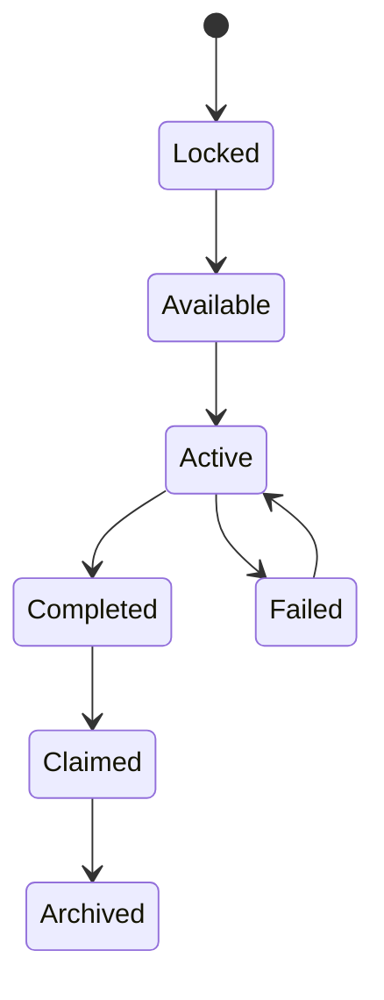

# System Design Framework（系统设计框架）

> Status: V1  
> Path: `design/systems/system-design-framework.md`  
> Scope: 通用的软件、游戏与交互产品系统设计  
> Purpose: 为所有系统文档提供统一结构、设计方法、评审标准与可复用模板，确保系统能够被理解、实现、验证、集成和长期维护。

---

## 1. Framework 的作用

System Design Framework 用于回答：

```text
一个系统文档应该包含什么？
哪些问题必须在实现前回答？
系统如何定义边界、状态和规则？
如何处理资源、异常、依赖和数据？
如何将 Philosophy 转化为系统约束？
如何判断系统已经达到可实现、可测试和可上线状态？
```

它不是具体系统设计。

它是所有系统文档的共同方法和模板。

适用对象包括：

- 核心循环；
- 输入与交互；
- 状态与流程；
- 规则与结算；
- 资源与经济；
- 成长；
- 奖励；
- 难度；
- 任务；
- 内容；
- 保存；
- 通知；
- 社交；
- 商业化；
- 数据分析；
- 运营；
- 版本迁移。

---

## 2. 系统文档的目标

一份成熟的系统文档应同时服务：

### 2.1 Design

帮助设计人员理解：

- 系统为何存在；
- 玩家体验是什么；
- 规则如何运转；
- 与其他系统如何配合；
- 什么是允许和不允许的设计方向。

### 2.2 Product

帮助产品人员理解：

- 系统价值；
- 用户影响；
- 风险；
- 范围；
- 优先级；
- 发布条件；
- 商业和长期维护成本。

### 2.3 Engineering

帮助工程人员理解：

- 状态；
- 输入；
- 输出；
- 数据；
- 边界；
- 依赖；
- 结算顺序；
- 异常；
- 幂等；
- 迁移。

### 2.4 UX and UI

帮助体验与界面人员理解：

- 玩家目标；
- 状态可见性；
- 反馈要求；
- 错误；
- 风险；
- 入口；
- 退出；
- 恢复。

### 2.5 QA

帮助测试人员理解：

- 不变量；
- 状态转换；
- 边界情境；
- 失败路径；
- 数据一致性；
- 跨系统影响；
- 回归范围。

### 2.6 Research and Data

帮助研究和数据人员理解：

- 关键假设；
- 成功标准；
- 失败标准；
- 事件；
- 指标；
- 分群；
- 负面信号。

---

## 3. 系统设计的基本原则

### 3.1 Purpose Before Mechanism

先说明系统为什么存在，再讨论如何实现。

### 3.2 Boundary Before Detail

先明确系统拥有和不拥有的职责，再设计内部规则。

### 3.3 State Before Screen

先定义系统状态，再设计页面。

页面是状态的表现，不是系统本身。

### 3.4 Rule Before Exception

先建立稳定基础规则，再处理特殊内容。

### 3.5 Player Intent Before Input

先定义玩家想完成什么，再定义按键、按钮和手势。

### 3.6 Failure Before Release

上线前必须知道系统如何失败、如何恢复和如何回退。

### 3.7 Evidence Before Scale

高成本扩展前先验证关键假设。

### 3.8 Single Ownership

每项关键状态只能有一个主要拥有系统。

### 3.9 Explicit Trade-offs

系统必须记录它牺牲了什么，而不是只描述收益。

### 3.10 Long-Term Maintainability

系统不仅要在当前版本成立，还要考虑：

- 内容扩展；
- 数据迁移；
- 平台变化；
- 运营覆盖；
- 规则例外；
- 玩家回归。

---

## 4. 标准文档结构

每份系统文档建议使用以下章节：

```text
1. Metadata
2. System Summary
3. Purpose
4. Non-Goals
5. Governing Principles
6. Player Experience
7. System Boundary
8. Entities and Concepts
9. State Model
10. State Transitions
11. Rules
12. Inputs and Outputs
13. Resource Flow
14. Feedback Requirements
15. Failure and Recovery
16. Edge Cases
17. Cross-System Dependencies
18. Data and Persistence
19. Accessibility
20. Ethical and Safety Review
21. Analytics and Validation
22. Rollout and Migration
23. Risks and Open Questions
24. Review Checklist
25. V1 Completion Criteria
26. Related Documents
```

并非所有章节都必须有复杂内容。

不适用时应标记：

```text
Not Applicable
```

而不是直接删除，以便区分：

- 已评估但不适用；
- 尚未考虑；
- 被遗漏。

---

## 5. Metadata

建议统一使用：

```markdown
> Status: Draft / Review / V1 / Live / Deprecated / Archived  
> Category: Core / Player / Progression / Content / Social / Commercial / Operations  
> Owner:  
> Reviewers:  
> Last Updated:  
> Version:  
> Risk Level: Low / Medium / High / Critical  
> Dependencies:  
> Affected Systems:  
> Related Features:  
```

### 5.1 Status

| Status | 定义 |
|---|---|
| Draft | 目标、范围或规则仍可能大幅变化 |
| Review | 已形成完整方案，等待跨职能评审 |
| V1 | 足以支持实现和测试 |
| Live | 已上线并持续维护 |
| Deprecated | 不再用于新设计，等待迁移 |
| Archived | 只保留历史和决策记录 |

### 5.2 Risk Level

#### Low

- 文案；
- 低影响排序；
- 局部展示；
- 可快速回退。

#### Medium

- 常规流程；
- 任务；
- 内容解锁；
- 非关键资源。

#### High

- 存档；
- 核心经济；
- 成长；
- 多人公平；
- 大范围状态变更。

#### Critical

- 付费；
- 儿童；
- 隐私；
- 账户资产；
- 概率消费；
- 数据删除；
- 所有权；
- 不可逆迁移。

### 5.3 Owner

Owner 对以下内容负责：

- 文档完整；
- 冲突跟进；
- 评审；
- 更新；
- 版本；
- 风险；
- 复盘。

Owner 不一定独立决定方案。

---

## 6. System Summary

System Summary 应使用简短文字说明：

```text
该系统是什么？
玩家什么时候接触？
系统产生什么主要价值？
与哪些系统直接相关？
```

推荐格式：

```markdown
## System Summary

该系统帮助【目标玩家】在【情境】下完成【目标】，
通过【核心机制】获得【主要体验价值】，
并向【下游系统】提供【关键输出】。
```

示例：

```text
奖励系统帮助玩家理解行动成果，
通过资源、能力、内容与表达奖励，
连接挑战结果和下一轮成长目标。
```

---

## 7. Purpose

Purpose 应描述玩家价值，而不是技术职责。

### 7.1 Purpose 应回答

- 玩家遇到什么问题；
- 系统提供什么能力；
- 为什么该能力重要；
- 与核心体验有什么关系；
- 不存在该系统会怎样。

### 7.2 推荐格式

```markdown
## Purpose

### Player Value
- ...

### Experience Contribution
- ...

### Product Value
- ...

### Why This System Exists
- ...
```

### 7.3 不推荐写法

```text
该系统负责装备数据管理。
```

### 7.4 推荐写法

```text
该系统帮助玩家根据当前目标比较、装备和保存构筑，
使队伍准备成为可理解、可调整且具有后果的决策过程。
```

---

## 8. Non-Goals

Non-Goals 用于限制系统职责扩张。

应明确：

- 不负责什么；
- 哪些问题由其他系统处理；
- 哪些能力当前版本不支持；
- 哪些未来方向被有意排除。

示例：

```markdown
## Non-Goals

该系统不负责：

- 定义完整掉落经济；
- 自动替玩家选择唯一最优方案；
- 管理商城所有权；
- 替代角色成长系统；
- 支持实时多人交易。
```

Non-Goals 不是未来永远禁止。

它表示当前系统边界和当前版本承诺。

---

## 9. Governing Principles

每个系统必须引用上层 Philosophy。

### 9.1 推荐格式

```markdown
## Governing Principles

- [Player First Design](../philosophy/foundation/player-first-design.md)
  - 高频操作应减少无价值步骤；
  - 高影响错误必须可恢复。

- [Clarity and Feedback](../philosophy/experience/clarity-and-feedback.md)
  - 状态来源必须可追踪；
  - 不可用操作必须说明原因。

- [Ethical Design](../philosophy/responsibility/ethical-design.md)
  - 不通过人为摩擦出售基础修复。
```

### 9.2 不足的写法

```text
遵循 Player First、Clarity、Ethical Design。
```

这无法支持评审。

必须说明：

```text
该系统实际采用哪些具体原则。
```

### 9.3 原则冲突

存在冲突时应链接：

- `philosophy/conflict-resolution.md`

并记录当前系统选择。

---

## 10. Player Experience

Player Experience 描述系统从玩家视角如何被经历。

### 10.1 Player Goal

玩家为什么进入。

### 10.2 Entry

玩家如何进入系统。

### 10.3 Main Actions

玩家可以做什么。

### 10.4 Core Decisions

哪些决定真正重要。

### 10.5 Feedback

玩家如何知道：

- 输入成功；
- 状态变化；
- 风险；
- 结果；
- 下一步。

### 10.6 Success

玩家如何完成目标。

### 10.7 Failure

玩家如何失败或被阻断。

### 10.8 Exit

玩家如何离开。

### 10.9 Return

玩家下次如何恢复上下文。

推荐模板：

```markdown
## Player Experience

### Goal
- ...

### Entry
- ...

### Main Actions
- ...

### Core Decisions
- ...

### Success
- ...

### Failure
- ...

### Exit and Return
- ...
```

---

## 11. System Boundary

System Boundary 是系统文档最重要的章节之一。

推荐结构：

```markdown
## System Boundary

### Inputs
- ...

### Outputs
- ...

### Owned State
- ...

### Read-Only Dependencies
- ...

### Write Dependencies
- ...

### Out of Scope
- ...
```

### 11.1 Inputs

系统接收：

- 玩家输入；
- 系统事件；
- 配置；
- 数据；
- 时间；
- 外部服务结果。

### 11.2 Outputs

系统产生：

- 状态变化；
- 资源；
- 事件；
- 反馈；
- 数据；
- 下游触发。

### 11.3 Owned State

系统拥有并负责最终正确性的状态。

### 11.4 Read-Only Dependencies

系统可以读取，但不应直接修改。

### 11.5 Write Dependencies

系统确实需要修改其他系统时，应明确：

- 修改对象；
- 权限；
- 事务；
- 失败处理；
- 所有权边界。

### 11.6 Out of Scope

再次明确不属于本系统的职责。

---

## 12. Entities and Concepts

定义系统中稳定存在的实体、值对象和概念。

推荐格式：

```markdown
| Entity | Definition | Owner | Lifetime | Notes |
|---|---|---|---|---|
```

### 12.1 Entity

具有身份和生命周期的对象。

例如：

- Character；
- Quest；
- Reward Instance；
- Offer；
- Match；
- Save Slot。

### 12.2 Value Object

没有独立身份，主要由值决定。

例如：

- Price；
- Duration；
- Damage Range；
- Progress Value。

### 12.3 Configuration

用于调整系统行为的配置。

### 12.4 Runtime State

仅在当前会话或流程中存在。

### 12.5 Persistent State

跨会话保存。

---

## 13. State Model

状态模型描述系统在任一时刻可能处于什么状态。

### 13.1 状态应满足

- 互斥或明确可并存；
- 名称清楚；
- 进入条件明确；
- 退出条件明确；
- 可保存；
- 可恢复；
- 可测试。

### 13.2 示例

```text
Locked
→ Available
→ Active
→ Completed
→ Claimed
→ Archived
```

### 13.3 复合状态

复杂系统可以区分：

```text
Lifecycle State
Operational State
Visibility State
Ownership State
```

例如：

```text
Quest Lifecycle:
Locked / Available / Active / Completed

Quest Visibility:
Hidden / Teased / Visible

Quest Reward:
Unclaimed / Claimed
```

不要把所有状态塞进一个巨大枚举。

### 13.4 状态图

推荐使用 Mermaid：



---

## 14. State Transitions

每个状态转换应记录：

```markdown
| From | To | Trigger | Conditions | Outputs | Failure | Reversible |
|---|---|---|---|---|---|---|
```

### 14.1 Trigger

可能来自：

- 玩家；
- 时间；
- 系统事件；
- 配置；
- 外部服务；
- 管理操作。

### 14.2 Conditions

必须满足的前置条件。

### 14.3 Outputs

转换成功后产生什么。

### 14.4 Failure

失败时：

- 保持原状态；
- 进入错误状态；
- 部分完成；
- 重试；
- 回滚。

### 14.5 Reversible

是否可以：

- 撤销；
- 回退；
- 重置；
- 重新进入。

### 14.6 幂等性

重复触发同一转换时，应明确：

- 忽略；
- 返回当前结果；
- 重复执行；
- 报错。

高影响事务通常应设计为幂等。

---

## 15. Rules

规则章节应区分不同层级。

### 15.1 Invariant

任何情况下都必须成立。

示例：

```text
同一奖励实例只能被成功领取一次。
```

### 15.2 Core Rule

定义系统主要行为。

### 15.3 Eligibility Rule

定义是否满足资格。

### 15.4 Resolution Rule

定义结算方式。

### 15.5 Priority Rule

定义多个效果同时发生时的顺序。

### 15.6 Parameter

可以通过配置调整的值。

### 15.7 Exception

特定范围内偏离基础规则。

### 15.8 Temporary Override

活动、修复和运营的临时覆盖。

推荐格式：

```markdown
## Rules

### Invariants
1. ...

### Core Rules
1. ...

### Eligibility
1. ...

### Resolution Order
1. ...

### Exceptions
1. ...
```

---

## 16. 规则写作标准

规则应具备：

- 明确主语；
- 明确条件；
- 明确结果；
- 明确顺序；
- 明确范围；
- 可测试；
- 避免模糊词。

### 16.1 模糊写法

```text
通常会给予较多奖励。
```

### 16.2 清晰写法

```text
当任务首次完成时，
系统发放 First Completion Reward；
重复完成只发放 Repeat Reward。
```

### 16.3 避免实现绑定

设计文档不应过早写：

```text
调用 RewardService.claimReward()。
```

应写：

```text
奖励系统验证领取资格后，以幂等事务发放奖励。
```

---

## 17. Resolution Order

涉及多个效果时必须定义结算顺序。

示例：

```text
1. 验证输入
2. 锁定资源
3. 应用基础数值
4. 应用加成
5. 应用减免
6. 应用随机结果
7. 处理上限与下限
8. 写入结果
9. 发出事件
10. 展示反馈
```

需要说明：

- 同时事件；
- 优先级；
- 冲突；
- 舍入；
- 溢出；
- 负值；
- 重复；
- 延迟效果。

---

## 18. Inputs and Outputs

推荐使用表格：

```markdown
### Inputs

| Input | Source | Validation | Failure |
|---|---|---|---|

### Outputs

| Output | Consumer | Guarantee | Notes |
|---|---|---|---|
```

### 18.1 Input Validation

检查：

- 类型；
- 范围；
- 权限；
- 状态；
- 重复；
- 过期；
- 版本；
- 所有权。

### 18.2 Output Guarantee

明确输出是否：

- 必然产生；
- 可能为空；
- 最终一致；
- 立即可见；
- 可重复读取。

---

## 19. Resource Flow

涉及资源时，必须记录完整流向。

```markdown
| Resource | Source | Sink | Cap | Conversion | Expiry | Owner |
|---|---|---|---|---|---|---|
```

### 19.1 Source

资源从哪里来。

### 19.2 Sink

资源在哪里被消耗。

### 19.3 Cap

上限是否存在，为什么存在。

### 19.4 Conversion

资源之间是否转换。

### 19.5 Expiry

是否过期，过期是否合理。

### 19.6 Ownership

哪个系统负责资源最终正确性。

### 19.7 资源流检查

- 是否只有来源没有消耗；
- 是否只有消耗没有稳定来源；
- 是否职责重复；
- 是否存在死资源；
- 是否制造高压登录；
- 是否存在通胀；
- 是否阻止回归；
- 是否存在付费不公平。

---

## 20. Feedback Requirements

系统文档定义必须表达的信息，不决定最终视觉表现。

### 20.1 必须表达的内容

- 当前状态；
- 可用操作；
- 不可用原因；
- 前置条件；
- 风险；
- 预计结果；
- 实际结果；
- 资源变化；
- 错误；
- 保存状态；
- 下一步。

### 20.2 Feedback Levels

#### Immediate

输入后立即确认。

#### Transactional

一次完整事务结束后的结果。

#### Milestone

重大进度或解锁。

#### Persistent

需要长期保留的记录。

#### Error

说明失败和恢复方式。

### 20.3 多通道

关键信息应考虑：

- 视觉；
- 文本；
- 声音；
- 震动；
- 动画；
- 日志。

---

## 21. Failure and Recovery

系统必须区分失败来源。

### 21.1 Player Failure

玩家未完成目标。

### 21.2 Input Error

玩家误触、误解或输入无效。

### 21.3 Validation Failure

条件不满足。

### 21.4 System Failure

服务、网络、客户端、存储或第三方失败。

### 21.5 Partial Failure

部分操作成功，部分失败。

### 21.6 Conflict Failure

多个设备、请求或状态发生冲突。

### 21.7 Recovery

可能包括：

- 重试；
- 撤销；
- 回滚；
- 补偿；
- 恢复购买；
- 重新同步；
- 自动修复；
- 客服；
- 人工审核。

推荐格式：

```markdown
| Failure | Cause | Player Impact | Recovery | Data Guarantee |
|---|---|---|---|---|
```

---

## 22. Edge Cases

系统至少应检查以下情境：

### Input

- 重复点击；
- 长按；
- 快速切换；
- 输入设备变化；
- 焦点丢失。

### Time

- 跨日；
- 跨周；
- 跨赛季；
- 时区变化；
- 设备时间错误；
- 夏令时。

### Network

- 断线；
- 高延迟；
- 超时；
- 重试；
- 请求重复；
- 响应乱序。

### Data

- 容量不足；
- 旧版本；
- 缺失字段；
- 冲突；
- 损坏；
- 回滚。

### Content

- 内容下架；
- 内容过期；
- 配置缺失；
- 奖励失效；
- 依赖内容删除。

### Platform

- 多设备；
- 跨平台；
- 低性能；
- 小屏幕；
- 权限拒绝；
- 不支持功能。

### User

- 新玩家；
- 熟练玩家；
- 回归玩家；
- 儿童；
- 可访问性需求；
- 非默认语言。

---

## 23. Cross-System Dependencies

推荐格式：

```markdown
| System | Dependency Type | Direction | Data or Event | Failure Impact |
|---|---|---|---|---|
```

### 23.1 Hard Dependency

缺失时无法运行。

### 23.2 Soft Dependency

缺失时体验退化，但仍可继续。

### 23.3 Read Dependency

读取其他系统状态。

### 23.4 Write Dependency

修改其他系统状态。

### 23.5 Event Dependency

通过事件通信。

### 23.6 Temporal Dependency

需要特定时间顺序。

### 23.7 Dependency Risk

依赖越多，系统越容易：

- 故障扩散；
- 测试困难；
- 维护困难；
- 版本耦合；
- 形成循环依赖。

---

## 24. 状态所有权

每项关键状态必须有唯一主拥有者。

推荐记录：

```markdown
| State | Owner System | Readers | Writers | Persistence |
|---|---|---|---|---|
```

### 24.1 Ownership Rules

- 只有 Owner 决定最终状态；
- 其他系统通过请求或事件修改；
- 不直接绕过 Owner 写入；
- 派生状态可以缓存；
- 缓存失效规则明确；
- 冲突解决规则明确。

### 24.2 Shared State

尽量避免真正共享写状态。

如果无法避免，应定义：

- 主权威；
- 锁；
- 版本；
- 合并；
- 冲突；
- 回滚。

---

## 25. Data and Persistence

设计层应说明：

- 保存什么；
- 不保存什么；
- 保存在哪里；
- 谁是权威；
- 何时保存；
- 如何恢复；
- 如何迁移；
- 如何删除。

推荐格式：

```markdown
| State | Persistent | Authority | Save Trigger | Retention | Recovery |
|---|---|---|---|---|---|
```

### 25.1 Persistence Types

- Session；
- Local；
- Cloud；
- Server；
- Account；
- Device；
- Temporary Cache。

### 25.2 Save Triggers

- 状态转换；
- 事务完成；
- 定时；
- 页面退出；
- 后台；
- 手动保存。

### 25.3 Conflict Resolution

多设备或多版本冲突时，应定义：

- 时间优先；
- 服务端优先；
- 玩家选择；
- 合并；
- 备份；
- 回退。

### 25.4 Privacy

敏感数据必须说明：

- 必要性；
- 保留；
- 权限；
- 删除；
- 导出；
- 第三方。

---

## 26. Accessibility

每个系统都应检查：

### Perception

- 是否只依赖颜色；
- 是否只依赖声音；
- 是否有字幕；
- 是否可放大；
- 是否有高对比。

### Input

- 是否可重绑；
- 是否要求持续按住；
- 是否要求高频连打；
- 是否支持不同设备；
- 是否有输入容错。

### Cognition

- 同时状态数量；
- 记忆要求；
- 术语；
- 日志；
- 分步；
- 预览；
- 错误恢复。

### Timing

- 是否可暂停；
- 是否可减速；
- 时间窗口是否可调；
- 是否支持中断恢复。

推荐格式：

```markdown
## Accessibility

- Visual:
- Audio:
- Input:
- Cognitive:
- Timing:
- Assist Options:
```

---

## 27. Ethical and Safety Review

以下系统必须专项评审：

- 付费；
- 概率；
- 通知；
- 限时；
- 排名；
- 社交；
- 用户生成内容；
- 儿童；
- 隐私；
- 所有权；
- 永久损失。

推荐结构：

```markdown
## Ethical and Safety Review

### Player Time
- ...

### Financial Risk
- ...

### Randomness
- ...

### FOMO and Pressure
- ...

### Privacy
- ...

### Children and Vulnerable Users
- ...

### Social Safety
- ...

### Cancellation and Recovery
- ...
```

### 27.1 不可接受边界

包括：

- 隐藏真实价格；
- 虚假倒计时；
- 隐瞒概率；
- 难以取消；
- 默认公开敏感信息；
- 利用失败状态推销；
- 儿童高压随机消费；
- 明知造成资产损失。

---

## 28. Analytics and Validation

每个系统必须说明如何验证。

### 28.1 Key Assumptions

```text
系统成立依赖哪些判断？
```

### 28.2 Success Criteria

```text
什么结果表示系统支持了玩家目标和核心体验？
```

### 28.3 Failure Criteria

```text
什么结果表示系统无效或风险不可接受？
```

### 28.4 Behavioral Metrics

玩家做了什么。

### 28.5 Outcome Metrics

玩家是否达到目标。

### 28.6 Negative Metrics

是否造成：

- 误操作；
- 放弃；
- 退款；
- 投诉；
- 压力；
- 数据损失；
- 不公平；
- 过度时间成本。

### 28.7 Qualitative Research

- 观察；
- 访谈；
- 复述；
- 长期日记；
- 回顾测试。

推荐格式：

```markdown
| Hypothesis | Evidence | Success | Failure | Method |
|---|---|---|---|---|
```

---

## 29. Analytics Event Design

设计文档可以定义分析意图，但不应替代完整埋点规格。

应说明：

- 哪些状态变化需要观察；
- 哪些漏斗需要理解；
- 哪些失败需要记录；
- 哪些分群重要；
- 哪些隐私限制适用。

推荐格式：

```markdown
| Event Intent | Trigger | Key Properties | Privacy Notes |
|---|---|---|---|
```

### 29.1 避免数据过度收集

每个事件都应回答：

```text
这个数据支持什么决策？
如果不收集，会失去什么能力？
```

---

## 30. Rollout and Migration

高风险系统必须设计发布方式。

### 30.1 Rollout

- 内部；
- 测试服；
- 小比例；
- 分平台；
- 分地区；
- 分群；
- 全量。

### 30.2 Feature Flag

说明：

- 开关；
- 默认值；
- 控制范围；
- 关闭后数据处理。

### 30.3 Migration

说明：

- 旧数据；
- 旧规则；
- 旧资产；
- 旧配置；
- 旧客户端；
- 迁移失败。

### 30.4 Rollback

说明：

- 如何关闭；
- 如何恢复；
- 如何处理已生成数据；
- 是否需要补偿；
- 是否可回到旧版本。

### 30.5 Stop Conditions

必须提前定义：

- 崩溃；
- 数据异常；
- 经济异常；
- 投诉；
- 退款；
- 不公平；
- 关键体验失败。

---

## 31. Risks and Open Questions

应区分：

### 31.1 Known Risk

已经识别，但尚未完全消除。

### 31.2 Open Question

尚未有答案。

### 31.3 Assumption

当前暂时相信，但需要验证。

### 31.4 Dependency Risk

依赖其他系统或团队。

### 31.5 Long-Term Risk

短期不明显，但可能随内容和用户增长扩大。

推荐格式：

```markdown
| Item | Type | Impact | Probability | Mitigation | Owner |
|---|---|---:|---:|---|---|
```

---

## 32. Decision Records

重要设计选择应形成记录。

```markdown
## Design Decision Record

- Decision:
- Context:
- Options:
- Selected Option:
- Governing Principles:
- Evidence:
- Accepted Trade-offs:
- Risks:
- Review Condition:
- Owner:
```

适用于：

- 规则变更；
- 状态所有权；
- 付费；
- 数据迁移；
- 例外；
- 平台差异；
- 长期结构。

---

## 33. Review Checklist

### Purpose and Scope

- [ ] 系统目的明确；
- [ ] 玩家价值明确；
- [ ] Non-Goals 已定义；
- [ ] 与核心体验有关；
- [ ] 系统边界清楚。

### State and Rules

- [ ] 实体定义完整；
- [ ] 状态模型完整；
- [ ] 状态转换明确；
- [ ] 不变量明确；
- [ ] 结算顺序明确；
- [ ] 例外有限且有记录；
- [ ] 重复执行安全。

### Player Experience

- [ ] 入口清楚；
- [ ] 当前状态可见；
- [ ] 行动后果可理解；
- [ ] 失败原因明确；
- [ ] 错误可恢复；
- [ ] 可以合理退出和返回。

### Resources and Dependencies

- [ ] 资源流闭合；
- [ ] 状态所有权唯一；
- [ ] 依赖方向明确；
- [ ] 写依赖受到控制；
- [ ] 故障可以隔离；
- [ ] 不存在循环依赖。

### Data

- [ ] 保存内容明确；
- [ ] 权威来源明确；
- [ ] 冲突规则明确；
- [ ] 迁移方式明确；
- [ ] 隐私和删除已考虑。

### Responsibility

- [ ] 可访问性已检查；
- [ ] 伦理与安全已检查；
- [ ] 儿童和脆弱用户已考虑；
- [ ] 不存在不可接受边界问题。

### Validation

- [ ] 关键假设明确；
- [ ] 成功标准明确；
- [ ] 失败标准明确；
- [ ] 负面指标明确；
- [ ] 研究方法明确；
- [ ] 发布和回退方案明确。

---

## 34. V1 Completion Criteria

一份系统文档可以被视为 V1，当：

- Purpose 与 Non-Goals 已明确；
- Governing Principles 已引用并具体化；
- 玩家目标、入口、行动、成功和失败已定义；
- 系统边界与状态所有权明确；
- 核心实体和状态模型完整；
- 状态转换和规则可测试；
- 输入、输出与资源流明确；
- 关键反馈要求明确；
- 失败、异常和恢复路径已覆盖；
- 跨系统依赖明确；
- 保存、数据和迁移已考虑；
- 可访问性、伦理和安全评审已完成；
- 关键假设、成功与失败标准已定义；
- 高风险系统具有灰度和回滚方案；
- 未解决问题和风险有 Owner；
- 工程、设计、QA 和研究可以基于该文档继续工作。

---

## 35. 完整可复用模板

```markdown
# System Name

> Status: Draft  
> Category:  
> Owner:  
> Reviewers:  
> Last Updated:  
> Version:  
> Risk Level:  
> Dependencies:  
> Affected Systems:  

---

## 1. System Summary

该系统帮助【目标玩家】在【情境】下完成【目标】，
通过【核心机制】获得【主要体验价值】，
并向【下游系统】提供【关键输出】。

---

## 2. Purpose

### Player Value
- 

### Experience Contribution
- 

### Product Value
- 

### Why This System Exists
- 

---

## 3. Non-Goals

该系统不负责：

- 
- 
- 

---

## 4. Governing Principles

- [Principle](...)
  - Applied rule:

---

## 5. Player Experience

### Player Goal
- 

### Entry
- 

### Main Actions
- 

### Core Decisions
- 

### Success
- 

### Failure
- 

### Exit and Return
- 

---

## 6. System Boundary

### Inputs
- 

### Outputs
- 

### Owned State
- 

### Read-Only Dependencies
- 

### Write Dependencies
- 

### Out of Scope
- 

---

## 7. Entities and Concepts

| Entity | Definition | Owner | Lifetime | Notes |
|---|---|---|---|---|

---

## 8. State Model

```mermaid
stateDiagram-v2
```

### State Definitions

| State | Definition | Entry Condition | Exit Condition |
|---|---|---|---|

---

## 9. State Transitions

| From | To | Trigger | Conditions | Outputs | Failure | Reversible |
|---|---|---|---|---|---|---|

---

## 10. Rules

### Invariants
1. 

### Core Rules
1. 

### Eligibility Rules
1. 

### Resolution Order
1. 

### Parameters
| Parameter | Meaning | Default | Range | Owner |
|---|---|---:|---|---|

### Exceptions
1. 

---

## 11. Inputs and Outputs

### Inputs

| Input | Source | Validation | Failure |
|---|---|---|---|

### Outputs

| Output | Consumer | Guarantee | Notes |
|---|---|---|---|

---

## 12. Resource Flow

| Resource | Source | Sink | Cap | Conversion | Expiry | Owner |
|---|---|---|---|---|---|---|

---

## 13. Feedback Requirements

### Immediate
- 

### Transactional
- 

### Milestone
- 

### Persistent
- 

### Error
- 

---

## 14. Failure and Recovery

| Failure | Cause | Player Impact | Recovery | Data Guarantee |
|---|---|---|---|---|

---

## 15. Edge Cases

### Input
- 

### Time
- 

### Network
- 

### Data
- 

### Content
- 

### Platform
- 

### User
- 

---

## 16. Cross-System Dependencies

| System | Dependency Type | Direction | Data or Event | Failure Impact |
|---|---|---|---|---|

---

## 17. Data and Persistence

| State | Persistent | Authority | Save Trigger | Retention | Recovery |
|---|---|---|---|---|---|

---

## 18. Accessibility

- Visual:
- Audio:
- Input:
- Cognitive:
- Timing:
- Assist Options:

---

## 19. Ethical and Safety Review

### Player Time
- 

### Financial Risk
- 

### Randomness
- 

### FOMO and Pressure
- 

### Privacy
- 

### Children and Vulnerable Users
- 

### Social Safety
- 

### Cancellation and Recovery
- 

---

## 20. Analytics and Validation

### Key Assumptions
- 

### Validation Plan

| Hypothesis | Evidence | Success | Failure | Method |
|---|---|---|---|---|

### Negative Metrics
- 

### Event Intents

| Event Intent | Trigger | Key Properties | Privacy Notes |
|---|---|---|---|

---

## 21. Rollout and Migration

### Rollout
- 

### Feature Flag
- 

### Migration
- 

### Rollback
- 

### Stop Conditions
- 

---

## 22. Risks and Open Questions

| Item | Type | Impact | Probability | Mitigation | Owner |
|---|---|---:|---:|---|---|

---

## 23. Review Checklist

- [ ] Purpose and Non-Goals complete
- [ ] Boundary and ownership complete
- [ ] State and transitions complete
- [ ] Rules testable
- [ ] Failure and recovery complete
- [ ] Dependencies reviewed
- [ ] Accessibility reviewed
- [ ] Ethics and safety reviewed
- [ ] Validation defined
- [ ] Rollback defined

---

## 24. V1 Completion Criteria

- 
- 
- 

---

## 25. Related Documents

### Philosophy
- 

### Systems
- 

### Specifications
- 
```

---

## 36. Framework 维护规则

### 36.1 新增系统类型

新增前检查：

- 是否只是现有系统的子功能；
- 是否有独立状态所有权；
- 是否有独立生命周期；
- 是否被多个功能复用；
- 是否值得单独维护。

### 36.2 修改模板

只有在以下情况下修改 Framework：

- 多个系统重复缺少同一章节；
- 原模板无法表达关键风险；
- 新法规或平台要求；
- 新的跨系统模式稳定出现；
- 验证发现模板长期无效。

### 36.3 不因单一系统修改通用框架

单一系统的特殊需求应优先放在该系统内部。

只有可复用问题才进入 Framework。

### 36.4 版本记录

```markdown
| Version | Date | Change | Reason | Affected Systems |
|---|---|---|---|---|
```

---

## 37. Related Documents

### Philosophy

- [Design Principles](../philosophy/foundation/design-principles.md)
- [Player First Design](../philosophy/foundation/player-first-design.md)
- [Clarity and Feedback](../philosophy/experience/clarity-and-feedback.md)
- [Consistency and Coherence](../philosophy/long-term/consistency-and-coherence.md)
- [Accessibility and Inclusivity](../philosophy/responsibility/accessibility-and-inclusivity.md)
- [Ethical Design](../philosophy/responsibility/ethical-design.md)
- [Iteration and Validation](../philosophy/validation/iteration-and-validation.md)

### Systems

- [Systems README](./README.md)
- `system-map.md`
- `integration-rules.md`
