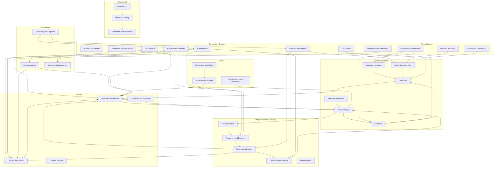
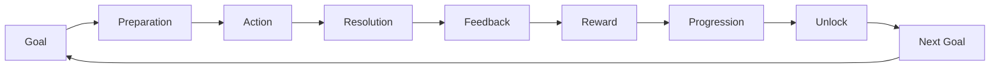
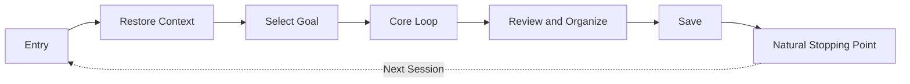
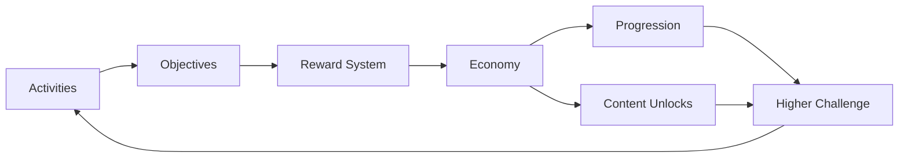
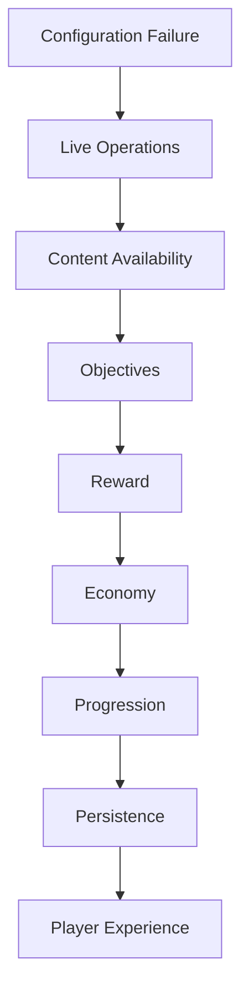
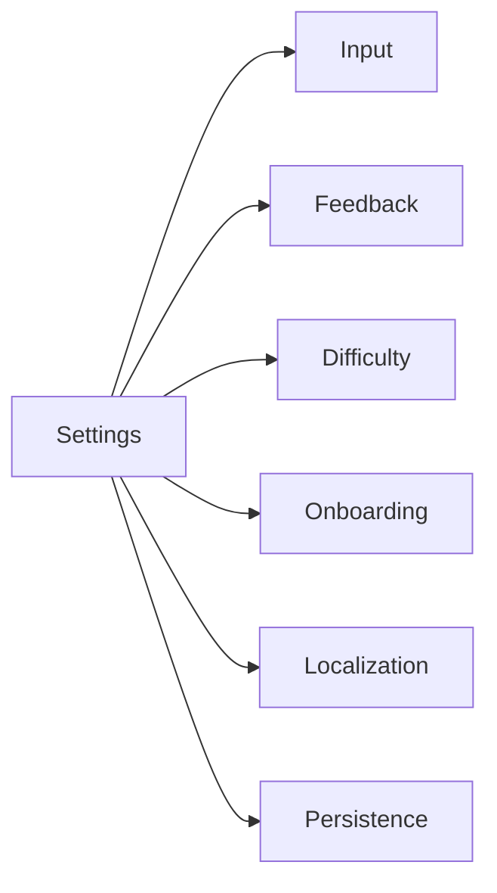

# System Map（系统全景图）

> Status: V1  
> Path: `design/systems/system-map.md`  
> Scope: 通用的软件、游戏与交互产品系统架构  
> Purpose: 展示系统之间的层级、依赖、状态所有权、资源流、事件流和风险集中点，使团队能够从整体而不是孤立功能角度设计和评审系统。

---

## 1. System Map 的作用

System Map 用于回答：

```text
项目中有哪些系统？
每个系统负责什么？
系统之间如何依赖？
哪些状态由谁拥有？
资源从哪里来、流向哪里？
哪些系统构成核心循环？
哪些依赖可能形成耦合、故障扩散或维护风险？
```

System Map 不是：

- 页面导航图；
- 功能列表；
- 数据库 ER 图；
- 技术服务拓扑；
- 项目排期；
- 完整事件字典。

它位于：

```text
Philosophy
→ Systems Architecture
→ Individual System Documents
→ Feature Specifications
→ Technical Design
```

之间，负责提供系统级全景。

---

## 2. 系统地图的设计原则

### 2.1 按职责分层，不按页面分层

页面可能同时呈现多个系统。

例如：

```text
角色页面
可能同时包含：
- 角色系统；
- 装备系统；
- 成长系统；
- 资源系统；
- 奖励系统；
- 存档系统。
```

因此系统分层应基于：

- 状态所有权；
- 规则职责；
- 生命周期；
- 输入输出；
- 下游价值。

### 2.2 状态所有权唯一

同一关键事实应有唯一主拥有系统。

### 2.3 依赖方向明确

系统依赖应尽量：

```text
上层体验系统
依赖
下层基础系统
```

避免双向写入和循环依赖。

### 2.4 核心循环优先

系统地图首先应解释：

```text
玩家如何进入核心循环，
系统如何支持循环完成，
结果如何进入下一轮。
```

### 2.5 资源流必须闭合

资源应有：

- 来源；
- 用途；
- 消耗；
- 回收；
- 上限；
- 所有权。

### 2.6 故障边界明确

一个系统失败时，应知道：

- 哪些系统会受影响；
- 是否可以降级；
- 是否阻断核心体验；
- 如何恢复。

### 2.7 支持裁剪

不同项目可以不启用全部系统。

未启用系统应：

- 明确标记；
- 移除依赖；
- 提供替代职责；
- 不保留空壳入口。

---

## 3. 系统分层

建议将系统分为七层。

```text
1. Foundation Services
2. Core Experience
3. Player Support
4. Progression and Economy
5. Content
6. Social and Commercial
7. Operations and Governance
```

---

## 4. Foundation Services

Foundation Services 提供其他系统依赖的基础能力。

典型内容：

- Account and Identity；
- Save and Persistence；
- Time；
- Configuration；
- Entitlement；
- Analytics；
- Localization；
- Platform Integration。

这些系统通常：

- 不直接构成核心体验；
- 但错误会影响多个系统；
- 需要高数据正确性；
- 需要明确故障隔离。

---

## 5. Core Experience

Core Experience Systems 构成玩家反复经历的主要循环。

典型内容：

- Core Loop；
- Game State and Flow；
- Input and Interaction；
- Rules and Resolution；
- Combat or Primary Activity；
- Feedback。

这些系统决定：

- 玩家主要做什么；
- 如何表达意图；
- 如何结算；
- 如何理解结果；
- 如何进入下一轮。

---

## 6. Player Support

Player Support Systems 帮助玩家进入、理解、设置、保存和恢复体验。

典型内容：

- Tutorial and Onboarding；
- Settings and Preferences；
- Save and Persistence；
- Notification and Reminders；
- Accessibility Support；
- Help and Recovery。

---

## 7. Progression and Economy

Progression and Economy Systems 将短期行动连接为长期成长。

典型内容：

- Resources and Economy；
- Progression；
- Rewards；
- Difficulty and Challenge；
- Unlocks；
- Achievements；
- Catch-up。

---

## 8. Content

Content Systems 负责目标、角色、任务、关卡和活动的组织。

典型内容：

- Content and Unlocks；
- Objectives and Quests；
- Characters and Loadouts；
- Content Lifecycle；
- Narrative；
- Events。

---

## 9. Social and Commercial

按项目范围启用。

### Social

- Friends；
- Parties；
- Matchmaking；
- Competition；
- Communication；
- Moderation；
- Safety。

### Commercial

- Monetization；
- Offers and Pricing；
- Entitlement and Ownership；
- Subscription；
- Purchase Recovery。

这两类系统风险较高，应受：

- 伦理；
- 隐私；
- 儿童保护；
- 公平；
- 资产正确性；

约束。

---

## 10. Operations and Governance

负责发布后配置、观察、实验和维护。

典型内容：

- Analytics and Telemetry；
- Live Operations；
- Experiment Management；
- Versioning and Migration；
- Feature Flags；
- Compensation；
- Audit。

---

## 11. 系统全景图



---

## 12. 核心循环图

通用核心循环：

```text
目标
→ 准备
→ 行动
→ 结算
→ 反馈
→ 奖励
→ 成长
→ 解锁
→ 新目标
```



### 12.1 Goal

主要系统：

- Objectives and Quests；
- Content and Unlocks；
- Notification；
- Social。

### 12.2 Preparation

主要系统：

- Characters and Loadouts；
- Resources；
- Difficulty；
- Settings。

### 12.3 Action

主要系统：

- Input and Interaction；
- Primary Activity；
- Rules and Resolution。

### 12.4 Resolution

主要系统：

- Rules and Resolution；
- Game State；
- Analytics；
- Save。

### 12.5 Feedback

主要系统：

- Feedback；
- UI；
- Audio；
- Accessibility。

### 12.6 Reward

主要系统：

- Reward；
- Economy；
- Entitlement。

### 12.7 Growth

主要系统：

- Progression；
- Characters；
- Economy。

### 12.8 Unlock

主要系统：

- Content and Unlocks；
- Entitlement；
- Live Operations。

---

## 13. 会话循环

核心循环之外，还应定义一次会话结构。

```text
进入
→ 恢复上下文
→ 选择目标
→ 完成一个或多个循环
→ 整理
→ 保存
→ 自然停止
```



支持系统：

- Save and Persistence；
- Notification；
- Onboarding；
- Help；
- Settings；
- Analytics。

---

## 14. 长期循环

长期循环描述跨会话价值。

```text
学习
→ 掌握
→ 扩展选择
→ 应对新挑战
→ 形成身份
→ 建立长期目标
→ 回归
```

主要系统：

- Progression；
- Content；
- Characters；
- Achievements；
- Social；
- Live Operations；
- Catch-up。

---

## 15. 系统职责矩阵

| System | Primary Responsibility | Owns State | Produces | Consumes |
|---|---|---|---|---|
| Core Loop | 组织反复体验 | 当前循环阶段 | 循环事件 | 目标、结果 |
| Game State and Flow | 管理模式与流程状态 | 当前模式、流程 | 状态转换 | 输入、系统事件 |
| Input and Interaction | 将输入转为意图 | 输入上下文 | 玩家意图 | 设备输入 |
| Rules and Resolution | 计算结果 | 规则上下文 | 结算结果 | 意图、状态 |
| Save and Persistence | 保存与恢复 | 持久化记录 | 恢复状态 | 系统状态 |
| Resources and Economy | 管理资源 | 余额、交易 | 资源变化 | 来源、消耗 |
| Progression | 管理成长 | 等级、能力、里程碑 | 成长变化 | 资源、成就 |
| Reward | 生成与发放奖励 | 奖励实例 | 奖励结果 | 目标完成 |
| Difficulty | 定义挑战要求 | 难度配置 | 挑战参数 | 成长、内容 |
| Content and Unlocks | 管理内容可用性 | 解锁状态 | 可用内容 | 进度、权益 |
| Objectives and Quests | 管理目标与进度 | 任务状态 | 完成事件 | 玩家行为 |
| Characters and Loadouts | 管理角色与构筑 | 队伍、装备关系 | 活动配置 | 角色、装备 |
| Social | 管理关系与协作 | 好友、队伍 | 社交事件 | 账户 |
| Monetization | 定义商业价值交换 | 付费产品规则 | 购买请求 | 商品、价格 |
| Entitlement | 管理所有权 | 权益记录 | 权益状态 | 购买、授予 |
| Analytics | 记录观察数据 | 事件日志 | 指标数据 | 系统事件 |
| Live Operations | 管理时段配置 | 活动配置 | 运营状态 | 时间、内容 |

---

## 16. 状态所有权地图

### 16.1 原则

```text
一个关键状态
→ 一个主拥有系统
→ 多个只读消费者
```

### 16.2 推荐所有权

| State | Owner System | Primary Readers |
|---|---|---|
| Account Identity | Account and Identity | 全部账户级系统 |
| Current Mode | Game State and Flow | UI、Input、Save |
| Input Mapping | Settings and Preferences | Input |
| Quest Progress | Objectives and Quests | UI、Reward、Analytics |
| Resource Balance | Resources and Economy | Progression、Offers、UI |
| Reward Claim State | Reward System | Economy、UI、Save |
| Character Level | Progression System | Difficulty、Characters、UI |
| Loadout | Characters and Loadouts | Primary Activity、Save |
| Content Unlock | Content and Unlocks | UI、Objectives、Live Operations |
| Entitlement | Entitlement and Ownership | Content、Commercial、Account |
| Match Rating | Matchmaking and Competition | Matchmaking、UI |
| Notification Preference | Settings and Preferences | Notification |
| Save Version | Save and Persistence | Versioning and Migration |
| Experiment Assignment | Experiment Management | Analytics、Configuration |

### 16.3 禁止模式

避免：

```text
Reward 直接修改角色等级；
Quest 直接修改资源余额；
UI 直接写入存档；
Live Operations 直接覆盖玩家资产；
Analytics 决定业务状态。
```

正确方式：

```text
Reward
→ 请求 Economy 发放资源

Progression
→ 请求 Content 解锁内容

UI
→ 发送玩家意图

Analytics
→ 只观察，不主导业务事实
```

---

## 17. 资源流地图

### 17.1 通用资源循环

```text
活动与目标
→ 产生奖励
→ 进入经济系统
→ 被成长与内容系统消耗
→ 提高能力或开放内容
→ 支持更高阶目标
```



### 17.2 资源职责

资源应优先按职责分类：

- Access Resource；
- Progression Resource；
- Crafting Resource；
- Expression Resource；
- Social Resource；
- Premium Currency；
- Event Currency。

### 17.3 风险

系统地图应检查：

- 多个系统重复发放；
- 资源没有稳定消耗；
- 资源用途过多；
- 活动资源残留；
- 资源过期制造压力；
- 付费资源绕过核心体验；
- 资源所有权不清。

---

## 18. 事件流地图

系统之间应优先通过明确事件传递变化。

通用事件链：

```text
PlayerIntentSubmitted
→ ActionValidated
→ ActionResolved
→ StateChanged
→ ObjectiveProgressed
→ RewardCreated
→ ResourceGranted
→ ProgressionUpdated
→ ContentUnlocked
→ FeedbackPresented
→ StateSaved
→ AnalyticsRecorded
```

### 18.1 事件职责

事件应描述：

```text
已经发生的事实
```

而不是模糊命令。

推荐：

```text
QuestCompleted
RewardGranted
CharacterLeveledUp
ContentUnlocked
```

不推荐：

```text
HandleQuest
DoReward
UpdateEverything
```

### 18.2 事件所有权

只有状态拥有系统可以发布其权威状态变化事件。

### 18.3 事件消费者

消费者不应假设：

- 固定到达顺序；
- 只到达一次；
- 永不延迟；
- 所有字段永不变化。

系统级设计应考虑：

- 幂等；
- 版本；
- 重试；
- 乱序；
- 丢失；
- 重放。

---

## 19. 数据流地图

数据流可以分为：

### 19.1 Command

请求系统执行动作。

```text
ClaimReward
EquipItem
StartQuest
PurchaseOffer
```

### 19.2 Query

读取状态。

```text
GetResourceBalance
GetAvailableContent
GetCurrentLoadout
```

### 19.3 Event

系统状态已经变化。

```text
RewardClaimed
ItemEquipped
QuestStarted
OfferPurchased
```

### 19.4 Configuration

定义系统当前规则和参数。

```text
Reward Table
Difficulty Curve
Offer Schedule
Content Availability
```

应避免使用同一个接口同时承担：

- 命令；
- 查询；
- 事件；
- 配置。

---

## 20. 依赖方向

### 20.1 推荐方向

```text
体验编排层
→ 领域系统
→ 基础服务
```

例如：

```text
Core Loop
→ Objectives
→ Reward
→ Economy
→ Persistence
```

### 20.2 反向通知

基础系统可以通过事件通知上层，但不应直接控制上层体验。

例如：

```text
Persistence:
SaveFailed

Game State:
决定是否阻断、重试或降级
```

### 20.3 循环依赖

常见危险循环：

```text
Progression
→ Difficulty
→ Reward
→ Progression
```

这在体验上合理，但在系统所有权上必须拆分：

```text
Progression 提供能力状态；
Difficulty 读取能力并生成挑战；
Reward 根据结果生成奖励；
Economy 发放资源；
Progression 消耗资源更新能力。
```

没有系统直接同时拥有完整闭环。

---

## 21. 依赖类型矩阵

| Dependency Type | 含义 | 风险 |
|---|---|---|
| Hard | 缺失时无法运行 | 高故障传播 |
| Soft | 缺失时可以降级 | 体验退化 |
| Read | 只读取状态 | 数据陈旧 |
| Write | 修改其他系统 | 所有权冲突 |
| Event | 响应状态变化 | 重复、乱序 |
| Temporal | 依赖执行顺序 | 竞态 |
| Configuration | 依赖配置 | 错误配置扩散 |
| External | 第三方或平台 | 不可控故障 |

---

## 22. 关键依赖表

| Source System | Target System | Type | Purpose | Failure Strategy |
|---|---|---|---|---|
| Objectives | Reward | Event | 创建完成奖励 | 重试并保持未发放 |
| Reward | Economy | Command | 发放资源 | 幂等重试 |
| Economy | Progression | Read | 检查成长成本 | 使用权威余额 |
| Progression | Content | Event | 解锁内容 | 延迟同步 |
| Content | Objectives | Query | 获取可用目标 | 降级为本地缓存 |
| Game State | Save | Command | 保存当前状态 | 重试或提示 |
| Settings | Input | Event | 更新映射 | 使用最后有效配置 |
| Live Operations | Configuration | Write | 发布活动配置 | 版本回滚 |
| Purchase | Entitlement | Event | 授予权益 | 阻断完成直到确认 |
| Entitlement | Content | Query | 判断访问资格 | 安全拒绝并支持恢复 |

---

## 23. 系统集成风险

### 23.1 双向写入

两个系统都可以修改同一状态。

### 23.2 隐式依赖

系统通过共享数据库、全局变量或 UI 状态形成未记录依赖。

### 23.3 广播事件

一个模糊事件触发大量系统。

### 23.4 顺序依赖

系统正确性依赖未声明的执行顺序。

### 23.5 共享配置

多个系统读取同一配置字段，但含义不同。

### 23.6 同步阻塞

低优先级系统故障阻断核心体验。

### 23.7 运营越权

运营配置能够绕过核心规则直接修改玩家资产。

### 23.8 分析污染

埋点和实验逻辑改变业务结果。

---

## 24. 风险集中点

以下系统通常属于高风险中心。

### 24.1 Save and Persistence

风险：

- 数据丢失；
- 冲突；
- 回滚；
- 迁移；
- 跨设备。

### 24.2 Economy

风险：

- 重复发放；
- 负余额；
- 通胀；
- 付费不一致；
- 事务失败。

### 24.3 Entitlement

风险：

- 已购买内容不可用；
- 未购买内容误授予；
- 跨平台差异；
- 退款；
- 所有权争议。

### 24.4 Live Operations

风险：

- 配置错误影响全体；
- 时间错误；
- 奖励错误；
- 活动无法回滚；
- FOMO 和伦理问题。

### 24.5 Matchmaking

风险：

- 公平；
- 延迟；
- 排名；
- 作弊；
- 断线。

### 24.6 Versioning and Migration

风险：

- 旧存档失效；
- 数据不可逆；
- 多版本兼容；
- 回退困难。

---

## 25. 故障传播图



### 25.1 设计要求

每个连接点应定义：

- 验证；
- 默认值；
- 降级；
- 重试；
- 回滚；
- 审计；
- 补偿。

---

## 26. 降级策略

系统地图应标记哪些能力可以降级。

### 26.1 Graceful Degradation

例如：

- Analytics 失败不阻断核心玩法；
- Notification 失败不影响任务；
- 社交状态失败允许单人继续；
- 非关键推荐失败显示默认排序；
- Live 配置失败使用最后有效版本。

### 26.2 Fail Closed

适用于：

- 购买；
- 权益；
- 隐私；
- 儿童；
- 高风险资产。

失败时优先拒绝不安全操作。

### 26.3 Fail Open

只适用于风险较低且阻断成本较高的场景。

必须明确：

- 开放什么；
- 最大损失；
- 补偿；
- 审计。

---

## 27. 系统地图与可访问性

可访问性不应只属于 Settings。

它跨越：

- Input；
- Feedback；
- Game State；
- Difficulty；
- Tutorial；
- Localization；
- Social；
- Save。



设置系统拥有偏好状态，但各领域系统负责正确应用。

---

## 28. 系统地图与伦理

伦理风险同样是跨系统的。

### 时间压力

涉及：

- Objectives；
- Live Operations；
- Notification；
- Progression；
- Reward。

### 付费压力

涉及：

- Monetization；
- Offers；
- Economy；
- Progression；
- Difficulty。

### 隐私

涉及：

- Account；
- Social；
- Analytics；
- Notification；
- Platform Integration。

### 儿童保护

涉及：

- Account；
- Commercial；
- Social；
- Moderation；
- Notification。

伦理不能只由商业系统负责。

---

## 29. 系统地图与实验

Experiment Management 可以：

- 分配实验组；
- 控制配置；
- 记录暴露；
- 支持分析。

但不应：

- 拥有业务状态；
- 直接发放资产；
- 绕过权益；
- 修改不可逆数据；
- 在高风险人群中无保护实验。

实验结构：

```text
Experiment Assignment
→ Configuration Variant
→ System Behavior
→ Exposure Event
→ Outcome Observation
```

---

## 30. 系统地图与版本管理

每个长期系统应说明：

- 当前版本；
- 数据版本；
- 规则版本；
- 配置版本；
- 内容版本；
- 兼容范围。

### 30.1 Versioning and Migration 的职责

- 迁移顺序；
- 旧版本读取；
- 新版本写入；
- 回退；
- 数据修复；
- 审计。

### 30.2 不应由业务系统自行处理所有迁移

业务系统负责：

- 定义状态含义；
- 提供迁移规则。

Versioning 负责：

- 编排；
- 执行；
- 记录；
- 回滚。

---

## 31. 系统裁剪方法

项目不需要全部系统时，使用以下流程。

### Step 1：确认核心循环

列出：

- 目标；
- 行动；
- 结果；
- 奖励；
- 下一轮。

### Step 2：识别必要状态所有权

例如：

- 任务；
- 资源；
- 成长；
- 保存。

### Step 3：移除不需要的领域

例如：

- 无多人则删除 Social；
- 无付费则删除 Commercial；
- 无长期运营则简化 Live Operations。

### Step 4：重新分配职责

移除系统后，不能留下无人负责的状态。

### Step 5：更新依赖和风险

确保：

- 没有断链；
- 没有空壳系统；
- 没有重复所有权。

---

## 32. System Map 文档模板

```markdown
# Project System Map

## 1. Scope

- Product Type:
- Core Experience:
- Platforms:
- Online / Offline:
- Persistent / Session-Based:
- Social:
- Commercial:
- Live Operations:

## 2. System Inventory

| System | Category | Purpose | Owner | Status | Risk |
|---|---|---|---|---|---|

## 3. Core Loop

```mermaid
flowchart LR
```

## 4. Session Loop

```mermaid
flowchart LR
```

## 5. System Dependency Map

```mermaid
flowchart TD
```

## 6. State Ownership

| State | Owner | Readers | Writers | Persistence |
|---|---|---|---|---|

## 7. Resource Flow

```mermaid
flowchart LR
```

## 8. Event Flow

| Event | Publisher | Consumers | Guarantee | Version |
|---|---|---|---|---|

## 9. Critical Dependencies

| Source | Target | Type | Failure Impact | Fallback |
|---|---|---|---|---|

## 10. Risk Centers

- Persistence:
- Economy:
- Entitlement:
- Live Operations:
- Multiplayer:
- Migration:

## 11. Degradation

| System | Failure Mode | Degraded Experience | Player Message |
|---|---|---|---|

## 12. Open Questions

- 
```

---

## 33. 评审问题

### 系统完整性

```text
核心循环中的每个阶段是否有系统负责？
是否存在无人拥有的状态？
是否存在重复系统职责？
```

### 依赖

```text
依赖方向是否清晰？
是否存在循环写依赖？
是否存在未记录的共享状态？
```

### 资源

```text
资源来源和消耗是否闭合？
谁拥有余额？
重复发放如何防止？
```

### 事件

```text
谁可以发布权威事件？
事件是否幂等？
乱序和重复如何处理？
```

### 故障

```text
哪些系统失败会阻断核心体验？
哪些系统可以降级？
是否有安全默认和最后有效配置？
```

### 长期

```text
新内容和新系统如何接入？
版本如何迁移？
旧数据如何兼容？
```

### 责任

```text
可访问性是否跨系统应用？
伦理、隐私和儿童保护是否被集中到单一系统而遗漏？
```

---

## 34. 检查清单

### Inventory

- [ ] 所有主要系统已列出；
- [ ] 每个系统有唯一职责；
- [ ] 未启用系统明确移除；
- [ ] 每个系统有 Owner。

### Core Loop

- [ ] 核心循环完整；
- [ ] 会话循环完整；
- [ ] 长期循环完整；
- [ ] 每个阶段有系统负责。

### Ownership

- [ ] 关键状态有唯一 Owner；
- [ ] 读写权限明确；
- [ ] UI 不拥有业务事实；
- [ ] Analytics 不修改业务状态；
- [ ] Live Operations 不绕过领域规则。

### Dependencies

- [ ] Hard 和 Soft 依赖区分；
- [ ] 写依赖受到控制；
- [ ] 无循环写依赖；
- [ ] 时间顺序明确；
- [ ] 外部依赖有降级方案。

### Resources

- [ ] 来源和消耗闭合；
- [ ] 余额 Owner 明确；
- [ ] 交易支持幂等；
- [ ] 过期与上限合理；
- [ ] 付费路径不破坏公平。

### Events

- [ ] 权威发布者明确；
- [ ] 事件命名描述事实；
- [ ] 重复、乱序和版本已考虑；
- [ ] 消费者不依赖隐藏顺序。

### Failure

- [ ] 风险中心已识别；
- [ ] 故障传播已分析；
- [ ] 可降级系统明确；
- [ ] Fail Closed 与 Fail Open 条件明确；
- [ ] 高风险系统有回滚和补偿。

### Responsibility

- [ ] 可访问性跨系统应用；
- [ ] 伦理风险跨系统检查；
- [ ] 隐私数据流明确；
- [ ] 儿童保护链路完整。

### Maintenance

- [ ] 版本和迁移职责明确；
- [ ] 新系统接入规则明确；
- [ ] 地图与实际目录一致；
- [ ] 重大系统变更后地图会更新。

---

## 35. V1 Completion Criteria

System Map 可以被视为 V1，当：

- 系统清单和分层已经建立；
- 核心循环、会话循环和长期循环完整；
- 每个循环阶段都有明确负责系统；
- 所有关键状态具有唯一 Owner；
- 系统依赖方向明确；
- Hard、Soft、Read、Write 和 Event 依赖得到区分；
- 主要资源流闭合；
- 主要事件链明确；
- 高风险系统和故障传播路径已识别；
- 降级、Fail Closed 和回滚策略有基本定义；
- 可访问性、伦理、隐私和儿童保护被视为跨系统职责；
- 未启用系统的职责已经重新分配；
- 下游单系统文档可以引用该地图；
- 系统新增、删除或变更时有更新机制。

---

## 36. Related Documents

### Philosophy

- [Core Experience and Fantasy](../philosophy/foundation/core-experience-and-fantasy.md)
- [Simplicity and Depth](../philosophy/experience/simplicity-and-depth.md)
- [Pacing and Rhythm](../philosophy/experience/pacing-and-rhythm.md)
- [Consistency and Coherence](../philosophy/long-term/consistency-and-coherence.md)
- [Ethical Design](../philosophy/responsibility/ethical-design.md)

### Systems

- [Systems README](./README.md)
- [System Design Framework](./system-design-framework.md)
- `integration-rules.md`
- `core/core-loop.md`
- `core/game-state-and-flow.md`
