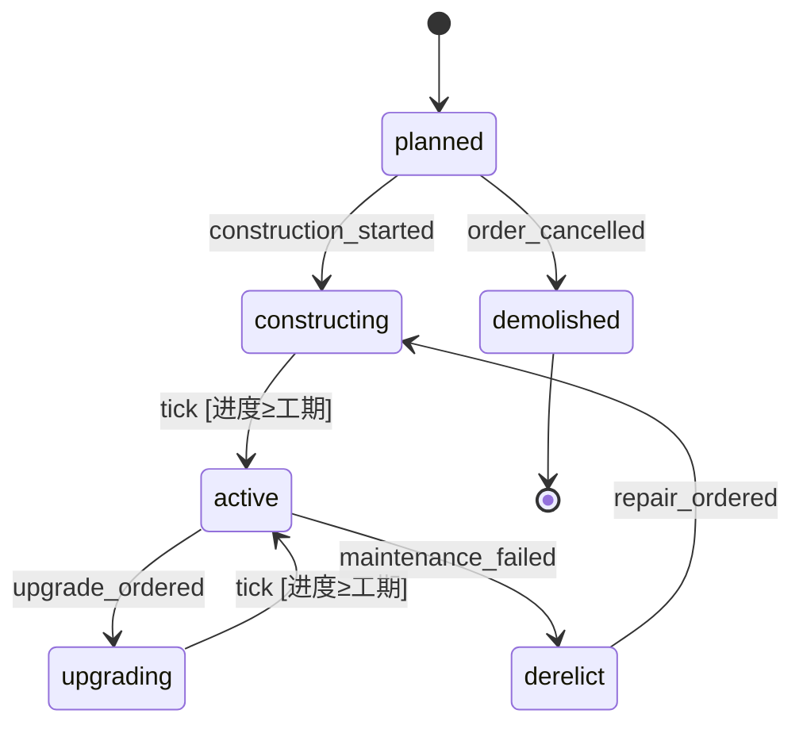

# FSM 细则 C:实体生命周期状态机(Entity Lifecycle FSM)

> **索引归属**:`fsm-index.md` §2 中的 C 类。本文不重复索引 §3 的共享概念(四档光谱、无状态化、转换表中心式、guard/action 四分、升级三件套、表驱动测试),仅在引用时标注 `[§3.x]`。
>
> **本类地位**:全部十类中最纯粹的事件/tick 驱动 FSM,是转换表中心式 `[§3.3]` 的最佳展示场。地基类文档——后续 D/E/F/G 的许多机制在此首次完整展开。

---

## 1. 定位

### 1.1 坐标

- **节奏**:tick 驱动为主,事件驱动为辅(玩家指令、外部事件可即时触发转换)
- **层**:逻辑层。状态是真相,**进存档**

### 1.2 覆盖范围

一切"有生老病死的模拟实体":建筑(规划→建造→运营→废弃)、作物(播种→生长→成熟→枯萎)、订单(下单→制作→质检→交付)、NPC 雇佣关系(候选→在职→离职)、设备(正常→磨损→维修中→报废)。

共同特征:**同一张状态图被大量实例共享**——一张"建筑生命周期图" × 几百个建筑实例。这是 C 类与其他类别最本质的区别,本类的三大特色问题(享元、序列化、批量结算)全部由它派生。

### 1.3 与相邻类别的边界

| 相邻类 | 区分标准 |
|--------|----------|
| A 角色/动作 | A 是帧驱动、单实例(或少量)、转换条件为连续物理量;C 是 tick/事件驱动、海量实例、转换条件为离散事实 |
| F 回合/阶段 | F 是"全局唯一的一台机"管流程推进;C 是"一图多实例"管个体演化。F 的阶段常是 C 类批量结算的**宿主** |
| G 叙事/任务 | G 的状态图本身是内容(每个任务一张不同的图,由内容侧生产);C 的状态图是架构(一类实体一张图,由程序侧定义)。任务实例的"未接→进行中→完成"形似 C,但当任务图数量大、结构各异时,归 G 处理 |

---

## 2. 状态与转换的典型形态

以通用的"建筑"为例(任何模拟实体同构):

### 2.1 状态集

```
planned        规划中(已下单,未开工)
constructing   建造中
active         运营中
upgrading      升级中
derelict       废弃(可修复)
demolished     已拆除(终态)
```

### 2.2 转换表

| from | event | guard | action | to |
|------|-------|-------|--------|-----|
| planned | construction_started | 资源足够 | 扣资源 | constructing |
| planned | order_cancelled | — | 返还预付 | demolished |
| constructing | tick | 建造进度 ≥ 工期 | 进度清零 | active |
| active | upgrade_ordered | 资源足够 ∧ 存在升级目标 | 扣资源 | upgrading |
| upgrading | tick | 升级进度 ≥ 工期 | 替换 def 引用 | active |
| active | maintenance_failed | — | 记录废弃时刻 | derelict |
| derelict | repair_ordered | 资源足够 | 扣资源 | constructing |
| * | demolish_ordered | 非 demolished | 结算残值 | demolished |

注意最后一行:`*`(任意状态)转换。C 类通常只有 1–2 条这种全局转换(拆除、销毁),**数量少到不构成引入 HSM `[§3.5]` 的理由**——转换表直接支持通配 from 即可。若这类行超过四五条,才考虑 HSM。

### 2.3 Mermaid(可由转换表生成)



### 2.4 两种事件来源的统一

C 类的转换事件有两个来源,必须在引擎层统一为同一种东西:

1. **外部事件**:玩家指令(`upgrade_ordered`)、其他系统的通知(`maintenance_failed`)——即时入队
2. **tick 事件**:每次结算对所有实体广播一个 `tick` 事件,guard 里比较进度/时长

统一的意义:引擎只有一条处理路径 `process(entity_ctx, event)`,tick 不是特殊机制,只是一个高频事件。这让测试 `[§3.8]` 不需要模拟时间流逝——喂 N 个 tick 事件即可。

---

## 3. 实现选型

**推荐:第 2 档(状态对象)+ 转换表中心式,状态对象享元共享。** 具体分工:

- 转换表 + guard/action 注册 → 一个 `LifecycleGraph` 对象,**每类实体全局一份**
- 当前状态 + 状态内数据(进度、时长)→ 每实体一份 ctx(RefCounted 状态类)
- 引擎 → 一个通用 `LifecycleEngine.process(graph, ctx, event)`,无实体类型知识

状态极简(≤4 态、无 guard)的实体可退到第 1 档 enum+match,不必强行上表。若状态图需要内容侧配置(不同 mod/DLC 的建筑有不同生命周期),升到第 4 档——但 C 类多数场合不需要,状态图是架构而非内容(见 1.3 与 G 的边界)。

### 最小代码骨架

```gdscript
class_name LifecycleGraph extends RefCounted
# 每类实体全局一份(享元)。构造后只读。

var _transitions: Dictionary = {}  # [from, event] -> TransitionDef

class TransitionDef extends RefCounted:
    var to: StringName
    var guard: Callable   # (ctx) -> bool,纯查询
    var action: Callable  # (ctx) -> void,唯一副作用点

func add(from: StringName, event: StringName, to: StringName,
         guard := Callable(), action := Callable()) -> void:
    ...

func find(from: StringName, event: StringName) -> TransitionDef:
    # 精确匹配优先,其次通配 [&"*", event]
    ...
```

```gdscript
class_name LifecycleEngine extends RefCounted
# 无实体类型知识,headless 可测

signal state_changed(entity_id: int, from: StringName, to: StringName)

func process(graph: LifecycleGraph, ctx, event: StringName) -> bool:
    var t := graph.find(ctx.state, event)
    if t == null:
        return false  # 非法事件:静默拒绝或 push_warning(见 6.4)
    if t.guard.is_valid() and not t.guard.call(ctx):
        return false
    var from := ctx.state
    if t.action.is_valid():
        t.action.call(ctx)
    ctx.state = t.to
    ctx.ticks_in_state = 0
    state_changed.emit(ctx.entity_id, from, t.to)
    return true
```

---

## 4. 特色问题精讲

### 4.1 享元的落地细节:数据到底切在哪

`[§3.2]` 说"可变数据全放 ctx",C 类因为实例量大,还需要更细的三层切分:

| 数据 | 归属 | 例 |
|------|------|-----|
| 图结构、guard/action 逻辑 | LifecycleGraph(全局一份) | 转换表本身 |
| 每类实体的参数 | 定义层 Resource(每 def 一份) | 工期、造价、产出 |
| 每实例的进度 | ctx(每实体一份) | state、ticks_in_state、progress |

常见错误是把"工期"存进 ctx——它是定义不是状态,guard 应写成 `ctx.progress >= ctx.def.build_duration`,而不是在实体创建时把工期拷进 ctx。拷贝的代价在改平衡性时爆发:改了 def 的工期,存档里几百个实体的旧工期纹丝不动。**ctx 只存"这个实体独有且会变的",其余一律引用定义层。**

### 4.2 状态内时间:tick 计数器,永远不用 Timer 节点

C 类一半以上的转换是"在某状态待满 N tick"。纪律:

- **时间数据**:ctx 里一个 `ticks_in_state: int`(引擎在每次成功转换时清零,每次 tick 事件自增)
- **判断**:guard 里比较 `ticks_in_state >= def.duration`
- **禁止**:`SceneTree.create_timer()` / `Timer` 节点承载逻辑层时间

理由三连:Timer 依赖场景树(headless 测试死);Timer 是墙钟时间,与游戏速度/暂停脱钩(加速三倍时建筑不会快建);Timer 的剩余时间极难正确序列化。**逻辑层的时间只有一种形态:整数 tick 计数,存在 ctx 里,天然可存档、可加速、可测试。**

### 4.3 批量结算:一个 tick 内几百个实体转换的确定性

一次 tick 广播下去,几百个实体的 guard 各自评估、action 各自执行——三个必须显式决策的问题:

**(a) 顺序确定性。** 若 action 会读写共享资源(建成建筑增加电力供给,而另一栋的 guard 在查电力),遍历顺序就影响结果。纪律:**实体遍历顺序必须确定**(按 entity_id 排序,禁止依赖 Dictionary 的插入序等实现细节),这是回放调试和跨平台一致性的前提。

**(b) 快照读。** 更强的解法是两阶段:先对全体实体**只评估 guard**(基于 tick 开始时的状态快照),收集"待转换清单",再统一执行 action。这消灭了"同 tick 内 A 的转换结果影响 B 的判定"的顺序依赖——与模块边界篇讲过的"tick 内先结算后发布"是同一原则在实体粒度的应用。小型项目可以只做 (a);实体间通过共享资源强耦合的模拟(电力网、供应链)必须做 (b)。

**(c) 级联转换策略。** 建筑本 tick 建成(constructing→active),它应不应该在同一 tick 里继续产出、甚至继续满足下一个转换的 guard?必须明文定一条策略,推荐:**每实体每 tick 至多一次生命周期转换**。简单、可预测、杜绝无限级联(A→B→A 的死循环)。需要"建成即产出"的手感,让 active 的 enter 逻辑处理首次产出,而不是放开级联。

### 4.4 序列化与版本演化

**存什么**:每实体存 `{state: StringName, ticks_in_state: int, 其余 ctx 字段}`。状态对象、转换表、引擎一概不存——读档时从代码/定义层重建 `[§3.2]`。

**版本演化**是 C 类序列化的真正难题:游戏更新后状态图变了,旧档里的状态名可能已不存在。防线两道:

1. **读档校验**:恢复每个实体时,查 `graph.has_state(saved_state)`,不存在则进入迁移
2. **迁移映射表**:随代码维护一张 `{旧状态名: 新状态名或迁移函数}`,例如砍掉 `upgrading` 状态后,`{&"upgrading": &"active"}`(并在迁移函数里返还升级费用)。查不到映射的落到该实体类型的**安全兜底态**(通常是 active 或 derelict),并记录日志

纪律:**状态名一旦出现在正式版存档中,重命名等同于删除**——必须走迁移表,不能只改代码里的字符串。这也是状态名用 `StringName` 常量集中定义、禁止裸字符串散落的理由之一。

### 4.5 海量实体的性能形态

C 类实体成百上千时,"每实体每 tick 广播事件"可能出现浪费——大量 active 状态的实体每 tick 评估 guard 却永远不转换。两个成熟优化(按需引入,勿预支):

- **按状态分桶**:引擎维护 `{state: Set[entity_id]}`,tick 事件只发给"存在 tick 转换出边"的状态桶(active 若没有 tick 出边,整桶跳过)
- **到期队列**:对"待满 N tick"型转换,入态时算出到期 tick 号压入优先队列,每 tick 只弹出到期实体。把 O(全体) 变成 O(本 tick 到期数)

两者都只是引擎内部优化,**不改变转换表语义,不泄漏到 graph/ctx 的接口上**——这是接口边界纪律的一次直接受益:优化前后,依赖方零改动。

---

## 5. 升级路径

- **并行机 `[§3.5]` 是 C 类最常用的升级**:生命周期(constructing/active/…)与状态效果(正常/受灾/加成中)是两个正交维度,状态名出现 `active_disaster` 式双形容词即拆。拆后交互靠 guard 互查:效果机的"受灾"作为生命周期机某些转换的 guard 条件。
- **HSM 很少需要**:C 类的全局转换通常只有拆除/销毁一两条,通配 from 足够(见 2.2)。
- **退化检查**:若某实体的"状态图"是严格线性、无分支、无回边(播种→发芽→成熟→收获),按 `[§3.6]` 它是序列不是状态机——一个阶段游标 + 阶段时长数组更诚实。C 类里作物、订单常有此形,别为它们上全套 FSM。
- **叛逃到 G**:实体的状态图开始"每个实例结构不同、由内容侧定义"时,它已经是叙事/任务问题,转用 G 类的数据驱动方案。

---

## 6. 坏味道清单(C 类特有)

1. ❌ **状态存在节点上**:`building_node.state` ——生命周期是规则真相,归运行时状态层;节点只订阅 `state_changed`
2. ❌ **工期/造价等定义数据被拷进 ctx**(见 4.1)——改平衡时旧档失效
3. ❌ **Timer/create_timer 驱动生命周期**(见 4.2)——headless 死、变速失效、序列化噩梦
4. ❌ **非法事件静默吞掉且无告警**:`process` 返回 false 时至少 push_warning(带 entity_id/state/event)。非法转换尝试是极好的 bug 探测器——UI 在错误状态下发出了指令,往往意味着 UI 的可用性判断与规则层脱节
5. ❌ **UI 直接改 ctx.state**——一切状态变更必须走引擎的 process,否则 guard/action/信号全被绕过
6. ❌ **遍历顺序依赖 Dictionary 迭代序**(见 4.3a)
7. ❌ **状态名裸字符串散落各文件**——集中为 StringName 常量,为迁移表(4.4)留住唯一真名

---

## 7. 测试要点(在 `[§3.8]` 表驱动基线上追加)

1. **tick 时长测试**:构造 ctx 置于 constructing,喂 `工期-1` 个 tick 断言未转换,再喂 1 个断言转换——时间型 guard 的标准用例
2. **批量确定性测试**:同一批实体、同一事件序列,打乱实体注册顺序后重跑,断言最终状态集合完全一致(验证 4.3a/b)
3. **级联抑制测试**:构造可连续满足两条转换的 ctx,单 tick 后断言只走了一步(验证 4.3c 策略)
4. **存档往返测试**:实体推进到每个非终态的中途(ticks_in_state > 0),序列化→反序列化→继续喂 tick,断言行为与不间断运行完全一致
5. **迁移测试**:手工构造含已废弃状态名的存档数据,断言迁移表生效、兜底态正确、无崩溃

---

## 8. AI 代理协作约定(供 CLAUDE.md 摘录)

1. 实现任何模拟实体的生命周期前,先产出转换表(from/event/guard/action/to 五列)并附 Mermaid 图,经确认后再写代码。
2. 生命周期引擎与 graph/ctx 均为纯 RefCounted;代码中出现 `Timer`、`create_timer`、`get_node` 即视为实现错误,重做。
3. ctx 只存实例独有的可变数据;定义层数值一律通过 def 引用读取,禁止拷贝。
4. 状态名使用集中定义的 StringName 常量;新增/重命名/删除状态时,同步更新版本迁移映射表。
5. 每实体每 tick 至多一次转换;如需级联行为,在 enter 中实现,不得放开级联限制。
6. 交付必须包含第 7 节五类测试;批量确定性测试与存档往返测试不可省略。
